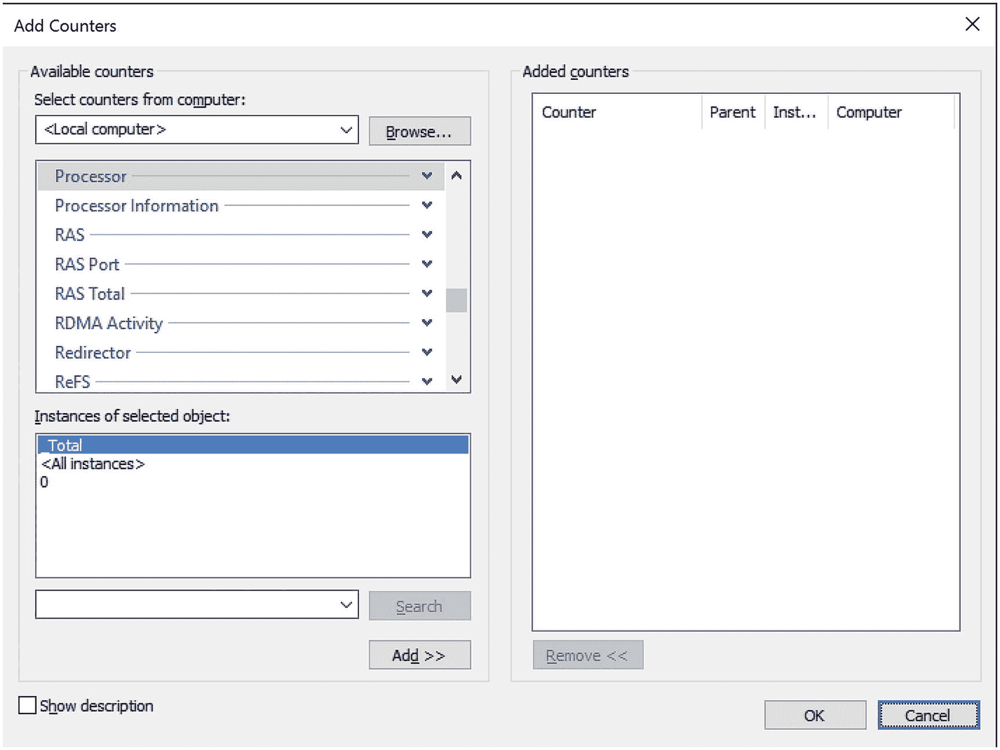
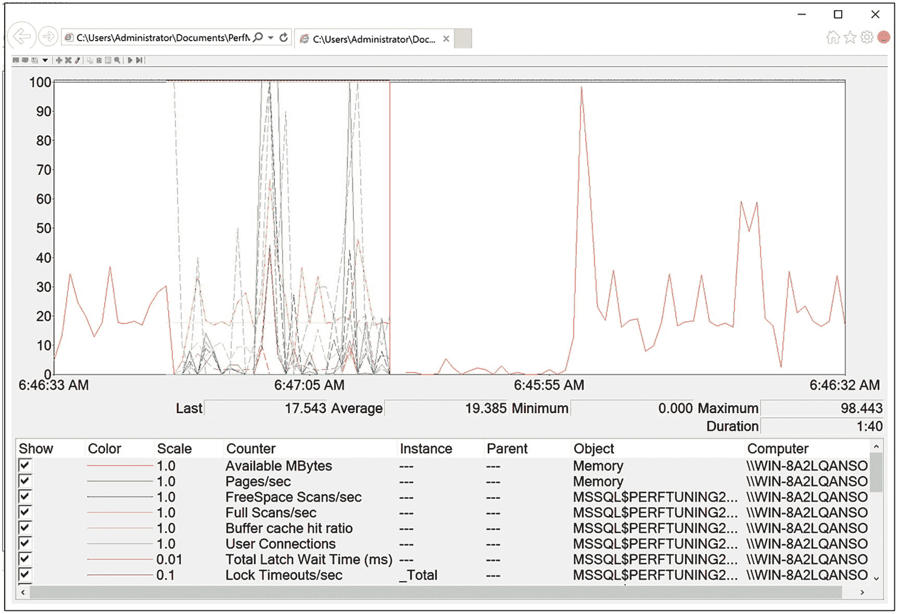
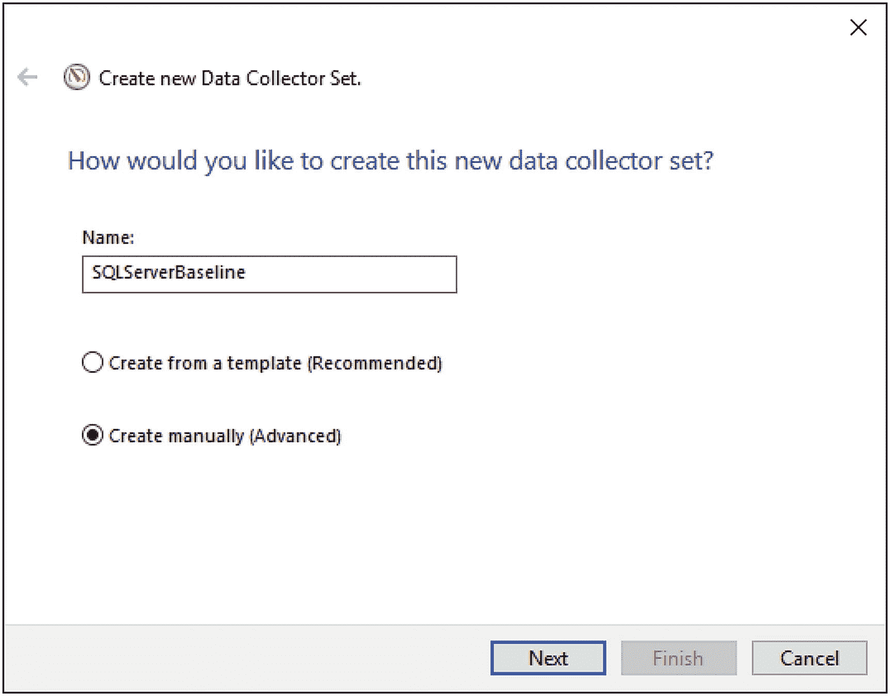
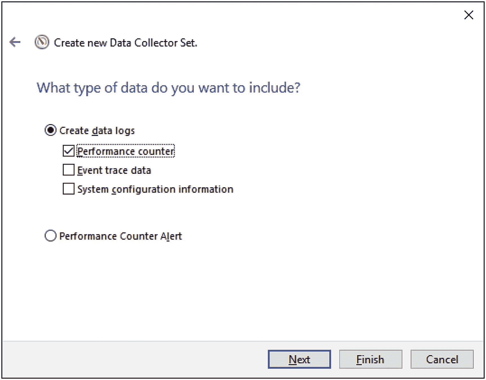
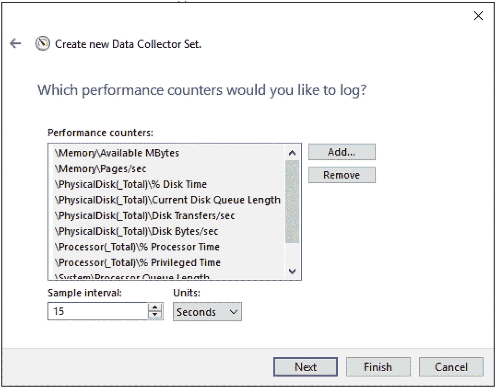

# 5. 创建基线

在前三章中，您学到了很多关于由内存、磁盘和 CPU 引起的各种可能的系统瓶颈的知识。我还介绍了一些用于收集系统这些部分数据的性能监视器指标。在大多数计数器的描述中，我都提到了将您的指标与基线进行比较。本章将介绍如何收集您的指标，以便您拥有该基线用于后续比较。我将概述如何配置一种自动化方法来收集这些信息。基线是理解系统行为的基础部分，因此您应该始终有一个可用的基线。本章涵盖以下主题：

*   监控虚拟机和托管机器的注意事项
*   如何设置性能监视器指标的自动收集
*   使用性能监视器时避免问题的注意事项
*   Azure SQL Database 的基线
*   创建基线

## 监控虚拟机和托管机器的注意事项

在开始创建基准之前，我将讨论一下虚拟机。越来越多的 SQL Server 实例运行在虚拟机上。当你使用虚拟机或将虚拟机托管在亚马逊或微软 Azure 等远程环境中时，许多标准性能计数器将不再显示准确的信息。如果你在虚拟机内部监控这些计数器，从故障排除的角度来看，你的数值可能没有帮助。如果你在物理机上监控这些计数器（假设你能访问它，这台物理机无疑被多个不同的虚拟机所共享），你将无法识别特定 SQL Server 实例的资源瓶颈。因此，在使用虚拟机时，必须监控额外的信息。你收集的大多数关于磁盘和网络性能的信息在虚拟机环境中仍然适用。所有查询度量信息对于那些查询来说是准确的。查询运行多长时间、发生了多少次读取，这些就是确切的时长和读取量。你主要会发现内存和 CPU 指标完全不同且相当不可靠。

这是因为在虚拟化服务器环境中，CPU 和内存在机器之间是共享的。你可能在一个 CPU 上启动一个进程，却在另一个完全不同的 CPU 上完成它。某些虚拟环境实际上会根据机器对内存需求的变化而改变分配给该机器的内存在。面对这类变化，传统的监控方式就不适用了。好消息是，主要的虚拟机供应商都提供了关于如何监控他们的系统以及如何在他们的系统中使用 SQL Server 的指导。在监控虚拟机的具体细节上，你很大程度上可以依赖这些第三方文档。以两个最常见的虚拟机监控程序 `VMware` 和 `HyperV` 为例，这里分别是来自两者的文档：

*   `VMware` 监控虚拟机性能 ([`http://bit.ly/1f37tEh`](http://bit.ly/1f37tEh))

*   在 `HyperV` 上测量性能 ([`http://bit.ly/2y2U6Iw`](http://bit.ly/2y2U6Iw))

队列计数器，例如 `处理器队列长度`，在虚拟机内部监控时仍然适用。这些指标表明虚拟机本身资源匮乏，从而导致你的 SQL Server 实例资源匮乏，不得不等待访问虚拟 CPU。需要记住的重要一点是，在虚拟机上，CPU 和内存的速度可能会变慢，因为虚拟机管理系统会对系统资源的调用形成干扰。由于托管资源的共享特性，你可能还会在托管虚拟机上看到较慢的 I/O。

在 `Azure SQL Database` 和任何 `SQL Server 2016` 或更高版本的实例中，还有一个内置的、自动化的基准机制，称为 `Query Store`（查询存储）。我们将在第 11 章详细介绍 `Query Store`。

另一个可用于了解系统行为的机制是 `DMV`（动态管理视图）。很难将它们与基准等同视之，因为它们会因缓存、重启、故障转移和其他机制而发生很大变化。然而，它们确实提供了一种查看查询性能聚合视图的方法。我们将在第 6 章及本书的后续部分更详细地介绍它们。

## 创建基准

现在你已经了解了一些主要的性能计数器，让我们看看如何将这些计数器整合起来创建系统基准。以下是需要遵循的步骤：

1.  创建一个可复用的性能计数器列表。
2.  使用你的性能计数器列表创建一个计数器日志。
3.  最小化 `性能监视器` 的开销。

### 创建可复用的性能计数器列表

在连接到 SQL Server 系统所在同一网络的 `Windows Server 2016` 机器上运行 `性能监视器` 工具。通过 `属性` ➤ `数据` ➤ `添加计数器` 对话框，将性能计数器添加到 `性能监视器` 的 `查看图表` 显示中，如图 5-1 所示。

图 5-1：添加 `性能监视器` 计数器

例如，要添加性能计数器 `SQLServer:Latches:Total Latch Wait Time(ms)`，请按照以下步骤操作：

1.  选择选项 `从计算机选择计数器`，并在相应的输入字段中指定运行 SQL Server 的计算机名称；或者，如果在本地运行 `性能监视器`，你会看到“<本地计算机>”，如图 5-1 所示。
2.  单击性能对象 `SQLServer:Latches` 旁边的箭头。
3.  从性能计数器列表中选择 `Total Latch Wait Time(ms)` 计数器。
4.  单击 `添加` 按钮，将此性能计数器添加到待添加计数器的列表中。
5.  根据需要继续添加其他计数器。完成后，单击 `确定` 按钮。

在为你的基准创建可复用列表时，你可以重复上述步骤来添加表 5-1 中列出的所有性能计数器。

表 5-1：用于分析 SQL Server 性能的性能监视器计数器

| 对象(实例[,实例 N]) | 计数器 |
| --- | --- |
| `Memory` | `Available MBytes` `Pages/sec` |
| `PhysicalDisk(数据磁盘, 日志磁盘)` | `% Disk Time` `Current Disk Queue Length` `Disk Transfers/sec` `Disk Bytes/sec` |
| `Processor(_Total)` | `% Processor Time` `% Privileged Time` |
| `System` | `Processor Queue Length` `Context Switches/sec` |
| `Network Interface(网卡)` | `Bytes Total/sec` |
| `Network Segment` | `% Net Utilization` |
| `SQLServer:Access Methods` | `FreeSpace Scans/sec` `Full Scans/sec` |
| `SQLServer:Buffer Manager` | `Buffer cache hit ratio` |
| `SQLServer:Latches` | `Total Latch Wait Time (ms)` |
| `SQLServer:Locks(_Total)` | `Lock Timeouts/sec` `Lock Wait Time (ms)` `Number of Deadlocks/sec` |
| `SQLServer:Memory Manager` | `Memory Grants Pending` `Target Server Memory (KB)` `Total Server Memory (KB)` |
| `SQLServer:SQL Statistics` | `Batch Requests/sec` `SQL Re-Compilations/sec` |
| `SQLServer:General Statistics` | `User Connections` |

添加完所有性能计数器后，单击 `确定` 关闭 `添加计数器` 对话框。要将计数器列表保存为 `.htm` 文件，请在 `性能监视器` 的右侧框架中任意位置右键单击，然后选择 `将设置另存为` 菜单项。

该 `.htm` 文件列出了所有性能计数器，可用作基础计数器集来为同一台 SQL Server 计算机创建计数器日志或交互式查看 `性能监视器` 图表。要将此计数器列表用于其他 SQL Server 计算机，请在 `记事本` 等编辑器中打开该 `.htm` 文件，并将所有出现的 `\\SQLServerMachineName` 替换为空（即空字符串）。

Erin Stellato 在文章“自定义性能监视器的默认计数器” ([`http://bit.ly/1brQKeZ`](http://bit.ly/1brQKeZ)) 中概述了一个快捷方法。还有一个更简单的方法来处理其中部分数据，即使用微软提供的工具 `Performance Analysis of Logs (PAL)`，可在 [`https://bit.ly/2KeJJmy`](https://bit.ly/2KeJJmy) 获取。

你还可以使用此计数器列表文件在 `Internet` 浏览器中交互式查看 `性能监视器` 图表，如图 5-2 所示。

图 5-2：在 Internet 浏览器中查看性能监视器

## 使用性能计数器列表创建计数器日志

性能监视器提供了计数器日志功能，用于保存一段时间内多个计数器的性能数据。您可以使用性能监视器查看已保存的计数器日志，以分析性能数据。通常，从已定义的性能计数器列表创建计数器日志会更为方便。相较于通过图形用户界面查看数据，仅收集数据是自动化方法的首选，这有助于为服务器性能故障排查或建立性能基线做准备。

在性能监视器中，展开 `数据收集器集` ➤ `用户定义`。右键单击并选择 `新建` ➤ `数据收集器集`。定义集合的名称，通过点击相应的单选按钮将其设为手动创建；然后像我配置图 5-3 那样点击 `下一步`。

图 5-3: 为数据收集器集命名

您需要定义收集的数据类型。在本例中，在 `创建数据日志` 单选按钮下勾选 `性能计数器` 复选框，然后点击 `下一步`，如图 5-4 所示。

图 5-4: 为数据收集器集选择数据日志和性能计数器

在这里，您可以使用先前图 5-1 中所示的相同 `添加计数器` 对话框来定义要收集的性能对象。点击 `下一步` 允许您定义目标文件夹。点击 `下一步`，然后选择 `打开此数据收集器集的属性` 单选按钮，并点击 `完成`。您可以安排计数器日志在特定时间自动启动，并在经过一定时间段后或在特定时间停止。您可以通过 `计划` 选项卡配置这些设置。可以在图 5-5 中看到一个示例。

图 5-5: 在数据收集器集属性中定义的计划

图 5-6 总结了已选择的计数器以及收集这些计数器的频率。

图 5-6: 定义性能监视器计数器日志

### 注意

我将在接下来的部分为这些设置提供额外建议。

有关如何使用性能监视器创建计数器日志的更多信息，请参阅微软知识库文章 "Windows Server 2016 性能调优指南" (`http://bit.ly/1icVvgn`)。

