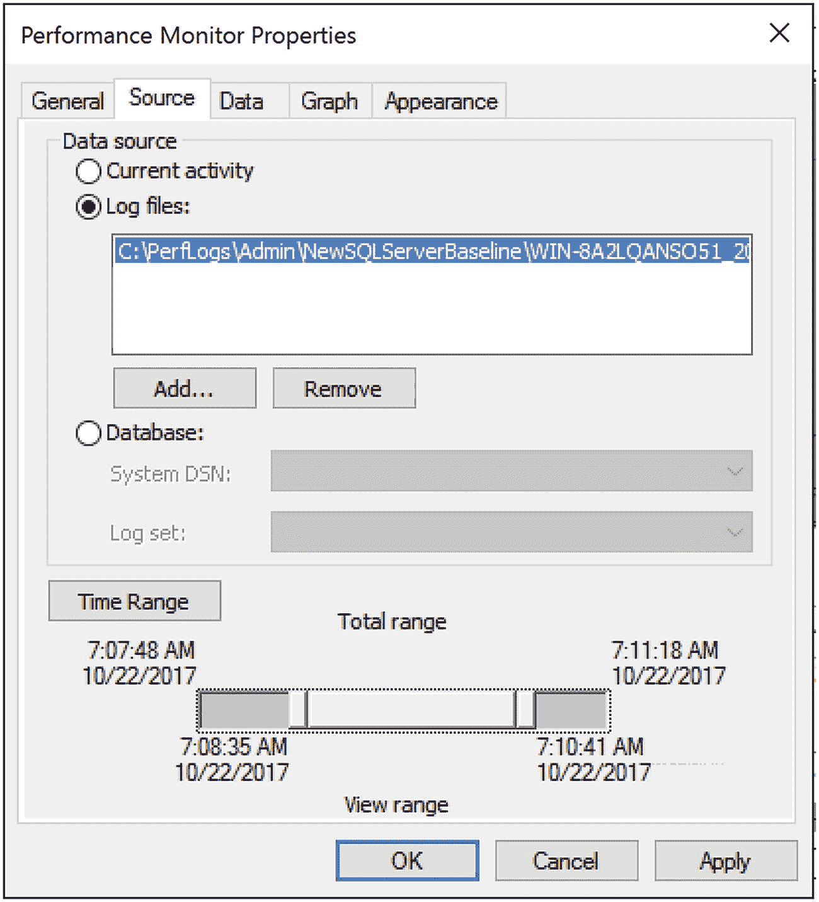

# 性能监视器使用注意事项

`性能监视器` 工具的设计旨在尽可能减少开销（如果使用正确）。为了最小化使用此工具对系统的影响，请考虑以下建议：

*   限制计数器数量，特别是性能对象的数量。
*   使用计数器日志，而不是交互式地查看 `性能监视器` 图表。
*   交互式查看图表时，远程运行 `性能监视器`。
*   将计数器日志文件保存到不同的本地磁盘。
*   增加采样间隔。

让我们更详细地考虑每一点。

## 限制计数器数量

使用较小的采样间隔监控大量的性能计数器可能会给系统带来一定程度的开销。这种开销主要来自于您正在监控的性能对象的数量，因此明智地选择它们很重要。所选性能对象的计数器数量不会增加太多开销，因为它只是给出了对象本身的一个属性。因此，了解您想监控哪些对象以及为什么监控很重要。

## 优先使用计数器日志

使用计数器日志，而不是交互式地查看 `性能监视器` 图表，因为 `性能监视器` 图表绘制在开销方面成本更高。监控当前活动应仅限于短期数据查看、故障排除和诊断。通过计数器日志报告的性能数据是采样的，意味着数据是定期收集而不是实时跟踪的，而 `性能监视器` 图表则是在事件发生时实时更新的。使用计数器日志将减少这种开销。

## 远程查看性能监视器图表

由于使用 `性能监视器` 图表查看实时性能数据会在系统上产生相当大的开销，因此请在另一台机器上远程运行该工具，并通过该工具连接到 SQL Server 系统。要远程连接到 SQL Server 计算机，请在连接到 SQL Server 计算机所在网络的机器上运行 `性能监视器` 工具。

在 `从计算机选择计数器` 框中键入 SQL Server 计算机的名称（或 IP 地址）。请注意，如果您通过 Windows Server 2016 终端服务会话连接到生产服务器，该工具的主体部分仍将在服务器上运行。

但是，我仍然建议您避免使用 `性能监视器` 图表来查看实时数据。您可以使用图表查看通过计数器日志收集的文件，并应倾向于使用这些日志。

## 本地保存计数器日志

收集计数器日志的性能数据不会产生显示任何图表的开销。因此，在使用计数器日志模式时，将计数器值本地记录在 SQL Server 系统上比通过网络传输性能数据更有效。将计数器日志文件放在本地磁盘上，而不是被监控的磁盘上（即您的 SQL Server 数据和日志文件所在磁盘）。

然后，在收集数据后，将该计数器日志复制到您的本地机器进行分析。这样，您只处理副本，而不会增加存储位置的 I/O 开销。

## 增加采样间隔

由于您主要对基线监控期间的资源利用模式感兴趣，您可以轻松地将性能数据采样间隔增加到 60 秒或更长，以减小日志文件大小并减少磁盘 I/O 的需求。您可以使用较短的采样间隔来检测和诊断时序问题。即使在交互式查看 `性能监视器` 图表时，也应将采样间隔从默认的每秒一个样本增加。请记住，增大或减小采样间隔会影响数据的粒度以及数量。您必须仔细权衡这些选择。

### 针对基线的系统行为分析

数据库应用程序的默认行为会随时间变化，原因包括以下因素：

*   数据量及分布变化
*   用户群增长
*   应用程序使用模式的改变
*   应用程序行为的增改
*   新服务包或软件升级的安装
*   硬件变更

由于这些变化，为数据库服务器创建的基线会逐渐失去其意义。将系统当前行为与旧基线进行比较可能并不总是准确的。因此，通过定期创建新基线来保持基线的时效性至关重要。同时，将之前的基线日志归档以便日后需要时参考也是有益的。所以，虽然旧的基线确实不适用于日常操作，但它们有助于你建立模式和长期趋势。

可以使用 `Performance Monitor`（性能监视器）工具，通过以下步骤分析系统基线或当前行为的计数器日志：

*图 5-7 为日志分析定义时间范围*

1.  打开计数器日志。使用 `Performance Monitor` 工具栏上的 `查看日志文件数据` 项，并选择日志文件名称。
2.  添加所有要分析的性能计数器。请注意，选择列表中只显示在创建计数器日志时选定的性能对象、计数器和实例。
3.  通过相应调整时间范围来分析一天中不同时段的系统行为，如图 5-7 所示。

在性能审查期间，你可以通过将性能计数器的当前值与最新基线进行比较，来分析数据库的系统级行为。比较性能数据时请考虑以下几点：

*   在两种情况下使用相同的性能计数器集合。
*   根据单个计数器的具体情况，比较其最小值、最大值和平均值。我在前面已经解释了计数器的具体数值。
*   如前所述，某些计数器具有绝对的好/坏值。这些计数器的当前值无需与基线值进行比较。例如，如果 `Deadlocks/min`（每分钟死锁数）计数器的当前平均值为 10，则表明系统正遭受大量死锁。尽管这不需要与基线比较，但审查相应的基线值仍然是有利的，因为你的死锁问题可能已存在很长时间。拥有归档的基线日志有助于检测死锁的演变发生情况。
*   有些计数器没有明确的好/坏值。因为它们的值取决于应用程序，所以必须与相应的基线计数器进行相对比较。例如，SQL Server 的 `User Connections`（用户连接数）计数器的当前值并不能表明应用程序有任何好坏。但将其与相应的基线值进行比较，可能会发现用户连接数大幅增加，这表明工作负载增加了。
*   比较当前和基线计数器日志中计数器的数值范围。计数器单个值的波动会通过数值范围得到归一化。
*   比较一天中同一时段的日志。对于大多数应用程序，使用模式在一天的不同时段会有所不同。如前所述，调整计数器日志的时间范围，以获取特定时间的计数器最小值、最大值和平均值。

一旦识别出系统级瓶颈，就应分析应用程序的内部行为以确定瓶颈原因。识别并优化瓶颈源头将有助于高效利用系统资源。

## 针对 Azure SQL Database 的基线

正如你希望为运行在物理机和虚拟机上的 SQL Server 实例建立基线一样，你同样需要为 Azure SQL Database 的性能建立基线。为此你无法捕获 `Performance Monitor` 指标。此外，Azure SQL Database 并非以虚拟机或物理服务器的形式呈现，它是一种数据库即服务。因此，你无法测量 CPU 或磁盘使用率。取而代之的是，微软定义了一种称为数据库事务单元（DTU）的性能度量单位。你可以观察数据库随时间的 DTU 使用情况。

DTU 被定义为 I/O、CPU 和内存的综合度量。它并不像其名称可能暗示的那样代表字面上的事务，而是服务内数据库性能的一种度量。你可以查询 `sys.resource_stats` 来查看 CPU 使用率和存储数据。它保留 14 天的运行历史记录，并将数据按五分钟间隔进行聚合。

虽然 Azure 门户提供了观察 DTU 使用情况的机制，但它并未提供建立基线的机制。因此，你应该使用 Azure SQL Database 专用的 DMV `sys.dm_db_resource_stats`。此 DMV 维护有关给定 Azure SQL Database 的 DTU 使用情况的信息。它包含 15 分钟聚合的一小时信息。要像对 SQL Server 实例那样建立基线，你需要随时间捕获这些数据。将 `sys.dm_db_resource_stats` 中显示的信息收集到一个表中，就是为 Azure SQL Database 的性能指标建立基线的方法。

Azure SQL Database 默认启用了查询存储，因此你可以使用它来了解系统上发生的情况。

## 小结

在本章中，你学习了如何使用 `Performance Monitor` 工具分析 SQL Server 的整体行为，以及性能不佳的数据库应用程序对系统资源的影响。你还了解了作为服务器和数据库监控一部分的基线的建立。借助这些工具，你将能够理解何时出现了偏离标准行为的情况。你需要定期收集基线，以使数据不会过时。

在下一章中，你将学习如何分析数据库应用程序的工作负载以进行性能调优。

