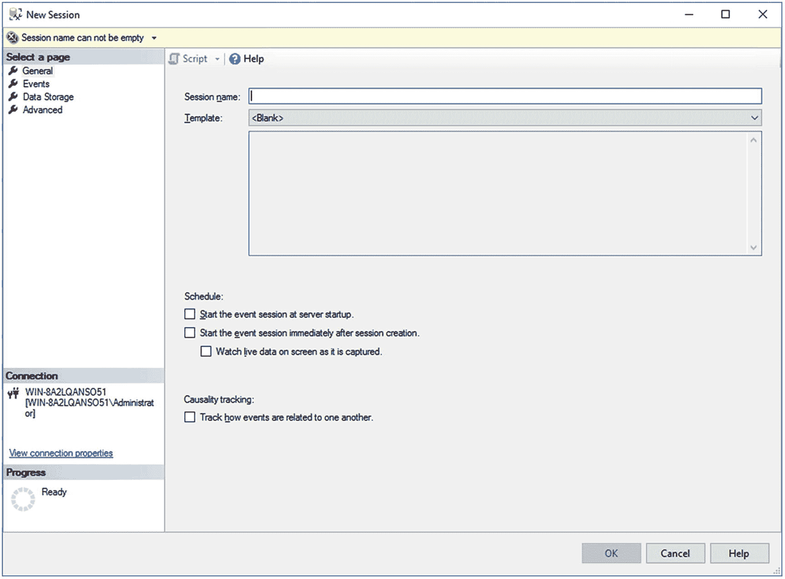

# 6. 查询性能指标

SQL Server 性能缓慢的一个常见原因是繁重的数据库应用程序工作负载——即查询本身的性质和数量。因此，要分析系统瓶颈的原因，检查数据库应用程序工作负载并识别对系统资源造成最大压力的 SQL 查询至关重要。要做到这一点，你可以使用扩展事件和其他 Management Studio 工具。

在本章中，我将涵盖以下主题：

*   扩展事件的基础知识
*   如何使用扩展事件分析 SQL Server 工作负载并识别高成本的 SQL 查询
*   如何通过动态管理对象跟踪查询性能

##### 扩展事件

`扩展事件` 在 `SQL Server 2008` 中被引入，但由于没有图形用户界面 (`GUI`) 并且需要编写相当复杂的代码来设置，它并未被广泛用于捕获性能指标。随着 `SQL Server 2012` 的发布，一个用于管理 `扩展事件` 的 `GUI` 被引入，消除了阻碍 `扩展事件` 成为收集查询性能指标以及其他度量和措施的首选机制的最后障碍。之前的最佳指标收集机制——跟踪事件，已被弃用且不再积极开发。多年来，没有新增任何跟踪事件。用于生成和使用跟踪事件的 `GUI` 工具 `Profiler`，如果在生产实例上不当使用，甚至可能导致性能问题。因此，本书中的示例将主要使用 `扩展事件`，并以查询存储作为辅助机制（查询存储在第 11 章中介绍）。

`扩展事件` 允许你执行以下操作：

*   图形化监视 `SQL Server` 查询
*   在后台收集查询信息
*   分析性能
*   诊断死锁等问题
*   调试 `Transact-SQL (T-SQL)` 语句

你还可以使用 `扩展事件` 来捕获在 `SQL Server` 实例上执行的其他类型的活动。你可以通过图形前端或直接调用存储过程的 `T-SQL` 命令来设置 `扩展事件`。定义 `扩展事件` 会话最有效的方式是通过 `T-SQL` 命令，但通过 `GUI` 开始学习会话是一个不错的起点。

### 扩展事件会话

你可以在 `Management Studio GUI` 中找到 `扩展事件` 工具。你可以使用对象资源管理器 (`Object Explorer`) 导航到给定实例上的 `Management` 文件夹以找到 `扩展事件` 文件夹。从那里，你可以查看系统上已构建的会话。要开始设置你自己的会话，只需右键单击 `Sessions` 文件夹并选择 `New Session`。有一个向导可用于设置会话，但它能做的普通 `GUI` 也都能做，而且普通 `GUI` 很容易使用。此时会打开一个窗口到第一个页面，称为 `General`，如图 6-1 所示。

图 6-1
`扩展事件` 新建会话窗口，`General` 页面

你需要提供一个会话名称。我强烈建议给它一个清晰的名称，以便以后查看时知道该会话的作用。你还可以选择使用模板。模板是预定义的会话，只需最少的工作即可投入使用。在 `Query Execution` 类别下，有五个与查询调优直接相关的模板：

*   `Query Batch Sampling`：此模板将捕获服务器上所有活动会话中 20% 的查询和过程调用。
*   `Query Batch Tracking`：此模板捕获服务器上所有会话的所有查询和过程。
*   `Query Detail Sampling`：此模板包含一组事件，用于捕获服务器上所有活动会话中 20% 的查询和过程的每条语句。
*   `Query Detail Tracking`：此模板与 `Query Batch Tracking` 相同，但也会捕获系统中每条语句的详细信息。这会产生大量数据。
*   `Query Wait Statistic`：此模板捕获所有活动会话中 20% 的查询和过程的每条语句的等待统计信息。

此外，还有模拟你习惯使用的 `Profiler` 模板的模板。另外，在 `SQL Server 2017` 中引入了一种额外的方法，可以用最小的工作量快速查看查询性能。在对象资源管理器窗格的底部有一个新文件夹 `XE Profiler`。展开该文件夹，你会发现两个 `扩展事件` 会话，它们定义了与你在 `Profiler` 中通常看到的类似的查询监视。我将在本章后面介绍这些选项打开的“实时数据”窗口。现在，我们将跳过这些模板和 `XE Profiler` 报告，来设置你自己的事件，以便你了解其操作方法。

### 注意

没有什么是免费的或没有风险的。`扩展事件` 是一个比旧的跟踪事件高效得多的系统信息收集机制，但它并非没有成本和风险。根据你定义的事件，以及本章后面将更详细讨论的一些全局字段，实施 `扩展事件` 可能会对你的系统产生影响。在生产系统上使用这些事件时要谨慎，以确保不会造成负面影响。查询存储能以较小的影响提供大量信息，而使用 `DMO`（本章后面详述）的影响更小。在某些情况下，这些替代方案是可行的。

查看新建会话窗口的第一页，除了命名会话之外，还有许多其他选项。你必须决定是否希望会话在服务器启动时自动启动。长期收集性能指标会产生大量数据，你需要处理这些数据。你还可以决定是否希望在创建会话后立即启动它，以及是否希望查看实时数据。最后，最后一个选项是确定是否要跟踪事件因果关系。我们将在本章后面讨论这一点。

如你所见，新建会话窗口实际上已经很接近向导了，它只是缺少一个“下一步”按钮。一旦你提供了名称并在此处做出了其他选择，请点击窗口左侧的下一页 `Events`，如图 6-2 所示。

图 6-2
`扩展事件` 新建会话窗口，`Events` 页面

一个 `event` 代表了在 `SQL Server` 中执行的各种活动，在某些情况下也代表底层操作系统的活动。围绕事件目标、事件包和事件会话有一个完整的架构，但使用 `GUI` 意味着你不必担心所有这些细节。在本章后面展示如何编写会话脚本时，我将介绍部分架构。

对于性能分析，你主要关注那些能帮助你判断在 `SQL Server` 上执行的各种活动所造成资源压力程度的事件。这里的 `resource stress` 是指以下内容：

*   `T-SQL` 活动涉及何种 `CPU` 利用率？
*   使用了多少内存？
*   涉及多少 `I/O`？
*   `SQL` 活动执行了多长时间？
*   特定查询执行的频率如何？
*   查询遇到了哪些错误和警告？

你可以在事件完成后计算 `SQL` 活动的资源压力，因此用于性能分析的主要事件是那些代表 `SQL` 活动完成的事件。表 6-1 描述了这些事件。

表 6-1
用于监视查询完成的事件

| 事件类别 | 事件 | 描述 |
| --- | --- | --- |
| 执行 | `rpc_completed` | 远程过程调用完成事件 |
|   | `sp_statement_completed` | 存储过程内的 `SQL` 语句完成事件 |
|   | `sql_batch_completed` | `T-SQL` 批处理完成事件 |
|   | `sql_statement_completed` | `T-SQL` 语句完成事件 |

一个 `RPC` 事件表明该存储过程是通过 `OLEDB` 命令使用远程过程调用 (`RPC`) 机制执行的。如果数据库应用程序使用 `T-SQL` `EXECUTE` 语句执行存储过程，则该存储过程将被视为 `SQL` 批处理而非 `RPC`。

