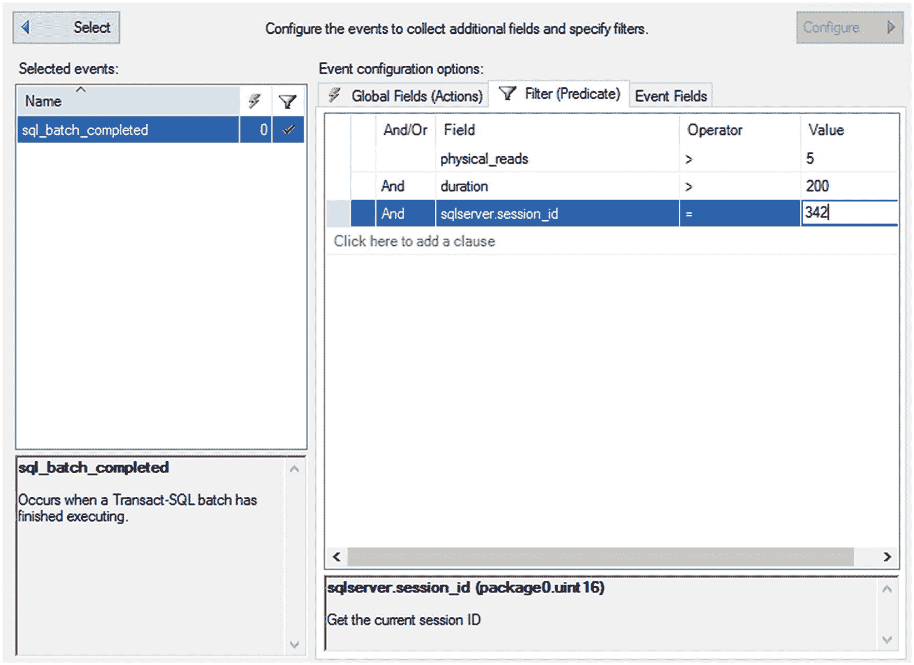
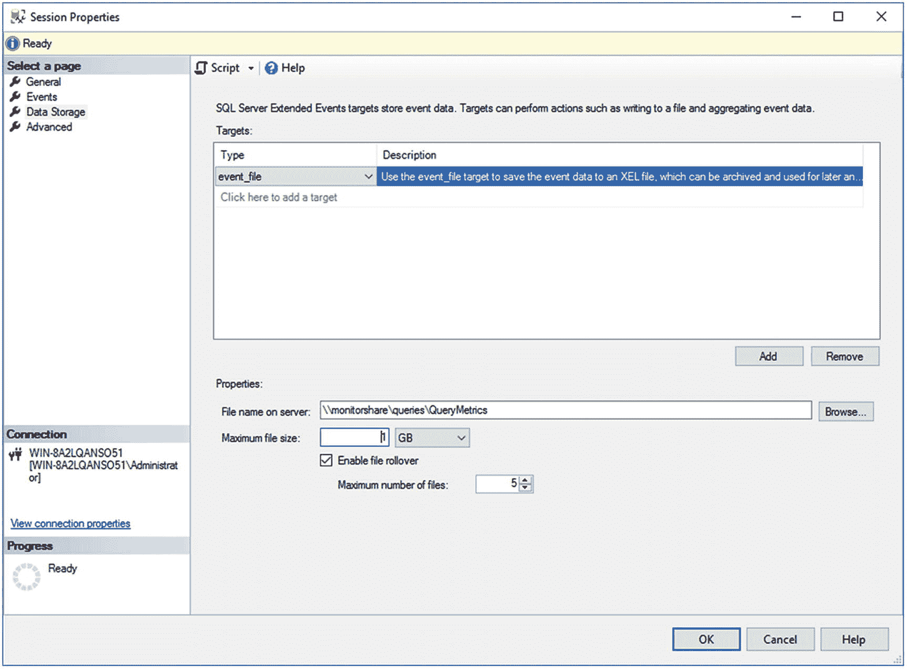
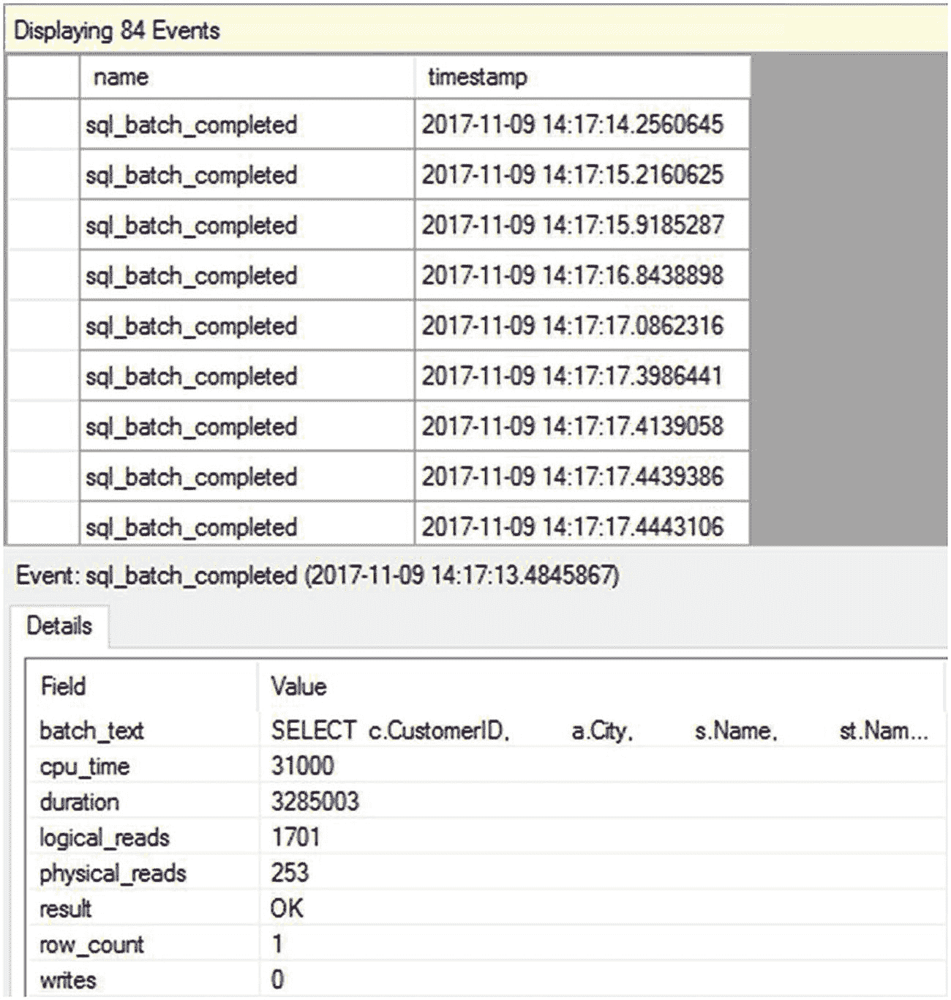
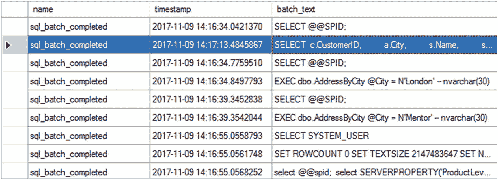
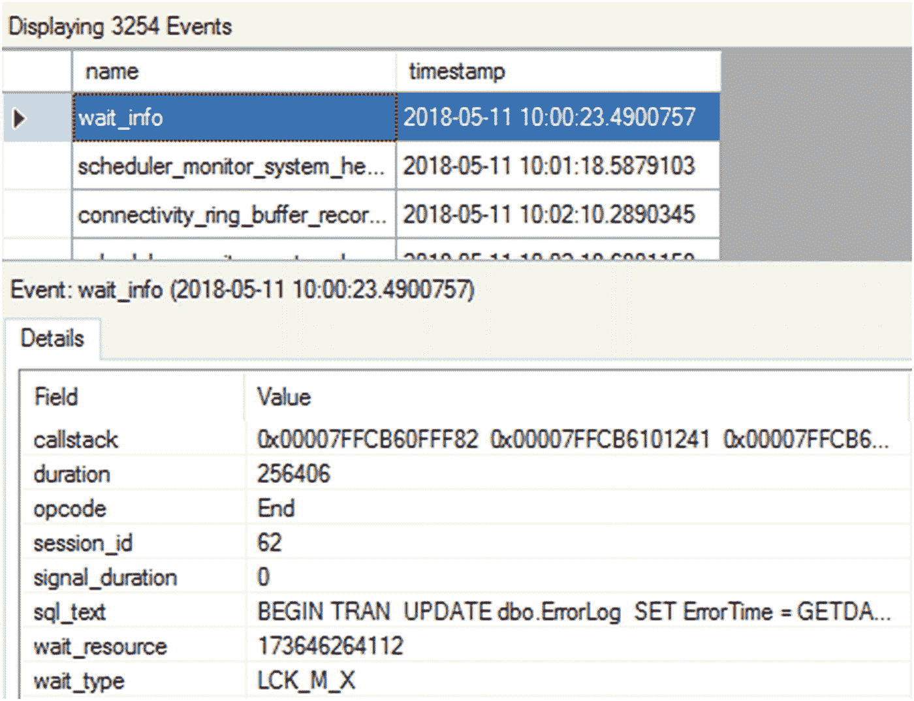
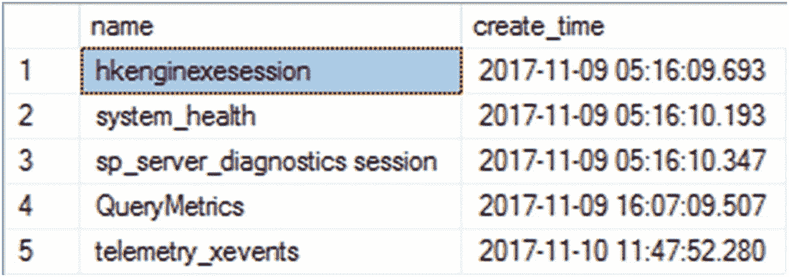

# T-SQL 批处理与事件监控

## T-SQL 批处理

一个 *T-SQL 批处理* 是一组一起提交给 SQL Server 的 SQL 查询。T-SQL 批处理通常以一个 `GO` 命令结束。`GO` 命令并非一条 T-SQL 语句，而是由 `sqlcmd` 实用程序以及 Management Studio 识别，用于标志一个批处理的结束。批处理中的每个 SQL 查询被视为一条 T-SQL 语句。因此，一个 T-SQL 批处理由一条或多条 T-SQL 语句组成。

语句或 T-SQL 语句也是存储过程中独立、离散的命令。使用 `sp_statement_completed` 或 `sql_statement_completed` 事件来捕获单个语句可能是一项开销较大的操作，具体取决于查询中单个语句的数量。

假设你的系统中每个存储过程都只包含一条且仅一条 T-SQL 语句。在这种情况下，收集已完成语句的开销非常低，无论是对收集数据时系统行为的影响，还是对存储数据所需的空间而言都是如此。现在，假设你的过程中包含多条语句，并且其中一些过程调用的是包含其他语句的其他过程。那么，收集所有这些额外数据现在就变成了系统上一个更明显的负载。捕获语句的影响完全取决于你所捕获语句的大小和数量。

语句完成事件应谨慎收集，尤其是在生产系统上。你应该应用筛选器来限制这些事件的返回结果。本章后续部分将介绍筛选器。

## 向会话添加事件

要向会话添加一个事件，请在事件库中找到该事件。这很简单；你只需键入名称。在图 6-2 中，你可以看到在搜索框中键入了 `sql_batch`，并且事件名称的相应部分已高亮显示。找到事件后，使用箭头按钮将事件从库移动到“选定事件”列表中。要移除不需要的事件，请单击箭头将其从列表中移回库中。

## 其他性能事件

尽管表 6-1 中列出的事件是用于确定查询性能的最常用事件，但有时你也可以使用一些其他事件来诊断相同的问题。例如，如第 1 章所述，存储过程的重复重新编译会增加处理开销，从而损害数据库请求的性能。事件库中的执行类别包含一个事件 `sql_statement_recompile`，用于指示语句的重新编译（该事件在第 12 章中有深入解释）。事件库还包含其他事件，用于指示数据库工作负载的其他性能相关问题。

### 表 6-2：用于查询性能的事件

| 事件类别 | 事件 | 描述 |
| --- | --- | --- |
| 会话 | `login` `logout` | 跟踪用户连接和断开与 SQL Server 时的数据库连接。 |
| | `existing_connection` | 代表在会话启动之前已连接到 SQL Server 的所有用户。 |
| 错误 | `attention` | 代表由于客户端取消查询或数据库连接断开（包括超时）等操作导致的请求中途终止。 |
| | `error_reported` | 在报告错误时发生。 |
| | `execution_warning` | 指示语句等待内存授予的时间超过一秒，或语句的内存授予失败。 |
| | `hash_warning` | 指示哈希操作中发生内存不足。将此与捕获执行计划结合使用，以了解哪个操作出现了错误。 |
| 警告 | `missing_column_statistics` | 指示缺少列统计信息，这是优化器决定处理策略所需的统计信息。 |
| | `missing_join_predicate` | 指示查询在两个表之间没有联接谓词的情况下执行。 |
| | `sort_warnings` | 指示查询（如 `SELECT`）中执行的排序操作未能容纳在内存中。 |
| 锁 | `lock_deadlock` | 当一个进程被选为死锁牺牲品时发生。 |
| | `lock_deadlock_chain` | 显示造成死锁的查询链的跟踪信息。 |
| | `lock_timeout` | 表示锁已超过由 `SET LOCK_TIMEOUT timeout_period(ms)` 设置的超时参数。 |
| 执行 | `sql_statement_recompile` | 指示查询语句的执行计划必须重新编译，因为不存在执行计划、强制重新编译或现有执行计划无法重用。这发生在语句级别，而不是批处理级别，无论该批处理是临时查询、存储过程还是预处理语句。 |
| | `rpc_starting` | 代表存储过程的开始。这对于识别那些因导致 Attention 事件的操作而启动但未能完成的过程非常有用。 |
| | `Query_post_compilation_showplan` | 显示 SQL 语句编译后的执行计划。 |
| | `Query_post_execution_showplan` | 显示 SQL 语句执行后的执行计划，其中包含执行统计信息。注意，此事件的开销可能相当大，因此应极其谨慎地使用，仅在短时间内使用并设置良好的筛选器。 |
| 事务 | `sql_transaction` | 提供有关数据库事务的信息，包括事务何时开始、完成和回滚等信息。 |


#### 全局字段

在“事件”页面上选择了感兴趣的事件后，您可能需要配置一些设置，例如全局字段。在“事件”屏幕上，单击“配置”按钮。这将改变“事件”屏幕的视图，如图 6-3 所示。


图 6-3

“事件”页面配置部分中的全局字段选择

全局字段（在 T-SQL 中称为 `actions`）代表事件的不同属性，例如与事件相关的用户、事件的执行计划、事件的一些额外资源开销以及事件的来源。这些是与事件一起可以收集的附加信息片段。它们会增加事件收集的开销。每个事件都有一组它收集的数据（我将在本章后面讨论），但这是您添加更多信息的机会。大多数时候，在可能的情况下，我会避免为大多数数据收集承担这种开销。但有时，这里的信息是您希望收集的。

要添加操作，只需在图 6-3 所示的“全局字段”页面提供的列表中勾选相应的复选框即可。您可以不时地使用额外的数据列来诊断性能不佳的原因。例如，在存储过程重新编译的情况下，事件通过 `recompile_cause` 事件字段指出重新编译的原因。（该字段在第 18 章中有深入解释。）一些常用的附加操作如下：

*   `plan_handle`
*   `query_hash`
*   `query_plan_hash`
*   `database_id`
*   `client_app_name`
*   `transaction_id`
*   `session_id`

其他信息可作为事件字段的一部分获得。例如，`binary_data` 和 `integer_data` 事件字段提供有关给定 SQL Server 活动的特定信息。例如，对于游标，它们指定了请求的游标类型和创建的游标类型。尽管这些附加字段的名称在很大程度上表明了它们的用途，但我会在后续章节中，当您使用它们时，解释这些全局字段的有用性。

#### 事件过滤器

除了为扩展事件会话定义事件和操作之外，您还可以定义各种筛选条件。这有助于保持会话输出量较小，这通常是个好主意。您可以为事件字段或全局字段添加筛选器。您还可以选择希望每个筛选器是“或”(OR) 还是“与”(AND)，以进一步控制筛选方法。您可以决定比较运算符，例如小于、等于等等。最后，您为比较设置一个值。所有这些都将对捕获的事件进行筛选，减少您需要处理的数据量，并可能降低系统负载。表 6-3 描述了您在性能分析期间可能常用的筛选条件。

表 6-3

SQL 跟踪筛选器

| 事件 | 筛选条件示例 | 用途 |
| --- | --- | --- |
| `sqlserver.username` | = <某个值> | 仅捕获单个用户或登录名的事件。 |
| `sqlserver.database_id` | = <要监视的数据库 ID> | 过滤掉由其他数据库生成的事件。您可以根据数据库名称确定其 ID，如下所示：`SELECT DB_ID('AdventureWorks20012')`。 |
| `duration` | >= 200 | 对于性能分析，您通常会捕获大型工作负载的跟踪。在大型跟踪中，会有许多持续时间小于您感兴趣的事件日志。请过滤掉这些事件日志，因为几乎没有优化这些 SQL 活动的余地。 |
| `physical_reads` | >= 2 | 这与持续时间筛选条件类似。 |
| `sqlserver.session_id` | = <要监视的数据库用户> | 这用于排除特定服务器会话发送的查询的问题。 |

图 6-4 显示了在“会话”窗口中选择前述筛选条件的片段。



图 6-4

在“会话”窗口中应用的筛选器

如果您查看图 6-4 中的“字段”值，您会注意到它显示的是 `sqlserver.session_id`。这是因为有不同类型的数据集可供您使用，并且它们由所引用的数据类型限定。在这种情况下，我特指 `sqlserver.session_id`。但我可能指的是来自 SQL OS 甚至扩展事件包本身的内容。

#### 事件字段

标准事件字段随事件类型自动包含。表 6-4 显示了一些您用于性能分析的常见操作。

表 6-4

用于查询分析的操作命令

| 数据列 | 描述 |
| --- | --- |
| `Statement` | 来自 `rpc_completed` 事件的 SQL 文本。 |
| `Batch_text` | 来自 `sql_batch_completed` 事件的 SQL 文本。 |
| `cpu_time` | 事件的 CPU 成本（微秒，mc）。例如，`SELECT` 语句的 CPU = 100 表示该语句执行花费了 100 mc。 |
| `logical_reads` | 为事件执行的逻辑读取次数。例如，`SELECT` 语句的 logical_reads = 800 表示该语句总共需要进行 800 次页读取。 |
| `Physical_reads` | 为事件执行的物理读取次数。由于访问磁盘子系统，这可能与 `logical_reads` 值不同。 |
| `writes` | 为事件执行的逻辑写入次数。 |
| `duration` | 事件的执行时间（毫秒，ms）。 |

每次逻辑读写都包含内存中 8KB 页的活动，这可能需要零次或多次物理 I/O 操作。您可以通过单击图 6-5 中显示的“事件字段”选项卡来查看任何给定事件的字段。


图 6-5

“新建会话”窗口，显示配置中的“事件字段”选项卡

一些事件字段是可选的，但大多数字段随事件自动包含。您可以决定是否要包含可选字段。在图 6-5 中，您可以通过单击其旁边的复选框来排除 `batch_text` 字段。


#### 数据存储

在新会话窗口的下一页，“选择一个页面”窗格中的 **数据存储** 用于确定您将如何处理会话生成的数据。输出机制被称为 *target*（目标）。您有两个基本选择：将信息输出到文件，或者仅使用缓冲区来捕获事件。有七种不同类型的输出，但其中大多数超出了本书的范围。出于收集性能信息的目的，您将使用 `event_file` 或 `ring_buffer`。您应该仅对小数据集使用缓冲区，因为它会消耗内存。由于它在系统内存内工作，缓冲区被设计为，与其压倒系统内存，不如丢弃事件，因此使用缓冲区更可能丢失信息。在大多数监控查询性能的情况下，您应该将会话的输出捕获到文件中。

您必须选择您的目标，如图 6-6 所示。



您应该在系统上指定一个合适的存储位置。您还可以决定是否使用多个文件、使用多少个文件，以及这些文件是否滚动更新。所有这些都是管理决策，您需要根据您的环境和 SQL 查询监控的工作来处理。您可以 24/7 运行此操作，但必须准备好处理大量数据，具体取决于您创建的过滤器的严格程度。

除了缓冲区或文件，您还有其他输出选项，但它们通常保留用于特殊类型的监控，并且通常对于查询性能调优不是必需的。

#### 完成会话

一旦定义了存储，您就为会话设置了所有需要的内容。还有一个“高级”页面，但在大多数系统上，您真的不需要修改其默认值。单击“确定”后，会话将被创建。如果您在第一个选项卡中指示会话在创建后启动，它将立即启动，但无论它是否启动，它都将存储在服务器上。扩展事件会话的一个优点是它们存储在服务器上，因此您可以根据需要打开和关闭它们，而无需重新创建会话。会话将永久存储，直到您删除它们，甚至会在重启后保留，尽管根据您配置会话的方式，您可能需要在必要时重新启动它们。

假设您要么没有自动启动会话，要么选择了实时观看数据的选项，您可以对刚刚创建的会话执行这两项操作。右键单击该会话，您将看到一个操作菜单，包括“启动会话”、“停止会话”和“实时查看数据”。如果您启动了会话并选择了观察输出，您应该会在 Management Studio 中看到一个新窗口出现，显示您正在捕获的事件。这些事件来自与写入磁盘的缓冲区相同的缓冲区，因此您可以实时观看事件。请查看图 6-7 以查看此操作。



您可以在窗口顶部看到事件，显示事件类型以及事件的日期和时间。单击顶部的事件将打开屏幕底部随该事件捕获的字段。如您所见，我一直在谈论的所有信息都可供您使用。此外，如果您对分割输出不满意，可以右键单击某列并从上下文菜单中选择“在表中显示列”。这将把它移动到屏幕顶部，将所有信息显示在一个位置，如图 6-8 所示。



您还可以通过此界面打开收集的文件，并使用它浏览数据。您可以在收集的数据中对某一列进行搜索、排序和分组。查看对特定查询的所有调用的聚合的一种好方法是使用 `query_hash`，这是一个可以添加到数据收集中的全局字段。GUI 提供了许多方法来操作您收集的信息。

通过 GUI 观看这些信息并浏览文件是可以的，但您会想要自动化创建这些会话。这就是下一节要介绍的内容。

#### 内置的 system_health 会话

SQL Server 内置并默认自动运行着一个名为 `system_health` 的扩展事件会话。它主要用作观察系统整体健康状况以及收集内部错误和诊断信息的机制。然而，它也会自动捕获一些在我们讨论查询性能调优时有用的信息。

默认情况下，开箱即用，它会收集有关发生的死锁的完整信息。死锁绝对是一个性能问题，并在第 22 章中有所介绍。`system_health` 扩展事件会话意味着我们无需做任何其他工作即可开始诊断死锁情况。

`system_health` 会话捕获任何等待闩锁超过 15 秒的进程的 `sql_text` 和 `session_id`。该信息对于立即识别可能需要调优的查询非常有用。您还会获得任何等待锁超过 30 秒的查询的 `sql_text` 和 `session_id`。同样，这是一种无需其他工作（只需搜索 `system_health` 信息）即可立即识别可能需要调优的查询的方法。

由于这只是一个会话，您可以完全控制它，甚至可以从系统中删除它，尽管我当然不建议这样做。它将信息收集在一个 5MB 的文件中，并保留一组滚动的四个文件。有了这些信息，您将无法回溯到服务器安装的开始，但它应该包含服务器最近的行为。文件默认与其他日志文件位于同一位置。您可以像这样找到位置：

```sql
SELECT path
FROM sys.dm_os_server_diagnostics_log_configurations;
```

有了该位置，您可以查询会话或在“实时数据”资源管理器窗口中打开它，如图 6-9 所示。



图 6-9 中显示的事件是 `wait_info` 事件，它显示我有一个进程等待获取锁超过 30 秒。`sql_text` 字段将显示有问题的查询。如您所见，从性能调优的角度来看，这是非常宝贵的信息。最重要的是，它现在就在您的系统上可用。您无需做任何设置工作。


## 扩展事件自动化

能够使用 GUI 构建会话并定义要捕获的事件确实使操作变得简单，但不幸的是，这种模式无法扩展。如果你需要管理多台服务器，并计划创建会话来捕获关键的查询性能指标，你肯定不希望连接到每一台服务器，然后通过 GUI 来选择事件、输出方式等等。如果考虑到出错的可能性，情况就更是如此。相反，学会如何直接通过 T-SQL 来处理会话要好得多。这将使你能够构建一个可以在系统中多台服务器上运行的会话。更好的是，你会发现，与使用 GUI 相比，在某些方面直接构建会话更容易，而且你对这些过程如何运作的理解也会深入得多。

### 使用 GUI 创建会话脚本

你可以通过两种方式之一创建脚本化跟踪：手动创建或使用 GUI 创建。在你熟悉脚本的所有要求之前，简单的方法是使用扩展事件 GUI。你需要执行以下步骤：

1.  定义一个会话。
2.  右键单击该会话，然后选择 `将会话脚本编写为`、`CREATE 到` 和 `文件` 以直接输出到文件。或者，使用"新建会话"窗口顶部的 `脚本` 按钮，在查询窗口中创建 T-SQL 命令。

这些步骤将生成创建会话并将其输出到文件所需的脚本。

要手动创建这个新的跟踪，请按以下方式使用 Management Studio：

1.  打开脚本文件或导航到查询窗口。
2.  修改你正在创建会话的服务器的路径和文件位置。
3.  执行脚本。

会话创建后，你可以使用以下命令来启动它：

```
ALTER EVENT SESSION QueryMetrics
ON SERVER
STATE = START;
```

你可能希望通过 SQL Agent 自动化执行最后一步，或者甚至可以使用 `sqlcmd.exe` 命令行实用程序从命令行运行脚本。无论你使用哪种方法，最后一步都将启动会话。要停止会话，只需运行相同的脚本，并将 `STATE` 设置为 `stop`。我将在下一节展示如何操作。

### 使用 T-SQL 定义会话

如果你按照上一节的步骤创建了一个脚本，你会在查询编辑器窗口中看到类似下面这样的内容：

```
CREATE EVENT SESSION [QueryMetrics]
ON SERVER
ADD EVENT sqlserver.sql_batch_completed
(SET collect_batch_text = (1)
WHERE ([sqlserver].[database_name] = N'AdventureWorks2017')
)
ADD TARGET package0.event_file
(SET filename = N'q:\PerfData\QueryMetrics')
WITH
(
MAX_MEMORY = 4096KB,
EVENT_RETENTION_MODE = ALLOW_SINGLE_EVENT_LOSS,
MAX_DISPATCH_LATENCY = 30 SECONDS,
MAX_EVENT_SIZE = 0KB,
MEMORY_PARTITION_MODE = NONE,
TRACK_CAUSALITY = OFF,
STARTUP_STATE = OFF
);
GO
```

要创建扩展事件会话，只需一条命令即可定义会话，即 `CREATE EVENT SESSION`。然后，你只需在该命令中使用 `ADD EVENT` 来定义会话。筛选器只是添加到每个事件定义中的一个 `WHERE` 子句。最后，你添加一个目标，定义捕获的数据应存储在何处。`WITH` 子句实际上只是 GUI 中"高级"页面上的默认值。你可以省略 `WITH` 子句及其值，它们仍会为会话进行设置。

一旦会话定义完成，你可以使用 `ALTER EVENT` 来激活它，如前所示。

会话在服务器上启动后，你就不再需要保持 Management Studio 或查询编辑器处于打开状态了。你可以使用动态管理视图 `sys.dm_xe_sessions` 来识别活动会话，如下列查询所示：

```
SELECT  dxs.name,
        dxs.create_time
FROM    sys.dm_xe_sessions AS dxs;
```

图 6-10 显示了该视图的输出。



图 6-10
`sys.dm_xe_sessions` 的输出

返回的行数指示了 SQL Server 上活动的会话数。除了我在本章创建的那个会话外，我还有另外四个系统默认的会话在运行。你可以通过执行存储过程 `ALTER EVENT SESSION` 来停止特定的会话。

```
ALTER EVENT SESSION QueryMetrics
ON SERVER
STATE = STOP;
```

要验证会话是否已成功停止，请重新执行对目录视图 `sys.dm_xe_sessions` 的查询，并确保视图的输出中不包含该命名会话。

使用脚本创建会话使你能够在大量服务器上实现自动化。使用脚本来启动和停止会话意味着你可以通过计划事件（例如通过 SQL Agent）来控制它们。在第 20 章中，你将学习如何在捕获 SQL 工作负载活动（在较长时间段内）的同时控制会话的计划。

### 注意

通过本节所述方式定义的会话所捕获的时间以微秒为单位存储，而不是毫秒。单位之间的这种差异如果不加以考虑，可能会引起混淆。你必须基于微秒进行筛选。

## 使用因果跟踪

通过 GUI 或 T-SQL 定义会话相当简单。使用这些信息也相当容易。然而，你很快就会发现，你不仅希望观察单个批处理语句或单个过程调用。你会希望看到一个过程内的所有语句以及该过程调用本身。你会希望看到语句级别的重新编译、等待以及各种其他事件，并让它们全部直接关联回单个存储过程或语句。这就是 `因果跟踪` 的用武之地。

如前所述，你可以通过 GUI 启用因果跟踪，也可以将其包含在 SQL 命令中。以下脚本捕获远程过程调用的开始和停止以及这些调用中的所有语句。我还启用了因果跟踪。

```
CREATE EVENT SESSION ProcedureMetrics
ON SERVER
ADD EVENT sqlserver.rpc_completed
(WHERE (sqlserver.database_name = N'AdventureWorks2017')),
ADD EVENT sqlserver.rpc_starting
(WHERE (sqlserver.database_name = N'AdventureWorks2017')),
ADD EVENT sqlserver.sp_statement_completed
(SET collect_object_name = (1))
ADD TARGET package0.event_file
(SET filename = N'C:\PerfData\ProcedureMetrics.xel')
WITH
(
    TRACK_CAUSALITY = ON
);
```

## 扩展事件建议

扩展事件在信息收集方式上是一个如此重大的变革，以至于过去使用跟踪事件时经常出现的许多问题区域已在很大程度上被消除。你不再需要像以前那样过分担心严重限制收集的事件数量或返回的字段数。但是，如前所述，过度加载要收集的事件仍然可能对系统产生负面影响。仍然有一些特定的领域需要你特别注意。

*   适当设置最大文件大小。
*   对调试事件保持谨慎。
*   避免使用 `No_Event_Loss`。

我将在以下各节中更详细地讨论这些内容。

### 适当设置最大文件大小

文件的默认值是 1GB。考虑到扩展事件可以收集的信息量，这实际上非常小。最好将这个数字设置得更高一些，在 50GB 到 100GB 之间，以确保你有足够的空间来捕获信息，并且不会因为等待文件子系统为你创建文件而导致缓冲区填满。这可能导致事件丢失。但这确实取决于你的系统。如果你对预期的输出级别有很好的把握，请为你的特定环境设置更合适的文件大小。


### 谨慎对待调试事件

扩展事件不仅为你提供了一种远超跟踪事件能力的机制来观察 SQL Server 的行为及其内部机制，而且 Microsoft 也将其用于 SQL Server 的故障排除。许多事件与 SQL Server 调试相关。这些事件默认情况下无法通过向导获得，但你可以通过 T-SQL 命令访问它们，并且可以通过"会话编辑器"窗口中的通道选择来启用它们。

**除非有 Microsoft 的直接指导，否则请勿使用它们。** 这些事件可能发生变化，并且仅供 Microsoft 内部使用。如果你确实需要进行试验，请密切关注任何包含**中断操作**的事件。这意味着，一旦该事件触发，SQL Server 将在触发事件的确切代码行停止。这将导致你的服务器完全脱机并处于未知状态。如果你在生产系统上这样做，可能会导致重大中断。这可能导致数据丢失和数据库损坏。

不过，并非所有调试事件都会导致中断操作，有些甚至被推荐使用。一个例子是 `query_thread_profile` 事件。运行此事件能够以轻量级的方式捕获实时执行计划事件。我们将在第 15 章讨论执行计划时详细介绍这一点。

### 避免使用 No_Event_Loss

扩展事件的设计使得某些事件可能会丢失。这是极其可能发生的，并且是设计使然。但是，在配置会话时，你可以使用一个设置 `No_Event_Loss`。如果你在已经处于负载下的系统上这样做，你可能会看到系统被施加了显著的额外负载，因为你实际上是在告诉系统无论后果如何都要保留缓冲区中的信息。对于针对特定行为的小型且专注的会话，这种方法是可以接受的。

## 获取查询性能指标的其他方法

设置扩展事件会话允许你收集大量数据以供日后使用，但收集过程可能有点昂贵。此外，你必须等待结果，然后还要处理大量数据。另一种总体成本较低的机制是查询存储。我们将在第 11 章详细介绍它。如果你需要立即捕获关于你系统的性能指标，特别是与查询性能相关的指标，那么你需要动态管理视图 `sys.dm_exec_query_stats`（用于查询）和 `sys.dm_exec_procedure_stats`（用于存储过程）。如果你仍然需要查询何时运行及其各自成本的历史跟踪，扩展事件会话仍然是最佳工具。但如果你只是需要知道此时运行时间最长的查询或物理读取最多的查询，那么你可以从这两个动态管理对象中获得该信息。但是，这些对象中的数据依赖于查询计划保留在缓存中。如果计划因老化而从缓存中清除，这些数据就会消失。`sys.dm_exec_query_stats` DMO 将返回所有查询（包括存储过程）的结果，但 `sys.dm_exec_procedure_stats` 将仅返回存储过程的信息。

由于这两个 DMO 只是视图，你可以简单地对它们进行查询，获取有关服务器计划缓存中查询统计信息的信息。表 6-5 显示了从 `sys.dm_exec_query_stats` DMO 返回的一些数据。

表 6-5 只是一个抽样。完整详情请参阅联机丛书。

**表 6-5**
`sys.dm_exec_query_stats` 输出

| 列 | 描述 |
| --- | --- |
| `Plan_handle` | 指向执行计划的指针 |
| `Creation_time` | 计划创建的时间 |
| `Last_execution time` | 计划上次被查询使用的时间 |
| `Execution_count` | 计划已被使用的次数 |
| `Total_worker_time` | 自计划创建以来使用的总 CPU 时间 |
| `Total_logical_reads` | 自计划创建以来使用的总逻辑读取次数 |
| `Total_logical_writes` | 自计划创建以来使用的总逻辑写入次数 |
| `Query_hash` | 可用于标识具有相似逻辑的查询的二进制哈希值 |
| `Query_plan_hash` | 可用于标识具有相似逻辑的计划的二进制哈希值 |
| `Max_dop` | 查询所使用的最大并行度 |
| `Max_columnstore_segment_skips` | 在查询过程中被跳过的段数量 |

要过滤从 `sys.dm_exec_query_stats` 返回的信息，你需要将其与其他动态管理函数（如 `sys.dm_exec_sql_text`，它显示与计划关联的查询文本）或 `sys.dm_query_plan`，它包含查询的执行计划）进行连接。一旦连接到这些其他 DMO，你就可以按你想要查看的数据库或过程进行过滤。这些其他 DMO 在本书的其他章节中有详细介绍。我将在本书的后续部分展示结合使用 `sys.dm_exec_query_stats` 和其他 DMO 的示例。请记住，这些查询依赖于缓存。当某个执行计划因老化从缓存中清除时，这些信息将会丢失。

## 总结

在本章中，你了解了如何使用扩展事件来识别 SQL 工作负载中对系统资源造成大量压力的查询。收集会话数据可以并且应该使用系统存储过程实现自动化。要立即访问有关正在运行查询的统计信息，请使用 DMV `sys.dm_exec_query_stats`。

现在你已经掌握了一种收集有关系统上已运行查询指标的方法，在下一章中，你将学习如何在查询运行时收集信息，从而不必每次运行查询时都诉诸于这些测量工具。

