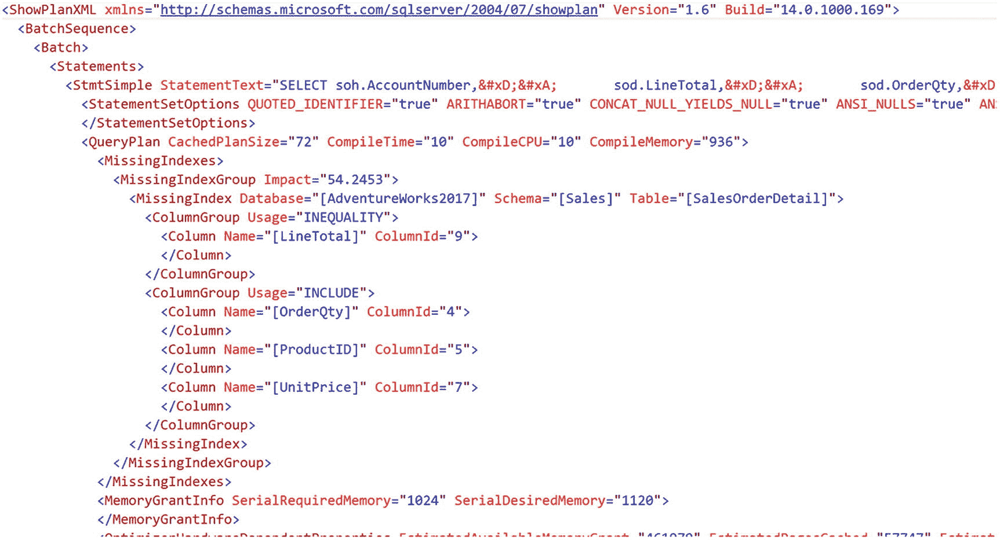
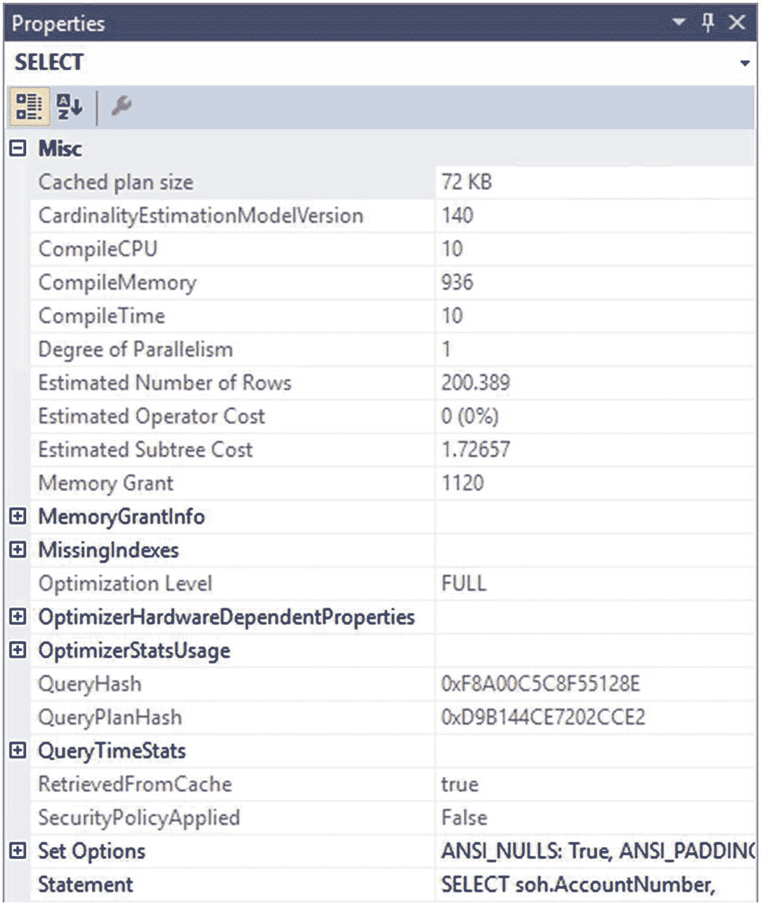
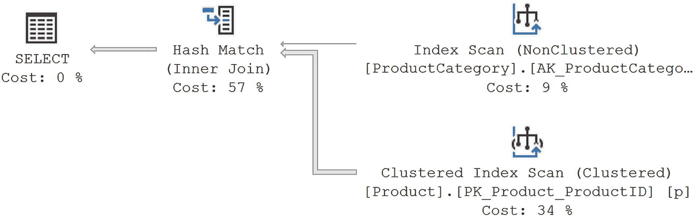
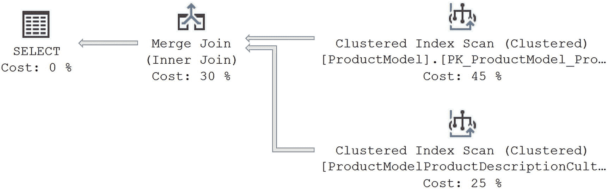
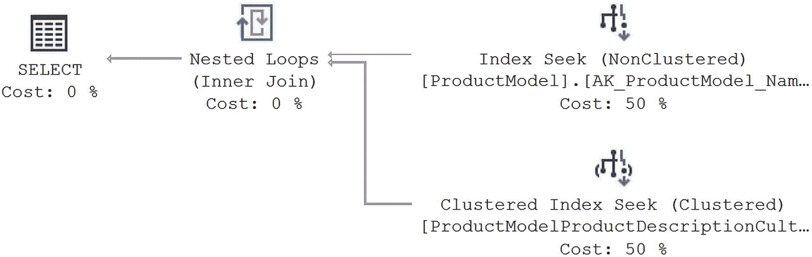
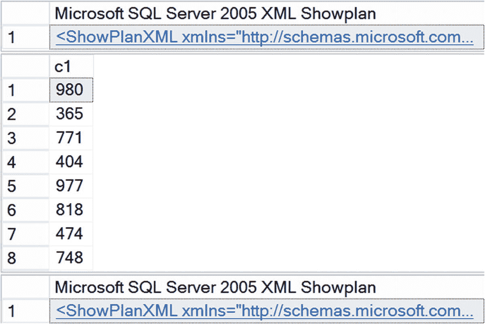
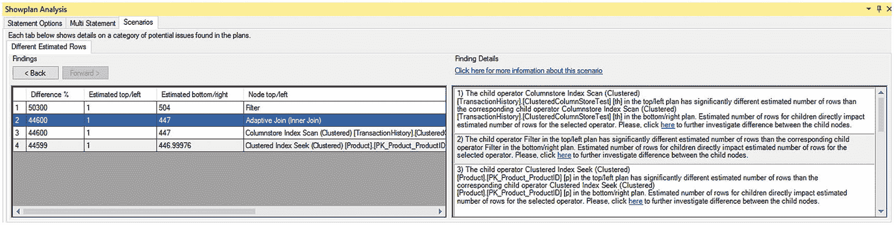
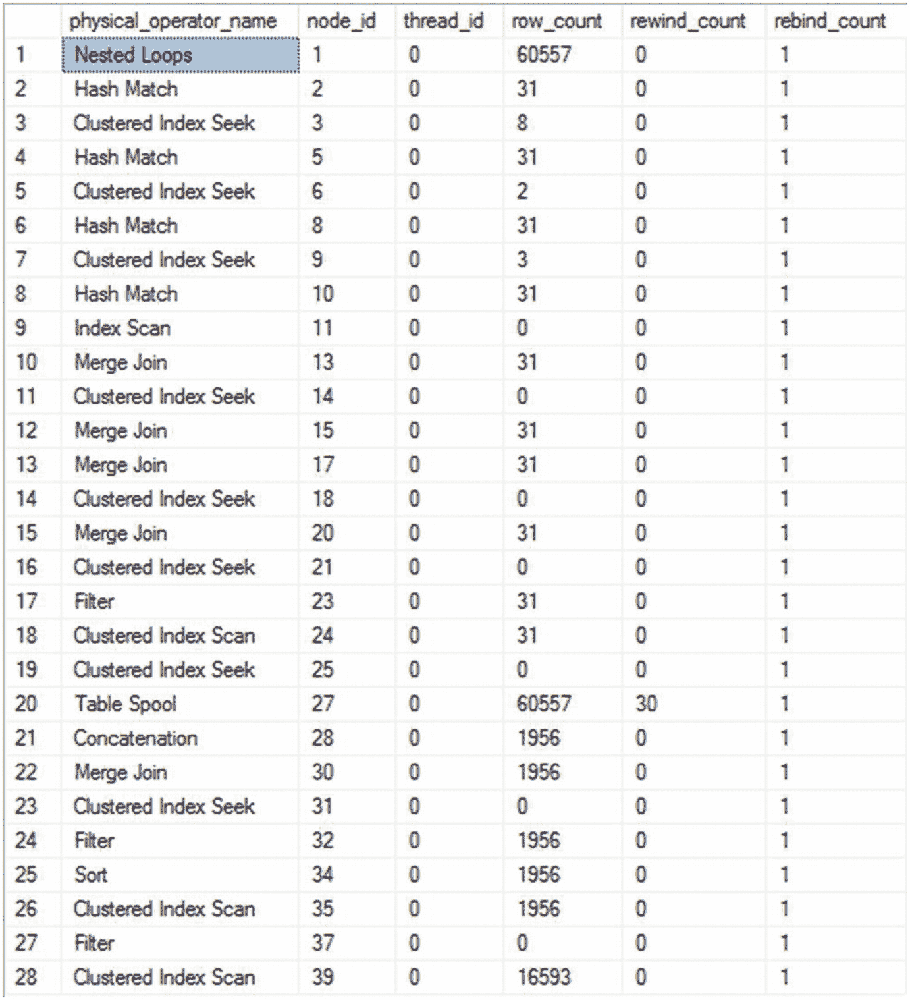
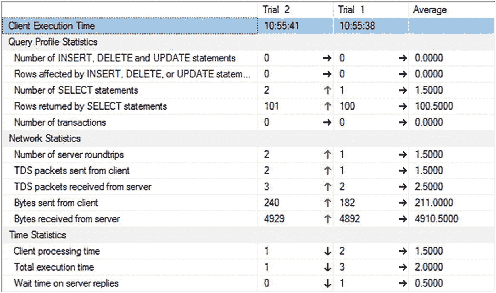

# 7. 分析查询性能

上一章展示了如何收集查询性能指标。本章将展示如何利用这些指标来识别运行时间长或频繁调用的查询。然后我将介绍 Management Studio 的内置工具，以便你理解特定查询的性能表现。我还将花大量时间讨论如何使用执行计划，这是你深入了解查询优化器所做决策的最佳途径。

在本章中，我将涵盖以下主题：

*   如何使用 Management Studio 分析代价高昂的 SQL 查询的处理策略
*   如何分析查询优化器对 SQL 查询使用的方法
*   如何使用 T-SQL 命令衡量 SQL 查询的成本

## 成本较高的查询

现在你已经看到了两种收集查询性能指标的不同方法，接下来让我们看看这些数据代表什么：即那些**成本较高的查询**本身。当 SQL Server 的性能变差时，很可能发生了以下几件事：

*   首先，某些查询对系统资源造成了**高压力**。这些查询会影响整个系统的性能，因为服务器无法足够快速地处理其他 SQL 查询。
*   此外，这些成本较高的查询会阻塞所有请求相同数据库资源的其他查询，从而进一步降低那些查询的性能。优化成本较高的查询不仅能提升它们自身的性能，还能通过减少数据库阻塞和对 SQL Server 资源的压力来改善其他查询的性能。
*   有可能数据的变化或传递给查询的值的改变，会导致查询行为的变化，从而使其性能下降。
*   最后，一个本身成本不高的查询，如果每分钟被调用数千次，仅仅因为*非最优代码*的累积效应，就可能导致主要的资源瓶颈。

要开始确定你需要花时间处理哪些查询，你将使用到目前为止我讨论过的资源。例如，假设查询在缓存中，你将能够使用 DMO 来汇总有意义的数据，以确定成本最高的查询。或者，由于你已使用**扩展事件**捕获了查询，因此可以将该数据作为识别成本最高查询的一种手段。还有另一种选择也是可能的，它是在 SQL Server 2016 中引入的；你可以使用**查询存储**来捕获和检查查询性能指标。我们将在第 11 章详细探讨该机制。

在这里，我们将从**扩展事件**开始。捕获查询指标最简单、最直接的方法是通过针对当前在缓存中的查询使用 DMO。不幸的是，这是聚合数据，并且完全依赖于当前缓存中的内容（我们将在第 16 章更多讨论缓存），因此你没有历史记录，也无法获得存储过程的单独测量值和单个参数值。第二种最简单、同样直接查看查询指标的方法是通过**查询存储**。它提供的记录比 DMO 更完整，但其中的数据也是聚合的。我们将探索这三种方法，但为了精确起见，我们将从**扩展事件**开始。

关于扩展事件数据的一个小提示：如果数据将被收集到文件中，那么你需要将数据加载到表中，或者直接查询它。你可以使用以下系统函数直接查询扩展事件文件：

```sql
SELECT module_guid,
package_guid,
object_name,
event_data,
file_name,
file_offset,
timestamp_utc
FROM sys.fn_xe_file_target_read_file('C:\Sessions\QueryPerformanceMetrics*.xel',
NULL,
NULL,
NULL);
```

所需的参数首先是路径，我已提供。你可以像我一样使用 * 来处理存在多个滚存文件的情况。第二个参数是 SQL Server 2008R2 的遗留参数，可以忽略。第三个参数允许你选择一个初始文件名；否则，如果你像我这样做，它将读取路径下的所有文件。最后，最后一个参数允许你指定一个偏移量，以便你可以选择跳过某些事件。它只是一个数字，因此你无法真正对事件进行筛选；只能计数到你想开始的那个事件。

查询将每个事件作为单行返回。关于事件的数据存储在 XML 列 `event_data` 中。你需要使用 XQuery 来直接读取数据，但一旦读取，你就可以搜索、排序和聚合捕获的数据。我将在下一节带你完成此机制的一个完整示例。

### 识别成本较高的查询

SQL Server 的目标是在最短时间内向用户返回结果集。为此，SQL Server 有一个内置的、基于成本的优化器，称为 `查询优化器`，它生成一个称为 `查询执行计划` 的具有成本效益的策略。查询优化器权衡许多因素，包括（但不限于）执行查询所需的 CPU、内存和磁盘 I/O 的使用情况，这些都源自各种来源，例如由索引维护或动态生成的数据统计信息、数据约束，以及关于查询运行系统的一些知识，例如 CPU 数量和内存量。优化器基于所有这些信息创建一个具有成本效益的执行计划。

在从会话返回的数据中，`cpu_time` 和 `logical_reads` 或 `physical_reads` 字段也显示了查询在哪些方面代价高昂。`cpu_time` 字段表示执行查询所使用的 CPU 时间。两个 `reads` 字段表示查询操作的页数（每页 8KB），从而表明查询引起的内存或 I/O 压力大小。它们还表明了磁盘压力，因为对于操作查询，内存页必须备份，在首次数据访问时填充，并在内存瓶颈时换出到磁盘。查询的逻辑读取次数越高，可能对磁盘造成的压力就越大。过多的逻辑页也会增加 CPU 在管理这些页上的负载。这不是一个自动的关联。你不能总是指望读取次数最多的查询就是性能最差的查询。但这是一种通用指标，也是一个良好的起点。尽管最小化 I/O 次数并不是一个具有成本效益的计划的必备条件，但你经常会发现，通常成本最低的计划具有最少的 I/O，因为 I/O 操作是昂贵的。

导致大量逻辑读取的查询通常会对相应的大批量数据获取锁。甚至读取（相对于写入）也可能需要在所有数据上获取共享锁，具体取决于隔离级别。这些查询会阻塞所有其他请求此数据（或部分数据）以进行修改（而非读取）的查询。由于这些查询本质上成本高昂且需要较长的执行时间，它们会长时间阻塞其他查询。被阻塞的查询进而会对更多查询造成阻塞，在数据库中引入一系列阻塞链。（第 13 章涵盖了锁模式。）

因此，识别成本较高的查询并首先优化它们是有意义的，从而达到以下效果：

*   提高成本较高查询本身的性能
*   降低系统资源的整体压力
*   减少数据库阻塞

成本较高的查询可分为以下两种类型：

*   `单次执行`：单个查询的执行成本很高。
*   `多次执行`：查询本身成本可能不高，但重复执行该查询会对系统资源造成压力。

你可以使用不同的方法来识别这两种类型的成本较高的查询，如下节所述。


### 单次执行的高成本查询

您可以通过分析会话输出文件、使用查询存储，或查询 `sys.dm_exec_query_stats` 来识别高成本查询。在本例中，我们将从识别执行大量逻辑读取的查询开始，因此您应该会话输出按 `logical_reads` 数据列排序。您可以更改此设置，按持续时间或 CPU 排序，甚至以有趣的方式将它们组合起来。您可以通过以下步骤访问会话信息：

1.  捕获一个包含典型工作负载的会话。
2.  将会话输出保存到文件。
3.  使用“文件” ➤ “打开”打开该文件，并选择一个 `.xel` 文件以使用数据浏览器窗口。在那里对信息进行排序。
4.  或者，您可以查询跟踪文件进行分析，按 `logical_reads` 字段排序。

```
WITH    xEvents
AS (SELECT    object_name AS xEventName,
              CAST (event_data AS XML) AS xEventData
    FROM      sys.fn_xe_file_target_read_file('C:\Sessions\QueryPerformanceMetrics*.xel',
                                              NULL, NULL, NULL)
)
SELECT  xEventName,
        xEventData.value('(/event/data[@name="duration"]/value)[1]',
                         'bigint') Duration,
        xEventData.value('(/event/data[@name="physical_reads"]/value)[1]', 'bigint') PhysicalReads,
        xEventData.value('(/event/data[@name="logical_reads"]/value)[1]',
                         'bigint') LogicalReads,
        xEventData.value('(/event/data[@name="cpu_time"]/value)[1]',
                         'bigint') CpuTime,
        CASE xEventName
            WHEN 'sql_batch_completed'
            THEN xEventData.value('(/event/data[@name="batch_text"]/value)[1]',
                                  'varchar(max)')
            WHEN 'rpc_completed'
            THEN xEventData.value('(/event/data[@name="statement"]/value)[1]',
                                  'varchar(max)')
        END AS SQLText,
        xEventData.value('(/event/data[@name="query_hash"]/value)[1]',
                         'binary(8)') QueryHash
INTO    Session_Table
FROM    xEvents;

SELECT  st.xEventName,
        st.Duration,
        st.PhysicalReads,
        st.LogicalReads,
        st.CpuTime,
        st.SQLText,
        st.QueryHash
FROM    Session_Table AS st
ORDER BY st.LogicalReads DESC;
```

让我们稍微分解一下这个查询。首先，我创建了一个名为 `xEvents` 的公用表表达式（CTE）。我这样做只是因为它使代码更容易阅读。它并没有从根本上改变任何行为。当我必须从文件读取并转换数据类型时，我更喜欢这样。这样，我后面语句中的 XML 查询就更有意义了。请注意，我在读取文件时使用了通配符 `QueryPerformanceMetrics*.xel`。这使我能够读取扩展事件会话创建的所有回滚文件（更多详细信息，请参阅第 6 章）。

根据收集的数据量和文件大小，直接对从扩展事件收集的文件运行查询可能异常缓慢。在这种情况下，请使用相同的基本函数 `sys.fn_xe_file_target_read_file` 将数据加载到表中，而不是直接查询。完成后，您可以对表应用索引以加快查询速度。我使用前面的脚本将数据放入表中，然后查询该表以获取输出。这对于测试来说没问题，但对于更永久的解决方案，您会希望有一个专门的数据库来存储此类数据，其表具有适当的结构，而不是像我在这里那样使用 `INTO` 这样的捷径。

在某些情况下，您可能从系统监视器输出中识别出 CPU 压力很大。CPU 压力可能源于大量的 CPU 密集型操作，例如存储过程重新编译、聚合函数、数据排序、哈希联接等。在这种情况下，您应该按 `cpu_time` 字段对会话输出进行排序，以识别占用大量处理器周期的查询。

### 多次执行的高成本查询

正如我前面提到的，有时一个查询本身可能成本不高，但同一查询多次执行的累积效应可能会给系统资源带来压力。在这种情况下，按 `logical_reads` 字段排序将无法帮助您识别此类高成本查询。相反，您需要了解查询多次执行的总读取次数、总 CPU 时间或仅累计持续时间。

*   查询会话输出并按您感兴趣的一些值进行分组。
*   查询查询存储中的信息。
*   访问 `sys.dm_exec_query_stats` DMO 以从生产服务器检索信息。这假设您处理的是最近发生的或不依赖于已知历史记录的问题，因为此数据仅是当前存储在过程缓存中的内容。

如果您正在寻找数据的准确历史视图，可以转到您使用扩展事件收集的指标或查询存储中的信息，具体取决于您清除该数据的频率（更多内容见第 11 章）。查询存储具有可用于此类调查的聚合数据。但是，它只有聚合信息。如果您还想要详细的单次调用信息，您将需要重新使用扩展事件。

将会话数据导入数据库表后，执行 `SELECT` 语句以查找同一查询多次执行执行的总读取次数，如下所示：

```
SELECT COUNT(*) AS TotalExecutions,
       st.xEventName,
       st.SQLText,
       SUM(st.Duration) AS DurationTotal,
       SUM(st.CpuTime) AS CpuTotal,
       SUM(st.LogicalReads) AS LogicalReadTotal,
       SUM(st.PhysicalReads) AS PhysicalReadTotal
FROM Session_Table AS st
GROUP BY st.xEventName, st.SQLText
ORDER BY LogicalReadTotal DESC;
```

前面脚本中的 `TotalExecutions` 列表示查询执行的次数。`LogicalReadTotal` 列表示查询多次执行执行的总逻辑读取次数。

通过这种方法识别的高成本查询比通过会话识别的单次执行的高成本查询更能反映负载情况。例如，一个需要 50 次读取的查询可能被执行了 1,000 次。查询本身可能被认为足够“便宜”，但该查询执行的总读取次数结果是 50,000 (= 50 × 1,000)，这不能被认为是便宜的。优化此查询以将单次执行的读取次数减少 10 次，可将总读取次数减少 10,000 (= 10 × 1,000)，这可能比优化一个单次查询需要 5,000 次读取更有益。

这种方法的问题是，大多数查询的 `WHERE` 子句中会有一组不同的条件，或者过程调用会传入不同的值。这使得简单地按带参数的查询或过程进行分组变得不可能。您可以采用多种方法来处理此问题。因为您拥有扩展事件，所以实际上可以将其用于为您服务。例如，`rpc_completed` 事件将过程名捕获为一个字段。您可以简单地按该字段分组。对于批处理，您可以添加 `query_hash` 字段，然后按该字段分组。另一种方法是清理数据，删除参数值，如 Microsoft 开发者网络 [`http://bit.ly/1e1I38f`](http://bit.ly/1e1I38f) 上所述。虽然它是最初为 SQL Server 2005 编写的，但其概念适用于直到 SQL Server 2017 的其他 SQL Server 版本。

要从 `sys.dm_exec_query_stats` 视图中获取相同的信息，只需针对该 DMV 运行查询即可。


## 监控查询性能

```sql
SELECT s.TotalExecutionCount,
t.text,
s.TotalExecutionCount,
s.TotalElapsedTime,
s.TotalLogicalReads,
s.TotalPhysicalReads
FROM
(
SELECT deqs.plan_handle,
SUM(deqs.execution_count) AS TotalExecutionCount,
SUM(deqs.total_elapsed_time) AS TotalElapsedTime,
SUM(deqs.total_logical_reads) AS TotalLogicalReads,
SUM(deqs.total_physical_reads) AS TotalPhysicalReads
FROM sys.dm_exec_query_stats AS deqs
GROUP BY deqs.plan_handle
) AS s
CROSS APPLY sys.dm_exec_sql_text(s.plan_handle) AS t
ORDER BY s.TotalLogicalReads DESC;
```

利用来自执行动态管理对象 (DMO) 的数据的另一种方法是使用 `query_hash` 和 `query_plan_hash` 作为聚合机制。虽然一个给定的存储过程或参数化查询可能传入不同的值，但这些查询的 `query_hash` 和 `query_plan_hash` 在大多数情况下是相同的。这意味着您可以针对哈希值进行聚合，以识别那些原本无法看到的常见计划或常见查询模式。下面的查询只是对前一个查询稍作修改：

```sql
SELECT s.TotalExecutionCount,
t.text,
s.TotalExecutionCount,
s.TotalElapsedTime,
s.TotalLogicalReads,
s.TotalPhysicalReads
FROM
(
SELECT deqs.query_plan_hash,
SUM(deqs.execution_count) AS TotalExecutionCount,
SUM(deqs.total_elapsed_time) AS TotalElapsedTime,
SUM(deqs.total_logical_reads) AS TotalLogicalReads,
SUM(deqs.total_physical_reads) AS TotalPhysicalReads
FROM sys.dm_exec_query_stats AS deqs
GROUP BY deqs.query_plan_hash
) AS s
CROSS APPLY
(
SELECT plan_handle
FROM sys.dm_exec_query_stats AS deqs
WHERE s.query_plan_hash = deqs.query_plan_hash
) AS p
CROSS APPLY sys.dm_exec_sql_text(p.plan_handle) AS t
ORDER BY TotalLogicalReads DESC;
```

这比收集会话数据所需的所有工作要简单得多，以至于让人疑惑为什么还要使用扩展事件。主要原因，正如我在本章开头所写，在于**精确性**。`sys.dm_exec_query_stats` 视图是一个针对给定计划在内存中存在期间的**运行中聚合**。而另一方面，扩展事件会话则是在您运行它的任何时间范围内的**历史轨迹**。您甚至可以将扩展事件的会话结果添加到数据库中。有了一个数据列表，您可以更精确地生成关于事件的总计，而不是仅仅依赖于某个特定时刻。然而，请理解，许多性能问题的故障排除都侧重于服务器上最近发生的情况，并且由于 `sys.dm_exec_query_stats` 基于缓存，这个动态管理视图通常代表了系统近期的状态，因此 `sys.dm_exec_query_stats` 极其重要。但是，如果您正在处理更为具体的“现在到底是什么在运行缓慢”的情况，您会使用 `sys.dm_exec_requests`。

您会发现查询存储在易用性方面与 DMO 相同。然而，由于其中的信息不依赖于缓存，它可能比 DMO 数据更有用。不过，与 DMO 一样，查询存储也没有扩展事件会话那样的详细记录。

### 识别运行缓慢的查询

由于用户的体验受到其请求响应时间的很大影响，您应该定期监控传入 SQL 查询的执行时间，并找出运行缓慢查询的响应时间，从而创建一个查询性能基线。如果运行缓慢查询的响应时间（或持续时间）变得不可接受，那么您就应该分析性能下降的原因。然而，并非每个性能不佳的查询都是由资源问题引起的。其他问题，例如阻塞，也可能导致查询性能缓慢。阻塞将在第 12 章中详细讨论。

要识别运行缓慢的查询，只需更改针对会话数据的查询，改变您排序的依据，像这样：

```sql
WITH xEvents
AS (SELECT object_name AS xEventName,
CAST(event_data AS XML) AS xEventData
FROM sys.fn_xe_file_target_read_file('Q:\Sessions\QueryPerformanceMetrics*.xel', NULL, NULL, NULL)
)
SELECT xEventName,
xEventData.value('(/event/data[@name="duration"]/value)[1]', 'bigint') Duration,
xEventData.value('(/event/data[@name="physical_reads"]/value)[1]', 'bigint') PhysicalReads,
xEventData.value('(/event/data[@name="logical_reads"]/value)[1]', 'bigint') LogicalReads,
xEventData.value('(/event/data[@name="cpu_time"]/value)[1]', 'bigint') CpuTime,
xEventData.value('(/event/data[@name="batch_text"]/value)[1]', 'varchar(max)') BatchText,
xEventData.value('(/event/data[@name="statement"]/value)[1]', 'varchar(max)') StatementText,
xEventData.value('(/event/data[@name="query_plan_hash"]/value)[1]', 'binary(8)') QueryPlanHash
FROM xEvents
ORDER BY Duration DESC;
```

对于一个运行缓慢的系统，您应该在优化过程前后记录运行缓慢查询的持续时间。应用优化技术后，您应该评估其对系统的整体影响。您的优化步骤有可能对其他查询产生不利影响，使它们变得更慢。


## 执行计划

一旦你识别出一个代价高昂的查询，就需要找出它代价高昂的 `原因`。你可以从 `Extended Events`、`Query Store` 或 `sys.dm_exec_procedure_stats` 中找出代价高昂的过程；在 `Management Studio` 中重新运行它；并查看查询优化器使用的执行计划。执行计划展示了查询优化器用于执行查询的处理策略（包括多个中间步骤）。

为了创建执行计划，查询优化器会评估索引、统计信息、约束和连接策略的各种排列组合。由于可能存在大量潜在计划，这个优化过程可能需要较长时间才能生成最具成本效益的执行计划。为了防止对执行计划进行过度优化，该过程被分为多个阶段。每个阶段都是一组转换规则，用于评估与优化过程直接相关的各种数据库对象和设置，最终目标是找到一个“足够好”的计划，而非一个完美的计划。正是这种“足够好”与“完美”之间的区别，可能导致因执行计划优化不足而性能不佳。查询优化器只会尝试有限次数的优化，之后便会直接采用当前代价最低的计划（这被称为 `超时`）。

完成一个阶段后，查询优化器会检查所得计划的预估代价。如果查询优化器判定该计划的代价足够低，它就会使用该计划，而不再进行后续的优化阶段。然而，如果计划的代价不够低，优化器将进入下一个优化阶段。我将在第 15 章更深入地介绍执行计划的生成。

SQL Server 以多种形式和两种不同类型显示查询执行计划。在 SQL Server 2017 中，最常用的形式是图形化执行计划和 XML 执行计划。实际上，图形化执行计划只是为屏幕显示而解析的 XML 执行计划。两种执行计划类型分别是估计计划和实际计划。`估计`计划代表来自查询优化器的结果，而 `实际`计划是同一计划加上一些运行时指标。估计计划的优点在于它不需要实际执行查询。这些类型生成的计划可能不同，但仅当执行期间发生语句级重新编译时才会如此。大多数情况下，两种类型的计划是相同的。主要区别在于实际计划中包含了一些执行统计信息，而这些信息在估计计划中不存在。

图形化执行计划使用图标来表示查询的处理策略。要获取图形化估计执行计划，请选择“查询” ➤ “显示估计的执行计划”。XML 执行计划包含与图形化计划相同的数据，但格式更便于以编程方式访问。此外，借助 SQL Server 的 XQuery 功能，可以像查询表一样查询 XML 执行计划。XML 执行计划通过语句 `SET SHOWPLAN_XML`（用于估计计划）和 `SET STATISTICS XML`（用于实际执行计划）生成。你也可以右键单击图形化执行计划并选择 `显示执行计划 XML`。你还可以使用 DMO `sys.dm_exec_query_plan` 直接从计划缓存中提取计划。缓存中存储的计划没有运行时信息，因此从技术上讲它们是估计计划。存储在 `Query Store` 中的计划也是如此。

### 注意

你应确保数据库设置为兼容模式 140，以便它能准确反映 SQL Server 2017 的更新。

你可以使用 `SET SHOWPLAN_XML` 命令获取先前识别出的代价最高查询的估计 XML 执行计划，如下所示：

```
USE AdventureWorks2017;
GO
SET SHOWPLAN_XML ON;
GO
SELECT soh.AccountNumber,
sod.LineTotal,
sod.OrderQty,
sod.UnitPrice,
p.Name
FROM Sales.SalesOrderHeader soh
JOIN Sales.SalesOrderDetail sod
ON soh.SalesOrderID = sod.SalesOrderID
JOIN Production.Product p
ON sod.ProductID = p.ProductID
WHERE sod.LineTotal > 20000;
GO
SET SHOWPLAN_XML OFF;
GO
```

运行此查询会生成一个指向执行计划的链接，而不是执行计划或任何数据。点击该链接将打开一个执行计划。虽然该计划将以图形化形式显示，但右键单击该计划并选择 `显示执行计划 XML` 将显示 XML 数据。图 7-1 显示了部分 XML 执行计划输出。



图 7-1
XML 执行计划输出


### 分析查询执行计划

让我们从上一节识别出的代价高昂的查询开始。将其（去掉 `SET SHOWPLAN_XML` 语句）复制到 Management Studio 的查询窗口中。通过单击"显示估计执行计划"按钮或按下 `Ctrl+L`，我们可以立即捕获一个执行计划。你将在图 7-2 中看到该执行计划。


图 7-2：查询执行计划

执行计划展示了两种不同的信息流。从左侧开始阅读，你可以看到逻辑流，从 `SELECT` 运算符开始，依次经过每个执行步骤。从右侧开始并向相反方向阅读，则是信息的物理流，首先从 `聚集索引扫描` 运算符提取数据，然后进行到后续每个步骤。大多数情况下，按照数据的物理流向阅读更利于理解执行计划中发生的事情，但并非总是如此。有时，理解执行计划中正在发生什么的唯一方法是按照逻辑处理顺序从左到右阅读。每个步骤代表为获取查询最终输出而执行的一个操作。

执行计划的一个重要方面是其中显示的值。书中会用到许多值，但最显而易见的是 `成本`（`Cost`），它显示了估计的成本百分比。你可以在图 7-2 中看到它。左侧的 `SELECT` 运算符的 `成本` 值为 0%，右侧的 `聚集索引扫描` 操作的 `成本` 值为 60%。这些成本应简单地视为成本单位。它们不是任何类型性能的字面度量。它们是由查询优化器分配或计算的值。名义上，它们代表了 I/O 和 CPU 使用的数学构造。然而，它们并不代表字面上的 I/O 和 CPU 使用。这些值始终是估计值，单位就是简单的成本单位。这是我们首先需要确立的一个至关重要的理解点。

执行计划所表示的查询执行的某些方面如下：


图 7-3：执行计划运算符的工具提示表

*   如果一个查询由多个查询的批次组成，则每个查询的执行计划将按执行顺序显示。批次中的每个执行计划都有一个相对估计成本，整个批次的总成本为 100%。
*   执行计划中的每个图标代表一个运算符。它们各自都有一个相对估计成本，执行计划中所有节点的总成本为 100%。（尽管统计信息不准确，甚至 SQL Server 中的错误可能导致你看到超过 100% 的成本，但这主要出现在旧版本的 SQL Server 中。）
*   通常，执行计划中的第一个物理运算符代表从数据库对象（表或索引）检索数据的机制。例如，在图 7-2 的执行计划中，三个起点代表从 `SalesOrderHeader`、`SalesOrderDetail` 和 `Product` 表中检索数据。
*   数据检索通常是表操作或索引操作。例如，在图 7-2 的执行计划中，所有三个数据检索步骤都是索引操作。
*   索引上的数据检索将是索引扫描或索引查找。例如，在图 7-2 中可以看到聚集索引扫描、聚集索引查找和索引扫描。
*   索引上数据检索操作的命名约定是 `[表名].[索引名]`。
*   计划的逻辑流是从左到右，就像阅读英文书籍一样。数据在运算符之间从右向左流动，由运算符之间的连接箭头指示。
*   运算符之间连接箭头的粗细代表传输行数的图形化表示。
*   同一列中两个运算符之间的连接机制将是嵌套循环联接、哈希匹配联接、合并联接或自适应联接（在 SQL Server 2017 和 Azure SQL Database 中添加）。例如，在图 7-2 所示的执行计划中，有一个哈希联接和一个循环联接。（联接机制稍后会有更详细的介绍。）
*   将鼠标悬停在执行计划中的节点上会显示一个包含一些详细信息的弹出窗口。工具提示在大多数情况下用处不大。图 7-3 显示了一个例子。


图 7-4：选择运算符属性

*   关于运算符的完整详细信息可在"属性"窗口中获得，如图 7-4 所示。你可以通过右键单击运算符并从上下文菜单中选择"属性"来打开它。
*   运算符详细信息在顶部同时显示物理和逻辑操作类型。物理操作代表存储引擎实际使用的操作，而逻辑操作是优化器用来构建估计执行计划的构造。如果逻辑和物理操作相同，则只显示物理操作。它还显示其他有用的信息，如行数、I/O 成本、CPU 成本等。
*   阅读许多运算符上的属性对于理解查询在 SQL Server 内如何执行，从而更好地知道如何优化该查询，可能是必要的。

值得注意的是，在 SQL Server 2017 Management Studio 生成的实际执行计划中，你还可以看到查询的执行时间统计信息，作为查询计划的一部分。它们在图 7-4 的 `QueryTimeStats` 部分可见。这提供了一种衡量查询性能的额外机制。当等待统计信息超过 1 毫秒时，你还可以在执行计划中看到这些等待统计信息。任何小于该值的等待不会出现在执行计划中。


### 识别执行计划中的高成本步骤

执行计划中最直接的方法是找出哪些步骤的成本相对较高。这些步骤是你进行查询优化的起点。你可以采用以下技术来选择起始步骤：

*   执行计划中的每个节点都会显示其在完整执行计划中的相对估计成本，整个计划的总成本为 100%。因此，请重点关注相对成本最高的节点。例如，图 7-2 中的执行计划有一个步骤的估计成本为 59%。

*   一个执行计划可能来自一批语句，因此你可能还需要找出估计成本最高的语句。在图 7-2 中，你可以在计划顶部看到文本“Query 1”。在批处理情况下，会有多个计划，它们将按照在批处理中发生的顺序编号。

*   观察节点间连接箭头的粗细。粗的连接箭头表示在相应节点之间传输了大量数据。分析箭头左侧的节点，以理解其为何需要这么多数据行。同时检查箭头的属性。你可能会看到估计行数与实际行数不同。这可能是由统计信息过时等原因造成的。如果你看到计划大部分都是粗箭头，而结尾处是细箭头，或许可以通过修改查询或索引，使过滤操作在计划中更早执行。

*   寻找哈希连接操作。对于小的结果集，嵌套循环连接通常是首选的连接技术。本章稍后将详细介绍哈希连接与嵌套循环连接的比较。请记住，哈希连接不一定就差，循环连接也不一定就好。这取决于查询返回的数据量。

*   寻找键查找操作。对大结果集进行查找操作可能导致大量的随机读取。我将在第 11 章更详细地介绍键查找。

*   可能存在警告，表现为某个操作符上有一个感叹号，这些是需要立即关注的区域。这些问题可能由多种原因引起，包括缺少连接条件的连接、缺少统计信息的索引或表。通常解决警告情况有助于提升性能。

*   寻找执行排序操作的步骤。这表明数据未按正确的排序顺序检索。同样，这可能不是问题，但它指出了潜在问题的迹象，可能是缺少索引或索引不正确。使用 `ORDER BY` 确保数据按指定方式排序没有问题，但排序可能导致性能下降。

*   注意那些可能给系统带来额外负载的操作符，例如表假脱机。它们可能是查询运行所必需的，也可能表明查询编写不当或索引设计糟糕。

*   并行查询执行的默认成本阈值是估计成本 5，这个值非常低。注意那些不合理的并行操作。请记住，估计成本是查询优化器分配的代表 CPU 和 I/O 数学模型的数字，并非实际测量值。

### 分析索引有效性

为了进一步检查执行计划中的高成本步骤，你应该分析相关表或索引的数据检索机制。首先，你应该检查索引操作是 `查找` 还是 `扫描`。通常，为了获得最佳性能，你应该从表中检索尽可能少的行，而索引 `查找` 通常是访问少量行最有效的方法。`扫描` 操作通常表示访问了较大量的行。因此，通常更优选 `查找` 而非 `扫描`。然而，这并不是说查找天生就好，扫描天生就坏。数据检索机制需要准确反映查询的需求。一个检索表中所有行的查询将受益于扫描，而对同一查询进行查找反而会导致性能不佳。这里的关键是通过检查操作符的属性来理解操作的细节，从而理解优化器做出其选择的原因。

接下来，你需要确保索引机制已正确设置。查询优化器评估可用索引，以发现哪个索引能以最高效的方式从表中检索数据。如果没有所需的索引，优化器会使用次优的索引。为了获得最佳性能，你应该始终确保在数据检索操作中使用了最佳索引。你可以通过分析节点详细信息的“参数”部分来判断索引有效性（是否使用了最佳索引），具体关注以下内容：

*   数据检索操作

*   连接操作

让我们查看估计执行计划中 `SalesOrderHeader` 表的数据检索机制。图 7-5 显示了操作符属性。


图 7-5

`SalesOrderHeader` 表的数据检索机制

在 `SalesOrderHeader` 表的操作符属性中，`Object` 属性指定了所使用的索引 `PK_SalesOrderHeader_SalesOrderID`。它使用以下命名约定：`[数据库].[所有者].[表名].[索引名]`。`Seek Predicates` 属性指定了用于在索引中查找键的列。`SalesOrderHeader` 表通过 `SalesOrderld` 列与 `SalesOrderDetail` 表进行连接。`SEEK` 操作基于这样一个事实：连接条件 `SalesOrderld` 是聚集索引和主键 `PK_SalesOrderHeader` 的前导列。

有时你可能会遇到不同的数据检索机制。图 7-6 展示的不是你在图 7-5 中看到的 `Seek Predicates` 属性，而是一个简单的谓词，这表明了完全不同的数据检索机制。


图 7-6

数据检索机制的变体，一个 `扫描`

在图 7-6 的属性中，没有查找谓词。由于对列执行了函数操作 `ISNULL` 和 `CONVERT_IMPLICIT`，必须检查整个表是否存在 `Predicate` 值。

```
isnull(CONVERT_IMPLICIT(numeric(19,4),[AdventureWorks2017].[Sales].[SalesOrderDetail].[UnitPrice] as [sod].[UnitPrice],0)*((1.0)-CONVERT_IMPLICIT(numeric(19,4),[AdventureWorks2017].[Sales].[SalesOrderDetail].[UnitPriceDiscount] as [sod].[UnitPriceDiscount],0))*CONVERT_IMPLICIT(numeric(5,0),[AdventureWorks2017].[Sales].[SalesOrderDetail].[OrderQty] as [sod].[OrderQty],0),(0.000000))>(20000.000000)
```

因为对数据执行了计算，索引并不存储计算结果，所以无法简单地在索引上查找信息，而是必须扫描所有数据，执行计算，然后检查数据是否与我们要查找的值匹配。

### 分析连接有效性

除了分析所使用的索引外，您还应该检查优化器决定的连接策略的有效性。SQL Server 使用四种类型的连接。

- 哈希连接
- 合并连接
- 嵌套循环连接
- 自适应连接

在许多影响少量行的简单查询中，嵌套循环连接远优于哈希连接和合并连接。随着连接变得更加复杂，其他连接类型会在适当的地方被使用。没有任何连接类型天生就是坏的或错误的。您主要是在寻找优化器可能选择了与当前数据不兼容的类型的地方。这通常是由于优化器在决定使用哪种类型时，其可用的统计信息存在差异所导致的。

#### 哈希连接

要理解 SQL Server 的哈希连接策略，请考虑以下简单查询：

```sql
SELECT p.Name AS ProductName,
pc.Name AS ProductCategoryName
FROM Production.Product p
JOIN Production.ProductCategory pc
ON p.ProductSubcategoryID = pc.ProductCategoryID;
```

表 7-1 显示了这两个表的索引和行数。

表 7-1
产品表和产品类别表的索引及行数

| 表 | 索引 | 行数 |
| --- | --- | --- |
| `Product` | 在 `ProductID` 上的聚集索引 | 504 |
| `ProductCategory` | 在 `ProductCategoryld` 上的聚集索引 | 4 |

图 7-7 显示了上述查询的执行计划。



图 7-7
带有哈希连接的执行计划

您可以看到优化器在两个表之间使用了哈希连接。

哈希连接将两个连接输入用作 *生成输入* 和 *探测输入*。生成输入在执行计划中由顶部的输入表示，探测输入是底部的输入。通常两个输入中较小的一个用作生成输入，因为它将被存储在系统上，因此优化器试图最小化所使用的内存。

哈希连接分两个阶段执行其操作：*生成阶段* 和 *探测阶段*。在最常用的哈希连接形式（*内存中的哈希连接*）中，整个生成输入被扫描或计算，然后在内存中构建一个哈希表。外部输入中的每一行根据为 *哈希键*（等式谓词中的列集）计算的哈希值被插入到一个哈希桶中。哈希只是对相关值运行的一种数学结构，用于比较目的。

生成阶段之后是探测阶段。整个探测输入被逐行扫描或计算，对于每个探测行，都会计算一个哈希键值。然后扫描探测输入哈希键值对应的哈希桶，并生成匹配项。图 7-8 说明了内存中哈希连接的过程。


图 7-8
内存中哈希连接的工作流程

查询优化器使用哈希连接来高效处理大型、未排序、无索引的输入。现在让我们看看下一种连接类型：合并连接。

#### 合并连接

在前面的例子中，`Product` 表的输入较大，并且该表在连接列 (`ProductCategorylD`) 上没有索引。使用下面的简单查询，您可以看到不同的行为：

```sql
SELECT pm.Name AS ProductModelName,
pmpd.CultureID
FROM Production.ProductModel pm
JOIN Production.ProductModelProductDescriptionCulture pmpd
ON pm.ProductModelID = pmpd.ProductModelID;
```

图 7-9 显示了此查询的执行计划结果。



图 7-9
带有合并连接的执行计划

对于此查询，优化器在两个表之间使用了合并连接。合并连接要求两个连接输入都按合并列（由连接条件定义）排序。如果两个连接列上都有索引，则连接输入将通过索引排序。由于每个连接输入都是排序的，合并连接从每个输入中获取一行并比较它们是否相等。如果相等，则生成一个匹配行。此过程重复进行，直到处理完所有行。

在数据已通过索引排序的情况下，合并连接可以是最快的连接操作之一，但如果数据未排序而优化器仍然选择执行合并连接，则数据必须通过一个额外的操作（排序）进行排序。这可能会使合并连接变慢，并在内存和 I/O 资源方面成本更高。如果内存分配不准确且排序在 tempdb 中溢出到磁盘，情况会变得更糟。

在这种情况下，查询优化器发现连接输入在其连接列上都是已排序（或已索引）的。您可以在 `索引扫描` 运算符的属性中看到这一点，如图 7-10 所示。


图 7-10
显示数据已排序的聚集索引扫描属性

由于数据已通过正在使用的索引排序，因此在此情况下选择合并连接作为比任何其他连接更快的连接策略。


#### 嵌套循环连接

接下来我要介绍的连接类型是嵌套循环连接。为了获得更好的性能，你应当始终致力于从各个表中访问有限数量的行。要理解使用较小结果集的效果，请按如下方式减少查询中的连接输入：

```sql
SELECT pm.Name AS ProductName,
pmpd.CultureID
FROM Production.ProductModel pm
JOIN Production.ProductModelProductDescriptionCulture pmpd
ON pm.ProductModelID = pmpd.ProductModelID
WHERE pm.Name = 'HL Mountain Front Wheel';
```

图 7-11 显示了新查询的执行计划结果。



图 7-11：使用嵌套循环连接的执行计划

如你所见，优化器在两个表之间使用了嵌套循环连接。

嵌套循环连接使用一个连接输入作为外部输入表，另一个作为内部输入表。外部输入表在执行计划中显示为顶部输入，内部输入表显示为底部输入表。外部循环逐行消耗外部输入表。内部循环针对每一行外部行执行，在内部输入表中搜索匹配的行。

如果外部输入非常小，而内部输入较大但已建立索引，那么嵌套循环连接非常有效。在许多影响少量行的简单查询中，嵌套循环连接远优于哈希连接和合并连接。连接操作通过其他牺牲来获取速度。循环连接可能很快，因为它使用内存将一小部分数据与第二部分数据快速进行比较。合并连接类似地使用内存和一部分 `tempdb` 来进行有序比较。哈希连接则使用内存和 `tempdb` 来构建连接的哈希表。虽然循环连接在小数据集上可能更快，但随着数据集变大或没有支持数据检索的索引，它可能会变慢。这就是 SQL Server 提供不同连接机制的原因。

即使对于小的连接输入，如前面的查询，在连接列上建立索引也很重要。正如你在前面的执行计划中所看到的，对于小的结果集，连接列上的索引允许查询优化器考虑嵌套循环连接策略。如果输入的连接列上缺少索引，将迫使查询优化器转而使用哈希连接。

表 7-2 总结了三种连接类型的使用情况。

表 7-2：三种连接类型的特性

| 连接类型 | 连接列上的索引 | 连接表的通常大小 | 预排序 | 连接子句 |
| --- | --- | --- | --- | --- |
| 哈希连接 | 内部表：未索引<br>外部表：可选<br>最佳条件：小的外部表，大的内部表 | 任意 | 否 | 等值连接 |
| 合并连接 | 两个表：必须<br>最佳条件：两个表上都有聚集或覆盖索引 | 大 | 是 | 等值连接 |
| 嵌套循环连接 | 内部表：必须<br>外部表：最好有 | 小 | 可选 | 所有 |

### 注意

在哈希和循环连接中，外部表通常是两个连接表中较小的那个。

我将在第 8 章介绍索引类型，包括聚集和覆盖索引。

#### 自适应连接

自适应连接是在 Azure SQL Database 和 SQL Server 2017 中引入的。它是一种新的连接类型，可以在运行时在嵌套循环连接或哈希连接之间进行选择。截至撰写本文时，它仅适用于列存储索引，但未来可能会改变。为了演示这一点，我将创建一个带有聚集列存储索引的表。

```sql
SELECT *
INTO dbo.TransactionHistory
FROM Production.TransactionHistory AS th;
CREATE CLUSTERED COLUMNSTORE INDEX ClusteredColumnStoreTest
ON dbo.TransactionHistory;
```

在准备好此表和索引，并且我们的兼容性模式设置正确后，我们可以运行一个利用聚集列存储索引的简单查询。

```sql
SELECT p.Name,
th.Quantity
FROM dbo.TransactionHistory AS th
JOIN Production.Product AS p
ON p.ProductID = th.ProductID
WHERE th.Quantity > 550;
```

捕获该查询的实际执行计划后，我们将看到图 7-12。


图 7-12：使用自适应连接的执行计划

自适应连接使用的哈希连接或嵌套循环连接的功能与前面定义的完全一致。不同之处在于，自适应连接可以判断在给定情况下哪种连接类型更高效。它的工作方式是，首先构建一个隐藏的自适应缓冲区。如果超过行数阈值，行将流入常规哈希表。剩余的行被加载到哈希表中，为探测过程做好准备，如前所述。如果所有行都加载到自适应缓冲区中，并且该数量低于行数阈值，则该缓冲区将用作嵌套循环连接的外部引用。

如你在图 7-12 中所见，每个连接都显示为 `Adaptive Join` 算子下方的一个单独分支。`Adaptive Join` 下方的第一个分支用于哈希连接。在这种情况下，`Index Scan` 算子和 `Filter` 算子满足使用哈希连接时的查询需求。`Adaptive Join` 下方的第二个分支用于嵌套循环连接。这里将是 `Clustered Index Seek` 操作。

计划被生成并存储在缓存中，包含两个可能的分支。然后查询引擎将根据所讨论的结果集决定沿哪个分支执行。你可以通过查看 `Adaptive Join` 算子的属性来了解所做的选择，如图 7-13 所示。


图 7-13：自适应连接算子的属性，显示实际的连接类型

此连接在哈希匹配和嵌套循环之间切换的阈值是在计划编译时计算的。它作为 `AdaptiveThresholdRows` 存储在计划的属性中。当查询执行并确定其达到、超过或未达到阈值时，处理继续沿自适应连接的正确分支进行。此过程不需要计划重新编译。重新编译将在第 16 章进一步讨论。

当数据集的情况是嵌套循环的性能远优于哈希匹配时，自适应连接能显著增强性能。虽然构建哈希匹配然后不使用它会产生一些成本，但这会被嵌套循环连接在小数据集上增强的性能所抵消。当数据集很大时，此过程不会以任何方式对哈希连接操作产生负面影响。

虽然从技术上讲，这并不代表一种全新的连接类型，但在我看来，其在嵌套循环和哈希匹配这两种核心类型之间动态切换的行为，使其实际上成为一种新的连接类型。再加上你现在有一个新的算子，即 `Adaptive Join` 算子，并且嵌套循环和哈希匹配都不可见，这看起来确实像是一种新的连接类型。


### 实际与估计执行计划

存在估计执行计划和实际执行计划。在某种程度上，它们可以互换。但是，实际计划包含了查询执行时的信息，特别是受影响的行数和其他一些在估计计划中不可用的信息。这些信息非常有用，尤其是在试图理解统计估计时。因此，在调优查询时，优先选择实际执行计划。

不幸的是，你并不总能访问到它们。你可能无法执行查询，例如在生产环境中。你可能只能访问缓存中的计划，而它不包含运行时信息。因此，有些情况下，你只能使用估计计划来工作。然而，由于运行时指标是收集在实际计划中的，所以通常更推荐获取实际计划。

还有一种情况，估计计划根本无法工作。考虑下面的存储过程：

```sql
CREATE OR ALTER PROC p1
AS
CREATE TABLE t1 (c1 INT);
INSERT INTO t1
SELECT ProductID
FROM Production.Product;
SELECT *
FROM t1;
DROP TABLE t1;
GO
```

你可以尝试使用 `SHOWPLAN_XML` 来获取查询的估计 XML 执行计划，如下所示：

```sql
SET SHOWPLAN_XML ON;
GO
EXEC p1 ;
GO
SET SHOWPLAN_XML OFF;
GO
```

但这会失败并显示以下错误：

```sql
Msg 208, Level 16, State 1, Procedure p1, Line 249
Invalid object name 't1'.
```

由于 `SHOWPLAN_XML` 实际上并不执行查询，查询优化器无法为表 `t1` 上的 `INSERT` 和 `SELECT` 语句生成执行计划，因为该表直到查询执行时才会存在。相反，你可以使用 `STATISTICS XML`，如下所示：

```sql
SET STATISTICS XML ON;
GO
EXEC p1;
GO
SET STATISTICS XML OFF;
GO
```

由于 `STATISTICS XML` 会执行查询，表在查询中被创建和访问，这一切都被执行计划捕获。图 7-14 显示了查询结果以及 `STATISTICS XML` 提供的存储过程内两个语句的两个计划。



**图 7-14**
STATISTICS PROFILE 输出

### 提示

记住在 Management Studio 中关闭 **Query ➤ Show Execution Plan**，否则你看到的是图形执行计划，而不是文本执行计划。

### 计划缓存

访问执行计划的另一个地方是直接从它们存储的内存空间中读取，即计划缓存。SQL Server 提供了动态管理视图和函数来访问此数据。缓存中存储的所有计划都是估计计划。要查看缓存中的执行计划列表，请运行以下查询：

```sql
SELECT p.query_plan,
t.text
FROM sys.dm_exec_cached_plans r
CROSS APPLY sys.dm_exec_query_plan(r.plan_handle) p
CROSS APPLY sys.dm_exec_sql_text(r.plan_handle) t;
```

该查询返回一个 XML 执行计划链接列表。打开其中任何一个都会显示执行计划。这些执行计划是编译后的计划，但它们不包含执行指标。通过使用动态管理视图中提供的列，可以进一步搜索特定的存储过程或执行计划。

虽然没有运行时数据有一定局限性，但能够访问执行计划，即使在查询执行时，对于进行性能调优的人来说也是非常宝贵的资源。如前所述，在生产环境中你可能无法执行查询，所以能获取到任何计划都是有用的。

如第 11 章所述，你也可以从查询存储中检索计划。与缓存中存储的计划一样，这些都是估计计划。

### 执行计划工具

虽然你刚刚开始看到执行计划的实践应用，但你只看到了用于理解这些计划如何工作的一部分可用资源。除了 SSMS 中以图形计划呈现的 XML 信息及其固有属性之外，Management Studio 还提供了一些额外的计划功能，这些功能在你探索任何给定执行计划所揭示的关于查询性能的信息时值得了解。

##### 查找节点

首先，你实际上可以在计划的运算符内搜索特定的属性值。让我们用本章开始时的原始查询为例，为其生成一个计划。查询如下：

```sql
SELECT soh.AccountNumber,
sod.LineTotal,
sod.OrderQty,
sod.UnitPrice,
p.Name
FROM Sales.SalesOrderHeader soh
JOIN Sales.SalesOrderDetail sod
ON soh.SalesOrderID = sod.SalesOrderID
JOIN Production.Product p
ON sod.ProductID = p.ProductID
WHERE sod.LineTotal > 20000;
```

使用你喜欢的任何方式生成执行计划后，在执行计划内右键单击。会出现一个上下文菜单，其中包含许多控制计划的有趣资源，如图 7-15 所示。


**图 7-15**
执行计划上下文菜单

如果我们选择 **Find Node** 菜单项，执行计划的右上角会出现一个新界面，类似于图 7-16。


**图 7-16**
Find Node 界面

左侧是所有运算符的所有属性。你可以选择要搜索的任何属性。然后选择一个运算符。图 7-16 中显示的默认是等于运算符。还有一个 `Contains` 运算符。最后，你输入一个值。单击向左或向右箭头将找到符合你条件的运算符。再次单击将移动到下一个运算符（如果有的话），使你能够处理大型而复杂的执行计划，而不必自己对每个运算符的属性进行目视搜索。

例如，我们可以查找任何引用了模式 `Product` 的运算符，如图 7-17 所示。


**图 7-17**
查找任何 Schema 值包含 Product 的运算符

单击向右箭头将带你到第一个引用 `Product` 模式的运算符。在示例中，它会先到 `SELECT` 运算符，然后是 `Adaptive Join` 运算符、`Filter` 运算符，接着是 `Index Scan` 和 `Index Seek` 运算符。它唯一不会选择的运算符是 `Columnstore Index Scan`，因为它属于 `TransactionHistory` 模式。

#### 比较计划

有时你可能想知道两个执行计划之间的区别，特别是当这种区别在图形化计划中不易看出时。如果我们运行以下查询，它们的计划看起来基本是相同的：

```
SELECT p.Name,
th.Quantity
FROM dbo.TransactionHistory AS th
JOIN Production.Product AS p
ON p.ProductID = th.ProductID
WHERE th.Quantity > 550;
SELECT p.Name,
th.Quantity
FROM dbo.TransactionHistory AS th
JOIN Production.Product AS p
ON p.ProductID = th.ProductID
WHERE th.Quantity > 35000;
```

这些计划实际上存在一些明显的差异，但它们看起来又很相似。仅凭肉眼去精确比较它们的区别可能会导致很多错误。相反，我们可以在其中一个计划上`右键单击`，调出如`图 7-15`所示的上下文菜单。使用顶部的选项将该计划保存到文件中。这是必要的步骤。然后，在另一个计划内`右键单击`，再次调出上下文菜单。选择`比较执行计划`选项。这将打开`SSMS`内的一个新窗口，看起来很像`图 7-18`。


`图 7-18` `SSMS` 内的执行计划比较

你看到的是相似但存在明显差异的计划。高亮为粉红色的区域是相同之处。计划中未高亮的部分（在此例中是 `SELECT` 运算符）表示较大的差异。你可以使用屏幕底部的`语句`选项来控制高亮显示。

此外，你还可以查看运算符的属性。`右键单击`其中一个运算符并选择`属性`菜单选项，将打开一个类似`图 7-19`的窗口。


`图 7-19` 两个计划之间 `SELECT` 运算符的属性差异

你可以看到，不匹配的属性上会有一个亮黄色的“不等于”符号。这让你能轻松地找到并查看两个执行计划之间的差异。

#### 场景分析

最后，还有一个额外的新工具是 `Management Studio` 能够分析你的执行计划并指出其中可能存在的问题。这些分析被称为`场景`，列在`图 7-18`所示屏幕的底部。要查看此功能的实际应用，`图 7-20`展示了该选项卡被选中且其中一个运算符被选中的状态。


`图 7-20` `执行计划分析`窗口中的不同`估计行数`场景

目前 `Microsoft` 仅提供了一个场景，但到你阅读本书时，可能已有更多场景可用。我当前高亮显示的场景是`不同的估计行数`。这与列和索引上缺失、不正确或过时的统计信息这一常见问题直接相关。这是一个普遍问题，我们将在本书的多个章节中解决，特别是`第 [13] 章 (#323849_5_En_13_Chapter.xhtml)`。简而言之，当估计行数与实际行数存在差异时，可能会导致性能问题，因为生成的计划可能不适用于实际数据。

屏幕左侧是可能存在估计行数与实际行数差异的运算符。右侧是描述为何高亮显示此差异的说明。我们将在本书后面更详细地探讨这一点。

当你使用 `XML STATISTICS` 捕获计划，或者直接打开包含计划的文件时，也可以进入`分析`屏幕。目前，你无法在 `SSMS` 中捕获计划后直接进入`执行计划分析`屏幕。


#### 实时执行计划

其官方名称是**实时查询统计信息**，但你实际看到的将是**实时执行计划**。从 SQL Server 2014 开始引入的动态管理视图（DMV）`sys.dm_exec_query_profiles`，实际上让你能够实时观察执行计划操作，查看每个操作正在处理的行数。然而，在 SQL Server 2014 中，以及在其他版本的默认设置下，你必须捕获一个实际执行计划此功能才能工作。此外，查询需要运行一段时间才能看到效果。因此，这里有一个不带 `JOIN` 条件、会产生笛卡尔积的查询，它会花一点时间来完成：

```sql
SELECT *
FROM sys.columns AS c,
sys.syscolumns AS s;
```

将此查询放入一个查询窗口，并在捕获实际执行计划的同时执行它。在它执行时，在第二个查询窗口中运行此查询：

```sql
SELECT deqp.physical_operator_name,
deqp.node_id,
deqp.thread_id,
deqp.row_count,
deqp.rewind_count,
deqp.rebind_count
FROM sys.dm_exec_query_profiles AS deqp;
```

你将看到与图 7-21 类似的数据。



**图 7-21 来自正在执行查询的操作符行数统计**

在问题查询执行期间，反复对 `sys.dm_exec_query_profiles` 运行查询。你会看到各种行计数持续增加。通过这种方法，你可以收集关于正在执行的查询的度量指标。

从 SQL Server Management Studio 2016 开始，有一种更简单的方法来查看这一过程。无需查询 DMV，你只需在包含问题查询的查询窗口中单击 `包含实时查询统计信息` 按钮。然后，当你执行查询时，视图将变为执行计划，但它会动态地向你显示行数在操作符之间流动的情况。图 7-22 显示了一个计划的部分内容。


**图 7-22 显示行在操作符之间移动的实时执行计划**

除了通常显示操作符之间数据流的箭头外，你现在会看到移动的虚线（显然，在书籍中不可见）。随着操作完成，虚线会变为实线，就像它们在常规执行计划中的表现一样。

这是理解长时间运行查询情况的一个有用工具，但如果查询已经在执行（例如在生产服务器上），捕获实时执行计划的要求并不方便。此外，捕获实时执行计划虽然有用，但并非没有成本。因此，在 SQL Server 2016 SP1 中引入并在所有其他版本的 SQL Server 中可用的是一个新的跟踪标志 `7412`。启用该跟踪标志可以按需查看实时查询统计信息（即实时执行计划）。你还可以创建一个扩展事件会话并使用 `query_thread_profile` 事件（下一节将详细介绍）。当该会话正在运行或跟踪标志已启用时，你可以在任何时间从 `sys.dm_exec_query_profiles` 获取信息或查看任何查询的实时执行计划。为了实际查看效果，让我们首先在我们的系统上启用该跟踪标志。

```sql
DBCC TRACEON(7412);
```

启用后，我们将再次运行问题查询。有一个我并不常用的工具，但在此功能加入后变得更具吸引力，那就是 `活动监视器`。它是一种查看系统上活动情况的方法。你可以通过在对象资源管理器窗口中右键单击服务器，然后从上下文菜单中选择 `活动监视器` 来访问它。启用跟踪标志并执行问题查询后，我系统上的 `活动监视器` 如图 7-23 所示。


**图 7-23 活动监视器显示“活动的高开销查询”**

你需要单击 `活动的高开销查询` 才能看到正在运行的查询。然后，你可以右键单击该查询，如果查询正在主动执行，则可以选择 `显示实时执行计划`。

不幸的是，所有这些的命名有些不一致。原始 DMV 称为查询配置文件，而 SSMS 中的查询窗口使用查询统计信息，DMV 使用线程配置文件，然后 `活动监视器` 又谈论实时执行计划。它们基本上含义相同：一种观察主动执行查询中操作行为的方法。有了无需先主动捕获执行计划即可立即访问此信息的新能力，原本算是有趣新奇事物的东西已经变成了一个极其有用的工具。你可以精确地看到是哪些操作拖慢了长时间运行的查询。

#### 查询线程配置文件

前文提到，新的扩展事件 `query_thread_profile` 为系统增添了新功能。此事件是一个调试事件。如第 6 章所述，应谨慎使用调试事件。然而，微软确实提倡使用此事件。运行它将允许你查看长时间运行查询的实时执行计划。但它做的不止于此。它还在计划执行结束时捕获执行计划内所有操作符的行数和线程计数。这是一种成本非常低且简便的方法来捕获这些指标，特别是对于运行速度快的查询，你永远无法在实时执行计划中真正看到它们的活动行计数。这些是你在执行计划中可以获得的数据，但这比捕获计划的成本要低得多。以下是一个创建会话的脚本，用于捕获查询线程配置文件以及核心查询指标：

```sql
CREATE EVENT SESSION QueryThreadProfile
ON SERVER
ADD EVENT sqlserver.query_thread_profile
(WHERE (sqlserver.database_name = N'AdventureWorks2017')),
ADD EVENT sqlserver.sql_batch_completed
(WHERE (sqlserver.database_name = N'AdventureWorks2017'))
WITH (TRACK_CAUSALITY = ON)
GO
```

在此会话运行时，如果你运行一个小查询，例如我们在“执行计划工具”部分开头使用的那个，输出如图 7-24 所示。


**图 7-24 显示 query_thread_profile 信息的扩展事件会话**

你可以看到事件的详细信息，包括估计行数、实际行数以及许多我们经常在评估统计信息和索引使用情况等时转向执行计划的信息。你现在可以动态地捕获查询的这些信息，而无需经历成本高昂得多的捕获执行计划的过程。请记住，这不是一个零成本的操作。它只是一个成本较低的操作。它也不会取代执行计划的所有用途，因为执行计划显示的内容远不止线程、持续时间和行数。


## 查询资源成本

尽管查询的执行计划提供了详细的处理策略和涉及各步骤的估计相对成本，但如果这是一个估计计划，它并不会提供查询在 CPU 使用率、磁盘读写或查询持续时间方面的实际成本。在优化查询时，您可能会添加索引来降低某一步骤的相对成本。这可能对执行计划中依赖的步骤产生不利影响，有时甚至会修改执行计划本身。因此，如果只查看估计的执行计划，您无法确定查询优化是使整个查询受益，而不仅仅是执行计划中的那一个步骤。您可以通过不同方式分析查询的总体成本。

在优化查询时，您应监控其总体成本。如前所述，您可以使用扩展事件来监控查询的 `duration`、`cpu`、`reads` 和 `writes` 信息。扩展事件是一种极其高效的指标收集机制。您应该计划利用这一事实，并使用此机制来收集查询性能指标。只是需要理解，收集这些信息会产生大量数据，您需要在系统内找到地方来维护它们。

还有其他收集性能数据的方法，它们比扩展事件更直接、更易于访问。除了我接下来详述的方法外，别忘了我们还有 DMO，如 `sys.dm_exec_query_stats` 和 `sys.dm_exec_procedure_stats`，以及查询存储系统视图和报告，`sys.query_store_runtime_stats` 和 `sys.query_store_wait_stats`。

### 客户端统计信息

客户端统计信息从您的计算机作为服务器客户端的角度捕获执行信息。这意味着记录的任何时间都包括通过网络传输数据所需的时间，而不仅仅是 SQL Server 机器上的处理时间。要使用它们，只需选择“查询”➤“包含客户端统计信息”。现在，每次运行查询时，都会收集一组有限的数据，包括执行时间、受影响的行数、到服务器的往返次数等。此外，每次查询执行都会在“客户端统计信息”选项卡上单独显示，并且有一个汇总多次执行的列会显示所收集数据的平均值。统计信息还会显示某个时间或计数是否在连续运行之间发生了变化，以箭头形式显示，如图 7-13 所示。例如，考虑以下查询：

```sql
SELECT TOP 100
p.Name,
p.ProductNumber
FROM Production.Product p;
```

该查询的客户端统计信息应类似于图 7-25 所示的内容。



图 7-25
客户端统计信息

尽管捕获客户端统计信息是一种有用的数据收集方式，但它是一组有限的数据，并且无法显示一次执行与另一次执行有何不同。您甚至可以运行一个完全不同的查询，其数据也会与其他查询混合在一起，使得平均值变得毫无用处。如果需要，您可以重置客户端统计信息。选择“查询”菜单，然后选择“重置客户端统计信息”菜单项。

### 执行时间

`持续时间`和 `CPU` 都代表查询的时间因素。要获取有关解析、编译和执行查询所需时间（以毫秒为单位）的详细信息，请按如下方式使用 `SET STATISTICS TIME`：

```sql
SET STATISTICS TIME ON;
GO
SELECT soh.AccountNumber,
sod.LineTotal,
sod.OrderQty,
sod.UnitPrice,
p.Name
FROM Sales.SalesOrderHeader soh
JOIN Sales.SalesOrderDetail sod
ON soh.SalesOrderID = sod.SalesOrderID
JOIN Production.Product p
ON sod.ProductID = p.ProductID
WHERE sod.LineTotal > 1000;
GO
SET STATISTICS TIME OFF;
GO
```

上述 `SELECT` 语句的 `STATISTICS TIME` 输出如下所示：

```sql
SQL Server parse and compile time:
CPU time = 0 ms, elapsed time = 9 ms.
(32101 row(s) affected)
SQL Server Execution Times:
CPU time = 156 ms,  elapsed time = 400 ms.
SQL Server parse and compile time:
CPU time = 0 ms, elapsed time = 0 ms.
```

执行时间中的 `CPU time = 156 ms` 部分代表扩展事件提供的 CPU 值。类似地，相应的 `Elapsed time = 400 ms` 代表其他机制提供的持续时间值。

0 毫秒的解析时间和 9 毫秒的编译时间意味着优化器必须先解析查询以检查语法，然后编译它以生成执行计划。


##### STATISTICS IO

如本章前面“识别高成本查询”部分所讨论的，`Reads`列中的读取次数通常是`duration`、`cpu`、`reads`和`writes`这些指标中最显著的成本因素。查询执行的总读取次数是所有涉及表的读取次数之和。单个表上的读取次数可能差异很大，这取决于从该表请求的结果集大小以及可用的索引。

为了减少总读取次数，找出查询中访问的所有表及其对应的读取次数是很有用的。这些详细信息有助于你集中优化那些读取次数较多的表的数据访问。每个表的读取次数也有助于你评估针对一个表进行的优化步骤对查询中引用的其他表的影响。

在一个简单的查询中，你可以通过仔细查看查询来确定访问的单个表。随着查询变得越来越复杂，这会变得越来越困难。对于存储过程、数据库视图或函数，识别优化器实际访问的所有表就变得更加困难。你可以使用`STATISTICS IO`来获取这些信息，无论查询复杂度如何。

要开启`STATISTICS IO`，请在 Management Studio 中导航到 查询 ➤ 查询选项 ➤ 高级 ➤ 设置 STATISTICS IO。你也可以通过以下方式以编程方式获取此信息：

```
SET STATISTICS IO ON;
GO
SELECT soh.AccountNumber,
sod.LineTotal,
sod.OrderQty,
sod.UnitPrice,
p.Name
FROM Sales.SalesOrderHeader soh
JOIN Sales.SalesOrderDetail sod
ON soh.SalesOrderID = sod.SalesOrderID
JOIN Production.Product p
ON sod.ProductID = p.ProductID
WHERE sod.SalesOrderID = 71856;
GO
SET STATISTICS IO OFF;
GO
```

如果你运行此查询并查看其执行计划，它包含三个聚集索引查找和两个循环联接。如果删除`WHERE`子句并再次运行查询，你会得到一组扫描和一些哈希联接。这是一个有趣的事实——但你不知道它如何影响查询的 I/O 使用情况！你可以像前面所示使用`SET STATISTICS IO`来比较优化器使用的两种处理策略之间的查询成本（以逻辑读取为度量）。

当查询使用哈希联接时，你会得到如下的`STATISTICS IO`输出：

```
(121317 row(s) affected)
Table 'Workfile'. Scan count 0, logical reads 0...
Table 'Worktable'. Scan count 0, logical reads 0...
Table 'SalesOrderDetail'. Scan count 1, logical reads 1248...
Table 'SalesOrderHeader'. Scan count 1, logical reads 689...
Table 'Product'. Scan count 1, logical reads 6...
(1 row(s) affected)
```

现在，当你重新添加`WHERE`子句以适当地过滤数据时，最终的`STATISTICS IO`输出如下：

```
(2 row(s) affected)
Table 'Product'. Scan count 0, logical reads 4...
Table 'SalesOrderDetail'. Scan count 1, logical reads 3...
Table 'SalesOrderHeader'. Scan count 0, logical reads 3...
(1 row(s) affected)
```

`SalesOrderDetail`表的逻辑读取次数从 1,248 减少到 3，这得益于索引查找和循环联接。这也并未显著影响`Product`表的数据检索成本。

在解释`STATISTICS IO`的输出时，你主要参考逻辑读取的次数。当数据不在内存中时，物理读取和预读读取的次数可能不为零，但一旦数据被填充到内存中，物理读取和预读读取的次数往往趋于零。

了解查询使用的所有表及其对应的读取次数还有另一个优势。即使表模式（包括索引）或数据没有变化，重新执行相同的查询时，`duration`和`CPU`值也可能波动很大，因为 SQL Server 机器上运行的基本服务和后台应用程序会影响被观察查询的处理时间。但是，不要忘记逻辑读取并不总是最准确的度量标准。持续时间和 CPU 绝对是有用的，并且是任何查询调优的重要组成部分。

在优化步骤中，你需要一个不波动的成本数字作为参考。对于具有固定表模式和数据的查询，其读取次数（或逻辑读取）在多次执行之间不会变化。例如，如果你执行前面的`SELECT`语句十次，你可能会得到十个不同的`duration`和`CPU`数值，但`Reads`每次都会保持不变。因此，在优化过程中，你可以参考单个表的读取次数，以确保你确实降低了该表的数据访问成本。只是永远不要假设这是你唯一的度量标准，甚至不是主要的。它只是一个恒定的度量标准，因此很有用。

即使逻辑读取次数也可以从扩展事件中获得，但使用`STATISTICS IO`时你还能获得另一个好处。由 Profiler 或 Server Trace 选项显示的查询逻辑读取次数，会随着你将不同的`SET`语句（前文提到的）与查询一起使用而增加。但由`STATISTICS IO`显示的逻辑读取次数不包括因使用`SET`语句而访问的额外页面。因此，`STATISTICS IO`提供了一个逻辑读取次数的一致数字。

### Actual Execution Plans

如本章前面所述，实际执行计划现在会在执行计划本身内捕获并显示一些查询性能指标以及传统指标。如果我们打开前一个查询（不含`WHERE`子句的那个）和计划的`SELECT`运算符，图 7-26 显示了`QueryTimeStats`和`WaitStats`的值。


图 7-26

*实际执行计划内的 QueryTimeStats 和 WaitStats*

只要捕获的是实际执行计划，你现在就可以直接在执行计划中看到查询的`CpuTime`和`ElapsedTime`。这些值以毫秒为单位测量。你还可以看到查询的一个或多个主要等待。在图 7-26 示例中是`ASYNC_NETWORK_IO`，可能因为我们正在通过网络返回 121,000 行数据。等待统计信息仅在等待时间超过 1 毫秒时才会显示。这确实导致执行计划内显示的等待信息不如其他捕获等待的机制准确。然而，这是一个方便的工具，有助于在执行计划内评估查询行为。

这为你提供了另一种快速简便地查看查询性能的方法。如果你查看其他运算符之一，你还可以看到该运算符的 I/O，以页面为单位测量。


## 总结

在本章中，你了解到可以使用扩展事件来识别 SQL 工作负载中对系统资源造成巨大压力的查询。会话数据的收集可以并且应该使用系统存储过程来实现自动化。若要即时访问正在运行的查询的统计信息，请使用动态视图 `sys.dm_exec_query_stats`。你可以使用 Management Studio 进一步分析这些查询，以找出查询处理策略中代价高昂的步骤。为了获得更好的性能，在分析查询时，考虑执行计划中使用的索引和连接机制非常重要。通过 `SET STATISTICS IO` 提供的各个表的数据检索（或读取）次数有助于将注意力集中在读取次数最多的表的数据访问机制上。你还应该关注代价最高的查询的 CPU 开销和总耗时。

一旦你识别出一个代价高昂的查询并完成了初步分析，下一步就应该是针对性能优化该查询。由于索引是最常用的性能调优技术之一，下一章我将深入讨论 SQL Server 中可用的各种索引机制。

