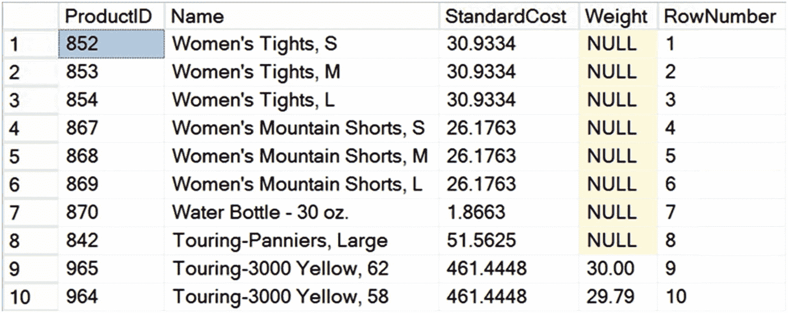

# 8. 索引架构与行为

在正确的列（或列组合）上创建正确的索引，是查询调优的起点。缺失索引或在错误的列（或列组合）上创建索引，可能成为所有性能问题的根源——从基本的数据访问开始，经过连接，最终到筛选子句。因此，对每个人（而不仅仅是 DBA）来说，理解可用于优化数据库设计的不同索引技术都极其重要。

在本章中，我将涵盖以下主题：

*   什么是索引
*   索引的益处与开销
*   索引设计的一般建议
*   聚集索引与非聚集索引的行为及比较
*   对聚集索引和非聚集索引的建议

## 什么是索引？

减少磁盘 I/O 的最佳方法之一是使用索引。索引允许 SQL Server 无需扫描整个表即可在表中查找数据。数据库中的索引类似于书籍的索引。例如，假设你想在本书中查找 `table scan`（表扫描）这个短语。在纸质版本中，如果没有书末的索引，你就必须翻阅整本书才能找到所需的内容。有了索引，你就能确切知道所需信息存储的位置。

在为数据库性能进行调优时，你会在查询所使用的不同列上创建索引，以帮助 SQL Server 快速查找数据。例如，针对 `Production.Product` 表的以下查询会产生如图 8-1 所示的数据（500+ 行中的前 10 行）：



图 8-1 示例 Production.Product 表

```sql
SELECT TOP 10
p.ProductID,
p.[Name],
p.StandardCost,
p.[Weight],
ROW_NUMBER() OVER (ORDER BY p.Name DESC) AS RowNumber
FROM Production.Product p
ORDER BY p.Name DESC;
```

上述查询扫描了整个表，因为没有 `WHERE` 子句。如果你需要通过 `WHERE` 子句添加筛选条件来检索所有 `StandardCost` 大于 150 的产品，在没有索引的情况下，表仍然需要被扫描，逐行检查 `StandardCost` 的值以确定哪些行的值大于 150。在 `StandardCost` 列上创建索引可以通过提供一种允许对数据进行结构化搜索而非逐行检查的机制来加速此过程。你可以采用两种不同且基本的方法来创建此索引。


图 8-2 按 StandardCost 排序的产品表

*   *像字典一样*：字典是按字母顺序排列的单词列表。索引可以以类似的方式存储。数据是有序的，尽管仍可能存在重复项。前 10 行数据，按 `StandardCost DESC` 而不是按 `Name` 排序，将如图 8-2 所示。注意 `RowNumber` 列显示了按 `Name` 排序时行的原始位置。

因此，如果你想查找所有 `StandardCost` 大于 150 的行中的数据，索引将允许你立即找到它们，只需移动到第一个大于 150 的值即可。一种根据索引键顺序对存储的数据应用顺序的索引被称为 `聚集索引`。由于 SQL Server 存储数据的方式，这是数据库设计中最重要的索引之一。我将在本章后面详细解释这一点。

表 8-1 Manufacturer 索引的结构

| StandardCost | RowNumber |
| --- | --- |
| 2171.2942 | 125 |
| 2171.2942 | 126 |
| 2171.2942 | 127 |
| 2171.2942 | 128 |
| 2171.2942 | 129 |
| 1912.1544 | 170 |

*   *像书籍的索引架构一样*：可以在不改变表布局的情况下创建一个有序列表，类似于书籍索引的创建方式。就像书籍的关键词索引在一个单独的部分列出关键词，并带有页码指向书籍的主体内容一样，`StandardCost` 值的列表被创建为一个独立的结构，并通过一个指针指向 `Product` 表中对应的行。在这个例子中，我将使用 `RowNumber` 作为指针。表 8-1 显示了 Manufacturer 索引的结构。

SQL Server 可以扫描 Manufacturer 索引来查找 `StandardCost` 大于 150 的行。由于 `StandardCost` 值按排序顺序排列，SQL Server 一旦遇到值为 150 或更小的行就可以停止扫描。这种类型的索引称为 `非聚集索引`，我将在本章后面详细解释。

在任何一种情况下，在大多数情况下，SQL Server 都能够比没有索引时更快地找到所有 `StandardCost` 大于 150 的产品。

你可以在表的单个列（如前所述）或列的组合上创建索引。SQL Server 还会自动为某些类型的约束（例如，`PRIMARY KEY` 和 `UNIQUE` 约束）创建索引。


