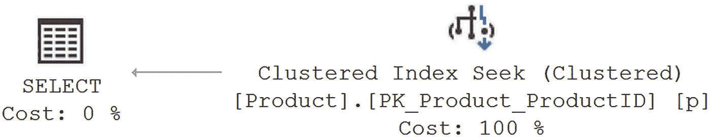

# 索引的好处

即使表上没有索引，SQL Server 也必须能够查找数据。当没有聚集索引来为数据建立存储顺序时，存储引擎将简单地读取整个表来查找所需内容。没有聚集索引的表称为 `heap table`（堆表）。堆只是一个无序的数据堆栈，带有一个指向存储位置的行标识符。除了通过逐行扫描数据（这一过程称为 `scan`）外，这些数据无法排序或搜索。当在表上创建聚集索引时，索引的键值为数据建立了顺序。此外，有了聚集索引，数据与索引一起存储，因此数据本身现在是有序的。当存在聚集索引时，非聚集索引上的指针由定义聚集索引键的值组成。这是聚集索引如此重要的一大原因。

SQL Server 中的数据存储在大小为 8KB 的页面上。页面是信息从磁盘移入内存的最小单位，因此一个页面能存储多少数据变得很重要。由于页面空间有限，如果行包含的列数较少或列的尺寸较小，它就能存储更多的行。非聚集索引通常不（也不应该）包含表的所有列；它通常只包含有限的列。因此，一个页面将能够存储非聚集索引的更多行，而非聚集索引所对应的表行包含所有列。因此，对于代表该列的非聚集索引的页面，SQL Server 能够从中读取的该列值数量，将比从包含该列的表页面读取的更多。

非聚集索引的另一个好处是，由于它与数据表是分开的结构，可以将其放在不同的文件组中，使用不同的 I/O 路径（如第 3 章所述）。这意味着 SQL Server 可以同时访问索引和表，从而使搜索速度更快。

索引将其信息存储在称为 `B-tree`（B 树）结构的平衡树中，因此定位特定行所需的读取次数被最小化。以下示例展示了 B 树结构的好处。

考虑一个包含 27 行、随机排序且每个叶级页面只有 3 行的单列表。假设页面中行的布局如图 8-3 所示。


图 8-3 27 行的初始布局

要搜索列值为 5 的行，SQL Server 必须扫描所有行和页面，因为即使最后一页的最后一行也可能具有值 5。因为读取次数取决于访问的页面数，所以在该列上没有索引的情况下，必须执行九次读取操作（从磁盘检索页面并将其传输到内存）。可以通过在该列上创建索引来使这些内容有序，结果行的布局和页面如图 8-4 所示。


图 8-4 27 行的有序布局

对列进行索引会使内容按排序方式排列。这使得 SQL Server 能够根据列中一个行位置的值，确定另一个行位置可能的值。例如，在图 8-4 中，当 SQL Server 找到第一个列值为 6 的行时，它可以确定不再有列值为 5 的行。因此，当内容被索引时，只需要两次读取操作就可以获取值为 5 的行。但是，如果要搜索列值 25 呢？这将需要九次读取操作！通过使用 B 树结构（如图 8-5 所示）实现索引，可以解决这个问题。


图 8-5 27 行的 B 树布局

B 树由一个称为 `root node`（根节点）的起始节点（或页面）组成，`branch nodes`（分支节点）（或页面）从中生长出来（或与之链接）。所有键都存储在叶子中。每个内部节点（叶节点之上）都包含指向其分支节点的指针，以及表示在分支节点中找到的最小值的值。键在每个节点内按排序顺序保持。B 树使用平衡树结构进行高效的记录检索——当所有叶节点距离根节点的层级相同时，B 树是平衡的。例如，在前面的内容上创建索引将生成如图 8-5 所示的平衡 B 树结构。在底层，所有叶节点通过一个双向链表相互连接，意味着每个页面指向其后的页面，而其后的页面又指向前一个页面。这可以防止在遍历页面超出中间页面的定义范围时，需要回溯链。

B 算法最小化了定位所需键所需访问的页面数，从而加快了数据访问过程。例如，在图 8-5 中，搜索键值 5 从顶部的根节点开始。由于键值在 1 和 10 之间，搜索过程沿着左侧分支进入下一个节点。因为键值 5 介于值 4 和 7 之间，搜索过程沿着中间分支进入下一个起始键值为 4 的节点。搜索过程从这个叶页面检索到键值 5。如果此页面中不存在键值 5，搜索过程将停止，因为它是叶页面。同样，搜索键值 25 也可以使用相同的读取次数完成。


### 索引开销

索引带来的性能提升确实伴随着一定的代价。带有索引的表除了需要存储表的数据页外，还需要额外的存储空间和内存来存放索引页。数据操作查询（`INSERT`、`UPDATE` 和 `DELETE` 语句，即增删改查 [CRUD] 中的增、改、删部分）可能会耗时更长，并且需要更多的处理时间来维护频繁变化表的索引。这是因为，与 `SELECT` 语句不同，数据操作查询会修改表的数据内容。如果 `INSERT` 语句向表中添加一行，那么它也必须在索引结构中添加一行。如果索引是聚集索引，开销会更大，因为这一行必须按正确的顺序添加到数据页本身中，这可能需要重新定位其他数据行在新行插入位置之后。`UPDATE` 和 `DELETE` 数据操作查询以类似的方式更改索引页。

在设计索引时，你将从两个不同的角度进行操作：一是已投入生产的现有系统，此时你需要衡量索引的整体影响；二是战术性方法，通常在初始设计系统时，你只关心索引的即时收益。当你处理现有系统时，应确保索引的性能收益超过其消耗的额外处理资源成本。你可以使用扩展事件（在第 3 章中解释）进行整体工作负载优化（在第 27 章中解释）来实现这一点。当你只关注索引的即时收益时，SQL Server 提供了一系列动态管理视图，这些视图提供了有关索引性能的详细信息，例如 `sys.dm_db_index_operational_stats` 或 `sys.dm_db_index_usage_stats`。视图 `sys.dm_db_index_operational_stats` 显示正在使用的索引上的低级别活动，如锁和 I/O。视图 `sys.dm_db_index_usage_stats` 返回随时间推移在索引上发生的各种索引操作的统计计数。在讨论阻塞的第 21 章中，我们将更广泛地使用这两个视图。

### 注意

在本书的某些部分，我对正在运行的查询使用了 `STATISTICS IO` 和 `STATISTICS TIME` 测量。你可以向代码中添加 `SET` 命令，也可以更改查询窗口的连接设置。我建议只更改连接设置。然而，这里也应该有一个警告。同时使用 `STATISTICS IO` 和 `STATISTICS TIME` 有时会导致问题。检索 I/O 信息所花费的时间会被计入 `STATISTICS TIME` 信息中，从而扭曲结果。如果你不需要表级 I/O，最好使用扩展事件来捕获执行指标。如果你正在捕获查询的实际执行计划，也可以从其中获取 `CpuTime` 和 `ElapsedTime`。

为了理解索引对数据操作查询的开销成本，请考虑以下示例。首先，创建一个包含 10,000 行的测试表。

```
DROP TABLE IF EXISTS dbo.Test1;
GO
CREATE TABLE dbo.Test1
(
C1 INT,
C2 INT,
C3 VARCHAR(50)
);
WITH Nums
AS (SELECT TOP (10000)
ROW_NUMBER() OVER (ORDER BY (SELECT 1)) AS n
FROM master.sys.all_columns ac1
CROSS JOIN master.sys.all_columns ac2
)
INSERT INTO dbo.Test1
(
C1,
C2,
C3
)
SELECT n,
n,
'C3'
FROM Nums;
```

运行一个 `UPDATE` 语句，如下所示：

```
UPDATE dbo.Test1
SET C1 = 1,
C2 = 1
WHERE C2 = 1;
```

然后，`SET STATISTICS I0` 报告的逻辑读次数如下：

```
Table 'Test1'. Scan count 1, logical reads 29
```

在列 `C1` 上添加一个索引，如下所示：

```
CREATE CLUSTERED INDEX iTest
ON dbo.Test1(C1);
```

那么，对于同一个 `UPDATE` 语句，逻辑读次数从 29 增加到 38，同时还增加了一个临时工作表，额外产生了 5 次读取，总计 43 次。

```
Table 'Test1'. Scan count 1, logical reads 38
Table 'Worktable'. Scan count 1, logical reads 5
```

读取次数增加是因为有必要重新排列数据，以便在聚集索引中按正确的顺序存储，这比堆表仅仅将数据添加到现有存储末尾所需的读取次数要多。

### 注意

`worktable`（工作表）是 SQL Server 内部用于处理查询中间结果的临时表。工作表在 `tempdb` 数据库中创建，并在查询执行后自动删除。

尽管维护索引所需的开销量确实会增加数据操作查询的成本，但请注意，SQL Server 必须首先找到一行才能更新或删除它；因此，对于带有必要 `WHERE` 子句的 `UPDATE` 和 `DELETE` 语句，索引仍然是有帮助的。使用索引定位行的效率提升通常可以抵消更新索引所需的额外开销，除非表有大量的索引或大量的更新操作。此外，绝大多数系统都是读取密集型的，这意味着检索的数据量远大于插入或修改的数据量。

为了理解索引如何有益于甚至数据修改查询，让我们在示例的基础上继续。在表 `Test1` 上创建另一个索引。这次，在 `UPDATE` 语句的 `WHERE` 子句中引用的列 `C2` 上创建索引。

```
CREATE NONCLUSTERED INDEX iTest2
ON dbo.Test1(C2);
```

添加这个新索引后，再次运行 `UPDATE` 命令。

```
UPDATE  dbo.Test1
SET     C1 = 1,
C2 = 1
WHERE   C2 = 1;
```

该 `UPDATE` 语句的总逻辑读次数从 43 减少到 20 (= 15 + 5)。

```
Table 'Test1'. Scan count 1, logical reads 15
Table 'Worktable'. Scan count 1, logical reads 5
```

本节中的示例表明，尽管拥有索引会给操作查询增加一些开销成本，但由于索引对搜索的有益影响，整体结果可能是成本的降低，即使在更新期间也是如此。

## 索引设计建议

索引设计的主要建议如下：

*   检查 `WHERE` 子句和 `JOIN` 条件列。
*   使用窄索引。
*   检查列的唯一性和选择性。
*   检查列数据类型。
*   考虑列顺序。
*   考虑索引类型（聚集索引与非聚集索引）。

让我们依次考虑这些建议。

### 检查 WHERE 子句和 JOIN 条件列

当查询提交给 SQL Server 时，查询优化器会尝试为查询中引用的每个表找到最佳的数据访问机制。以下是它的工作方式：

1.  优化器识别 `WHERE` 子句和 `JOIN` 条件中包含的列。谓词是评估为真、假或未知的逻辑条件。它们包括 `IN` 或 `BETWEEN` 之类的内容。
2.  然后优化器检查这些列上的索引。
3.  优化器通过确定子句的选择性（即，将返回多少行）来评估每个索引的有用性，选择性是基于维护的索引统计信息计算的。
4.  约束（如主键和外键）也会被评估并由优化器用来确定查询中使用对象的选择性。
5.  最后，优化器基于先前步骤收集的信息，估算出检索合格行的成本最低的方法。


### 第 8 章：查询优化与索引

第 13 章更深入地涵盖了统计信息。

要理解查询中 `WHERE` 子句列的重要性，让我们考虑一个示例。回到那个帮助你理解索引是什么的原始代码清单；该查询由一个没有任何 `WHERE` 子句的 `SELECT` 语句组成，如下所示：

```sql
SELECT p.ProductID,
       p.Name,
       p.StandardCost,
       p.Weight
FROM Production.Product p;
```

查询优化器执行聚集索引扫描，这相当于对具有聚集索引的表上的堆进行表扫描，以读取行，如图 8-6 所示（在查询窗口中按 `Ctrl+M` 打开“包括实际执行计划”选项，并通过右键单击、选择“查询选项”，然后在“高级”选项卡上选择相应的复选框来打开“设置统计 IO”选项）。


图 8-6 不带 WHERE 子句的执行计划

由 `SET STATISTICS IO` 报告的该 `SELECT` 语句的逻辑读取次数如下：

```text
Table 'Product'. Scan count 1, logical reads 15
```

> **注意**
> 捕获执行计划会影响你使用几乎所有方法收集的任何时间指标。因此，在真正需要测量时间时，请记住关闭执行计划捕获。

为了理解 `WHERE` 子句列对查询优化器决策的影响，让我们添加一个 `WHERE` 子句来检索单行。

```sql
SELECT p.ProductID,
       p.Name,
       p.StandardCost,
       p.Weight
FROM Production.Product AS p
WHERE p.ProductID = 738;
```

有了 `WHERE` 子句后，查询优化器会检查 `WHERE` 子句列 `ProductID`，确认列 `ProductID` 上存在索引 `PK_Product_ProductId`，根据索引 `PK_Product_ProductId` 的统计信息评估该 `WHERE` 子句具有高选择性（即只返回一行），并决定使用该索引来检索数据，如图 8-7 所示。



图 8-7 带 WHERE 子句的执行计划

由此产生的逻辑读取次数如下：

```text
Table 'Product'. Scan count 0, logical reads 2
```

查询优化器的行为表明，`WHERE` 子句列有助于优化器为查询选择最佳的索引操作。这也适用于两个表之间 `JOIN` 条件中使用的列。优化器会查找 `WHERE` 子句列或 `JOIN` 条件列上的索引，如果可用，则考虑使用该索引从表中检索行。查询优化器在执行查询时会考虑 `WHERE` 子句列和 `JOIN` 条件列上的索引。因此，在 SQL 查询的 `WHERE` 子句、`HAVING` 子句和 `JOIN` 条件中频繁使用的列上创建索引，有助于优化器避免扫描基表。

当表内的数据量非常小，以至于可以放入单个页面（8KB）时，表扫描可能比索引查找效果更好。如果你有一个很好的索引，但仍然得到扫描结果，请考虑这种效应。

### 使用窄索引

为了获得最佳性能，在创建索引时应使用尽可能窄（即小）的数据类型。“窄”在这里的含义是尽可能小的数据类型。你还应该避免在索引中使用非常宽的数据类型列。具有字符串数据类型（`CHAR`、`VARCHAR`、`NCHAR` 和 `NVARCHAR`）的列有时可能相当宽，二进制和全局唯一标识符（GUID）也是如此。除非绝对必要，否则应尽量减少在索引中使用具有大长度的宽数据类型列。你可以在表的多个列组合上创建索引。为了获得最佳性能，索引中应使用尽可能少的列。但是，应使用你需要使用的列来为索引定义一个有用的键。

窄索引比宽索引在 8KB 的索引页中能容纳更多的行。这有以下效果：

*   减少 I/O（因为需要读取的 8KB 页面更少）
*   使数据库缓存更有效，因为 SQL Server 可以缓存更少的索引页，从而减少内存中索引页所需的逻辑读取
*   减少数据库的存储空间

为了理解窄索引如何减少逻辑读取次数，创建一个包含 20 行和一个索引的测试表。

```sql
DROP TABLE IF EXISTS dbo.Test1;
GO
CREATE TABLE dbo.Test1 (C1 INT, C2 INT);
WITH    Nums
        AS (SELECT    1 AS n
            UNION ALL
            SELECT    n + 1
            FROM      Nums
            WHERE     n < 20
           )
INSERT  INTO dbo.Test1
        (C1, C2)
        SELECT  n, n
        FROM    Nums;
CREATE INDEX iTest ON dbo.Test1(C1);
```

由于索引列很窄（`INT` 数据类型为 4 字节），所有的索引行都可以容纳在一个 8KB 的索引页中。如图 8-8 所示，你可以在与索引关联的动态管理视图中确认这一点。如果你的数据库 ID 解析为 NULL，可能会出错。


图 8-8 窄的非聚集索引的页数

```sql
SELECT i.name,
       i.type_desc,
       ddips.page_count,
       ddips.record_count,
       ddips.index_level
FROM   sys.indexes i
JOIN   sys.dm_db_index_physical_stats(   DB_ID(N'AdventureWorks2017'),
                                         OBJECT_ID(N'dbo.Test1'),
                                         NULL,
                                         NULL,
                                         'DETAILED'
                                       ) AS ddips
       ON i.index_id = ddips.index_id
WHERE  i.object_id = OBJECT_ID(N'dbo.Test1');
```

系统表 `sys.indexes` 存储在每个数据库中，包含数据库中每个索引的基本信息。动态管理函数 `sys.dm_db_index_physical_stats` 包含有关索引统计信息的更详细信息（你将在第 14 章了解更多关于此 DMV 的内容）。为了理解宽索引键的缺点，将索引列 `C1` 的数据类型从 `INT` 修改为 `CHAR(500)`（下载文件中的 `narrow_alter.sql`）。

```sql
DROP INDEX dbo.Test1.iTest;
ALTER TABLE dbo.Test1 ALTER COLUMN C1 CHAR(500);
CREATE INDEX iTest ON dbo.Test1(C1);
```

`INT` 数据类型列的宽度为 4 字节，而 `CHAR(500)` 数据类型列的宽度为 500 字节。由于索引列宽度很大，需要两个索引页来容纳所有 20 个索引行。你可以通过再次对其运行查询来在 `sys.dm_db_index_physical_stats` 动态管理函数中确认这一点（见图 8-9）。


图 8-9 宽的非聚集索引的页数

大的索引键大小会增加索引页的数量，从而增加索引所需的内存和磁盘活动量。始终建议将索引键大小设置得尽可能窄。

在继续之前删除测试表。

```sql
DROP TABLE dbo.Test1;
```


