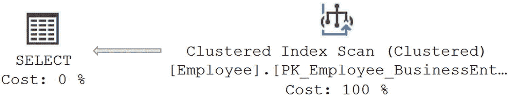
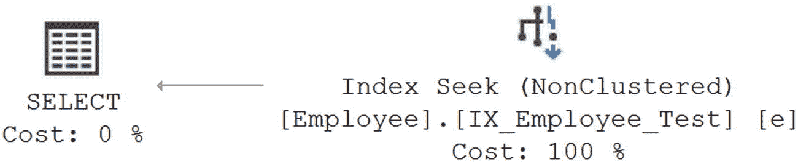
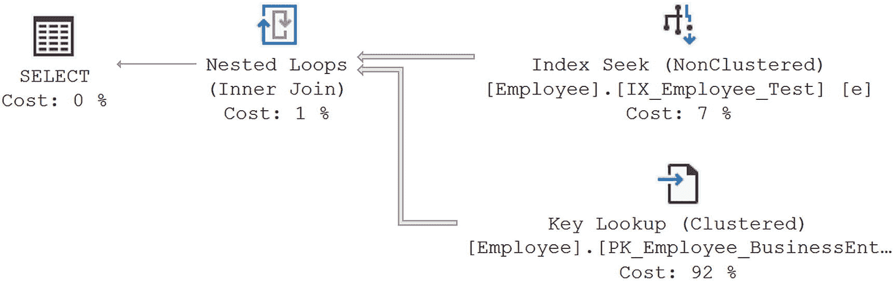
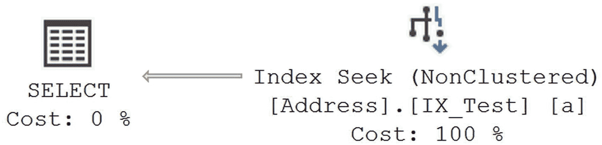
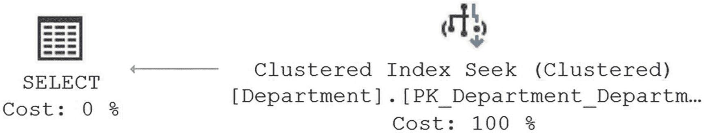
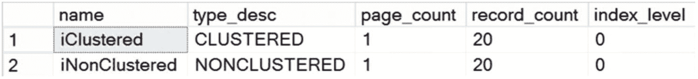
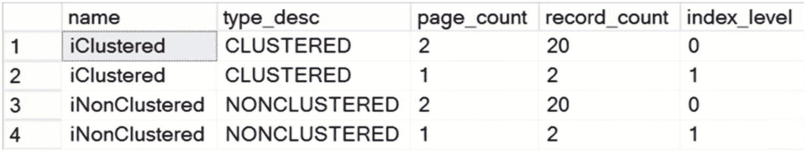
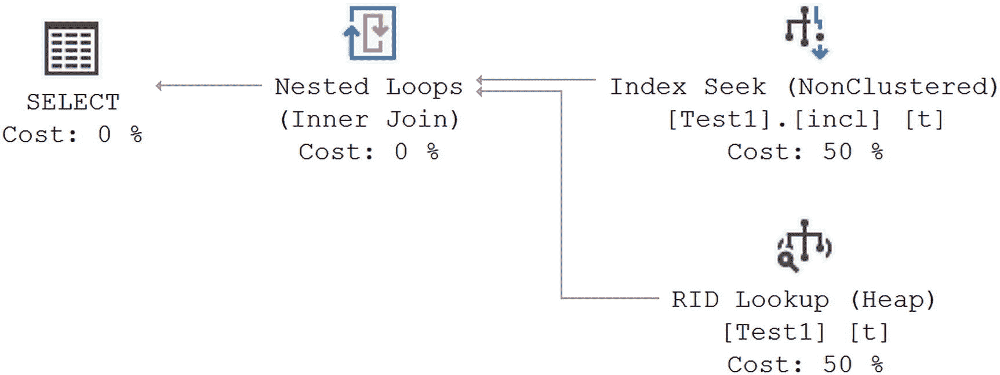
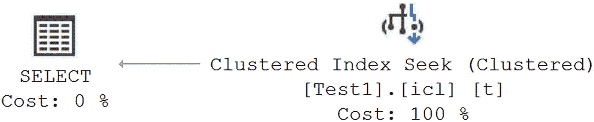

# 检查列的唯一性

在具有极低范围可能唯一值（例如`MaritalStatus`）的列上创建索引不会对性能有益，因为查询优化器将无法使用索引来有效缩小要返回的行范围。考虑一个只有两个唯一值`M`和`S`的`MaritalStatus`列。当您执行一个在`WHERE`子句中包含`MaritalStatus`列的查询时，最终会从表中获取大量行（假设`M`和`S`的分布相对均匀），导致代价高昂的表或聚集索引扫描。在`WHERE`子句中使用具有大量唯一行（或**高选择性**）的列来限制访问的行数总是更可取的。您应该在这些列上创建索引，以帮助优化器访问较小的结果集。

此外，在多列上创建索引（也称为**复合索引**）时，列的顺序很重要。在许多情况下，首先使用最具选择性的列将有助于更有效地过滤索引行。

### 注意

列在复合索引中的重要性将在本章后面的“考虑列顺序”部分进行解释。

由此可见，在列上创建索引之前了解其选择性非常重要。您可以通过执行如下查询来找到这一点；只需替换表名和列名：

```sql
SELECT COUNT(DISTINCT e.MaritalStatus) AS DistinctColValues,
COUNT(e.MaritalStatus) AS NumberOfRows,
(CAST(COUNT(DISTINCT e.MaritalStatus) AS DECIMAL)
/ CAST(COUNT(e.MaritalStatus) AS DECIMAL)) AS Selectivity,
(1.0 / (COUNT(DISTINCT e.MaritalStatus))) AS Density
FROM HumanResources.Employee AS e;
```

当然，您不需要对每个列或每个索引运行这种查询。此查询展示了 SQL Server 使用的一些统计信息是如何组合在一起的。您可以直接使用`DBCC SHOW_STATISTICS`或通过查询 DMF `sys.dm_db_stats_histogram`和`sys.dm_db_stats_properties`来查看统计信息。我们将在第 13 章中详细介绍所有这些内容。

当在`WHERE`子句或联接条件中引用时，具有最多唯一值（或选择性最高）的列可能是索引的最佳候选。您也可能遇到特殊数据，其中有数百行常见数据，只有少数是唯一的。这少数唯一值也将受益于索引。您可以通过使用筛选索引（在第 9 章中有更详细的讨论）使其更加有益。

为了理解索引键列的选择性如何影响索引的使用，请查看`HumanResources.Employee`表中的`MaritalStatus`列。如果您运行前面的查询，您会看到它在 290 行中只包含两个不同的值，选择性为 0.0069，密度为 0.5。一个查找`MaritalStatus`为`M`以及特定`BirthDate`值的查询如下所示：

```sql
SELECT e.MaritalStatus,
e.BirthDate
FROM HumanResources.Employee AS e
WHERE e.MaritalStatus = 'M'
AND e.BirthDate = '1982-02-11';
```

这将产生如图 8-10 所示的执行计划以及以下 I/O 和用时：



图 8-10

无索引时的执行计划

```
Table 'Employee'. Scan count 1, logical reads 9
CPU time = 0 ms,  elapsed time = 2 ms.
```

数据是通过扫描聚集索引（数据存储的位置）来查找`MaritalStatus = 'M'`的适当值而返回的。如果您在该列上放置一个索引，如下所示，并再次运行查询，执行计划保持不变：

```sql
CREATE INDEX IX_Employee_Test ON HumanResources.Employee (MaritalStatus);
```

数据选择性不够，无法使用该索引，更不用说有用了。如果您改用如下所示的复合索引：

```sql
CREATE INDEX IX_Employee_Test
ON HumanResources.Employee
(
BirthDate,
MaritalStatus
)
WITH (DROP_EXISTING = ON);
```

那么，当您重新运行查询时，会生成一个完全不同的执行计划。您可以在图 8-11 中看到它以及性能结果。



图 8-11

使用复合索引时的执行计划

```
Table 'Employee'. Scan count 1, logical reads 2
CPU time = 0 ms,  elapsed time = 2 ms.
```

现在您比使用聚集索引扫描时表现得更好。一个干净利落的索引查找操作花费不到一半的时间来收集数据。

尽管这些列中没有一个可能具有足够选择性来单独构成一个好的索引（除了`BirthDate`列可能例外），但它们一起提供了足够的选择性，使优化器能够利用所提供的索引。

可以尝试强制查询使用您创建的第一个测试索引。如果您删除复合索引，重新创建原始索引，然后通过使用查询提示强制使用原始索引结构来修改查询，如下所示：

```sql
CREATE INDEX IX_Employee_Test
ON HumanResources.Employee
(
MaritalStatus
)
WITH (DROP_EXISTING = ON);

SELECT e.MaritalStatus,
e.BirthDate
FROM HumanResources.Employee AS e WITH (INDEX(IX_Employee_Test))
WHERE e.MaritalStatus = 'M'
AND e.BirthDate = '1982-02-11';
```

那么，图 8-12 所示的结果和执行计划虽然相似，但并不相同。



图 8-12

使用查询提示选择索引时的执行计划

```
Table 'Employee'. Scan count 1, logical reads 294
CPU time = 0 ms,  elapsed time = 47 ms.
```

您看到相同的索引查找，但读取次数急剧增加，并且执行计划本身也发生了变化。您现在有一个`Nested Loops`联接和一个添加到计划中的`Key Lookup`操作符。虽然强制优化器选择索引是可能的，但这显然并不总是最优的方法。查询提示剥夺了优化器的选择，并强制它走通常次优的路径。提示不考虑结构的变化，例如优化器可能用于更好地生效的新索引。提示还迫使优化器忽略可能导致更好计划的数据更改。

### 注意

您将在第 12 章中了解键查找。

自 SQL Server 2012 以来，强制不同行为的另一种方法是`FORCESEEK`查询提示。`FORCESEEK`使得优化器只选择`Index Seek`操作。如果查询被重写如下：

```sql
SELECT e.MaritalStatus,
e.BirthDate
FROM HumanResources.Employee AS e WITH (FORCESEEK)
WHERE e.MaritalStatus = 'M'
AND e.BirthDate = '1982-02-11';
```

此查询产生的执行计划与图 8-12 相同，性能同样糟糕。

限制优化器的选项并强制行为在某些情况下可能有帮助，但通常情况下，如这里显示的结果所示，执行时间和读取次数的增加并无帮助。

在继续之前，请确保从表中删除测试索引。

```sql
DROP INDEX HumanResources.Employee.IX_Employee_Test;
```


## 检查列数据类型

索引列的数据类型至关重要。例如，在整数键上的索引搜索速度很快，这是因为 `INTEGER`（或 `INT`）数据类型体积小且易于进行算术运算。你也可以使用其他整数数据类型变体（`BIGINT`、`SMALLINT` 和 `TINYINT`）作为索引列，而字符串数据类型（`CHAR`、`VARCHAR`、`NCHAR` 和 `NVARCHAR`）则需要进行字符串匹配操作，这通常比整数匹配操作的开销更大。

假设你想要在一个列上创建索引，并且有两个候选列——一列的数据类型是 `INTEGER`，另一列是 `CHAR(4)`。尽管在 SQL Server 2017 和 Azure SQL Database 中，这两种数据类型的大小都是 4 字节，你仍然应该优先选择 `INTEGER` 数据类型的索引。以算术操作为例，`CHAR(4)` 数据类型中的值 `1` 实际上存储为 `1` 后跟三个空格，即以下四个字节的组合：`0x35`、`0x20`、`0x20` 和 `0x20`。CPU 不知道如何对此数据执行算术操作，因此会在进行算术运算之前将其转换为 `integer` 数据类型。而 `integer` 数据类型中的值 `1` 则保存为 `0x00000001`。CPU 可以轻松地对此数据执行算术操作。

当然，大多数时候，你不会在大小相同的数据类型之间做简单的选择，从而让你能选择更优的类型。在设计和构建索引时，请牢记这一点。

## 考虑索引列顺序

索引键首先按照索引的第一列排序，然后在前一列的每个值内，再按下一列进行子排序。复合索引的第一列通常被称为索引的 `前导列`。例如，考虑表 8-2。

表 8-2：示例表

| `c1` | `c2` |
| --- | --- |
| 1 | 1 |
| 2 | 1 |
| 3 | 1 |
| 1 | 2 |
| 2 | 2 |
| 3 | 2 |

如果在列 (`c1`, `c2`) 上创建一个复合索引，那么索引的顺序将如表 8-3 所示。

表 8-3：列 (`c1`, `c2`) 上的复合索引

| `c1` | `c2` |
| --- | --- |
| 1 | 1 |
| 1 | 2 |
| 2 | 1 |
| 2 | 2 |
| 3 | 1 |
| 3 | 2 |

如表 8-3 所示，数据首先按照复合索引中的第一列 (`c1`) 排序。在第一列的每个值内，数据会进一步按照第二列 (`c2`) 排序。

因此，复合索引中的列顺序是影响索引有效性的重要因素。通过考虑以下几点可以看出这一点：

*   列的唯一性
*   列的宽度
*   列的数据类型

例如，假设你对表 `t1` 的大多数查询都类似于以下语句：

```sql
SELECT p.ProductID FROM Production.Product AS p
WHERE p.ProductSubcategoryID = 1;
SELECT p.ProductID FROM Production.Product AS p
WHERE p.ProductSubcategoryID = 1
AND p.ProductModelID = 19;
```

在 (`ProductSubcategoryID`, `ProductModelID`) 上创建的索引将使这两个查询都受益。但是，在 (`ProductModelID`, `ProductSubCategoryID`) 上创建的索引对这两个查询都没有帮助，因为它会首先按照 `ProductModelID` 列对数据进行排序，而第一个 `SELECT` 语句需要数据按照 `ProductSubCategoryID` 列排序。

为了理解列顺序在索引中的重要性，请考虑以下示例。在 `Person.Address` 表中，有一个 `City` 列和一个 `PostalCode` 列。按如下方式在表上创建索引：

```sql
CREATE INDEX IX_Test ON Person.Address (City, PostalCode);
```

一个使用这个新索引的简单 `SELECT` 语句看起来像这样：

```sql
SELECT a.City,
a.PostalCode
FROM Person.Address AS a
WHERE a.City = 'Dresden';
```

该查询的 I/O 和执行时间如下：

```
Table 'Address'. Scan count 1, logical reads 2
CPU time = 0 ms,  elapsed time = 0 ms. (或在扩展事件中为 164 微秒)
```

图 8-13 中的执行计划显示了索引的使用情况。



图 8-13：针对索引前导列的查询执行计划

因此，这个查询利用索引的前导列执行 `Seek` 操作来检索数据。如果，你不使用前导列进行查询，而是使用索引中的另一列，如下一个查询所示：

```sql
SELECT a.City,
a.PostalCode
FROM Person.Address AS a
WHERE a.PostalCode = ' 01071';
```

结果如下：

```
Table 'Address'. Scan count 1, logical reads 108
CPU time = 0 ms,  elapsed time = 2 ms.
```

执行计划明显不同，如图 8-14 所示。


图 8-14：针对内部列的查询执行计划

两个查询都从同一张表返回 31 行数据，但读取次数从 2 跃升至 108。你开始看到图 8-13 中的 `Index Seek` 操作和图 8-14 中的 `Index Scan` 操作之间的区别。I/O 和时间的剧烈变化代表了复合索引的另一个优势，即覆盖索引。这将在第 9 章详细讨论。

完成后，删除索引。

```sql
DROP INDEX Person.Address.IX_Test;
```

## 考虑索引类型

在 SQL Server 中，对于所有可用的不同类型的索引，大多数时候你将处理两种主要的索引类型：`聚集索引` 和 `非聚集索引`。这两种类型都具有 B 树结构。两者之间的主要区别在于，聚集索引的叶子页就是表的数据页，因此它们与它们所指向的数据具有相同的顺序。这意味着聚集索引就是表本身。随着你深入学习，你会发现这两种索引类型在叶子级别的差异在确定使用哪种索引类型时变得很重要。

还有其他一些索引类型，我们将在第 9 章中更详细地介绍它们。

## 聚集索引

聚集索引的叶子页和其所基于表的数据页是同一个。正因为如此，表行在物理上按照聚集索引列排序，并且由于表数据只能有一种物理顺序，因此一个表只能有一个聚集索引。

### 提示

当你创建主键约束时，如果尚未存在聚集索引，并且没有显式指定索引应为唯一非聚集索引，SQL Server 会自动在主键上创建唯一聚集索引。这不是必须的；这只是默认行为。你可以在表上创建主键之前更改其定义。

## 堆表

如本章前面所述，没有聚集索引的表称为 `堆表`。堆表的数据行不以任何特定顺序存储，也不与表中的相邻页面链接。与访问大型非堆表（具有聚集索引的表）相比，堆表的这种无组织结构通常会增加访问大型堆表的开销。


### 与非聚集索引的关系

在 SQL Server 中，聚集索引与非聚集索引之间存在一种有趣的关系。非聚集索引的索引行包含一个指向表中对应数据行的指针。这个指针被称为 `行定位器`。行定位器的值取决于数据页是存储在堆中还是存储在聚集索引中。对于非聚集索引，如果数据存储在堆中，行定位器是指向数据行在堆中的行标识符的指针。对于具有聚集索引的表，行定位器是聚集索引键值。

例如，假设你有一个没有聚集索引的堆表，如表 8-4 所示。

表 8-4
示例表的数据页

| RowID (非真实列) | c1 | c2 | c3 |
| --- | --- | --- | --- |
| 1 | A1 | A2 | A3 |
| 2 | B1 | B2 | B3 |

在堆表的 `c1` 列上创建的非聚集索引，其索引行的行定位器将包含指向数据库表中对应数据行的指针，如表 8-5 所示。

表 8-5
无聚集索引时的非聚集索引页

| c1 | 行定位器 |
| --- | --- |
| A1 | 指向 `RID = 1` |
| B1 | 指向 `RID = 2` |

当在 `c2` 列上创建聚集索引后，非聚集索引行的行定位器值会被更改。新的行定位器值将包含聚集索引键值，如表 8-6 所示。

表 8-6
在 c2 上创建聚集索引后的非聚集索引页

| c1 | 行定位器 |
| --- | --- |
| A1 | A2 |
| B1 | B2 |

为了验证聚集索引与非聚集索引之间的这种依赖关系，让我们看一个例子。在 AdventureWorks2017 数据库中，表 `dbo.DatabaseLog` 没有聚集索引，只有一个非聚集主键。如果运行如下查询，其执行计划将如图 8-15 所示：


图 8-15
针对堆表的执行计划

```
SELECT dl.DatabaseLogID,
dl.PostTime
FROM dbo.DatabaseLog AS dl
WHERE dl.DatabaseLogID = 115;
```

如你所见，索引被用于 `Seek` 操作。但由于数据与非聚集索引分开存储，并且该索引不包含满足查询所需的所有列，因此需要一个额外的操作，即 `RID 查找` 操作，来检索数据。然后，来自堆和非聚集索引这两个来源的数据通过 `Nested Loop` 操作连接起来。这是一个经典的 `查找` 示例，在本例中是 RID 查找，这在“定义查找”一节中有更详细的解释。针对已有聚集索引的表运行的类似查询如下所示：

```
SELECT d.DepartmentID,
d.ModifiedDate
FROM HumanResources.Department AS d
WHERE d.DepartmentID = 10;
```

图 8-16 显示了返回的执行计划。



图 8-16
带有聚集索引的执行计划

尽管主键的使用方式与上一个查询相同，但这次它是针对聚集索引的。这意味着数据与索引存储在一起，因此额外的列不需要通过查找操作来获取数据。所有内容都通过简单的 `聚集索引查找` 操作返回。

要从非聚集索引行导航到数据行，这两种索引类型之间的这种关系要求在遍历聚集索引的 B 树结构时增加一次额外的间接寻址。如果没有聚集索引，非聚集索引的行定位器将能够直接从非聚集索引行导航到基表中的数据行。聚集索引的存在导致从非聚集索引行到数据行的导航必须经过聚集索引的 B 树结构，因为新的行定位器值指向的是聚集索引键。

另一方面，考虑在聚集索引键顺序中插入一个中间行，或者扩展一个中间行的内容。例如，想象一个聚集索引表，每页包含四行，聚集索引列的值分别为 `1`、`2`、`4` 和 `5`。在表中插入一个聚集索引值为 `3` 的新行，将需要在值 `2` 和 `4` 之间的页面位置有空间。如果该位置没有足够的空间，数据页（或聚集索引叶子页）上将发生页面拆分。即使数据页拆分会导致数据行重新定位，也不需要更新非聚集索引的行定位器值。这些行定位器继续指向相同的聚集索引键逻辑键值，即使数据行已经物理移动到了不同的位置。在数据页拆分的情况下，非聚集索引的行定位器不需要更新。这一点很重要，因为表通常有大量的非聚集索引。

对于堆表，情况并非如此。堆中的页面拆分并不常见，而且当堆确实拆分时，它们不会像聚集索引那样重新排列位置。然而，堆中的行可能会移动，通常是由于更新导致堆无法容纳在当前页面中。任何导致堆中行位置移动的操作，都会导致在原始位置放置一个指向新位置的转发记录，从而需要更多的 I/O 活动。

### 注意

页面拆分及其对性能的影响在第 14 章中有更详细的解释。

### 聚集索引建议

聚集索引与非聚集索引之间的关系对聚集索引施加了一些需要考虑的因素，这些将在接下来的章节中解释。

#### 首先创建聚集索引

由于所有非聚集索引都在其索引行中保存聚集索引键，因此非聚集索引和聚集索引的创建顺序很重要。例如，如果在创建聚集索引之前构建了非聚集索引，那么非聚集索引的行定位器将包含指向表中相应 RID 的指针。稍后创建聚集索引将修改所有非聚集索引，将聚集索引键作为新的行定位器值。这实际上会重建所有非聚集索引。

为了获得最佳性能，我建议你在创建任何非聚集索引*之前*创建聚集索引。这允许非聚集索引在创建时将其行定位器设置为聚集索引键。这对最终性能没有任何影响，但重建索引可能是一项相当大的工作。

作为首先创建聚集索引的一部分，我还建议你在 OLTP 数据库中围绕聚集索引来设计表。它应该是第一个创建的索引，因为默认情况下你应该将数据存储为聚集索引。

对于分析型和数据仓库数据，还有另一种数据存储选项可用，即聚集列存储索引。我们将在第 9 章讨论该索引。


#### 保持聚簇索引的窄小

由于所有非聚簇索引都将聚簇键作为其行定位器，为了获得最佳性能，应尽可能保持聚簇索引的整体字节大小较小。如果你创建了一个宽的聚簇索引，例如 `CHAR(500)`，除了聚簇中每页容纳的行数会减少外，这还会给每个非聚簇索引增加 500 字节。因此，应将聚簇索引中的列数保持在最少，并仔细考虑要包含在聚簇索引中的每一列的字节大小。`integer` 数据类型的列通常是聚簇索引的良好候选者，而字符串数据类型的列则是一个次优选择。反之，即使这意味着键值更宽，也要为聚簇索引选择正确的键值。宽键可能会损害性能，但错误的聚簇键对性能的损害可能更大。

为了理解宽聚簇索引对非聚簇索引的影响，请考虑以下示例。创建一个带有聚簇索引和非聚簇索引的小型测试表。

```sql
DROP TABLE IF EXISTS dbo.Test1;
GO
CREATE TABLE dbo.Test1 (
C1 INT,
C2 INT);
WITH Nums
AS (SELECT TOP (20)
ROW_NUMBER() OVER (ORDER BY (SELECT 1)) AS n
FROM master.sys.all_columns ac1
CROSS JOIN master.sys.all_columns ac2)
INSERT INTO dbo.Test1 (
C1,
C2)
SELECT n,
n + 1
FROM Nums;
CREATE CLUSTERED INDEX iClustered ON dbo.Test1 (C2);
CREATE NONCLUSTERED INDEX iNonClustered ON dbo.Test1 (C1);
```

由于该表具有聚簇索引，非聚簇索引的行定位器包含聚簇索引键值。因此：

*   非聚簇索引行的宽度 = 非聚簇索引列的宽度 + 聚簇索引列的宽度 = `INT` 数据类型的大小 + `INT` 数据类型的大小

```sql
= 4 字节 + 4 字节 = 8 字节
```

由于非聚簇索引行的尺寸很小，所有行都可以存储在一个索引页中。你可以通过查询索引统计信息来确认这一点，如图 8-17 所示。



图 8-17

窄索引的索引页数

```sql
SELECT i.name,
i.type_desc,
s.page_count,
s.record_count,
s.index_level
FROM sys.indexes i
JOIN sys.dm_db_index_physical_stats(DB_ID(N'AdventureWorks2017'),
OBJECT_ID(N'dbo.Test1'),
NULL,
NULL,
'DETAILED') AS s
ON i.index_id = s.index_id
WHERE i.object_id = OBJECT_ID(N'dbo.Test1');
```

为了理解宽聚簇索引对非聚簇索引的影响，将聚簇索引列 `c2` 的数据类型从 `INT` 修改为 `CHAR(500)`。

```sql
DROP INDEX dbo.Test1.iClustered;
ALTER TABLE dbo.Test1 ALTER COLUMN C2 CHAR(500);
CREATE CLUSTERED INDEX iClustered ON dbo.Test1(C2);
```

再次对 `sys.dm_db_index_physical_stats` 运行查询会返回图 8-18 中的结果。



图 8-18

宽索引的索引页数

你可以看到，宽聚簇索引增加了非聚簇索引行的宽度。由于非聚簇索引行的宽度很大，一个 8KB 的索引页无法容纳所有索引行。相反，需要两个索引页来存储全部 20 个索引行。对于大型表而言，由于聚簇索引键尺寸大而导致非聚簇索引尺寸的扩大，可以显著增加非聚簇索引的页数。

因此，大的聚簇索引键尺寸不仅影响其自身的宽度，还会使表上的所有非聚簇索引变宽。这增加了表上所有索引的索引页数，从而增加了索引所需的逻辑读取和磁盘 I/O。

#### 单步重建聚簇索引

由于非聚簇索引对聚簇索引的依赖性，将重建聚簇索引作为单独的 `DROP INDEX` 和 `CREATE INDEX` 语句会导致所有非聚簇索引被重建两次。为避免这种情况，请使用 `CREATE INDEX` 语句的 `DROP_EXISTING` 子句在单个原子步骤中重建聚簇索引。类似地，你也可以将 `DROP_EXISTING` 子句用于非聚簇索引。

值得注意的是，在 SQL Server 2005 及更新版本中，当你直接重建聚簇索引时，不会同时看到非聚簇索引也被重建。

#### 尽可能使聚簇索引唯一

由于聚簇索引用于存储数据，你必须能够找到每一行。虽然仅从定义和存储角度看，聚簇索引不必是唯一的，但如果键值不唯一，除非有办法使聚簇唯一地标识每个独立数据行的位置，否则 SQL Server 将无法找到这些行。因此，SQL Server 会向非唯一的聚簇索引添加一个值以使其唯一。这个值被称为 `uniqueifier`（唯一标识符）。如前所述，它会增加聚簇索引以及所有非聚簇索引的大小。在插入每一行时，获取这个唯一值还需要一点额外的处理。基于所有这些原因，尽可能使聚簇索引唯一是有意义的。这也是为什么主键的默认行为是将其设为聚簇索引的一个重要原因。

你*不*必须使聚簇索引唯一。但是在定义存储和索引时，你确实需要考虑唯一标识符。此外，值得注意的是，由于唯一标识符使用整数数据类型，它将任何一键（或多键）值允许的重复键值数量限制为 21 亿个重复项。这通常不会成为问题，但它是一种可能性。

### 何时使用聚簇索引

在某些情况下，使用聚簇索引是有帮助的。我将在接下来的章节中讨论这些情况。

#### 直接访问数据

由于所有数据都存储在聚簇索引的叶级页上，任何时候访问聚簇，数据都是立即可用的。聚簇索引的一个用途是支持最常用的数据访问路径。任何对聚簇索引的访问都不需要额外的读取来检索数据，这意味着对聚簇索引的查找或扫描不需要额外的读取来检索该数据。这可能是 Microsoft 默认将主键设为聚簇索引的另一个原因。由于主键通常是访问表中数据的最可能方式，它非常适合作为聚簇索引。

请记住，主键作为聚簇索引是一种默认行为，但不一定是最常见的数据访问路径。访问路径可能是通过外键约束、表中的备用键或其他列。在规划和设计聚簇时，考虑存储和访问，这样应该就没问题。

聚簇索引作为数据的主要路径只有在你访问表中相当大一部分数据时才有效。另一方面，如果你访问的是数据的小子集，使用非聚簇覆盖索引可能更好。此外，你必须考虑定义数据访问路径的列的数量和类型。由于聚簇索引的键成为非聚簇索引的指针，过宽的聚簇键会严重影响非聚簇索引的性能和存储。

如前所述，如果你的大多数查询是包含大量聚合的分析类型查询，使用聚簇列存储来存储数据可能更合适（详见第 9 章）。


#### 检索预排序数据

聚簇索引在数据检索需要排序时特别有效（覆盖非聚簇索引对此也有用）。如果你在可能需要排序的列或列集上创建聚簇索引，那么行将按该顺序物理存储，从而消除了检索后对数据排序的开销。

让我们看看实际效果。创建如下测试表：

```
DROP TABLE IF EXISTS dbo.od;
GO
SELECT pod.*
INTO dbo.od
FROM Purchasing.PurchaseOrderDetail AS pod;
```

新表 `od` 仅包含数据创建，没有任何索引。你可以通过执行以下命令来验证表上的索引，该命令返回空结果：

```
EXEC sp_helpindex 'dbo.od';
```

为了理解聚簇索引的用途，获取按特定列排序的大范围行。

```
SELECT od.*
FROM dbo.od
WHERE od.ProductID
BETWEEN 500 AND 510
ORDER BY od.ProductID;
```

你可以从 `STATISTICS IO` 输出中获取执行此查询（没有任何索引）的开销。

```
Table 'od'. Scan count 1, logical reads 78
CPU time = 0 ms,  elapsed time = 173 ms.
```

为了提高此查询的性能，你应该在 `WHERE` 子句的列上创建索引。此查询既需要行范围，也需要排序输出。此查询的结果集要求符合聚簇索引的建议。因此，创建聚簇索引如下并重新检查查询开销：

```
CREATE CLUSTERED INDEX i1 ON od(ProductID);
```

当你再次运行查询时，查询的结果开销（带聚簇索引）如下：

```
Table  'od'.  Scan count 1,  logical reads 8
CPU time = 0 ms,  elapsed time = 121 ms.
```

创建聚簇索引减少了逻辑读取次数，因此应有助于提高查询性能。

另一方面，如果你在候选列上创建非聚簇索引（而不是聚簇索引），那么查询性能可能会受到不利影响。让我们在这种情况下验证非聚簇索引的效果。

```
DROP INDEX od.i1;
CREATE NONCLUSTERED INDEX i1 on dbo.od(ProductID);
```

查询的结果开销（带非聚簇索引）如下：

```
Table 'od'. Scan count 1, logical reads 87
CPU time = 0 ms,  elapsed time = 163 ms.
```

非聚簇索引在产生的执行计划中甚至没有直接使用。相反，你会得到一个表扫描，但由于索引为优化器提供了额外的选择性来估计开销，即使索引未被使用，此新计划中排序数据的估计开销也与原始表扫描不同。完成后删除测试表。

```
DROP TABLE dbo.od;
```

### 聚簇索引的不良设计实践

在某些情况下，最好不使用聚簇索引。我将在接下来的章节中讨论这些情况。

#### 频繁更新的列

如果聚簇索引列经常更新，这将导致所有非聚簇索引的行定位器相应地更新，显著增加相关操作查询的开销。这还会通过在此期间阻塞引用同一表部分和非聚簇索引的所有其他查询来影响数据库并发性。因此，避免在高度可更新的列上创建聚簇索引。

### 注意

第 22 章更深入地涵盖了阻塞。

为了理解仅修改聚簇键列的 `UPDATE` 语句的开销如何因表上非聚簇索引的存在而增加，请考虑以下示例。`Sales.SpecialOfferProduct` 表在主键上有一个复合聚簇索引，该主键也是来自两个不同表的外键；这是一个经典的多对多连接。在此示例中，我使用以下语句更新两个列之一（注意使用事务来保持测试数据完整）：

```
BEGIN TRAN;
SET STATISTICS IO ON;
UPDATE Sales.SpecialOfferProduct
SET ProductID = 345
WHERE SpecialOfferID = 1
AND ProductID = 720;
SET STATISTICS IO OFF;
ROLLBACK TRAN;
```

`STATISTICS IO` 输出显示了必要的读取次数。

```
Table 'Product'. Scan count 0, logical reads 2
Table 'SalesOrderDetail'. Scan count 1, logical reads 1248
Table 'SpecialOfferProduct'. Scan count 0, logical reads 10
```

如果你向表中添加非聚簇索引，你会看到读取次数增加，如下所示：

```
CREATE NONCLUSTERED INDEX ixTest
ON Sales.SpecialOfferProduct (ModifiedDate);
```

当你再次运行相同的查询时，`SpecialOfferProduct` 表的 `STATISTICS IO` 输出会发生变化。

```
Table 'Product'. Scan count 0, logical reads 2
Table 'SalesOrderDetail'. Scan count 1, logical reads 1248
Table 'SpecialOfferProduct'. Scan count 0, logical reads 19
```

由于添加了非聚簇索引，聚簇索引更新引起的读取次数增加了。请务必删除该索引。

```
DROP INDEX Sales.SpecialOfferProduct.ixTest;
```

#### 宽键

由于所有非聚簇索引都将聚簇键作为其行定位器，出于性能原因，你应该避免在非常宽的列（或列集）上或在太多列上创建聚簇索引。如前一节所述，聚簇索引必须尽可能窄。

##### 非聚簇索引

非聚簇索引不影响表页面中的数据顺序，因为非聚簇索引的叶级页面和表的数据页面是分开的。需要一个指针（行定位器）来从非聚簇索引中的索引行导航到数据行，无论数据存储在聚簇还是堆中。正如你在前面的“聚簇索引”部分所了解到的，行定位器的结构取决于数据页面是存储在堆中还是聚簇索引中。对于堆，行定位器是指向数据行的 RID 的指针；对于具有聚簇索引的表，行定位器是聚簇索引键；对于具有聚簇列存储索引的表，行定位器是一个 8 字节的值，由列存储索引的 `row_group_id` 和 `tuple_id` 组成。

### 非聚簇索引维护

即使聚簇索引行在物理上重新定位，非聚簇索引的行定位器值仍然保持相同的聚簇索引值。

在堆表中（没有聚簇索引），为了优化此维护成本，SQL Server 在页面拆分后向旧数据页面添加一个指针，指向新数据页面，而不是更新所有相关非聚簇索引的行定位器。虽然这降低了非聚簇索引的维护成本，但它增加了从非聚簇索引行到堆中数据行的导航成本，因为在旧数据页面和新数据页面之间添加了一个额外的链接。因此，使用聚簇索引作为行定位器可以减少与非聚簇索引相关的开销。

当表是聚簇列存储索引时，存储值（即数据实际存储的位置）会随着索引重建以及数据从增量存储移动到压缩存储而改变。这会导致各种问题，除非聚簇列存储索引内部有一项新功能，允许在非聚簇索引认为值所在的位置与其实际位置之间进行映射。有趣的是，这被称为*映射索引*。当数据在聚簇列存储内的位置发生变化时，值会被添加到其中。当表数据包含在聚簇列存储中时，它可能会稍微减慢非聚簇索引的使用速度。


### 定义查找操作

当一个查询请求的列不属于优化器选定的非聚集索引时，就需要进行查找。这可能是针对聚集索引（无论是否为列存储）进行的关键查找，或者是针对堆进行的 RID 查找。过去，这类查找的通用术语源于其旧定义名称 `bookmark lookup`。由于自 SQL Server 2000 之后人们在执行计划中再也没见过这个短语，该术语的使用越来越少。现在你只需将其称为查找，然后定义类型，如 `key` 或 `RID`。查找操作通过遵循索引行中的行定位器值，从表中获取对应的数据行，这需要除了在索引页上进行逻辑读取外，还要在数据页上进行一次逻辑读取，以及一个连接操作来将数据组合到一个共同的输出中。但是，如果查询所需的所有列在索引本身中都可用，则不需要访问数据页。这被称为 `覆盖索引`。

这些查找操作是为什么大型结果集更适合使用聚集索引的原因。聚集索引不需要查找，因为聚集索引的叶级页和数据页是相同的。

### 注意

第 12 章更详细地介绍了查找操作。

### 非聚集索引建议

由于一个表只能有一个聚集索引，你可以利用多个非聚集索引的灵活性来帮助提升性能。我将在以下章节中解释决定是否使用非聚集索引的因素。

#### 何时使用非聚集索引

当你只想从一个大表中检索单词少量行和列时，非聚集索引最为有用。随着要检索的列数增加，拥有 `覆盖索引` 的可能性会降低。然后，如果你还要检索单词大量的行，任何查找操作的开销成本都会成比例地增加。要从一个表中检索单词少量行，被索引的列应该具有高选择性。

此外，会有一些索引需求不适合聚集索引，正如“聚集索引”一节所解释的。

*   `频繁可更新的列`
*   `宽键`

在这些情况下，你可以使用非聚集索引，因为它与聚集索引不同，不会影响表中的其他索引。在频繁可更新的列上创建非聚集索引，其成本不像在该列上创建聚集索引那么高。对非聚集索引的 `UPDATE` 操作仅限于基表和该非聚集索引本身，不会影响表上的任何其他非聚集索引。同样，在宽列（或列集）上的非聚集索引也不会像聚集索引那样增加任何其他索引的大小。但是，即使在高度可更新的列或宽列（或列集）上创建非聚集索引时也要保持谨慎，因为正如本章前面所解释的，这可能会增加操作查询的成本。

### 提示

非聚集索引也有助于解决阻塞和死锁问题。我将在第 21 章和第 22 章中更深入地讨论这一点。

#### 何时不使用非聚集索引

非聚集索引不适用于检索单词大量行的查询，除非它们是 `覆盖索引`。这类查询更适合使用聚集索引，后者不需要单独的查找来检索单词数据行。由于除了在非聚集索引页上进行逻辑读取外，查找还需要额外的逻辑读取来访问数据页，因此对于检索单词大量行的情况（例如在循环连接中需要一个接一个地进行查找时），使用非聚集索引的查询成本会显著增加。SQL Server 查询优化器会考虑这个成本，因此在检索单词大型结果集时可能会放弃使用非聚集索引。对于包含更多聚合的分析型查询，非聚集索引也不如列存储索引有用。

如果你的需求是从一个表中检索单词大型结果集，那么在筛选条件（或连接条件）列上创建非聚集索引可能没有用，除非你使用一种特殊类型的非聚集索引，称为 `覆盖索引`。我将在第 9 章详细描述这种索引类型。

### 聚集索引 vs. 非聚集索引

在聚集索引和非聚集索引之间做选择的主要考虑因素如下：

```
* 要检索的行数
* 数据排序需求
* 索引键宽度
* 列更新频率
* 查找成本
* 任何磁盘热点
```


### 聚集索引相对于非聚集索引的优势

在为一个没有索引的表选择索引类型时，聚集索引通常是更优选。因为索引页和数据页是相同的，聚集索引不需要像覆盖型非聚集索引那样，从索引行跳转到基础表中的数据行。

为了理解在这些情况下，即使检索少量行，聚集索引为何能比非聚集索引表现更优，请创建一个在某一列上具有高选择性的测试表。

```
DROP TABLE IF EXISTS dbo.Test1;
CREATE TABLE dbo.Test1 (
C1 INT,
C2 INT);
WITH Nums
AS (SELECT TOP (10000)
ROW_NUMBER() OVER (ORDER BY (SELECT 1)) AS n
FROM master.sys.all_columns AS ac1
CROSS JOIN master.sys.all_columns AS ac2)
INSERT INTO dbo.Test1 (
C1,
C2)
SELECT n,
n
FROM Nums;
```

以下的 `SELECT` 语句仅从表中获取 10,000 行中的 1 行：

```
SELECT t.C1,
t.C2
FROM dbo.Test1 AS t
WHERE C1 = 1000;
```

此查询生成的图形化执行计划如图 8-19 所示，`SET STATISTICS IO` 和 `STATISTICS TIME` 的输出如下：


图 8-19
无索引时的执行计划

```
Table 'Test1'. Scan count 1, logical reads 22
CPU time = 0 ms,  elapsed time = 0 ms.
```

考虑到上述 `SELECT` 语句检索的结果集很小，在 `c1` 列上创建非聚集索引可能是一个不错的选择。

```
CREATE NONCLUSTERED INDEX incl ON dbo.Test1(C1);
```

你可以再次运行相同的 `SELECT` 命令。由于通过非聚集索引检索少量行比全表扫描更高效，优化器使用了列 `c1` 上的非聚集索引，如图 8-20 所示。`STATISTICS IO` 报告的逻辑读取次数如下：



图 8-20
使用非聚集索引时的执行计划

```
Table 'Test1'. Scan count 1, logical reads 3
CPU time = 0 ms,  elapsed time = 0 ms.
```

尽管使用具有高选择性的列来检索小结果集是建议在该列上创建非聚集索引的良好依据，但在同一列上创建聚集索引可能同样有益，甚至效果更佳。为了评估聚集索引为何比非聚集索引更有优势，请在同一列上创建聚集索引。

```
CREATE CLUSTERED INDEX icl ON dbo.Test1(C1);
```

再次运行相同的 `SELECT` 命令。从得到的执行计划（如图 8-22 所示）中可以看出，即使对于小结果集，优化器也使用了聚集索引（而非非聚集索引）。`SELECT` 语句的逻辑读取次数从三次减少到了两次（图 8-21）。你看到这种行为变化是因为聚集索引本质上是一个覆盖索引，包含了表中的所有列。



图 8-21
使用聚集索引时的执行计划

```
Table  't1'.  Scan count 1,  logical reads 2
CPU time = 0 ms,  elapsed time = 0 ms.
```

### 注意

因为一个表只能有一个聚集索引，并且该索引就是数据存储的位置，我通常会将聚集索引保留给最常用的数据访问路径。

### 非聚集索引相对于聚集索引的优势

正如你在上一节所学，在以下情况下，非聚集索引优于聚集索引：

*   当索引键大小较大时。
*   为帮助避免阻塞，让数据库读取器在非聚集索引的页上工作，而数据库写入器修改数据页中的其他列（未包含在非聚集索引中）；在这种情况下，处理数据页的写入器不会阻塞读取器，因为读取器无需访问基础表，即可从非聚集索引中获取所有必需的列值。我将在第 13 章详细解释这一点。
*   当查询引用的所有（来自表的）列都可以安全地容纳在非聚集索引本身中时，如本节所述。
*   当你针对聚集列存储索引执行点查询或有限范围查询时。聚集列存储索引非常适合分析式查询，但它完全不擅长点查找。这就是为什么你要专门为点查询添加一个非聚集索引。

如前所述，使用非聚集索引时的数据检索性能通常比使用聚集索引时差，因为需要从非聚集索引行跳转到基础表中的数据行，这会产生开销。在不需要跳转到数据行的情况下，非聚集索引的性能应该与聚集索引一样好，甚至更好。如果非聚集索引（键加上页面级别的任何包含列）包含了表中所需的所有列，这种情况是可能的。

为了理解非聚集索引何时能优于聚集索引，请考虑以下示例。假设你需要检查在 2008 年 6 月至 2008 年 9 月之间到期的信用卡。你可能有一个返回大量行的查询，如下所示：

```
SELECT cc.CreditCardID,
cc.CardNumber,
cc.ExpMonth,
cc.ExpYear
FROM Sales.CreditCard cc
WHERE cc.ExpMonth
BETWEEN 6 AND 9
AND cc.ExpYear = 2008
ORDER BY cc.ExpMonth;
```

以下是 I/O 和时间结果。图 8-22 显示了执行计划。


图 8-22
扫描聚集索引时的执行计划

```
Table 'CreditCard'. Scan count 1, logical reads 189
CPU time = 0 ms,  elapsed time = 176 ms.
```

聚集索引建立在主键上，虽然对该表的大多数访问可能都是通过该键进行，使得该索引有用，但在这种情况下，聚集索引的表现并不符合你的需求。虽然你可以扩展索引的定义以包含查询中的所有其他列，但这并非使聚集索引功能正常所必需的，并且会干扰主键的操作。相反，你可以使用 `INCLUDE` 操作将定义的列存储在索引的叶级别。它们不会以任何方式影响索引的键结构，而是通过牺牲一些额外的磁盘空间，提供使非聚集索引成为覆盖索引的能力（稍后将更详细地介绍）。在这种情况下，创建一个不同的索引是合适的。

```
CREATE NONCLUSTERED INDEX ixTest
ON Sales.CreditCard
(
ExpYear,
ExpMonth)
INCLUDE
(
CardNumber);
```

现在再次运行查询，结果如下：

```
Table 'CreditCard'. Scan count 1, logical reads 12
CPU time = 0 ms,  elapsed time = 152 ms.
```

图 8-23 显示了相应的执行计划。


图 8-23
使用非聚集索引时的执行计划


