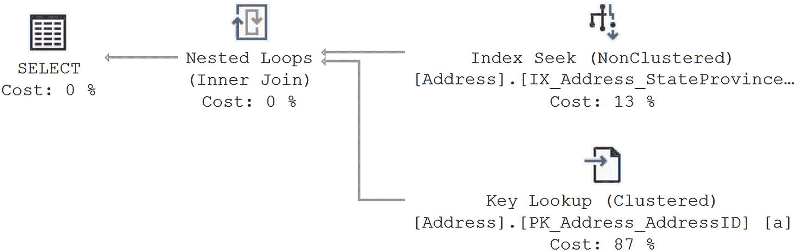
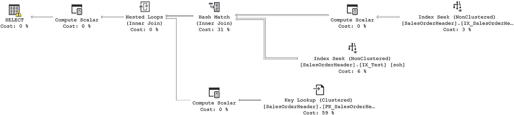
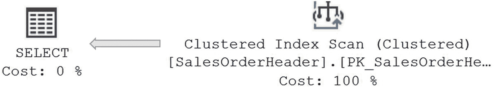
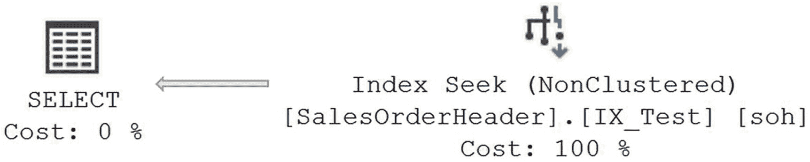
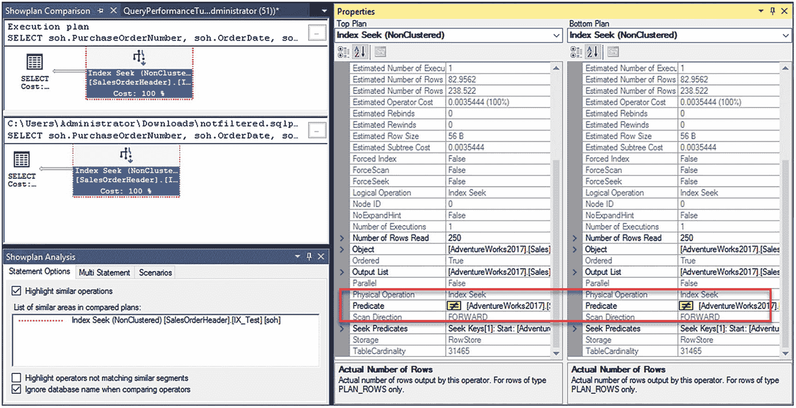

# 9. 索引分析

在上一章中，我介绍了围绕 B 树索引的概念。本章将基于这些信息，扩展更多功能和更多索引类型。索引之间存在许多有趣的交互作用，你可以加以利用。此外，还有一些在前一章未涉及的、会影响索引行为的设置。我将向你展示如何从系统中挤出更多性能。最重要的是，我们将深入探讨列存储索引的细节，以及它们为分析查询带来的根本性性能提升。

在本章中，我将涵盖以下主题：

*   高级索引技术
*   列存储索引
*   特殊索引类型
*   索引的附加特性

## 高级索引技术

这里列举了一些你可以考虑的更高级的索引技术：

*   `覆盖索引`：这些在第 8 章中已介绍过。
*   `索引交叉`：使用多个非聚集索引来满足查询所需的所有列要求（来自一个表）。
*   `索引联接`：结合使用索引交叉和覆盖索引技术，以避免访问基础表。
*   `筛选索引`：为了能够索引具有不规则数据分布或稀疏列的字段，你可以向索引应用筛选器，使其仅索引部分数据。
*   `索引视图`：这些将视图的输出具体化存储在磁盘上。
*   `索引压缩`：可以通过 SQL Server 压缩索引的存储，从而在单个数据页上存放更多行数据，提升性能。

我将在以下各节中更详细地介绍这些主题。

### 覆盖索引

一个 `覆盖索引` 是一个建立在 SQL 查询所需的所有列上的非聚集索引，而无需访问堆或聚集索引。如果一个查询遇到一个索引，并且根本不需要引用底层结构，那么该索引就可以被视为覆盖索引。

例如，在下面的 `SELECT` 语句中，无论列在语句中的哪个位置使用，所有列（`StateProvinceID` 和 `PostalCode`）都应包含在非聚集索引中，以完全覆盖该查询：

```sql
SELECT  a.PostalCode
FROM    Person.Address AS a
WHERE   a.StateProvinceID = 42;
```

这样，查询所需的所有数据都可以从非聚集索引页获取，而无需访问数据页。这有助于 SQL Server 节省逻辑读和物理读。如果你运行该查询，你将得到以下 I/O 和执行时间，以及如图 9-1 所示的执行计划：



*图 9-1 无覆盖索引的查询*

```text
Table 'Address'. Scan count 1, logical reads 19
CPU time = 0 ms,  elapsed time = 0 ms.
```

这里发生了一个经典的查找操作，`Key Lookup` 运算符从聚集索引中提取 `PostalCode` 数据，并将其与针对 `IX_Address_StateProvinceId` 索引的 `Index Seek` 运算符进行连接。

虽然你可以重新创建包含两个键列的索引，但另一种使索引成为覆盖索引的方法是使用新的 `INCLUDE` 子句。它可以在不改变索引结构的情况下，将数据与索引一起存储。我稍后会详细说明为什么要使用 `INCLUDE` 子句。使用以下语句重新创建索引：

```sql
CREATE NONCLUSTERED INDEX IX_Address_StateProvinceID
ON Person.Address
(
StateProvinceID ASC
)
INCLUDE
(
PostalCode
)
WITH (DROP_EXISTING = ON);
```

如果你重新运行查询，执行计划（图 9-2）、I/O 和执行时间都会发生变化。（另外，值得注意的是，0ms 并非正确的执行时间。使用以微秒（μs）记录执行时间的扩展事件会话，实际为 177μs。）


*图 9-2 有覆盖索引的查询*

```text
Table 'Address'. Scan count 1, logical reads 2
CPU time = 0 ms,  elapsed time = 0 ms.
```

读取次数从 19 次下降到了 2 次，执行计划也尽可能简化了；它只是一个针对新的、改进后的（现在已是覆盖）索引的单一 `Index Seek` 操作。覆盖索引是减少查询逻辑读取次数的有用技术。使用 `INCLUDE` 子句添加列可以更轻松地实现此功能，而不会增加索引中的列数或索引键的大小，因为包含的列仅存储在索引的叶级。

`INCLUDE` 子句最好在以下情况下使用：

*   你不希望增加索引键的大小，但仍希望使索引成为覆盖索引。
*   你有一个数据类型不能作为索引键列，但可以通过 `INCLUDE` 命令添加到非聚集索引中。
*   你已经超出了索引的最大键列数（尽管这是一个最好避免的问题）。

在继续之前，请将索引恢复为其原始格式。

```sql
CREATE NONCLUSTERED INDEX IX_Address_StateProvinceID
ON Person.Address
(
StateProvinceID ASC
)
WITH (DROP_EXISTING = ON);
```

在这个例子中，`SELECT` 语句不包含任何需要从非聚集索引页跳转到表的数据页的列，而这通常使得非聚集索引对于大型结果集和/或排序输出比聚集索引成本更高。这种非聚集索引被称为 `覆盖索引`。

同样值得注意的是，我试验了将哪个列放在索引的引导边缘，`ExpMonth` 还是 `ExpYear`。经过测试，将 `ExpMonth` 放在前面时的读取次数为 37，而将 `ExpYear` 放在前面则为 12。这是因为先按年份筛选比先按月份筛选需要查看的页面更少。请记住，在创建索引时要通过彻底的测试来验证你的选择。

测试完成后清理索引。

```sql
DROP INDEX Sales.CreditCard.ixTest;
```

## 总结

在本章中，你了解到索引是减少查询逻辑读取次数和磁盘 I/O 的有效方法。虽然索引可能会增加操作查询的开销，但即使是像 `UPDATE` 和 `DELETE` 这样的操作查询也能从索引中受益。

要为特定查询决定索引键列，需要评估查询的 `WHERE` 子句和连接条件。列的选择性、宽度、数据类型和列顺序等因素对于决定索引键中的列至关重要。由于索引主要用于检索少量行，因此索引列的选择性应该非常高。需要注意的是，非聚集索引包含聚集索引键的值作为其行定位器，因为此行为极大地影响了索引类型的选择。

在下一章中，你将学习更多关于可用于帮助你调整查询的其他功能和索引类型。


### 一种伪聚集索引

覆盖索引在物理上按照连续顺序组织所有索引列的数据。因此，从磁盘 I/O 的角度来看，一个不使用包含列的覆盖索引，对于完全由覆盖索引中列所满足的所有查询而言，就变成了一个聚集索引。如果查询的结果集需要排序输出，那么覆盖索引可以在物理上保持列数据与结果集要求相同的顺序——然后它可以像聚集索引一样用于排序输出。正如前面的例子所示，对于请求一定范围行和/或排序输出的查询，覆盖索引能提供比聚集索引更好的性能。包含列不是索引键的一部分，因此无法像索引的键列那样提供相同的排序优势。

## 建议

为了利用覆盖索引的优势，请谨慎处理 `SELECT` 语句中的列列表，只移动你需要的数据（因此有禁止使用 `SELECT *` 的标准规范）。同时，尽可能使用较少的列，以保持覆盖索引的索引键尺寸较小。在合适的地方使用 `INCLUDE` 语句来添加列。由于覆盖索引包含了查询中使用的所有列，它往往非常宽，这增加了覆盖索引的维护成本。你必须在维护成本与覆盖索引带来的性能提升之间取得平衡。如果索引中所有列的字节数与该表单个数据行的字节数相比很小，并且你确定利用覆盖索引的查询会频繁执行，那么使用覆盖索引可能是有益的。

### 提示

覆盖索引也有助于解决阻塞和死锁问题，你将在第 20 和 21 章中看到相关内容。

在构建大量覆盖索引之前，请考虑 SQL Server 如何能够有效地、自动地使用索引交叉，为查询动态创建覆盖索引。

## 索引交叉

如果一个表有多个索引，那么 SQL Server 可以使用多个索引来执行查询。SQL Server 可以利用多个索引，根据每个索引选择较小的数据子集，然后执行这两个子集的交集（即，只返回满足所有条件的那些行）。SQL Server 可以利用表上的多个索引，然后采用连接算法来获取两个子集之间的 *索引交叉*。

在下面的 `SELECT` 语句中，对于 `WHERE` 子句中的列，该表在 `SalesPersonID` 列上有一个非聚集索引，但在 `OrderDate` 列上没有索引：

```
--SELECT * is intentionally used in this query
SELECT soh.*
FROM Sales.SalesOrderHeader AS soh
WHERE soh.SalesPersonID = 276
AND soh.OrderDate
BETWEEN '4/1/2005' AND '7/1/2005';
```

图 9-3 展示了此查询的执行计划。


图 9-3
在 OrderDate 列上没有索引时的执行计划

如你所见，优化器没有使用 `SalesPersonID` 列上的非聚集索引。由于也需要 `OrderDate` 列的值，优化器选择了聚集索引来获取所有引用列的值。检索这些数据的 I/O 和时间如下：

```
Table 'SalesOrderHeader'. Scan count 1, logical reads 689
CPU time = 0 ms,  elapsed time = 3 ms.
```

为了提高查询性能，可以将 `OrderDate` 列添加到 `SalesPersonId` 列上的非聚集索引中，或者将其定义为同一索引的包含列。但在这种实际场景中，修改现有索引时你可能需要考虑以下因素：

*   出于各种原因，可能不允许修改现有索引。
*   现有的非聚集索引键可能已经相当宽了。
*   修改会影响使用现有索引的其他查询的成本。

在这种情况下，你可以在 `OrderDate` 列上创建一个新的非聚集索引。

```
CREATE NONCLUSTERED INDEX IX_Test
ON Sales.SalesOrderHeader (OrderDate);
```

再次运行你的 `SELECT` 命令。

图 9-4 展示了 `SELECT` 语句的最终执行计划。



图 9-4
在 OrderDate 列上有索引时的执行计划

如你所见，SQL Server 利用了这两个非聚集索引作为索引查找（而不是扫描），然后采用了一个交叉算法来获取两个子集的索引交叉。这由 `Hash Join` 表示。然后它从结果数据集中执行了一次 `Key Lookup` 来检索索引中未包含的其余数据。但是，计划的复杂性表明性能可能更差。检查统计信息 I/O 和时间后，你会发现实际上你获得了很好的性能提升：

```
Table 'SalesOrderHeader'. Scan count 2, logical reads 10
Table 'Workfile'. Scan count 0, logical reads 0,
Table 'Worktable'. Scan count 0, logical reads 0
CPU time = 0 ms,  elapsed time = 2 ms.
```

即使该计划在表内使用了三个不同的访问点，并且必须为处理 `Hash Join` 创建存储空间，读取次数还是从 689 次降到了 10 次。执行时间也减少了（在扩展事件中从 3,333μs 降至 2,279μs）。你还可以看到计划中发生了额外的操作，例如 `Key Lookup`，通过进一步调整索引，你可能能够消除它。然而，值得注意的是，由于你通过 `SELECT *` 命令返回所有列，无法通过使用 `INCLUDE` 列来有效地消除 `Key Lookup`，因此你可能还需要调整查询本身。


## 索引交叉

为了提升查询性能，SQL Server 可能会在一个表上使用多个索引，尽管这比较少见，因为它需要良好的统计信息和针对特定查询的精确索引。通常，我倾向于在索引上使用更小、更窄的键，而不是宽键。SQL Server 经常能够组合使用索引，即使不组合，使用窄索引的性能也**更好**。

在创建覆盖索引时，请识别现有非聚集索引中是否已包含覆盖索引所需的大部分列。您可能已经有两个现有的非聚集索引，它们共同覆盖了覆盖索引所需的所有列。如果可能，适当调整现有非聚集索引的列顺序，允许优化器考虑这两个非聚集索引之间的索引交叉。

有时，您可能需要创建一个单独的非聚集索引，原因如下：

*   不允许重新排列现有索引中的列。
*   覆盖索引所需的某些列未包含在现有的非聚集索引中。
*   现有非聚集索引中的列总数可能多于覆盖索引所需的列数。

在这种情况下，您可以为剩余的列创建一个非聚集索引。如果新索引与现有非聚集索引的组合列顺序满足覆盖索引的要求，优化器就可能使用索引交叉。在确定新索引的列及其顺序时，也要留意其他查询，以最大化其收益。

不要指望索引交叉能频繁生效。它依赖于优化器内部做出的选择。然而，在创建索引时努力朝这个方向尝试并没有坏处。

删除为测试而创建的索引。

```sql
DROP INDEX Sales.SalesOrderHeader.IX_Test;
```

### 索引连接

`索引连接`是索引交叉的一种变体，它将覆盖索引技术应用于索引交叉。如果没有单个索引能覆盖查询，但多个索引组合起来可以覆盖查询，那么 SQL Server 可以使用索引连接来完全满足查询，而无需访问基表。

让我们看看这种索引技术的应用。对“索引交叉”部分的查询稍作修改，如下所示：

```sql
SELECT soh.SalesPersonID,
soh.OrderDate
FROM Sales.SalesOrderHeader AS soh
WHERE soh.SalesPersonID = 276
AND soh.OrderDate
BETWEEN '4/1/2013' AND '7/1/2013';
```

此查询的执行计划如图 9-5 所示，读取次数如下：


图 9-5 无索引连接的执行计划

```
Table 'SalesOrderHeader'. Scan count 1, logical reads 689
CPU time = 0 ms, elapsed time = 2 ms. (2345 us)
```

如图 9-5 所示，优化器没有使用 `SalesPersonID` 列上现有的非聚集索引。由于查询还需要 `OrderDate` 列的值，优化器选择了聚集索引来检索查询引用的所有列的值。如果在 `OrderDate` 列上创建如下索引：

```sql
CREATE NONCLUSTERED INDEX IX_Test
ON Sales.SalesOrderHeader (OrderDate ASC);
```

并重新运行查询，那么图 9-6 显示了结果，您可以在这里看到读取次数：


图 9-6 带索引连接的执行计划

```
Table 'Workfile'. Scan count 0, logical reads 0
Table 'Worktable'. Scan count 0, logical reads 0
Table 'SalesOrderHeader'. Scan count 2, logical reads 10
CPU time = 0 ms, elapsed time = 1 ms (1657 us).
```

两个索引的组合起到了覆盖索引的作用，将表的读取次数从 689 次减少到 10 次，因为它使用了两个组合在一起的 `Index Seek` 操作，而不是一个聚集索引扫描。

但如果 `WHERE` 子句没有导致两个索引都被使用呢？相反，您知道两个索引都存在，并且像前面的查询那样对每个索引进行查找是可行的，因此您选择使用索引提示。

```sql
SELECT soh.SalesPersonID,
soh.OrderDate
FROM Sales.SalesOrderHeader AS soh
WITH (INDEX(IX_Test, IX_SalesOrderHeader_SalesPersonID))
WHERE soh.OrderDate
BETWEEN '4/1/2013' AND '7/1/2013';
```

这个新查询的结果如图 9-7 所示，I/O 如下：


图 9-7 通过提示实现索引连接的执行计划

```
Table 'Workfile'. Scan count 0, logical reads 0
Table 'Worktable'. Scan count 0, logical reads 0
Table 'SalesOrderHeader'. Scan count 2, logical reads 64
CPU time = 0 ms, elapsed time = 68 ms.
```

读取次数明显增加，执行时间也增加了。大多数情况下，优化器在索引和执行计划方面的选择是好的。尽管查询提示允许您从优化器手中接管控制权，但这种控制可能带来的问题和它解决的一样多。在试图强制使用索引连接以获得性能提升时，强制选择索引反而减慢了查询的执行。

在继续之前删除测试索引。

```sql
DROP INDEX Sales.SalesOrderHeader.IX_Test;
```

### 注意

在生成查询执行计划时，SQL Server 优化器会经历优化阶段，不仅要确定要使用的索引类型和连接策略，还要评估索引交叉和索引连接等高级索引技术。因此，在某些情况下，可以考虑创建多个窄索引，而不是创建宽覆盖索引。SQL Server 可以将它们组合起来用作覆盖索引，也可以在需要时单独使用它们。但您需要测试以确定在您的情况下哪种方式更好——更宽的索引还是索引交叉与连接。


## 筛选索引

筛选索引是一种非聚集索引，它使用一个过滤器（本质上是一个 `WHERE` 子句）来理想地针对一个或多个列创建一个高度选择性的键集，而这些列本身可能不具备良好的选择性。例如，一个包含大量 `NULL` 值的列可以存储为稀疏列以减少这些 `NULL` 值的开销。为该列添加筛选索引将使你能够拥有一个针对非 `NULL` 数据的可用索引。理解这一点的最好方法是看一个实际例子。

`Sales.SalesOrderHeader` 表有超过 30,000 行。在这些行中，有 27,000 多行在 `PurchaseOrderNumber` 列和 `SalesPersonId` 列中具有 `null` 值。如果你想要获取一个简单的采购订单号列表，查询可能如下所示：

```sql
SELECT soh.PurchaseOrderNumber,
soh.OrderDate,
soh.ShipDate,
soh.SalesPersonID
FROM Sales.SalesOrderHeader AS soh
WHERE PurchaseOrderNumber LIKE 'PO5%'
AND soh.SalesPersonID IS NOT NULL;
```

如你所料，运行此查询会导致聚集索引扫描，以及如图 9-8 所示的 I/O 和执行时间：



图 9-8：没有索引的执行计划

```
Table 'SalesOrderHeader'. Scan count 1, logical reads 689
CPU time = 0 ms,  elapsed time = 52 ms.
```

为了解决这个问题，可以创建一个索引并包含查询中的部分列，使其成为一个覆盖索引。

```sql
CREATE NONCLUSTERED INDEX IX_Test
ON Sales.SalesOrderHeader
(
PurchaseOrderNumber,
SalesPersonID
)
INCLUDE
(
OrderDate,
ShipDate
);
```

当你重新运行查询时，性能提升相当显著（参见图 9-9 及以下结果中的 I/O 和时间）。



图 9-9：带有覆盖索引的执行计划

```
Table 'SalesOrderHeader'. Scan count 1, logical reads 5
CPU time = 0 ms,  elapsed time = 40 ms.
```

如你所见，覆盖索引将读取次数从 689 降到了 5，时间从 52 毫秒降到了 40 毫秒。通常，这会被认为是一个不错的改进，对于系统可能已经足够。现在，假设这个查询需要频繁调用。那么，你能从中榨取的每一分速度都会带来回报。了解到索引列中有如此多的数据是 `null`，你可以调整索引，过滤掉 `null` 值（这些值无论如何也不会被索引使用），从而减小树的大小，因此减少了所需的搜索量。

```sql
CREATE NONCLUSTERED INDEX IX_Test
ON Sales.SalesOrderHeader
(
PurchaseOrderNumber,
SalesPersonID
)
INCLUDE
(
OrderDate,
ShipDate
)
WHERE PurchaseOrderNumber IS NOT NULL
AND SalesPersonID IS NOT NULL
WITH (DROP_EXISTING = ON);
```

查询的最终运行结果如下性能指标：

```
Table 'SalesOrderHeader'. Scan count 1, logical reads 4
CPU time = 0 ms, elapsed time = 38 ms.
```

执行计划看起来相同，带有 `Index Seek`。要查看覆盖索引计划与筛选的覆盖索引计划之间的差异，我们可以使用 SSMS 来比较计划。将第一个计划保存为文件（右键单击该计划并选择“另存执行计划为”），然后，在第二个计划中，右键单击计划内部并选择“比较计划”。你将看到类似图 9-10 的内容。



图 9-10：两个计划的比较

执行计划中几乎没有直接的差异指标。在右侧的属性中，我突出显示了一个很大的不同点。虽然查询是相同的，但由于索引过滤掉了所有空值，谓词被更改以移除 `IS NOT NULL`，因为它不再需要。这是优化器内部称为*简化*过程的一部分。

尽管从绝对值上看，将读取次数从 5 次减少到 4 次不算多，但这意味着查询的 I/O 成本降低了 20%，如果这个查询像某些查询那样，在一分钟内运行数百甚至数千次，那么这 20% 的减少确实会带来巨大的回报。另一个可见的回报证据是执行时间，它再次从 40 毫秒下降到 38 毫秒。

筛选索引通过多种方式提高性能。

*   通过减小索引大小来提高查询效率。
*   通过创建更小的索引来降低存储成本。
*   由于索引体积减小，从而降低了索引维护成本。

但是，任何事物都是有代价的。你可能会遇到参数化查询与筛选索引不匹配的问题，从而阻止其使用。统计信息不是基于过滤条件更新的，而是像常规索引一样基于整个表更新的。如同本书中的任何建议一样，在你的环境中进行测试，以确保筛选索引是有帮助的。

首先建议使用它们的场景之一就是像前面的例子一样，从索引中消除 `NULL` 值。你还可以通过特殊索引隔离经常访问的数据集，从而大大提高针对该数据的查询性能。你可以使用 `WHERE` 子句来过滤数据，方式类似于创建索引视图（在“索引视图”一节有更详细的介绍），但通过创建筛选索引作为覆盖索引（就像前面的例子），可以避免与索引视图相关的数据维护难题。

筛选索引在访问或创建时需要一组特定的 ANSI 设置。

*   `ON`: `ANSI_NULLS`, `ANSI_PADDING`, `ANSI_WARNINGS`, `ARITHABORT`, `CONCAT_NULL_YIELDS_NULL`, `QUOTED_IDENTIFIER`
*   `OFF`: `NUMERIC_R0UNDAB0RT`

完成后，删除测试索引。

```sql
DROP INDEX Sales.SalesOrderHeader.IX_Test;
```

## 索引视图

SQL Server 中的数据库视图不存储任何数据。视图只是一个存储起来的 `SELECT` 语句。你使用 `CREATE VIEW` 语句来创建视图。你可以像对待表一样针对视图编写查询。当查询视图时，优化器会收到 `SELECT` 语句的完整定义，并以此作为优化针对该视图查询的基础。通过优化过程，`SELECT` 语句的部分或全部定义可能被用于满足对视图的查询。这里发生多大程度的简化，是由 `SELECT` 语句本身和对 `SELECT` 语句的查询共同决定的。

通过在视图上创建唯一的聚集索引，可以将数据库视图具体化到磁盘上。这样的视图被称为*索引视图*或*物化视图*。在视图上创建唯一的聚集索引后，视图的结果集会立即物化并持久化在数据库的物理存储中，从而省去了在查询执行期间执行昂贵操作的开销。在视图物化之后，可以在索引视图上创建多个非聚集索引。这有效地将视图（再次说明，只是一个查询）变成了一个具有定义存储的真实表。

### 好处

你可以使用索引视图通过以下方式提高查询性能：

*   可以预先计算聚合并将其存储在索引视图中，以最小化查询执行期间昂贵的计算。
*   可以预先连接表，并将生成的数据集物化。
*   可以将连接或聚合的组合物化。


### 开销

索引视图可能会给 OLTP 数据库带来显著开销。索引视图的部分开销如下：

*   基表中的任何更改都必须通过执行视图的`SELECT`语句反映到索引视图中。
*   对定义了索引视图的基表进行任何更改，都可能引发索引视图的一个或多个非聚集索引的更改。如果更新了聚集键，则聚集索引也必须进行更改。
*   索引视图增加了数据库的持续维护开销。
*   数据库需要额外的存储空间。

创建索引视图的限制包括：

*   视图上的第一个索引必须是唯一的聚集索引。
*   只有在创建了唯一的聚集索引后，才能在索引视图上创建非聚集索引。
*   视图定义必须是*确定性*的，即对于给定查询，它只能返回一种可能的结果。（确定性和非确定性函数的列表可在 SQL Server 联机丛书中找到。）
*   索引视图必须只引用同一数据库中的基表，不能引用其他视图。
*   索引视图可以包含浮点列。但是，此类列不能包含在聚集索引键中。
*   索引视图必须与视图中引用的表进行架构绑定，以防止修改表架构（这是一个常见的重要问题）。
*   视图定义的语法有几个限制。（视图定义的语法限制列表可在 SQL Server 联机丛书中找到。）
*   必须固定的`SET`选项列表如下：
    *   `ON`：`ARITHABORT`、`CONCAT_NULL_YIELDS_NULL`、`QUOTED_IDENTIFIER`、`ANSI_NULLS`、`ANSI_PADDING`和`ANSI_WARNING`
    *   `OFF`：`NUMERIC_ROUNDABORT`

### 注意

如果查询连接设置与这些 ANSI 标准设置不匹配，在对索引视图中使用的表进行插入/更新/删除操作时可能会出现错误。

### 使用场景

报表系统从索引视图中受益最大。具有频繁写入操作的 OLTP 系统可能无法充分利用索引视图，因为更新视图和底层基表在单个事务中会增加维护成本。索引视图提供的净性能提升是视图提供的总查询执行节省与存储和维护视图的成本之间的差值。

如果您使用的是 SQL Server 企业版，查询优化器在查询执行期间使用索引视图时，无需在查询中显式引用它。这允许现有应用程序从新创建的索引视图中受益，而无需更改这些应用程序。否则，在 SQL Server 的企业版以外的版本中，您需要在 T-SQL 代码中直接引用它。查询优化器只为成本较高的查询考虑索引视图。您也可能会发现新的列存储索引比索引视图更适合您，特别是当您对数据运行聚合或分析查询时。我将在本章后面介绍列存储索引。

让我们通过以下示例看看索引视图是如何工作的。考虑以下三个查询：

```sql
SELECT  p.[Name] AS ProductName,
SUM(pod.OrderQty) AS OrderOty,
SUM(pod.ReceivedQty) AS ReceivedOty,
SUM(pod.RejectedQty) AS RejectedOty
FROM    Purchasing.PurchaseOrderDetail AS pod
JOIN Production.Product AS p
ON p.ProductID = pod.ProductID
GROUP BY p.[Name];
SELECT  p.[Name] AS ProductName,
SUM(pod.OrderQty) AS OrderOty,
SUM(pod.ReceivedQty) AS ReceivedOty,
SUM(pod.RejectedQty) AS RejectedOty
FROM    Purchasing.PurchaseOrderDetail AS pod
JOIN Production.Product AS p
ON p.ProductID = pod.ProductID
GROUP BY p.[Name]
HAVING  (SUM(pod.RejectedQty) / SUM(pod.ReceivedQty)) > .08;
SELECT  p.[Name] AS ProductName,
SUM(pod.OrderQty) AS OrderQty,
SUM(pod.ReceivedQty) AS ReceivedQty,
SUM(pod.RejectedQty) AS RejectedQty
FROM    Purchasing.PurchaseOrderDetail AS pod
JOIN Production.Product AS p
ON p.ProductID = pod.ProductID
WHERE   p.[Name] LIKE 'Chain%'
GROUP BY p.[Name];
```

所有三个查询都对`PurchaseOrderDetail`表的列使用聚合函数`SUM`。因此，您可以创建一个索引视图来预计算这些聚合，并在查询执行期间最小化这些复杂计算的成本。

以下是这些查询访问相应表时执行的逻辑读取次数：

```
Table 'Workfile'. Scan count 0, logical reads 0
Table 'Worktable'. Scan count 0, logical reads 0
Table 'Product'. Scan count 1, logical reads 6
Table 'PurchaseOrderDetail'. Scan count 1, logical reads 66
CPU time = 0 ms,  elapsed time = 31 ms.
Table 'Workfile'. Scan count 0, logical reads 0
Table 'Worktable'. Scan count 0, logical reads 0
Table 'Product'. Scan count 1, logical reads 6
Table 'PurchaseOrderDetail'. Scan count 1, logical reads 66
CPU time = 0 ms,  elapsed time = 16 ms.
Table 'PurchaseOrderDetail'. Scan count 5, logical reads 894
Table 'Product'. Scan count 1, logical reads 2
CPU time = 0 ms,  elapsed time = 1 ms.
```

我将使用以下脚本创建一个索引视图来预计算这些昂贵的计算并连接表：

```sql
CREATE OR ALTER VIEW Purchasing.IndexedView
WITH SCHEMABINDING
AS
SELECT pod.ProductID,
SUM(pod.OrderQty) AS OrderQty,
SUM(pod.ReceivedQty) AS ReceivedQty,
SUM(pod.RejectedQty) AS RejectedQty,
COUNT_BIG(*) AS Count
FROM Purchasing.PurchaseOrderDetail AS pod
GROUP BY pod.ProductID;
GO
CREATE UNIQUE CLUSTERED INDEX iv
ON Purchasing.IndexedView (ProductID);
GO
```

某些结构如`AVG`是不允许的。（有关不允许的结构的完整列表，请参阅 SQL Server 联机丛书。）如果视图中包含聚合（如本例所示），则默认情况下必须包含`COUNT_BIG`。


