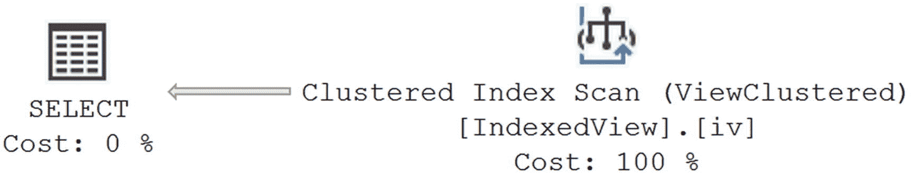
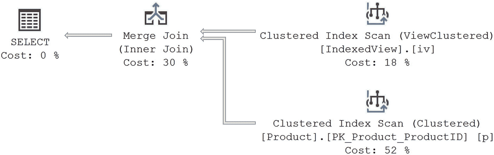
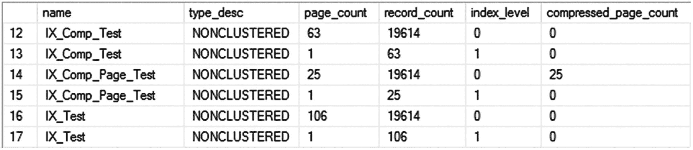
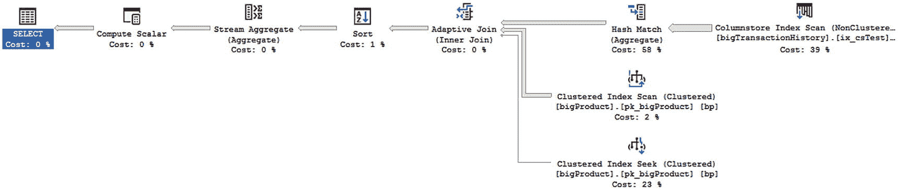
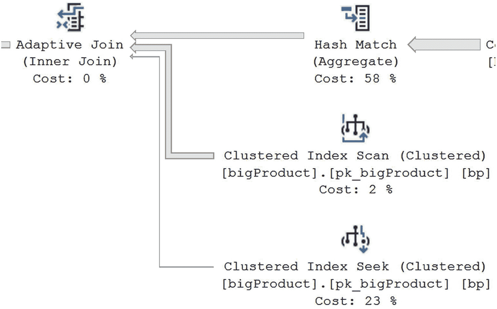
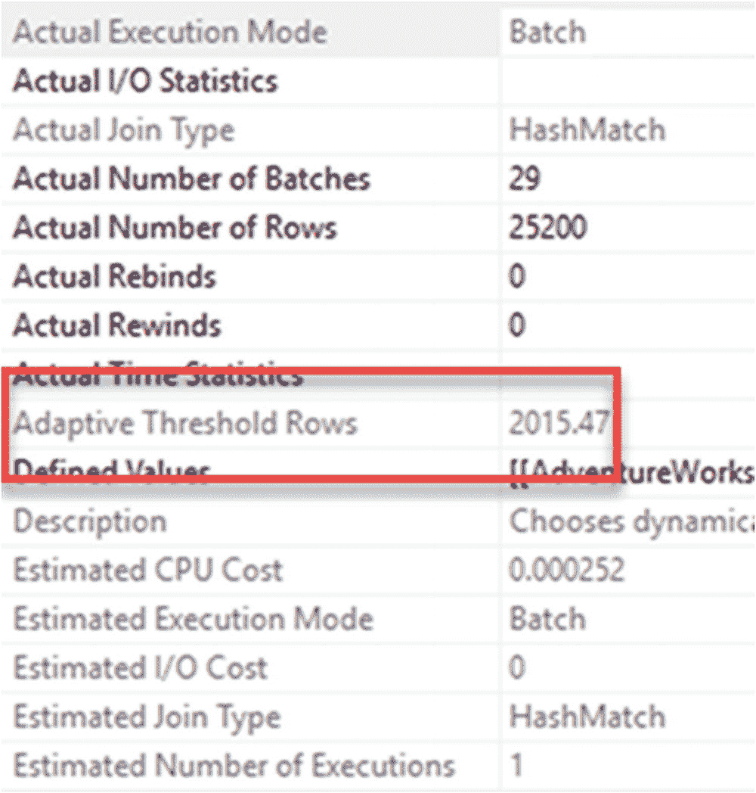
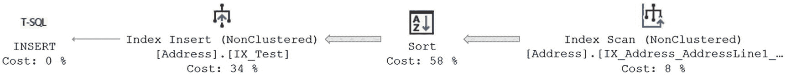

# 索引视图与索引压缩

## 索引视图性能

索引视图将聚合函数的输出结果**物化**到磁盘上。这消除了在查询执行过程中为获取聚合输出而重新计算聚合函数的需要。例如，第三个查询请求从 `PurchaseOrderDetail` 表中获取特定产品的 `ReceivedQty` 和 `RejectedQty` 之和。由于这些值已在索引视图中为 `PurchaseOrderDetail` 表中的每个产品预先物化，因此你可以使用以下 `SELECT` 语句直接从索引视图中获取这些预聚合的值：

```sql
SELECT  iv.ProductID,
        iv.ReceivedQty,
        iv.RejectedQty
FROM    Purchasing.IndexedView AS iv;
```

如执行计划图 9-11 所示，该 `SELECT` 语句直接从索引视图中检索值，而无需访问基表 (`PurchaseOrderDetail`)。



*图 9-11：使用索引视图的执行计划*

索引视图不仅使直接基于该视图的查询受益，也可能使其他查询能够利用这些物化数据。例如，有了索引视图，对 `PurchaseOrderDetail` 的三个查询无需重写即可受益（第一个查询的执行计划见图 9-12），并且逻辑读取次数减少，如下所示：



*图 9-12：自动使用了索引视图的执行计划*

```
Table 'Product'. Scan count 1, logical reads 13
Table 'IndexedView'. Scan count 1, logical reads 4
CPU time = 0 ms,  elapsed time = 53 ms.
Table 'Product'. Scan count 1, logical reads 13
Table 'IndexedView'. Scan count 1, logical reads 4
CPU time = 0 ms,  elapsed time = 1 ms.
Table 'IndexedView'. Scan count 0, logical reads 10
Table 'Product'. Scan count 1, logical reads 2
CPU time = 0 ms,  elapsed time = 0 ms. (214 us)
```

即使查询并未修改以引用新的索引视图，优化器仍然会使用索引视图来提升性能。因此，数据库应用程序中的现有查询也能从新的索引视图中受益，而无需对查询进行任何修改。如果你需要的聚合方式与索引视图所提供的不同，那么你就没那么幸运了。这里又是列存储索引大放异彩的地方。

确保进行清理。

```sql
DROP VIEW Purchasing.IndexedView;
```

## 索引压缩

数据和索引压缩功能在 SQL Server 2008 中引入（适用于企业版和开发者版，目前所有版本均可用）。*压缩*索引意味着将更多的键信息存储到单个页面上。这可以带来显著的性能提升，因为存储索引所需的页面和索引层级更少。由于索引中的键值需要被压缩和解压缩，CPU 会有一些开销，因此这可能并非适用于所有索引的解决方案。内存也会受益，因为压缩后的页面在内存中是以压缩状态存储的。

默认情况下，索引不会被压缩。你必须在创建索引时显式要求对其进行压缩。压缩有两种类型：行级压缩和页级压缩。*行级压缩*识别可压缩的列（详情请查阅在线手册），并压缩该列的存储，对每一行都如此操作。*页级压缩*实际上先使用行级压缩，然后在顶层增加额外的压缩，以减少页面上存储的非行元素的存储空间。索引中的非叶子页在页压缩类型下不会获得压缩。要查看索引压缩的实际效果，请看以下索引：

```sql
CREATE NONCLUSTERED INDEX IX_Test
ON Person.Address
(
    City ASC,
    PostalCode ASC
);
```

此索引在本章前面已经创建。如果你按照这里的定义重新创建它，这将在具有与第一个测试索引 `IX_Test` 相同两列的索引上创建行类型压缩。

```sql
CREATE NONCLUSTERED INDEX IX_Comp_Test
ON Person.Address
(
    City,
    PostalCode
)
WITH (DATA_COMPRESSION = ROW);
```

再创建一个索引。

```sql
CREATE NONCLUSTERED INDEX IX_Comp_Page_Test
ON Person.Address
(
    City,
    PostalCode
)
WITH (DATA_COMPRESSION = PAGE);
```

要检查存储的索引，请修改原始的针对 `sys.dm_db_index_physical_stats` 的查询，添加另一列 `compressed_page_count`。

```sql
SELECT i.name,
       i.type_desc,
       s.page_count,
       s.record_count,
       s.index_level,
       s.compressed_page_count
FROM sys.indexes AS i
JOIN sys.dm_db_index_physical_stats(DB_ID(N'AdventureWorks2017'),
                                   OBJECT_ID(N'Person.Address'),
                                   NULL,
                                   NULL,
                                   'DETAILED') AS s
  ON i.index_id = s.index_id
WHERE i.object_id = OBJECT_ID(N'Person.Address');
```

运行查询后，你将得到图 9-13 所示的结果。



*图 9-13：关于压缩索引的 sys.dm_db_index_physical_stats 输出*

对于这个索引，你可以看到页压缩成功地将索引从 106 页减少到 25 页，其中 25 页是压缩的。在此实例中，行类型压缩在索引页面数量上产生了影响，但远不如页压缩那样显著。

要查看压缩在不修改代码的情况下为你带来的效果，请运行以下查询：

```sql
SELECT  a.City,
        a.PostalCode
FROM    Person.Address AS a
WHERE   a.City = 'Newton'
  AND   a.PostalCode = 'V2M1N7';
```

在我的系统上，优化器选择使用 `IX_Comp_Page_Test` 索引。即使我强制它使用 `IX_Test` 索引，性能也是相同的，尽管第二个查询多读取了一个页面：

```sql
SELECT  a.City,
        a.PostalCode
FROM    Person.Address AS a WITH (INDEX = IX_Test)
WHERE   a.City = 'Newton'
  AND   a.PostalCode = 'V2M1N7';
```

因此，尽管一个索引占用的空间急剧减少（大约只有原来的四分之一页面），但性能上没有任何代价。

压缩对 SQL Server 内部的其他一系列进程有影响，因此在实施之前，应彻底探究可能的负面影响和潜在益处。在大多数情况下，CPU 的成本完全被其他所有地方的益处所抵消，但你应该测试并监控你的系统。

测试完成后，清理索引。

```sql
DROP INDEX Person.Address.IX_Test;
DROP INDEX Person.Address.IX_Comp_Test;
DROP INDEX Person.Address.IX_Comp_Page_Test;
```


##### 列存储索引

列存储索引于 SQL Server 2012 中引入，它用于按列而非按行来索引信息。这在处理数据仓库系统时特别有用，因为该系统需要快速聚合和访问大量数据。列存储索引中存储的信息在每一列上进行分组，并且这些分组是单独存储的。这使得对不同列集合的聚合操作变得极其快速，因为可以访问列存储索引，而无需访问大量行来聚合信息。此外，由于存储是面向列的，因此你只会触及你感兴趣的列所对应的存储，而不是整行的列，这带来了更高的速度。最后，由于列数据是以压缩形式存储的，你会看到来自列存储的一些性能提升。列存储有两种类型，类似于常规索引：聚集列存储和非聚集列存储。在 SQL Server 2016 之前，非聚集列存储无法更新。你必须删除它，然后重新创建它（或者，如果你正在使用分区，则可以切换进和切换出不同的分区）。从 SQL Server 2016 开始，你可以在事务数据库内部使用非聚集列存储来支持实时分析查询。聚集列存储于 SQL Server 2014 中引入，并在该版本以及仅在生产机器的企业版中可用。在 SQL Server 2016 和 SQL Server 2017 中，列存储在所有版本中均可用。使用列存储索引存在许多限制。

你不能使用某些数据类型，例如 `binary`、`text`、`varchar(max)`（在 SQL Server 2017 中受支持）、`uniqueidentifier`（在 SQL Server 2012 中，此数据类型在 SQL Server 2014 及更高版本中有效）、`clr` 数据类型或 `xml`。

*   你无法在稀疏列上创建列存储索引。
*   你想要在其上创建聚集列存储索引的表不能有任何约束，包括主键或外键约束。

有关限制的完整列表，请参阅 SQL Server 联机丛书。

列存储主要旨在用于数据仓库内部，因此在处理星型模式等相关的存储样式时效果最佳。由于列存储索引中数据的存储方式，你会在处理分区数据时频繁看到列存储的使用。列存储索引的设计方式，使其在处理至少 10 万行的大型数据集时能发挥最佳性能。在 AdventureWorks2017 数据库中，没有表按当前配置足够大到真正发挥列存储的作用。为了有足够的数据，我将使用 Adam Machanic 的脚本 `make_big_adventure.sql` 来创建两个大型表 `dbo.bigTransactionHistory` 和 `dbo.bigProduct`。该脚本可以从 [`http://bit.ly/2mNBIhg`](http://bit.ly/2mNBIhg) 下载。

### 列存储索引存储

列存储索引的真正妙处在于，通过聚集列存储和非聚集列存储，你可以根据系统的目的定制系统内部的存储行为，而无需牺牲其他查询行为。如果你的系统是一个拥有大型事实表的数据仓库，你可以使用聚集列存储来定义你的数据存储，因为绝大多数查询都将从该聚集列存储中受益。但是，如果你有一个偶尔需要运行分析型查询的 OLTP 系统，你可以在常规的聚集和非聚集索引（也称为 `行存储索引`）之外，额外使用非聚集列存储。

以下是列存储索引的优势：

*   在数据仓库和分析工作负载中性能更佳
*   优异的数据压缩
*   减少 I/O
*   更多数据可放入内存

为了更全面地理解列存储，我应该定义几个术语。

*   `行组`：一组以列式方式压缩和存储的行。
*   `段`：也称为列段，是压缩并存储在磁盘上的一列数据。每个行组对应表中的每一列都有一个列段。
*   `字典`：定义段的某些数据类型的编码。这些编码可以是全局的（适用于所有段），也可以是局部的（用于一个段）。

列存储数据不像行存储索引那样存储在 B 树中。相反，数据在表内的每一列上进行旋转和聚合。信息还被分解为称为 `行组` 的子集。每个行组最多包含 1,048,576 行。当数据以批处理方式加载到列存储中时，如果行数超过 100,000，它会自动分解为行组。随着列存储索引中的数据被更新，更改会存储在所谓的 `增量存储` 中。这实际上是一个由 SQL Server 引擎在后台控制的 B 树索引。新增的行会累积在增量存储中，直到达到 102,400 行，然后它们将被旋转并压缩到行组中。执行此过程的机制称为 `元组移动程序`。从列存储中删除行取决于行所在的位置。增量存储中的行会被直接移除。已经压缩到行组中的行会经历逻辑删除。另一个 B 树索引（同样在后台控制）管理着已删除行的标识符列表。更新操作的工作方式类似，包括一次删除（根据位置进行逻辑删除或实际删除）和一次插入到增量存储中。

如果你是以小批量方式进行加载，并且有大量的更新操作，你将需要处理增量存储。如果你在行存储表上使用非聚集列存储索引，这种情况极有可能发生。总的来说，增量存储是自我管理的。然而，在可能的情况下，重建列存储索引以清除逻辑删除的行并获得压缩的行组，这不失为一个好主意。你可以使用 `ALTER INDEX REORGANIZE` 命令来完成此操作。我们将在第 14 章详细讨论。

列存储的旋转、分组和压缩存储方式在处理分组数据时能带来令人难以置信的性能提升。然而，在进行 OLTP 风格查询所需的单行或范围查找时，它的速度要慢得多，问题也更多。

聚集和非聚集列存储索引的行为基本相同。区别在于，聚集列存储索引（如同聚集行存储索引）正在存储数据。另一方面，非聚集列存储索引必须将数据存储并管理在其他地方的行存储索引中。


### 列存储索引行为

以下面这个查询为例：

```sql
SELECT bp.Name AS ProductName,
COUNT(bth.ProductID),
SUM(bth.Quantity),
AVG(bth.ActualCost)
FROM dbo.bigProduct AS bp
JOIN dbo.bigTransactionHistory AS bth
ON bth.ProductID = bp.ProductID
GROUP BY bp.Name;
```

如果按当前配置的表运行此查询，你将看到一个类似于 9-14 的执行计划。


**图 9-14**
GROUP BY 查询的多重聚合

查询的读取次数和执行时间如下：

```
Table 'Worktable'. Scan count 0, logical reads 0
Table 'bigTransactionHistory'. Scan count 1, logical reads 131819
Table 'bigProduct'. Scan count 1, logical reads 601
CPU time = 16 ms,  elapsed time = 13356 ms.
```

读取次数非常多，此查询也消耗了相当多的 CPU 资源，执行速度不够快。我们有两种类型的列存储索引可供选择。如果你想仅为现有表添加一个非聚集列存储索引，这也是可行的。我们可以将数据迁移到聚集列存储索引上，但查询的行为是相同的。为了简化示例，我们将仅使用非聚集列存储索引。创建非聚集列存储索引时，你可以选择要包含的列，以避免任何可能不受列存储索引支持的列。

```sql
CREATE NONCLUSTERED COLUMNSTORE INDEX ix_csTest
ON dbo.bigTransactionHistory
(
ProductID,
Quantity,
ActualCost
);
```

有了非聚集列存储索引后，优化器现在可以选择使用该索引来满足之前的查询。就像优化器可用的所有其他索引一样，列存储索引也有相关联的成本，因此对于针对该表的任何给定查询，它可能会被选择，也可能不会。在这种情况下，如果你重新运行最初的聚合查询，可以看到优化器判断使用列存储索引带来的成本对查询是有益的。执行计划现在看起来如 9-15 所示。


**图 9-15**
列存储索引代替了聚集索引

如你所见，计划中有许多不同之处。这里有很多内容需要解读，但在我们这样做之前，先看看读取次数和执行时间。结果是相同的：在我的系统上是 24,975 行。真正的差异体现在查询的读取次数和执行时间上。

```
Table 'bigTransactionHistory'. Scan count 4, logical reads 0
Table 'bigTransactionHistory'. Segment reads 31, segment skipped 0.
Table 'bigProduct'. Scan count 3, logical reads 620
Table 'Worktable'. Scan count 0, logical reads 0
Table 'Worktable'. Scan count 0, logical reads 0
CPU time = 1922 ms,  elapsed time = 1554 ms.
```

检索数据所需的读取次数急剧减少，以及速度的边际提升，都是能够引用按列而非按行索引的信息的结果。我们的执行时间从 13.3 秒缩短到了 1.5 秒。这就是你可以期待的巨大性能提升。

让我们稍微解读一下执行计划，因为这是我们看到的第一个真正复杂的计划。首先要注意的是，优化器选择将此作为一个并行计划。你可以在带有黄色符号的操作符中看到这一点，例如 9-16 中的 `Columnstore Index Scan` 操作符。


**图 9-16**
并行执行中的 Columnstore Index Scan 操作符

有一种处理数据的新方法称为 *批处理模式*。目前，只有包含列存储索引的查询才有批处理模式处理，但微软已宣布这将会改变。批处理模式在计划的操作中以批次处理行。这是一个巨大的优势。行模式处理意味着每一行在计划中的操作符之间移动时都要经历一个协商过程：10,000 行，10,000 次协商。这非常耗费资源。批处理模式以批次移动行，而不是单独移动。批次大致均匀分布，每批最多 1,000 行（尽管这会变化）。这意味着移动 10,000 行只需 10 次协商，而不是 10,000 次。这是一个巨大的性能优势。此外，批处理模式利用多个处理器来帮助加速执行。要确定计划中操作符的执行模式，请查看该操作符的属性。9-17 显示了 `Columnstore Index Scan` 的相应属性。


**图 9-17**
实际执行模式

批处理模式是处理列存储索引时的首选方法，因为它通常比替代方法——行模式——快得多。在 SQL Server 2017 之前，它通常需要一个并行执行计划才能让查询进入批处理模式处理。然而，SQL Server 2017 允许在非并行执行计划中进行批处理模式处理。

有一组有限的操作（在 SQL Server 联机丛书中有所记录）会导致批处理模式处理，但当在具有足够处理器的系统上处理这些操作时，你将看到又一个显著的性能提升。

与聚集和非聚集索引不同，列存储索引不要求列以特定顺序排列。同样与这些其他索引不同的是，你应该将多个列包含在列存储索引中，以便在这些列上获得收益。换句话说，如果你预计将来需要查询某个列，就主动将其添加到列存储索引定义中。但如果你从列存储索引中检索大量列，可能会看到一些性能下降。

列存储索引增强性能的另一个方面是段消除。每个段显示该段内的最小值和最大值（使用实际值或字典引用）。如果一个段不包含给定值，它就会被跳过。当你将分区与列存储索引结合使用时，这一点变得尤为重要。这样，即使你没有获得分区消除，段消除也会有效地跳过某个分区，前提是该分区中包含的段内的数据都不符合我们的筛选条件。

在 9-15 的执行计划中还可以看到列存储索引的另一种行为。在 SQL Server 2017 和 Azure SQL Database 中引入的是批处理模式自适应联接。让我们看一下 9-18 中该计划子集的扩展视图。


**图 9-18**
自适应联接及其伴随行为


因为选择错误的连接类型会严重损害性能，所以新增了一种新的连接样式，即自适应连接。自适应连接将为给定的执行计划创建两个可能的分支。你可以在图 9-18 中看到这两个分支，分别是针对 `pk_bigProduct` 索引的 `聚集索引扫描` 和 `聚集索引查找`。自适应连接可以在执行时决定使用哈希连接或嵌套循环连接。它是通过将数据加载到一个内部管理的自适应缓冲区来实现的；我们无法看到它。如果未达到行阈值，该缓冲区将成为循环连接的外部行驱动程序。否则，将构建哈希表以执行常规的哈希连接。然而，一旦表创建完成，它就可以根据行数确定哪种连接类型更优。自适应连接选定其打算使用的连接类型后，将继续执行两个分支中的一个。顶部分支用于哈希匹配连接，底部分支用于循环连接。用于确定给定连接类型的信息存储在执行计划的属性中，如图 9-19 所示。



**图 9-19**
自适应连接属性的一个子集

在图 9-19 所示属性的中间位置附近是 `自适应阈值行` 属性。当哈希表中的行数达到或低于此值时，自适应连接将使用循环连接。超过此相同值，自适应连接将使用哈希匹配连接。你还可以看到用于估算和实际使用连接类型的属性，因此你可以看到特定查询的行为如何随着其访问数据的变化而变化。

从这个连接中还可以看出，你可以随意混合使用列存储和行存储表进行查询。相同的基本规则始终适用。

有许多 DMO 可用于查看列存储索引的状态。一个立即有用的 DMO 是 `sys.dm_db_column_store_row_group_physical_stats`。它显示了行组的状态，并且很容易查询它。

```sql
SELECT ddcsrgps.row_group_id,
ddcsrgps.state_desc,
ddcsrgps.total_rows,
ddcsrgps.trim_reason_desc,
ddcsrgps.transition_to_compressed_state_desc
FROM sys.dm_db_column_store_row_group_physical_stats AS ddcsrgps
WHERE ddcsrgps.object_id = OBJECT_ID('dbo.bigTransactionHistory')
ORDER BY ddcsrgps.row_group_id DESC;
```

`dbo.bigTransationHistory` 的列存储索引输出如图 9-20 所示。


**图 9-20**
`sys.dm_db_column_store_row_group_physical_stats` 的输出

你现在可以看到行是如何加载到索引中并分组的，是否有压缩，以及通过查看 `transition_to_compressed_state_desc` 了解行是如何移动的。

我将保留表和列存储索引，供本书后续示例使用。

## 建议

首先，你应该始终专注于为相关数据选择正确的聚集索引。通常，OLTP 系统将从行存储、B-树索引中获益最多。同样通常，数据仓库、报表或分析系统将从列存储索引中获益最多。两者都可能存在例外，但这应该是基本的指导原则。

因为你可以向聚集列存储添加行存储索引，也可以向行存储表添加非聚集列存储索引，所以你可以处理任一情况下的异常行为。列存储对于行数非常多的表是理想的。较小的表可能仍会获得一些好处，但也可能不会。请在你的系统上测试以确定。

在处理列存储索引时，你通常应遵循以下规则：

*   将数据加载到列存储中，如果可能，使用单个事务；如果不可能，则使用大于 102,400 的批次，以利用压缩行组。
*   尽量减少对聚集列存储内数据的小规模更新，以避免处理差异存储的开销。
*   根据数据移动情况，计划定期重建索引（对于聚集和非聚集列存储索引），以从行组中完全消除已删除的数据，并将修改后的数据从差异存储移动到行组中。
*   维护列存储索引上的统计信息，类似于你对行存储索引所做的操作。虽然它们不像行存储索引那样以相同方式可见，但它们仍然必须维护。

## 特殊索引类型

随着 Microsoft 向 SQL Server 引入特殊数据类型和存储机制，为这些特殊存储类型编制索引的方法也得到了发展。详细解释所有这些特殊索引类型的细节超出了本书的范围。在以下部分中，我将介绍每种索引类型的基本概念，以促进它们在优化查询中的使用可能性。

### 全文索引

你可以使用 `VARCHAR`、`NVARCHAR`、`CHAR` 和 `NCHAR` 字段中的 `MAX` 值在 SQL Server 中存储大量文本。针对这些大字段的常规聚集或非聚集索引将无法支持，因为单个值可能远远超过索引中的页面大小。因此，索引文本的不同机制是使用全文引擎，该引擎必须正在运行才能处理全文索引。你也可以在 `VARBINARY` 数据上构建全文索引。

你需要在表上有一个唯一的列。性能最佳的候选列是整数：`INT` 或 `BIGINT`。然后，此列与单词一起使用，以标识它所属的表中的行以及其在字段中的位置。SQL Server 允许对全文索引进行增量更改（无论是更改跟踪还是基于时间的）以及完全重建。

SQL Server 2012 引入了另一种处理文本的方法，称为语义搜索。它使用文档中的短语来标识存储在数据库内的不同文本集之间的关系。

#### 空间索引

SQL Server 2008 引入了存储空间数据的功能。此数据可以是几何类型，也可以是非常复杂的地理类型，确切地说是标识地球上的一个点。可以毫不夸张地说，索引这种类型的数据很复杂。SQL Server 将这些索引存储在扁平的 B-树中，类似于常规索引，只是它也是一个由四个链接在一起的网格组成的层次结构。每个网格可以被赋予低、中或高的密度，以概述每个网格的大小。有一些机制支持空间数据类型的索引，以便不同类型的查询（例如查找一个对象何时在另一个对象的边界内或附近）可以从索引固有的性能提升中受益。

空间索引只能针对 `geometry` 或 `geography` 类型的列创建。它必须在基础表上，表不能有索引视图，并且表必须具有主键。你可以在表的任何给定列上创建最多 249 个空间索引。不同的索引用于定义不同类型的索引行为。更多信息请参阅 Alastair Aitchison 所著的《Pro Spatial with SQL Server 2012》（Apress，2012）一书。


### XML

作为在 SQL Server 2005 中引入的数据类型，`XML` 可以在 SQL Server 中存储格式良好的 XML 数据，而非纯文本。可以使用 SQL Server 支持的 `XQuery` 语言查询此数据。为了增强性能，定义了一组特殊的索引。`XML` 列可以有一个主索引和几个辅助索引。主 `XML` 索引会分解 `XML` 数据的属性、属性和元素，并将其存储为内部表。该表上必须有一个主键，并且该主键必须是聚集的，才能创建 `XML` 索引。创建 `XML` 索引后，就可以创建辅助索引。这些索引的类型为 `Path`、`Value` 和 `Property`，具体取决于你如何查询 `XML`。更多详情，请参阅 Jason Strate 和 Grant Fritchey 所著的《SQL Server 专家级索引优化实战》（Apress，2015）。

### 索引的其他特性

其他索引属性也会对性能产生积极或消极的影响。这里探讨其中的一些行为。

### 不同的列排序顺序

SQL Server 支持为复合索引中的不同列指定不同的排序顺序。假设你想要一个索引，其中第一列按升序 (`ASC`) 排序，第二列按降序 (`DESC`) 排序，以消除可能成本很高的排序操作。你可以按如下方式实现：

```sql
CREATE NONCLUSTERED INDEX i1 ON t1(c1 ASC, c2 DESC);
```

### 在计算列上创建索引

你可以在计算列上创建索引，只要为计算列定义的表达式满足某些限制，例如它仅引用包含该计算列的表中的列，并且它是确定性的。

### 在 BIT 数据类型列上创建索引

SQL Server 允许你在 `BIT` 数据类型的列上创建索引。单独在 `BIT` 数据类型列上创建索引的能力并不是一个很大的优势，因为这样的列只能有两个唯一值，除非在极少数情况下，绝大多数数据是一个值，而只有少数行是另一个值。如前所述，具有如此低选择性（唯一值的数量）的列通常不是索引的良好候选者。然而，当你考虑覆盖索引时，这个特性就显得很重要。因为覆盖索引需要包含索引中的所有列，能够将 `BIT` 数据类型列添加到索引键中，使得覆盖索引在需要时可以包含这样的列（在 `INCLUDE` 子句所涵盖的列之外）。

### CREATE INDEX 语句作为查询处理

`CREATE INDEX` 操作被集成到查询处理器中。优化器可以在创建索引时使用现有索引来减少扫描成本和排序。

以 `Person.Address` 表为例。假设存在一个包含多个列的非聚集索引：`AddressLine1`、`AddressLine2`、`City`、`StateProvinceId` 和 `PostalCode`。如果你需要根据现有的索引对 `City` 列运行查询，你将得到该索引的扫描。现在像这样创建一个新索引：

```sql
CREATE NONCLUSTERED INDEX IX_Test
ON Person.Address(City);
```

如图 9-21 所示，优化器选择扫描索引来创建新索引，而不是扫描表，因为新索引所需的列已包含在另一个非聚集索引中。



图 9-21：`CREATE INDEX` 的执行计划

请务必在完成后删除该索引。

```sql
DROP INDEX IX_Test ON Person.Address;
```

### 并行索引创建

SQL Server 支持 `CREATE INDEX` 语句的并行计划，如同支持其他 SQL 查询一样。在多处理器机器上，索引创建不会局限于单个处理器，而是会从多个处理器中受益。你可以使用 SQL Server 的 `max degree of parallelism` 配置参数来控制 `CREATE INDEX` 语句中使用的处理器数量。此参数的默认值为 `0`，你可以通过执行 `sp_configure` 存储过程（在设置 `show advanced options` 之后）看到。

```sql
EXEC sp_configure 'max degree of parallelism';
```

默认值 `0` 意味着 SQL Server 可以使用系统中所有可用的 CPU 来并行执行 T-SQL 语句。在具有四个处理器的系统上，可以通过执行 `sp_configure` 将最大并行度设置为 `2`。

```sql
EXEC sp_configure 'max degree of parallelism', 2;
RECONFIGURE WITH OVERRIDE;
```

这允许 SQL Server 最多使用两个 CPU 来并行执行 T-SQL 语句。此配置设置立即生效，无需重启服务器。

查询提示 `MAXDOP` 可用于 `CREATE INDEX` 语句。此外，请注意并行 `CREATE INDEX` 功能仅在 SQL Server 企业版中可用。

### 联机索引创建

默认的索引创建是作为离线操作完成的。这意味着表上会放置排他锁，在创建索引期间限制用户访问。可以在线创建索引。这允许用户在索引创建期间继续访问数据。代价是增加创建索引所需的时间和资源。从 SQL Server 2012 开始，包含 `varchar(MAX)`、`nvarchar(MAX)` 和 `varbinary(MAX)` 的索引实际上可以在线重新生成。联机索引操作仅在 SQL Server 企业版中可用。

### 考虑使用数据库引擎优化顾问

一个简单的索引方法是使用 SQL Server 提供的 Database Engine Tuning Advisor 工具。该工具是基于使用情况的工具，它查看特定的工作负载，并与查询优化器合作以确定各种索引组合的相关成本。根据该工具的分析，你可以适当地添加或删除索引。

### 注意

我将在第 10 章更深入地介绍 Database Engine Tuning Advisor 工具。

