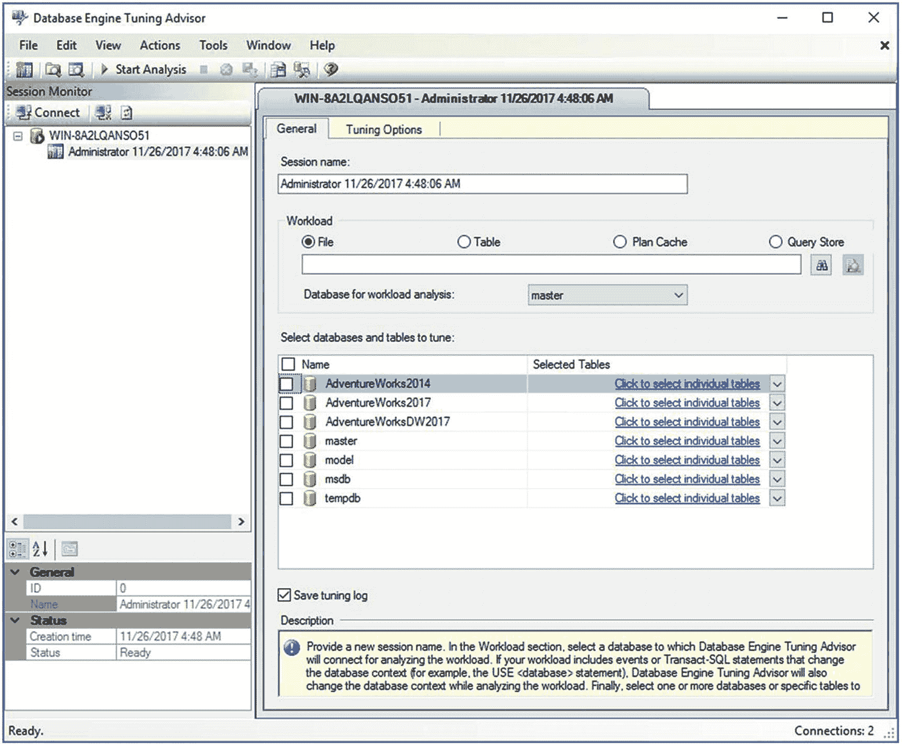
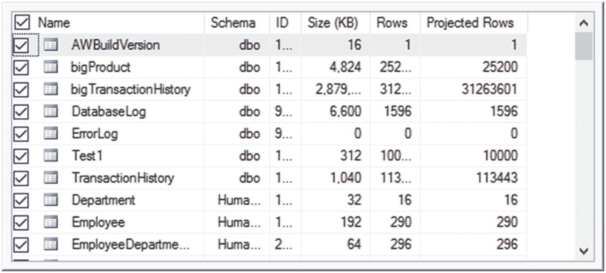
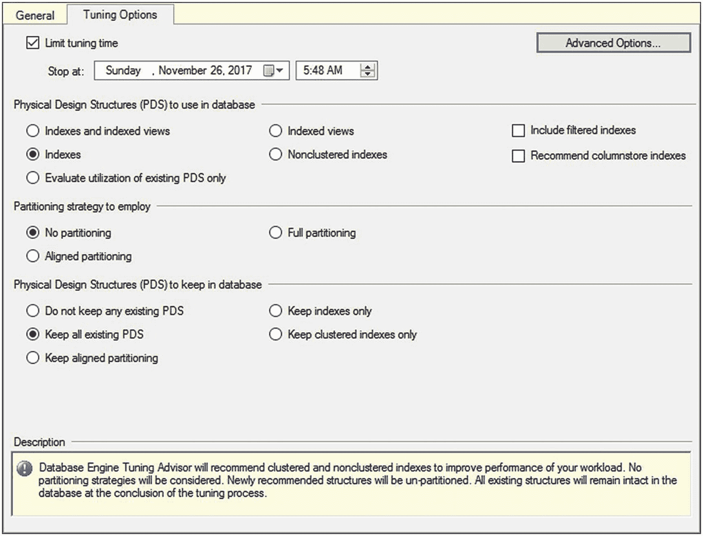
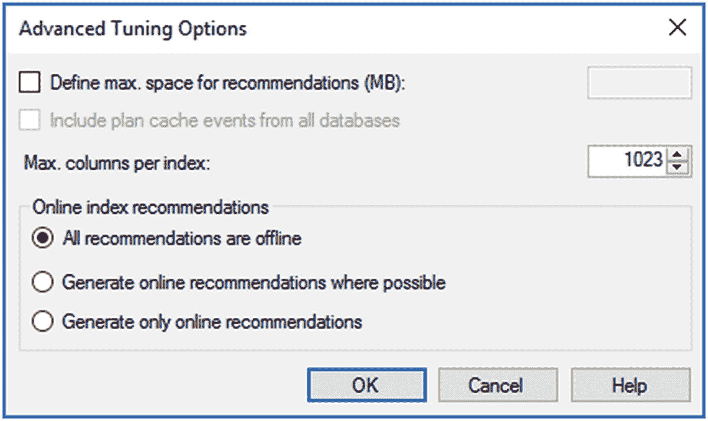

# 10. 数据库引擎优化顾问

SQL Server 的性能通常取决于数据库表上是否有合适的索引。然而，随着工作负载和数据随时间变化，现有的索引可能不完全合适，可能需要新的索引。决定正确索引的任务很复杂，因为对一组查询有益的索引更改可能对另一组查询有害。

为了帮助你完成这个过程，SQL Server 提供了一个名为 Database Engine Tuning Advisor 的工具。该工具无需深入理解数据库架构、工作负载或 SQL Server 内部机制，即可帮助识别给定工作负载的一组最优索引和统计信息。它还可以为一小部分问题查询推荐调优选项。除了该工具的优点，我还将在本章中介绍它的局限性，因为如果使用不当，它可能弊大于利。

在本章中，我将介绍以下主题：

*   Database Engine Tuning Advisor 的工作原理
*   如何在问题查询集上使用 Database Engine Tuning Advisor 以获取索引建议，包括如何定义跟踪
*   Database Engine Tuning Advisor 的局限性


## 数据库引擎调优顾问机制

你可以通过选择 Microsoft SQL Server 2017 ➤ SQL Server 2017 数据库引擎调优顾问来直接运行数据库引擎调优顾问。你也可以从命令提示符（`dta.exe`）、SQL Profiler（工具 ➤ 数据库引擎调优顾问）、 Management Studio 中的查询（高亮显示所需查询并选择查询 ➤ 在数据库引擎调优顾问中分析查询）或 Management Studio（选择工具 ➤ 数据库引擎调优顾问）来运行它。一旦工具启动并连接到服务器，你应该会看到一个类似图 10-1 的窗口。在本节中，我将介绍定义和运行分析的选项，然后在下一节中提供一些详细的示例。



图 10-1：在数据库引擎调优顾问中选择服务器和数据库

数据库引擎调优顾问已连接到服务器。从这里开始，你需要概述工作负荷和你想要调优的对象。创建会话名称对于为文档目的标记会话是必要的。然后你需要选择一个工作负荷。工作负荷可以来自跟踪文件或表、计划缓存中存在的查询，或来自查询存储中的查询（查询存储将在第 11 章详细讨论）。最后，你需要浏览到适当的位置。工作负荷的定义取决于你启动数据库引擎调优顾问的方式。如果是从查询窗口启动的，你会看到一个 `查询` 单选按钮，而 `文件` 和 `表` 单选按钮会被禁用。你还需要定义 `工作负荷分析数据库` 设置，最后选择一个要调优的数据库。

选择数据库时，你还可以通过单击屏幕右侧的下拉框来选择要调优的单个表；你会看到一个表列表，如图 10-2 所示。



图 10-2：单击复选框在数据库引擎调优顾问中为调优定义单个表

一旦定义了工作负荷，你需要选择 `调优选项` 选项卡，如图 10-3 所示。



图 10-3：在数据库引擎调优顾问中定义选项

通过选择 `限制调优时间` 然后定义调优停止的日期和时间，你可以定义希望数据库引擎调优顾问运行的时间长度。数据库引擎调优顾问运行的时间越长，它应该能提出更好的建议。你选择数据库引擎调优顾问考虑创建的物理设计结构类型，还可以设置分区策略，以便调优顾问知道是否应考虑将表和索引分区作为分析的一部分。请记住，分区首先是一种数据管理工具，而不是性能调优机制。如果你的数据和结构不需要，分区可能并不一定是理想的结果。最后，你可以定义希望在数据库中保持不变的物理设计结构。更改这些选项将会缩小或扩大数据库引擎调优顾问可以用来提高性能的选择范围。你可以选择是否包括筛选索引，并且数据库引擎调优顾问可以建议列存储索引。

你可以单击 `高级选项` 按钮查看更多选项，如图 10-4 所示。



图 10-4：高级调优选项对话框

此对话框允许你限制建议的空间以及索引中可包含的列数。你可以决定是否要包含系统中每个数据库的计划缓存事件。最后，你可以定义新的索引或索引的更改是作为联机还是脱机索引操作执行。

一旦你适当地定义了所有这些设置，就可以通过单击 `开始分析` 按钮来启动数据库引擎调优顾问。针对你运行数据库引擎调优顾问的任何服务器实例，创建的会话都保存在 `msdb` 数据库中。它显示正在分析的内容以及取得的进度，如图 10-5 所示。


图 10-5：调优进度

在下一节的示例分析中，你将看到显示的进度更详细的示例。

分析完成后，你将获得一个建议列表（在图 10-6 中可见），并且多个报告将变得可用。表 10-1 描述了这些报告。

### 数据库引擎调优顾问报告

表 10-1

```
| 报告名称 | 报告描述 |
| --- | --- |
| 列访问 | 列出工作负荷中引用的列和表 |
| 数据库访问 | 列出工作负荷中引用的每个数据库以及每个数据库的工作负荷语句百分比 |
| 事件频率 | 按发生频率顺序列出工作负荷中的所有事件 |
| 索引详细信息（当前） | 定义工作负荷引用的索引及其属性 |
| 索引详细信息（建议） | 与“索引详细信息（当前）”报告相同，但显示有关数据库引擎调优顾问建议的索引的信息 |
| 索引使用情况（当前） | 列出工作负荷引用的索引及其使用百分比 |
| 索引使用情况（建议） | 与“索引使用情况（当前）”报告相同，但针对的是建议的索引 |
| 语句成本 | 列出如果实施建议，每条语句的性能改进情况 |
| 语句成本范围 | 按百分位数分解成本改进，以显示对于任何给定的更改集可以实现多少收益；这些成本是优化器提供的估计值 |
| 语句详细信息 | 列出工作负荷中的语句、其成本以及如果实施建议后降低的成本 |
| 语句到索引的关系 | 列出单个语句引用的索引；提供报告的当前版本和建议版本 |
| 表访问 | 列出工作负荷引用的表 |
| 视图到表的关系 | 列出物化视图引用的表 |
| 工作负荷分析 | 提供有关工作负荷的详细信息，包括语句数量、成本降低的语句数量以及成本保持不变的语句数量 |
```

