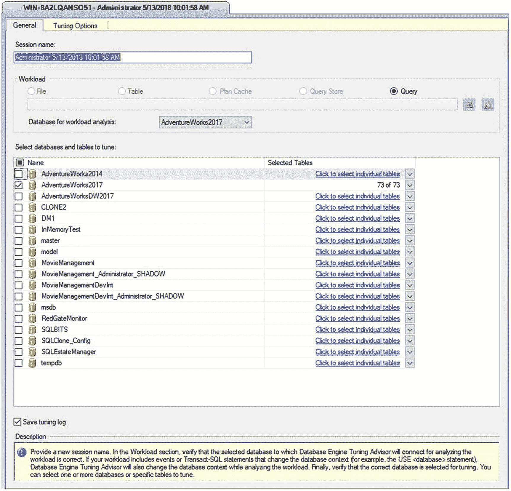
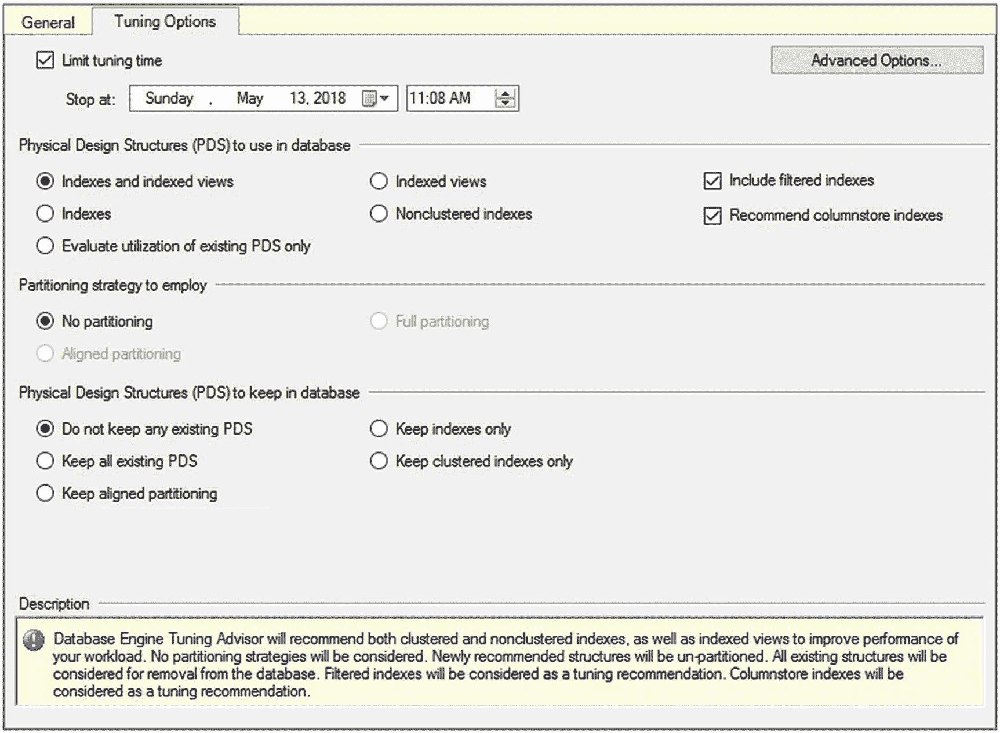
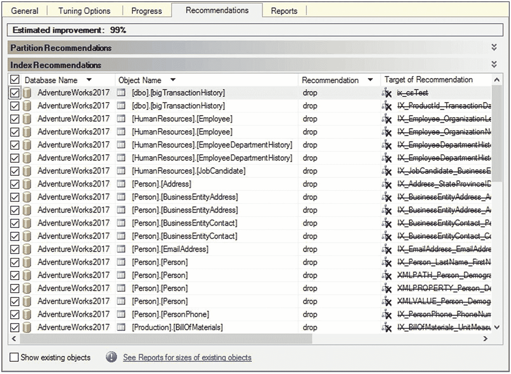
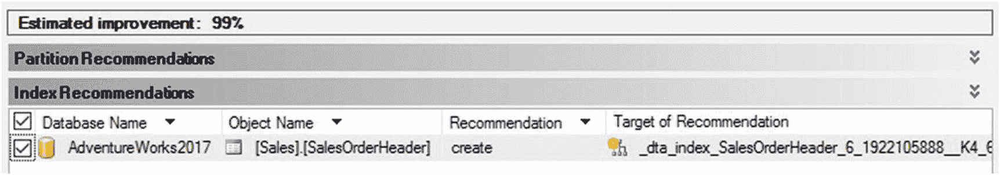
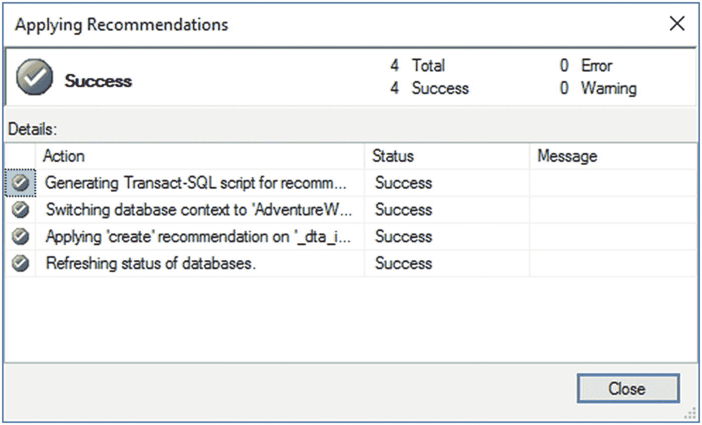
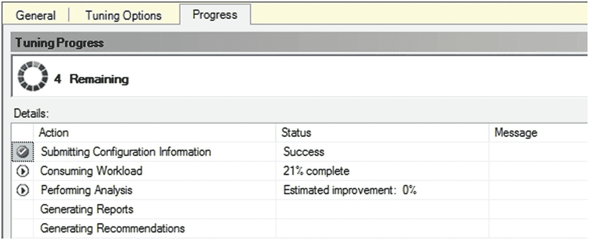
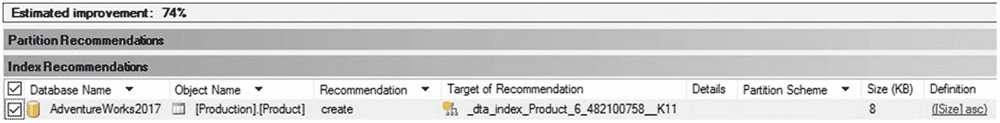

# 数据库引擎调优顾问示例

学习如何使用数据库引擎调优顾问的最佳方法就是使用它。掌握它并非难事，因此我建议打开它并开始使用。


### 调优查询

你可以使用 `数据库引擎优化顾问`，通过一个能代表所有 SQL 活动的工作负荷，来为整个数据库推荐索引。你也可以用它来为一组有问题的查询推荐索引。

要了解如何使用 `数据库引擎优化顾问` 为一组有问题的查询获取索引建议，假设你有一个相当频繁执行的简单查询。由于其执行频率高，你希望调优能快速完成。这个查询是：
```sql
SELECT soh.DueDate,
soh.CustomerID,
soh.Status
FROM Sales.SalesOrderHeader AS soh
WHERE soh.DueDate
BETWEEN '1/1/2008' AND '2/1/2008';
```

要分析此查询，请在查询窗口中右键单击它，然后选择 `在数据库引擎优化顾问中分析查询`。优化顾问会打开一个窗口，你可以将会话名称更改为有意义的名字。在这个例子中，我选择了 `Report Query Round 1 – 1/16/2014`。数据库和表无需编辑。完成设置后，第一个选项卡 `常规` 将如图 10-6 所示。



由于此查询很重要，对其进行调优对业务极其关键，我将在 `调优选项` 选项卡上更改一些设置，以尝试最大化可能的建议。出于示例目的，我将让 `数据库引擎优化顾问` 按默认运行一小时，但对于更大的负载或更复杂的查询，你可能需要考虑给系统更多时间。我将勾选 `包括筛选索引` 复选框，这样如果筛选索引有帮助，它就会被考虑。我也会让它推荐 `列存储索引`。最后，我将允许 `数据库引擎优化顾问` 进行结构更改，如果它能找到任何有帮助的更改，通过将 `保留所有现有 PDS` 切换为 `不保留任何现有 PDS`。完成后，`调优选项` 选项卡将如图 10-7 所示。



请注意，当你更改上方选择的定义时，屏幕底部的描述也会随之改变。开始分析后，进度屏幕应该会出现。尽管设置是评估一小时，但 `DTA` 仅用了大约一分钟就评估了此查询。初步的建议并不是一个好的选择。如你在图 10-8 中所看到的，`数据库引擎优化顾问` 建议删除数据库中大量的索引。这不是你运行此工具时希望得到的建议类型。



`数据库引擎优化顾问` 假定正在测试的负载是数据库的完整负载。每一次测试都是如此。如果你运行的测试不是具有代表性的负载，那么根据建议进行更改可能会导致严重问题。

如果有索引未被使用，那么应该删除它们。这是最佳实践，应在任何数据库上实施。然而，在本例中，这是单个查询，而不是系统的完整负载。要看看优化顾问是否能提出更有意义的一组建议，你必须启动一个新的会话。

这次，我将调整选项，使 `数据库引擎优化顾问` 无法删除任何现有结构。这在 `调优选项` 选项卡上设置（如前面的图 10-7 所示）。在那里，我将 `要在数据库中保留的物理设计结构 (PDS)` 设置从 `不保留任何现有 PDS` 更改为 `保留所有现有 PDS`。我将保持运行时间不变，因为评估在时间范围内运行良好。再次运行 `数据库引擎优化顾问` 后，它在一分钟内完成，并显示如图 10-9 所示的建议。



第一次运行时，`数据库引擎优化顾问` 建议删除正在测试的表及其相关表上的大部分索引。这次，它建议在查询引用的列上创建一个覆盖索引。如第 9 章所述，覆盖索引可能是检索数据的最佳性能方法之一。`数据库引擎优化顾问` 能够识别出一个包含查询引用的所有列的索引（即覆盖索引）将具有最佳性能。

收到建议后，你应该仔细检查拟议的 `T-SQL` 命令。这些建议并不总是有帮助，因此你需要评估并测试它们以确认。假设检查后的建议看起来不错，你会希望应用它。选择 `操作 ➤ 评估建议`。这将打开一个新的 `数据库引擎优化顾问` 会话，并允许你使用与最初提出建议相同的衡量标准来评估这些建议是否有效。所有这些都是为了验证原始建议是否具有其声称的效果。新会话看起来就像一个常规的评估报告。如果你仍然对建议满意，请选择 `操作 ➤ 应用建议`。这将打开一个对话框，允许你立即应用建议或安排应用（见图 10-10）。


如果你单击 `确定` 按钮，`数据库引擎优化顾问` 会将索引应用到你一直在测试查询的数据库（见图 10-11）。



生成建议后，你可能希望不是立即应用它们，而是将 `T-SQL` 语句保存到文件中，并累积一系列更改，在计划的部署窗口期间发布到生产环境。此外，仅使用默认设置，你最终会得到很多类似这样的索引名称：`_dta_index_SalesOrderHeader_5_1266103551__K4_6_11`。这不是很清晰，因此将更改保存到 `T-SQL` 也将使你能够使更改更具可读性。请记住，将索引应用到表，尤其是大表，可能会在创建索引期间对系统上正在运行的进程造成性能影响。

虽然一次获取一个索引建议很好，但能够一次性检查数据库的大部分区域会更好。这就是调优跟踪工作负荷的用武之地。


### 调优跟踪工作负载

从针对生产服务器运行的真实查询中捕获跟踪，是向数据库引擎调优顾问提供有意义数据的一种方式。（捕获跟踪将在第 18 章介绍。）为数据库引擎调优顾问定义跟踪最简单的方法是使用调优模板实现跟踪。在需要调优的系统上启动跟踪。我通过 PowerShell `sqlps.exe` 命令提示符在一个循环中运行查询来生成人工负载。这是带有 SQL Server 配置设置的 PowerShell 命令提示符。它随 SQL Server 一起安装。

为了找到一些有趣的点，我将创建一个具有明显调优问题的存储过程。

```sql
CREATE PROCEDURE dbo.uspProductSize
AS
SELECT  p.ProductID,
        p.Size
FROM    Production.Product AS p
WHERE   p.Size = '62';
```

这是我使用的简单 PowerShell 脚本。你需要根据你的环境调整连接字符串。将文件下载到某个位置后，你只需通过命令提示符引用该文件及其完整路径即可运行它。由于这是一个未签名、原始的脚本，你可能会遇到安全问题。如果需要，请遵循该错误消息中提供的帮助指导（`queryload.ps1`）。

```powershell
$SqlConnection = New-Object System.Data.SqlClient.SqlConnection
$SqlConnection.ConnectionString = 'Server=WIN-8A2LQANSO51;Database=AdventureWorks2017;trusted_connection=true'
### Load Product data
$ProdCmd = New-Object System.Data.SqlClient.SqlCommand
$ProdCmd.CommandText = "SELECT ProductID FROM Production.Product"
$ProdCmd.Connection = $SqlConnection
$SqlAdapter = New-Object System.Data.SqlClient.SqlDataAdapter
$SqlAdapter.SelectCommand = $ProdCmd
$ProdDataSet = New-Object System.Data.DataSet
$SqlAdapter.Fill($ProdDataSet)
### Set up the procedure to be run
$WhereCmd = New-Object System.Data.SqlClient.SqlCommand
$WhereCmd.CommandText = "dbo.uspGetWhereUsedProductID @StartProductID = @ProductId, @CheckDate=NULL"
$WhereCmd.Parameters.Add("@ProductID",[System.Data.SqlDbType]"Int")
$WhereCmd.Connection = $SqlConnection
### And another one
$BomCmd = New-Object System.Data.SqlClient.SqlCommand
$BomCmd.CommandText = "dbo.uspGetBillOfMaterials @StartProductID = @ProductId, @CheckDate=NULL"
$BomCmd.Parameters.Add("@ProductID",[System.Data.SqlDbType]"Int")
$BomCmd.Connection = $SqlConnection
### Bad Query
$BadQuerycmd = New-Object System.Data.SqlClient.SqlCommand
$BadQuerycmd.CommandText = "dbo.uspProductSize"
$BadQuerycmd.Connection = $SqlConnection
while(1 -ne 0)
{
    $RefID = $row[0]
    $SqlConnection.Open()
    $BadQuerycmd.ExecuteNonQuery() | Out-Null
    $SqlConnection.Close()
    foreach($row in $ProdDataSet.Tables[0])
    {
        $SqlConnection.Open()
        $BomCmd.Parameters["@ProductID"].Value = $ProductId
        $BomCmd.ExecuteNonQuery() | Out-Null
        $SqlConnection.Close()
        $SqlConnection.Open()
        $ProductId = $row[0]
        $WhereCmd.Parameters["@ProductID"].Value = $ProductId
        $WhereCmd.ExecuteNonQuery() | Out-Null
        $SqlConnection.Close()
    }
}
```

### 注意

有关 PowerShell 的更多信息，请查阅 Don Jones 和 Jeffrey Hicks 所著的`PowerShell in a Month of Lunches`（Manning，2016）。

创建跟踪文件后，打开数据库引擎调优顾问。它在“工作负载”部分默认为文件类型，因此你只需浏览到跟踪文件位置即可。和之前一样，你需要从下拉列表中选择 `AdventureWorks2017` 数据库作为工作负载分析的数据库。为了限制建议，也从屏幕底部的数据库列表中选择 `AdventureWorks2012`。设置适当的调优选项并开始分析。这次，运行时间将超过一分钟（参见图 10-12）。



图 10-12 数据库调优引擎运行中

在我的机器上，处理过程大约运行了 15 分钟。然后它会生成输出，如图 10-13 所示。



图 10-13 关于手动统计信息的建议

在通过数据库引擎调优顾问运行所有查询后，顾问提出了一个针对`Product`表的新索引建议，这将提高该查询的性能。现在我只需要将其保存到一个 T-SQL 文件中，以便在应用到数据库之前编辑其名称。

### 从过程缓存调优

你可以利用存储在缓存中的查询计划作为调优建议的来源。过程很简单。“常规”页面上有一个选项，可让你选择计划缓存作为调优工作的来源，如图 10-14 所示。


图 10-14 选择计划缓存作为 DTA 的来源

所有其他选项的行为与本章前面概述的完全一样。处理时间比顾问处理工作负载时要少得多。它只有缓存中的查询需要处理，因此，根据系统内存的大小，这可能是一个很短的列表。处理我的缓存后的结果建议了几个索引和一些单独的统计信息，如图 10-15 所示。


图 10-15 来自计划缓存的建议

这为你提供了另一种尝试以自动化方式调优系统的机制。但它仅限于当前在缓存中的查询。根据缓存的易变性（计划老化或被新计划替换的速度），这可能有用，也可能没用。

### 从查询存储调优

我们将在第 11 章介绍查询存储。但是，我们可以利用查询存储收集的信息，尝试从调优顾问获得调优建议。你从图 10-14 所示的列表中选择查询存储工作负载。然后你必须选择一个数据库，因为查询存储只对单个数据库启用。然而，从那里开始，调优选项和行为是相同的。在我的系统上，建议比从计划缓存中提取的要多一些，如图 10-16 所示。


图 10-16 来自查询存储的建议

建议更多的原因是查询存储包含的计划比计划缓存中或在单个跟踪运行期间捕获的计划更多。这种改进的数据使查询存储成为用于调优建议的绝佳资源。


## 数据库引擎调优顾问的局限性

数据库引擎调优顾问的建议是基于输入的工作负载。如果输入的工作负载未能真实反映实际负载，那么所建议的索引有时可能会对工作负载中缺失的某些查询产生负面影响。但最重要的一点是，在许多情况下，数据库引擎调优顾问可能无法识别出潜在的优化机会。它拥有一个复杂的测试引擎，但在某些场景下，其能力是有限的。

对于生产服务器，你应确保 SQL 跟踪能完整地代表数据库工作负载。对于大多数数据库应用程序，捕获一整天的跟踪通常能涵盖在数据库上执行的大部分查询，不过也存在例外情况，例如每周、每月或年末处理。务必了解你的负载情况以及如何恰当地捕获它。数据库引擎调优顾问的其他一些考虑因素/局限性如下：

*   使用 `SQL:BatchCompleted` 事件的跟踪输入：如前所述，输入到数据库引擎调优顾问的 SQL 跟踪必须包含 `SQL:BatchCompleted` 事件；否则，该向导将无法识别工作负载中的查询。
*   查询在工作负载中的分布：在一个工作负载中，一个查询可能使用相同的参数值执行多次。与仅执行一次的查询的性能大幅改进相比，对最常见查询的微小性能改进对整体工作负载性能的贡献可能更大。
*   索引提示：SQL 查询中的索引提示可能会阻止数据库引擎调优顾问选择更好的执行计划。该向导会将 SQL 查询中使用的所有索引提示作为其建议的一部分。由于这些索引对于表来说可能并非最优，在将工作负载提交给向导之前，应从查询中移除所有索引提示，同时记住你需要将它们添加回去以查看它们是否真的能提高性能。

请记住，调优顾问的建议仅仅是建议。它提供的建议可能不会如顾问所建议的那样生效，并且你可能已经拥有了与所建议索引效果相当的现有索引。在实施之前，请测试并验证所有建议。

## 总结

正如你在本章所学，数据库引擎调优顾问可以是一个用于分析现有索引有效性并为 SQL 工作负载推荐新索引的有用工具。随着 SQL 工作负载随时间变化，你可以使用此工具来确定哪些现有索引已不再使用，以及需要哪些新索引来提高性能。偶尔运行一下这个向导来检查你的现有索引是否确实最适合当前负载，可能是个好主意。这假设你自己没有捕获指标并进行评估。数据库引擎调优顾问还提供了许多有用的报告，用于分析 SQL 工作负载及其自身建议的有效性。只需记住，该工具的局限性使其无法发现所有的优化机会。同时也要记住，DTA 提供的建议质量取决于你向其提供的输入质量。如果你的数据库状况不佳，这个工具可以给你一个快速的帮助。如果你已经在定期监控和调优查询，你可能看不到数据库引擎调优顾问的建议带来什么好处。

捕获查询指标和执行计划过去在自动化和维护方面需要大量工作。然而，捕获这些信息对于你的查询调优工作至关重要。从 SQL Server 2016 开始，`查询存储` 提供了一个用于捕获查询指标等信息的绝佳机制。下一章将让你全面了解 `查询存储` 提供的所有功能。

