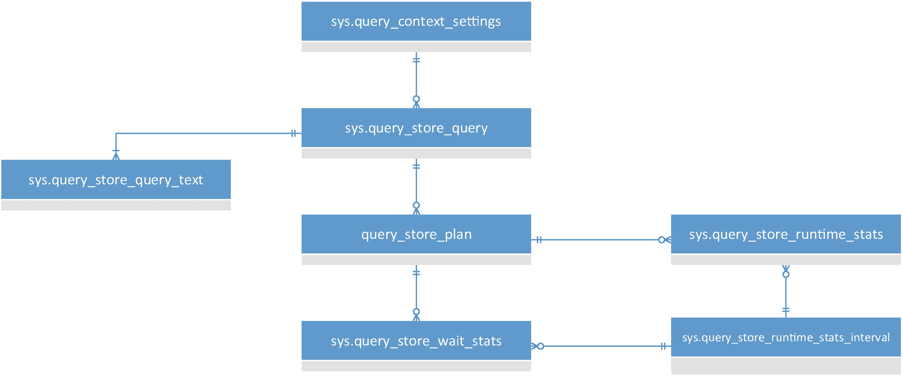

# 11. 查询存储

`查询存储` 最初于 2015 年在 Azure SQL Database 中引入，并于 2016 年首次引入 SQL Server。`查询存储` 提供了三个你将想要利用的功能。首先，你获得了查询指标和执行计划，这些信息被永久存储在数据库中易于访问的结构中，因此你拥有关于系统上查询性能的良好、灵活的信息。其次，`查询存储` 创建了一种以前从未有过的、直接控制执行计划行为的方法。最后，`查询存储` 充当数据库升级的安全和报告机制，使你能够以新的方式保护你的系统。

在本章中，我将涵盖以下主题：

*   `查询存储` 的工作原理及其收集的信息
*   通过 Management Studio 暴露的关于 `查询存储` 行为的报告和机制
*   计划强制，一种控制 SQL Server 和 Azure SQL Database 使用哪些执行计划的方法
*   一种有助于保护系统行为的升级方法

虽然扩展事件会话是你进行精确测量的首选方法，但对于大多数系统来说，`查询存储` 应该是监控查询性能的主要手段。

## 查询存储的功能与设计

就对系统的影响而言，`查询存储` 可能是最轻量级的机制。它提供了你正确理解系统查询性能所需的核心内容。另外，因为围绕 `查询存储` 的所有工作都是通过系统视图完成的，你可以使用 `T-SQL` 来操作它，因此使用起来变得极其容易。随着 `查询存储` 的引入，使用 `DMO`、跟踪事件，甚至在一定程度上使用 `扩展事件` 作为监控查询指标的机制，真的可以被认为是老派的做法了。


## 查询存储行为

查询存储收集两类信息。首先，它收集每个查询在您系统上行为的聚合数据。其次，默认情况下，查询存储会捕获系统上创建的每个执行计划，直至达到每个查询的最大计划数（默认为 200）。您可以按数据库为单位开启或关闭 `Query Store`。当开启时，`Query Store` 的运作方式如图 11-1 所示。


图 11-1 查询存储收集数据的行为

查询优化过程照常进行。当向系统提交一个查询时，会创建一个执行计划（详见第 15 章）并存储在 `plan cache`（计划缓存）中（将在第 16 章解释）。这些过程完成后，`Query Store` 会启动一个异步进程从 `plan cache` 中捕获执行计划。最初，它将这些计划写入一块单独的内存进行临时存储。随后，另一个异步进程会将这些执行计划写入数据库中的 `Query Store`。所有这些都属于异步进程，以确保对系统内的其他进程影响最小（虽然不是零）。此流程的唯一例外是 `plan forcing`（计划强制），我们将在本章后面介绍。

然后，查询执行过程与其他任何查询一样。一旦查询执行完成，查询运行时指标（例如读取次数、写入次数、查询持续时间和等待统计信息）会被异步写入另一个独立的内存空间。稍后，另一个异步进程会将该信息写入磁盘。收集并写入磁盘的信息是聚合过的。默认的聚合时间间隔是 60 分钟。

存储在 `Query Store` 系统表中的所有信息都会被永久写入启用了 `Query Store` 的数据库。查询指标和查询的执行计划随数据库一起保存。它们随数据库一起备份，也随数据库一起恢复。如果系统离线或发生故障转移，可能会丢失一些仍驻留在内存中、尚未写入磁盘的 `Query Store` 信息。默认的写入磁盘间隔是 15 分钟。考虑到这是聚合数据，对于可能因某些 `Query Store` 数据丢失（这不应被视为生产级别数据）造成的损失，这个间隔时间是可以接受的。

当您从 `Query Store` 查询信息时，它会合并内存中的数据和已写入磁盘的数据。您无需执行任何额外操作即可访问该信息。

在继续本章剩余内容之前，如果您想跟随一些代码和操作过程，您需要在一个数据库上启用 `Query Store`。此命令将完成该操作：

```
ALTER DATABASE AdventureWorks2017 SET QUERY_STORE = ON;
```

为确保您在跟随操作时 `Query Store` 中有查询记录，让我们使用以下存储过程：

```
CREATE OR ALTER PROC dbo.ProductTransactionHistoryByReference (
    @ReferenceOrderID int
)
AS
BEGIN
    SELECT  p.Name,
            p.ProductNumber,
            th.ReferenceOrderID
    FROM    Production.Product AS p
    JOIN    Production.TransactionHistory AS th
            ON th.ProductID = p.ProductID
    WHERE   th.ReferenceOrderID = @ReferenceOrderID;
END
```

如果您使用这三个值执行该存储过程，并在每次执行后将其从缓存中清除，您实际上会得到三个不同的执行计划。

```
DECLARE @Planhandle VARBINARY(64);

EXEC dbo.ProductTransactionHistoryByReference @ReferenceOrderID = 0;

SELECT @Planhandle = deps.plan_handle
FROM sys.dm_exec_procedure_stats AS deps
WHERE deps.object_id = OBJECT_ID('dbo.ProductTransactionHistoryByReference');

IF @Planhandle IS NOT NULL
BEGIN
    DBCC FREEPROCCACHE(@Planhandle);
END

EXEC dbo.ProductTransactionHistoryByReference @ReferenceOrderID = 53465;

SELECT @Planhandle = deps.plan_handle
FROM sys.dm_exec_procedure_stats AS deps
WHERE deps.object_id = OBJECT_ID('dbo.ProductTransactionHistoryByReference');

IF @Planhandle IS NOT NULL
BEGIN
    DBCC FREEPROCCACHE(@Planhandle);
END

EXEC dbo.ProductTransactionHistoryByReference @ReferenceOrderID = 3849;
```

通过这个操作，您可以确保 `Query Store` 中会有信息。

## 查询存储收集的信息

`Query Store` 收集的数据范围相当窄，但极其丰富。图 11-2 展示了其系统表及其关系。


图 11-2 查询存储的系统视图

`Query Store` 中存储的信息分为两个基本集合。一个是关于查询本身的信息，包括查询文本、执行计划和查询上下文设置。然后是运行时信息，包括运行时区间、等待统计信息和查询运行时统计信息。我们将从查询信息开始，分别介绍每个部分的信息。


