# 查询信息

查询存储的核心数据就是查询本身。查询独立于存储过程或批处理而存在，尽管它可能是其中的一部分。它归结为基本的查询文本和 `query_hash` 值（查询文本的哈希值），后者使你能够识别任何给定的查询。这些数据随后与查询计划和实际的查询文本相结合。图 11-3 展示了其基本结构和一些数据。

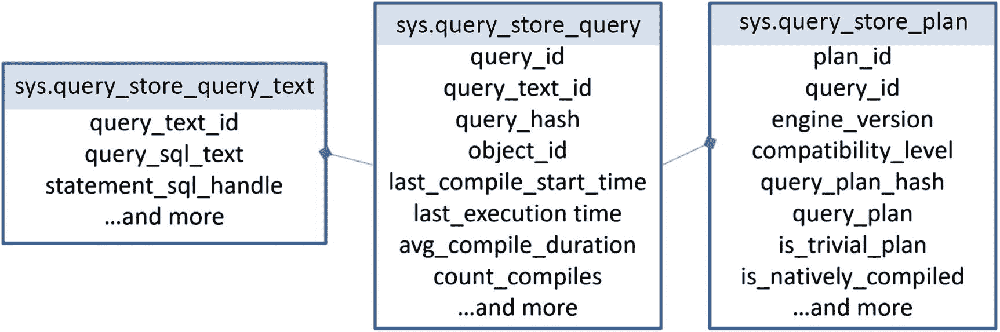

### 图 11-3
存储在查询存储中的查询信息

这些是系统表，存储在任何启用了查询存储的数据库的主文件组中。虽然 Management Studio 界面内置了很好的报表，但你可以编写自己的查询来访问查询存储中的信息。例如，以下查询可以检索给定存储过程的所有查询语句及其执行计划：

```sql
SELECT qsq.query_id,
qsq.object_id,
qsqt.query_sql_text,
CAST(qsp.query_plan AS XML) AS QueryPlan
FROM sys.query_store_query AS qsq
JOIN sys.query_store_query_text AS qsqt
ON qsq.query_text_id = qsqt.query_text_id
JOIN sys.query_store_plan AS qsp
ON qsp.query_id = qsq.query_id
WHERE qsq.object_id = OBJECT_ID('dbo.ProductTransactionHistoryByReference');
```

虽然每个单独的查询语句都存储在查询存储中，但你也会获得 `object_id`，因此可以使用像 `OBJECT_ID()` 这样的函数（如我所做的那样）来检索信息。请注意，我还必须对 `query_plan` 列使用 `CAST` 命令。这是因为查询存储正确地将该列存储为文本，而非 XML。SQL Server 中的 XML 数据类型有嵌套限制，这需要两个列来处理：对于符合要求的使用 XML 类型，对于不符合的则使用 `NVARCHAR(MAX)`。在构建查询存储时，他们通过设计解决了这个问题。如果你想能够点击结果（类似于图 11-4）来查看执行计划，就需要像我之前那样使用 `CAST`。


### 图 11-4
使用 T-SQL 从查询存储中检索的信息

在这个例子中，对于一个单独的查询（`query_id` = 75），这是一个单语句的存储过程，我有三个不同的执行计划，由三个不同的 `plan_id` 值标识。我们稍后会查看这些计划。

从查询存储的结果中需要注意的另一点是文本是如何存储的。由于此语句是带参数的存储过程的一部分，T-SQL 文本中使用的参数值是被定义的。这就是该语句在查询存储中的样子（格式保持不变）：

```sql
(@ReferenceOrderID int)SELECT  p.Name,              p.ProductNumber,              th.ReferenceOrderID      FROM    Production.Product AS p      JOIN    Production.TransactionHistory AS th              ON th.ProductID = p.ProductID      WHERE   th.ReferenceOrderID = @ReferenceOrderID
```

请注意语句开头的参数定义。提醒一下，实际的存储过程定义如下所示：

```sql
CREATE OR ALTER PROC dbo.ProductTransactionHistoryByReference (
@ReferenceOrderID int
)
AS
BEGIN
SELECT  p.Name,
p.ProductNumber,
th.ReferenceOrderID
FROM    Production.Product AS p
JOIN    Production.TransactionHistory AS th
ON th.ProductID = p.ProductID
WHERE   th.ReferenceOrderID = @ReferenceOrderID;
END
```

过程内的语句与存储在查询存储中的语句是不同的。这可能导致在尝试查找特定查询时出现问题。让我们看一个不同的例子：

```sql
SELECT a.AddressID,
a.AddressLine1
FROM Person.Address AS a
WHERE a.AddressID = 72;
```

这是一个批处理，而不是存储过程。首次执行此查询将按照前面概述的过程将其加载到查询存储中。如果我们运行一些 T-SQL 来检索此语句的信息，如下所示，将不会返回任何内容：

```sql
SELECT qsq.query_id,
qsq.query_hash,
qsqt.query_sql_text
FROM sys.query_store_query AS qsq
JOIN sys.query_store_query_text AS qsqt
ON qsqt.query_text_id = qsq.query_text_id
WHERE qsqt.query_sql_text = 'SELECT a.AddressID,
a.AddressLine1
FROM Person.Address AS a
WHERE a.AddressID = 72;';
```

因为这个语句非常简单，优化器能够对它执行一个称为**简单参数化**的过程。幸运的是，查询存储有一个用于处理自动参数化的函数 `sys.fn_stmt_sql_handle_from_sql_stmt`。该函数允许你按如下方式查找查询信息：

```sql
SELECT qsq.query_id,
qsq.query_hash,
qsqt.query_sql_text,
qsq.query_parameterization_type
FROM sys.query_store_query_text AS qsqt
JOIN sys.query_store_query AS qsq
ON qsq.query_text_id = qsqt.query_text_id
JOIN sys.fn_stmt_sql_handle_from_sql_stmt(
'SELECT a.AddressID,
a.AddressLine1
FROM Person.Address AS a
WHERE a.AddressID = 72;',
2)  AS fsshfss
ON fsshfss.statement_sql_handle = qsqt.statement_sql_handle;
```

格式和空格都必须完全相同，此方法才能生效。硬编码的值可以更改，但其余部分必须完全相同。运行此查询的结果如图 11-5 所示。


### 图 11-5
显示简单参数化结果的截图

你可以在 `query_sql_text` 列中看到，简单参数化的参数值已被添加到文本中，就像存储过程那样。坏消息是 `sy.fn_stmt_sql_handl_from_sql_stmt` 目前仅适用于自动参数化。它无法帮助你定位来自任何其他来源的参数化语句。要检索这些信息，你将被迫使用 `LIKE` 命令在文本中搜索，或者像我之前那样，对存储过程中的查询使用 `object_id`。


### 查询运行时数据

在检索到有关查询和计划的信息后，你接下来需要的将是查看运行时指标。理解运行时指标有两个关键点。首先，这些指标是关联回**计划**，而不是关联回查询。由于每个计划的行为可能不同，涉及针对不同索引的不同操作、不同的连接类型等等，因此捕获运行时数据和等待统计信息意味着要关联回计划。其次，运行时和等待统计信息是聚合的，但它们是**按运行时区间**进行聚合的。运行时区间的默认值为 60 分钟。这意味着对于每个计划的每个运行时区间，你都将得到一组不同的指标。

所有这些信息如图 11-6 所示。

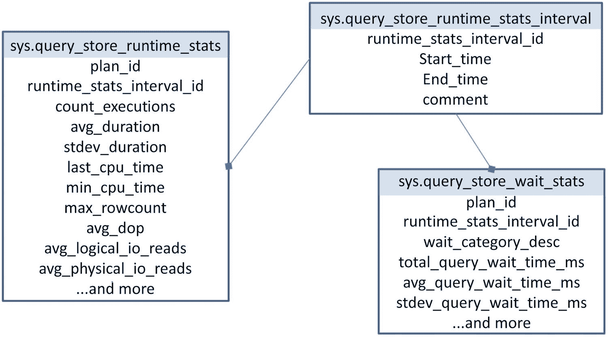

图 11-6: 包含运行时和等待统计信息的系统表

当你开始查询运行时指标时，你可以轻松地将它们与查询本身的信息结合起来。你必须处理区间问题，而处理区间的最佳方法可能是对它们进行分组和聚合，取平均值的平均值，依此类推。这看起来可能很麻烦，但你需要理解信息为何如此划分。当你查看查询性能时，你需要多个数字，例如当前性能、期望性能以及我们进行更改后的未来性能。如果没有这些数字进行比较，你就无法知道某个操作是慢还是已经得到了改善。查询存储中的信息也是如此。通过将所有内容分解成区间，你可以将今天与昨天进行比较，将一个时间点与另一个时间点进行比较。这样你才能知道性能是否真的下降了（或提高了），昨天运行得更快/更慢等等。如果你只有平均值而不是随时间变化的平均值，那么你将无法看到行为如何随时间变化。通过时间区间，你可以获得一些使用扩展事件自己捕获指标的粒度，同时结合查询缓存的易用性。

检索给定时间点的性能指标的查询可以这样编写：

```sql
DECLARE @CompareTime DATETIME = '2017-11-28 21:37';
SELECT CAST(qsp.query_plan AS XML),
       qsrs.count_executions,
       qsrs.avg_duration,
       qsrs.stdev_duration,
       qsws.wait_category_desc,
       qsws.avg_query_wait_time_ms,
       qsws.stdev_query_wait_time_ms
FROM sys.query_store_plan AS qsp
JOIN sys.query_store_runtime_stats AS qsrs
    ON qsrs.plan_id = qsp.plan_id
JOIN sys.query_store_runtime_stats_interval AS qsrsi
    ON qsrsi.runtime_stats_interval_id = qsrs.runtime_stats_interval_id
JOIN sys.query_store_wait_stats AS qsws
    ON qsws.plan_id = qsrs.plan_id
    AND qsws.execution_type = qsrs.execution_type
    AND qsws.runtime_stats_interval_id = qsrs.runtime_stats_interval_id
WHERE qsq.object_id = OBJECT_ID('dbo.ProductTransactionHistoryByReference')
    AND @CompareTime BETWEEN qsrsi.start_time
        AND     qsrsi.end_time;
```

让我们分解一下。你可以看到我们像前面的查询一样，从 `sys.query_store_plan` 开始获取查询计划。然后我们将它与包含所有运行时指标（如平均持续时间和持续时间的标准差）的表 `sys.query_store_runtime_stats` 结合起来。因为我打算基于特定时间进行筛选，所以我想确保连接到存储该数据的 `sys.query_store_runtime_stats_interval` 表。接着，我连接到 `sys.query_store_wait_stats`。在那里，我必须使用复合键来直接链接等待和运行时统计信息，即 `plan_id`、`execution_type` 和 `runtime_stats_interval_id`。我使用了本章前面的一个 `plan_id`，并设置数据返回特定的时间范围。图 11-7 显示了结果数据。

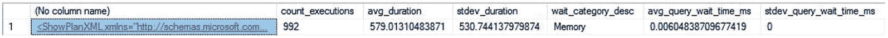

图 11-7: 一个查询在一个时间区间内的运行时指标和等待统计信息

理解 `sys.query_store_wait_stats` 和 `sys.query_store_runtime_stats` 中的信息如何聚合非常重要。它不仅仅是按 `runtime_stats_interval_id` 和 `plan_id` 聚合。`execution_type` 也决定了聚合方式，因为一个给定的查询可能出错或被取消。这会影响查询的行为和数据收集方式，因此它被包含在性能指标中以区分一组行为与另一组行为。让我们通过运行以下脚本来查看这一点：

```sql
SELECT *
FROM sys.columns AS c,
     sys.syscolumns AS s;
```

这个脚本会导致一个笛卡尔积连接，在我的系统上大约需要两分钟运行。如果我们让查询在运行时取消一次，再让它完成一次，我们就可以看到查询存储中的内容。

```sql
SELECT qsqt.query_sql_text,
       qsrs.execution_type,
       qsrs.avg_duration
FROM sys.query_store_query AS qsq
JOIN sys.query_store_query_text AS qsqt
    ON qsqt.query_text_id = qsq.query_text_id
JOIN sys.query_store_plan AS qsp
    ON qsp.query_id = qsq.query_id
JOIN sys.query_store_runtime_stats AS qsrs
    ON qsrs.plan_id = qsp.plan_id
WHERE qsqt.query_sql_text like '%FROM sys.columns AS c%';
```

你可以在图 11-8 中看到结果。

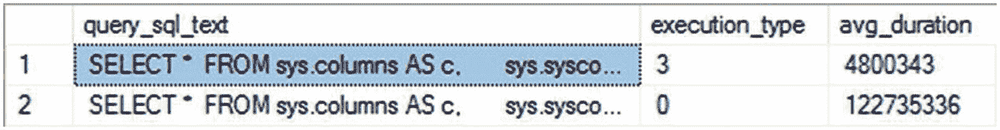

图 11-8: 中止的执行显示为不同的执行类型

你会看到中止的查询和出错的查询显示为不同的类型。此外，它们的持续时间、等待时间等运行时指标是分开存储的。要从这两个相应的表中获得正确的等待和持续时间度量集，你必须包含 `execution_type`。

如果你对给定查询的所有查询指标感兴趣，可以使用类似这样的查询从查询存储中检索信息：

```sql
WITH QSAggregate
AS (SELECT qsrs.plan_id,
           SUM(qsrs.count_executions) AS CountExecutions,
           AVG(qsrs.avg_duration) AS AvgDuration,
           AVG(qsrs.stdev_duration) AS StdDevDuration,
           qsws.wait_category_desc,
           AVG(qsws.avg_query_wait_time_ms) AS AvgWaitTime,
           AVG(qsws.stdev_query_wait_time_ms) AS StDevWaitTime
    FROM sys.query_store_runtime_stats AS qsrs
    JOIN sys.query_store_wait_stats AS qsws
        ON qsws.plan_id = qsrs.plan_id
        AND qsws.runtime_stats_interval_id = qsrs.runtime_stats_interval_id
    GROUP BY qsrs.plan_id,
             qsws.wait_category_desc)
SELECT CAST(qsp.query_plan AS XML),
       qsa.*
FROM sys.query_store_plan AS qsp
JOIN QSAggregate AS qsa
    ON qsa.plan_id = qsp.plan_id
WHERE qsq.object_id = OBJECT_ID('dbo.ProductTransactionHistoryByReference');
```

此查询的结果将是指定 `plan_id` 当前在查询存储中包含的所有信息。今后，你可以根据需要以任何方式组合查询存储中的信息。接下来，让我们来掌控查询存储。


### 控制查询存储

你已经了解了如何为数据库启用查询存储。要禁用查询存储，可以使用类似的操作。

```sql
ALTER DATABASE AdventureWorks2017 SET QUERY_STORE = OFF;
```

此命令将禁用查询存储，但不会删除查询存储信息。查询存储收集和管理的那些数据将在重启、故障转移、备份以及数据库离线后持续存在。甚至在禁用查询存储后，这些数据也会保留。要删除查询存储数据，你必须像下面这样直接控制：

```sql
ALTER DATABASE AdventureWorks2017 SET QUERY_STORE CLEAR;
```

这将清除查询存储中的所有数据。如果你愿意，可以选择性地删除。你可以简单地删除一个给定的查询。

```sql
EXEC sys.sp_query_store_remove_query @query_id = @queryid;
```

你可以删除一个查询计划。

```sql
EXEC sys.sp_query_store_remove_plan @plan_id = @PlanID;
```

你还可以重置性能指标。

```sql
EXEC sys.sp_query_store_reset_exec_stats @plan_id = @PlanID;
```

所有这些操作只需要你找到想要控制的那个计划或查询，然后就可以操作了。你可能还会发现，你想保留查询存储中那些已写入缓存但尚未写入磁盘的数据。你可以强制将缓存刷新到磁盘。

```sql
EXEC sys.sp_query_store_flush_db;
```

最后，你可以更改查询存储内的默认设置。首先，了解去哪里获取这些信息是个好主意。你可以通过运行以下命令，以每个数据库为基础检索查询存储的当前设置：

```sql
SELECT * FROM sys.database_query_store_options AS dqso;
```

与查询存储的许多其他方面一样，这些设置是在每个数据库级别上控制的。这使你能够，例如，只更改一个数据库的统计信息聚合时间间隔而不影响另一个。控制查询存储设置的各个方面只需运行此查询：

```sql
ALTER DATABASE AdventureWorks2017 SET QUERY_STORE (MAX_STORAGE_SIZE_MB = 200);
```

该命令将查询存储的默认存储大小从 100MB 更改为 200MB，为被修改的数据库提供了更多空间。进行这些更改时，无需重启服务器。你也不会影响计划缓存中的计划行为或你正在修改的数据库中查询处理的任何其他部分。对于大多数情况下的大多数人来说，默认设置应该是足够的。根据你的具体情况，你可能希望修改查询存储的行为方式。进行这些更改时，请务必监控你的服务器，以确保没有对服务器产生负面影响。

我建议你开箱即用唯一值得考虑更改的设置是查询存储捕获模式。默认情况下，它捕获所有查询和所有查询计划，无论它们被调用的频率、运行时间长短或其他任何设置。对我们许多人来说，这种行为是足够的。然而，如果你已将系统设置更改为“优化即席查询”，你这样做是因为你收到了大量的即席查询，并且你正试图管理内存使用（更多内容见第 16 章）。该设置意味着你对捕获每一个计划的兴趣降低了。你也可能处于这样的情况：由于事务量很大，你根本不希望捕获每一个查询或计划。这些情况可能促使你更改查询存储捕获模式设置。其他选项是“无”和“自动”。“无”将停止查询存储捕获查询和指标，但如果你为任何查询设置了计划强制（本章稍后将详细介绍计划强制），则仍允许其工作。“自动”只会捕获那些运行一定时长、消耗一定资源或被调用一定次数的查询。这些值都可能由微软更改，并在查询存储内部进行控制。你不能控制这里的值，只能控制是否使用它们。在大多数系统上，为了帮助减少噪音和开销，我建议从“全部”更改为“自动”。然而，这绝对是一个个人决定，你的情况可能要求不同。

你也可以使用 SQL Server Management Studio (SSMS) 图形用户界面来控制查询存储。在对象资源管理器窗口中右键单击任意数据库，从上下文菜单中选择“属性”。当属性窗口打开时，你可以单击“查询存储”窗格，应该会看到类似图 11-9 的内容。

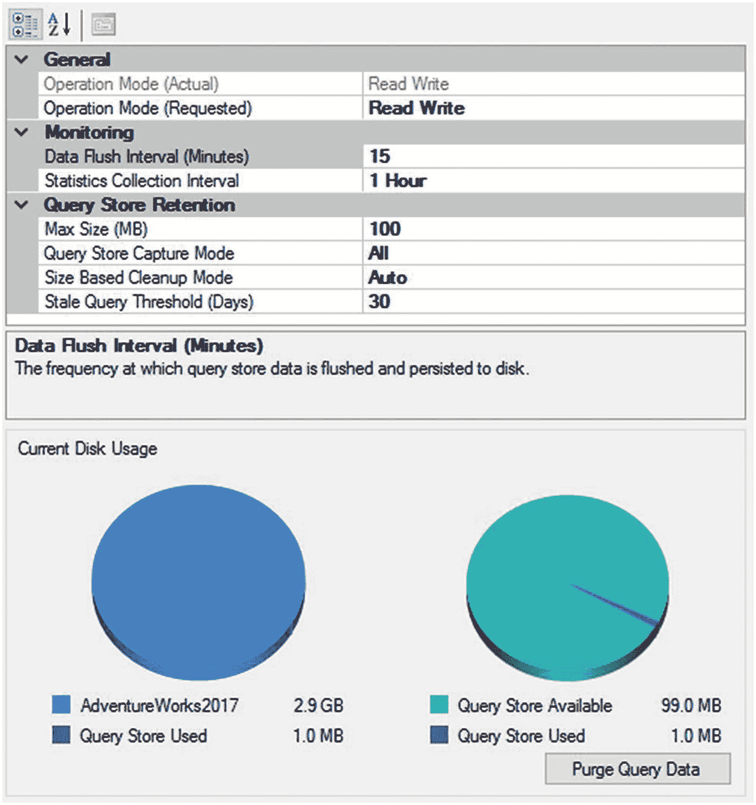

图 11-9

用于控制查询存储的 SSMS 图形用户界面

你立即可以看到我们在本章探索查询存储时已经介绍过的一些设置。你还可以看到查询存储正在使用多少数据以及分配空间中还剩多少容量。与前面显示的 T-SQL 命令一样，此处进行的任何更改都会立即反映在查询存储行为中，并且不需要系统进行任何形式的重启。


## 查询存储报告

在某些工作中，直接使用 T-SQL 控制查询存储并使用系统表检索相关数据是首选方法。然而，对于大部分工作，我们可以利用其内置报告及其在与查询存储协同时的行为。

要查看这些报告，只需在 Management Studio 的“对象资源管理器”窗口中展开数据库。对于任何启用了查询存储的数据库，都会有一个包含可见报告的新文件夹，如图 11-10 所示。

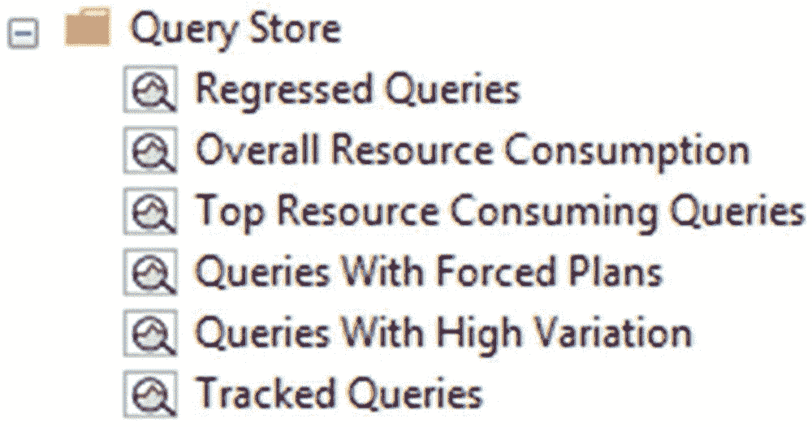

图 11-10
AdventureWorks2017 数据库中的查询存储报告

报告如下：

*   `Regressed Queries`：你将看到那些性能随时间推移发生负面变化的查询。
*   `Overall Resource Consumption`：此报告显示在定义的时间范围内（默认是上个月）不同查询的资源消耗情况。
*   `Top Resource Consuming Queries`：在这里你可以找到消耗资源最多的查询，而不考虑时间范围。
*   `Query With Forced Plans`：任何你定义为强制计划的查询都将在此报告中可见。
*   `Queries With High Variation`：此报告显示运行时统计信息变化程度高的查询，通常伴随着不止一个执行计划。
*   `Tracked Queries`：通过查询存储，你可以将一个查询定义为感兴趣的对象，而无需尝试在其他报告中追踪它，你可以标记该查询并在此处找到它。

这些报告中的每一个都是独特的，并且各有不同的用途，但我们没有时间和空间来详细探索全部。相反，我将重点介绍 `Top Resource Consuming Queries` 报告的行为，因为它通常代表了所有其他报告的行为，而且它可能是你会相当频繁使用的一个。打开报告，你会看到类似于图 11-11 的内容。

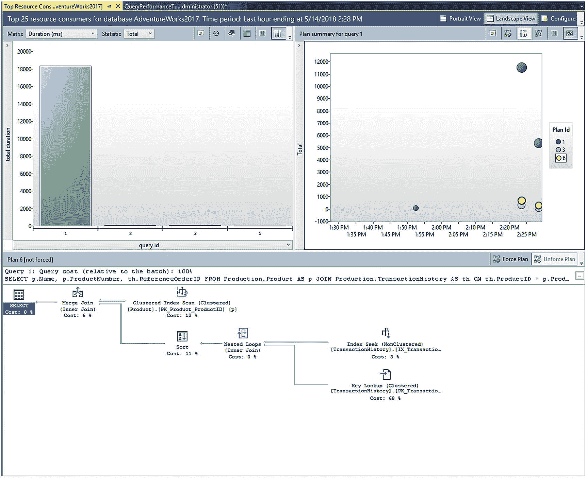

图 11-11
查询存储的前 25 个资源消耗者报告

报告中有三个窗口。第一个在左上角，按 `query_id` 值聚合显示查询。右侧的第二个窗口显示各种查询行为随时间的变化以及这些查询的不同计划。你可以看到，排名第一的查询（在第一个窗格中高亮显示）有三个不同的执行计划。点击其中任何一个计划都会在屏幕底部的第三个窗口中打开该计划。

你不仅限于默认行为。第一个窗口（默认按 `Duration` 聚合）驱动着其他两个窗口。屏幕顶部有一个下拉菜单，目前提供 13 个选项，如图 11-12 所示。

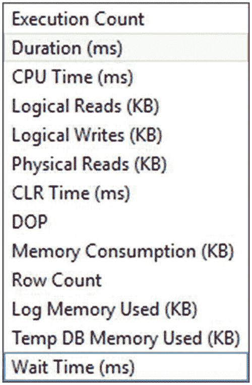

图 11-12
“前 25 个资源消耗者”报告的不同聚合方式

选择其中任何一个都会改变报告聚合的值。你还可以使用另一个下拉菜单更改报告的聚合方式。此列表包括 `average`、`minimum`、`maximum`、`total` 和 `standard deviation`。第一个窗口的其他功能包括：能够切换到网格格式、标记一个查询以便后续追踪（在 `Tracked Queries` 报告中）、刷新报告以及查看查询文本。所有这些功能在试图确定性能问题时，有助于识别需要花时间研究的查询。

下一个窗口显示从第一个窗口中选定的查询的性能指标。每个点既代表一个时间点，也代表一个特定的执行计划。图 11-13 中的信息说明了查询性能如何从上午 8:45 到 9:45 发生变化，以及查询的性能和执行计划在此时间范围内如何改变。

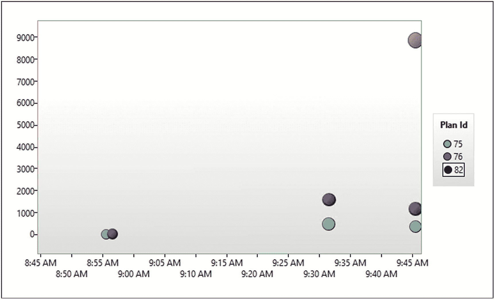

图 11-13
一个查询的不同性能行为和不同的执行计划

每个点的大小对应于给定计划在给定时间范围内的执行次数。如果你将鼠标悬停在任何给定的点上，它会显示有关该时间点的附加信息。图 11-14 显示了屏幕顶部（`plan_id` = 76）在上午 9:45 时间点的信息。

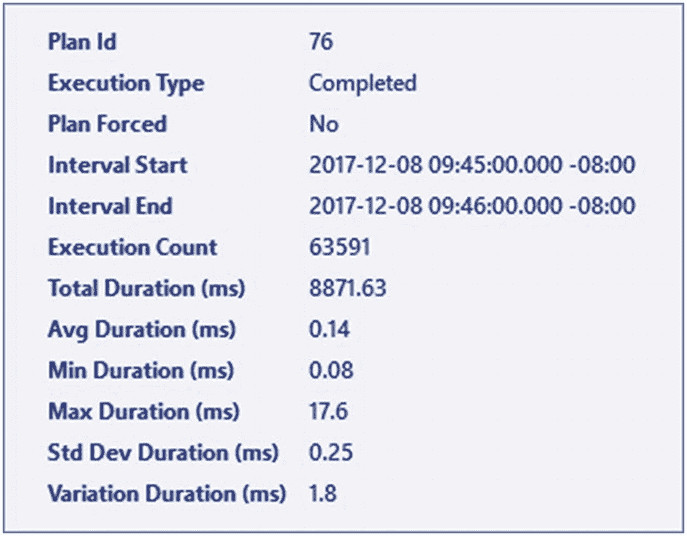

图 11-14
给定计划显示信息的详细信息

你可以看到该特定计划的执行次数和其他指标。无论你点击哪个点，你都将在最终窗口中看到该点对应的执行计划。显示的执行计划的使用方式与 Management Studio 中的任何其他图形计划相同，因此我不会在此详细描述其行为。这里展示的一个额外功能是强制计划的能力。你可以在执行计划窗口的右上角看到两个按钮，如图 11-15 所示。


图 11-15
从报告中强制和取消强制计划

你可以直接从报告中强制或取消强制一个计划。我将在下一节详细讨论计划强制。


## 计划强制

虽然查询存储的大部分功能都围绕着收集和观察查询及查询计划的行为，但有一项功能彻底改变了这一切，那就是计划强制。计划强制是指你将某个特定的计划标记为你希望 SQL Server 使用的计划。由于查询存储中的所有内容都写入数据库，因此能在重启、备份等操作后得以保留，这意味着你可以确保某个给定的计划始终会被使用。这个过程确实改变了一点查询存储与优化过程及计划缓存的交互方式，如图 11-16 所示。


图 11-16：添加计划强制后的查询优化过程

现在的情况是，如果一个计划被标记为强制计划，那么当优化器完成其过程后，在将计划存储到缓存以供查询使用之前，它会首先检查查询存储中的计划。如果此查询有一个强制计划，则将始终使用该计划。唯一的例外是，如果系统内部发生了某些变化，导致该计划对该查询无效。

计划强制的功能其实相当简单。你必须提供一个 `plan_id` 和一个 `query_id`，就可以强制一个计划。例如，我的系统中，与 `query_id` 值 75 匹配的查询（其语法、查询哈希和查询设置相符）有三个可能的计划。请注意，虽然我使用 `query_id` 来标记查询，但那是一个人工键。查询的识别因素是文本、哈希和上下文设置。强制计划的查询则极其简单。

```sql
EXEC sys.sp_query_store_force_plan 75,82;
```

这就是所需的全部操作。从此时起，无论查询是重新编译还是从缓存中移除，当优化过程完成后，都将使用与 `plan_id` 82 对应的计划。有了这个，我们可以查看“带有强制计划的查询”报告，看看显示了什么内容，如图 11-17 所示。

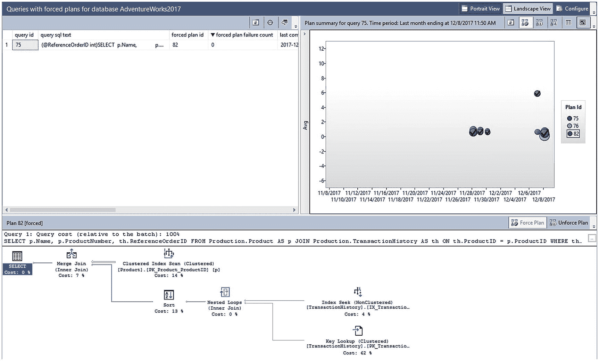

图 11-17：“带有强制计划的查询”报告

你可以看到，虽然这份报告整体上与“资源消耗最高的查询”报告相同，但存在差异。第一个窗口中的查询列表就是查询列表。第二个窗口几乎与图 11-11 和图 11-13 中显示的前一个窗口完全相同。但是，区别在于，被标记为强制的计划旁边有一个勾选标记。最后一个窗口基本相同，只有一个细微差别。顶部，“强制计划”按钮未启用，而“取消强制计划”按钮是启用的。你可以通过单击该按钮轻松地从此处取消强制计划。你也可以使用单个命令取消强制计划。

```sql
EXEC sys.sp_query_store_unforce_plan 214,248;
```

就像单击按钮一样，这将停止计划强制。从此时起，优化过程恢复正常。我打算把计划强制的完整演示留到我们讨论参数嗅探的第 17 章。可以说，在处理糟糕的参数嗅探时，计划强制变得极其有用。它在处理性能回退时也很方便，即 SQL Server 的更改导致先前表现良好的查询突然生成性能不佳的执行计划。这种情况最常发生在升级期间，当兼容性模式在未经测试的情况下被更改时。

## 用于升级的查询存储

虽然一般的查询性能监控和调优可能是查询存储的日常常见用途，但该工具最强大的用途之一是作为升级 SQL Server 的安全网。

假设你正计划从 SQL Server 2012 迁移到 SQL Server 2017。传统上，你会在某个测试实例上升级你的数据库，然后运行一系列测试以确保一切正常工作。如果你发现并记录了所有问题，那很好。不幸的是，由于优化器或基数估算器的一些更改，可能需要重写一些代码。这可能会导致升级延迟，或者业务方甚至可能决定完全避免升级（这是一个常见但糟糕的选择）。这假设你发现了问题。完全有可能因为估算行数或其他方面的更改而忽略某个特定查询突然开始表现不佳的情况。

这就是查询存储成为你升级安全网的地方。首先，你应该使用标准方法进行所有测试并尝试解决问题。这不应该改变。然而，查询存储为标准方法增加了额外的功能。以下是应遵循的步骤：

1.  将你的数据库还原到新的 SQL Server 实例或升级你的实例。这假设是生产机器，但你也可以在测试机器上执行此操作。
2.  将数据库保留在旧的兼容性模式。不要将其更改为新模式，因为你将在捕获数据之前启用新的优化器和新的基数估算器。
3.  启用查询存储。它可以收集在旧兼容性模式下运行的指标。
4.  运行你的测试或运行你的系统一段时间，以确保覆盖系统中的大部分查询。这段时间将根据你的需求而变化。
5.  更改兼容性模式。
6.  运行 `Regressed Queries`（性能回退的查询）报告。此报告将查找突然开始比以前运行得更慢的查询。
7.  调查这些查询。如果很明显查询计划已更改并且是性能变化的原因，那么选择更改之前的一个计划，并使用计划强制使其成为 SQL Server 使用的计划。
8.  在必要时，花时间重写查询或重组系统，以确保查询能够自行编译一个在系统上性能良好的计划。

这种方法不能预防所有问题。你仍然必须测试你的系统。然而，使用查询存储将为你提供处理 SQL Server 内部更改的机制，这些更改会影响你的查询计划并进而影响性能。你也可以使用类似的过程来应用累积更新或服务包。你还可以通过使用数据库作用域配置设置（在 SQL Server 2016 SP1 及更高版本中可用）来启用 `LEGACY_CARDINALITY_ESTIMATION`，或者添加一个提示来处理回退。这些是除了使用计划强制之外或代替其使用的选项。你也可以直接恢复到旧的兼容性模式，但这会丧失许多功能。


## 摘要

**查询存储** 增强了你识别性能不佳查询的能力。尽管查询存储的功能非常出色，但它并不会完全替代大多数人已经习惯使用的任何工具。它的粒度不如扩展事件。它也不具备查询计划缓存的某些即时性。话虽如此，查询存储通过包含额外信息（例如值的标准差）并保存所有执行计划（即使是那些已从缓存中移除或替换的计划），对这两种方法都进行了补充。此外，查询存储还增加了执行极其简单的计划强制功能，这不仅有助于解决参数或其他行为相关的问题，还能处理由 Microsoft 升级引起的计划退化。所有这些结合起来，使查询存储成为查询调优工具包中一个极其有用的补充。

通常，你会依赖非聚集索引来改善 SQL 工作负载的性能。这假设你已经为表分配了聚集索引。由于非聚集索引的性能高度依赖于与其关联的书签查找的成本，你将在下一章中了解如何分析和解决查找问题。

