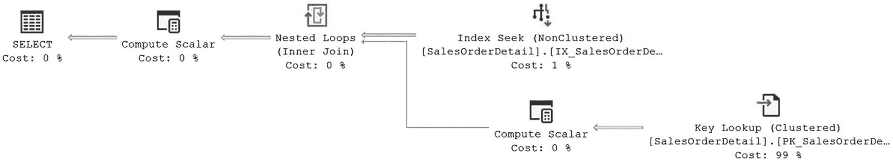
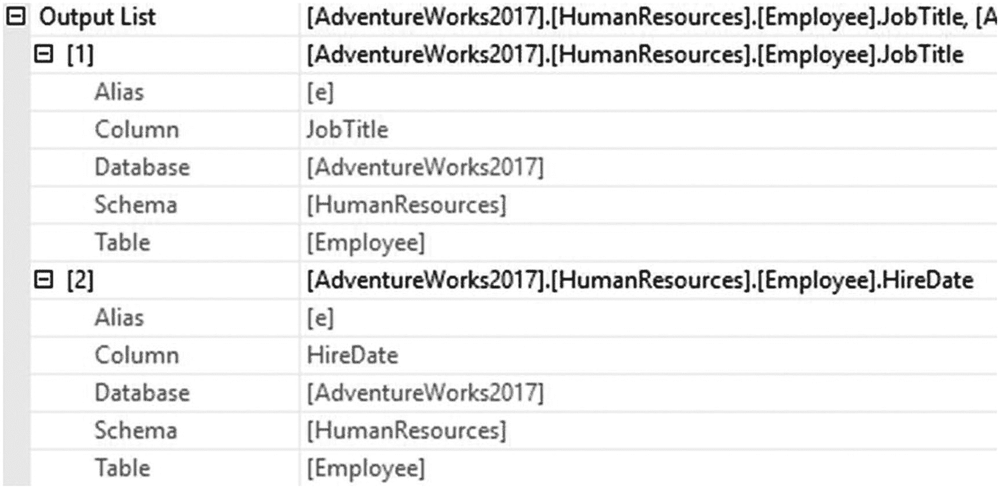
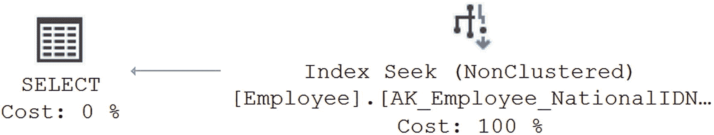
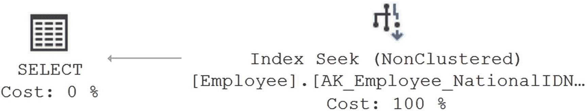
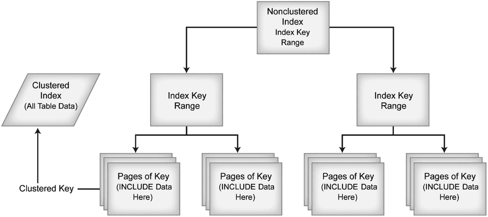
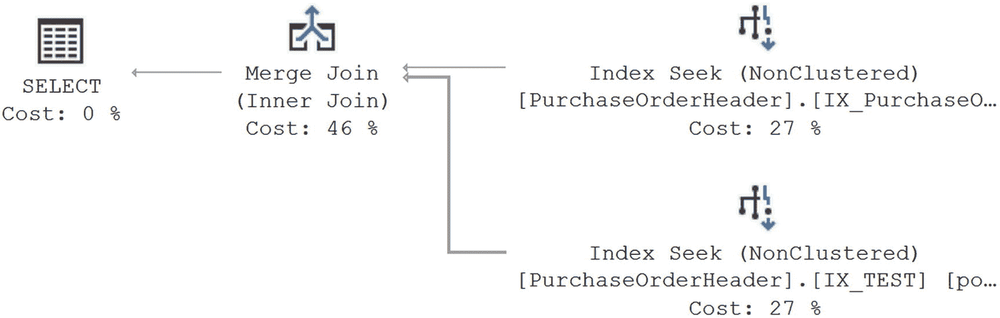

# 12. 键查找及其解决方案

为了最大化非聚集索引的收益，你必须尽可能地最小化数据检索的成本。与非聚集索引相关的一个主要开销是过多查找的成本（以前称为 *书签查找*），这是一种从非聚集索引行导航到聚集索引或堆中相应数据行的机制。因此，研究查找的原因并评估如何避免这种成本是有意义的。

在本章中，我将涵盖以下主题：

- 查找的目的
- 使用查找的缺点
- 查找原因的分析
- 解决查找问题的技术

## 查找的目的

当应用程序通过查询请求信息时，优化器可以利用（如果存在）`WHERE`、`JOIN` 或 `HAVING` 子句中列上的非聚集索引来导航至数据。当然，它也可以扫描堆或聚集索引，但我们这里假设谓词值和非聚集索引的键值是对齐的。如果查询引用的列不属于用于检索数据的非聚集索引的一部分（无论是键列还是 `INCLUDE` 列表），则需要从索引行导航到表中聚集索引或堆中的相应数据行，以访问这些剩余的列。

例如，在下面的 `SELECT` 语句中，如果优化器使用的非聚集索引不包含所有列，则需要从非聚集索引行导航到聚集索引或堆中的数据行以检索这些列的值。

```sql
SELECT p.Name,
AVG(sod.LineTotal)
FROM Sales.SalesOrderDetail AS sod
JOIN Production.Product AS p
ON sod.ProductID = p.ProductID
WHERE sod.ProductID = 776
GROUP BY sod.CarrierTrackingNumber,
p.Name
HAVING MAX(sod.OrderQty) > 1
ORDER BY MIN(sod.LineTotal);
```

`SalesOrderDetail` 表在 `ProductID` 列上有一个非聚集索引。优化器可以使用该索引来过滤表中的行。该表在 `SalesOrderID` 和 `SalesOrderDetailID` 上有一个聚集索引，因此它们会包含在非聚集索引中。但由于查询中没有引用它们，它们对查询毫无帮助。查询引用的其他列（`LineTotal`、`CarrierTrackingNumber`、`OrderQty` 和 `LineTotal`）在非聚集索引中不可用。为了获取这些列的值，需要通过聚集索引从非聚集索引行导航到相应的数据行，这个操作就是键查找。你可以在图 12-1 中看到实际效果。


**图 12-1** 键查找是一个更复杂执行计划的一部分

为了更好地理解非聚集索引如何导致查找，考虑以下 `SELECT` 语句，它通过使用列 `ProductID` 上的筛选条件，仅请求 `SalesOrderDetail` 表中的几行，但由于通配符 `*` 而请求所有列：

```sql
SELECT  *
FROM Sales.SalesOrderDetail AS sod
WHERE sod.ProductID = 776 ;
```

优化器评估 `WHERE` 子句，发现 `WHERE` 子句中包含的列 `ProductID` 上有一个非聚集索引，可以减少行数。由于只请求了少量行（228 行），通过非聚集索引检索数据比扫描聚集索引（包含超过 120,000 行）来识别匹配行更便宜。列 `ProductID` 上的非聚集索引将有助于快速识别匹配行。该非聚集索引包含列 `ProductID` 以及聚集索引列 `SalesOrderID` 和 `SalesOrderDetailID`；所有其他被请求的列都未包含在内。因此，正如你可能猜到的，在使用非聚集索引的同时检索剩余的列，你需要一次查找。

这一点在以下扩展事件指标和图 12-2 的执行计划中显示。寻找 `Key Lookup (Clustered)` 运算符。那就是正在进行的查找。



**图 12-2** 包含书签查找的执行计划

```text
持续时间：176ms
读取次数：755
```


## 查找操作的缺点

除了访问索引页外，查找操作还需要访问数据页。访问两组页面会增加查询的逻辑读取次数。此外，如果这些页面不在内存中，查找操作很可能需要在磁盘上进行一次随机（或非顺序）I/O 操作，以便从索引页跳转到数据页，同时还需要足够的 CPU 能力来整理此数据并执行必要的操作。这是因为，对于大表而言，索引页和对应的数据页在磁盘上通常不会直接相邻。

增加的逻辑读取以及（如果需要）代价高昂的物理读取，使得查找操作的数据检索操作成本相当高。此外，你还需要处理将从索引检索的数据与通过查找操作检索的数据进行组合的过程，这通常通过 `JOIN` 运算符之一来完成。查找操作的成本因素是非聚集索引更适合返回表中一小部分行的查询的原因。随着查询检索的行数增加，查找操作的开销成本变得不可接受。另外，如果优化器统计信息不准确并低估了返回的行数，查找操作会很快变得比扫描操作昂贵得多。

为了理解随着检索行数增加，查找操作如何使非聚集索引失效，让我们看一个不同的例子。产生图 12-2 执行计划的查询仅从 `SalesOrderDetail` 表返回了几行。保持查询不变，但将筛选器更改为不同的值，当然会改变返回的行数。如果将参数值更改如下：

```sql
SELECT  *
FROM    Sales.SalesOrderDetail AS sod
WHERE   sod.ProductID = 793;
```

那么运行该查询将返回超过 700 行，其性能指标不同，且执行计划完全不同（图 12-3）。


图 12-3：返回更多行的不同执行计划

```
Duration: 195ms
Reads: 1,262
```

为了确定使用非聚集索引的成本，请考虑查询在执行表扫描时产生的逻辑读取次数（`1,262`）。如果通过使用索引提示强制优化器使用非聚集索引，如下所示：

```sql
SELECT  *
FROM    Sales.SalesOrderDetail AS sod WITH (INDEX (IX_SalesOrderDetail_ProductID))
WHERE   sod.ProductID = 793 ;
```

那么逻辑读取次数会从 `1,262` 增加到 `2,292`。

```
Duration: 1,114ms
Reads: 2,292
```

图 12-4 显示了相应的执行计划。


图 12-4：使用索引提示获取更多行的执行计划

为了从非聚集索引中获益，查询应请求一个相对明确的数据集。对于处理大型结果集的应用程序设计，应用设计起着重要作用。例如，网页上的搜索引擎每次大多只返回有限数量的文章，即使搜索条件返回了数千篇匹配的文章。如果查询请求大量行，那么查找操作增加的开销成本可能会使非聚集索引变得不合适；随后，你必须考虑避免查找操作的可能性。

## 分析查找操作的原因

由于查找操作可能是一项成本高昂的操作，你应该分析是什么原因导致查询计划在执行计划中选择查找步骤。你可能会发现，通过将缺失的列包含在非聚集索引键中，或者作为索引页级别的 `INCLUDE` 列，可以避免查找操作，从而避免与之相关的开销成本。

要了解如何识别未包含在非聚集索引中的列，请考虑以下查询，该查询基于 `NationalIDNumber` 从 `HumanResources.Employee` 表中提取信息：

```sql
SELECT NationalIDNumber,
JobTitle,
HireDate
FROM HumanResources.Employee AS e
WHERE e.NationalIDNumber = '693168613';
```

这会产生以下性能指标和执行计划（参见图 12-5）：


图 12-5：带有查找操作的执行计划

```
Duration: 169 mc
Reads: 4
```

如执行计划所示，这里有一个键查找操作。`SELECT` 语句引用了 `NationalIDNumber`、`JobTitle` 和 `HireDate` 列。在 `NationalIDNumber` 列上的非聚集索引不提供 `JobTitle` 和 `HireDate` 列的值，因此需要通过查找操作从数据存储位置检索这些列。之所以称为 `键查找`，是因为它通过与非聚集索引一起存储的聚集键来检索数据。如果表是堆，则会是 `RID` 查找。然而，在现实世界中，识别查询使用的所有列通常不会这么容易。请记住，如果查询任何部分（不仅仅是选择列表）引用的所有列不是所用非聚集索引的一部分，就会导致查找操作。

在基于视图和用户定义函数的复杂查询情况下，可能很难找到查询引用的所有列。因此，你需要一个标准机制来查找由查找操作返回的、未包含在非聚集索引中的列。

如果查看 `键查找（聚集）` 操作的属性，你可以看到该操作的输出列表。这显示了查找操作输出的列。要快速轻松地获取输出列列表并能够复制它们，请右键单击运算符（本例中为 `键查找（聚集）`）。然后选择“属性”菜单项。在打开的属性窗口中向下滚动到“输出列表”属性（图 12-6）。该属性有一个扩展箭头，允许你展开列列表，并且每列旁边还有进一步的扩展箭头，允许你展开列的属性。



图 12-6：键查找属性窗口

要直接从属性窗口获取列列表，请单击“输出列表”属性右侧的省略号。这将在文本窗口中打开输出列表，你可以从中复制数据以供修改索引时使用（图 12-7）。


图 12-7：非聚集索引中不可用的必需列

使用该方法确实可以检索数据，但如图 12-6 和 12-7 之间信息的比较所示，如果你深入研究属性，可以获得更多信息。

## 解决查找问题

由于查找操作的相对成本可能很高，你应该尽可能尝试消除查找操作。在上一节中，你需要在不从索引行导航到数据行的情况下获取 `JobTitle` 和 `HireDate` 列的值。你可以通过以下三种不同的方式来实现，将在接下来的章节中进行解释。


### 使用聚簇索引

对于聚簇索引，索引的叶子页与表的数据页相同。因此，在读取聚簇索引键列的值时，数据库引擎无需从索引行进行任何导航即可同时读取其他列的值。在前面的例子中，如果你将特定行的非聚簇索引转换为聚簇索引，SQL Server 可以从同一页检索所有列的值。

简单地说你想将非聚簇索引转换为聚簇索引是很容易做到的。然而，在这种情况下，以及你可能遇到的大多数情况下，这是无法做到的，因为表已经存在一个聚簇索引。该表上的聚簇索引恰好也是主键。你将不得不删除所有外键约束，删除主键并重新创建为非聚簇索引，然后重新创建针对 `NationalIDNumber` 的索引。你不仅需要考虑所涉及的工作量，还可能会严重影响依赖于现有聚簇索引的其他查询。

**注意**

请记住，一个表只能有一个聚簇索引。

### 使用覆盖索引

在第 8 章中，你了解到覆盖索引对于查询来说就像一个伪聚簇索引，因为它可以无需借助表数据即可返回结果。因此，你也可以使用覆盖索引来避免查找。

要了解如何使用覆盖索引来避免查找，请再次检查针对 `HumanResources.Employee` 表的查询。

```sql
SELECT  NationalIDNumber,
        JobTitle,
        HireDate
FROM    HumanResources.Employee AS e
WHERE   e.NationalIDNumber = '693168613';
```

为了避免此书签查找，你可以将查询中引用的列 `JobTitle` 和 `HireDate` 直接添加到非聚簇索引键中。这将使该非聚簇索引成为此查询的覆盖索引，因为所有列都可以从索引中检索，而无需访问堆或聚簇索引。

```sql
CREATE UNIQUE NONCLUSTERED INDEX AK_Employee_NationalIDNumber
ON HumanResources.Employee
(
    NationalIDNumber ASC,
    JobTitle ASC,
    HireDate ASC
)
WITH DROP_EXISTING;
```

现在，当查询运行时，你将看到以下指标和不同的执行计划（图 12-8）：



图 12-8：使用覆盖索引的执行计划

```text
持续时间：164mc
读取次数：2
```

然而，通过更改键来创建覆盖索引有几个注意事项。如果你向非聚簇索引添加太多列，它会变得过宽。如第 8 章所讨论的，与操作查询相关的索引维护成本可能会增加。因此，需要仔细评估添加键值是否会为索引的常规使用带来好处。如果某个键值不会用于索引内的搜索，那么将其添加到键中就没有意义。同时评估要添加到非聚簇索引键中的列数（考虑大小和数据类型）。如果附加列的总宽度不是太大（最好通过测试和测量所得索引大小来确定），那么这些列可以添加到非聚簇索引键中，用作覆盖索引。此外，如果你向索引键添加列，当然取决于索引，可能会对其他查询产生负面影响。它们可能期望以特定顺序看到索引键列，或者可能不引用键中的某些列，导致优化器不使用该索引。仅当根据这些评估有意义时才通过添加键来修改索引，尤其是因为你有替代方案来修改键。

另一种实现覆盖索引而无需通过添加键列来重塑索引的方法是使用 `INCLUDE` 列。将索引修改为如下所示：

```sql
CREATE UNIQUE NONCLUSTERED INDEX AK_Employee_NationalIDNumber
ON HumanResources.Employee
(
    NationalIDNumber ASC
)
INCLUDE
(
    JobTitle,
    HireDate
)
WITH DROP_EXISTING;
```

现在，当查询运行时，你将得到以下指标和执行计划（图 12-9）：



图 12-9：使用 INCLUDE 列的执行计划

```text
持续时间：152mc
读取次数：2
```

在这种情况下，索引的大小只是稍微小一点，因为 `INCLUDE` 仅在叶子页上存储数据，而不是在每一页上。索引仍然是覆盖索引，与图 12-8 中显示的执行计划一样。因为数据存储在索引的叶子级别，所以当使用索引检索键值时，`INCLUDE` 语句中的其余列可供使用，几乎就像它们是键的一部分一样。请参阅图 12-10。


## 使用 INCLUDE 关键字


**图 12-10**

使用 `INCLUDE` 关键字的索引存储

获取覆盖索引的另一种方法是利用 SQL Server 的内部结构。如果稍微修改前面的查询，使其不是检索特定的 `NationalIDNumber` 及其关联的 `JobTitle` 和 `HireDate`，而是检索不同的数据集合——这次查询以 `NationalIDNumber` 作为备用键，并在一定值域范围内检索表的主键 `BusinessEntityID`。

```sql
SELECT  NationalIDNumber,
        BusinessEntityID
FROM    HumanResources.Employee AS e
WHERE   e.NationalIDNumber BETWEEN '693168613'
                           AND     '7000000000';
```

表上原有的索引（我们现在重新创建）以任何方式都没有引用 `BusinessEntityID` 列。

```sql
CREATE UNIQUE NONCLUSTERED INDEX AK_Employee_NationalIDNumber
ON HumanResources.Employee
(
    NationalIDNumber ASC
)
WITH DROP_EXISTING;
```

当针对表运行该查询时，你可以看到如图 12-11 所示的结果。


**图 12-11**

意外的覆盖索引

优化器是如何基于提供的索引为这个查询得出覆盖索引的？它知道，在具有聚集索引的表上，聚集索引键（本例中是 `BusinessEntityID` 列）作为指向非聚集索引中数据的指针被存储。这意味着任何在查询的过滤机制（`WHERE` 子句）或连接条件中包含聚集索引和非聚集索引中一组列的查询，都可以利用覆盖索引。

要查看这三个不同索引在存储中是如何体现的，你可以使用 `DBCC SHOWSTATISTICS` 查看索引本身的统计信息。当对索引运行以下查询时，你可以在图 12-12 中看到输出：


**图 12-12**

原始索引的 `DBCC SHOW_STATISTICS` 输出

```sql
DBCC SHOW_STATISTICS('HumanResources.Employee', AK_Employee_NationalIDNumber);
```

正如你在统计信息的密度图中看到的，`NationalIDNumber` 被首先列出。表的主键作为索引的一部分被包含，因此密度图中还包含一行包含 `BusinessEntityID` 列的信息。这使得键的平均长度约为 22 字节。这就是引用主键值以及索引键值的索引如何能够充当覆盖索引的原理。

如果你在第一个尝试的备用索引（所有三个列都包含在键中）上运行相同的 `DBCC SHOW_STATISTICS`，像这样，你将看到一组不同的统计信息（图 12-13）：


**图 12-13**

宽键覆盖索引的 `DBCC SHOW_STATISTICS` 输出

```sql
CREATE UNIQUE NONCLUSTERED INDEX AK_Employee_NationalIDNumber
ON HumanResources.Employee
(
    NationalIDNumber ASC,
    JobTitle ASC,
    HireDate ASC
)
WITH DROP_EXISTING;
```

你现在看到所有三个索引键列相加，最后是主键。宽度从 22 字节增长到了 74 字节。这反映了 `JobTitle` 列（一个 `VARCHAR(50)`）以及 6 字节宽的 `datetime` 字段的增加。

最后，查看第二个备用索引（带有包含列）的统计信息，你将在图 12-14 中看到输出。


**图 12-14**

使用 `INCLUDE` 的覆盖索引的 `DBCC SHOW_STATISTICS` 输出

```sql
CREATE UNIQUE NONCLUSTERED INDEX AK_Employee_NationalIDNumber
ON HumanResources.Employee
(
    NationalIDNumber ASC
)
INCLUDE
(
    JobTitle,
    HireDate
)
WITH DROP_EXISTING;
```

现在键宽度恢复到原始大小，因为 `INCLUDE` 语句中的列不是与键一起存储，而是存储在索引的叶级别。

从存储的统计信息数据中还可以收集到更多有趣的信息，但我会在第 13 章中介绍。

## 使用索引连接

如果覆盖索引变得非常宽，那么你可能会考虑使用更窄的索引。如第 9 章所述，如果情况正好合适，优化器可以在两个或多个索引之间使用索引交集来完全覆盖查询。由于索引连接需要访问多个索引，它必须对索引连接中使用的所有索引执行逻辑读取。因此，它比覆盖索引需要更高的逻辑读取次数。但是由于用于索引连接的多个窄索引可以比一个宽覆盖索引服务更多的查询（如第 9 章所述），你当然可以使用多个窄索引来测试你的查询，看看是否能通过索引连接避免查找操作。


### 注意

虽然可以通过索引连接（index join）来提升性能，但有时让优化器识别它可能有一定难度。您确实需要准确的统计信息来辅助优化器做出这一选择。

为了更好地理解如何使用索引连接来避免查找（lookup），可以对 `PurchaseOrderHeader` 表执行以下查询，以检索特定供应商在特定日期的 `PurchaseOrderID`：

```sql
SELECT poh.PurchaseOrderID,
       poh.VendorID,
       poh.OrderDate
FROM Purchasing.PurchaseOrderHeader AS poh
WHERE VendorID = 1636
  AND poh.OrderDate = '2014/6/24';
```

执行此查询会导致一个“键查找（Key Lookup）”操作（参见图 12-15）和以下 I/O 统计：


图 12-15
一个键查找操作

```plaintext
持续时间: 251 mc
读取次数: 10
```

发生查找的原因是，`SELECT` 语句和 `WHERE` 子句引用的所有列并未全部包含在 `VendorID` 列上的非聚集索引中。尽管如此，使用非聚集索引仍然比不使用它要好，因为不使用它将需要对表进行扫描（在此情况下是聚集索引扫描），导致更多的逻辑读取。

要避免查找，可以考虑在 `OrderDate` 列上创建一个覆盖索引（covering index），如前一节所述。但除了覆盖索引方案，您还可以考虑使用索引连接。如您所知，索引连接需要比覆盖索引更窄的索引，从而提供以下两个好处：

*   多个窄索引可以服务于比宽覆盖索引更多的查询。
*   窄索引比宽覆盖索引需要更少的维护开销。

要使用索引连接来避免查找，请在 `OrderDate` 列上创建一个新的、窄的非聚集索引（该列未包含在现有的非聚集索引中）。

```sql
CREATE NONCLUSTERED INDEX IX_TEST
ON Purchasing.PurchaseOrderHeader
(
    OrderDate
);
```

如果再次运行 `SELECT` 语句，将返回以下输出以及图 12-16 所示的执行计划：



图 12-16
无查找操作的执行计划

```plaintext
持续时间: 219 mc
读取次数: 4
```

从前面的执行计划可以看出，优化器使用了 `VendorlD` 列上的非聚集索引 `IX_PurchaseOrder_VendorID` 和 `OrderlD` 列上的新非聚集索引 `IX_TEST` 来完全满足查询，而无需访问数据的其余存储位置。这种索引连接操作避免了查找，从而将逻辑读取次数从 10 次减少到 4 次。

诚然，在 `VendorlD` 和 `OrderlD` 列上创建覆盖索引可以进一步减少逻辑读取次数。但覆盖索引并非总是可行，因为它们可能很宽，并带来相关的开销。在这种情况下，索引连接可以是一个很好的替代方案。

## 小结

正如本章所演示的，与非聚集索引相关的查找步骤可能使得通过非聚集索引检索数据代价高昂。SQL Server 优化器在生成执行计划时会考虑到这一点，如果它发现使用非聚集索引的开销成本过高，就会放弃该索引并执行表扫描（或者，如果表存储为聚集索引，则执行聚集索引扫描）。因此，要提高非聚集索引的有效性，分析查找产生的原因，并考虑是否可以通过向索引键或 `INCLUDE` 列添加字段（或使用索引连接）来创建覆盖索引以完全避免查找，是明智的做法。

至此，您已经专注于索引技术，并假定 SQL Server 优化器能够确定索引对查询的有效性。在下一章中，您将看到统计信息在帮助优化器确定索引有效性方面的重要性。

