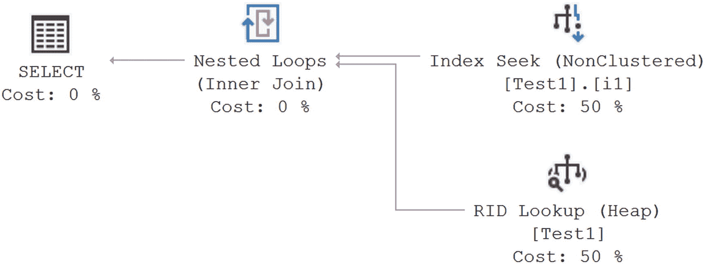
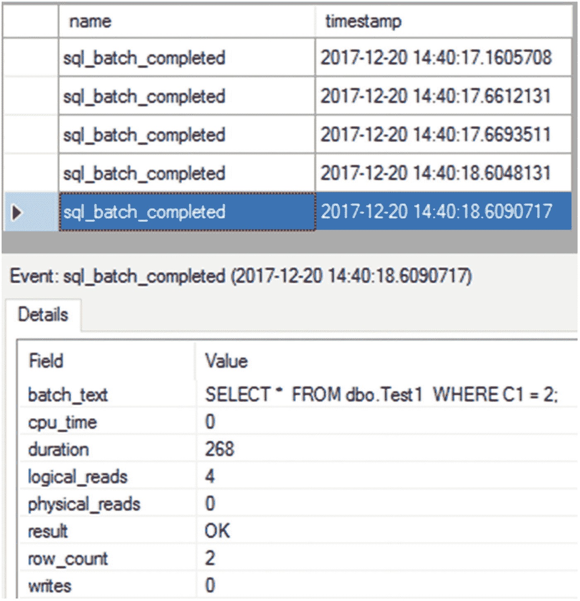
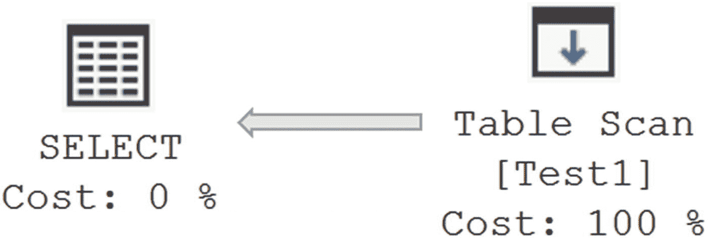
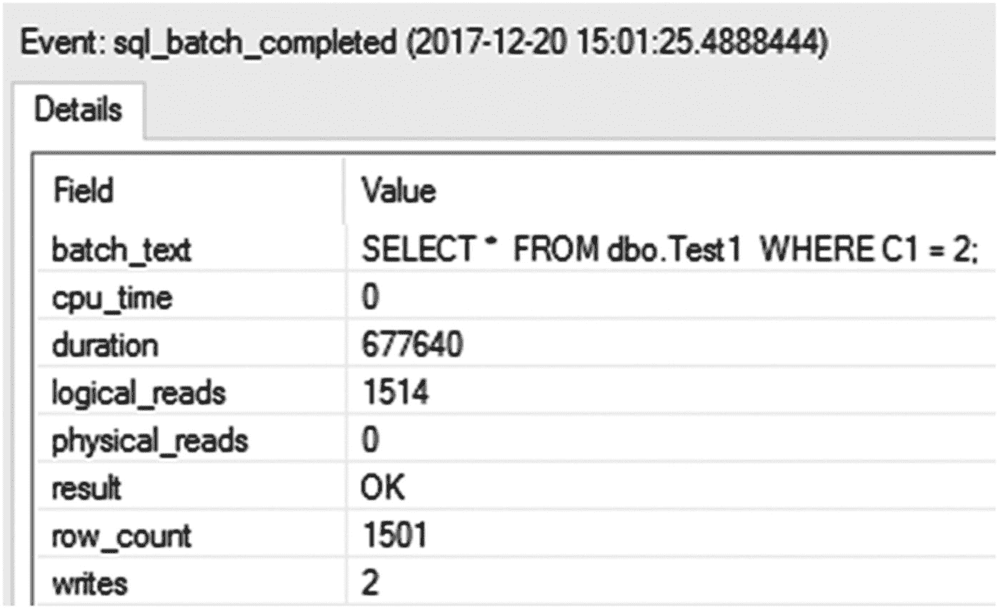
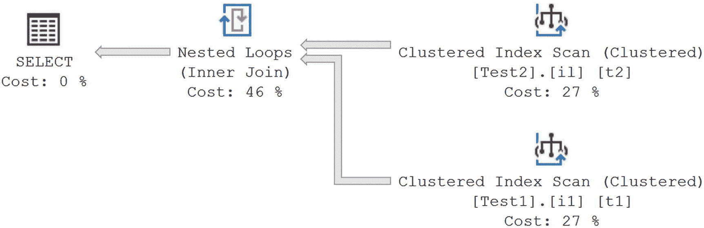
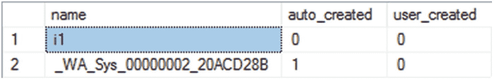

# 13. 统计信息、数据分布与基数

至此，您应该已经很好地理解了索引的重要性。然而，优化器并非仅凭索引来决定如何访问数据。它还利用强制的引用约束和其他表结构。最后，也可能是最重要的一点，优化器必须拥有定义索引或列的数据信息。该信息被称为*统计信息*。统计信息定义了数据的分布以及数据的唯一性或选择性。系统会在索引和列上维护统计信息。您甚至可以手动定义统计信息。

在本章中，您将了解统计信息在查询优化中的重要性。具体来说，我将涵盖以下主题：

*   统计信息在查询优化中的作用
*   索引列上统计信息的重要性
*   连接和过滤条件中使用的未索引列上统计信息的重要性
*   单列和多列统计信息的分析，包括计算用于索引的列的选择性
*   统计信息维护
*   有效评估查询执行中使用的统计信息

## 统计信息在查询优化中的作用

SQL Server 的查询优化器是一个基于成本的优化器；它通过识别选择性（数据的唯一程度）以及用于过滤数据的列（即通过 `WHERE`、`HAVING` 或 `JOIN` 子句）来决定最佳的数据访问机制和连接策略。统计信息会随索引自动创建，但也存在于用作谓词一部分的未索引列上。正如您在第 7 章中学到的，非聚集索引是检索被索引覆盖的数据的绝佳方式，而对于需要索引键之外列的查询，聚集索引可能效果更好。对于大型结果集，直接访问聚集索引或表通常更有益。

有关作为谓词引用的列中数据分布的最新信息，有助于优化器决定要使用的查询策略。在 SQL Server 中，这些信息以统计信息的形式维护，对于基于成本的优化器创建有效的查询执行计划至关重要。通过统计信息，优化器可以相当准确地估计返回结果集或中间结果集所需的时间，从而确定最有效的操作来高效地检索或修改 T-SQL 语句定义的数据。只要确保数据库的默认统计信息设置正确，优化器就能尽其所能地动态确定有效的处理策略。此外，在排查性能问题时，作为一项安全措施，您应确保自动统计信息维护例程按预期工作。在必要时，您甚至可能需要手动控制统计信息的创建和/或维护。（我将在“手动维护”一节中介绍这一点，并在“分析统计信息”一节中介绍统计信息的确切性质和形态。）在下一节中，我将向您展示为什么统计信息对于作为谓词的索引列和未索引列都很重要。


### 索引列的统计信息

索引的可用性在很大程度上取决于索引列的统计信息；没有统计信息，SQL Server 基于成本的查询优化器无法决定使用索引的最有效方式。为满足此要求，SQL Server 在创建索引时会自动创建索引键的统计信息。无法关闭此功能。这适用于行存储索引和列存储索引。

随着数据变化，保持低查询成本所需的数据检索机制也可能发生变化。例如，如果表中某个列值只有一个匹配行，那么通过该列的非聚集索引检索匹配行是有意义的。但如果表中的数据发生变化，添加了大量具有相同列值的行，那么使用非聚集索引可能就不再有意义。为了使 SQL Server 能够随着时间的推移在数据变化时决定处理策略的这种变更，拥有最新的统计信息至关重要。

SQL Server 可以在索引列内容被修改时，保持索引上的统计信息更新。默认情况下，此功能是开启的，并且可以通过数据库的“属性”➤“选项”➤“自动更新统计信息”设置进行配置。更新统计信息会消耗额外的 CPU 周期和相关的 I/O。为了优化更新过程，SQL Server 使用了“自动维护”部分详述的一种高效算法。

这种内置的智能特性使每个进程的 CPU 利用率保持在较低水平。也可以异步更新统计信息。这意味着当一个查询通常会触发统计信息更新时，该查询会使用旧的统计信息继续执行，而统计信息则在后台异步更新。当数据库很大或超时期限很短时，这可以加快某些查询的响应时间。如果统计信息的变化足以导致执行计划发生根本性改变，这也可能会降低性能。

你可以使用 `ALTER DATABASE` 命令手动禁用（或启用）“自动更新统计信息”和“异步自动更新统计信息”功能。默认情况下，“自动更新统计信息”功能和“自动创建”功能是启用的，强烈建议保持启用。“异步自动更新统计信息”功能默认是禁用的。只有在你确定它有助于解决由统计信息更新引起的超时或等待问题时，才开启此功能。

### 注意

我将在本章后面的“手动维护”部分解释 `ALTER DATABASE`。

### 更新统计信息的好处

对于大多数系统而言，执行自动更新的好处通常大于其对系统资源的成本。如果你有大表（我指的是单表达到数百 GB），你可能处于自动更新统计信息益处较小的情况。在这种情况下，你可能想尝试使用通过跟踪标志 2371 提供的滑动标尺，或者你可能处于自动统计信息维护效果不佳的情况。然而，这是一个极端的边缘情况，即使在这里，你可能也会发现自动更新统计信息并不会对你的系统产生负面影响。

为了更直接地控制数据行为，本系列示例将不再使用 AdventureWorks2017 中的表，而是手动创建一个。具体来说，创建一个只有三行和一个非聚集索引的测试表。

```sql
DROP TABLE IF EXISTS dbo.Test1;
GO
CREATE TABLE dbo.Test1 (C1 INT,
C2 INT IDENTITY);
SELECT TOP 1500
IDENTITY(INT, 1, 1) AS n
INTO #Nums
FROM master.dbo.syscolumns AS sC1,
master.dbo.syscolumns AS sC2;
INSERT INTO dbo.Test1 (C1)
SELECT n
FROM #Nums;
DROP TABLE #Nums;
CREATE NONCLUSTERED INDEX i1 ON dbo.Test1 (C1);
```

如果你在索引列上执行带有选择性过滤条件的 `SELECT` 语句以仅检索一行，如下面的代码行所示，那么优化器将使用非聚集索引查找，如图 13-1 所示的执行计划：



**图 13-1**
小结果集的执行计划

```sql
SELECT *
FROM dbo.Test1
WHERE C1 = 2;
```

为了理解小型数据修改对统计信息更新的影响，使用扩展事件创建一个会话。在会话中，添加捕获统计信息更新和创建事件的 `auto_stats` 事件，并添加 `sql_batch_completed`。以下是创建和启动扩展事件会话的脚本：

```sql
CREATE EVENT SESSION [Statistics]
ON SERVER
ADD EVENT sqlserver.auto_stats
(ACTION (sqlserver.sql_text)
WHERE (sqlserver.database_name = N'AdventureWorks2017')),
ADD EVENT sqlserver.sql_batch_completed
(WHERE (sqlserver.database_name = N'AdventureWorks2017'));
GO
ALTER EVENT SESSION [Statistics] ON SERVER STATE = START;
GO
```

仅向表中添加一行。

```sql
INSERT  INTO dbo.Test1
(C1)
VALUES  (2);
```

当你重新执行前面的 `SELECT` 语句时，会得到与图 13-1 所示相同的执行计划。图 13-2 显示了由 `SELECT` 查询生成的事件。



**图 13-2**
添加少量行后的会话输出

会话输出不包含任何表示统计信息更新的活动，因为变化数量低于阈值——对于超过 500 行的表，必须有 20% 的行被添加、修改或删除，或者，根据较新的行为，变化量未达到足够的比例。

为了理解大型数据修改对统计信息更新的影响，向表中添加 1,500 行。

```sql
SELECT TOP 1500
IDENTITY(INT, 1, 1) AS n
INTO #Nums
FROM master.dbo.syscolumns AS scl,
master.dbo.syscolumns AS sC2;
INSERT INTO dbo.Test1 (C1)
SELECT 2
FROM #Nums;
DROP TABLE #Nums;
```

现在，如果你像下面这样重新执行 `SELECT` 语句，将检索到一个大的结果集（3,001 行中的 1,502 行）：

```sql
SELECT  *
FROM    dbo.Test1
WHERE   C1 = 2;
```


由于请求的是大型结果集，直接扫描基表比通过非聚集索引访问基表 1,502 次更为可取。直接访问基表将避免与该非聚集索引相关联的书签查找开销。这体现在最终的执行计划中（见图 13-3）。


*图 13-3：大型结果集的执行计划*

图 13-4 显示了最终的会话输出。


*图 13-4：添加大量行后的会话输出*

由于此次大规模更新超过了阈值，会话输出中包含了多个`auto_stats`事件。你可以通过查看详细信息来判断每个事件正在做什么。图 13-4 显示了`job_type`值，在本例中为`StatsUpdate`。你还会看到`statistics_list`列中列出了正在更新的统计信息。另一个值得关注的点是“状态”列，它可以告诉你更多关于统计信息更新过程中哪个部分正在发生的信息，在本例中是“Loading and update stats”。图 13-4 中可见的第二个`auto_stats`事件显示`statistics_list`值为“Updated: dbo.Test1.i1”，表明更新过程已完成。然后你可以看到紧接着该`auto_stats`事件之后，查询本身的`sql_batch_completed`事件。这些活动消耗了一些额外的 CPU 周期来使统计信息保持最新。然而，通过这样做，优化器确定了一个更好的数据处理策略，并保持了查询的总体成本较低。由此产生的向更高效执行计划的转变，即图 13-3 中的`Table Scan`操作，就是为什么自动更新统计信息如此理想的原因。这也说明了异步更新统计信息可能会潜在地导致问题，因为查询本将使用旧的、效率较低的执行计划执行。

## 过时统计信息的缺点

如前一节所述，自动更新统计信息功能允许优化器随着数据的变化为查询决定高效的处理策略。然而，如果统计信息变得过时，那么优化器决定的处理策略可能不适用于当前的数据集，从而会降低性能。

要理解拥有过时统计信息的有害影响，请按照以下步骤操作：

1.  仅使用 1,500 行重新创建前面的测试表以及相应的非聚集索引。

2.  防止 SQL Server 在数据更改时自动更新统计信息。为此，通过执行以下 SQL 语句禁用自动更新统计信息功能：
    ```
    ALTER DATABASE AdventureWorks2017 SET AUTO_UPDATE_STATISTICS OFF;
    ```

3.  像之前一样向表中添加 1,500 行。

现在，重新执行`SELECT`语句以了解过时统计信息对查询优化器的影响。为清晰起见，该查询在此重复：
```
SELECT *
FROM dbo.Test1
WHERE C1 = 2;
```

图 13-5 和图 13-6 分别显示了此查询的最终执行计划和会话输出。


*图 13-6：AUTO_UPDATE_STATISTICS OFF 时的会话输出详情*


*图 13-5：AUTO_UPDATE_STATISTICS OFF 时的执行计划*

在自动更新统计信息功能关闭的情况下，查询优化器选择了与开启此功能时不同的执行计划。基于过时的统计信息（其中过滤条件`C1 = 2`只有一行），优化器决定使用非聚集索引查找。优化器无法根据列中当前的数据分布做出决策。出于性能考虑，由于请求的是大型结果集（3,000 行中的 1,501 行），直接访问基表而不是通过非聚集索引会更好。

通过比较此查询在更新和未更新统计信息情况下的成本，你可以看到关闭自动更新统计信息功能对性能有负面影响。表 13-1 显示了此查询成本的差异。

*表 13-1：统计信息更新与未更新时的查询成本*

| 统计信息更新状态 | 图例 | 持续时间（毫秒） | 读取次数 |
| :--- | :--- | :--- | :--- |
| 已更新 | 图 13-4 | 171 | 9 |
| 未更新 | 图 13-6 | 678 | 1510 |

当统计信息过时时，即使返回的数据完全相同且查询完全一致，读取次数和持续时间也显著更高。因此，建议你保持自动更新统计信息功能开启。保持统计信息更新的好处通常超过执行更新的成本。在结束本节之前，请将`AUTO_UPDATE_STATISTICS`重新打开（尽管你也可以选择手动更新统计信息）。
```
ALTER DATABASE AdventureWorks2017 SET AUTO_UPDATE_STATISTICS ON;
```

## 非索引列上的统计信息

有时，你可能在连接或过滤条件中拥有没有任何索引的列。即使对于此类非索引列，如果查询优化器知道这些列的基数和数据分布（即*统计信息*），它也更有可能做出更好的选择。基数是集合中的对象数量，在本例中是行数。数据分布是指我们正在处理的数据整体集的唯一性程度。

除了索引上的统计信息外，SQL Server 还可以在没有索引的列上构建统计信息。有关数据分布的信息，或者说某个特定值出现在非索引列中的可能性，可以帮助查询优化器确定最优的处理策略。即使它无法使用索引实际定位值，这对查询优化器也有益。如果 SQL Server 认为这些信息对于创建更好的计划有价值（通常在列用于谓词中时），它会自动在非索引列上构建统计信息。默认情况下，此功能是开启的，并且可以通过数据库的属性 ➤ 选项 ➤ 自动创建统计信息设置进行配置。你可以使用`ALTER DATABASE`命令以编程方式覆盖此设置。但是，为了获得更好的性能，强烈建议你保持此功能开启。

你可能考虑禁用此功能的场景之一是在执行一系列你永远不会再执行的即席 T-SQL 活动时。另一种情况是当你确定一个静态、稳定但可能不够充分的统计信息集比最佳可能的统计信息集效果更好，但它们可能由于数据分布的变化而导致性能不均匀。即使在这种情况下，你也应该测试一下，在这种特定情况下支付自动创建统计信息的成本以获得更好的计划，是否比影响其他 SQL Server 活动的性能更划算。对于大多数系统，你应该保持此功能开启，除非你看到统计信息创建明显导致性能问题的证据，否则无需担心。


### 在非索引列上统计信息的优势

要理解对没有索引的列拥有统计信息的好处，可以创建两个数据分布不均的测试表，如下面的代码所示。两个表都包含 10,001 行。表 `Test1` 只有一行，其第二列 (`Test1_C2`) 的值等于 1，而其余 10,000 行中，该列的值均为 2。表 `Test2` 的数据分布则恰好相反。

```sql
IF (SELECT OBJECT_ID('dbo.Test1')) IS NOT NULL
DROP TABLE dbo.Test1;
GO
CREATE TABLE dbo.Test1 (Test1_C1 INT IDENTITY,
Test1_C2 INT);
INSERT INTO dbo.Test1 (Test1_C2)
VALUES (1);
SELECT TOP 10000
IDENTITY(INT, 1, 1) AS n
INTO #Nums
FROM master.dbo.syscolumns AS scl,
master.dbo.syscolumns AS sC2;
INSERT INTO dbo.Test1 (Test1_C2)
SELECT 2
FROM #Nums
GO
CREATE CLUSTERED INDEX i1 ON dbo.Test1 (Test1_C1)
--创建第二个包含 10001 行的表，但数据分布相反
IF (SELECT OBJECT_ID('dbo.Test2')) IS NOT NULL
DROP TABLE dbo.Test2;
GO
CREATE TABLE dbo.Test2 (Test2_C1 INT IDENTITY,
Test2_C2 INT);
INSERT INTO dbo.Test2 (Test2_C2)
VALUES (2);
INSERT INTO dbo.Test2 (Test2_C2)
SELECT 1
FROM #Nums;
DROP TABLE #Nums;
GO
CREATE CLUSTERED INDEX il ON dbo.Test2 (Test2_C1);
```

表 13-2 展示了这些表的样子。

**表 13-2** 示例表

| | 表 Test1 | 表 Test2 |
| --- | --- | --- |
| **列** | `Test1_c1` | `Test1_C2` | `Test2_c1` | `Test2_C2` |
| `Row1` | 1 | 1 | 1 | 2 |
| `Row2` | 2 | 2 | 2 | 1 |
| `RowN` | N | 2 | N | 1 |
| `Rowl000l` | 10001 | 2 | 10001 | 1 |

要理解在非索引列上拥有统计信息的重要性，请使用自动创建统计信息功能的默认设置。默认情况下，此功能是开启的。你可以使用 `DATABASEPROPERTYEX` 函数来验证这一点（尽管你也可以查询 `sys.databases` 视图）。

```sql
SELECT DATABASEPROPERTYEX('AdventureWorks2017',
'IsAutoCreateStatistics');
```

### 注意

本章稍后将详细介绍如何配置自动创建统计信息功能。

使用以下 `SELECT` 语句从表 `Test1` 访问大型结果集，从表 `Test2` 访问小型结果集。表 `Test1` 有 10,000 行的 `Test1_C2 = 2`，而表 `Test2` 只有 1 行的 `Test2_C2 = 2`。请注意，这些用于连接和筛选条件中的列在任何一个表上都没有索引。

```sql
SELECT t1.Test1_C2,
t2.Test2_C2
FROM dbo.Test1 AS t1
JOIN dbo.Test2 AS t2
ON t1.Test1_C2 = t2.Test2_C2
WHERE t1.Test1_C2 = 2;
```

图 13-7 显示了此查询的实际执行计划。



**图 13-7** `AUTO_CREATE_STATISTICS` 开启时的执行计划

图 13-8 显示了由此查询引发的 `auto_stats` 事件的会话输出。你可以使用它来评估给定查询的一些额外开销。


**图 13-8** `AUTO_CREATE_STATISTICS` 开启时的扩展事件会话输出

图 13-8 中显示的会话输出包括四个 `auto_stats` 事件，它们在 `JOIN` 和 `WHERE` 子句中引用的非索引列 `Test2_C2` 和 `Test1_C2` 上创建统计信息，然后加载这些统计信息以供优化器内部使用。此活动消耗了额外的少量 CPU 周期（因为无法检测到统计信息），并花费了大约 20,000 微秒 (mc)，即 20 毫秒。然而，通过消耗这些额外的 CPU 周期，优化器决定采用更好的处理策略，以保持查询的整体成本较低。

要验证 SQL Server 在每个表的非索引列上自动创建的统计信息，可以针对 `sys.stats` 表运行此 `SELECT` 语句。

```sql
SELECT s.name,
s.auto_created,
s.user_created
FROM sys.stats AS s
WHERE object_id = OBJECT_ID('Test1');
```

图 13-9 显示了为表 `Test1` 自动创建的统计信息。



**图 13-9** 表 `Test1` 的自动统计信息

名为 `_WA_SYS*` 的统计信息是系统生成的列统计信息。这可以通过统计信息的名称以及 `auto_created` 值来判断，此例中该值为 1，而索引 `i1` 的该值为 0。这很有趣，因为为索引创建的统计信息也是自动创建的，但它们不被视为 `AUTO_CREATE_STATISTICS` 过程的一部分，因为索引上的统计信息始终会被创建。

要验证来自两个表的不同结果集大小如何影响查询优化器的决策，修改查询的筛选条件，以便从两个表中访问相反的结果集大小（`Test1` 为小，`Test2` 为大）。将筛选条件从 `Test1.Test1_C2 = 2` 改为筛选 1。

```sql
SELECT t1.Test1_C2,
t2.Test2_C2
FROM dbo.Test1 AS t1
JOIN dbo.Test2 AS t2
ON t1.Test1_C2 = t2.Test2_C2
WHERE t1.Test1_C2 = 1;
```

图 13-10 显示了生成的执行计划，图 13-11 显示了此查询的扩展事件会话输出。


**图 13-11** 不同结果集的扩展事件输出


**图 13-10** 不同结果集的执行计划


