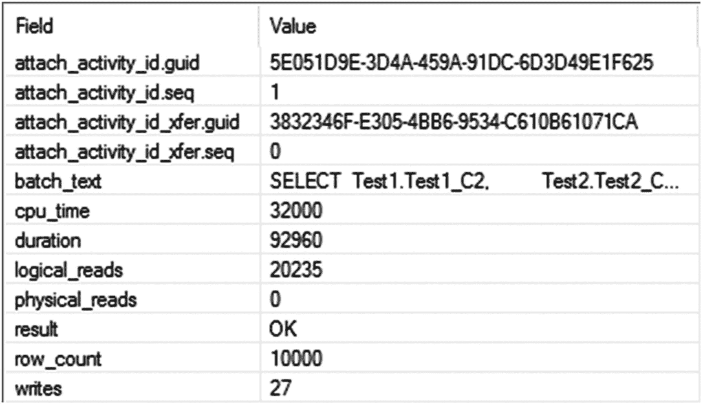
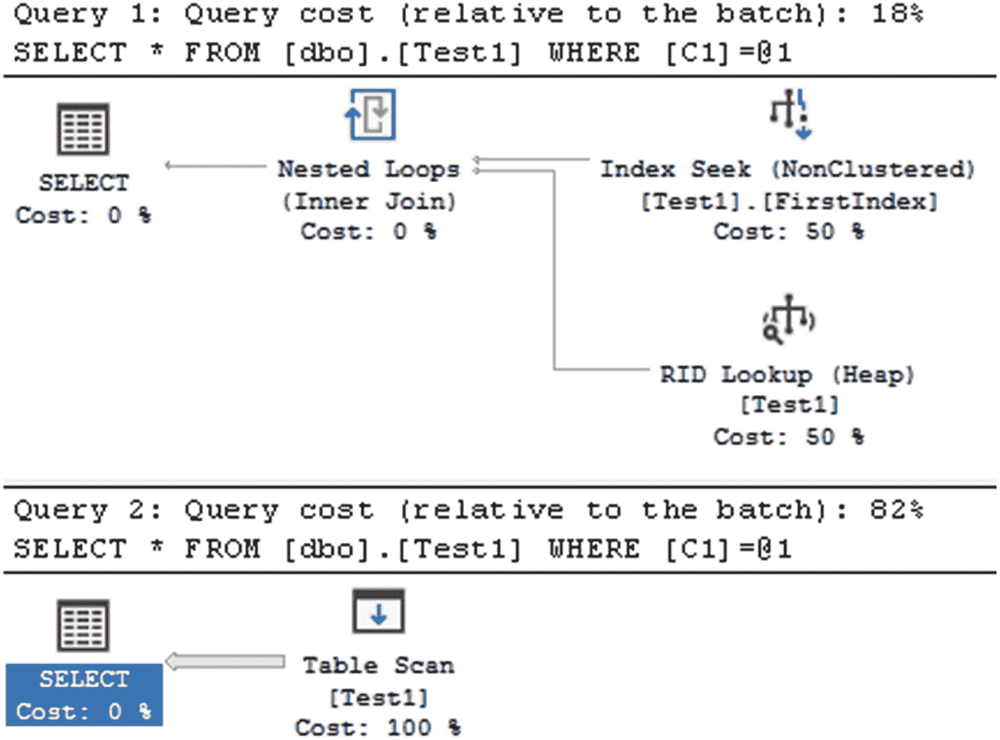
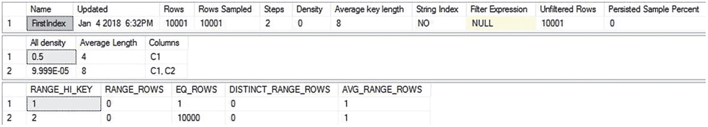
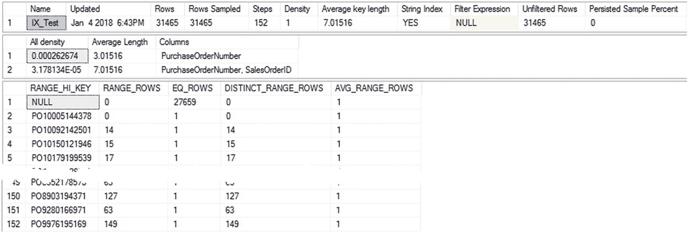
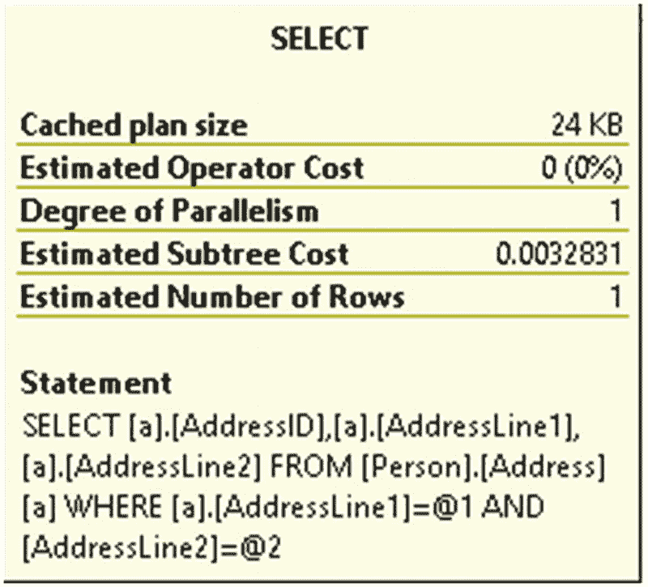
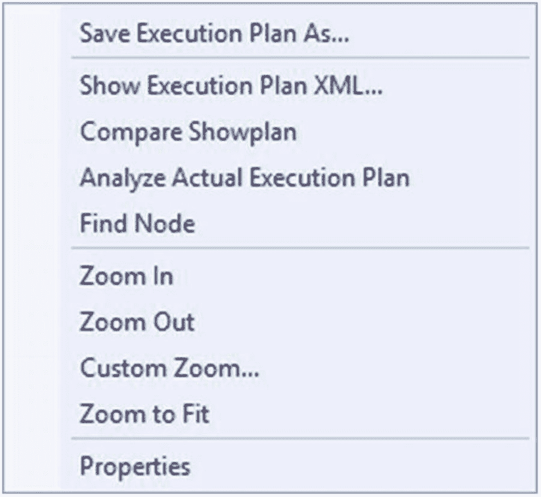
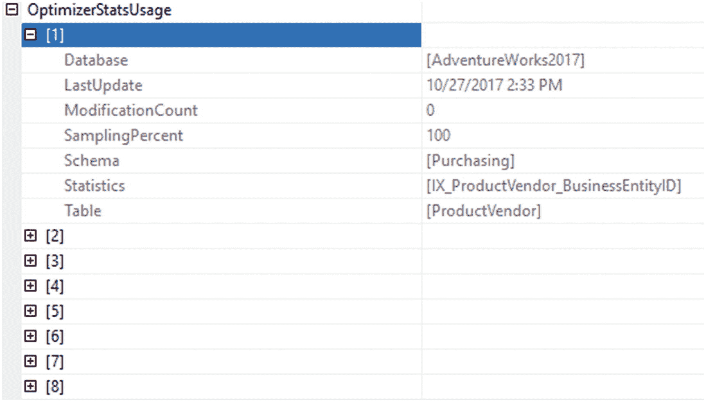
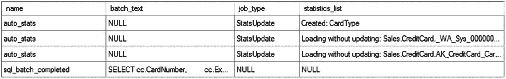
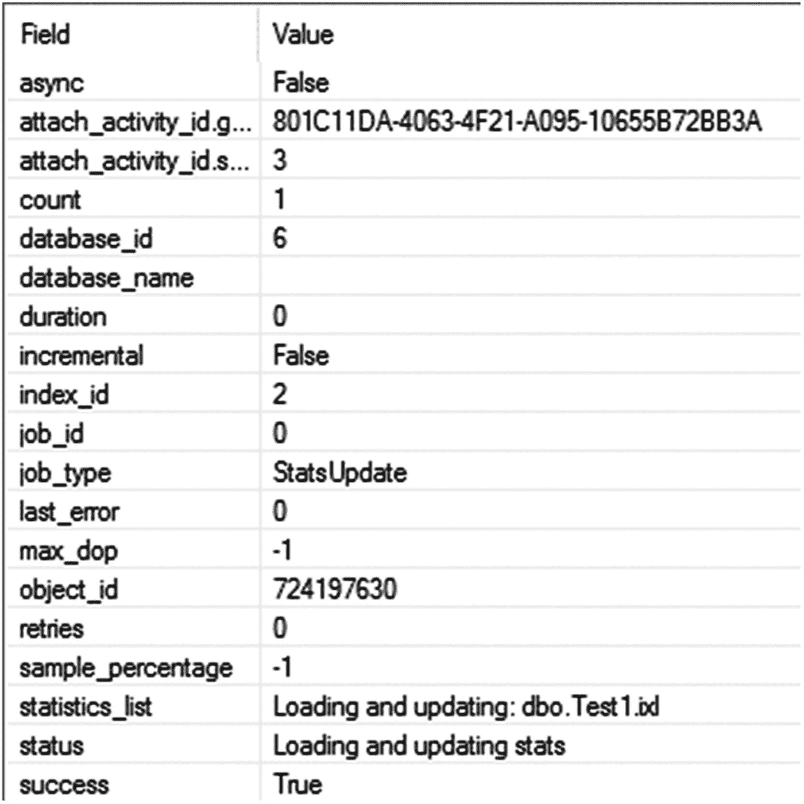
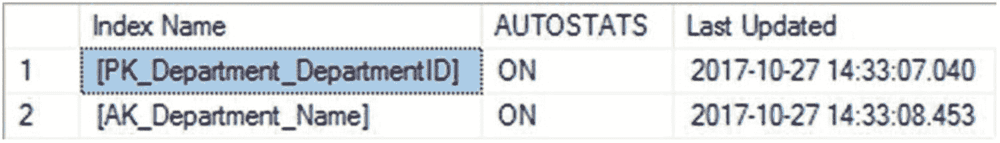

# SQL Server 非索引列统计信息的作用与影响

生成的会话输出没有执行任何额外的 SQL 活动来管理统计信息。非索引列（`Test1.Test1_C2` 和 `Test2.Test2_C2`）上的统计信息在创建索引本身时就已创建，并随着数据的变更而更新。

为了实现有效的成本优化，查询优化器在每种情况下都选择了不同的处理策略，这取决于非索引列（`Test1.Test1_C2` 和 `Test2.Test2_C2`）上的统计信息。你可以从之前的两个执行计划中看到这一点。在第一个计划中，表 `Test1Test1` 是嵌套循环连接的外表；而在最新的计划中，表 `Test2` 是外表。通过在非索引列（`Test1.Test1_C2` 和 `Test2.Test2_C2`）上拥有统计信息，查询优化器可以为每种情况创建一个经济高效的执行计划。

一个更好的解决方案是在该列上创建索引。这不仅会创建该列的统计信息，还能通过 `Index Seek` 操作快速检索数据，尤其是在检索的结果集较小时。然而，对于那些查询在 `WHERE` 子句中引用了非索引列的数据库应用程序，保持自动创建统计信息功能开启仍然允许优化器根据列中现有的数据分布确定最佳的处理策略。

如果你想了解某个统计信息覆盖了哪个（或哪些）列，需要查看 `sys.stats_columns` 系统表。你可以像查询 `sys.stats` 表一样查询它。

```sql
SELECT  *
FROM    sys.stats_columns
WHERE   object_id = OBJECT_ID('Test1');
```

这将显示由自动创建的统计信息所引用的列。如果你决定需要创建索引来替代这些统计信息，这些信息可以提供帮助，因为你需要知道在哪些列上创建索引。这里列出的列是表中列的序号位置。要查看列名，你需要修改查询。

```sql
SELECT c.name,
sc.object_id,
sc.stats_column_id,
sc.stats_id
FROM sys.stats_columns AS sc
JOIN sys.columns AS c
ON c.object_id = sc.object_id
AND c.column_id = sc.column_id
WHERE sc.object_id = OBJECT_ID('Test1');
```

### 非索引列缺少统计信息的弊端

要理解非索引列上没有统计信息的有害影响，请按照以下步骤删除 SQL Server 自动创建的统计信息，并阻止 SQL Server 在没有索引的列上自动创建统计信息：

1.  使用以下 SQL 命令删除列 `Test1.Test1_C2` 上自动创建的统计信息，将系统自动赋予的统计信息名称替换以下语句中的 `StatisticsName`：
    ```sql
    DROP STATISTICS [Test1].StatisticsName;
    ```

2.  同样地，删除列 `Test2.Test2_C2` 上对应的统计信息。

3.  通过取消选中相应数据库的“自动创建统计信息”复选框，或执行以下 SQL 命令，禁用自动创建统计信息功能：
    ```sql
    ALTER DATABASE AdventureWorks2017 SET AUTO_CREATE_STATISTICS OFF;
    ```

现在重新执行 `SELECT` 语句 `--nonindexed_select`。

```sql
SELECT  Test1.Test1_C2,
        Test2.Test2_C2
FROM    dbo.Test1
JOIN    dbo.Test2
        ON Test1.Test1_C2 = Test2.Test2_C2
WHERE   Test1.Test1_C2 = 2;
```

图 13-12 和 图 13-13 分别显示了生成的执行计划和扩展事件输出。



图 13-13：`AUTO_CREATE_STATISTICS OFF` 时的跟踪输出


图 13-12：`AUTO_CREATE_STATISTICS OFF` 时的执行计划

当自动创建统计信息功能关闭时，查询优化器选择的执行计划与开启该功能时选择的计划不同。在未找到相关列上的统计信息后，优化器选择 `FROM` 子句中的第一个表（`Test1`）作为嵌套循环连接操作的外表。优化器无法根据列中实际的数据分布做出决策。你可以在执行计划中看到警告（一个感叹号），它指示在数据访问运算符（聚集索引扫描）上缺少统计信息。如果你修改查询，将表 `Test2` 引用为 `FROM` 子句中的第一个表，那么优化器会选择表 `Test2` 作为嵌套循环连接操作的外表。图 13-14 显示了执行计划。


图 13-14：`AUTO_CREATE_STATISTICS OFF` 时的执行计划（一个变体）

```sql
SELECT  Test1.Test1_C2,
        Test2.Test2_C2
FROM    dbo.Test2
JOIN    dbo.Test1
        ON Test1.Test1_C2 = Test2.Test2_C2
WHERE   Test1.Test1_C2 = 2;
```

通过比较有和没有非索引列统计信息时此查询的成本，你可以看到关闭自动创建统计信息功能会对性能产生负面影响。表 13-3 显示了此查询在有无统计信息情况下的成本差异。

表 13-3：有统计信息与无统计信息的非索引列上的查询成本比较

| 非索引列上的统计信息 | 图号 | 成本 |   |
| :--- | :--- | :--- | :--- |
|   |   | 平均持续时间（毫秒） | 读取次数 |
| 有统计信息 | 图 13-11 | 98 | 48 |
| 无统计信息 | 图 13-13 | 262 | 20273 |

当非索引列上没有统计信息时，逻辑读取次数和 CPU 利用率更高。没有这些统计信息，优化器无法创建经济高效的执行计划，因为它实际上必须通过一组内置的启发式计算来猜测选择性。

查询执行计划通过在原本会使用统计信息的运算符上放置一个感叹号来突出显示缺少的统计信息。你可以在之前的执行计划（图 13-12 和 图 13-14）中的聚集索引扫描运算符上看到这一点，也可以在图形执行计划节点的属性“警告”部分的详细描述中看到，如图 13-15 中表 `Test1` 的示例所示。


图 13-15：图形计划中的缺少统计信息指示


### 注意事项

在数据库应用程序中，使用没有索引的列进行查询的可能性总是存在的。因此，在大多数系统中，出于性能考虑，强烈建议保持 SQL Server 数据库的自动创建统计信息功能处于开启状态。

你可以查询缓存中的执行计划，以识别那些可能存在统计信息缺失的计划。

```sql
SELECT dest.text AS query,
deqs.execution_count,
deqp.query_plan
FROM sys.dm_exec_query_stats AS deqs
CROSS APPLY sys.dm_exec_text_query_plan(deqs.plan_handle,
deqs.statement_start_offset,
deqs.statement_end_offset) AS detqp
CROSS APPLY sys.dm_exec_query_plan(deqs.plan_handle) AS deqp
CROSS APPLY sys.dm_exec_sql_text(deqs.sql_handle) AS dest
WHERE detqp.query_plan LIKE '%ColumnsWithNoStatistics%';
```

这个查询稍微有些取巧。我在 `LIKE` 运算符的变量两侧都使用了通配符，这实际上是一个常见的代码问题（在第 20 章有更详细的讨论），但在这种情况下，另一种选择是运行 XQuery，这需要加载 XML 解析器。根据系统可用内存量的不同，这种通配符搜索方法可能比直接查询执行计划的 XML 要快得多。查询调优不仅仅是使用单一方法，而是要理解所有这些方法如何协同工作。

如果你处于需要禁用自动创建统计信息的情况，你可能仍然希望追踪统计信息在哪些地方可能对你的查询有用。你可以使用扩展事件 `missing_column_statistics` 事件来捕获该信息。对于前面的例子，你可以在图 13-16 中看到此事件输出的示例。


图 13-16

`missing_column_statistics` 扩展事件的输出

`column_list` 将显示哪些列没有统计信息。然后，你可以决定是否要创建自己的统计信息以使相关查询受益。

在继续之前，请确保将自动创建统计信息功能重新打开。

```sql
ALTER DATABASE AdventureWorks2017 SET AUTO_CREATE_STATISTICS ON;
```

## 分析统计信息

统计信息是在三组数据中定义的信息集合：标头、密度图和直方图。其中最常用的数据集之一是直方图。*直方图*是一种统计结构，用于显示数据落入不同类别（称为*步骤*）的频率。SQL Server 存储的直方图由对列或索引键（或多列索引键的第一列）数据分布的采样组成，最多包含 200 行。两个连续采样之间的索引键值范围信息构成一个*步骤*。这些步骤由存储的 200 个值之间大小不一的区间组成。一个步骤提供以下信息：

*   给定步骤的最高值 (`RANGE_HI_KEY`)
*   等于 `RANGE_HI_KEY` 的行数 (`EQ_ROWS`)
*   介于前一个最高值和当前最高值之间的行数（不计算这两个边界点）(`RANGE_ROWS`)
*   范围内的不同值数量 (`DISTINCT_RANGE_ROWS`)；如果范围内的所有值都是唯一的，则 `RANGE_ROWS` 等于 `DISTINCT_RANGE_ROWS`
*   范围内任何潜在键值的平均行数 (`AVG_RANGE_ROWS`)

例如，在引用索引时，直方图中步骤内键值的 `AVG_RANGE_ROWS` 值有助于优化器决定在 `WHERE` 子句中引用索引列时如何（以及是否）使用该索引。由于优化器可以执行 `SEEK` 或 `SCAN` 操作从表中检索行，因此优化器可以根据索引键值的潜在匹配行数来决定执行哪个操作。当引用 `RANGE_HI_KEY` 时，这甚至可以更精确，因为优化器可以知道它应该从该值中找到相当精确的行数（假设统计信息是最新的）。

为了理解优化器的数据检索策略如何依赖于匹配行的数量，可以在索引列上创建具有不同数据分布的测试表。

```sql
IF (SELECT  OBJECT_ID('dbo.Test1')
) IS NOT NULL
DROP TABLE dbo.Test1 ;
GO
CREATE TABLE dbo.Test1 (C1 INT, C2 INT IDENTITY) ;
INSERT  INTO dbo.Test1
(C1)
VALUES  (1) ;
SELECT TOP 10000
IDENTITY( INT,1,1 ) AS n
INTO    #Nums
FROM    Master.dbo.SysColumns sc1,
Master.dbo.SysColumns sc2 ;
INSERT  INTO dbo.Test1
(C1)
SELECT  2
FROM    #Nums ;
DROP TABLE #Nums;
CREATE NONCLUSTERED INDEX FirstIndex ON dbo.Test1 (C1) ;
```

当创建上述非聚集索引时，SQL Server 会自动在索引键上创建统计信息。你可以通过执行 `DBCC SHOW_STATISTICS` 命令来获取此非聚集索引 (`FirstIndex`) 的统计信息。

```sql
DBCC SHOW_STATISTICS(Test1, FirstIndex);
```

图 13-17 显示了统计信息输出。


图 13-17

索引 `FirstIndex` 上的统计信息

现在，为了理解优化器如何根据统计信息有效地决定不同的数据检索策略，请执行以下两个查询，它们请求不同数量的行：

```sql
--Retrieve 1 row;
SELECT  *
FROM    dbo.Test1
WHERE   C1 = 1;
--Retrieve 10000 rows;
SELECT  *
FROM    dbo.Test1
WHERE   C1 = 2;
```

图 13-18 显示了这些查询的执行计划。



图 13-18

小结果集和大结果集查询的执行计划

根据统计信息，优化器可以找到上述两个查询所需的行数。了解到第一个查询只有一行需要检索，优化器选择了 `Index Seek` 操作，然后进行必要的 `RID Lookup` 以检索未与聚集索引存储在一起的数据。对于第二个查询，优化器知道将影响大量行（10,000 行），因此避免使用索引以试图提高性能。（第 8 章详细解释了索引策略。）

除了直方图中包含的信息外，标头还包含其他有用信息，包括：

*   统计信息上次更新的时间
*   表中的行数
*   平均索引键长度
*   为直方图采样的行数
*   列组合的密度

上次更新时间的信息可以帮助你决定是否应手动更新统计信息。平均键长代表索引键列中数据的平均大小。它有助于你理解索引键的宽度，这是确定索引有效性的一个重要度量。如第 6 章所述，宽索引的维护成本可能很高，并且需要更多的磁盘空间和内存页，但如下一节所述，它可以使索引具有极高的选择性。


### 密度

在创建执行计划时，查询优化器会分析过滤条件和 `JOIN` 子句中使用的列的统计信息。具有高选择性的过滤条件会将来自表的行数限制在一个小的结果集中，并有助于优化器保持较低的查询成本。具有唯一索引的列将具有高选择性，因为它可以将匹配的行数限制为一。

另一方面，具有低选择性的过滤条件将从表中返回一个大的结果集。低选择性的过滤条件可能会使该列上的非聚集索引失效。对于一个大结果集，通过非聚集索引导航到基表通常比直接扫描基表（或聚集索引）成本更高，因为这涉及与非聚集索引关联的查找操作开销。你可以在图 13-18 中的第一个执行计划中观察到这种行为。

统计信息以密度比率的形式跟踪列的选择性。具有高选择性（或唯一性）的列将具有低密度。具有低密度（即高选择性）的列适合作为过滤条件，因为它可以帮助优化器非常快速地检索少量行。这也是筛选索引的工作原理，因为筛选的目标是提高索引的选择性或密度。

密度可以表示如下：

```
Density = 1 / 列中不同值的数量
```

密度的结果总是在 0 到 1 之间的某个数字。列的密度越低，它就越适合作为索引键。你可以进行自己的计算来确定索引和统计信息中列的密度。例如，要计算由前一个脚本构建的测试表中的列 `C1` 的密度，请使用以下语句（结果如图 13-19 所示）：


图 13-19
列 C1 的密度计算结果

```
SELECT 1.0 / COUNT(DISTINCT C1)
FROM dbo.Test1;
```

你可以在 `DBCC SHOW_STATISTICS` 输出的 `All density` 列中看到这个实际数据。列的高密度值使其不太适合作为索引候选，即使是筛选索引也是如此。然而，在步骤中维护的索引键值的统计信息有助于查询优化器将该索引用于谓词 `C1 = 1`，如前面的执行计划所示。

### 多列索引的统计信息

对于单列索引，统计信息包含该列的直方图和一个密度值。对于具有多列的复合索引，统计信息仅包含第一列的一个直方图和多个密度值。这就是为什么在构建复合索引或复合统计信息时，通常将选择性更高的列（即密度最低的列）放在前面是一个好的做法。密度值包括第一列的密度以及索引键列的每个额外组合的密度。多个密度值有助于优化器在 `WHERE`、`HAVING` 和 `JOIN` 子句中的谓词引用多个列时，找到复合索引的选择性。虽然第一列有助于确定直方图，但无论列的顺序如何，列本身的最终密度都是相同的。

多列密度图可以来自索引键中的多列，也可以来自手动创建的统计信息。但是，你永远不会看到由自动统计信息创建过程创建的多列统计信息，以及随之而来的密度图。让我们看一个简单的例子。下面是一个查询，它很容易从包含两列的统计信息集中受益：

```
SELECT  p.Name,
        p.Class
FROM    Production.Product AS p
WHERE   p.Color = 'Red' AND
        p.DaysToManufacture > 15;
```

在列 `p.Color` 和 `p.DaysToManufacture` 上创建的索引将具有一个多列密度值。在运行这个查询之前，这里有一个可以让你查看给定表上统计信息基本构成的查询：

```
SELECT  s.name,
        s.auto_created,
        s.user_created,
        s.filter_definition,
        sc.column_id,
        c.name AS ColumnName
FROM    sys.stats AS s
        JOIN sys.stats_columns AS sc
            ON  sc.stats_id = s.stats_id
            AND sc.object_id = s.object_id
        JOIN sys.columns AS c
            ON  c.column_id = sc.column_id
            AND c.object_id = s.object_id
WHERE   s.object_id = OBJECT_ID('Production.Product');
```

对 `Production.Product` 表运行此查询的结果如图 13-20 所示。


图 13-20
Product 表的统计信息列表

你可以看到表上的索引，每个索引都由单列组成。现在我将运行那个可能受益于多列密度图的查询。但是，与其尝试通过 `SHOWSTATISTICS` 追踪统计信息，我将再次查询系统表。结果如图 13-21 所示。


图 13-21
Product 表中已添加两个新的统计信息

如你所见，系统没有添加一个包含多列的统计信息，而是创建了两个新的统计信息。只有在具有多列索引键或使用手动创建的统计信息时，你才会获得多列统计信息。

为了更好地理解为多列索引维护的密度值，你可以修改之前使用的非聚集索引以包含两列。

```
CREATE NONCLUSTERED INDEX FirstIndex
ON dbo.Test1
(
    C1,
    C2
)
WITH (DROP_EXISTING = ON);
```

图 13-22 显示了由 `DBCC SHOWSTATISTICS` 提供的统计信息结果。



图 13-22
多列索引 FirstIndex 上的统计信息

如你所见，`All density` 列下有两个密度值。

*   第一列的密度
*   （第一列 + 第二列）组合的密度

对于具有三列的多列索引，索引的统计信息还将包含（第一列 + 第二列 + 第三列）组合的密度值。直方图不会包含任何其他列组合的选择性值。因此，这个索引 (`FirstIndex`) 对于仅基于第二列 (`C2`) 过滤行不是很有用，因为第二列 (`C2`) 单独的值并未维护在直方图中，并且它本身也不是密度图的一部分。

你可以通过以下步骤计算图 13-19 中显示的第二个密度值 (0.000099990000)。这是列组合 (`C1`, `C2`) 的不同值的数量。

```
SELECT 1.0 / COUNT(*)
FROM
    (SELECT DISTINCT C1, C2 FROM dbo.Test1) AS DistinctRows;
```


## 筛选索引上的统计信息

筛选索引的目的是限制构成索引的数据，从而改变密度和直方图，使索引性能更佳。本例将不使用测试表，而是使用 `AdventureWorks2017` 数据库中的一个表。在 `Sales.PurchaseOrderHeader` 表的 `PurchaseOrderNumber` 列上创建一个索引。

```sql
CREATE INDEX IX_Test ON Sales.SalesOrderHeader (PurchaseOrderNumber);
```

图 13-23 显示了针对此新索引运行 `DBCC SHOWSTATISTICS` 输出的头部信息和密度。



图 13-23：未筛选索引的统计信息头部

```sql
DBCC SHOW_STATISTICS ('Sales.SalesOrderHeader',IX_Test);
```

如果重新创建相同的索引以处理列值不为 `null` 的情况，它看起来会像这样：

```sql
CREATE INDEX IX_Test
ON Sales.SalesOrderHeader
(
PurchaseOrderNumber
)
WHERE PurchaseOrderNumber IS NOT NULL
WITH (DROP_EXISTING = ON);
```

现在，在图 13-24 中，来看一下统计信息。


图 13-24：筛选索引的统计信息头部

首先可以看到，由于应用了筛选器，构成统计信息的行数在筛选索引中急剧下降，从 `31465` 降至 `3806`。还要注意，由于不再处理零长度字符串，平均键长增加了。这里定义了一个筛选表达式，而不是图 13-23 中可见的 `NULL` 值。但两组数据中的未筛选行是相同的。

密度测量值很有趣。注意两者的密度值接近，但筛选后的密度略低，这意味着唯一值更少。这是因为筛选后的数据虽然选择性稍低，但实际上更准确，消除了所有不会对搜索产生贡献的空值。第二个值的密度（代表聚集索引指针）与单独 `PurchaseOrderNumber` 的密度值相同，因为每个都代表相同数量的唯一数据。前一列中额外聚集索引的密度是一个小得多的数字，这是因为所有 `SalesOrderld` 的唯一值由于消除了 `NULL` 值而未包含在筛选数据中。你还可以在图 13-23 中看到直方图的第一列显示 `NULL` 值，而在图 13-24 中则有一个值。

另一个可用的选项是创建筛选统计信息。这允许你创建更精细调整的直方图。这在分区表上尤其有用。这是必要的，因为统计信息不会在分区表上自动创建，而且你无法使用 `CREATE STATISTICS` 创建自己的统计信息。你可以按分区创建筛选索引并获取统计信息，或者专门按分区创建筛选统计信息。

在继续之前，清理已创建的索引（如果有）。

```sql
DROP INDEX Sales.SalesOrderHeader.IX_Test;
```

## 基数

统计信息（包括直方图和密度）被查询优化器用来计算查询执行过程中每个操作预计涉及的行数。这个用于确定返回行数的计算称为*基数估计*。基数代表一组数据中的行数，这意味着它与 SQL Server 中的密度度量直接相关。从 SQL Server 2014 开始，启用了一个不同的基数估计器。这是自 SQL Server 7.0 以来核心基数估计过程的首次变更。对估计器某些领域的更改意味着优化器以与之前相同的方式读取统计信息，但优化器会根据已修改的基数计算，采用不同类型的计算来确定执行计划中每个操作将处理的行数。

在我们讨论细节之前，先看看实际效果。首先，我们将更改数据库的基数估计以使用旧估计器。

```sql
ALTER DATABASE SCOPED CONFIGURATION SET LEGACY_CARDINALITY_ESTIMATION = ON;
```

设置好之后，我想运行一个简单的查询。

```sql
SELECT a.AddressID,
a.AddressLine1,
a.AddressLine2
FROM Person.Address AS a
WHERE a.AddressLine1 = '5980 Icicle Circle'
AND AddressLine2 = 'Unit H';
```

这里无需探索整个执行计划。相反，我想看一下 `SELECT` 运算符上的 `Estimated Row Count` 值，如图 13-25 所示。



图 13-25：使用旧基数估计引擎时的行数

你可以看到 `Estimated Number of Rows` 等于 `1`。现在，让我们将传统基数估计重新关闭。

```sql
ALTER DATABASE SCOPED CONFIGURATION SET LEGACY_CARDINALITY_ESTIMATION = OFF;
```

如果我们重新运行查询并再次查看 `SELECT` 运算符，情况发生了变化（见图 13-26）。


图 13-26：使用现代基数估计引擎时的行数

你可以看到 `estimated number of rows` 已从 `1` 变为 `1.43095`。这是较新的基数估计器的直接反映。

大多数情况下，用于驱动执行计划的数据来自直方图。对于单个谓词的情况，值只需使用直方图定义的选择性。但是，当使用多个列进行筛选时，基数计算必须考虑每个列的潜在选择性。在 SQL Server 2014 之前，使用几个简单的计算来确定基数。对于 `AND` 组合，计算基于第一列的选择性乘以第二列的选择性，类似于这样：

```sql
Selectivity1 * Selectivity2 * Selectivity3 ...
```

两个列之间的 `OR` 计算则更为复杂。新的 `AND` 计算如下所示：

```sql
Selectivity1 * Power(Selectivity2,1/2) * Power(Selectivity3,1/4) ...
```


简而言之，新的计算方法并非简单地将每列的选择性相乘以使整体选择性越来越高，而是采用了一种不同的计算方式：从选择性最低的数据开始，逐步处理到选择性最高的数据，但最终得到一个更柔和、偏斜度更低的估计值。这是通过获取选择性值的二分之一次方、四分之一次方、八分之一次方等来实现的，具体取决于涉及的数据列数量。其基本假设是，数据并非一组与下一组毫无关联的列；相反，数据之间存在相关性，使得某种程度的重复成为可能。这种新的计算方式不会改变生成的所有执行计划，但潜在更准确的估计值可能会在部分位置改变它们。当使用 `OR` 子句时，计算方式再次改变，以表明列之间可能存在相关性。

在前面的例子中，我们确实看到了这种情况。返回了三行数据，而 1.4 行的估计值比 1 行的估计值更接近实际值 3。

从兼容级别为 120 的 SQL Server 2014 开始，引入了更多新的计算方式。这意味着，对于大多数查询而言，平均而言，如果你的统计信息是最新的，你可能会看到性能提升，因为更准确的基数计算意味着优化器能做出更好的选择。但是，由于基数计算方式的改变，你也可能在某些查询上看到性能下降。这是可以预料的，因为你可能会遇到各种各样的工作负载、架构和数据分布情况。

SQL Server 2014 中还改变了另一个基数估计假设。在 SQL Server 2012 及更早版本中，当索引中的值（例如标识列或 datetime 值）以递增或递减的增量方式变化，并且新引入的行超出现有直方图范围时，优化器会回退到其对无统计数据的数据的默认估计值，即一行。这可能导致严重不准确的查询计划，从而引发性能问题。现在，有了全新的计算方式。

首先，如果你使用 `FULLSCAN`（在“统计信息维护”部分有详细解释）创建了统计信息，并且数据未被修改，那么基数估计的工作方式与之前相同。但是，如果统计信息是使用默认抽样创建的，或者数据已被修改，那么基数估计器将基于该统计信息集内返回的平均行数进行工作，并假定该值而非单一行。这可以生成更准确的执行计划，但前提是数据分布相对一致。不均匀的分布（称为偏斜数据）可能导致糟糕的基数估计，进而产生类似于第 18 章详述的糟糕参数嗅探行为。

现在，你可以使用扩展事件中的 `query_optimizer_estimate_cardinality` 事件来观察基数估计的实际运作。我不会深入探讨事件所有可能输出的细节，但我确实想展示如何观察优化器行为，并将其与执行计划和基数估计关联起来。对于绝大多数查询调优而言，这并非特别有用，但如果你不确定优化器是如何进行估计的，或者那些估计似乎不准确，你可以使用此方法来进一步调查信息。

### 注意

`query_optimizer_estimate_cardinality` 事件位于扩展事件的 `Debug` 包中。调试事件主要供 Microsoft 内部使用。`Debug` 包中包含的事件，包括 `query_optimizer_estimate_cardinality`，可能会在不通知的情况下更改或移除。

首先，你应该使用 `query_optimizer_estimate_cardinality` 事件设置一个扩展事件会话。我创建了一个包含 `auto_stats` 和 `sql_batch_complete` 事件的示例。然后，我运行了一个查询。

```sql
SELECT  so.Description,
        p.Name AS ProductName,
        p.ListPrice,
        p.Size,
        pv.AverageLeadTime,
        pv.MaxOrderQty,
        v.Name AS VendorName
FROM    Sales.SpecialOffer AS so
JOIN    Sales.SpecialOfferProduct AS sop
ON      sop.SpecialOfferID = so.SpecialOfferID
JOIN    Production.Product AS p
ON      p.ProductID = sop.ProductID
JOIN    Purchasing.ProductVendor AS pv
ON      pv.ProductID = p.ProductID
JOIN    Purchasing.Vendor AS v
ON      v.BusinessEntityID = pv.BusinessEntityID
WHERE so.DiscountPct > .15;
```

我选择了一个稍微复杂一点的查询，以便执行计划中有足够多的操作符。当我运行查询后，我便可以看到扩展事件会话的输出，如图 13-27 所示。


图 13-27

显示 `query_optimizer_estimate_cardinality` 事件输出的会话

图 13-27 中可见的前两个事件显示 `auto_stats` 事件触发，它加载了两个列的统计信息：`Sales.SpecialOffer.PK_SpecailOffer_SpecialOfferID` 和 `Sales.SpecialOfferProduct.PK_SpecialOfferProduct_SpecialOfferID_ProductID`。这意味着统计信息在基数估计计算触发之前就已准备就绪。“详细信息”选项卡上的信息是基数估计计算的输出。详细信息作为 JSON 包含在 `calculator`、`input_relation` 和 `stats_collection` 字段中。这些字段将显示计算类型以及计算中使用的值。例如，以下是图 13-27 中 `calculator` 字段的输出：

虽然计算本身并不总是清晰，但你可以看到计算所使用的值以及它们的来源。在这个例子中，计算正在比较两个值，并基于该计算得出一个新的选择性值。

在图 13-27 的底部，你可以看到 `stats_collection_id` 值，在本例中是 7。你可以使用这个值来跟踪执行计划中的某些计算，以理解计算的功能及其使用方式。

我们首先要获取执行计划。即使你是从查询存储或其他来源获取计划，`stats_collection_id` 值也会与计划一起存储。一旦你有了计划，就可以利用 SSMS 2017 中的新功能。在图形化计划中右键单击将打开一个上下文菜单，如图 13-28 所示。



图 13-28

显示“查找节点”菜单选择的执行计划上下文菜单

我们要做的是使用“查找节点”命令搜索执行计划。点击该菜单选项将在执行计划顶部打开一个小窗口，我在图 13-29 中已填写完毕。


图 13-29

图形化执行计划中的“查找节点”界面


我已经选择了感兴趣的执行计划属性 `StatsCollectionId`，并提供了图 13-27 中扩展事件显示的值。当我点击箭头时，这将直接跳转到具有该属性匹配值的节点并选中它。这样，我就能将扩展事件收集的信息与执行计划内的信息结合起来，从而更深入地理解优化器是如何使用统计信息的。

最后，在 SQL Server Management Studio 2017 中，你还可以获取优化器专门用于构建执行计划的统计信息列表。在第一个操作符（此处为 `SELECT` 操作符）的属性中，你可以获得一个完整的统计信息列表，类似于你在图 13-30 中看到的那样。


图 13-30
为查询生成的执行计划中使用的统计信息

#### 启用和禁用基数估计器

如果你在 SQL Server 2014 或更高版本中创建数据库，它将自动设置兼容级别为 120 或更高，这是适用于最新 SQL Server 的正确版本。但是，如果你从早期版本的 SQL Server 还原或附加数据库，兼容级别将设置为该版本（110 或更早）。然后，该数据库将使用 SQL Server 7 的基数估计器。你可以通过查看执行计划中第一个操作符（`SELECT`/`INSERT`/`UPDATE`/`DELETE`）的 `CardinalityEstimationModelVersion` 属性来判断这一点，如图 13-31 所示。


图 13-31
第一个操作符中显示正在使用的基数估计器的属性

SQL Server 2014–2017 显示的值将对应于版本号，`120`、`130`、`140`。这就是你判断正在使用的基数估计器版本的方法。这一点很重要，因为估计值的变化可能导致执行计划的更改，因此了解如何排查因新的基数估计而导致的性能下降问题至关重要。

如果你怀疑遇到了升级带来的问题，你应该绝对比较一下执行计划中操作返回的实际行数与估计行数。这始终是判断统计信息或基数估计是否导致问题的好方法。你应该在测试升级和作为升级过程的一部分时使用查询存储（如第 11 章所述）。查询存储是捕获基数估计引擎更改前后情况的最佳方式，也是处理可能出错的单个查询的最佳方式。

你可以通过将兼容级别设置为 `110` 来选择禁用新的基数估计功能，但这也会禁用其他较新的 SQL Server 功能，因此可能不是好的选择。你可以针对数据库的还原运行一个跟踪标志，使用 `OPTION` (`QUERYTRACEON` `9481`)；这样你将只针对该数据库的基数估计器。如果你在某个特定查询中确定新的基数估计器有问题，你可以用同样的方式在查询中利用跟踪标志。

```
SELECT p.Name,
       p.Class
FROM   Production.Product AS p
WHERE  p.Color = 'Red'
       AND p.DaysToManufacture > 15
OPTION (QUERYTRACEON 9481);
```

相反，如果你使用跟踪标志或兼容级别关闭了基数估计器，你可以使用相同的功能有选择地为某个查询开启它，只需将跟踪标志值替换为 `2312`。

最后，SQL Server 2016 引入了一项新功能：数据库作用域配置。在其他设置中（我们将在书中适当的地方讨论），你可以仅禁用基数估计引擎，而不禁用所有现代功能。新语法如下所示：

```
ALTER DATABASE SCOPED CONFIGURATION SET LEGACY_CARDINALITY_ESTIMATION = ON;
```

使用此命令，你可以在不改变所有其他行为的情况下更改数据库的行为。你也可以使用相同的命令关闭旧的基数估计器。你还可以选择对单个查询使用 `USE` 提示。在查询提示中设置 `FORCE_LEGACY_CARDINALITY_ESTIMATION` 将使该查询（且仅该查询）使用旧的基数估计。这可能是最安全的选择，尽管它确实涉及代码更改。

### 统计信息 DMO

在 SQL Server 2016 之前，获取统计信息的唯一方法是使用 `DBCC SHOW_STATISTICS`。但是，后来引入了一些新的 DMF，它们可能很有用。`sys.dm_db_stats_properties` 函数返回一组统计信息的头信息。这意味着你可以快速从头信息中提取信息。例如，使用以下查询检索统计信息最后更新的时间：

```
SELECT ddsp.object_id,
       ddsp.stats_id,
       ddsp.last_updated
FROM   sys.dm_db_stats_properties(OBJECT_ID('HumanResources.Employee'),
                                  2) AS ddsp;
```

该函数要求你传递感兴趣的 `object_id` 及其对应的 `statistics_id`。在此示例中，我们查看 `HumanResources.Employee` 表上的列统计信息。

另一个函数是 `sys.dm_db_stats_histogram`。它的工作方式非常相似，允许我们将统计信息的直方图视为可查询的对象。例如，假设我们想在直方图中查找一组特定的值。通常，你会查找 `range_hi_key` 值，然后查看你要找的值是否小于某个 `range_high_key` 但大于另一个。现在完全可以实现自动化。

```
WITH histo
     AS (SELECT ddsh.step_number,
                ddsh.range_high_key,
                ddsh.range_rows,
                ddsh.equal_rows,
                ddsh.average_range_rows
         FROM   sys.dm_db_stats_histogram(OBJECT_ID('HumanResources.Employee'),
                                          1) AS ddsh ),
     histojoin
     AS (SELECT h1.step_number,
                       h1.range_high_key,
                       h2.range_high_key AS range_high_key_step1,
                       h1.range_rows,
                       h1.equal_rows,
                       h1.average_range_rows
                FROM   histo AS h1
                       LEFT JOIN histo AS h2
                             ON h1.step_number = h2.step_number + 1)
SELECT hj.range_high_key,
       hj.equal_rows,
       hj.average_range_rows
FROM   histojoin AS hj
WHERE  hj.range_high_key >= 17
       AND (   hj.range_high_key_step1 < 17
                OR hj.range_high_key_step1 IS NULL);
```

此查询将检查 `HumanResources.Employee` 表上的相关统计信息，并找出直方图中哪一行包含值 `17`。

### 统计信息维护

SQL Server 允许用户手动覆盖单个数据库中统计信息的维护。控制 SQL Server 自动统计信息维护行为的四个主要配置如下：

*   为没有索引的列创建新统计信息（自动创建统计信息）
*   更新现有统计信息（自动更新统计信息）
*   用于生成统计信息的抽样程度
*   异步更新现有统计信息（自动异步更新统计信息）

你可以在数据库级别（所有表上的所有索引和统计信息）或在个别索引或统计信息上根据具体情况控制上述配置。自动创建统计信息设置仅适用于非索引列，因为 SQL Server 在创建索引时总是会为索引键创建统计信息。自动更新统计信息设置及其异步版本适用于索引上的统计信息和非索引列上的统计信息。


## 自动维护

默认情况下，SQL Server 会自动处理统计信息。自动创建统计信息和自动更新统计信息这两项设置默认都是开启的。如前所述，通常最好保持这些设置为开启状态。而“自动异步更新统计信息”设置默认是关闭的。

当你重建索引时（如果你选择重建索引），它会基于对数据的完整扫描为该索引创建所有新的统计信息（稍后会详细介绍）。这意味着重建过程会产生一套非常高质量的统计信息，这是微软帮助你自动维护统计信息的另一种方式。

然而，有时手动创建和维护统计信息效果会更好。对于我们许多人来说，确保我们的统计信息比自动化进程更及时，意味着工作负载的可预测性更高。我们知道何时以及如何维护统计信息，因为它们在我们的控制之下。你还可以停止随机发生的统计信息维护，并精确控制它们发生的时间，以及控制它们导致的重新编译。这有助于将生产系统的负载集中到非高峰时段。

##### 自动创建统计信息

“自动创建统计信息”功能会在查询的 `WHERE` 子句中引用到非索引列时，自动为这些列创建统计信息。例如，当针对 `Sales.SalesOrderHeader` 表上没有索引的列运行以下 `SELECT` 语句时，就会为该列创建统计信息：

```sql
SELECT  cc.CardNumber,
        cc.ExpMonth,
        cc.ExpYear
FROM    Sales.CreditCard AS cc
WHERE   cc.CardType = 'Vista';
```

然后，“自动创建统计信息”功能（如果你曾将其关闭，请确保重新开启）会自动在 `CardType` 列上创建统计信息。你可以在图 13-32 的扩展事件会话输出中看到这一点。



图 13-32

`AUTO_CREATE_STATISTICS ON` 时的会话输出

`auto_stats` 事件触发以创建新的统计信息集合。你可以在 `statistics_list` 字段 `Created: CardType` 中看到正在发生的事情的详细信息。随后是新列统计信息的加载过程，以及表上其中一个索引的统计信息，最后是查询的执行。

##### 自动更新统计信息

“自动更新统计信息”功能会在永久表的索引或列的统计信息被标记为过时，并且该表在查询中被引用时，自动更新这些现有统计信息。导致统计信息过时的操作类型是操作语句，例如 `INSERT`、`UPDATE` 和 `DELETE`。更改数量的默认阈值取决于表中的行数。这是一个相当简单的计算：

```sql
Sqrt(1000*NumberOfRows)
```

这意味着如果你有一个包含 500,000 行的表，代入该计算的结果是 22,360.68。你需要在这个 50 万行的表中新增、编辑或删除这么多行，才会触发自动统计信息更新。

对于 SQL Server 2014 及更早版本，在未启用跟踪标志 2371 的情况下，统计信息维护方式如表 13-4 所示。

表 13-4

基于更改数量的更新统计信息阈值

| 行数 | 更改数量阈值 |
| --- | --- |
| 0 | > 1 次插入 |
| <500 | > 500 次更改 |
| >500 | 行更改的 20% |

行更改被计为表中插入、更新或删除的次数。

使用阈值可以降低自动更新统计信息的频率。例如，考虑以下表：

```sql
IF (SELECT OBJECT_ID('dbo.Test1')) IS NOT NULL
    DROP TABLE dbo.Test1;
CREATE TABLE dbo.Test1 (C1 INT);
CREATE INDEX ixl ON dbo.Test1 (C1);
INSERT INTO dbo.Test1 (C1)
VALUES (0);
```

非聚集索引创建后，表中添加了一行数据。这使非聚集索引上的现有统计信息过时。如果执行以下带有 `WHERE` 子句引用索引列的 `SELECT` 语句，如下所示，“自动更新统计信息”功能将自动更新非聚集索引上的统计信息，如图 13-33 的会话输出所示：



图 13-33

`AUTO_UPDATE_STATISTICS ON` 时的会话输出

```sql
SELECT  C1
FROM    dbo.Test1
WHERE   C1 = 0;
```

一旦统计信息更新完毕，对应表的更改跟踪机制会被重置为 0。这样，SQL Server 就能跟踪对表所做的更改次数，并管理自动更新统计信息的频率。

SQL Server 2016 及更高版本的新功能意味着，对于更大的表，你会获得更频繁的统计信息更新。在旧版本的 SQL Server 上，你需要利用跟踪标志 2371 来实现相同的功能。如果自动更新发生的频率不够高，你可以直接进行控制，这将在本章后面的“手动维护”部分讨论。

#### 自动异步更新统计信息

如果“自动异步更新统计信息”设置为开启，SQL Server 中统计信息的基本行为不会发生根本性改变。当一组统计信息被标记为过时，并且随后有查询基于这些统计信息运行时，统计信息更新不会像通常那样中断查询的执行。相反，查询将使用旧的统计信息集合完成执行。一旦查询完成，统计信息就会被更新。这样做的原因可能是，当更新统计信息时，过程缓存中的查询计划会被移除，而正在运行的查询必须重新编译。这会导致查询执行出现延迟。因此，与其让查询同时等待统计信息更新和重新编译过程，不如让查询先完成其运行。下次调用同一个查询时，它将有更新好的统计信息可用，并且只需要重新编译即可。

尽管此功能确实使更新统计信息和重新编译过程所需的步骤速度有所提升，但它也可能导致那些本可立即从更新的统计信息和新执行计划中受益的查询，继续使用旧的执行计划。在开启此功能之前，需要仔细测试，以确保它不会弊大于利。

### 注意

如果你尝试异步更新统计信息，还必须将 `AUTO_UPDATE_STATISTICS` 设置为 `ON`。


### 手动维护

以下情况需要您干预或辅助统计信息的自动维护：

*   *当试验统计信息时*：只是个友善的建议——请让您的生产服务器远离诸如本书中正在进行的实验。
*   *从早期版本升级到 SQL Server 2017 后*：在本书的早期版本中，我建议在升级到新版本的 SQL Server 后立即更新统计信息。这是因为 SQL Server 2014 中引入的统计信息变更。立即更新统计信息是有意义的，这样您就能看到新基数估算器的效果。随着查询存储的引入，我不能再以同样的方式推荐这种做法。相反，我会建议您在从 SQL Server 2014 升级到更新版本时考虑这一点，但即便如此，我也不会建议默认手动更新统计信息。我会先进行测试，以了解特定升级后的表现。
*   *当执行一系列您不会再次执行的即席 SQL 活动时*：在这种情况下，您必须决定是否愿意为那一次的情况付出自动统计信息维护的代价以获得更好的计划，同时影响其他 SQL Server 活动的性能。因此，一般来说，您可能不需要关注此类单一事件。这主要适用于较大的数据库，但如果您认为可能适用，可以在您的环境中进行测试。
*   *当您遇到自动统计信息维护的问题，而目前唯一的解决方法是暂时关闭该功能时*：即使在这种情况下，您也可以仅针对面临问题的特定表关闭该功能，而不是为整个数据库禁用它。此类问题可能出现在数据更新频繁但不足以触发阈值更新的大型数据集中。此外，当自动更新的采样级别对于某些数据分布不够充分时，也可以使用此方法。
*   *在分析查询性能时，您发现查询引用的某些数据库对象缺少统计信息*：这可以从图形和 XML 执行计划中评估出来，如本章前面所述。
*   *在分析统计信息有效性时，您发现它们不准确*：当根据本应良好的统计信息集生成了糟糕的执行计划时，就可以确定这一点。

SQL Server 允许用户控制其许多自动统计信息维护功能。您可以使用 `auto create statistics` 和 `auto update statistics` 设置分别启用（或禁用）自动创建和更新统计信息功能，然后就可以开始动手操作了。

#### 管理统计信息设置

您可以在数据库级别控制 `auto create statistics` 设置。要禁用此设置，请使用 `ALTER DATABASE` 命令。

```
ALTER DATABASE AdventureWorks2017 SET AUTO_CREATE_STATISTICS OFF;
```

您可以在数据库的不同级别控制 `auto update statistics` 设置，包括表上的所有索引和统计信息，或在单个索引或统计信息级别。要在数据库级别禁用 `auto update statistics`，请使用 `ALTER DATABASE` 命令。

```
ALTER DATABASE AdventureWorks2017 SET AUTO_UPDATE_STATISTICS OFF;
```

在数据库级别禁用此设置会覆盖较低级别的单个设置。`Auto update statistics asynchronously` 要求首先启用 `auto update statistics`。然后，您可以启用异步更新。

```
ALTER DATABASE AdventureWorks2017 SET AUTO_UPDATE_STATISTICS_ASYNC ON;
```

要为当前数据库中表的所有索引和统计信息配置 `auto update statistics`，请使用 `sp_autostats` 系统存储过程。

```
USE AdventureWorks2017;
EXEC sp_autostats
'HumanResources.Department',
'OFF';
```

您也可以使用相同的存储过程为单个索引或统计信息配置此设置。要为 `AdventureWorks2017`.`HumanResources.Department` 上的 `AK_Department_Name` 索引禁用此设置，请执行以下语句：

```
EXEC sp_autostats
'HumanResources.Department',
'OFF',
AK_Department_Name;
```

您还可以使用 `UPDATE STATISTICS` 命令的 `WITH NORECOMPUTE` 选项，为当前数据库中表上的所有或单个索引和统计信息禁用此设置。`sp_createstats` 存储过程也有 `NORECOMPUTE` 选项。`NORECOMPUTE` 选项不会禁用数据库的自动统计信息更新，但会针对给定的统计信息集禁用。

除非您已通过测试确认这会带来性能优势，否则请避免禁用自动统计信息功能。如果禁用了自动统计信息功能，那么您需要负责手动识别并在未索引的列上创建缺失的统计信息，然后保持现有统计信息为最新状态。一般来说，您只会希望为非常大的表禁用自动统计信息功能，并且只有在仔细测量了阻塞和锁定情况，从而了解更改统计信息行为会有所帮助之后才会这样做。

如果您想检查表是否关闭了自动统计信息，可以使用以下语句：

```
EXEC sp_autostats 'HumanResources.Department';
```

重置索引的自动维护，以便在已关闭的地方重新开启。

```
EXEC sp_autostats
'HumanResources.Department',
'ON';
EXEC sp_autostats
'HumanResources.Department',
'ON',
AK_Department_Name;
```


#### 生成统计信息

要手动创建统计信息，请使用以下选项之一：

*   `CREATE STATISTICS`：您可以使用此选项在表或索引视图的单列或多列上创建统计信息。与 `CREATE INDEX` 命令不同，`CREATE STATISTICS` 默认使用采样。

*   `sys.sp_createstats`：使用此存储过程为当前数据库中所有用户表的所有符合条件的列创建单列统计信息。这包括除计算列、数据类型为 `NTEXT`、`TEXT`、`GEOMETRY`、`GEOGRAPHY` 或 `IMAGE` 的列、稀疏列以及已有统计信息或是索引首列的列之外的所有列。此函数旨在用于向后兼容，我不建议使用它。

虽然会为列存储索引创建统计信息对象，但该索引内部的值是空的。列存储索引上的各个列可以创建常规的系统生成统计信息。在处理列存储索引时，如果您发现自己仍在引用各个列，您可能会发现，在某些情况下，创建多列统计信息是有用的。示例如下：

```sql
CREATE STATISTICS MultiColumnExample
ON dbo.bigProduct (ProductNumber,
Name);
```

除了各个列的统计信息和您创建的任何统计信息外，无需担心列存储索引上自动创建的索引统计信息。

如果您对列存储索引进行分区（分区不是一种性能增强工具，而是一种数据管理工具），则需要使用以下命令将您的统计信息更改为增量式，以确保统计信息更新仅按分区进行：

```sql
UPDATE STATISTICS dbo.bigProduct WITH RESAMPLE, INCREMENTAL=ON;
```

要手动更新统计信息，请使用以下选项之一：

*   `UPDATE STATISTICS`：您可以使用此选项更新表或索引视图的单个或所有索引键及非索引列的统计信息。

*   `sys.sp_updatestats`：使用此存储过程更新当前数据库中所有用户表的统计信息。但是请注意，它只能采样统计信息，不能使用 `FULLSCAN`，并且它会在对某个统计信息仅执行单个操作时就进行更新。简而言之，这是一个维护统计信息的较为粗略的工具。

您可能会发现，允许自动更新统计信息对您的系统来说并不完全足够。在非高峰时段安排对数据库执行 `UPDATE STATISTICS` 是解决此问题的可接受方法。`UPDATE STATISTICS` 是首选机制，因为它提供了更大程度的灵活性和控制力。由于插入的数据类型，用于收集统计信息的采样方法（之所以使用采样是因为它更快）可能无法收集到合适的数据。在这些情况下，您可以强制执行 `FULLSCAN`，以便使用所有数据来更新统计信息，就像统计信息最初创建时那样。这可能是一项成本高昂的操作，因此最好有选择性地确定哪些索引接受这种处理以及何时运行。此外，如果您确实为统计信息重建设置了采样率（包括 `FULLSCAN`），则应使用 `PERSIST_SAMPLE_PERCENT` 以确保任何触发的自动化过程都使用相同的采样率。

### 注意

一般来说，您应始终使用自动统计信息的默认设置。只有在确认默认设置似乎降低了性能后，才考虑修改这些设置。

#### 统计信息维护状态

您可以使用以下方法验证 `autostats` 功能的当前设置：

*   `sys.databases`

*   `DATABASEPROPERTYEX`

*   `sp_autostats`

#### 自动创建统计信息的状态

您可以通过查询 `sys.databases` 系统表来验证自动创建统计信息的当前设置。

```sql
SELECT  is_auto_create_stats_on
FROM    sys.databases
WHERE   [name] = 'AdventureWorks2017';
```

返回值 1 表示已启用，0 表示已禁用。

您也可以使用系统存储过程 `sp_autostats` 来验证特定索引的状态，如下面的代码所示。向该存储过程提供任何表名，都将在全局统计信息设置的 `Output` 部分提供当前数据库的自动创建统计信息配置值。

```sql
USE AdventureWorks2017;
EXEC sys.sp_autostats 'HumanResources.Department';
```

图 13-34 显示了前述 `sp_autostats` 语句输出的摘录。



图 13-34

`sp_autostats` 输出

返回值 `ON` 表示已启用，`OFF` 表示已禁用。如本章前面所述，在验证自动更新统计信息的状态时，此存储过程更有用。

您还可以以类似于验证自动创建统计信息的方式，验证自动更新统计信息以及异步自动更新统计信息的当前设置。使用函数 `DATABASEPROPERTYEX` 的方法如下：

```sql
SELECT  DATABASEPROPERTYEX('AdventureWorks2017', 'IsAutoUpdateStatistics');
```

使用 `sp_autostats` 的方法如下：

```sql
USE AdventureWorks2017;
EXEC sp_autostats
'Sales.SalesOrderDetail';
```

#### 分析统计信息对查询的有效性

出于性能原因，在数据库对象上维护适当的统计信息极为重要。与统计信息相关的问题可能相当常见。在分析查询性能时，您需要时刻关注统计信息出现问题的可能性。如果统计信息确实出现问题，那真的会让人头疼。事实上，在查询调优会话开始时检查统计信息是否最新，可以消除一个容易修复的问题。在本节中，您将了解当发现统计信息缺失或过时时可以采取的措施。

在分析查询的执行计划时，请注意以下几点，以确保采用具有成本效益的处理策略：

*   在筛选和联接条件引用的列上存在索引。

*   在缺少索引的情况下，应在没有索引的列上存在统计信息。拥有索引本身可能是更可取的。

*   由于过时的统计信息不仅无用甚至可能产生误导，因此优化器使用的统计信息估计值保持最新至关重要。

您已经在第 9 章分析了如何使用适当的索引。在本节中，您将分析统计信息对查询的有效性。


#### 解决统计信息缺失问题

要了解如何识别和解决统计信息缺失问题，请考虑以下示例。为了更直接地控制数据，我将使用一个测试表，而不是 `AdventureWorks2017` 中的表。首先使用 `ALTER DATABASE` 命令禁用自动创建统计信息和自动更新统计信息功能。

```sql
ALTER DATABASE AdventureWorks2017 SET AUTO_CREATE_STATISTICS OFF;
ALTER DATABASE AdventureWorks2017 SET AUTO_UPDATE_STATISTICS OFF;
```

创建一个包含大量行和一个非聚集索引的测试表。

```sql
IF EXISTS (   SELECT *
FROM sys.objects
WHERE object_id = OBJECT_ID(N'dbo.Test1'))
DROP TABLE dbo.Test1;
GO
CREATE TABLE dbo.Test1 (C1 INT,
C2 INT,
C3 CHAR(50));
INSERT INTO dbo.Test1 (C1,
C2,
C3)
VALUES (51, 1, 'C3'),
(52, 1, 'C3');
CREATE NONCLUSTERED INDEX iFirstIndex ON dbo.Test1 (C1, C2);
SELECT TOP 10000
IDENTITY(INT, 1, 1) AS n
INTO #Nums
FROM master.dbo.syscolumns AS scl,
master.dbo.syscolumns AS sC2;
INSERT INTO dbo.Test1 (C1,
C2,
C3)
SELECT n % 50,
n,
'C3'
FROM #Nums;
DROP TABLE #Nums;
```

由于索引是创建在 (`C1`, `C2`) 上的，索引的统计信息包含第一列 `C1` 的直方图，以及前缀列组合 (`C1` 和 `C1` * `C2`) 的密度值。对于列 `C2`，则没有单独的直方图或密度值。

要了解如何识别没有索引的列上的缺失统计信息，请执行以下 `SELECT` 语句。由于自动创建统计信息功能已关闭，优化器将无法找到 `WHERE` 子句中使用的列 `C2` 的数据分布情况。在执行查询之前，请确保通过点击查询工具栏或按下 `Ctrl+M` 来启用“包含实际执行计划”。

```sql
SELECT  *
FROM    dbo.Test1
WHERE   C2 = 1;
```

图形化执行计划也提供了关于缺失统计信息的信息，如图 13-35 所示。


图 13-35: 图形化计划中的缺失统计信息指示

图形化执行计划显示了一个带有黄色感叹号的运算符。这表明该运算符存在某些问题。你可以通过右键单击 `Table Scan` 运算符，然后从上下文菜单中选择 `属性`，来获取警告的详细描述。属性页面中有一个警告部分可以展开查看，如图 13-36 所示。


图 13-36: 来自索引扫描运算符警告的属性值

图 13-36 显示该列的统计信息缺失。这可能阻碍优化器选择最佳的处理策略。根据 `扩展事件` 的记录，此查询当前的平均开销是 100 次逻辑读和 850 微秒。

要解决这个统计信息缺失问题，你可以使用 `CREATE STATISTICS` 语句在列 `Test1.C2` 上创建统计信息。

```sql
CREATE STATISTICS Stats1 ON Test1(C2);
```

在重新运行查询之前，请务必清理过程缓存，因为此查询将受益于简单参数化。

```sql
DECLARE @Planhandle VARBINARY(64);
SELECT @Planhandle = deqs.plan_handle
FROM sys.dm_exec_query_stats AS deqs
CROSS APPLY sys.dm_exec_sql_text(deqs.sql_handle) AS dest
WHERE dest.text LIKE '%SELECT  *
FROM    dbo.Test1
WHERE   C2 = 1;%'
IF @Planhandle IS NOT NULL
BEGIN
DBCC FREEPROCCACHE(@Planhandle);
END
GO
```

### 注意

在生产系统上运行前面的查询时，使用 `LIKE '%...%'` 通配符可能效率低下。查找特定字符串是更准确地从计划缓存中移除单个查询的方法。

图 13-37 显示了在列 `C2` 上创建统计信息后的执行计划结果。


图 13-37: 包含统计信息的执行计划

```
逻辑读取次数: 34
持续时间: 4.3 毫秒。
```

查询优化器使用复合索引中非首列上的统计信息来判断，扫描复合索引的叶级以获取 `RID` 查找信息，是否比扫描整张表是更高效的处理策略。在此情况下，在列 `C2` 上创建统计信息使得优化器能够判断：相比于扫描基表，扫描 (`C1`, `C2`) 上的复合索引并为少数匹配行执行书签查找回基表的开销更低。因此，逻辑读取次数从 100 减少到 34，但由于需要额外处理来联接来自两个不同运算符的数据，经过时间显著增加。


