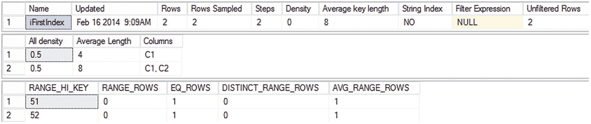
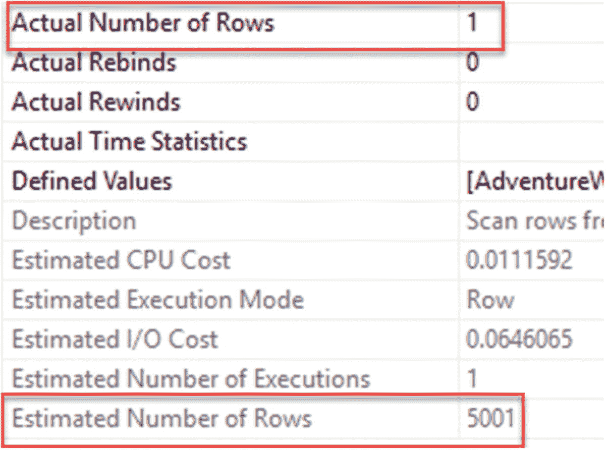
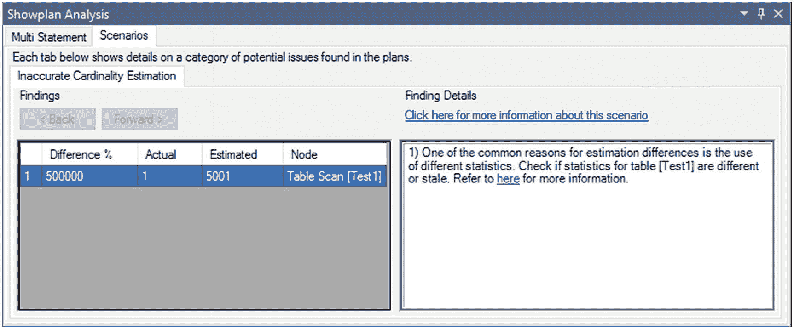
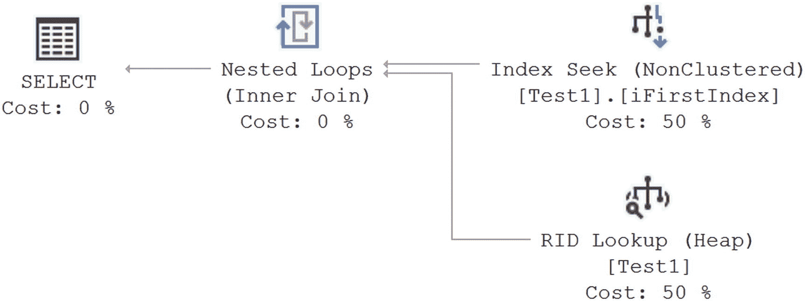

# 解决过时的统计信息问题

有时，过时或不正确的统计信息比缺失的统计信息更具破坏性。基于过旧的统计信息或仅对变更数据的部分扫描，优化器可能会决定采用某种特定的索引策略，而这可能对于当前的数据分布而言极不合适。不幸的是，对于过时或不正确的统计信息，执行计划不会像对缺失统计信息那样显示出明显的警告。不过，存在一个名为 `inaccurate_cardinality_estimate` 的扩展事件。这是一个调试事件，这意味着在生产系统上使用它可能有些问题。我强烈建议谨慎使用，仅在经过适当过滤且仅在短时间内使用，但我想指出它的存在。作为替代方案，请利用第 7 章详述的 Showplan 分析功能。

识别过时统计信息的更传统且更安全的方法，是检查优化器估计的影响行数与实际影响行数之间的接近程度。

以下示例向您展示如何识别和解决过时的统计信息问题。图 13-38 显示了由 `DBCC SHOW_STATISTICS` 提供的、列 `C1` 上非聚集索引键的统计信息。



图 13-38 索引 FirstIndex 上的统计信息

```
DBCC SHOW_STATISTICS (Test1, iFirstIndex);
```

这些结果显示，列 `C1` 的密度值为 0.5。现在考虑以下 `SELECT` 语句：

```
SELECT *
FROM dbo.Test1
WHERE C1 = 51;
```

由于表中的总行数当前为 10,002，因此筛选条件 `C1 = 51` 的匹配行数可以估计为 5,001 (= 0.5 × 10,002)。这个估计行数 (5,001) 与此列值的实际匹配行数相差甚远。该表实际上只包含一行 `C1 = 51` 的数据。

您可以从执行计划中获取估计行数和实际行数的信息。估计计划仅引用并使用统计信息，而非实际数据。这意味着它可能与实际数据大相径庭，正如您现在所见。而实际执行计划则同时具有估计行数和实际行数。

执行查询会得到图 13-39 中的执行计划以及以下性能：


图 13-39 使用过时统计信息的执行计划

```
读取次数: 100
持续时间: 681 毫秒
```

要查看估计行数和实际行数，您可以查看 `表扫描` 运算符的属性（图 13-40）。



图 13-40 显示行数差异的属性

从估计行数与实际行数的对比可以清楚看出，优化器基于过时的统计信息做出了不正确的估计。如果估计行数和实际行数之间的差异超过 10 倍，那么所选择的处理策略很可能对于当前的数据分布而言成本效益不高。不准确的估计可能会误导优化器决定处理策略。统计信息出现偏差的原因有多种。表变量和多语句用户定义函数根本没有统计信息，因此对这些对象的所有估计都假设为单行，而不考虑这些对象实际涉及多少行。

我们也可以使用 Showplan 分析功能查看“不准确的基数估计”报告。右键单击一个实际执行计划，然后从上下文菜单中选择“分析实际执行计划”。当分析窗口打开时，选择“方案”选项卡。对于之前的计划，您会看到类似图 13-41 的内容。



图 13-41 显示实际值与估计值差异的“不准确基数估计”报告

为了帮助优化器做出准确的估计，您应该更新列 `C1` 上非聚集索引键的统计信息（当然，作为替代方案，您也可以直接保持自动更新统计信息功能开启）。

```
UPDATE STATISTICS Test1 iFirstIndex WITH FULLSCAN;
```

这里可能不需要 `FULLSCAN`。采用抽样方法创建统计信息通常相当准确，且速度快得多。但是，在系统压力不大或非高峰时段，我倾向于使用 `FULLSCAN`，因为其准确性更高。只要您能获得所需的统计信息，两种方法都是有效的。

如果您再次运行该查询，您将获得如下所示的更新统计信息，结果输出如图 13-42 所示：



图 13-42 使用最新统计信息后的实际行数与估计行数

```
读取次数: 4
持续时间: 184 毫秒
```

优化器利用更新的统计信息准确地估计了行数，因此能够制定出更高效的计划。由于估计行数为 1，通过 `C1` 上的非聚集索引检索行而不是扫描基表是合理的。

在索引键列上保持更新、准确的统计信息，有助于优化器对处理策略做出更优决策，从而将逻辑读取次数从 84 次减少到 4 次，并将执行时间从 16 毫秒减少到 0 毫秒（存在 -4 毫秒的延迟时间）。

在继续之前，请为数据库重新开启统计信息。

```
ALTER DATABASE AdventureWorks2017 SET AUTO_CREATE_STATISTICS ON;
ALTER DATABASE AdventureWorks2017 SET AUTO_UPDATE_STATISTICS ON;
```

## 建议

在本章中，我涵盖了关于统计信息的各种建议。为方便查阅，我将这些建议整理并扩展，置于以下各节中。

## 统计信息的向后兼容性

SQL Server 2014 及更高版本中的统计信息生成方式可能与之前版本的 SQL Server 不同。SQL Server 在升级过程中会传输统计信息，并且默认情况下，会随着数据的变化随时间自动更新这些统计信息。最佳方法是遵循第 10 章（关于查询存储）中概述的指导，让统计信息随时间更新。

##### 自动创建统计信息

此功能通常应保持开启。在默认设置下，在创建执行计划期间，SQL Server 会确定非索引列上的统计信息是否有用。如果认为有益，SQL Server 就会在该非索引列上创建统计信息。但是，如果您计划手动在非索引列上创建统计信息，那么您必须准确识别哪些非索引列上的统计信息会带来好处。


##### 自动更新统计信息

此功能通常应保持开启，以便 SQL Server 能够根据数据分布随时间的变化来决定合适的执行计划。通常，此功能带来的性能收益会超过其开销成本。您很少需要干预统计信息的自动维护，这类要求通常是在排查故障或分析性能时才被识别出来。为了确保您不会因自动统计信息功能而面临意外情况，在诊断 SQL Server 问题时，分析统计信息的有效性至关重要。

不幸的是，如果您遇到自动更新统计信息功能的问题并不得不将其关闭，请务必创建一个 SQL Server 作业来更新统计信息，并将其安排在定期的时间间隔运行。出于性能原因，在可能的情况下，请确保该 SQL 作业被安排在非高峰时段运行。

最佳的统计信息维护方法之一是运行由 Ola Holengren 开发和维护的脚本（`http://bit.ly/JijaNI`）。

## 异步自动更新统计信息

在大多数情况下，默认行为（在生成执行计划前等待统计信息更新）是可行的。在极少数情况下，如果统计信息更新或由此更新导致的执行计划重新编译开销很大（比过时统计信息的开销还要大），那么您可以开启统计信息的异步更新。需要理解的是，这可能意味着那些本可从最新的统计信息中受益的存储过程，在下一次运行之前性能会受到影响。别忘了——您确实需要启用自动更新统计信息才能启用异步更新。

## 用于收集统计信息的采样量

通常建议使用默认采样率。这个比率是由一个高效的算法根据数据大小和修改数量决定的。尽管默认采样率在大多数情况下被证明是最佳的，但如果对于某个特定查询，您发现统计信息不是很准确或缺失了关键的数据分布，那么您可以使用 `FULLSCAN` 手动更新它们。您也可以使用 `SAMPLE` number 选项来设置特定的采样百分比。该数值可以是百分比，也可以是固定的行数。

如果这种情况需要重复处理，那么您可以添加一个 SQL Server 作业来处理它。出于性能原因，请确保 SQL 作业安排在非高峰时段运行。要识别默认采样率并非最佳的情况，请在排查数据库性能问题时，分析高开销查询的统计信息有效性。请记住，`FULLSCAN` 开销很大，因此只应在那些您确定真正会受益的表或索引上运行它。

## 总结

正如本章所讨论的，SQL Server 基于成本的优化器需要关于过滤和连接条件中使用的列的准确统计信息，以确定高效的处理策略。索引键上的统计信息总是在创建索引时创建，并且默认情况下，SQL Server 也会随着数据的变化而更新索引列和非索引列上的统计信息。这使其能够确定适用于当前数据分布的最佳处理策略。

尽管您可以禁用自动创建统计信息和自动更新统计信息功能，但建议您保持这些功能为 `on` 状态，因为它们给优化器带来的好处几乎总是超过其开销成本。对于一个开销大的查询，应分析统计信息以确保自动统计信息维护能兑现其承诺。最好的消息是，只要稍加留心，您就可以高枕无忧，因为自动统计信息在大多数时候都能很好地完成工作。如果使用手动统计信息维护程序，那么您可以使用 SQL Server 作业来自动化这些程序。

即使有适当的索引和统计信息，一个严重碎片化的数据库也会导致数据检索成本增加。在下一章中，您将了解索引中的碎片如何影响查询性能，并将学习如何在需要时分析和解决碎片问题。

