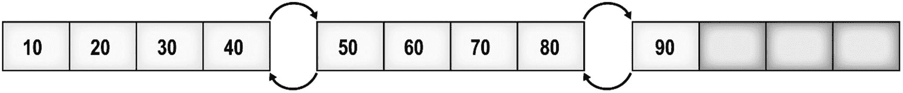
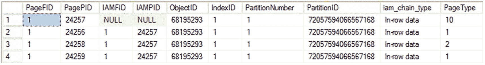
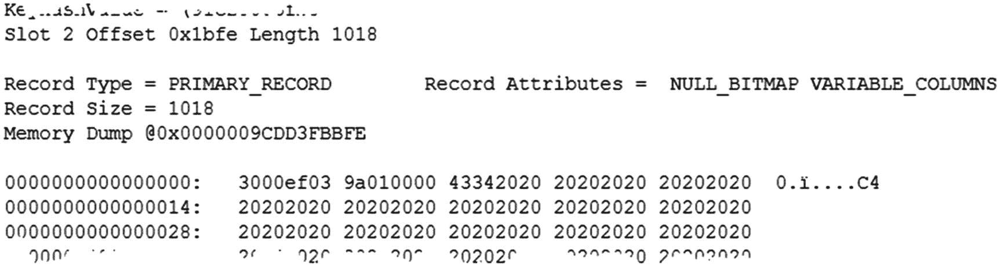
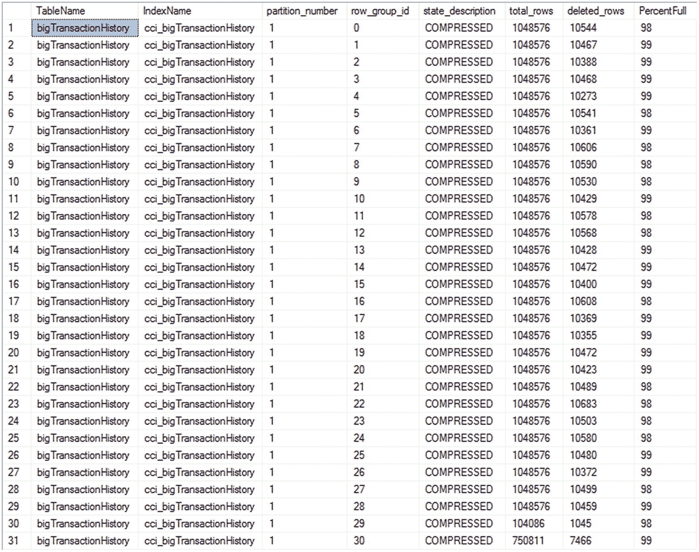
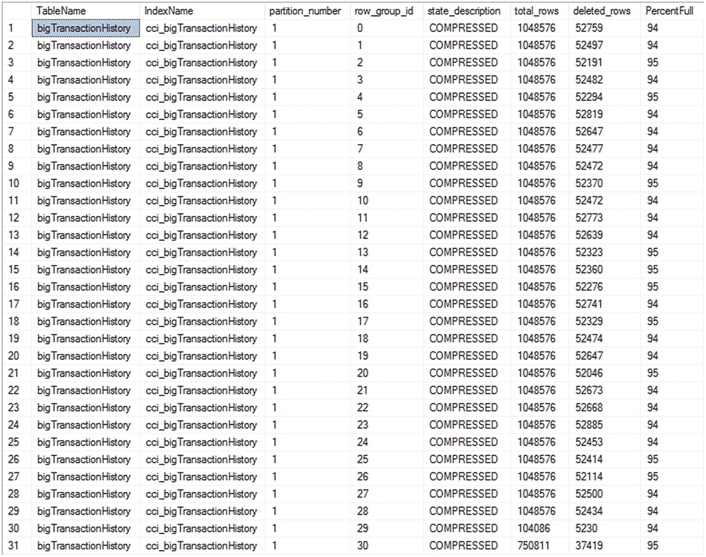
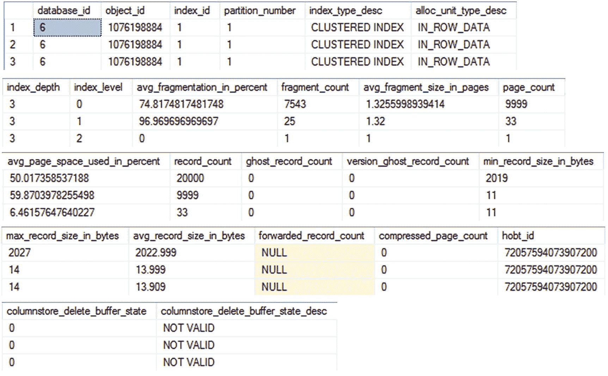
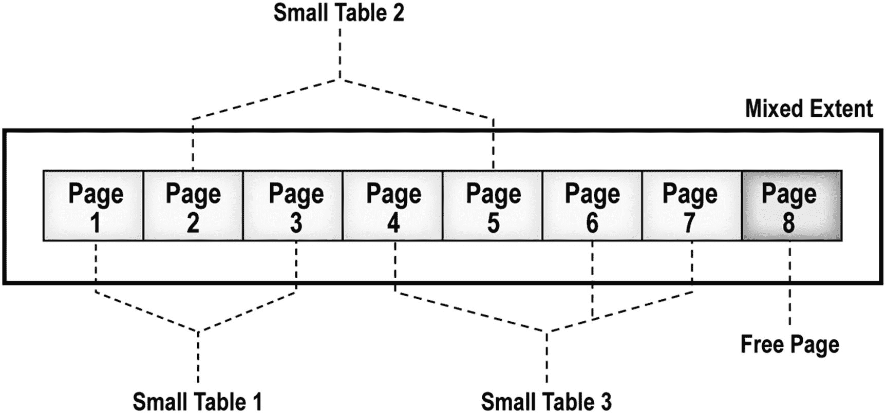
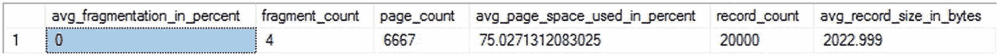

# 14. 索引碎片

如第 8 章所述，行存储索引列值存储在索引的 B 树结构的叶级页中。列存储索引也存储在页中，但不在 B 树结构中。当您在表上创建索引（聚集或非聚集）时，通过正确排序索引的叶级页和叶级页内的行，可以降低数据检索成本，而列存储则将数据透视成列然后进行压缩，同样旨在辅助数据检索。在 OLTP 数据库中，数据不断变化，导致索引碎片化。结果，返回相同行数所需的读取次数随时间增加。当数据从增量存储移动到分段存储区域时，列存储也会出现类似情况。这两种情况都可能导致性能下降。

在本章中，我将涵盖以下主题：

*   索引碎片的原因，包括对由 `INSERT` 和 `UPDATE` 语句引起的页拆分的分析

*   列存储索引碎片的原因

*   与碎片相关的开销成本

*   如何分析行存储和列存储索引中的碎片量

*   用于解决碎片的技术

*   填充因子在帮助控制行存储索引碎片方面的重要性

*   如何自动化碎片分析过程


## 关于碎片化的讨论

当前，在数据平台社区内，关于碎片化到底在多大程度上构成问题，存在着大量讨论。在深入探讨什么是碎片化、它可能如何影响您的查询，以及如果它确实发生您该如何应对这些细节之前，我们应当立即解答这个问题：您应该对索引进行碎片整理吗？我决定将这个讨论置于碎片化工作原理的所有细节之前，因此如果您对此仍感疑惑，请跳过本节，直接阅读“碎片化的成因”。

当您的索引和表出现碎片时，它们确实会占用更多空间，即需要更多的页。这会根据索引类型的不同，以不同方式将它们分布在磁盘上。在处理一个存在碎片的索引并进行点查找（point lookup）或非常有限的范围扫描时，碎片化根本不会影响性能。但在处理一个存在碎片的索引并进行大型扫描时，需要在磁盘上穿过更多的页，这肯定会影响性能。从这个角度来看，您可以简单地决定只在进行大量扫描和大规模数据移动时才对索引进行碎片整理。

然而，事情远不止于此。碎片整理本身会给系统带来负载，导致阻塞和额外工作，从而影响系统性能。随后，您的索引又会再次开始碎片化的过程，包括页拆分和行重新排列，再次带来性能问题。有一种有力的观点认为，让系统达到一个平衡点，在这个点上页足够空，使得拆分停止（或大幅减少），将实现更好的整体性能。这是因为，相比于给系统施加压力重建索引，然后忍受索引再次变动时所有的页拆分，您只需减少页拆分的发生。您仍然需要处理较慢的扫描，但对于现代磁盘子系统来说，这就不那么令人头疼了。

考虑到所有这些因素，我强烈倾向于“停止对索引进行碎片整理”这一阵营。只要您设置了适当的填充因子，您就应该看到页拆分活动的大幅减少。然而，您最好的选择是使用本章概述的工具来监控您的系统。很可能我们所有人都处于混合模式中，即一些表和索引需要进行碎片整理，而另一些则应该置之不理。这完全取决于您系统的行为。

## 碎片化的成因

当表中的数据被修改时，就会发生碎片化。对于 `rowstore` 和 `columnstore` 索引都是如此。当您在表中添加或删除数据（通过 `INSERT` 或 `DELETE`）时，表对应的聚集索引和受影响的非聚集索引都会被修改。`rowstore` 和 `columnstore` 这两种索引类型从这一点开始有所不同。我们将从 `rowstore` 开始逐一讨论。

### 数据修改与行存储索引

通过 `INSERT`、`UPDATE` 或 `MERGE` 修改数据时，如果对索引的修改无法在同一页面内容纳，就可能导致索引叶页拆分。通过 `DELETE` 删除数据则只是在现有页面中留下空白。当发生页拆分时，将添加一个新的叶页，其中包含原页面的一部分，并维护索引键中行的逻辑顺序。尽管新的叶页维护了原页面中数据行的*逻辑*顺序，但这个新页面通常不会在磁盘上与原页面*物理*相邻。说得稍微不同一点，就是索引的逻辑键顺序与文件内的物理顺序不匹配。

例如，假设一个索引有九个键值（或索引行），并且索引行的平均大小允许一个叶页最多容纳四个索引行。如第 9 章所述，8KB 的叶页与前一个和后一个叶页相连，以维护索引的逻辑顺序。图 14-1 展示了该索引叶页的布局。



图 14-1：叶页布局

由于叶页中的索引键值始终是排序的，一个键值为 25 的新索引行必须占据现有键值 20 和 30 之间的位置。因为包含这些现有索引键值的叶页已经满了（有四个索引行），新索引行将导致相应的叶页拆分。将为索引分配一个新的叶页，并将第一个叶页的一部分移动到这个新叶页，以便新的索引键可以按正确的逻辑顺序插入。索引页之间的链接也会被更新，使页面按索引顺序逻辑连接。如图 14-2 所示，新的叶页即使按正确的逻辑顺序链接到其他页面，在物理顺序上也可能错乱。


图 14-2：顺序错乱的叶页

页面被分组到更大的单元中，称为 `区`（`extents`），每个区可以包含八个页面。SQL Server 使用 `区` 作为磁盘上分配的物理单元。理想情况下，包含索引叶页的区的物理顺序应该与索引的逻辑顺序相同。这减少了检索一系列索引行时在区之间切换的次数。然而，页拆分会导致区内的页面物理顺序错乱，也可能导致区本身物理顺序错乱。例如，假设索引的前两个叶页在区 1 中，第三个叶页在区 2 中。如果区 2 有空闲空间，那么由于页拆分而分配给索引的新叶页将位于区 2 中，如图 14-3 所示。


图 14-3：分布在不同区上的顺序错乱的叶页

叶页分布在两个区之间，理想情况下，您期望读取一系列索引行时最多只需要在两个区之间切换一次。然而，页面在区之间的错乱组织可能导致在检索一系列索引行时需要进行多次区切换。例如，要检索键值在 25 到 90 之间的一系列索引行，您将需要在两个区之间进行三次区切换，如下所示：

*   第一次区切换：在键值 25 之后读取键值 30
*   第二次区切换：在键值 40 之后读取键值 50
*   第三次区切换：在键值 80 之后读取键值 90

这种碎片化称为 `外部碎片化`。`外部碎片化` 可能是不可取的。

碎片化也可能发生在一个索引页面内部。如果一次 `INSERT` 或 `UPDATE` 操作导致了页拆分，那么原始叶页中就会留下空闲空间。`DELETE` 操作也可能造成空闲空间。最终效果是减少了叶页中包含的行数。例如，在图 14-3 中，由 `INSERT` 操作引起的页拆分在第一个叶页内创建了空白空间。这被称为 `内部碎片化`。

对于一个高事务性的数据库，有意在叶页中留出一些空闲空间是可取的，这样您就可以在不引起页拆分的情况下添加新行或更改现有行的大小。在图 14-3 中，第一个叶页内的空闲空间允许将一个键值为 26 的索引添加到叶页，而不会引起页拆分。


### 注意

请注意，此处的索引碎片与磁盘碎片不同。由于 SQL Server 文件中页面的顺序仅由 SQL Server 理解，操作系统并不理解，因此无法简单地通过运行磁盘碎片整理工具来修复索引碎片。

堆表页面也可能以相同方式变得碎片化。不幸的是，由于堆的存储方式以及任何非聚集索引如何使用物理数据位置从堆中检索数据，对堆进行碎片整理是相当有问题的。你可以使用 `ALTER TABLE` 的 `REBUILD` 命令来执行堆重建，但需要明白这会强制重建与该表关联的所有非聚集索引。

SQL Server 2017 通过一个名为 `sys.dm_db_index_physical_stats` 的动态管理视图公开叶子和非叶子页面以及其他数据。它存储索引大小和碎片信息。我将在下一节更详细地介绍它。这个 DMV 比旧的 `DBCC SHOWCONTIG` 更容易使用。

现在让我们来看看碎片化的机制。

#### 由 UPDATE 语句引起的页面拆分

为了演示由 `UPDATE` 语句导致的页面拆分，我将使用一个构造的表。这个小测试表将有一个聚集索引，该索引将一个叶子（或数据）页内的行排序如下：

```
USE AdventureWorks2017;
GO
DROP TABLE IF EXISTS dbo.Test1;
GO
CREATE TABLE dbo.Test1 (C1 INT,
C2 CHAR(999),
C3 VARCHAR(10))
INSERT INTO dbo.Test1
VALUES (100, 'C2', ''),
(200, 'C2', ''),
(300, 'C2', ''),
(400, 'C2', ''),
(500, 'C2', ''),
(600, 'C2', ''),
(700, 'C2', ''),
(800, 'C2', '');
CREATE CLUSTERED INDEX iClust ON dbo.Test1 (C1);
```

聚集索引叶子页（不包括内部开销）中的行平均大小不仅是聚集索引列平均大小的总和；它是表中所有列平均大小的总和，因为聚集索引的叶子页和表的数据页是同一个。因此，基于先前示例数据的聚集索引中行的平均大小如下：

```
= (Average size of [C1]) + (Average size of [C2]) + (Average size of [C3]) bytes = (Size of INT) + (Size of CHAR(999)) + (Average size of data in [C3]) bytes
= 4 + 999 + 0 = 1,003 bytes
```

SQL Server 中行的最大大小为 8,060 字节。因此，如果内部开销不是非常高，所有八行都可以容纳在一个 8KB 页面中。

要确定分配给 `iClust` 聚集索引的叶子页数量，请针对 `sys.dm_db_index_physical_stats` 执行 `SELECT` 语句。

```
SELECT ddips.avg_fragmentation_in_percent,
ddips.fragment_count,
ddips.page_count,
ddips.avg_page_space_used_in_percent,
ddips.record_count,
ddips.avg_record_size_in_bytes
FROM sys.dm_db_index_physical_stats(DB_ID('AdventureWorks2017'),
OBJECT_ID(N'dbo.Test1'),
NULL,
NULL,
'Sampled') AS ddips;
```

你可以在图 14-4 中看到此查询的结果。


图 14-4　索引 iClust 的物理布局

从这个输出的 `page_count` 列中，你可以看到分配给聚集索引的页数为 1。你还可以在 `avg_page_space_used_in_percent` 列中看到平均使用空间为 100。由此你可以推断，该页没有剩余的自由空间来扩展 `C3` 的内容，`C3` 的类型为 `VARCHAR(10)`，当前为空。

> **注意**：我将在本章后面的“分析碎片量”一节中分析 `sys.dm_db_index_physical_stats` 提供的更多信息。

因此，如果你尝试按如下方式扩展其中一行 `C3` 列的内容，它将导致页面拆分：

```
UPDATE dbo.Test1
SET C3 = 'Add data'
WHERE C1 = 200;
```

从 `sys.dm_db_index_physical_stats` 中选择数据，会得到图 14-5 中的信息。


图 14-5　数据更新后的 i1 索引

从图 14-5 的输出中，你可以看到 SQL Server 已向索引添加了一个新页面。在页面拆分时，SQL Server 通常将原始页面中的总行数的一半移动到新页面。因此，两个页面中的行分布如图 14-6 所示。


图 14-6　由 UPDATE 语句引起的页面拆分

从前表可以看出，由 `UPDATE` 语句引起的页面拆分导致叶子页面中的数据出现内部碎片。如果新的叶子页无法物理上写在原始叶子页旁边，那么也会出现外部碎片。对于碎片量大的大表，将需要更多的叶子页来容纳所有索引行。

另一种查看页面分布的方法是使用一些未充分记录的 `DBCC` 命令。首先，你可以使用 `DBCC IND` 查看表中的页面。

```
DBCC IND(AdventureWorks2017, 'dbo.Test1', -1);
```

此命令列出构成表的页面。你会得到类似图 14-7 的输出。



图 14-7　显示两个页面的 DBCC IND 输出

如果你关注 `PageType`，你可以看到现在有两个 `PageType = 1` 的页面，这是数据页。输出中还有其他列也显示了页面是如何链接在一起的。

要查看前述页面中行的最终分布，你可以在每个页面末尾添加一行。

```
INSERT INTO dbo.Test1
VALUES (410, 'C4', ''),
(900, 'C4', '');
```

这些新行被容纳在现有的两个叶子页中，而不会导致页面拆分。你可以通过查询查看页面信息的另一种机制 `DBCC PAGE` 来确认这一点。要调用此命令，你需要从 `DBCC IND` 的输出中获取 `PagePID`。这将使你能够拉回页面上所有内容的完整转储。

```
DBCC TRACEON(3604);
DBCC PAGE('AdventureWorks2017',1,24256,3);
```

此命令的输出解释起来很复杂，但如果你向下滚动到末尾，可以看到输出，如图 14-8 所示。



图 14-8　添加更多行后的页面

在屏幕的右侧，你可以看到内存转储的输出，一个值 `C4`。那是先前的数据添加的。在我的测试中，两行都被添加到同一页中。全面解释这两个 `DBCC` 调用的所有可能排列远远超出了本章的范围。要知道，你可以确定任何给定表的数据存储在哪个页面上。


### 由 INSERT 语句导致的页分裂

要理解 `INSERT` 语句如何导致页分裂，请创建与之前相同的测试表，包含八行初始数据和聚集索引。由于单个索引叶页已完全填满，任何尝试添加如下中间行的操作都将导致叶页发生页分裂：

```sql
INSERT INTO Test1
VALUES (110, 'C2', '');
```

您可以通过检查 `sys.dm_db_index_physical_stats` 的输出来验证这一点（图 14-9）。


图 14-9

插入后的页

如前所述，原始叶页中的一半行被移动到新页。一旦原始叶页中清除了空间，新行就会按适当的顺序添加到原始叶页中。请注意，一行只与一个页相关联；它不能跨多个页。图 14-10 显示了两个页中行的最终分布。


图 14-10

由 INSERT 语句导致的页分裂

从之前的索引页中，您可以看到由 `INSERT` 语句导致的页分裂使行稀疏地分布在叶页上，从而导致了内部碎片。它通常也会导致外部碎片，因为新的叶页在物理上可能不与原始页相邻。对于具有大量碎片的大型表，由 `INSERT` 语句引起的页分裂将需要更多数量的叶页来容纳所有索引行。

为了演示索引页中显示的行分布，您可以再次运行创建 `dbo.Test1` 的脚本，并向这些页添加更多行。

```sql
INSERT  INTO dbo.Test1
VALUES  (410, 'C4', ''),
(900, 'C4', '');
```

结果与之前的示例相同：这些新行可以容纳在两个现有的叶页中，不会引起任何页分裂。您可以通过调用 `DBCC IND` 和 `DBCC PAGE` 来验证这一点。请注意，在第一个页中，新行被添加到该页中其他行之间。由于页内有可用空间，这不会导致页分裂。

那么，当您必须向索引的末尾添加行时呢？在这种情况下，即使需要一个新页，它也不会拆分任何现有页。例如，添加一个 `C1` 等于 1,300 的新行将需要一个新页，但由于该行不是添加在中间位置，因此不会导致页分裂。因此，如果新行是按照聚集索引的顺序添加的，那么索引行将始终添加在索引的末尾，从而防止了原本可能由 `INSERT` 语句引起的页分裂。但是，在这种情况下，您也会遇到所谓的 *热页*。热页是指所有插入操作都试图写入数据库中的单个页，从而导致阻塞。根据您的系统及其负载情况，这可能比页分裂更成问题，因此请务必监视您的等待统计信息以了解系统的行为。

### 数据修改与列存储索引

与行存储索引类似，列存储索引也可能受到碎片化的影响。当首次加载列存储索引时（假设至少有 102,400 行），数据会存储到构成列存储索引的压缩列段中。任何少于 102,400 行的数据都存储在增量存储中，如果您还记得第 9 章的内容，它只是一个常规的 B 树索引。存储在压缩列段中的数据没有碎片。为了避免随着时间的推移产生碎片，在可能的情况下，所有更改都存储在增量存储中，正是为了避免碎片化压缩列段。所有更改、更新和删除，在索引被重组或重建之前，都作为逻辑更改存储在增量存储中。所谓逻辑更改，我的意思是对于删除操作，数据被标记为已删除，但并未被移除。对于更新操作，旧值被标记为已删除，新值被添加。虽然列存储不会以页分裂的方式产生碎片，但这些逻辑删除代表了列存储索引的碎片化。逻辑删除越多，索引的逻辑碎片就越多。最终，您需要修复它。

为了直观地看到碎片化，我将使用在第 9 章创建的大列存储表。在这里，我将修改其中一个表，将其转换为聚集列存储索引：

```sql
ALTER TABLE dbo.bigTransactionHistory
DROP CONSTRAINT pk_bigTransactionHistory;
CREATE CLUSTERED COLUMNSTORE INDEX cci_bigTransactionHistory
ON dbo.bigTransactionHistory;
```

要查看聚集列存储索引内的逻辑碎片化，我们将查看系统视图 `sys.column_store_row_groups`，执行类似这样的查询：

```sql
SELECT OBJECT_NAME(i.object_id) AS TableName,
       i.name AS IndexName,
       i.type_desc,
       csrg.partition_number,
       csrg.row_group_id,
       csrg.delta_store_hobt_id,
       csrg.state_description,
       csrg.total_rows,
       csrg.deleted_rows,
       100 * (total_rows - ISNULL(deleted_rows, 0)) / total_rows AS PercentFull
FROM sys.indexes AS i
JOIN sys.column_store_row_groups AS csrg
    ON i.object_id = csrg.object_id
    AND i.index_id = csrg.index_id
WHERE name = 'cci_bigTransactionHistory'
ORDER BY OBJECT_NAME(i.object_id),
         i.name,
         row_group_id;
```

在 `dbo.bigTransactionHistory` 上新建索引后，我们可以预期没有由删除行引起的逻辑碎片。如果您运行前面的查询，可以看到这一点。它将显示 31 个行组，其中任何行组删除的行数都为零。您会看到一些行组的行数少于最大值。这不是问题；这只是数据加载的产物。让我们删除几行。

```sql
DELETE dbo.bigTransactionHistory
WHERE Quantity = 13;
```

现在当我们运行前面的查询时，我们可以看到列存储索引的逻辑碎片，如图 14-11 所示。



图 14-11

聚集列存储索引的碎片化

您可以看到所有行组都受到 `DELETE` 操作的影响，现在碎片化程度在 98% 到 99% 之间。

## 碎片化开销

碎片化开销主要包括从磁盘读取更多页所带来的额外开销。从磁盘读取更多页意味着读入内存的页也更多。这两者都会给系统带来压力，因为您需要使用越来越多的资源来处理索引碎片化的存储。正如我在开篇关于碎片化的讨论中所述，对于某些系统，这可能不是问题。然而，对于另一些系统，它确实是问题。我们将详细讨论行存储和列存储索引中负载的具体来源细节。


### 行存储开销

内部和外部碎片都会对数据检索性能产生不利影响。外部碎片导致磁盘上的索引页序列不连续，新的叶页远离原始的叶页，并且其物理排序与逻辑排序不同。因此，正如本章前面所解释的，对索引进行范围扫描将需要比理想情况下更多的在相应区之间的切换。此外，对索引进行范围扫描将无法受益于磁盘执行的预读操作。如果页被连续排列，那么预读操作可以提前读取页而无需过多的磁头移动。

为了获得更好的性能，最好使用顺序 I/O，因为这可以在单个磁盘 I/O 操作中读取整个区（八个 8KB 页）。相比之下，页的非连续布局需要非顺序或随机 I/O 操作来从磁盘检索索引页，而随机 I/O 操作在单个磁盘操作中只能读取 8KB 数据（但是，如果你只检索一行，这也许可以接受）。硬盘驱动器，尤其是 SSD 的速度不断提高，已经降低了这个问题的影响，但在某些情况下它仍然存在。

在内部碎片的情况下，行稀疏地分布在大量页上，增加了将索引页读入内存所需的磁盘 I/O 操作数量，并增加了从内存中检索多个索引行所需的逻辑读取数量。如前所述，尽管它增加了数据检索的成本，但少量的内部碎片可能是有益的，因为它允许你执行 `INSERT` 和 `UPDATE` 查询而不会导致页面拆分。对于不需要遍历一系列页面来检索数据的查询，碎片的影响可能微乎其微。换句话说，从索引中检索单个值不会受到碎片的影响；或者，最多，它可能需要在 B 树中多向下遍历一层。

要了解碎片如何影响查询的性能，请创建一个带有聚集索引的测试表，并向表中插入一个高度碎片化的数据集。由于在有序数据集之间执行 `INSERT` 操作可能导致页面拆分，你可以通过按以下顺序添加行来轻松创建碎片化的数据集：

```
DROP TABLE IF EXISTS dbo.Test1;
GO
CREATE TABLE dbo.Test1 (C1 INT,
C2 INT,
C3 INT,
c4 CHAR(2000));
CREATE CLUSTERED INDEX i1 ON dbo.Test1 (C1);
WITH Nums
AS (SELECT TOP (10000)
ROW_NUMBER() OVER (ORDER BY (SELECT 1)) AS n
FROM master.sys.all_columns AS ac1
CROSS JOIN master.sys.all_columns AS ac2)
INSERT INTO dbo.Test1 (C1,
C2,
C3,
c4)
SELECT n,
n,
n,
'a'
FROM Nums;
WITH Nums
AS (SELECT 1 AS n
UNION ALL
SELECT n + 1
FROM Nums
WHERE n < 10000)
INSERT INTO dbo.Test1 (C1,
C2,
C3,
c4)
SELECT 10000 - n,
n,
n,
'a'
FROM Nums
OPTION (MAXRECURSION 10000);
```

要确定从这个碎片化的表中检索小结果集和大结果集所需的逻辑读取次数，请使用扩展事件会话执行以下两个 `SELECT` 语句（在这种情况下，`sql_batch_completed` 就足够了），以监控查询性能：

```
--读取 6 行
SELECT *
FROM dbo.Test1
WHERE C1 BETWEEN 21
AND     23;
--读取所有行
SELECT *
FROM dbo.Test1
WHERE C1 BETWEEN 1
AND     10000;
```

各个查询执行的逻辑读取次数分别如下：

```
6 行
读取次数:8
持续时间:2.6ms
所有行
读取次数:2542
持续时间:475ms
```

要评估碎片化数据集如何影响逻辑读取次数，请通过重建聚集索引重新排列索引叶页的物理顺序。

```
ALTER INDEX i1 ON dbo.Test1 REBUILD;
```

索引叶页按正确顺序重新排列后，重新运行查询。前述两个 `SELECT` 语句所需的逻辑读取次数分别减少到 5 和 13。

```
6 行
读取次数:6
持续时间:1ms
所有行
读取次数:2536
持续时间:497ms
```

较小数据集的性能有所改善，但较大数据集的性能变化不大，因为仅仅减少几个页不太可能产生太大影响。由于碎片导致的成本开销通常随着检索行数的增加而增加，因为这涉及到读取更多乱序的页。对于*点查询*（只检索一行的查询），碎片通常无关紧要，因为该行仅从一个叶页检索，但情况并非总是如此。由于索引的内部结构，碎片甚至可能增加点查询的成本。

### 注意

本节的经验是，为了获得更好的查询性能，分析索引中的碎片量并在需要时重新排列它非常重要。

### 列存储开销

虽然在处理列存储索引的逻辑碎片时，你不需要处理磁盘上重新排列的页，但你仍然会看到性能影响。被删除的值存储在与行组关联的 B 树索引中。任何数据检索都必须对这些数据执行额外的外部连接。你无法在执行计划中看到这一点，因为它是一个内部过程。然而，你可以在针对碎片化列存储索引的查询性能中看到它。

为了演示这一点，我们将从一个利用列存储索引的查询开始，如下所示：

```
SELECT bth.Quantity,
AVG(bth.ActualCost)
FROM dbo.bigTransactionHistory AS bth
WHERE bth.Quantity BETWEEN 8
AND     15
GROUP BY bth.Quantity;
```

如果你运行此查询，平均会得到如下性能指标：

```
读取次数:20932
持续时间:70ms
```

如果我们要对索引进行碎片化，特别是在我们查询的信息范围内，如下所示：

```
DELETE dbo.bigTransactionHistory
WHERE Quantity BETWEEN 9
AND     12;
```

那么性能指标会发生变化，如下所示：

```
读取次数:20390
持续时间:79ms
```

请注意，读取次数已经下降，因为为了得到结果，总体上处理的数据量变少了。然而，性能从 70ms 下降到了 79ms。这是因为索引的碎片化，我们可以看到在图 14-12 中情况变得更糟了。



图 14-12

聚集列存储索引的碎片化增加


## 分析碎片化程度

你已经了解了如何确定列存储索引的碎片化情况。对于行存储索引，我们可以做同样的事情。你可以通过使用 `sys.dm_db_index_physical_stats` 动态管理函数来分析索引的碎片化比率。对于具有聚集索引的表，聚集索引的碎片化与数据页的碎片化一致，因为聚集索引的叶级页和数据页是相同的。`sys.dm_db_index_physical_stats` 也会指出堆表（即没有聚集索引的表）的碎片化程度。由于堆表不要求任何行排序，因此页的逻辑顺序对堆表来说并不相关。

`sys.dm_db_index_physical_stats` 的输出显示了索引（或表）的页和区的信息。对于索引中的 B 树的每一层，都会返回一行。对于堆中的每个分配单元，也会返回一行。如前所述，在 SQL Server 中，八个连续的 8KB 页被组合在一起，形成一个大小为 64KB 的区。对于小表（远小于 64KB），一个区中的页可以属于多个索引或表——这些被称为 *mixed extents* 。如果数据库中有大量小表，混合区有助于 SQL Server 节省磁盘空间。

随着表（或索引）增长并请求超过八个页，SQL Server 会创建一个专用于该表（或索引）的区，并分配该区中的页。这样的区称为 *uniform extent* ，它为同一个表（或索引）提供最多八个页请求。统一区有助于 SQL Server 连续地布局表（或索引）的页。它们还将页创建请求数量减少了八分之一，因为一组八个页是以区的形式创建的。存储在统一区中的信息仍然可能是碎片化的，但访问页的分配将高效得多。如果你有混合区，即多个对象共享的页，以及这些区内的碎片化，访问信息就会变得更加成问题。但是对混合区不会进行碎片整理。

为了分析索引的碎片化，让我们使用“碎片化开销”部分中使用的碎片化数据集重新创建表。你可以通过执行之前使用的针对 `sys.dm_db_index_physical_stats` 动态视图的查询来获取聚集索引的碎片化详细信息（图 14-13）。


图 14-13 碎片化统计信息

```sql
SELECT ddips.avg_fragmentation_in_percent,
ddips.fragment_count,
ddips.page_count,
ddips.avg_page_space_used_in_percent,
ddips.record_count,
ddips.avg_record_size_in_bytes
FROM sys.dm_db_index_physical_stats(DB_ID('AdventureWorks2017'),
OBJECT_ID(N'dbo.Test1'),
NULL,
NULL,
'Sampled') AS ddips;
```

动态管理函数 `sys.dm_db_index_physical_stats` 扫描索引的页来返回数据。你可以控制扫描的级别，这会影响扫描的速度和准确性。要快速检查索引的碎片化，请使用 Limited 选项。通过使用 Sample 选项（如前面的示例所示，扫描 1% 的页），你可以在速度仅适度降低的情况下获得更高的准确性。对于最高的准确性，请使用 Detailed 扫描，它会访问索引中的所有页。但要注意，根据表和索引的大小，Detailed 扫描可能对性能有重大影响。如果索引少于 10,000 页并且你选择了 Sample 模式，那么将使用 Detailed 模式。这意味着无论之前查询中如何选择，都使用了 Detailed 扫描模式。默认模式是 Limited。

通过定义不同的参数，你可以获取不同数据集上的碎片化信息。如果从前面的查询中移除 `OBJECT_ID` 函数并提供 `NULL` 值，该查询将返回数据库中所有索引的信息。不要对此感到惊讶，以免不小心对所有索引运行 Detailed 扫描。你也可以指定你想要信息的索引，甚至是分区索引的分区。

`sys.dm_db_index_physical_stats` 的输出包括 24 个不同的列。我选择了用于确定索引碎片化和大小的基本列集。此输出代表以下内容：

*   `avg_fragmentation_in_percent`：这个数字表示索引和堆的逻辑平均碎片化百分比。如果表是堆并且模式是 Sampled，则此值将为 `NULL`。如果平均碎片化小于 10% 到 20%，并且表不是非常大，碎片化不太可能成为问题。如果索引在 20% 到 40% 之间，碎片化可能是个问题，但通常可以通过索引重新组织来改善（有关索引重新组织和索引重建的更多信息，请参见“碎片化解决方案”部分）。大规模碎片化，通常大于 40%，可能需要索引重建。你的系统可能有不同的要求，这些数字仅供参考。

*   `fragment_count`：这个数字表示构成索引的碎片或分离的页组的数量。这是一个有用的数字，可以了解索引的分布情况，特别是与 `page_count` 值进行比较时。当采样模式是 Sampled 时，`fragment_count` 为 `NULL`。大的碎片数是存储碎片化的另一个迹象。

*   `page_count`：这个数字是构成统计信息的索引或数据页数量的字面计数。这个数字是大小的度量，但也可以帮助指示碎片化。如果你知道数据或索引的大小，你可以计算多少行可以放在一个页上。如果你将此与表中的行数相关联，你应该得到一个接近 `page_count` 值的数字。如果 `page_count` 值明显更高，你可能正在处理碎片化问题。请参考 `avg_fragmentation_in_percent` 值以获取精确的度量。

*   `avg_page_space_used_in_percent`：要了解索引页内分配的空间量，请使用此数字。当采样模式为 Limited 时，此值为 `NULL`。

*   `record_count`：简单来说，这是统计信息所代表的记录数。对于索引，这是从扫描模式所代表的 B 树当前级别中的记录数。（Detailed 扫描将显示 B 树的所有级别，而不仅仅是叶级。）对于堆，此数字表示存在的记录，但此数字可能无法与表中的行数精确对应，因为堆在更新后可能有两条记录，并且可能发生页拆分。

*   `avg_record_size_in_bytes`：这个数字简单地表示索引或堆记录中存储数据量的一个有用度量。

使用 Detailed 扫描运行 `sys.dm_db_index_physical_stats` 将为给定索引返回多行。也就是说，如果该索引跨越多个级别，则会显示多行。当索引跨越多个页时，索引中会存在多个级别。为了查看这是什么样子，并观察动态管理函数中存在的其他列数据，请按如下方式运行查询：

```sql
SELECT ddips.*
FROM sys.dm_db_index_physical_stats(DB_ID('AdventureWorks2017'),
OBJECT_ID(N'dbo.Test1'),
NULL,
NULL,
'Detailed') AS ddips;
```

为了使数据可读，我将结果数据表分解为三个部分放在一个图形中；参见图 14-14。




**图 14-14**  碎片化索引的详细扫描

如你所见，返回了三行数据，分别代表索引的叶级 (`index_level = 0`)、B 树的第一级 (`index_level = 1`)，即第二行，以及 B 树的第三级 (`index_level = 2`)。你可以看到 `sys.dm_db_index_physical_stats` 提供了额外信息，可以对你的索引进行更详细的分析。例如，你可以看到最小和最大的记录大小，以及索引深度（B 树中的级数）和每一级有多少条记录。对于基本的碎片分析来说，这些信息大多不太有用，这就是为什么我在示例中选择限制列数并使用采样扫描模式。你看到的列存储信息主要是非聚集列存储内部结构。`sys.dm_db_index_physical_stats` 不会返回有关聚集列存储的信息。相反，如前面所示，你应该使用 `sys.dm_db_column_store_row_group_physical_stats`。

## 分析小表的碎片

不要过度担心 `sys.dm_db_index_physical_stats` 对小表的输出结果。对于小于八页的小表或索引，SQL Server 为这些页使用混合区。例如，如果一个表（`SmallTable1` 或其聚集索引）只包含两页，那么 SQL Server 会从一个混合区中分配这两页，而不是将一个专用区分配给该表。该混合区可能还包含其他小表/索引的页，如图 14-15 所示。



**图 14-15**  混合区

页分布在多个混合区上，这可能会让你认为表或索引存在大量的外部碎片，但实际上这在 SQL Server 中是设计如此，因此是完全可以接受的。

为了理解小表或索引的碎片信息可能是什么样子，创建一个带有聚集索引的小表。

```sql
DROP TABLE IF EXISTS dbo.Test1;
GO
CREATE TABLE dbo.Test1 (C1 INT,
C2 INT,
C3 INT,
C4 CHAR(2000));
DECLARE @n INT = 1;
WHILE @n <= 28
BEGIN
INSERT INTO dbo.Test1
VALUES (@n, @n, @n, 'a');
SET @n = @n + 1;
END
CREATE CLUSTERED INDEX FirstIndex ON dbo.Test1 (C1);
```

在上面的表中，每个 `INT` 占用 4 字节，平均行大小为 2,012 (= 4 + 4 + 4 + 2,000) 字节。因此，默认的 8KB 页最多可以容纳四行。将所有 28 行添加到表中后，创建聚集索引以物理地排列行并将碎片降至最低。在内部碎片最小的情况下，聚集索引（或基表）需要七页 (= 28 / 4)。由于页数不超过八页，SQL Server 为聚集索引（或基表）使用来自混合区的页。如果用于聚集索引的混合区不是相邻的，那么 `sys.dm_db_index_physical_stats` 的输出可能会显示大量的外部碎片。但作为 SQL 用户，你无法减少由此产生的外部碎片。图 14-16 显示了 `sys.dm_db_index_physical_stats` 的输出。


**图 14-16**  小型聚集索引的碎片

从 `sys.dm_db_index_physical_stats` 的输出中，你可以如下分析小型聚集索引（或表）的碎片：

*   `avg_fragmentation_in_percent`：尽管此索引可能跨越多个区，但此处显示的碎片并不是外部碎片的指示，因为此索引存储在混合区上。
*   `Avg_page_space_used_in_percent`：这显示了所有或大部分数据都良好地存储在 `pagecount` 字段显示的七页内。这排除了逻辑碎片的可能性。
*   `Fragment_count`：这显示数据是碎片化的，并且存储在多个区上，但由于其长度小于八页，SQL Server 在存储数据的位置上没有太多选择。

尽管有上述误导性的数值，但小于八页的小表（或索引）不太可能从消除碎片的努力中受益，因为它将存储在混合区上。

一旦确定索引（或表）中的碎片需要处理，就需要决定使用哪种碎片整理技术。影响此决定的因素以及不同的技术将在下一节中解释。

## 碎片解决方案

你可以通过重新排列索引行和页，使其物理顺序和逻辑顺序相匹配来解决索引中的碎片问题。为了减少外部物理碎片，你可以物理地重新排序索引的叶级页，使其遵循索引的逻辑顺序。对于列存储索引，你是在调用 Tuple Mover，它将关闭增量存储并将其放入压缩段中，或者你在做这件事并强制重新组织数据以实现最佳压缩。你可以通过以下技术实现所有这些：

*   删除并重新创建索引
*   使用 `DROP_EXISTING = ON` 子句重新创建索引
*   在索引上执行 `ALTER INDEX REBUILD` 语句
*   在索引上执行 `ALTER INDEX REORGANIZE` 语句

### 删除并重新创建索引

一种看似最简单的消除索引碎片的方法是删除索引然后重新创建。删除并重新创建索引能最大程度地减少碎片，因为它允许 SQL Server 为索引使用全新的页面，并适当地用现有数据填充它们。这避免了内部和外部碎片。不幸的是，这种方法有许多严重的缺点。

*   *阻塞*：这种碎片整理技术会给系统增加大量开销，并导致阻塞。删除和重新创建索引会阻塞对该表（或表上任何其他索引）的所有其他请求。它也可能被其他针对该表的请求阻塞。
*   *索引缺失*：索引被删除后，并且可能被阻塞并等待重新创建，针对该表的查询将无法使用该索引。这可能导致索引原本旨在解决的性能问题。
*   *非聚集索引*：如果要删除的索引是聚集索引，那么表上的所有非聚集索引必须在聚集索引删除后重建。然后它们必须在聚集索引重新创建后再次重建。这会导致进一步的阻塞和其他问题，例如语句重新编译（在第 19 章中详述）。
*   *唯一约束*：用于定义主键或唯一约束的索引不能使用 `DROP INDEX` 语句移除。此外，唯一约束和主键都可以被外键约束引用。在删除主键之前，必须先移除所有引用该主键的外键。虽然这是可行的，但对于索引碎片整理来说，这是一种有风险且耗时的方法。

可以使用 `ONLINE` 选项来删除聚集索引，这意味着在删除索引时索引仍然可读，但这只能解决之前的阻塞问题。由于所有这些原因，删除并重新创建索引不是生产数据库的推荐技术，尤其是在非高峰时段以外的时间。


### 使用 DROP_EXISTING 子句重建索引

为了避免在重建聚集索引时产生重建非聚集索引的额外开销，可以使用 `CREATE INDEX` 语句的 `DROP_EXISTING` 子句。这种方法在原子步骤中重建聚集索引，由于行定位器使用的聚集索引键值保持不变，因此避免了重建非聚集索引。要使用 `DROP_EXISTING` 子句以原子步骤重建聚集索引键，请按如下方式执行 `CREATE INDEX` 语句：

```sql
CREATE UNIQUE CLUSTERED INDEX FirstIndex
ON dbo.Test1
(
C1
)
WITH (DROP_EXISTING = ON);
```

`DROP_EXISTING` 子句可用于聚集和非聚集索引，甚至可以将非聚集索引转换为聚集索引。但是，不能使用它将聚集索引转换为非聚集索引。

这种碎片整理技术的缺点如下：

*   **阻塞**：与 `DROP` 和 `CREATE` 方法类似，此技术也会导致并面临来自访问该表（或该表上的任何索引）的其他查询的阻塞。
*   **带约束的索引**：与第一种方法不同，带有 `DROP_EXISTING` 的 `CREATE INDEX` 语句可用于重建带约束的索引。如果约束是主键或唯一约束与外键关联，那么在 `CREATE` 语句中未包含 `UNIQUE` 关键字将导致类似以下错误：

```
Msg 1907, Level 16, State 1, Line 1
Cannot recreate index 'PK_Name'. The new index definition does not match the constraint being enforced by the existing index.
```

*   **具有多个碎片化索引的表**：随着表数据碎片化，索引通常也会碎片化。如果使用这种碎片整理技术，则必须识别表上的所有索引并逐个重建。

通过使用 `ALTER INDEX REBUILD`（下一节将解释），可以避免与此技术相关的最后两个限制。

### 执行 ALTER INDEX REBUILD 语句

`ALTER INDEX REBUILD` 在原子步骤中重建索引，就像使用 `DROP_EXISTING` 子句的 `CREATE INDEX` 一样。由于 `ALTER INDEX REBUILD` 也物理地重建索引，它允许 SQL Server 分配新的页，从而将内部和外部碎片降至最低。但与使用 `DROP_EXISTING` 的 `CREATE INDEX` 不同，它允许在动态删除和重新创建约束的情况下重建支持 `PRIMARY KEY` 或 `UNIQUE` 约束的索引。

对于列存储索引，`REBUILD` 语句将以离线方式完全重建列存储，调用 `Tuple Mover` 移除 `deltastore`，但也会重新排列数据以确保最大有效压缩。对于行存储索引，处理索引碎片化的首选机制是 `REBUILD`。对于列存储索引，首选方法是下一节详细介绍的 `REORGANIZE` 语句。

要理解使用 `ALTER INDEX REBUILD` 来整理行存储索引碎片，请考虑“碎片开销”和“分析碎片量”部分中使用的碎片化表。该表在此重复：

```sql
DROP TABLE IF EXISTS dbo.Test1;
GO
CREATE TABLE dbo.Test1 (C1 INT,
C2 INT,
C3 INT,
c4 CHAR(2000));
CREATE CLUSTERED INDEX i1 ON dbo.Test1 (C1);
WITH Nums
AS (SELECT TOP (10000)
ROW_NUMBER() OVER (ORDER BY (SELECT 1)) AS n
FROM master.sys.all_columns AS ac1
CROSS JOIN master.sys.all_columns AS ac2)
INSERT INTO dbo.Test1 (C1,
C2,
C3,
c4)
SELECT n,
n,
n,
'a'
FROM Nums;
WITH Nums
AS (SELECT 1 AS n
UNION ALL
SELECT n + 1
FROM Nums
WHERE n < 10000)
INSERT INTO dbo.Test1 (C1,
C2,
C3,
c4)
SELECT 10000 - n,
n,
n,
'a'
FROM Nums
OPTION (MAXRECURSION 10000);
```

如果你查看当前的碎片情况，会发现它同时存在内部和外部碎片。


*图 14-17 内部和外部碎片*

你可以使用 `ALTER INDEX REBUILD` 语句来整理聚集索引（或表）的碎片。

```sql
ALTER INDEX i1 ON dbo.Test1 REBUILD;
```

下图显示了针对 `sys.dm_db_index_physical_stats` 执行标准 `SELECT` 语句的输出结果。


*图 14-18 通过 ALTER INDEX REBUILD 解决的碎片*

将图 14-18 中查询的先前结果与之前图 14-18 中的结果进行比较。你可以看到内部和外部碎片都已有效减少。以下是输出分析：

*   **内部碎片**：该表有 20,000 行，平均行大小（2,022.999 字节）允许每页最多容纳四行。如果行经过高度整理以将内部碎片降至最低，则表中应大约有 6,000 个数据页（或聚集索引中的叶级页）。在前面的输出中可以观察到以下内容：
    *   **叶级（或数据）页数**：`pagecount` = 6667
    *   **页中的信息量**：`avg_page_space_used_in_percent` = 75.02%
*   **外部碎片**：需要大量的区来容纳 6,667 页。为了达到最小的外部碎片，区之间不应有任何间隙，并且所有页都应按照索引的逻辑顺序物理排列。前面的输出显示乱序页数 = `avg_fragmentation_in_percent` = 0%。这表明该索引得到了有效的碎片整理。随着相互对齐的区减少，访问速度将更快。


