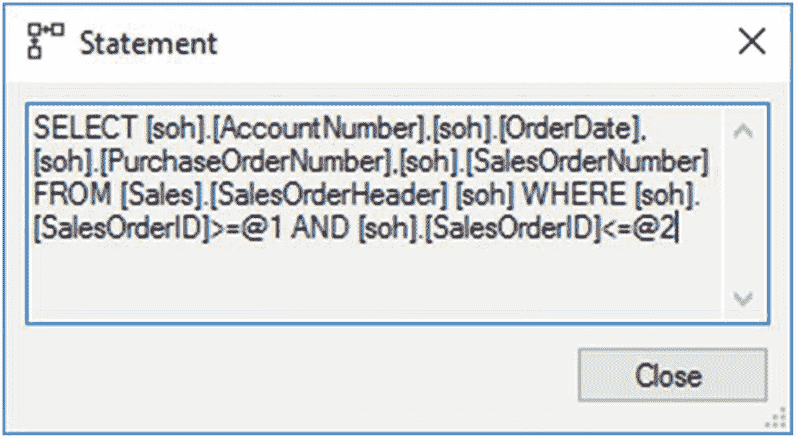
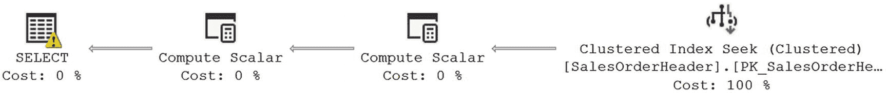
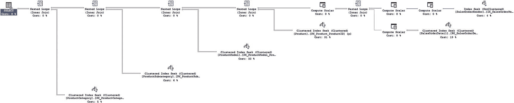

# 15. 执行计划生成

正如你在前几章所学，任何查询的性能都取决于优化器所决定的执行计划的有效性。因为执行查询所需的总时间等于生成执行计划所需的时间加上基于此执行计划执行查询所需的时间之和，所以生成执行计划本身的成本要低，或者该计划能从缓存中重用以完全避免此成本，这一点很重要。生成执行计划时产生的成本取决于生成执行计划的过程、缓存计划的过程以及从计划缓存中重用计划的可能性。在本章中，你将学习执行计划是如何生成的。

在本章中，我将涵盖以下主题：

*   执行计划的生成与缓存
*   用于生成执行计划的 SQL Server 组件
*   优化执行计划生成成本的方法
*   影响并行计划生成的因素

## 执行计划生成

SQL Server 使用基于成本的优化技术来确定查询的处理策略。优化器在决定应使用哪个索引和连接策略时，会同时考虑数据库对象的元数据（如唯一约束或索引大小）以及查询中引用列的当前分布统计信息。

基于成本的优化使数据库开发人员可以专注于实现业务规则，而不是查询的确切语法。同时，确定查询处理策略的过程仍然相当复杂，并可能消耗大量资源。SQL Server 使用多种技术来优化资源消耗。

*   基于语法的查询优化
*   针对简单查询进行平凡计划匹配以避免深入优化
*   基于当前分布统计信息的索引和连接策略
*   分阶段进行查询优化以控制优化成本
*   执行计划缓存以避免不必要的查询计划重新生成

以下技术按顺序执行，如图 15-1 所示。


图 15-1

SQL Server 优化查询执行的技术

1.  解析
2.  绑定
3.  查询优化
4.  执行计划生成、缓存和哈希计划生成
5.  查询执行

让我们更详细地看看这些步骤。

### 解析器

当提交查询时，SQL Server 将其传递给 *关系引擎* 内的代数器。（这个关系引擎是 SQL Server 数据检索和操作的两个主要部分之一，另一个是 *存储引擎*，负责数据访问、修改和缓存。）关系引擎负责解析、名称和类型解析以及优化。它还根据查询执行计划执行查询，并向存储引擎请求数据。

代数器进程的第一部分是解析器。解析器检查传入的查询，验证其语法是否正确。如果检测到语法错误，查询将被终止。如果多个查询作为一个批处理一起提交（注意下面的语法错误），那么解析器会检查整个批处理的语法，并在检测到语法错误时取消整个批处理。（注意，一个批处理中可能出现多个语法错误，但解析器只报告第一个错误就不再继续。）

```
CREATE TABLE dbo.Test1 (c1 INT);
INSERT  INTO dbo.Test1
VALUES  (1);
CEILEKT * FROM dbo.t1; --Error:  I meant,  SELECT * FROM t1
```

在验证查询语法正确后，解析器会为代数器生成一个称为 *解析树* 的内部数据结构。解析器和代数器合在一起称为 *查询编译*。


### 绑定

解析器生成的解析树会被传递给代数化器的下一个部分进行处理。代数化器现在会解析所有不同对象的名称，即 T-SQL 中引用的表、列等等，这个过程称为 `绑定`。它还会识别所有正在处理的各类数据类型。它甚至会检查聚合函数（如 `GROUP BY` 和 `MAX`）的位置。所有这些验证和解析的输出是一个二进制数据集，称为 `查询处理器树`。

要查看代数化器的这部分实际操作，如果提交了以下批处理查询，则错误语句之前的前三条语句会被执行，而错误的语句及其后的语句则被取消。

```
IF (SELECT OBJECT_ID('dbo.Test1')) IS NOT NULL
DROP TABLE dbo.Test1;
GO
CREATE TABLE dbo.Test1 (C1 INT);
INSERT INTO dbo.Test1
VALUES (1);
SELECT 'Before Error',
C1
FROM dbo.Test1 AS t;
SELECT 'error',
c1
FROM dbo.no_Test1;
--Error:  Table doesn't exist
SELECT 'after error' AS c1
FROM dbo.Test1 AS t;
```

如果查询包含隐式数据转换，则规范化过程会向查询树添加适当的步骤。该过程还执行一些基于语法的转换。例如，如果提交以下查询，基于语法的优化会转换查询的语法，如图 15-2 所示（取自执行计划中 `SELECT` 操作符的属性），其中 `BETWEEN` 变成了 `>=` 和 `<=`。


图 15-2 基于语法的优化

```
SELECT soh.AccountNumber,
soh.OrderDate,
soh.PurchaseOrderNumber,
soh.SalesOrderNumber
FROM Sales.SalesOrderHeader AS soh
WHERE soh.SalesOrderID BETWEEN 62500
AND     62550;
```

你还可以看到一些参数化的证据，本章稍后将更详细地讨论。从该查询生成的执行计划如图 15-3 所示。


图 15-3 带有警告的执行计划

你还应该注意 `SELECT` 操作符上的警告指示器。查看此操作符的属性，你可以看到 `SalesOrderID` 实际上在转换过程中被处理了，优化器正在向你发出警告。

```
Type conversion in expression (CONVERT(nvarchar(23),[soh].[SalesOrderID],0)) may affect "CardinalityEstimate" in query plan choice
```

我保留了这个带有警告的例子，以说明几点。首先，警告可能不明确。在这个例子中，警告来自计算列 `SalesOrderNumber`。它正在将 `SalesOrderID` 转换为字符串并给它添加一个值。通过它的方式，优化器认识到这可能是有问题的，所以它给了你一个警告。但是，你并没有以任何过滤方式（如 `WHERE` 子句、`JOIN` 或 `HAVING`）引用该列。因此，你可以安全地忽略此警告。我保留它也是因为它很好地说明了 AdventureWorks 是一个很好的示例数据库，因为它包含了现实世界数据库中有时也会出现的同样糟糕的选择。

对于大多数数据定义语言（DDL）语句（如 `CREATE TABLE`、`CREATE PROC` 等），经过代数化器后，查询会直接编译执行，因为优化器无需在多种处理策略中进行选择。特别是对于一个 DDL 语句 `CREATE INDEX`，优化器可以根据表上其他现有索引来确定高效的处理策略，如第 8 章所述。

因此，你永远不会在执行计划中看到对 `CREATE TABLE` 的引用，但你会看到对 `CREATE INDEX` 的引用。如果规范化后的查询是数据操作语言（DML）语句（如 `SELECT`、`INSERT`、`UPDATE` 或 `DELETE`），则查询处理器树会被传递给优化器，以决定查询的处理策略。

### 优化

根据查询的复杂性，包括涉及的表的数量和可用的索引，执行查询处理器树中的查询可能有多种方式。详尽比较所有执行查询方式的成本可能会耗费大量时间，这有时可能超过找到最优化查询带来的好处。图 15-4 显示，为了避免优化开销相对于查询实际执行成本过高的情况，优化器采用了不同的技术，即以下几种：


图 15-4 查询优化步骤

*   简化
*   简单计划匹配
*   多阶段优化
*   并行计划优化

#### 简化

在优化器开始处理你的查询之前，逻辑引擎已经识别了数据库中所有引用的对象。当优化器开始构建执行计划时，它首先确保所有被引用的对象确实被使用，并且是准确返回数据所必需的。如果你编写了一个三表连接的查询，但实际上只有两个表被 `SELECT` 标准或 `WHERE` 子句引用，优化器可能会选择将另一个表排除在处理之外。这被称为 `简化` 步骤。它实际上是一个更大处理集合的一部分，该集合收集统计数据并开始估计查询中涉及数据的基数。优化器还收集有关约束的必要信息，特别是外键约束，这将有助于它稍后决定连接顺序，它可以重新排列顺序以获得足够好的计划。同时，在简化过程中，子查询会被转换为连接。其他简化过程包括移除冗余连接。

#### 简单计划匹配

有时可能只有一种执行查询的方式。例如，没有索引的堆表只能通过一种方式访问：表扫描。为了避免优化此类查询的运行时开销，SQL Server 维护了一个定义简单计划的模式列表。如果优化器找到匹配项，则会为查询生成一个类似的计划，而无需任何优化。生成的计划随后存储在过程缓存中。省去优化阶段意味着生成简单计划的成本非常低。这并不意味着简单计划是理想的或比更复杂的计划更可取。简单计划仅适用于极其简单的查询。一旦查询的复杂性上升，它必须经过优化。

## 多个优化阶段

对于一个复杂的查询，需要分析的替代处理策略的数量可能很大，评估每个选项可能需要很长时间。因此，优化器会经历三个不同级别的优化。这些被称为 search 0、search 1 和 search 2。但将它们理解为*事务*、*快速计划*和*完全优化*更容易。根据查询的大小和复杂性，这些不同的优化可能会逐一尝试，或者优化器可能直接跳到完全优化。每种优化都会考虑使用不同的连接技术以及通过扫描、寻道和其他操作访问数据的不同方式。

索引变体考虑不同的索引方面，例如单列索引、复合索引、索引列顺序、列密度等。同样，连接变体考虑 SQL Server 中可用的不同连接技术：嵌套循环连接、合并连接和哈希连接。（第 4 章详细介绍了这些连接技术。）诸如唯一值和外键约束等约束也是优化决策过程的一部分。

优化器会考虑 `WHERE`、`JOIN` 和 `HAVING` 子句中引用的列的统计信息，以评估索引和连接策略的有效性。基于当前的统计信息，它在多个优化阶段评估各种配置的成本。成本包括许多因素，包括但不限于执行查询所需的 CPU、内存和磁盘 I/O（包括随机与顺序 I/O 估计）的使用情况。每个优化阶段之后，优化器都会评估处理策略的成本。这个成本只是一个估计值，不是对行为的实际测量或预测；它是基于统计信息和所考虑过程的数学构造。

### 注意

成本估计仅仅是估计。此外，由一个执行计划表示的一组估计在实际中可能比另一组估计（一个不同的执行计划）的成本更高，也可能不更高。比较计划之间的成本可能是一种危险的方法。

如果发现成本足够低廉，那么优化器会停止在优化阶段的进一步迭代并退出优化过程。否则，它会持续在优化阶段中迭代，以确定一个成本效益高的处理策略。

有时，一个查询可能非常复杂，以至于优化器需要广泛地推进优化阶段。在优化查询时，如果发现处理策略的成本超过了并行度的成本阈值（cost threshold for parallelism），那么它会评估使用多个 CPU 处理查询的成本。否则，优化器将继续使用串行计划。您也可能会看到，在优化器选择了一个并行计划之后，该计划的成本可能实际上低于并行度的成本阈值，并且低于串行计划的成本。

您可以通过两个来源了解在多个优化阶段期间发生的一些细节。以这个查询为例：

```sql
SELECT soh.SalesOrderNumber,
sod.OrderQty,
sod.LineTotal,
sod.UnitPrice,
sod.UnitPriceDiscount,
p.Name AS ProductName,
p.ProductNumber,
ps.Name AS ProductSubCategoryName,
pc.Name AS ProductCategoryName
FROM Sales.SalesOrderHeader AS soh
JOIN Sales.SalesOrderDetail AS sod
ON soh.SalesOrderID = sod.SalesOrderID
JOIN Production.Product AS p
ON sod.ProductID = p.ProductID
JOIN Production.ProductModel AS pm
ON p.ProductModelID = pm.ProductModelID
JOIN Production.ProductSubcategory AS ps
ON p.ProductSubcategoryID = ps.ProductSubcategoryID
JOIN Production.ProductCategory AS pc
ON ps.ProductCategoryID = pc.ProductCategoryID
WHERE soh.CustomerID = 29658;
```

当运行此查询时，会返回如图 15-5 所示的执行计划，这无疑是一个复杂的计划。



图 15-5

复杂的执行计划

我意识到这个执行计划很难阅读。这里的目的不是通读这个计划。重要的是，它涉及了相当多的表，每个表都有索引和统计信息，所有这些都必须被考虑在内才能得出这个执行计划。您可以查看此执行计划优化器工作信息的第一个地方是第一个操作符的属性页，在本例中是 T-SQL `SELECT` 操作符，位于执行计划的最左侧。图 15-6 显示了属性页。


图 15-6

SELECT 操作符属性页

从顶部开始，您可以看到与创建和优化此执行计划直接相关的信息。

*   缓存计划的大小，为 72KB
*   编译计划使用的 CPU 周期数，为 51ms
*   使用的内存量，为 1329KB
*   编译时间，为 62ms

优化级别属性（在 XML 计划中为 `StatementOptmLevel`）显示了优化器内发生的处理类型。在这种情况下，`FULL` 表示优化器执行了完全优化。这在“语句提前终止原因”（Reason for Early Termination of Statement）属性中进一步显示，其值为 Good Enough Plan Found（找到足够好的计划）。因此，优化器花了 62ms 来追踪一个它认为在此情况下足够好的计划。您还可以看到 `QueryPlanHash` 值，也称为*指纹*（*fingerprint*）（您可以在“查询计划哈希和查询哈希”一节中找到更多详细信息）。`SELECT`（以及 `INSERT`、`UPDATE` 和 `DELETE`）操作符的属性是评估任何执行计划时重要的第一站，因为这些信息。

在 SQL Server 2017 中新增的功能是，您还可以看到任何捕获的实际执行计划的 `QueryTimeStats` 和 `WaitStats`。这可以是捕获查询指标的有用方法。

第二个优化器信息来源是动态管理视图 `sys.dm_exec_query_optimizer_info`。此 DMV 是随时间推移的优化事件的聚合。它不会显示给定查询的个别优化，但会跟踪已执行的优化。这对于调整单个查询不是立即方便的，但如果您致力于随时间减少工作负载的成本，能够跟踪此信息可以帮助您确定您的查询调整是否产生了积极的差异，至少在优化时间方面如此。返回的一些数据仅供 SQL Server 内部使用。图 15-7 显示了从以下查询结果中有用数据的截断示例：


图 15-7

sys.dm_exec_query_optimizer_info 的输出

```sql
SELECT deqoi.counter,
deqoi.occurrence,
deqoi.value
FROM sys.dm_exec_query_optimizer_info AS deqoi;
```

在另一个查询之前和之后运行此查询可以显示已完成优化的数量和类型所发生的变化。但是，如果您可以将查询隔离在测试服务器上，您就可以更有把握地获得仅与您试图测量的查询直接相关的前后差异。


#### 并行计划优化

优化器在评估使用并行计划处理查询的成本时会考虑多种因素。其中一些因素如下：

*   SQL Server 可用的 CPU 数量
*   SQL Server 版本
*   可用内存
*   并行成本阈值
*   正在执行的查询类型
*   给定流中需要处理的行数
*   活动并发连接数

如果 SQL Server 只有一个 CPU 可用，那么优化器将不会考虑并行计划。可以通过 SQL Server 配置的 `affinity` 设置来限制 SQL Server 可用的 CPU 数量。亲和性值可以设置为特定的 CPU 或特定的 NUMA 节点。您也可以将其设置为范围。例如，要允许 SQL Server 在一台八路服务器上仅使用 CPU0 到 CPU3，请执行以下语句：

```
USE master;
EXEC sp_configure 'show advanced option','1';
RECONFIGURE;
ALTER SERVER CONFIGURATION SET PROCESS AFFINITY CPU = 0 TO 3;
GO
```

此配置立即生效。`affinity` 是一个特殊设置，我建议您仅在将控制权从 SQL Server 手中夺回有意义的情况下使用它，例如当您在同一台机器上运行多个 SQL Server 实例并希望将它们彼此隔离时。

即使 SQL Server 有多个 CPU 可用，如果单个查询不允许使用超过一个 CPU 来执行，那么优化器也会放弃并行计划选项。并行查询可以使用的最大 CPU 数量由 SQL Server 配置的 `max degree of parallelism` 设置控制。默认值为 0，这允许所有 CPU（由 `affinity mask` 设置提供）都可用于并行查询。您也可以通过资源调控器控制并行度。如果您想允许并行查询在 `affinity mask` 设置限定的 CPU0 到 CPU3 范围内使用不超过两个 CPU，请执行以下语句：

```
USE master;
EXEC sp_configure 'show advanced option','1';
RECONFIGURE;
EXEC sp_configure 'max degree of parallelism',2;
RECONFIGURE;
```

此更改立即生效，无需任何重启。`max degree of parallelism` 设置也可以使用 `MAXDOP` 查询提示在查询级别进行控制。

```
SELECT  *
FROM    dbo.t1
WHERE   C1 = 1
OPTION  (MAXDOP 2);
```

更改 `max degree of parallelism` 设置最好由应用程序的需求及其上的工作负载决定。除非出现表明需要更改的迹象，否则我通常会将最大并行度保留为默认值。我通常会立即将并行成本阈值从其默认值 5 向上调整。然而，理解成本阈值是为服务器设置这一点非常重要。挑选一个对服务器上所有数据库都最优的单一值可能有些棘手。

由于并行查询需要更多内存，优化器在选择并行计划之前会确定可用内存量。所需内存量随着并行度的增加而增加。如果对于给定的并行度，并行计划的内存需求无法满足，那么 SQL Server 会在给定的工作负载上下文中自动降低并行度，或者完全放弃该查询的并行计划。您可以在图 15-6 的 `SELECT` 属性中看到这部分评估。

具有非常高 CPU 开销的查询是并行计划的最佳候选者。示例包括连接大表、执行大量聚合以及对大型结果集进行排序，这些都是报表系统上的常见操作（在 OLTP 系统上较少）。对于通常在事务处理应用程序中发现的简单查询，初始化、同步和终止并行计划所需的额外协调超出了潜在的性能优势。

一个查询是否简单，是通过将其估计执行成本与成本阈值进行比较来确定的。此成本阈值由 SQL Server 配置的 `cost threshold for parallelism` 设置控制。默认情况下，此设置的值为 5，这意味着如果序列化计划的估计执行成本（CPU 和 IO）超过 5，那么优化器会考虑为查询使用并行计划。例如，要将成本阈值修改为 35，请执行以下语句：

```
USE master;
EXEC sp_configure 'show advanced option','1';
RECONFIGURE;
EXEC sp_configure 'cost threshold for parallelism',35;
RECONFIGURE;
```

此更改立即生效，无需任何重启。如果 SQL Server 只有一个 CPU 可用，则此设置将被忽略。我发现当并行成本阈值设置得如此之低时，OLTP 系统会受到影响。通常将该值增加到 30 到 50 之间的某个值会有所裨益。对于分析查询，较低的值可能更好。请务必根据您的系统测试此建议，以确保它对您有效。

另一个选择是简单地查看缓存中的计划，然后根据其中的查询及其所代表的查询类型进行估计，以得出一个特定的数字。您可以将 OLTP 查询与报表查询分开，然后重点关注最可能从并行执行中受益的报表查询。取这些成本的平均值，并将您的成本阈值设置为该数字。

DML 操作查询（`INSERT`、`UPDATE` 和 `DELETE`）是序列化执行的。但是，`INSERT` 语句的 `SELECT` 部分以及 `UPDATE` 或 `DELETE` 语句的 `WHERE` 子句可以并行执行。实际的数据更改是序列化应用到数据库的。此外，如果优化器确定估计成本太低，则不会引入并行运算符。

请注意，即使在执行时，SQL Server 也会确定当前系统工作负载和配置信息是否允许并行查询执行。如果允许并行查询执行，SQL Server 会确定最佳线程数，并将查询的执行分散到这些线程上。当一个查询开始并行执行时，它会使用相同数量的线程直到完成。SQL Server 在下次执行并行查询之前会重新检查最佳线程数。

一旦通过使用序列化计划或并行计划确定了处理策略，优化器就会生成查询的执行计划。执行计划包含优化器决定用于执行查询的详细处理策略。这包括诸如数据检索、结果集连接、结果集排序等步骤。第 4 章详细解释了如何分析执行计划中包含的处理步骤。为查询生成的执行计划会被保存在计划缓存中以备将来重用。

综上所述，我们可以总结这个过程。优化器首先简化并规范化输入树。从那里它生成可能的逻辑树，这些逻辑树等同于该简化树。然后优化器将逻辑树转换为可能的物理树，对它们进行成本评估，并选择成本最低的树。简而言之，这就是优化过程。


### 执行计划缓存

查询优化器生成的查询执行计划会被保存在 SQL Server 内存池的一个特殊区域中，称为`计划缓存`。将计划保存在缓存中，使得当相同查询再次提交时，SQL Server 可以避免重新运行整个查询优化过程。SQL Server 支持不同的技术，例如`计划缓存老化`和`计划缓存类型`，以提高缓存计划的可重用性。它还存储两个二进制值，称为`查询哈希`和`查询计划哈希`。

### 注意

在本章中，我将讨论 SQL Server 为提高执行计划重用的有效性而支持的技术 15。

## 执行计划的组成部分

优化器生成的执行计划包含两个组件。

*   `查询计划`：此组件包含指定执行查询所需的所有物理操作的命令。
*   `执行上下文`：此组件在给定用户的上下文中维护查询的可变部分。

我将在接下来的章节中更详细地介绍这些组件。

### 查询计划

`查询计划`是一个可重入的、只读的数据结构，其中的命令指定了执行查询所需的所有物理操作。可重入属性允许多个连接并发访问查询计划。物理操作包括指定要访问哪些表和索引、应如何及按何种顺序访问它们、要在多个表之间执行的连接操作类型等等。`查询计划`中不存储任何用户上下文。

### 执行上下文

`执行上下文`是另一个数据结构，用于维护查询的可变部分。尽管服务器在过程缓存中跟踪执行计划，但这些计划是上下文无关的。因此，每个执行查询的用户都会有一个独立的`执行上下文`，其中保存着特定于其执行的数据，例如参数值和连接详细信息。

## 执行计划的老化

`计划缓存`是 SQL Server 缓冲区缓存的一部分，该缓存同时也保存数据页。随着新的执行计划被添加到`计划缓存`，`计划缓存`的大小不断增长，这会影响内存中有用数据页的保留。为了避免这种情况，SQL Server 动态控制执行计划在`计划缓存`中的保留时间，保留频繁使用的执行计划，并丢弃在一定时间内未被使用的计划。

SQL Server 通过为每个执行计划关联一个“年龄”字段来跟踪其重用频率。当生成一个执行计划时，“年龄”字段会填充生成该计划的“成本”。一个需要大量优化的复杂查询，其“年龄”字段值会高于一个更简单查询的值。

SQL Server 的延迟写入器进程（负责管理 SQL Server 中的大多数后台进程）会定期检查`计划缓存`中所有执行计划的当前成本。如果一个执行计划长时间未被重用，那么其当前成本最终会降至 0。生成计划的成本越低（即计划越“便宜”），其成本降至 0 的速度就越快。一旦执行计划的成本达到 0，该计划就成为了从内存中移除的候选者。当内存压力增大到没有足够空闲内存来处理新请求时，SQL Server 会从`计划缓存`中移除所有成本为 0 的计划。然而，如果系统有足够的内存，并且有空闲内存页可用于处理新请求，那么成本为 0 的执行计划可以在`计划缓存`中保留很长时间，以便日后需要时可以重用。

除了降低成本，每次计划被重用时，执行计划的成本也可以增加到其生成的最大成本（或者对于即席计划，增加到其当前成本）。例如，假设有两个执行计划，其生成成本分别为 100 和 10。那么它们的起始成本值将分别是 100 和 10。如果两个执行计划都被立即重用，它们的“年龄”字段将被重置回各自的最大成本。在这些成本值下，除非第二个计划被更频繁地重用，否则延迟写入器会将第二个计划的成本降至 0 的时间远早于第一个计划。因此，即使一个高成本计划的重用频率低于一个低成本计划，由于初始成本的影响，高成本计划保持在非零成本值的时间也可能更长。

## 总结

SQL Server 基于成本的查询优化器，并非根据查询的确切语法，而是通过评估使用不同处理策略执行查询的成本来决定有效的执行计划。对使用不同处理策略的成本评估在多个优化阶段完成，以避免花费过多时间优化单个查询。然后，执行计划被缓存起来，以便在重新执行相同查询时节省生成执行计划的成本。

在下一章中，我将讨论这些计划如何根据调用方式的不同，以不同方式从缓存中被重用。

