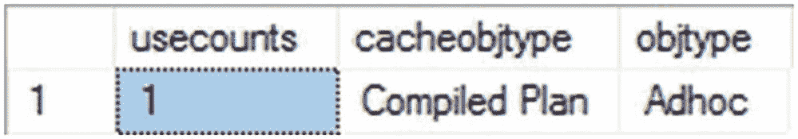

# 16. 执行计划缓存行为

一旦生成执行计划所需的所有处理工作完成，如果 SQL Server 在每次调用查询时都丢弃已完成的工作并全部重做，那将是疯狂的。相反，它将创建的计划保存在服务器上一个名为`计划缓存`的内存空间中。本章将介绍如何监控`计划缓存`，以了解 SQL Server 如何重用执行计划。

在本章中，我将涵盖以下主题：

*   如何分析执行计划缓存
*   查询计划哈希和查询哈希作为识别待优化查询的机制
*   提高执行计划缓存可重用性的方法
*   查询存储与`计划缓存`之间的交互

## 分析执行计划缓存

通过访问各种动态管理对象，你可以获取有关计划缓存中执行计划的大量信息。用于处理执行计划的初始动态管理对象是 `sys.dm_exec_cached_plans`。

```sql
SELECT decp.refcounts,
decp.usecounts,
decp.size_in_bytes,
decp.cacheobjtype,
decp.objtype,
decp.plan_handle
FROM sys.dm_exec_cached_plans AS decp;
```

表 16-1 展示了 `sys.dm_exec_cached_plans` 提供的一些有用信息。

表 16-1: `sys.dm_exec_cached_plans`

| **列名** | **描述** |
| --- | --- |
| `refcounts` | 表示缓存中引用此计划的其他对象的数量。 |
| `usecounts` | 表示自该对象添加到缓存以来被使用的次数。 |
| `size_in_bytes` | 表示存储在缓存中的计划的大小。 |
| `cacheobjtype` | 指定此计划的类型；有多种类型，但特别值得关注的有：已编译计划：一个完整的执行计划。已编译计划存根：用于即席查询的标记（你可以在本章的“即席工作负载”部分找到更多详细信息）。分析树：为访问视图而存储的计划。 |
| `objtype` | 表示生成此计划的对象类型。同样，有多种类型，但特别值得关注的有：`Proc`、`Prepared`、`Adhoc`、`View`。 |

单独使用动态管理视图 `sys.dm_exec_cached_plans` 只能让你获得一小部分信息。动态管理对象最好与其他动态管理对象及其他系统视图结合使用。例如，将动态管理函数 `sys.dm_exec_query_plan(plan_handle)` 与 `sys.dm_exec_cached_plans` 结合使用，还会返回 XML 执行计划本身，以便你可以显示并操作它。如果你再引入 `sys.dm_exec_sql_text(plan_handle)`，你还可以检索原始的查询文本。在运行本章示例中的已知查询时，这可能看起来没什么用，但当你转到生产系统并开始从缓存中提取执行计划时，拥有原始查询可能会很方便。要获取有关缓存计划的聚合性能指标，你可以对批处理使用 `sys.dm_exec_query_stats`，对存储过程和内联函数使用 `sys.dm_exec_procedure_stats`，对触发器使用 `sys.dm_exec_trigger_stats` 来返回相同的数据。除其他数据外，查询哈希和查询计划哈希也存储在此动态管理函数中。最后，要找到当前正在执行的查询的执行计划，你可以使用 `sys.dm_exec_requests`。

在以下部分中，我将通过实际查询这些动态管理对象来探讨计划缓存的工作原理。

## 执行计划重用

当提交一个查询时，SQL Server 会检查计划缓存中是否存在匹配的执行计划。如果未找到，SQL Server 将执行查询编译和优化以生成新的执行计划。然而，如果该计划存在于计划缓存中，它将与私有执行上下文一起被重用。这节省了原本将花费在计划生成上的 CPU 周期。如果某个计划不在缓存中，但该计划在查询存储中被标记为强制执行，则优化过程照常进行，但会使用强制计划（假设它仍然是有效计划）。

查询提交到 SQL Server 时通常带有筛选条件以限制结果集的大小。相同的查询通常会使用不同的筛选条件值重新提交。例如，考虑以下查询：

```sql
SELECT soh.SalesOrderNumber,
soh.OrderDate,
sod.OrderQty,
sod.LineTotal
FROM Sales.SalesOrderHeader AS soh
JOIN Sales.SalesOrderDetail AS sod
ON soh.SalesOrderID = sod.SalesOrderID
WHERE soh.CustomerID = 29690
AND sod.ProductID = 711;
```

当此查询被提交时，优化器会创建一个执行计划并将其保存在计划缓存中，以备将来重用。如果使用不同的筛选条件值重新提交此查询——例如 `soh.CustomerID = 29500`——重用先前提供的筛选条件值所创建的执行计划将是有益的（除非这是一个糟糕的参数嗅探场景）。为一个筛选条件值创建的执行计划是否可以重用于另一个筛选条件值，取决于查询是如何提交给 SQL Server 的。

提交到 SQL Server 的查询（或工作负载）可以大致分为两类，这两类决定了当查询的变量部分发生变化时，执行计划是否可重用。

*   即席查询

*   已参数化查询

### 提示

要测试本章中 `sys.dm_exec_cached_plans` 的输出，有时需要通过执行 `DBCC FREEPROCCACHE` 从缓存中删除计划。除非你按照这里概述的方法传递计划句柄，否则不要在生产服务器上运行此命令。否则，你将清空缓存，并在执行时要求重建所有执行计划，这会给你的生产系统带来严重压力，而且没有充分的理由。你可以使用 `DBCC FREEPROCCACHE(plan_handle)` 来针对特定计划。使用我已经讨论过并在后面演示的动态管理对象来检索 `plan_handle`。你也可以使用 `ALTER DATABASE SCOPED CONFIGURATION CLEAR PROCEDURE CACHE` 来清空单个数据库的缓存。然而，同样，除非你打算删除该数据库的所有计划，否则我不建议在生产服务器上运行此命令。

## 即席工作负载

查询可以在没有显式地将变量与查询分离的情况下提交到 SQL Server。这些在未显式地将查询的变量部分转换为参数的情况下执行的查询被称为*即席工作负载*（或查询）。到目前为止，本书中的大多数示例都是即席查询，例如前面的代码清单。

如果查询按原样提交，没有显式地将任何一个硬编码值转换为参数（可以在执行时提供给查询），那么该查询就是即席查询。使用 `DECLARE` 语句将值设置为局部变量与参数不同。

在此查询中，筛选条件值嵌入在查询本身中，没有被显式参数化以从查询中分离出来。这意味着你无法重用此查询的执行计划，除非你使用相同的值，并且所有的间距和回车符都完全相同。但是，查询中使用值的位置可以通过三种不同的方式进行显式参数化，这些方式被共同归类为已参数化工作负载。


### 预准备的工作负载

`预准备的工作负载`（或查询）显式地对查询的可变部分进行参数化，从而使得查询计划不依赖于可变部分的具体值。在 SQL Server 中，可以通过以下三种方法将查询作为预准备的工作负载提交：

*   `存储过程`：允许保存一组可以接受和返回用户提供参数的 SQL 语句。
*   `sp_executesql`：允许执行一条可能包含用户参数的 SQL 语句或 SQL 批处理，而无需保存该语句或批处理。
*   `Prepare/execute 模型`：允许 SQL 客户端请求生成一个查询计划，该计划可在后续使用不同参数值执行同一查询时重复使用，而无需在 SQL Server 中保存 SQL 语句。这是诸如 Entity Framework 之类的 ORM 工具最常见的做法。

例如，前面展示的 `SELECT` 语句可以通过存储过程显式地参数化，如下所示：

```sql
CREATE OR ALTER PROC dbo.BasicSalesInfo
@ProductID INT,
@CustomerID INT
AS
SELECT soh.SalesOrderNumber,
soh.OrderDate,
sod.OrderQty,
sod.LineTotal
FROM Sales.SalesOrderHeader AS soh
JOIN Sales.SalesOrderDetail AS sod
ON soh.SalesOrderID = sod.SalesOrderID
WHERE soh.CustomerID = @CustomerID
AND sod.ProductID = @ProductID;
```

该存储过程中包含的 `SELECT` 语句的计划将嵌入参数（`@ProductID` 和 `@Customerld`），而不是具体的变量值。我将在稍后更详细地介绍这些方法。

### 即席工作负载的计划可重用性

当查询作为即席工作负载提交时，SQL Server 会生成一个执行计划并将其存储在缓存中。如果相同的即席查询被再次提交，该计划可以被重用。由于没有参数，硬编码的值会作为计划的一部分存储。要使计划能从缓存中重用，T-SQL 语句必须完全匹配。这包括所有的空格、回车符以及计划附带的任何值。如果其中任何一项发生变化，计划就无法重用。

为了理解这一点，请考虑之前使用过的即席查询，如下所示：

```sql
SELECT  soh.SalesOrderNumber,
soh.OrderDate,
sod.OrderQty,
sod.LineTotal
FROM    Sales.SalesOrderHeader AS soh
JOIN    Sales.SalesOrderDetail AS sod
ON soh.SalesOrderID = sod.SalesOrderID
WHERE   soh.CustomerID = 29690
AND sod.ProductID = 711;
```

为此即席查询生成的执行计划基于查询的确切文本，包括注释、大小写、尾随空格和硬回车。你必须使用确切的文本来从 `sys.dm_exec_cached_plans` 中检索信息。

```sql
SELECT    c.usecounts
,c.cacheobjtype
,c.objtype
FROM       sys.dm_exec_cached_plans c
CROSS APPLY sys.dm_exec_sql_text(c.plan_handle) t
WHERE      t.text =  'SELECT  soh.SalesOrderNumber,
soh.OrderDate,
sod.OrderQty,
sod.LineTotal
FROM    Sales.SalesOrderHeader AS soh
JOIN    Sales.SalesOrderDetail AS sod
ON soh.SalesOrderID = sod.SalesOrderID
WHERE   soh.CustomerID = 29690
AND sod.ProductID = 711;';
```

图 16-1 显示了 `sys.dm_exec_cached_plans` 的输出。



图 16-1：`sys.dm_exec_cached_plans` 的输出

从图 16-1 中你可以看到，针对上述即席查询生成并保存了一个已编译的计划到计划缓存中。为了找到特定的查询，我在 `WHERE` 子句中使用了查询本身。你可以看到，到目前为止该计划已被使用了一次（`usecounts = 1`）。如果重新执行此即席查询，SQL Server 将重用计划缓存中现有的可执行计划，如图 16-2 所示。


图 16-2：从计划缓存中重用可执行计划

在图 16-2 中，你可以看到先前查询的可执行计划的 `usecounts` 值已增加到 2，这确认了该查询的现有计划已被重用。如果此查询被重复执行，每次都会重用现有的计划。

由于为前述查询生成的计划包含了筛选条件值，因此该计划的可重用性仅限于使用相同的筛选条件值。重新执行查询，但将 `son.CustomerlD` 改为 `29500`。

```sql
SELECT soh.SalesOrderNumber,
soh.OrderDate,
sod.OrderQty,
sod.LineTotal
FROM Sales.SalesOrderHeader AS soh
JOIN Sales.SalesOrderDetail AS sod
ON soh.SalesOrderID = sod.SalesOrderID
WHERE soh.CustomerID = 29500
AND sod.ProductID = 711;
```

现有的计划无法被重用，如果照原样重新运行 `sys.dm_exec_cached_plans`，你会发现执行计数没有增加（图 16-3）。


图 16-3：`sys.dm_exec_cached_plans` 显示现有计划未被重用

相反，我会调整对 `sys.dm_exec_cached_plans` 的查询。

```sql
SELECT  c.usecounts,
c.cacheobjtype,
c.objtype,
t.text,
c.plan_handle
FROM    sys.dm_exec_cached_plans c
CROSS APPLY sys.dm_exec_sql_text(c.plan_handle) t
WHERE   t.text LIKE 'SELECT  soh.SalesOrderNumber,
soh.OrderDate,
sod.OrderQty,
sod.LineTotal
FROM    Sales.SalesOrderHeader AS soh
JOIN    Sales.SalesOrderDetail AS sod
ON soh.SalesOrderID = sod.SalesOrderID%';
```

你可以在图 16-4 中看到此查询的输出。


图 16-4：`sys.dm_exec_cached_plans` 显示现有计划无法被重用

从图 16-4 的 `sys.dm_exec_cached_plans` 输出中，你可以看到查询之前的计划未被重用；相应的 `usecounts` 值保持在旧值 2。系统没有重用现有计划，而是为该查询生成了一个新计划，并以新的 `plan_handle` 保存在计划缓存中。如果使用不同的筛选条件值重复执行此即席查询，每次都会生成一个新的执行计划。这种对即席查询执行计划的低效重用，通过消耗额外的 CPU 周期来重新生成计划，从而增加了 CPU 的负载。

总而言之，即席计划缓存使用语句级缓存，并且仅限于精确的文本匹配。如果即席查询不复杂，SQL Server 可以通过一个称为 `简单参数化` 的功能隐式地对查询进行参数化，以提高计划的可重用性。简单参数化的查询定义仅限于非常基本的情况，例如仅涉及单个表的即席查询。如前面的示例所示，大多数需要连接操作的查询无法被自动参数化。


### 为即席工作负载优化

如果您的服务器主要支持即席查询，则有可能实现小幅度的性能改进。服务器上有一个选项称为 `optimize for ad hoc workloads`。在服务器上启用此选项会改变引擎处理即席查询的方式。第一次调用查询时，它不再保存完整的已编译计划，而是存储一个编译计划存根。该存根没有关联完整的执行计划，从而节省了其所需的存储空间以及保存到缓存的时间。此选项可以在不重新启动服务器的情况下启用。

```sql
EXEC sp_configure 'show advanced option', '1';
GO
RECONFIGURE
GO
EXEC sp_configure 'optimize for ad hoc workloads', 1;
GO
RECONFIGURE;
```

更改选项后，清空缓存，然后重新运行即席查询。修改针对 `sys.dm_exec_cached_plans` 的查询，使其包含 `size_in_bytes` 列；然后运行它，结果如图 16-5 所示。


图 16-5
`sys.dm_exec_cached_plans` 显示编译计划存根

图 16-5 中的 `cacheobjtype` 列显示缓存中的新对象是一个编译计划存根。与完整的编译计划相比，可以为更多的查询创建存根，对服务器的影响更小。但当下一次执行即席查询时，将创建一个完整的编译计划。要查看此效果，请再运行一次查询，并检查 `sys.dm_exec_cached_plans` 中的结果，如图 16-6 所示。


图 16-6
编译计划存根已变为编译计划

检查 `cacheobjtype` 的值。它已从 `Compiled Plan Stub` 变为 `Compiled Plan`。最后，要查看存根与完整计划之间的真正区别，请查看图 16-5 和图 16-6 中的 `size_in_bytes` 列。大小从存根中的 424 变为完整计划中的 73728。这精确地显示了处理大量即席查询时节省的资源。在继续之前，请确保禁用 `optimize for ad hoc workloads`。

```sql
EXEC sp_configure 'optimize for ad hoc workloads', 0;
GO
RECONFIGURE;
GO
EXEC sp_configure 'show advanced option', '0';
GO
RECONFIGURE;
```

就个人而言，我认为在几乎任何系统上实施此选项都没有什么缺点。与所有建议一样，您应该进行测试以确保您的系统没有例外情况。然而，与通过不存储那些只会被使用一次的计划所获得的整体内存节省相比，在第二次调用时将计划写入内存的成本是微不足道的。根据我所有的测试和经验，这是一个纯收益，缺点很小。您现在还可以使用数据库范围内的配置设置在 Azure SQL Database 中启用此功能：

```sql
ALTER DATABASE SCOPED CONFIGURATION SET OPTIMIZE_FOR_AD_HOC_WORKLOADS = ON;
```

#### 简单参数化

当提交即席查询时，SQL Server 会分析查询以确定传入文本的哪些部分可能是参数。它会查看即席查询的可变部分，以确定是否可以安全地自动对它们进行参数化，并在查询中使用参数（而不是可变部分），从而使查询计划可以独立于变量值。这种自动将查询的可变部分转换为参数的功能（即使没有显式参数化，使用的是预加载工作负载技术）称为 `简单参数化`。

在简单参数化期间，SQL Server 确保如果即席查询被转换为参数化模板，参数值的变化不会广泛改变计划需求。确定简单参数化安全后，SQL Server 为即席查询创建一个参数化模板，并将参数化计划保存在计划缓存中。

要理解 SQL Server 的简单参数化功能，请考虑以下查询：

```sql
SELECT *
FROM Person.Address AS a
WHERE a.AddressID = 42;
```

当提交此即席查询时，SQL Server 可以按原样处理此查询以进行计划创建。但是，在查询执行之前，SQL Server 会尝试确定是否可以安全地对其进行参数化。在确定查询的可变部分可以在不影响查询基本结构的情况下进行参数化后，SQL Server 会对查询进行参数化，并为参数化查询生成计划。您可以从图 16-7 所示的 `sys.dm_exec_cached_plans` 输出中观察到这一点。


图 16-7
`sys.dm_exec_cached_plans` 输出显示自动参数化计划

参数化查询的可执行计划的 `usecounts` 恰当地将重用次数表示为 1。另外，请注意，自动参数化可执行计划的 `objtype` 不再是 `Adhoc`；它反映了该计划是用于参数化查询的事实，即 `Prepared`。

原始的即席查询即使没有执行，也会被编译以创建简单参数化所需的查询树。即席查询的编译计划将保存在计划缓存中。但在为即席查询创建可执行计划之前，SQL Server 发现自动参数化是安全的，因此自动对查询进行了参数化以进行进一步处理。

参数值基于即席查询的值。让我们编辑之前的查询以使用不同的 `AddressID` 值。

```sql
SELECT *
FROM Person.Address AS a
WHERE a.AddressID = 42000;
```

如果我们重新查询 `sys.dm_exec_cached_plans`，我们将看到已添加了一个额外的计划，如图 16-8 所示。


图 16-8
具有简单参数化的附加计划

如图 16-8 所示，已创建了一个具有 `int` 数据类型参数的新计划。您可能会看到 `smallint` 和 `bigint` 的计划。这确实给缓存增加了一些开销，但不如因各种不同值而需要大量额外计划所带来的开销那么大。以下是简单参数化的完整查询文本：

```sql
(@1 int)SELECT * FROM [Person].[Address] [a] WHERE [a].[AddressID]=@1
```

由于此即席查询已自动参数化，如果您使用可变部分的不同值重新执行查询，SQL Server 将重用现有的执行计划。

```sql
SELECT *
FROM Person.Address AS a
WHERE a.AddressID = 52;
```

图 16-9 显示了 `sys.dm_exec_cached_plans` 的输出。


