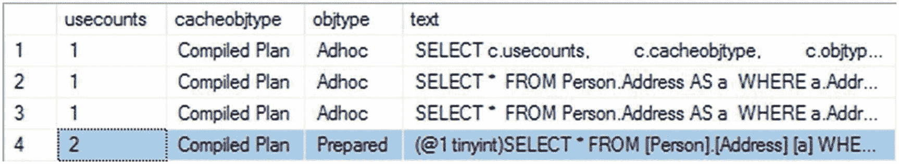
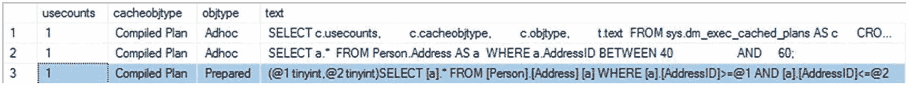
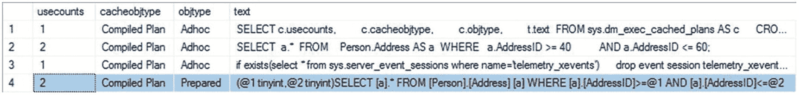
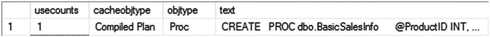
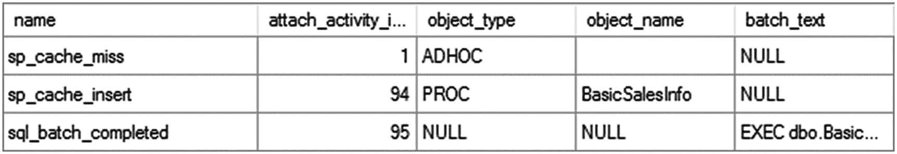
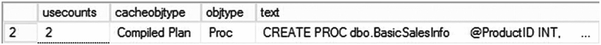
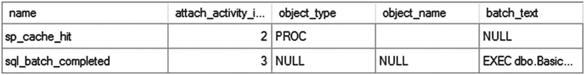
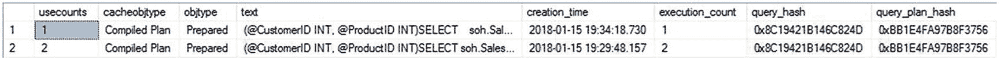
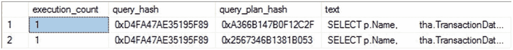
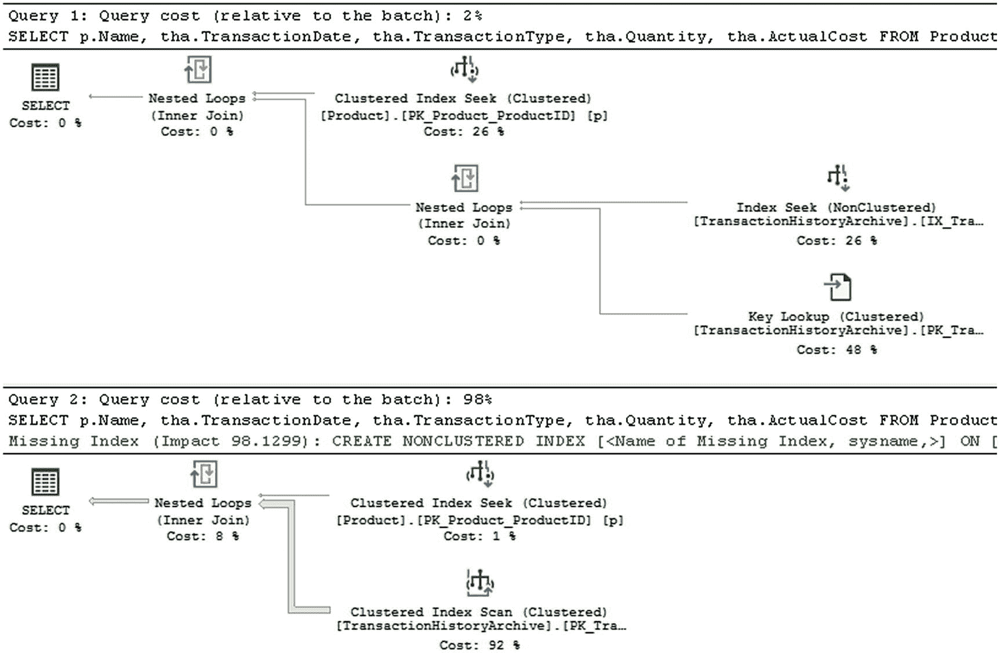

# 16.3.2 简单参数化与执行计划重用



**图 16-9**
`sys.dm_exec_cached_plans` 输出显示自动参数化计划的重用

从图 16-9 可以看出，尽管为这个即席查询生成了一个新计划（即使用 `Addressld` 值为 52 的那个），但现有的预备计划被重用了，这由相应的 `usecounts` 值增加到 2 所表明。即席查询可以使用不同的筛选条件值反复执行，重用现有的执行计划——尽管两个查询的原始文本并不匹配。因为它们参数化后的查询会是相同的，所以得以重用。

关于缓存执行计划的参数化查询，还有另一点需要注意。在图 16-7 中，观察参数化查询的主体与提交的即席查询主体并不完全匹配。例如，在即席查询中，任何对象上都没有方括号。

意识到即席查询可以安全地进行自动参数化后，SQL Server 会选择一个模板来替代查询的确切文本。

为了理解这一点的重要性，请考虑以下查询：

```sql
SELECT  a.*
FROM    Person.Address AS a
WHERE   a.AddressID BETWEEN 40 AND 60;
```

图 16-10 显示了 `sys.dm_exec_cached_plans` 的输出。



**图 16-10**
`sys.dm_exec_cached_plans` 输出显示使用模板的简单参数化

从图 16-10 可以看出，SQL Server 对查询执行了简化过程，并用一对 `>=` 和 `<=` 操作符替代了 `BETWEEN` 操作符，它们是等价的。然后，参数化步骤再次修改了查询。这意味着，如果没有提交前面使用 `BETWEEN` 子句的即席查询，而是提交了一个使用一对 `>=` 和 `<=` 的类似查询，SQL Server 也能够重用现有的执行计划。为了确认此行为，让我们按如下方式修改即席查询：

```sql
SELECT  a.*
FROM    Person.Address AS a
WHERE   a.AddressID >= 40
AND a.AddressID <= 60;
```

图 16-11 显示了 `sys.dm_exec_cached_plans` 的输出。



**图 16-11**
`sys.dm_exec_cached_plans` 输出显示自动参数化计划的重用

从图 16-11 可以看出，现有的计划被重用了，即使该查询在语法上与之前执行的查询不同。SQL Server 生成的自动参数化计划不仅允许在使用不同变量值重新提交查询时重用现有计划，也允许查询具有相同模板形式时重用。

#### 简单参数化的限制

SQL Server 在简单参数化过程中非常保守，因为一个糟糕的计划的成本可能远远超过生成一个新计划的成本。这种保守方法可以防止 SQL Server 创建不安全的自动参数化计划。因此，简单参数化仅限于相当简单的情况，例如只涉及单个表的即席查询。涉及两个（或更多）表之间联接操作的即席查询（如“即席工作负载的计划可重用性”一节前面所示）则被认为不适合进行简单参数化。

在一个可扩展的系统中，不要依赖简单参数化来实现计划重用。SQL Server 的简单参数化功能只是对哪些变量和常量可以进行参数化做出有根据的猜测。与其依赖 SQL Server 进行简单参数化，不如在构建应用程序时以编程方式明确指定参数化。


#### 强制参数化

如果你正在处理的系统主要由即席查询组成，你可能希望尝试增加接受参数化的查询数量。你可以修改一个数据库，尝试在特定限制下强制所有查询都进行参数化，就像简单参数化一样。

为此，你需要使用 `ALTER DATABASE` 将数据库选项 `PARAMETERIZATION` 更改为 `FORCED`，如下所示：

```
ALTER DATABASE AdventureWorks2017 SET PARAMETERIZATION FORCED;
```

但是，如果你的查询有任何复杂之处，你将不会获得简单参数化。

```
SELECT ea.EmailAddress,
e.BirthDate,
a.City
FROM Person.Person AS p
JOIN HumanResources.Employee AS e
ON p.BusinessEntityID = e.BusinessEntityID
JOIN Person.BusinessEntityAddress AS bea
ON e.BusinessEntityID = bea.BusinessEntityID
JOIN Person.Address AS a
ON bea.AddressID = a.AddressID
JOIN Person.StateProvince AS sp
ON a.StateProvinceID = sp.StateProvinceID
JOIN Person.EmailAddress AS ea
ON p.BusinessEntityID = ea.BusinessEntityID
WHERE ea.EmailAddress LIKE 'david%'
AND sp.StateProvinceCode = 'WA';
```

当你运行这个查询时，简单参数化不会被应用，正如你在图 16-12 中看到的那样。


图 16-12
更复杂的查询不会被参数化

在 `sys.dm_exec_cached_plans` 的输出中看不到任何预备计划。但是，如果我们使用之前的脚本将 `PARAMETERIZATION` 设置为 `FORCED`，我们可以在清除缓存后重新运行查询。

```
ALTER DATABASE SCOPED CONFIGURATION CLEAR PROCEDURE_CACHE;
```

`sys.dm_exec_cached_plans` 的输出发生了变化，看起来不同了，如图 16-13 所示。


图 16-13
强制参数化改变了执行计划

现在在第三行可以看到一个预备计划。然而，只提供了一个参数 `@0 varchar(8000)`。如果你从 `sys.dm_exec_querytext` 中获取预备计划的完整文本并进行格式化，它看起来像这样：

```
(@0 varchar(8000))
SELECT  ea.EmailAddress,
e.BirthDate,
a.City
FROM    Person.Person AS p
JOIN    HumanResources.Employee AS e
ON p.BusinessEntityID = e.BusinessEntityID
JOIN    Person.BusinessEntityAddress AS bea
ON e.BusinessEntityID = bea.BusinessEntityID
JOIN    Person.Address AS a
ON bea.AddressID = a.AddressID
JOIN    Person.StateProvince AS sp
ON a.StateProvinceID = sp.StateProvinceID
JOIN    Person.EmailAddress AS ea
ON p.BusinessEntityID = ea.BusinessEntityID
WHERE   ea.EmailAddress LIKE 'david%'
AND sp.StateProvinceCode = @0
```

由于其限制，强制参数化无法替换字符串 `'david%'`，但它能够替换字符串 `'WA'`。值得注意的是，该变量被声明为完整的 8,000 长度 `VARCHAR`，而不是像 `Person.StateProvince` 表中实际列那样的三字符 `NCHAR`。即使此处的参数值可能与数据库中的实际列值不同，这也不会导致索引使用丢失。字符串长度的隐式数据转换，例如从 `VARCHAR(8000)` 到 `VARCHAR(8)`，不会引起问题。

在你开始使用强制参数化之前，以下限制列表可能会提供信息来帮助你决定强制参数化是否适用于你的数据库。（这是一个部分列表；完整列表请查阅在线手册。）

*   `INSERT ... EXECUTE` 查询
*   存储过程、触发器和用户定义函数内部的语句，因为它们已经有执行计划
*   客户端预备语句（本章后面将详细介绍）
*   带有查询提示 `RECOMPILE` 的查询
*   `LIKE` 语句中使用的模式和转义子句参数（如前面所示）

这让你了解了强制参数化所面临的限制类型。强制参数化可能只有在由于即席查询而导致大量编译和重编译时才会有帮助。任何其他负载都不会从使用强制参数化中受益。

在继续之前，将数据库改回 `SIMPLE PARAMETERIZATION`。

```
ALTER DATABASE AdventureWorks2017 SET PARAMETERIZATION SIMPLE;
```

关于参数化另一个值得提及的主题是 Azure SQL Database 如何处理这个问题。如果一个查询被定期重新编译但总是获得相同的执行计划，你可能会在 Azure 中看到一个调优建议，建议你开启 `FORCED PARAMETERIZATION`。这是我将在第 25 章详细介绍的自动调优建议的一个方面。

### 准备好的工作负载的计划重用性

将查询定义为准备好的工作负载允许显式地对查询的可变部分进行参数化。这使得 SQL Server 能够生成一个不绑定到查询可变部分的查询计划，并将可变部分保留在单独的执行上下文中。正如你在上一节中看到的，SQL Server 支持三种提交准备好的工作负载的技术。

*   存储过程
*   `sp_executesql`
*   Prepare/execute 模型

在接下来的部分中，我将更深入地介绍这些技术中的每一种，并指出参数化执行计划可能在哪些地方导致问题。

#### 存储过程

使用存储过程是提高计划缓存有效性的标准技术。当存储过程在执行时编译（对于本机编译过程则不同，这将在第 24 章中介绍），会为存储过程中的每个 SQL 语句生成一个计划。为存储过程生成的执行计划可以在使用不同参数值重新执行该存储过程时重复使用。

除了检查 `sys.dm_exec_cached_plans`，您还可以使用扩展事件工具跟踪存储过程的执行计划缓存。扩展事件提供了表 16-2 中列出的事件来跟踪存储过程的计划缓存。

表 16-2

用于分析存储过程计划缓存的事件类

| 事件 | 描述 |
| --- | --- |
| `sp_cache_hit` | 在缓存中找到计划。 |
| `sp_cache_miss` | 在缓存中未找到计划。 |
| `sp_cache_insert` | 当计划被添加到缓存时触发该事件。 |
| `sp_cache_remove` | 当计划从缓存中移除时触发该事件。 |

要使用跟踪事件跟踪存储过程计划缓存，您可以将这些事件与其他存储过程事件一起使用。为了理解存储过程如何改进计划缓存，请重新检查前面创建的名为 `BasicSalesInfo` 的过程。为清晰起见，此处重复该过程：

```sql
CREATE OR ALTER PROC dbo.BasicSalesInfo
@ProductID INT,
@CustomerID INT
AS
SELECT soh.SalesOrderNumber,
soh.OrderDate,
sod.OrderQty,
sod.LineTotal
FROM Sales.SalesOrderHeader AS soh
JOIN Sales.SalesOrderDetail AS sod
ON soh.SalesOrderID = sod.SalesOrderID
WHERE soh.CustomerID = @CustomerID
AND sod.ProductID = @ProductID;
```

要为 `soh.Customerld = 29690` 和 `sod.ProductId=711` 检索结果集，您可以像这样执行存储过程：

```sql
EXEC dbo.BasicSalesInfo @CustomerID = 29690, @ProductID = 711;
```

图 16-14 显示了 `sys.dm_exec_cached_plans` 的输出。



图 16-14

显示存储过程计划缓存的 `sys.dm_exec_cached_plans` 输出

从图 16-14 可以看到，生成了一个类型为 `Proc` 的已编译计划并为存储过程缓存。由于存储过程仅执行了一次，可执行计划的 `usecounts` 值为 1。

图 16-15 显示了此存储过程执行的扩展事件输出。



图 16-15

显示存储过程计划不易在缓存中找到的扩展事件输出

从扩展事件输出中，您可以看到存储过程的计划未在缓存中找到。当第一次执行存储过程时，SQL Server 在计划缓存中查找，但未能找到过程 `BasicSalesInfo` 的任何缓存条目，从而导致 `sp_cache_miss` 事件。由于未找到缓存的计划，SQL Server 会安排编译该存储过程。随后，SQL Server 生成并保存计划，然后继续执行存储过程。您可以在 `sp_cache_insert` 事件中看到这一点。

如果重新执行此存储过程以检索 `@Productld = 777` 的结果集，则会重用现有计划，如图 16-16 中的 `sys.dm_exec_cached_plans` 输出所示。



图 16-16

显示存储过程计划重用的 `sys.dm_exec_cached_plans` 输出

```sql
EXEC dbo.BasicSalesInfo @CustomerID = 29690, @ProductID = 777;
```

您也可以从扩展事件输出中确认执行计划的重用，如图 16-17 所示。



图 16-17

显示存储过程计划重用的 Profiler 跟踪输出

从扩展事件输出中，您可以看到在计划缓存中找到了现有计划。在搜索缓存时，SQL Server 找到了存储过程 `BasicSalesInfo` 的可执行计划，从而导致 `sp_cache_hit` 事件。一旦找到现有的执行计划，SQL 就会重用该计划来执行存储过程。一个值得注意的有趣现象是，在 `sp_cache_hit` 之前正好有一个 `sp_cache_miss` 事件，该事件是针对调用该过程的 SQL 批处理的。由于参数值的更改，该语句未在缓存中找到，但过程的执行计划找到了。这个看似“额外”的缓存未命中事件可能会引起混淆。

存储过程的其他方面也值得考虑：

*   存储过程在首次执行时编译。
*   存储过程具有其他性能优势，例如减少网络流量。
*   存储过程具有额外优势，例如数据隔离。

### 存储过程在首次执行时编译

存储过程的执行计划在首次执行时生成。创建存储过程时，它仅被解析并保存在数据库中。在存储过程创建期间不执行规范化和优化过程。这允许在创建存储过程所访问的所有对象之前创建存储过程。例如，即使存储过程中引用的表 `NotHere` 不存在，您也可以创建以下存储过程：

```sql
CREATE OR ALTER PROCEDURE dbo.MyNewProc
AS
SELECT MyID
FROM dbo.NotHere; --Table dbo.NotHere doesn't exist
```

存储过程将成功创建，因为在存储过程创建期间不执行将引用的对象绑定到查询树（在存储过程执行期间由命令解析器生成）的规范化过程。如果到那时尚未创建表 `NotHere`，存储过程将在第一次执行时报告错误，因为存储过程在第一次执行时编译。

### 存储过程的其他性能优势

除了通过执行计划可重用性来提升性能外，存储过程还提供以下性能优势：

- **业务逻辑贴近数据**：对数据库中存储的数据执行大量操作的业务逻辑部分，应当置于存储过程中，因为 `SQL Server` 的引擎对于关系型和集合论操作极为强大。

- **减少网络流量**：数据库应用程序仅通过网络发送存储过程的名称和参数值。只有处理后的结果集才会被返回给应用程序。中间数据无需在应用程序和数据库之间来回传递。

- **应用程序与数据结构变更隔离**：如果所有关键的数据访问都通过存储过程进行，那么当数据库架构发生变化时，可以重新创建存储过程，而不影响通过这些存储过程访问数据的应用程序代码。实际上，甚至无需停止访问数据库的应用程序。

- **存在单一管理点**：所有在存储过程中实现的业务逻辑都作为数据库的一部分进行维护，并可以在数据库本身上进行集中管理。当然，这个优势具有高度的相对性，取决于你问的是谁。要获得不同的意见，请问问非 `DBA` 人员！

- **可以增强安全性**：可以对数据库表的用户权限进行限制，并仅允许通过存储过程中实现的标准业务逻辑来执行。例如，如果你想限制用户 `UserOne` 从表 `RestrictedAccess` 中物理删除行，并仅允许其通过存储过程 `MarkDeleted`，将行的状态设置为 `'Deleted'` 来虚拟标记删除，那么你可以按如下方式执行 `DENY` 和 `GRANT` 命令：

```sql
DROP TABLE IF EXISTS dbo.RestrictedAccess;
GO
CREATE TABLE dbo.RestrictedAccess (ID INT,
Status VARCHAR(7));
INSERT INTO dbo.RestrictedAccess
VALUES (1, 'New');
GO
IF (SELECT OBJECT_ID('dbo.MarkDeleted')) IS NOT NULL
DROP PROCEDURE dbo.MarkDeleted;
GO
CREATE PROCEDURE dbo.MarkDeleted @ID INT
AS
UPDATE dbo.RestrictedAccess
SET Status = 'Deleted'
WHERE ID = @ID;
GO
--防止用户 u1 删除行
DENY DELETE ON dbo.RestrictedAccess TO  UserOne;
--允许用户 u1 将行标记为“已删除”
GRANT EXECUTE ON dbo.MarkDeleted TO UserOne;
```

这假设了用户 `UserOne` 的存在。请注意，如果存储过程 `MarkDeleted` 中的查询是动态构建为字符串（`@SQL`）的，如下所示，那么授予存储过程的权限将不会授予该查询任何权限，因为动态查询不被视为存储过程的一部分：

```sql
CREATE OR ALTER PROCEDURE dbo.MarkDeleted @ID INT
AS
DECLARE @SQL NVARCHAR(MAX);
SET @SQL = 'UPDATE  dbo.RestrictedAccess
SET     Status = "Deleted"
WHERE   ID = ' + @ID;
EXEC sys.sp_executesql @SQL;
GO
GRANT EXECUTE ON dbo.MarkDeleted TO UserOne;
```

因此，用户 `UserOne` 将无法使用存储过程 `MarkDeleted` 将行标记为 `'Deleted'`。（我将在下一章介绍在存储过程中使用动态查询的各个方面。）但是，如果该用户拥有明确的权限或授予该执行权限的角色成员身份，这种方法就行不通了。

由于存储过程是作为数据库对象保存的，它们给数据库管理增加了部署和管理开销。很多时候，你可能只需要从应用程序中执行一条或几条查询。如果这些单例查询频繁执行，你应该致力于重用它们的执行计划以提高性能。但是为这些单独的单例查询创建存储过程，会在数据库中增加大量的存储过程，从而显著增加数据库管理开销。为了避免使用存储过程的维护开销，同时又能获得计划重用的好处，可以使用系统存储过程 `sp_executesql` 将单例查询作为预处理的工作负载提交。


### sp_executesql

`sp_executesql` 是一个系统存储过程，它提供了一种将一个或多个查询作为预处理工作负载提交的机制。它允许显式参数化查询中的可变部分，因此可以提供与存储过程一样有效的执行计划重用性。下面展示了如何通过 `sp_executesql` 提交来自 `BasicSalesInfo` 的 `SELECT` 语句：

```sql
DECLARE @query NVARCHAR(MAX),
        @paramlist NVARCHAR(MAX);
SET @query
= N'SELECT soh.SalesOrderNumber,
          soh.OrderDate,
          sod.OrderQty,
          sod.LineTotal
   FROM Sales.SalesOrderHeader AS soh
   JOIN Sales.SalesOrderDetail AS sod
     ON soh.SalesOrderID = sod.SalesOrderID
   WHERE soh.CustomerID = @CustomerID
     AND sod.ProductID = @ProductID';
SET @paramlist = N'@CustomerID INT, @ProductID INT';
EXEC sp_executesql @query,
                   @paramlist,
                   @CustomerID = 29690,
                   @ProductID = 711;
```

请注意，传递给 `sp_executesql` 存储过程的字符串被声明为 `NVARCHAR` 类型，并且在构建时带有 `N` 前缀。这是必需的，因为 `sp_executesql` 将 Unicode 字符串作为输入参数。

`sys.dm_exec_cached_plans` 的输出如下所示（参见图 16-18）：


```sql
SELECT c.usecounts,
       c.cacheobjtype,
       c.objtype,
       t.text
FROM sys.dm_exec_cached_plans AS c
CROSS APPLY sys.dm_exec_sql_text(c.plan_handle) AS t
WHERE text LIKE '(@CustomerID%';
```

在图 16-18 中，您可以看到计划是为通过 `sp_executesql` 提交的查询的参数化部分生成的。由于该计划不绑定到查询的可变部分，因此如果使用不同的参数值（例如 `@ProductID=777`）重新提交此查询，就可以重用现有的执行计划，如下所示：

```sql
EXEC sp_executesql @query, @paramlist, @CustomerID = 29690, @ProductID = 777;
```

图 16-19 显示了 `sys.dm_exec_cached_plans` 的输出。


从图 16-19 可以看到，当使用不同的变量值重新提交查询时，现有计划被重用（第 2 行的计划的 `usecounts` 为 2）。如果此查询使用可变部分的不同值多次重新提交，现有的执行计划可以被重用，而无需重新生成新的执行计划。

为其创建计划的查询（`text` 列）与通过 `sp_executesql` 提交的参数化查询的文本字符串完全匹配。因此，如果相同的查询从应用程序的不同部分提交，请确保在所有地方使用相同的文本字符串。例如，如果相同的查询以查询字符串的微小修改（比如使用小写字母代替大写字母）重新提交，则不会重用现有计划，而是会创建一个新计划，如图 16-20 中的 `sys.dm_exec_cached_plans` 输出所示。


```sql
SET @query = N'SELECT    soh.SalesOrderNumber ,
                         soh.OrderDate ,
                         sod.OrderQty ,
                         sod.LineTotal
               FROM       Sales.SalesOrderHeader AS soh
               JOIN       Sales.SalesOrderDetail AS sod
                 ON       soh.SalesOrderID = sod.SalesOrderID
               where      soh.CustomerID = @CustomerID
                 AND      sod.ProductID = @ProductID' ;
```

另一种查看缓存中创建了两个不同计划的方法是使用其他动态管理对象来查看缓存中计划的属性。

```sql
SELECT  decp.usecounts,
        decp.cacheobjtype,
        decp.objtype,
        dest.text,
        deqs.creation_time,
        deqs.execution_count,
        deqs.query_hash,
        deqs.query_plan_hash
FROM    sys.dm_exec_cached_plans AS decp
CROSS APPLY sys.dm_exec_sql_text(decp.plan_handle) AS dest
JOIN    sys.dm_exec_query_stats AS deqs
  ON    decp.plan_handle = deqs.plan_handle
WHERE   dest.text LIKE '(@CustomerID INT, @ProductID INT)%' ;
```

图 16-21 显示了此查询的结果。



`sys.dm_exec_query_stats` 的输出显示查询的两个版本具有不同的 `creation_time` 值。更有趣的是，它们具有相同的 `query_hash` 值但不同的 `query_plan_hash` 值（关于这些哈希值将在后面章节详述）。所有这些都表明，更改大小写会导致存储在缓存中的执行计划不同。

通常，使用 `sp_executesql` 来显式参数化查询，以便在使用可变部分的不同值重新提交查询时，其执行计划可以重用。这提供了可重用计划的性能优势，而没有管理任何持久对象（如存储过程所要求的）的开销。此功能通过 `SQLExecDirect` 和 `ICommandWithParameters` 分别由 ODBC 和 OLEDB 公开。与 .NET 开发人员或 [ADO.NET](http://ado.net)（ADO 2.7 或更新版本）用户一样，您可以使用 ADO `Command` 和 `Parameters` 提交前面的 `SELECT` 语句。如果您将 ADO `Command Prepared` 属性设置为 `FALSE` 并使用 ADO `Command`（例如 `('SELECT * FROM "Order Details" d, Orders o WHERE d.OrderID=o.OrderID and d.ProductID=?)'`）以及 ADO `Parameters`，那么 [ADO.NET](http://ado.net) 将使用 `sp_executesql` 发送 `SELECT` 语句。大多数对象关系映射工具，如 nHibernate 或 Entity Framework，也具有允许准备语句和使用参数的机制。

最后，如果您必须像之前那样通过字符串构建查询，请务必使用参数。当您传入参数时，无论使用哪种方法，请确保您使用的是强类型参数，并将这些参数作为参数在您的 T-SQL 语句中使用。所有这些都将有助于避免 SQL 注入攻击。

除了参数之外，`sp_executesql` 每次重新执行查询时都会通过网络发送整个查询字符串。您可以通过使用 ODBC 和 OLEDB（或 OLEDB .NET）的准备/执行模型来避免这一点。

### 准备/执行模型

ODBC 和 OLEDB 提供了一个准备/执行模型，用于将查询作为预处理工作负载提交。与 `sp_executesql` 类似，此模型允许显式参数化查询的可变部分。准备阶段允许 SQL Server 为查询生成执行计划，并将执行计划的句柄返回给应用程序。该执行计划句柄由执行阶段用于使用不同的参数值执行查询。此模型只能用于通过 ODBC 或 OLEDB 提交查询，它不能在 SQL Server 内部使用——存储过程内的查询无法使用此模型执行。

SQL Server ODBC 驱动程序提供了 `SQLPrepare` 和 `SQLExecute` API 来支持准备/执行模型。SQL Server OLEDB 提供程序通过 `ICommandPrepare` 接口公开此模型。[ADO.NET](http://ado.net) 的 OLEDB .NET 提供程序的行为类似。

### 注意

有关如何在数据库应用程序中使用准备/执行模型的详细说明，请参阅 MSDN 文章 “SqlCommand.Prepare Method”（ [`http://bit.ly/2DBzN4b`](http://bit.ly/2DBzN4b) ）。


## 查询计划哈希与查询哈希

在 SQL Server 2008 中，引入了围绕执行计划和缓存的新功能，称为 `查询计划哈希` 和 `查询哈希`。这些是二进制对象，通过对查询或查询计划应用算法来生成二进制哈希值。这对于开发中一种常见的做法——*复制粘贴*——非常有用。你会发现通用的模式和实践会在整个代码中重复出现。在最好的情况下，这是一件好事，因为你看到的最佳类型的查询、联接、基于集合的操作等，会根据需要从一个过程复制到另一个过程。但有时，你会看到最糟糕的实践在你的代码中一遍又一遍地重复。这正是 `查询哈希` 和 `查询计划哈希` 发挥作用、为你提供帮助的地方。

你可以从 `sys.dm_exec_query_stats` 或 `sys.dm_exec_requests` 中检索 `查询计划哈希` 和 `查询哈希`。你也可以从查询存储中获取这些哈希值。尽管这是一种识别查询及其计划的机制，但哈希值并非唯一。不同的计划可能得到相同的哈希值，因此你不能依赖它作为替代主键。

要查看实际运行的哈希值，请创建两个查询。

```sql
SELECT *
FROM Production.Product AS p
JOIN Production.ProductSubcategory AS ps
ON p.ProductSubcategoryID = ps.ProductSubcategoryID
JOIN Production.ProductCategory AS pc
ON ps.ProductCategoryID = pc.ProductCategoryID
WHERE pc.Name = 'Bikes'
AND ps.Name = 'Touring Bikes';
SELECT *
FROM Production.Product AS p
JOIN Production.ProductSubcategory AS ps
ON p.ProductSubcategoryID = ps.ProductSubcategoryID
JOIN Production.ProductCategory AS pc
ON ps.ProductCategoryID = pc.ProductCategoryID
where pc.Name = 'Bikes'
and ps.Name = 'Road Bikes';
```

请注意，两个查询之间唯一的实质性区别在于 `ProductSubcategory.Name` 的值不同，一个是 `Touring Bikes`，另一个是 `Road Bikes`。同时，请注意第二个查询中的 `WHERE` 和 `AND` 关键字是小写的。执行这两个查询后，你可以通过以下查询从 `sys.dm_exec_query_stats` 中看到这些格式变化的结果，如图 16-22 所示：


图 16-22: `sys.dm_exec_query_stats` 显示计划哈希值

```sql
SELECT deqs.execution_count,
deqs.query_hash,
deqs.query_plan_hash,
dest.text
FROM sys.dm_exec_query_stats AS deqs
CROSS APPLY sys.dm_exec_sql_text(deqs.plan_handle) AS dest
WHERE dest.text LIKE 'SELECT *
FROM Production.Product AS p%';
```

创建了两个不同的计划，因为这些不是参数化查询；它们过于复杂，无法被视为简单参数化，并且强制参数化是关闭的。这两个计划的哈希值相同，因为它们仅在传递的值上有所不同。大小写的差异对于 `查询哈希` 或 `查询计划哈希` 值并不重要。但是，如果你更改了 `SELECT` 条件，那么从 `sys.dm_exec_query_stats` 中检索到的值将如图 16-23 所示，查询将发生变化。


图 16-23: `sys.dm_exec_query_stats` 显示不同的哈希值

```sql
SELECT  p.ProductID
FROM    Production.Product AS p
JOIN    Production.ProductSubcategory AS ps
ON p.ProductSubcategoryID = ps.ProductSubcategoryID
JOIN    Production.ProductCategory AS pc
ON ps.ProductCategoryID = pc.ProductCategoryID
WHERE   pc.[Name] = 'Bikes'
AND ps.[Name] = 'Touring Bikes';
```

尽管查询的基本结构相同，但返回列的更改足以改变 `查询哈希` 值和 `查询计划哈希` 值。

由于数据分布和索引的差异可能导致相同的查询产生两个不同的计划，因此 `query_hash` 可以相同，而 `query_plan_hash` 可以不同。为了说明这一点，请执行两个新的查询。

```sql
SELECT p.Name,
tha.TransactionDate,
tha.TransactionType,
tha.Quantity,
tha.ActualCost
FROM Production.TransactionHistoryArchive AS tha
JOIN Production.Product AS p
ON tha.ProductID = p.ProductID
WHERE p.ProductID = 461;
SELECT p.Name,
tha.TransactionDate,
tha.TransactionType,
tha.Quantity,
tha.ActualCost
FROM Production.TransactionHistoryArchive AS tha
JOIN Production.Product AS p
ON tha.ProductID = p.ProductID
WHERE p.ProductID = 712;
```

与之前使用的原始查询类似，这些查询仅在传递给 `ProductID` 列的值上有所不同。运行这两个查询后，你可以从 `sys.dm_exec_query_stats` 中选择数据以查看哈希值（图 16-24）。


图 16-24: `query_plan_hash` 的差异

你可以看到 `query_hash` 值是相同的，但 `query_plan_hash` 值不同。这是因为基于传递值的统计信息所创建的执行计划差异很大，如图 16-25 所示。


图 16-25: 不同的参数导致截然不同的计划

`查询计划哈希` 和 `查询哈希` 值可以是用于追踪不同查询之间常见问题的有用工具，但正如你所看到的，它们不可能在每种情况下都检索到一组准确的信息。它们确实为识别其他可能存在的查询性能问题的位置增添了另一个有用的工具。它们也可以用于跟踪随时间变化的执行计划。你可以在将查询部署到生产环境后捕获其 `query_plan_hash`，然后随时间观察它是否因数据更改而发生变化。借此，你还可以通过计划跟踪聚合的查询统计信息，参考 `sys.dm_exec_querystats`，但请记住，聚合数据在服务器重启或以任何方式清除计划缓存时会被重置。然而，查询存储中的相同信息会通过备份、服务器重启、清除计划缓存等方式持久保存。在调优查询时，请记住这些工具。

## 执行计划缓存建议

计划缓存的基本目的是通过重用执行计划来提高性能。因此，确保你的执行计划真正可重用至关重要。由于即席查询的计划重用效率低下，通常建议尽可能依赖预处理的负载技术。为确保高效使用计划缓存，请遵循以下建议：

*   显式参数化查询的可变部分。
*   使用存储过程来实现业务功能。
*   使用 `sp_executesql` 以避免存储过程维护。
*   使用准备/执行模型以避免重新发送查询字符串。
*   避免即席查询。
*   对于动态查询，使用 `sp_executesql` 而非 `EXECUTE`。
*   谨慎参数化查询的可变部分。
*   避免在连接之间修改环境设置。
*   避免查询中对象的隐式解析。

让我们更仔细地看看这些要点。


