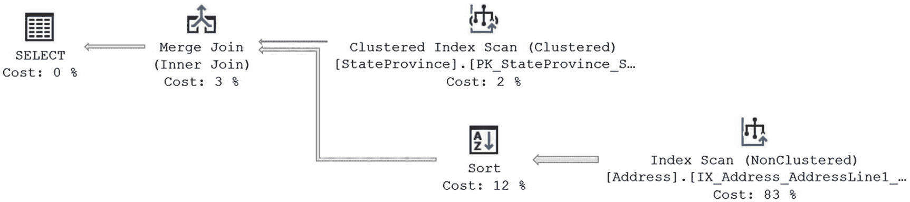
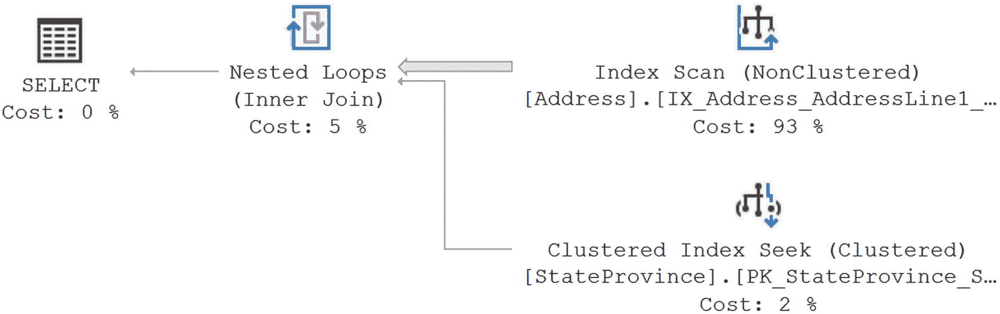
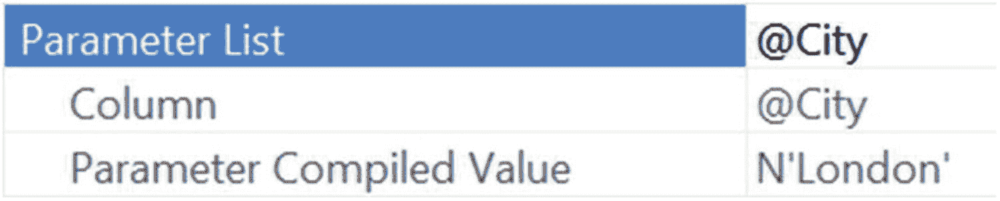
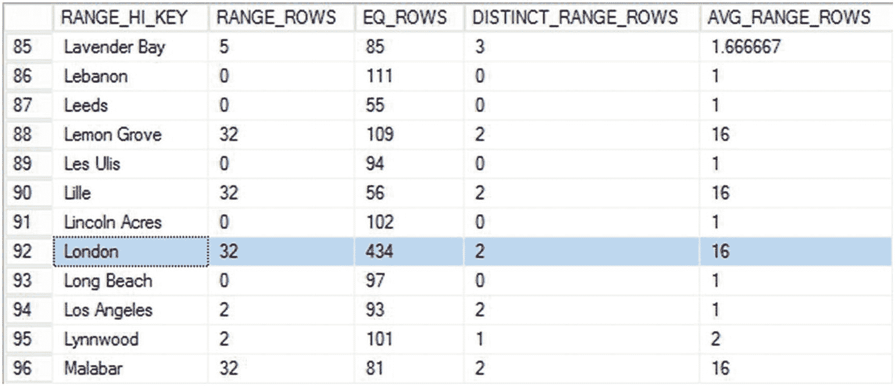
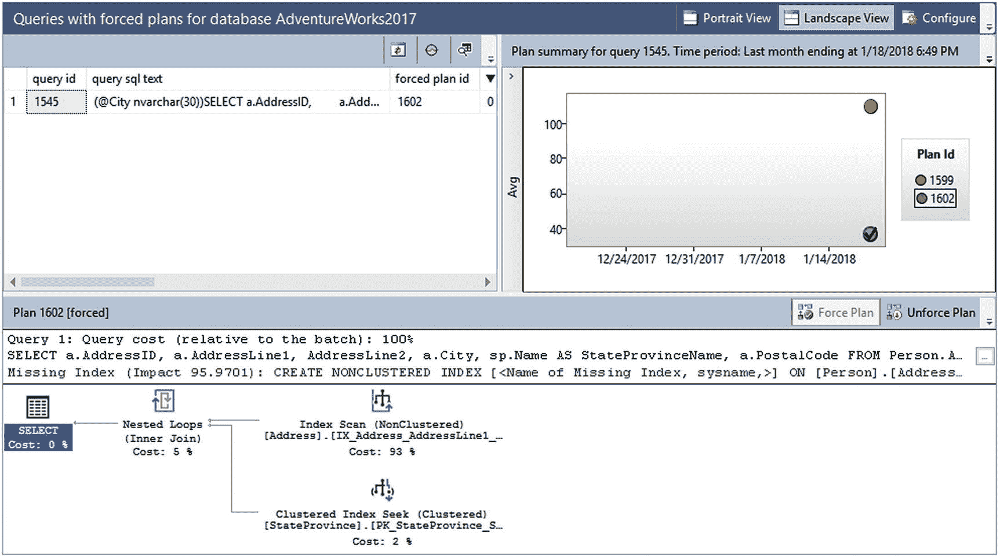

# 17. 参数探测

在上一章中，我讨论了如何将执行计划放入缓存以及如何从那里重用它们。这是一个值得称赞的目标，也是提高系统整体性能的众多方法之一。确保计划重用的最佳机制之一是参数化查询，可以通过存储过程、预备语句或`sp_executesql`来实现。所有这些机制都创建一个参数，在创建计划时使用该参数代替硬编码值。这些参数可以被优化器采样或探测，以在创建执行计划时使用其中包含的值。当它运行良好时（大多数情况下确实如此），你会受益于更准确的计划。但是当它出错并变成错误的参数探测时，你可能会遇到严重的性能问题。

在本章中，我将涵盖以下主题：

*   参数探测背后的有益机制
*   参数探测如何会变坏
*   处理错误参数探测的机制

## 参数探测

当参数化查询被发送到优化器且缓存中没有现有计划时，优化器将执行其功能，为操作 T-SQL 语句请求的数据创建执行计划。当调用此参数化查询时，参数的值会被设置，无论是通过你的程序还是通过参数定义中的默认值。无论哪种方式，那里都有一个值。优化器知道这一点。因此，它利用这一事实并读取参数的值。这就是被称为*参数探测*的过程中“探测”的方面。有了这些可用值，优化器将使用这些特定值来查看参数所引用的数据的统计信息。有了特定值和一组准确的统计信息，你将获得更好的执行计划。这种有益的参数探测过程会自动持续运行（假设没有对默认值进行更改），适用于你所有的参数化查询，无论它们来自哪里。

你也可以对局部变量进行探测。但在继续之前，让我们区分一下局部变量和参数，因为在 T-SQL 语句中，它们看起来可能相同。此示例显示了局部变量和参数：

```sql
CREATE PROCEDURE dbo.ProductDetails (@ProductID INT)
AS
DECLARE @CurrentDate DATETIME = GETDATE();
SELECT p.Name,
       p.Color,
       p.DaysToManufacture,
       pm.CatalogDescription
FROM Production.Product AS p
JOIN Production.ProductModel AS pm
    ON pm.ProductModelID = p.ProductModelID
WHERE p.ProductID = @ProductID
    AND pm.ModifiedDate < @CurrentDate;
GO
```

上一个查询中的参数是`@ProductID`。局部变量是`@CurrentDate`。参数是随存储过程（或在那种情况下的预备语句）定义的。局部变量是代码的一部分。区分它们很重要，因为当你看到`WHERE`子句时，它们看起来完全一样。

如果任何使用局部变量的语句发生重新编译，这些变量可以被优化器以探测参数的方式探测。只需要意识到这一点。除了这种重新编译的独特情况外，局部变量在优化器尝试编译计划时通常是未知量。通常只有参数可以被探测。

为了实际查看参数探测并展示它的有用性，让我们从另一个存储过程开始。

```sql
CREATE OR ALTER PROC dbo.AddressByCity @City NVARCHAR(30)
AS
SELECT a.AddressID,
       a.AddressLine1,
       AddressLine2,
       a.City,
       sp.Name AS StateProvinceName,
       a.PostalCode
FROM Person.Address AS a
JOIN Person.StateProvince AS sp
    ON a.StateProvinceID = sp.StateProvinceID
WHERE a.City = @City;
GO
```

创建过程后，使用此参数运行它：

```sql
EXEC dbo.AddressByCity @City = N'London';
```

这将产生以下 I/O 和执行时间，以及图 17-1 中的查询计划：



图 17-1

AddressByCity 的执行计划

```
读取次数：219
持续时间：97.1ms
```

优化器探测了值`London`，并根据`Address`表上统计信息中伦敦市所代表的数据分布得出了一个计划。该查询或表上的索引可能还有其他调优机会，但该计划对于值`London`和现有数据结构是最优的。你可以像这样使用局部变量编写一个完全相同的查询：

```sql
DECLARE @City NVARCHAR(30) = N'London';
SELECT  a.AddressID,
        a.AddressLine1,
        AddressLine2,
        a.City,
        sp.[Name] AS StateProvinceName,
        a.PostalCode
FROM    Person.Address AS a
JOIN    Person.StateProvince AS sp
    ON a.StateProvinceID = sp.StateProvinceID
WHERE   a.City = @City;
```

当此查询执行时，I/O 和执行时间的结果不同。

```
读取次数：1084
持续时间：127.5ms
```

执行时间增加了，总读取次数从 219 次增加到 1084 次。这在一定程度上可以通过查看图 17-2 中显示的新执行计划来解释。


图 17-2

使用局部变量创建的执行计划

发生的情况是优化器无法采样或探测局部变量的值，因此必须使用统计信息中的平均行数。通过查看`Index Scan`运算符属性中的估计行数可以看到这一点。它显示为 34.113。然而，如果你查看返回的数据，值`London`实际上有 434 行。简而言之，如果优化器认为需要检索 434 行，它会使用归并连接创建计划，只需要 219 次读取。但是，如果它认为只返回大约 34 行，它会使用带有嵌套循环连接的计划，该计划本质上是针对上层数据集中的每个值在下层中进行一次查找，导致 1084 次读取和更慢的性能。

这就是实际提高性能的参数探测。现在，让我们看看当参数探测出问题时会发生什么。


## 参数嗅探问题

当统计信息存在问题时，参数嗅探会带来麻烦。传入参数的值可能具有代表性，反映了统计信息中的数据和数据分布。在这种情况下，你会看到一个良好的执行计划。但是，当传入的参数不具有表中其余数据的代表性时，会发生什么？这种情况可能是因为你的数据恰好以非平均方式分布。例如，统计信息中的大多数值只会返回少量行，比如六行，但某些值会返回数百行。反之亦然，常见的是大量数据的分布，而不常见的是少量值的分布。在这种情况下，执行计划是基于不具代表性的数据创建的，但它对大多数查询并不实用。这种情况最常表现为性能突然、有时相当严重的下降。它甚至会在发生重新编译事件，允许一个更具代表性的数据值传入参数时，看似随机地自行修复。

当统计信息过时、因采样而非全表扫描导致不准确（有关统计信息的一般详情，请参见第 13 章），或者即使完美构建但数据分布非常不规则（奇怪的数据分布）时，你也会看到这种情况发生。无论如何，这种情况会创建一个用处不大的计划并将其存储在缓存中。例如，考虑以下存储过程：

```sql
CREATE OR ALTER PROC dbo.AddressByCity @City NVARCHAR(30)
AS
SELECT a.AddressID,
a.AddressLine1,
AddressLine2,
a.City,
sp.Name AS StateProvinceName,
a.PostalCode
FROM Person.Address AS a
JOIN Person.StateProvince AS sp
ON a.StateProvinceID = sp.StateProvinceID
WHERE a.City = @City;
GO
```

如果先前创建的存储过程 `dbo.AddressByCity` 再次运行，但这次使用不同的参数，则它会返回不同的 I/O 和执行时间集，但执行计划相同，因为它从缓存中重用。

```sql
EXEC dbo.AddressByCity @City = N'Mentor';
Reads: 218
Duration: 2.8ms
```

由于重用了相同的执行计划，I/O 几乎相同。执行时间更快是因为返回的行数更少。你可以通过查看 `sys.dm_exec_query_stats` 的输出（如图 17-3 所示）来验证计划被重用。


图 17-3

`sys.dm_exec_query_stats` 的输出验证了过程重用

```sql
SELECT  dest.text,
deqs.execution_count,
deqs.creation_time
FROM    sys.dm_exec_query_stats AS deqs
CROSS APPLY sys.dm_exec_sql_text(deqs.sql_handle) AS dest
WHERE   dest.text LIKE 'CREATE PROC dbo.AddressByCity%';
```

为了展示糟糕的参数嗅探如何发生，你可以反向执行这些过程的顺序。首先通过运行 `DBCC FREEPROCCACHE` 来清空缓冲区缓存，**不应**在生产机器上运行此命令，除非你小心地执行我这里展示的操作，这将仅从缓存中移除单个执行计划：

```sql
DECLARE @PlanHandle VARBINARY(64);
SELECT @PlanHandle = deps.plan_handle
FROM sys.dm_exec_procedure_stats AS deps
WHERE deps.object_id = OBJECT_ID('dbo.AddressByCity');
IF @PlanHandle IS NOT NULL
BEGIN
DBCC FREEPROCCACHE(@PlanHandle);
END
GO
```

另一个选择是通过 `ALTER DATABASE SCOPED CONFIGURATION CLEAR PROCEDURE_CACHE;` 仅清除给定数据库的计划。

现在，以相反的顺序重新运行查询。第一个查询，使用参数值 `Mentor`，产生以下 I/O 和执行计划（图 17-4）：



图 17-4

执行计划发生变化

```sql
Reads: 218
Duration: 1.8ms
```

图 17-4 与图 17-2 中显示的执行计划不同。读取次数略有下降，但执行时间大致相同。第二次执行，使用 `London` 作为参数的值，产生以下 I/O 和执行时间：

```sql
Reads:1084
Duration:97.7ms
```

这次读取次数急剧增加，达到了使用局部变量时的水平，执行时间也增加了。第一次使用参数 `London` 执行过程时创建的计划，最适合检索数据库中符合该条件的 434 行。然后，下一次使用参数值 `Mentor` 执行过程时，使用第一次执行生成的相同计划表现尚可。当顺序反过来时，为值 `Mentor` 创建了一个新的执行计划，但这个计划对值 `London` 效果极差。

在这些示例中，我实际上稍微取了点巧。如果你查看相关统计信息中的数据分布，你会发现返回的平均行数大约是 34，而 `London` 的 434 是一个异常值。当过程为 `London` 编译时看到的略好性能，反映了需要不同计划的事实。然而，对于像 `Mentor` 这样的值，使用 `London` 的计划性能略有下降。但是，为 `Mentor` 改进的计划对像 `London` 这样的值来说绝对是灾难性的。现在困难的部分来了。

你必须确定哪个计划更适合你的系统负载。一个计划对于平均值稍差，而另一个计划对于平均值更好，但会严重损害异常值。问题是，是让所有可能的数据集性能稍慢但支持异常值获得更好性能更好，还是让异常值受苦以支持更大范围的常见数据（因为它可能被更频繁地调用）更好？你必须根据自己的系统来找出答案。


## 识别错误的参数嗅探

错误的参数嗅探通常是一个间歇性问题。你有时可能会获得一个运行良好的执行计划，没人抱怨；而有时又会获得另一个，突然间投诉系统速度慢的电话就会响个不停。因此，这个问题很难追踪。关键在于识别出你是否为某个参数化查询获得了两个（或有时更多）执行计划。当你开始遇到这种性能的间歇性变化时，必须捕获相关的查询计划。一种方法是使用 `sys.dm_exec_query_plan` 这个 DMO 直接从缓存中提取估计的计划，如下所示：

```
SELECT deps.execution_count,
deps.total_elapsed_time,
deps.total_logical_reads,
deps.total_logical_writes,
deqp.query_plan
FROM sys.dm_exec_procedure_stats AS deps
CROSS APPLY sys.dm_exec_query_plan(deps.plan_handle) AS deqp
WHERE deps.object_id = OBJECT_ID('AdventureWorks2012.dbo.AddressByCity');
```

这个查询使用 `sys.dm_exec_procedure_stats` DMO 来检索缓存中关于该存储过程的信息和查询计划。

如果你启用了查询存储，另一种方法是从那里检索计划：

```
SELECT SUM(qsrs.count_executions) AS ExecutionCount,
AVG(qsrs.avg_duration) AS AvgDuration,
AVG(qsrs.avg_logical_io_reads) AS AvgReads,
AVG(qsrs.avg_logical_io_writes) AS AvgWrites,
CAST(qsp.query_plan AS XML) AS Query_Plan,
qsp.query_id,
qsp.plan_id
FROM sys.query_store_query AS qsq
JOIN sys.query_store_plan AS qsp
ON qsp.query_id = qsq.query_id
JOIN sys.query_store_runtime_stats AS qsrs
ON qsrs.plan_id = qsp.plan_id
WHERE qsq.object_id = OBJECT_ID('dbo.AddressByCity')
GROUP BY qsp.query_plan,
qsp.query_id,
qsp.plan_id;
```

与前一个查询不同，这个查询可以返回多个执行计划。

在 SSMS 中运行这两个查询中的任何一个，结果都会包含一个可点击的 `query_plan` 列。点击它会打开一个图形化计划，即使检索到的是 XML。如果你处理的是来自缓存的单个计划，可以在计划本身上右键单击，然后从上下文菜单中选择“将执行计划另存为”。这样你就可以保存这个计划，以便稍后与另一个计划进行比较。如果你使用的是查询存储，在遇到错误参数嗅探的情况下，会有多个计划可供使用。

你要查看的是第一个操作符的属性，本例中是 `SELECT` 操作符。在那里你会找到“参数列表”项，它会显示优化器编译计划时使用的值，如图 17-5 所示。



图 17-5

用于编译查询计划的参数值

然后，你可以使用这个值来查看你的统计信息，以理解为什么你看到的计划与预期不同。在这个例子中，如果我运行以下查询，我可以检查直方图，看看像 `London` 这样的值可能存储在哪里，以及可以预期多少行：

```
DBCC SHOW_STATISTICS('Person.Address','_WA_Sys_00000004_164452B1');
```

图 17-6 显示了直方图的相关部分。



图 17-6

显示预期行数的直方图部分

你可以看到，`London` 的值返回的行数比 `AVG_RANGE_ROWS` 中显示的任何平均行数都要多得多，并且高于存储在 `EQ_ROWS` 中的许多其他 `RANG_HI_KEY` 计数。简而言之，`London` 的值与其余数据相比存在偏斜。这就是为什么该处的计划与其他计划不同。

你必须对统计信息和编译时的参数值进行类似的评估，才能理解错误的参数嗅探源自何处。

但是，如果你有一个正在遭受错误参数嗅探之苦的参数化查询，你可以通过几种不同的方式来控制并尝试减少这个问题。

## 减轻错误的参数嗅探

一旦你确认某个情况正在经历错误的参数嗅探，你不必默默忍受。你可以为此做些什么，但必须做出决定。你有多种选择来减轻错误参数嗅探的行为。

*   你可以在执行前对存储过程运行 `sp_recompile`，强制在执行时重新编译计划。
*   强制重新编译的另一种方法是使用 `EXEC <过程名> WITH RECOMPILE`。
*   另一种在每次执行时强制重新编译的机制是在过程定义中使用 `WITH RECOMPILE` 来创建该过程。
*   你还可以在单个语句上使用 `OPTION` (`RECOMPILE`)，以便仅重新编译这些语句而不是整个过程。如果你打算强制重新编译，这通常是最佳方法。但要知道这是在执行时间和编译时间之间的权衡。如果此查询被频繁调用并且每次都重新编译，你可能会看到严重的问题。
*   你可以将输入参数重新分配给局部变量。这种流行的修复方法强制优化器通过查看所引用数据的统计信息来猜测可能使用的值，这可以并确实消除了将具体参数值考虑在内的情况。这是一种老方法，已经被 `OPTIMIZE FOR UNKNOWN` 所取代。此方法也存在在重新编译期间变量值被“嗅探”的可能性。
*   你可以在创建过程时使用查询提示 `OPTIMIZE FOR`，并为其提供已知良好的参数，这些参数将为大多数查询生成一个运行良好的计划。你可以指定一个生成特定计划的值，或者可以指定 `UNKNOWN` 以获取基于统计信息平均值的通用计划。
*   你可以使用计划指南，这是一种使查询以某种方式行为而无需修改过程的机制。这将在第 18 章中详细介绍。
*   如果你启用了查询存储，可以使用计划强制来选择首选计划。这是一个优雅的解决方案，因为它不需要任何代码更改即可实现。
*   你可以通过设置跟踪标志 4136 为开启状态来为服务器禁用参数嗅探。请理解，这种有益的行为将对整个服务器关闭，而不仅仅是一个有问题的查询。这对你的系统来说可能是一个非常危险的选择。
*   现在，你可以使用 `DATABASE SCOPED CONFIGURATION` 在数据库级别禁用参数嗅探。这比使用前面提到的跟踪标志要安全得多。但它仍然可能存在问题，因为大多数数据库都在受益于参数嗅探。
*   如果你有一个导致错误参数嗅探的特定查询模式，你可以通过建立两个或更多不同的过程，使用一个包装过程来决定调用哪一个，从而将功能隔离。这可以帮助你同时使用多种不同的方法。你也可以使用动态字符串执行来解决这个问题；只是要警惕 SQL 注入。

这些可能的解决方案中的每一个都伴随着必须考虑的权衡。如果你决定每次调用查询时都重新编译它，你将不得不为重新编译查询所需的额外 CPU 付出代价。这违背了使用参数化查询以尝试获取计划重用的初衷，但在你的特定情况下，这可能是最佳解决方案。将参数重新分配给局部变量是一种有些老派的方法；代码看起来可能会很傻。


```sql
CREATE OR ALTER PROC dbo.AddressByCity @City NVARCHAR(30)
AS
DECLARE @LocalCity NVARCHAR(30) = @City;
SELECT a.AddressID,
a.AddressLine1,
AddressLine2,
a.City,
sp.Name AS StateProvinceName,
a.PostalCode
FROM Person.Address AS a
JOIN Person.StateProvince AS sp
ON a.StateProvinceID = sp.StateProvinceID
WHERE a.City = @LocalCity;
```

通过这种方法，优化器会基于相关列的密度进行**基数估计**，而不是使用直方图。但这在查询中看起来有些奇怪。实际上，如果你采用这种方法，我强烈建议在变量声明前添加注释，以清楚地说明原因。例如：

```sql
-- 这允许查询绕过不良的参数嗅探
```

但是，采用这种方法后，你就要面临**变量嗅探**的可能性，因此并不真正推荐使用，除非你使用的 SQL Server 实例版本低于 2008。从 SQL Server 2008 及之后的版本开始，你最好使用 `OPTIMIZE FOR UNKNOWN` 查询提示来达到相同的效果，而不会引入变量嗅探可能带来的问题。

## 使用 OPTIMIZE FOR 查询提示

你可以使用 `OPTIMIZE FOR` 查询提示并传递一个特定值。例如，如果你想确保始终使用由值 `Mentor` 生成的执行计划，可以对查询进行如下操作：

```sql
CREATE OR ALTER PROC dbo.AddressByCity @City NVARCHAR(30)
AS
SELECT a.AddressID,
a.AddressLine1,
AddressLine2,
a.City,
sp.Name AS StateProvinceName,
a.PostalCode
FROM Person.Address AS a
JOIN Person.StateProvince AS sp
ON a.StateProvinceID = sp.StateProvinceID
WHERE a.City = @City
OPTION (OPTIMIZE FOR (@City = 'Mentor'));
```

现在，优化器将忽略传递给 `@City` 的任何值，并始终使用值 `Mentor`。你甚至可以通过修改查询（如所示）来实际看到这一点，这将从缓存中移除查询，然后你使用参数值 `London` 执行它。这将在缓存中生成一个新计划。如果你打开该计划并查看 `SELECT` 属性，你将在图 17-7 中看到提示的证据。


*图 17-7：运行时值和编译时值不同*

如你所见，优化器完全按照你的指定行事，使用值 `Mentor` 来编译计划，即使你也可以看到你是使用值 `London` 执行的查询。这种方法的问题在于数据会随时间变化，某个时间点对你的数据来说是最优的计划，之后可能就不再是了。如果你选择使用 `OPTIMIZE FOR` 提示，你需要计划定期重新评估它。

## 使用数据库范围配置或跟踪标志完全禁用参数嗅探

如果你选择使用跟踪标志或 `DATABASE SCOPED CONFIGURATION` 完全禁用参数嗅探，请理解这会在整个服务器或数据库上将其关闭。由于大多数情况下，参数嗅探绝对对你有帮助，你最好确定你没有从中获得任何益处，并且处理它的唯一希望就是关闭嗅探。这甚至不需要重启服务器，因此会立即生效。生成的计划将基于可用统计信息的平均值，因此根据你的数据，计划可能会严重次优。在执行此操作之前，请探索在你最有问题的查询上使用 `RECOMPILE` 提示的可能性。即使你无法获得计划重用，通过这种方式你更可能获得更好的计划。

### 使用查询存储强制计划

处理参数嗅探最简单的方法，假设你处于某个特定计划最有用的情况下，就是通过查询存储使用计划强制。你可以使用 GUI 中的报告，或者直接从系统视图中检索信息。

```sql
SELECT CAST(qsp.query_plan AS XML) AS query_plan,
qsp.plan_id,
qsq.query_id
FROM sys.query_store_plan AS qsp
JOIN sys.query_store_query AS qsq
ON qsq.query_id = qsp.query_id
WHERE qsq.object_id = OBJECT_ID('dbo.AddressByCity');
```

你拥有了确定哪个执行计划最适合你的系统所需的一切。一旦确定，强制优化器选择该计划就很简单了。为了实际看到这一点，让我们强制使用更适合值 `Mentor` 的计划。假设你一直启用着查询存储运行，你应该能够使用之前的查询检索数据并挑选出该计划。如果没有，请启用查询存储（详见第 11 章），然后运行两个查询，并在执行之间使用之前的脚本花时间从缓存中清除计划。

完成后，你必须使用 `query_id` 和 `plan_id` 的值以及 `sys.sp_query_store_force_plan` 函数。

```sql
EXEC sys.sp_query_store_force_plan 1545, 1602;
```

结果不会立即显现。然而，如果我们重新运行存储过程并传递值 `London`，我们将看到图 17-8 中的计划。


*图 17-8：一个强制的执行计划*

你可以尝试从缓存中移除计划并为值 `London` 重新运行它。然而，此时无论你做什么都不会带回那个执行计划，因为优化器现在正在强制使用该计划。你可以使用扩展事件监控计划强制。你也可以查询查询存储视图以查看哪些计划是强制的。最后，计划本身存储了一点信息，让你知道它是一个强制计划。查看第一个运算符，这里是 `SELECT` 运算符，你可以在图 17-9 中看到属性。


*图 17-9：显示强制执行计划的“使用计划”属性*

这是你在执行计划内可以看到它已被强制的唯一迹象。没有来源指示，因此你必须查看 SSMS 中的报告或查询表以自行追踪信息。有一个专门的报告显示在图 17-10 中。



*图 17-10：具有强制计划的查询报告*

你可以看到该查询有两个不同的计划。你甚至可以在图 17-10 中的计划 1602 上看到复选标记，表明它是一个强制计划。

在继续之前，请使用 GUI 或以下命令移除计划强制：

```sql
EXEC sys.sp_query_store_unforce_plan 1545, 1602;
```

## 总结与建议

面对所有这些可能的缓解方法，在决定采用哪种方法之前，请在你的系统上仔细测试。这些方法都有效，但它们的工作方式可能在一种情况下比另一种更好，因此了解不同的方法是好的，你可以根据你的情况对所有方法进行实验。

最后，请记住这是由统计信息驱动的，因此如果你的统计信息不准确或过时，你更有可能遇到不良的参数嗅探。重新检查你的统计信息维护例程以确保其有效性，通常是最好的单一解决方案。


