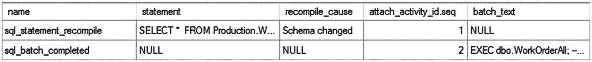
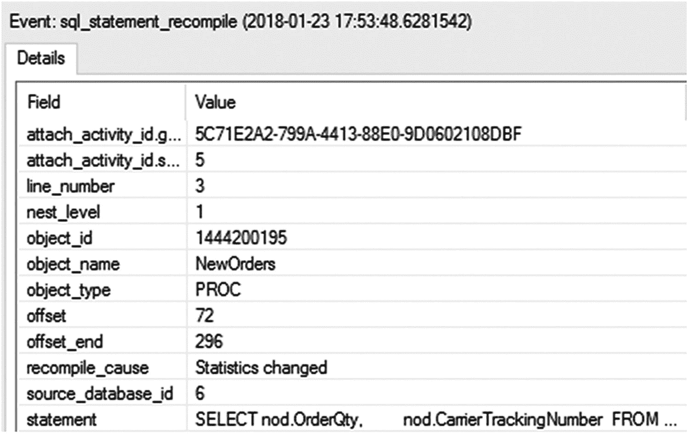
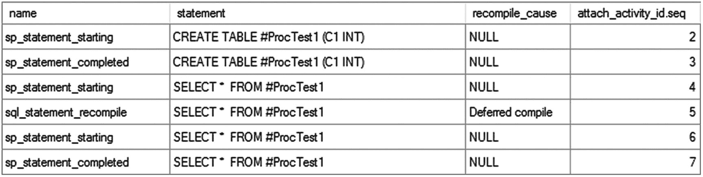
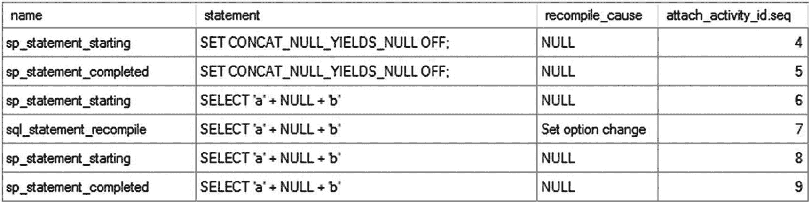
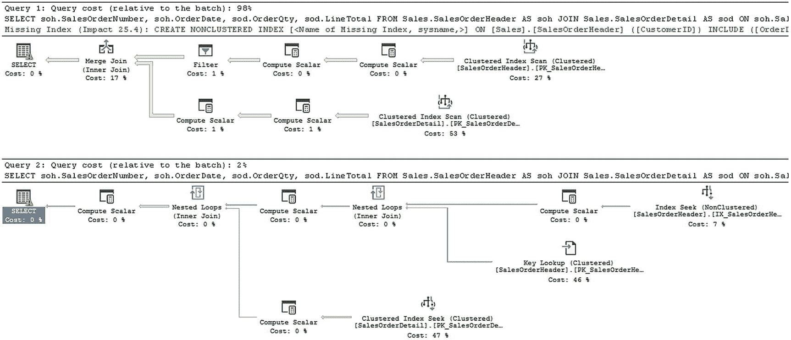
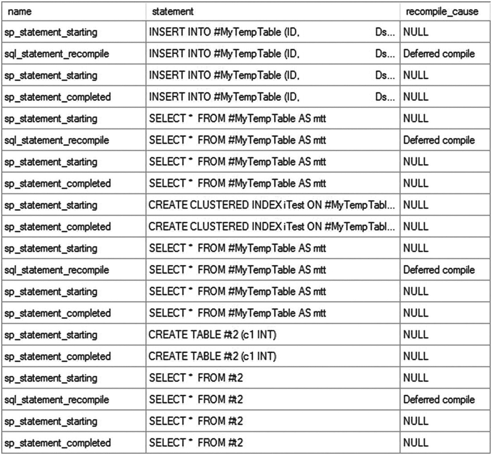
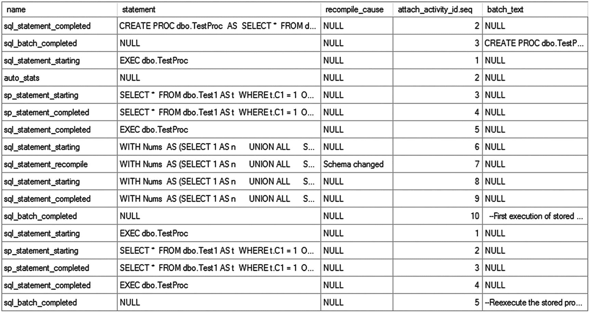
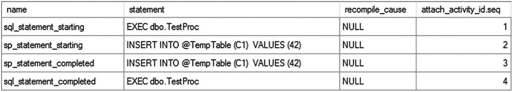
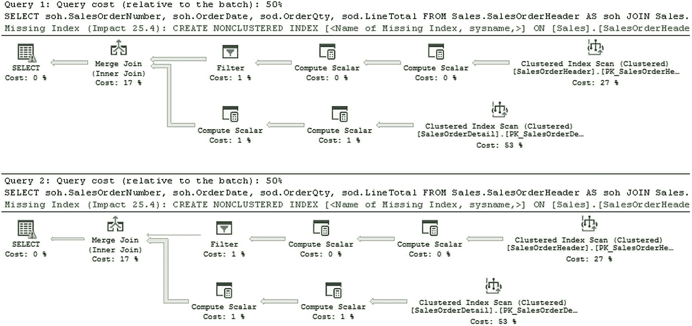
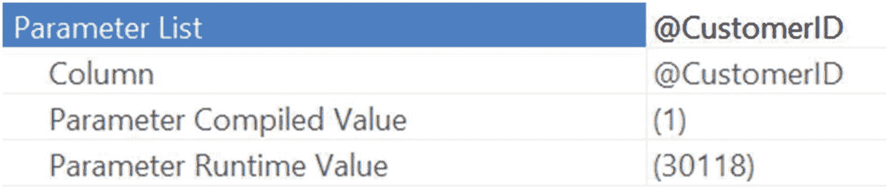

# 18. 查询重编译

存储过程和参数化查询通过显式地将查询的可变部分转换为参数，提高了执行计划的可重用性。这使得当查询以相同或不同的可变部分值重新提交时，执行计划能够被重用。由于存储过程通常用于实现复杂的业务规则，一个典型的存储过程包含一组复杂的 SQL 语句，这使得生成存储过程中查询的执行计划成本相对较高。因此，重用存储过程现有的执行计划通常是有益的，而不是生成新的计划。然而，有时现有计划可能并非最优，或者在重用时无法提供最佳的处理策略。SQL Server 通过重编译存储过程中的语句来生成新的执行计划，从而解决这种情况。本章涵盖以下主题：
*   重编译的优缺点
*   如何识别导致重编译的语句
*   如何分析重编译的原因
*   必要时避免重编译的方法

## 重编译的优缺点

查询重编译可能有益，也可能有害。有时，特别是当表中的数据分布及相应的统计信息发生变化后，考虑为查询采用新的处理策略而非重用现有计划可能是有益的。新增索引、约束或修改表中现有结构也可能导致重编译后的查询性能更佳。SQL Server 和 Azure SQL Database 中的重编译是在语句级别进行的。这增加了过程内可能发生的重编译总次数，但总体上降低了重编译的影响和开销。语句级重编译减少了开销，因为它只重编译单个语句，而不是过程内的所有语句；而在 SQL Server 2000 中，重编译会导致整个过程被一遍又一遍地重新编译。尽管重编译的影响范围较小，但通常仍被认为需要根据实际情况尽可能地减少和控制。

标准重编译过程的一个例外是当使用查询存储启用计划强制时。在这种情况下，重编译仍会发生。但是，只有当查询存储中被标记为强制计划的现有计划失效时，新生成的计划才会被使用。如果该标记计划失效，则将使用新生成的计划。

为了理解重新编译现有计划有时为何有益，假设你需要从`Production.WorkOrder`表中检索一些信息。存储过程可能如下所示：

```
CREATE OR ALTER PROCEDURE dbo.WorkOrder
AS
SELECT wo.WorkOrderID,
       wo.ProductID,
       wo.StockedQty
FROM   Production.WorkOrder AS wo
WHERE  wo.StockedQty BETWEEN 500
                      AND     700;
```

在当前索引下，作为存储过程计划一部分的`SELECT`语句的执行计划会扫描索引`PK_WorkOrder_WorkOrderID`，如图 18-1 所示。


图 18-1
存储过程的执行计划

此计划保存在过程缓存中，以便在重新执行存储过程时可以重用。但如果像下面这样在表上新增一个索引，那么现有计划将不再是执行查询最高效的处理策略。

```
CREATE INDEX IX_Test ON Production.WorkOrder(StockedQty,ProductID);
```

在这种情况下，花费额外的 CPU 周期来重编译存储过程以生成更好的执行计划是有益的。

由于索引`IX_Test`可以作为`SELECT`语句的覆盖索引，通过使用`IX_Test`而不是扫描`PK_WorkOrder_WorkOrderID`，可以避免书签查找的成本。SQL Server 会自动检测到新计划已创建，并重编译现有计划以考虑使用新索引的好处。这导致了存储过程的一个新执行计划（当执行时），如图 18-2 所示。


图 18-2
存储过程的新执行计划


SQL Server 会自动检测需要重新编译现有执行计划的条件。它遵循特定规则来确定现有计划何时需要重新编译。如果某个查询的具体实现符合重新编译规则（例如执行计划过期、`SET` 选项被更改等），那么该语句每次满足重新编译要求时都将被重新编译，而 SQL Server 可能生成、也可能不生成更好的执行计划。若要观察此现象，你需要一个不同的存储过程。以下过程从 `WorkOrder` 表中返回所有行：

```
CREATE OR ALTER PROCEDURE dbo.WorkOrderAll
AS
SELECT *
FROM Production.WorkOrder AS wo;
```

在执行此过程之前，请先删除索引 `IX_Test`。

```
DROP INDEX Production.WorkOrder.IX_Test;
```

当你执行此过程时，`SELECT` 语句返回表中的完整数据集（所有行和列），因此通过对表 `WorkOrder` 进行表扫描来处理是最合适的。如果我们有一个 `SELECT` 列表更有限的更合适的查询，扫描非聚集索引可能是一个选择。正如第 4 章所解释的，`SELECT` 语句的处理不会受益于任何列上的非聚集索引。因此，理想情况下，在存储过程执行前创建非聚集索引（如下所示）应该没有影响。

```
EXEC dbo.WorkOrderAll;
GO
CREATE INDEX IX_Test ON Production.WorkOrder(StockedQty,ProductID);
GO
EXEC dbo.WorkOrderAll; --在创建索引 IX_Test 之后执行
```

但是，在索引创建后执行的存储过程面临着重新编译，如图 18-3 中相应的扩展事件输出所示。



图 18-3
存储过程的非有益重新编译

`sql_statement_recompile` 事件被用于跟踪语句重新编译。在较旧的跟踪事件中单独存在的存储过程重新编译事件已不再有。

在这种情况下，重新编译对存储过程并无实际益处。但不幸的是，它符合导致 SQL Server 在每次架构发生更改的执行中都重新编译存储过程的条件。这会使存储过程的计划缓存失效，并在此次执行中浪费 CPU 周期来重新生成相同的计划。因此，了解导致查询重新编译的条件至关重要，并且在实现旨在重用计划的存储过程和参数化查询时，应尽一切努力避免这些条件。在识别出在各种情况下导致 SQL Server 重新编译语句的具体语句之后，我将在接下来讨论这些条件。

## 识别导致重新编译的语句

SQL Server 可以重新编译存储过程内的单个语句或整个存储过程。因此，要找到重新编译的原因，识别出无法重用现有计划的 SQL 语句非常重要。

你可以使用扩展事件会话来跟踪语句重新编译。你也可以使用相同的事件来识别导致重新编译的存储过程语句。以下是你可使用的相关事件：

- `sql_batch_completed` 和/或 `rpc_completed`
- `sql_statement_recompile`
- `sql_batch_starting` 和/或 `rpc_starting`
- `sql_statement_completed` 和/或 `sp_statement_completed` *(可选)*
- `sql_statement_starting` 和/或 `sp_statement_completed` *(可选)*

### 注意

SQL Server 2008 支持扩展事件，但 `rpc_completed` 和 `rpc_starting` 事件不能返回正确的信息。对于较旧的查询，你可能需要使用 `module_end` 和 `module_starting` 代替。

考虑以下简单的存储过程：

```
CREATE OR ALTER PROC dbo.TestProc
AS
CREATE TABLE #TempTable (C1 INT);
INSERT INTO #TempTable (C1)
VALUES (42);
-- 数据更改导致重新编译
GO
```

在首次执行此存储过程时，你会得到如图 18-4 所示的扩展事件输出。


图 18-4
显示由重新编译产生的 `sql_statement_recompile` 事件的扩展事件输出

```
EXEC dbo.TestProc;
```

在图 18-4 中，你可以看到有一个重新编译事件 (`sql_statement_recompile`)，表明存储过程内部的一个语句经历了重新编译。正如前一章所述，当首次执行存储过程时，SQL Server 会编译该存储过程并为其内部所有语句生成执行计划。

顺便提一下，如果你使用扩展事件进行跟踪，可能会看到其他语句。只需按数据库 ID 进行筛选或分组，以便更容易查看你感兴趣的事件。在扩展事件会话上设置筛选器始终是一个好习惯。

由于执行计划仅保存在易失性内存中，当 SQL Server 重新启动时它们会被丢弃。在服务器重启后，下一次执行存储过程时，SQL Server 会再次编译该存储过程并生成执行计划。这些编译不被视为存储过程重新编译，因为缓存中没有可供重用的计划。`sql_statement_recompile` 事件表明已经存在一个计划但无法重用。

### 注意

我将在后面的“分析重新编译的原因”一节中讨论 `recompile_cause` 数据列的重要性。

要查看是哪个语句导致了重新编译，请查看 `sql_statement_recompile` 事件中的 `statement` 列。它具体显示了正在被重新编译的语句。你也可以通过结合使用各种语句开始事件和重新编译事件，来识别导致重新编译的存储过程语句。如果在扩展事件会话中启用了因果跟踪，你将获得一个事件开始的标识符，以及同一事件链中其他事件的序列号。图 18-4 的前两列就是 Id 和序列号。

请注意，在语句重新编译之后，导致重新编译的存储过程语句会再次启动以使用新计划执行。你可以捕获事件中的语句，通过时间戳按序列关联事件，或者最好是在扩展事件上使用因果跟踪。这些方法中的任何一种都可以用来追踪具体是哪个语句导致了重新编译。


## 分析重编译的原因

为了提升性能，分析重编译的原因至关重要。很多时候，重编译可能并非必要，避免它可以提高性能。例如，每次经历编译或重编译过程，你都在消耗 CPU 资源让优化器完成工作。在编译过程中，执行计划也会被换入换出内存。当一个查询发生重编译时，在该重编译过程运行期间，该查询会被阻塞。这意味着频繁调用的查询如果还需要经历重编译，就可能成为主要的性能瓶颈。了解导致重编译的不同条件，有助于你评估重编译的原因，并确定如何在非必要时避免重编译。语句重编译发生的原因如下：

*   存储过程语句中引用的常规表、临时表或视图的架构已发生更改。架构更改包括表或表上索引的元数据变更。
*   绑定到常规表或临时表列的项目（例如默认值）已更改。
*   表索引或列上的统计信息已发生变化，这种变化可能是自动或手动的，且超出了第 13 章讨论的阈值。
*   某个对象在存储过程编译时不存在，但在执行期间被创建。这称为*延迟对象解析*，是前述重编译的原因。
*   `SET`选项已更改。
*   执行计划因老化而被释放。
*   显式调用了系统存储过程`sp_recompile`。
*   显式使用了`RECOMPILE`提示。

你可以在扩展事件中看到这些原因。原因由`sql_statement_recompile`事件的`recompile_cause`数据列值指示。让我们更详细地看看上面列出的一些重编译原因，并讨论如何避免它们。

### 架构或绑定更改

当视图、常规表或临时表的架构或绑定发生更改时，现有查询的执行计划将失效。在执行任何引用已修改对象的语句之前，必须重新编译该查询。SQL Server 会自动检测这种情况并重新编译存储过程。

**注意：** 我将在“重编译的优缺点”一节中更详细地讨论由于架构更改导致的重编译。

### 统计信息更改

SQL Server 会跟踪对表的更改次数。如果更改次数超过了重编译阈值（RT）值，那么当语句中引用该表时，SQL Server 会自动更新统计信息，正如你在第 13 章所见。当检测到自动更新统计信息的条件时，SQL Server 会自动将该语句标记为重编译，并同时更新统计信息。

RT 由一个公式决定，该公式取决于表是永久表还是临时表（而非表变量）以及表中的行数。表 18-1 显示了基本公式，以便你确定何时可能因数据更改而导致语句重编译。

表 18-1：确定数据更改的公式

| 表类型 | 公式 |
| :--- | :--- |
| 永久表 | 如果行数（`n`）<= 500，则 `RT = 500`。 |
|  | 如果 `n > 500`，则 `RT = .2 * n` 或 `Sqrt(1000*NumberOfRows)`。 |
| 临时表 | 如果 `n < 6`，则 `RT = 6`。 |
|  | 如果 `6 <= n <= 500`，则 `RT = 500`。如果 `n > 500`，则 `RT = .2 * n` 或 `Sqrt(1000*NumberOfRows)`。 |

要理解统计信息更改如何导致重编译，请考虑以下示例。存储过程在第一次执行时表中只有一行数据。在第二次执行存储过程之前，向表中添加了大量行。

**注意：** 请确保数据库的 `AUTO_UPDATE_STATISTICS` 设置为 `ON`。你可以通过执行以下查询来确定 `AUTO_UPDATE_STATISTICS` 设置：

```sql
SELECT DATABASEPROPERTYEX('AdventureWorks2017', 'IsAutoUpdateStatistics');
```

```sql
IF EXISTS (   SELECT *
              FROM sys.objects AS o
              WHERE o.object_id = OBJECT_ID(N'dbo.NewOrderDetail')
                AND o.type IN ( N'U' ))
    DROP TABLE dbo.NewOrderDetail;
GO

SELECT *
INTO dbo.NewOrderDetail
FROM Sales.SalesOrderDetail;
GO

CREATE INDEX IX_NewOrders_ProductID ON dbo.NewOrderDetail (ProductID);
GO

CREATE OR ALTER PROCEDURE dbo.NewOrders
AS
    SELECT nod.OrderQty,
           nod.CarrierTrackingNumber
    FROM dbo.NewOrderDetail AS nod
    WHERE nod.ProductID = 897;
GO

SET STATISTICS XML ON;
EXEC dbo.NewOrders;
SET STATISTICS XML OFF;
GO
```

接下来，你需要在重新执行存储过程之前修改一定数量的行。

```sql
UPDATE dbo.NewOrderDetail
SET ProductID = 897
WHERE ProductID BETWEEN 800
                  AND     900;
GO

SET STATISTICS XML ON;
EXEC dbo.NewOrders;
SET STATISTICS XML OFF;
GO
```

第一次执行时，SQL Server 使用 `Index Seek` 操作来执行存储过程的 `SELECT` 语句，如图 18-5 所示。


*图 18-5：数据更改前的执行计划*

**注意：** 请确保图形执行计划的设置为 `OFF`；否则，`STATISTICS XML` 的输出将不会显示。

在重新执行存储过程时，SQL Server 自动检测到索引上的统计信息已更改。这导致了存储过程内 `SELECT` 语句的重编译，优化器在执行 `SELECT` 语句之前确定了更佳的处理策略，如图 18-6 所示。


*图 18-6：统计信息更改对执行计划的影响*

图 18-7 显示了相应的扩展事件输出。


*图 18-7：统计信息更改对存储过程重编译的影响*

在图 18-7 中，你可以看到在第二次执行存储过程时，为了执行 `SELECT` 语句，需要一次重编译。从 `recompile_cause` 的值（`Statistics Changed`）可以理解，重编译是由于统计信息变更引起的。作为创建新计划的一部分，统计信息会自动更新，这由语句重编译调用之后发生的 `Auto Stats` 事件所指示。你也可以使用 `DBCC SHOW_STATISTICS` 语句或 `sys.dm_db_stats_properties` 来验证统计信息的自动更新，如第 13 章所述。


### 延迟对象解析

查询通常会动态创建并随后访问数据库对象。当此类查询首次执行时，其第一个执行计划不会包含有关将在运行时创建的对象的信息。因此，在第一个执行计划中，对这些对象的处理策略被延迟，直到查询运行时才确定。当引用这些对象之一的 DML 语句（在查询内）被执行时，查询会被重新编译，以生成一个包含该对象处理策略的新计划。

在存储过程内可以创建普通表或本地临时表来保存中间结果集。由于延迟对象解析导致的语句重新编译，对于普通表和本地临时表的表现是不同的，如下一节所述。

#### 因普通表导致的重新编译

要理解在存储过程中创建普通表所引发的查询重新编译问题，请看下面的例子：

```sql
CREATE OR ALTER PROC dbo.TestProc
AS
CREATE TABLE dbo.ProcTest1 (C1 INT); --确保表不存在
SELECT *
FROM dbo.ProcTest1; --导致重新编译
DROP TABLE dbo.ProcTest1;
GO
EXEC dbo.TestProc; --第一次执行
EXEC dbo.TestProc; --第二次执行
```

当存储过程第一次执行时，在实际执行存储过程之前会生成一个执行计划。如果在创建存储过程之前，存储过程中创建的表不存在（如前面代码所预期的那样），那么该计划将不包含处理引用该表的 `SELECT` 语句的策略。因此，为了执行 `SELECT` 语句，需要重新编译该语句，如图 18-8 所示。


图 18-8：显示因普通表导致的存储过程重新编译的扩展事件输出

可以看到，`SELECT` 语句在第二次执行时被重新编译。在第一次执行期间删除表，并不会删除保存在计划缓存中的查询计划。在后续执行存储过程时，现有计划已包含对该表的处理策略。然而，由于在存储过程中重新创建了表，SQL Server 将其视为表架构的更改。因此，在后续执行存储过程的其余部分、执行 `SELECT` 语句之前，SQL Server 会重新编译存储过程中的语句。对应的 `sql_statement_recompile` 事件的 `recompile_clause` 值反映了重新编译的原因。

#### 因本地临时表导致的重新编译

在存储过程中，大多数时候你创建的是本地临时表而不是普通表。要了解本地临时表如何以不同的方式影响存储过程重新编译，只需将前面示例中的普通表替换为本地临时表。

```sql
CREATE OR ALTER PROC dbo.TestProc
AS
CREATE TABLE #ProcTest1 (C1 INT); --确保表不存在
SELECT *
FROM #ProcTest1; --导致重新编译
DROP TABLE #ProcTest1;
GO
EXEC dbo.TestProc; --第一次执行
EXEC dbo.TestProc; --第二次执行
```

由于本地临时表在存储过程执行结束时会自动删除，因此无需显式删除临时表。但是，遵循良好的编程实践，你可以在其工作完成后立即删除本地临时表。图 18-9 显示了前面示例的扩展事件输出。



图 18-9：显示因本地临时表导致的存储过程重新编译的扩展事件输出

可以看到，查询在第一次执行时被重新编译。如对应的 `recompile_cause` 值所示，重新编译的原因与普通表导致重新编译的原因相同。但是，请注意，当存储过程重新执行时，它不会被重新编译，这与普通表的情况不同。

在后续执行存储过程时，本地临时表的架构与之前执行时保持一致。本地临时表在存储过程的作用域之外不可用，因此它的架构在多次执行之间无法被任何方式更改。因此，在后续执行存储过程时，SQL Server 可以安全地重用现有计划（基于本地临时表的先前实例），从而避免重新编译。

### 注意

为避免重新编译，在存储过程中使用本地临时表来保存中间结果集，而不是使用临时创建的普通表，这是有意义的。但是，这只有在你能避免数据倾斜的情况下才成立，数据倾斜可能导致其他糟糕的执行计划。在那种情况下，重新编译可能还算不上大问题。

### SET 选项更改

存储过程的执行计划依赖于环境设置。如果在存储过程中更改了环境设置，那么 SQL Server 会在每次执行时重新编译查询。例如，考虑以下代码：

```sql
CREATE OR ALTER PROC dbo.TestProc
AS
SELECT  'a' + NULL + 'b'; --第 1 条
SET CONCAT_NULL_YIELDS_NULL OFF;
SELECT  'a' + NULL + 'b'; --第 2 条
SET ANSI_NULLS OFF;
SELECT  'a' + NULL + 'b';
--第 3 条
GO
EXEC dbo.TestProc; --第一次执行
EXEC dbo.TestProc; --第二次执行
```

在存储过程中更改 `SET` 选项会导致 SQL Server 在执行 `SET` 语句之后的语句之前重新编译存储过程。因此，这个存储过程会被重新编译两次：一次在执行第二个 `SELECT` 语句之前，一次在执行第三个 `SELECT` 语句之前。图 18-10 中的扩展事件输出显示了这一点。



图 18-10：显示因 SET 选项更改导致的存储过程重新编译的扩展事件输出

如果重新执行该过程，你不会看到重新编译，因为这些现在已成为执行计划的一部分。

由于 `SET NOCOUNT` 不会更改环境设置，不像前面所示用于更改 ANSI 设置的 `SET` 语句，因此 `SET NOCOUNT` 不会导致存储过程重新编译。我将在 19 章详细解释如何使用 `SET NOCOUNT`。

### 执行计划老化

正如你在 16 章所见，SQL Server 通过维护缓存中执行计划的年龄来管理过程缓存的大小。如果一个存储过程很长时间没有重新执行，其执行计划的年龄字段可能会降至 0，并且由于内存压力，该计划可能会从缓存中移除。当这种情况发生并且存储过程被重新执行时，将生成一个新计划并缓存在过程缓存中。但是，如果系统中有足够的内存，未使用的计划在内存压力增加之前不会从缓存中移除。


### 显式调用 `sp_recompile`

当架构更改或统计信息发生足够变化时，SQL Server 会自动重编译查询。它还提供了 `sp_recompile` 系统存储过程，用于手动将整个存储过程标记为待重编译。此存储过程可以对表、视图、存储过程或触发器调用。如果在存储过程或触发器上调用，该存储过程或触发器将在下次执行时重编译。在表或视图上调用 `sp_recompile` 会标记所有引用该表/视图的存储过程和触发器，使它们在下次执行时进行重编译。

例如，如果在表 `Test1` 上调用 `sp_recompile`，所有引用表 `Test1` 的存储过程和触发器都会被标记为待重编译，并在下次执行时重编译，如下所示：

```sql
sp_recompile 'Test1';
```

您可以使用 `sp_recompile` 在使用 `sp_executesql` 执行动态查询时，取消对现有执行计划的重用。如前一章所述，对于变量部分的值范围可能需要不同处理策略的查询，不应对其变量部分进行参数化。例如，回顾相应的示例，您知道查询的第二次执行重用了为第一次执行生成的计划。为方便参考，此处重复该示例：

```sql
--清除过程缓存
DECLARE @planhandle VARBINARY(64)
SELECT @planhandle = deqs.plan_handle
FROM sys.dm_exec_query_stats AS deqs
CROSS APPLY sys.dm_exec_sql_text(deqs.sql_handle) AS dest
WHERE dest.text LIKE '%SELECT soh.SalesOrderNumber,%'
IF @planhandle IS NOT NULL
DBCC FREEPROCCACHE(@planhandle);
GO
DECLARE @query NVARCHAR(MAX);
DECLARE @param NVARCHAR(MAX);
SET @query
= N'SELECT soh.SalesOrderNumber,
soh.OrderDate,
sod.OrderQty,
sod.LineTotal
FROM Sales.SalesOrderHeader AS soh
JOIN Sales.SalesOrderDetail AS sod
ON soh.SalesOrderID = sod.SalesOrderID
WHERE soh.CustomerID >= @CustomerId;'
SET @param = N'@CustomerId INT';
EXEC sp_executesql @query, @param, @CustomerId = 1;
EXEC sp_executesql @query, @param, @CustomerId = 30118;
```

该查询的第二次执行对 `SalesOrderHeader` 表执行了 `索引扫描` 操作以检索数据。如第 8 章所述，对于第二次执行，本可能更倾向于在 `SalesOrderHeader` 表上使用 `索引查找` 操作。您可以通过在 `SalesOrderHeader` 表上执行 `sp_recompile` 系统存储过程来实现这一点，如下所示：

```sql
EXEC sp_recompile 'Sales.SalesOrderHeader'
```

现在，如果使用第二个参数值重新执行该查询，查询计划将如前面的 `sp_recompile` 语句所标记的那样进行重编译。这使得 SQL Server 能够为第二次执行生成一个最优计划。

嗯，这里有个小问题：您很可能还想重新执行第一条语句。由于计划存在于缓存中，即使对于第一条语句，使用 `索引查找` 操作（利用筛选条件列 `soh.CustomerID` 上的索引）可能更优，SQL Server 也会重用该计划（对 `SalesOrderHeader` 表的 `索引扫描` 操作）。避免此问题的一种方法是为查询创建一个存储过程，并在语句上使用 `OPTION` (`RECOMPILE`) 子句。接下来我将介绍控制重编译的各种方法。

### 显式使用 `RECOMPILE`

SQL Server 允许使用 `RECOMPILE` 命令以三种方式显式重编译存储过程和查询：在 `CREATE PROCEDURE` 语句中、作为 `EXECUTE` 语句的一部分以及在查询提示中。这些方法会降低计划重用的效率，并可能导致 CPU 的大量使用，因此您应仅在以下小节所述的特定情况下考虑使用它们。

#### 在 `CREATE PROCEDURE` 语句中使用 `RECOMPILE` 子句

有时，存储过程的计划需求会随着传递给该存储过程的参数值的变化而变化。在这种情况下，为不同的参数值重用同一个计划可能会降低存储过程的性能。您可以通过在 `CREATE PROCEDURE` 语句中使用 `RECOMPILE` 子句来避免这种情况。例如，对于上一节中的查询，您可以创建一个带有 `RECOMPILE` 子句的存储过程。

```sql
CREATE OR ALTER PROCEDURE dbo.CustomerList @CustomerId INT
WITH RECOMPILE
AS
SELECT soh.SalesOrderNumber,
soh.OrderDate,
sod.OrderQty,
sod.LineTotal
FROM Sales.SalesOrderHeader AS soh
JOIN Sales.SalesOrderDetail AS sod
ON soh.SalesOrderID = sod.SalesOrderID
WHERE soh.CustomerID >= @CustomerId;
GO
```

`RECOMPILE` 子句会阻止缓存存储过程内每个语句的计划。每次执行该存储过程时，都会生成新的计划。因此，如果使用 `soh.CustomerID` 值为 30118 或 1 来执行存储过程，

```sql
EXEC CustomerList @CustomerId = 1;
EXEC CustomerList @CustomerId = 30118;
```

在每次执行期间都会生成一个新计划，如图 18-11 所示。



图 18-11：在创建存储过程中使用 `RECOMPILE` 子句的效果

#### 在 `EXECUTE` 语句中使用 `RECOMPILE` 子句

如前所示，存储过程中的特定参数值根据其性质可能需要不同的计划。您可以将 `RECOMPILE` 子句从存储过程中移出，仅在执行存储过程时按需使用，如下所示：

```sql
EXEC dbo.CustomerList @CustomerId = 1
WITH RECOMPILE;
```

当使用 `RECOMPILE` 子句执行存储过程时，会临时生成一个新计划。这个新计划不会被缓存，也不会影响现有计划。当不带 `RECOMPILE` 子句执行存储过程时，计划照常缓存。相比于在 `CREATE PROCEDURE` 语句中使用 `RECOMPILE` 子句，这种方式提供了一些对现有计划缓存重用性的控制。

由于带 `RECOMPILE` 子句执行时的存储过程计划不会被缓存，因此每次带 `RECOMPILE` 子句执行该存储过程时，计划都会重新生成。但是，为了获得更好的性能，您应考虑创建单独的存储过程（为每组需要不同计划的参数值各创建一个），而不是使用 `RECOMPILE`，前提是这些计划易于识别，并且您只处理少量可能的计划。


#### 使用 RECOMPILE 查询提示控制单条语句

虽然您可以使用前面提到的任一方法来重新编译整个存储过程，但如果过程包含多条命令，这可能会带来问题。使用前面任一方法都会重新编译过程内的所有语句。对于某些查询而言，编译时间可能是执行过程中最昂贵的部分，因此应尽量避免重编译。为此，一种更精细的方法是：仅对需要重编译的特定语句进行隔离处理。这可以通过使用 `RECOMPILE` 查询提示来实现，如下所示：

```sql
CREATE OR ALTER PROCEDURE dbo.CustomerList @CustomerId INT
AS
SELECT a.AddressLine1,
a.AddressLine2,
a.City,
a.PostalCode
FROM Person.Address AS a
JOIN Sales.SalesOrderHeader AS soh
ON soh.ShipToAddressID = a.AddressID
WHERE soh.CustomerID = @CustomerId;
SELECT soh.SalesOrderNumber,
soh.OrderDate,
sod.OrderQty,
sod.LineTotal
FROM Sales.SalesOrderHeader AS soh
JOIN Sales.SalesOrderDetail AS sod
ON soh.SalesOrderID = sod.SalesOrderID
WHERE soh.CustomerID >= @CustomerId
OPTION (RECOMPILE);
SELECT bom.BillOfMaterialsID,
p.Name,
sod.OrderQty
FROM Production.BillOfMaterials AS bom
JOIN Production.Product AS p
ON p.ProductID = bom.ProductAssemblyID
JOIN Sales.SalesOrderDetail AS sod
ON sod.ProductID = p.ProductID
JOIN Sales.SalesOrderHeader AS soh
ON soh.SalesOrderID = sod.SalesOrderID
WHERE soh.CustomerID = @CustomerId;
GO
```

在这个过程里，中间的查询看起来与将 `RECOMPILE` 应用于整个过程时的行为相同，但如果您在此查询中添加了多个语句，那么只有带有 `OPTION (RECOMPILE)` 查询提示的语句会在过程每次执行时进行编译。

## 避免重编译

有时重编译是有益的，但有时则值得避免。如果在查询的 `WHERE` 或 `JOIN` 子句所引用的列上创建了新索引，那么重新生成引用该表的存储过程的执行计划是合理的，这样它们就能从使用索引中获益。然而，如果认为重编译对性能有害，例如它导致了阻塞或耗尽了 CPU 等资源，您可以通过遵循以下实现实践来避免它：

*   不要交错使用 DDL 和 DML 语句。
*   避免由统计信息更改引起的重编译。
*   使用 `KEEPFIXED PLAN` 选项。
*   在表上禁用自动更新统计信息功能。
*   使用表变量。
*   避免在存储过程中更改 `SET` 选项。
*   使用 `OPTIMIZE FOR` 查询提示。
*   使用计划指南。

### 不要交错使用 DDL 和 DML 语句

在存储过程中，DDL 语句常用于创建本地临时表并更改其架构（包括添加索引）。这样做会影响现有计划的有效性，并在执行引用这些表的存储过程语句时导致重编译。要理解对本地临时表使用 DDL 语句如何导致存储过程重复重编译，请看以下示例：

```sql
IF (SELECT OBJECT_ID('dbo.TempTable')) IS NOT NULL
DROP PROC dbo.TempTable
GO
CREATE PROC dbo.TempTable
AS
CREATE TABLE #MyTempTable (ID INT,
Dsc NVARCHAR(50))
INSERT INTO #MyTempTable (ID,
Dsc)
SELECT pm.ProductModelID,
pm.Name
FROM Production.ProductModel AS pm; --需要第 1 次重编译
SELECT *
FROM #MyTempTable AS mtt;
CREATE CLUSTERED INDEX iTest ON #MyTempTable (ID);
SELECT *
FROM #MyTempTable AS mtt; --需要第 2 次重编译
CREATE TABLE #t2 (c1 INT);
SELECT *
FROM #t2;
--需要第 3 次重编译
GO
EXEC dbo.TempTable; --首次执行
```

该存储过程交错使用了 DDL 和 DML 语句。图 18-12 显示了此代码的扩展事件输出。



图 18-12 扩展事件输出，显示了由于 DDL 和 DML 交错导致的重编译

语句被重新编译了四次。

*   查询首次执行时生成的执行计划不包含任何关于本地临时表的信息。因此，最初生成的计划永远无法用于通过 DML 语句访问临时表。
*   第二次重编译源于表中数据在加载过程中遇到的更改。
*   第三次重编译是由于第一个临时表 (`#MyTempTable`) 的架构发生更改。在 `#MyTempTable` 上创建索引使现有计划失效，导致再次访问该表时发生重编译。如果此索引是在第一次重编译之前创建的，那么现有计划对于第二个 `SELECT` 语句也将保持有效。因此，您可以通过将 `CREATE INDEX` DDL 语句置于所有引用该表的 DML 语句之前来避免这次重编译。
*   第四次重编译生成了一个包含 `#t2` 处理策略的计划。现有计划没有关于 `#t2` 的信息，因此无法用于通过第三个 `SELECT` 语句访问 `#t2`。如果 `#t2` 的 `CREATE TABLE` DDL 语句被放置在所有可能引起重编译的 DML 语句之前，那么第一次重编译本身就会包含 `#t2` 的信息，从而避免第三次重编译。

### 避免由统计信息更改引起的重编译

在“分析重编译的原因”一节中，您已经了解到统计信息更改是重编译的原因之一。对于数据分布均匀的简单表，由统计信息更改引起的重编译可能生成与先前计划相同的计划。在这种情况下，重编译可能是不必要的，如果成本太高则应该避免。但是，大多数时候，统计信息的更改需要反映在执行计划中。我这里指的是那些重编译时间过长或过度重编译影响 CPU 的情况。

您有两种技术可以避免由统计信息更改引起的重编译。

*   使用 `KEEPFIXED PLAN` 选项。
*   在表上禁用自动更新统计信息功能。


### 使用 `KEEPFIXED PLAN` 选项

SQL Server 提供了 `KEEPFIXED PLAN` 选项，以避免因统计信息更改而导致的重编译。要了解如何使用 `KEEPFIXED PLAN`，请考虑 `statschanges.sql` 脚本，其中已适当修改以使用 `KEEPFIXED PLAN` 选项。

```
IF (SELECT OBJECT_ID('dbo.Test1')) IS NOT NULL
DROP TABLE dbo.Test1;
GO
CREATE TABLE dbo.Test1 (C1 INT,
C2 CHAR(50));
INSERT INTO dbo.Test1
VALUES (1, '2');
CREATE NONCLUSTERED INDEX IndexOne ON dbo.Test1 (C1);
GO
--创建引用上述表的存储过程
CREATE OR ALTER PROC dbo.TestProc
AS
SELECT *
FROM dbo.Test1 AS t
WHERE t.C1 = 1
OPTION (KEEPFIXED PLAN);
GO
--首次执行存储过程（表中只有 1 行数据）
EXEC dbo.TestProc;
--第一次执行
--向表中添加大量行以导致统计信息更改
WITH Nums
AS (SELECT 1 AS n
UNION ALL
SELECT n + 1
FROM Nums
WHERE n < 1000)
INSERT INTO dbo.Test1 (C1,
C2)
SELECT 1,
n
FROM Nums
OPTION (MAXRECURSION 1000);
GO
--在统计信息更改后重新执行存储过程
EXEC dbo.TestProc; --数据分布已更改
```

图 18-13 显示了扩展事件输出。



图 18-13

扩展事件输出，显示 `KEEPFIXED PLAN` 选项在减少重编译中的作用

可以看到，与之前数据更改的示例不同，这里没有 `auto_stats` 事件（参见图 18-7）。因此，没有额外的重编译。所以，通过使用 `KEEPFIXED PLAN` 选项，可以避免因统计信息更改而导致的重编译。

图 18-13 中可见一个重编译事件，但这是数据修改查询的结果，而不是像在没有 `KEEPFIXED PLAN` 选项时所预期的那样由存储过程的执行引起的。

### 注意

这是一个潜在危险的选择。在考虑使用此选项之前，请确保本应生成的新计划并不优于现有计划，并且您已穷尽所有其他可能的解决方案。在大多数情况下，重新编译查询是更可取的，尽管可能代价高昂。

### 在表上禁用自动更新统计信息

您也可以通过禁用相关表上的自动统计信息更新，来避免因统计信息更新而导致的重编译。例如，可以在表 `Test1` 上禁用自动更新统计信息功能，如下所示：

```
EXEC sp_autostats
'dbo.Test1',
'OFF' ;
```

如果您在插入导致统计信息更改的大量行之前禁用此表上的功能，则可以避免因统计信息更改而导致的重编译。

但是，请谨慎使用此技术，因为过时的统计信息会对基于成本的优化器的有效性产生不利影响，如第 13 章所述。此外，如第 13 章所述，如果禁用统计信息的自动更新，则应设置一个 SQL 作业来手动定期更新统计信息。

### 使用表变量

SQL Server 2014 支持的变量类型之一是表变量。您可以像使用其他数据类型一样，使用 `DECLARE` 语句创建表变量数据类型。它的行为类似于局部变量，您可以在存储过程中使用它来保存中间结果集，就像使用临时表一样。

如果使用表变量，则可以避免由临时表引起的重编译。由于不会为表变量创建统计信息，因此与临时表相关的不同重编译问题不适用于它。例如，考虑“表”一节中使用的脚本（原文此处似乎有误，根据上下文理解）：

```
CREATE OR ALTER PROC dbo.TestProc
AS
CREATE TABLE #TempTable (C1 INT);
INSERT INTO #TempTable (C1)
VALUES (42);
-- 数据更改导致重编译
GO
EXEC dbo.TestProc; --首次执行
```

由于延迟的对象解析，存储过程在首次执行期间会重编译。您可以使用表变量避免这种由临时表引起的重编译，如下所示：

```
CREATE OR ALTER PROC dbo.TestProc
AS
DECLARE @TempTable TABLE (C1 INT);
INSERT INTO @TempTable (C1)
VALUES (42);
--无需重编译
GO
EXEC dbo.TestProc; --首次执行
```

图 18-14 显示了存储过程首次执行的扩展事件输出。通过使用表变量，避免了由临时表引起的重编译。



图 18-14

扩展事件输出，显示表变量在解决重编译问题中的作用

然而，表变量有其局限性。主要如下：

*   一旦创建表变量，就无法对其执行任何 DDL 语句，这意味着以后无法向表变量添加索引或约束。约束只能作为表变量的 `DECLARE` 语句的一部分指定。因此，只能使用 `PRIMARY KEY` 或 `UNIQUE` 约束在表变量上创建一个索引。

*   不会为表变量创建统计信息，这意味着它们在执行计划中被解析为单行表。当表实际只包含少量数据（大约少于 100 行）时，这不是问题。当表变量包含更多数据时，它会成为一个主要的性能问题，因为执行计划中对正确操作类型的适当决策完全依赖于统计信息。

### 避免在存储过程中更改 `SET` 选项

通常建议不要在存储过程中更改环境设置，从而避免因 `SET` 选项更改而导致的重编译。为了 ANSI 兼容性，建议将以下 `SET` 选项保持为 `ON`：

*   `ARITHABORT`
*   `CONCAT_NULL_YIELDS_NULL`
*   `QUOTED_IDENTIFIER`
*   `ANSI_NULLS`
*   `ANSI_PADDING`
*   `ANSI_WARNINGS`
*   而 `NUMERIC_ROUNDABORT` 应设置为 `OFF`。

前面的示例说明了如果您确实选择在过程中修改 `SET` 选项会发生什么情况。


## 使用 `OPTIMIZE FOR` 查询提示

尽管你可能并不总是能减少或消除重新编译，但使用 `OPTIMIZE FOR` 查询提示可以帮助你在重新编译发生时，获得你想要的执行计划。`OPTIMIZE FOR` 查询提示使用你提供的参数值来编译计划，而忽略调用应用程序传入的参数的实际值。

举个例子，回顾本章前面提到的 `CustomerList` 存储过程。你知道如果这个存储过程接收到某些特定的参数值，它将需要创建一个新的执行计划。基于对自身数据的了解，你还知道两个更重要的事实：该查询返回很小数据集的频率极低，并且当该查询使用了错误的计划时，性能会显著下降。与其让它一遍又一遍地重新编译，不如修改它，使其创建那个在大多数情况下效果最好的计划。

```sql
CREATE OR ALTER PROCEDURE dbo.CustomerList @CustomerID INT
AS
SELECT soh.SalesOrderNumber,
soh.OrderDate,
sod.OrderQty,
sod.LineTotal
FROM Sales.SalesOrderHeader AS soh
JOIN Sales.SalesOrderDetail AS sod
ON soh.SalesOrderID = sod.SalesOrderID
WHERE soh.CustomerID >= @CustomerID
OPTION (OPTIMIZE FOR (@CustomerID = 1));
GO
```

当这个查询首次执行或因任何原因重新编译时，它总是基于传入参数的统计值获得相同的执行计划。为了测试这一点，可以按如下方式执行存储过程：

```sql
EXEC dbo.CustomerList
@CustomerID = 7920
WITH RECOMPILE;
EXEC dbo.CustomerList
@CustomerID = 30118
WITH RECOMPILE;
```

正如本章前面所示，这将强制该存储过程在每次执行时都重新编译。`图 18-15` 展示了得到的执行计划。



**图 18-15**
使用 `WITH RECOMPILE` 不会改变相同的执行计划

与本章前面的情况不同，现在重新编译存储过程并不会产生新的执行计划。相反，无论输入参数是什么，都生成了相同的计划，这是因为查询优化器在优化查询时，收到了指令，要求使用提示所提供的值，即 `@CustomerID = 1`。

这并没有真正减少重新编译的次数，但它确实帮助你控制了生成的执行计划。这要求你非常了解你的数据。如果你的数据随时间发生了变化，你可能需要重新审视那些使用了 `OPTIMIZE FOR` 查询提示的地方。

要查看执行计划中的提示，只需查看 `SELECT` 算子的属性，如 `图 18-16` 所示。



**图 18-16**
参数编译值与查询提示提供的值相匹配

你可以看到，虽然查询被重新编译并且被赋予了一个值 `30118`，但由于提示的存在，使用的编译值是提示所指定的 `1`。

你可以指定查询使用 `OPTIMIZE FOR UNKNOWN` 进行优化。这几乎是 `OPTIMIZE FOR` 提示的反面。`OPTIMIZE FOR` 提示会尝试使用直方图，而 `OPTIMIZE FOR UNKNOWN` 提示将使用统计信息的密度向量。你是在指示处理器始终基于统计信息的平均值进行优化，并忽略查询优化时传入的实际值。你可以将它与 `OPTIMIZE FOR <value>` 结合使用。它会针对该参数上提供的值进行优化，但会对所有其他参数使用统计信息。正如前一章所讨论的，这两种都是处理“参数嗅探”问题的机制。

## 使用计划指南

计划指南允许你在不修改查询或存储过程文本的情况下使用查询提示或其他优化技术。这在你有一个性能不佳的第三方产品存储过程，需要进行调优却又无法修改其代码时，尤其有用。作为优化过程的一部分，如果在存储过程编译或重新编译时存在计划指南，它将使用该指南来创建执行计划。

在上一节中，我向你展示了使用 `OPTIMIZE FOR` 会如何影响为存储过程创建的执行计划。以下是原始存储过程中的查询，未包含任何提示：

```sql
CREATE OR ALTER PROCEDURE dbo.CustomerList @CustomerID INT
AS
SELECT soh.SalesOrderNumber,
soh.OrderDate,
sod.OrderQty,
sod.LineTotal
FROM Sales.SalesOrderHeader AS soh
JOIN Sales.SalesOrderDetail AS sod
ON soh.SalesOrderID = sod.SalesOrderID
WHERE soh.CustomerID >= @CustomerID;
GO
```

现在，假设这个查询是一个第三方应用程序的一部分，你无法修改它来添加 `OPTION (OPTIMIZE FOR)`。为了给它应用 `OPTIMIZE FOR` 查询提示，可以按如下方式创建一个计划指南：

```sql
sp_create_plan_guide @name = N'MyGuide',
@stmt = N'SELECT soh.SalesOrderNumber,
soh.OrderDate,
sod.OrderQty,
sod.LineTotal
FROM Sales.SalesOrderHeader AS soh
JOIN Sales.SalesOrderDetail AS sod
ON soh.SalesOrderID = sod.SalesOrderID
WHERE soh.CustomerID >= @CustomerID;',
@type = N'OBJECT',
@module_or_batch = N'dbo.CustomerList',
@params = NULL,
@hints = N'OPTION (OPTIMIZE FOR (@CustomerID = 1))';
```

现在，当使用不同的参数执行该存储过程时，即使像下面这样强制使用 `RECOMPILE`，`OPTIMIZE FOR` 提示也会被应用。`图 18-17` 展示了得到的执行计划。


**图 18-17**
使用计划指南来应用 `OPTIMIZE FOR` 查询提示

```sql
EXEC dbo.CustomerList
@CustomerID = 7920
WITH RECOMPILE;
EXEC dbo.CustomerList
@CustomerID = 30118
WITH RECOMPILE;
```

结果与修改存储过程时相同，但在这种情况下，无需进行任何修改。你可以再次通过查看 `SELECT` 算子的属性（`图 18-18`）看到，执行计划中应用了一个计划指南。


**图 18-18**
`SELECT` 算子属性显示了计划指南

存在多种类型的计划指南。前面的示例是一个 *对象* 计划指南，它是匹配数据库中特定对象的指南，在本例中是 `CustomerList`。你还可以为重复进入系统的即席查询创建计划指南，通过创建一个 SQL 计划指南来查找特定的 SQL 语句。假设以下查询（而非存储过程）被传递到你的系统，并且需要应用一个 `OPTIMIZE FOR` 查询提示：

```sql
SELECT soh.SalesOrderNumber,
soh.OrderDate,
sod.OrderQty,
sod.LineTotal
FROM Sales.SalesOrderHeader AS soh
JOIN Sales.SalesOrderDetail AS sod
ON soh.SalesOrderID = sod.SalesOrderID
WHERE soh.CustomerID >= 1;
```

运行此查询会产生你在 `图 18-19` 中看到的执行计划。


**图 18-19**
该查询使用的执行计划与期望的不同

要创建查询计划指南，你首先需要知道查询使用的精确格式，以防参数化（强制或简单）改变了查询的文本。文本必须精确。如果你第一次尝试创建查询计划指南像这样：


