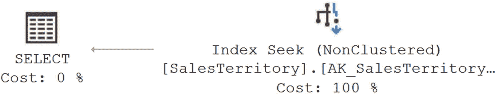
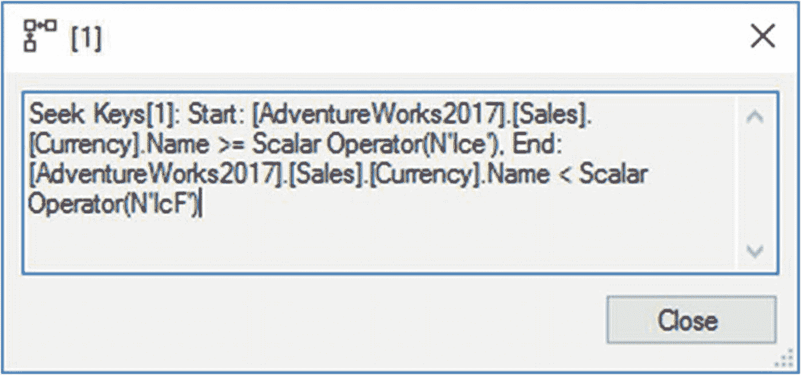
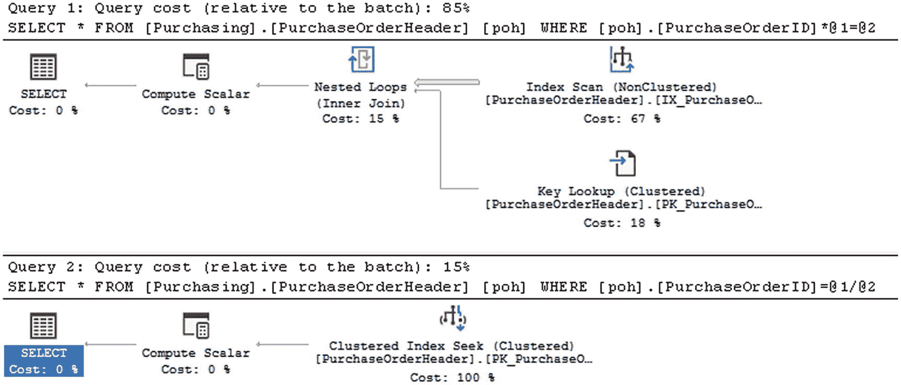
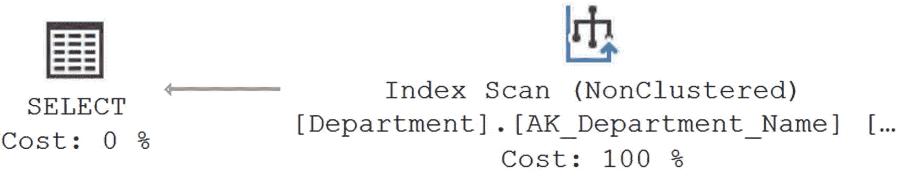
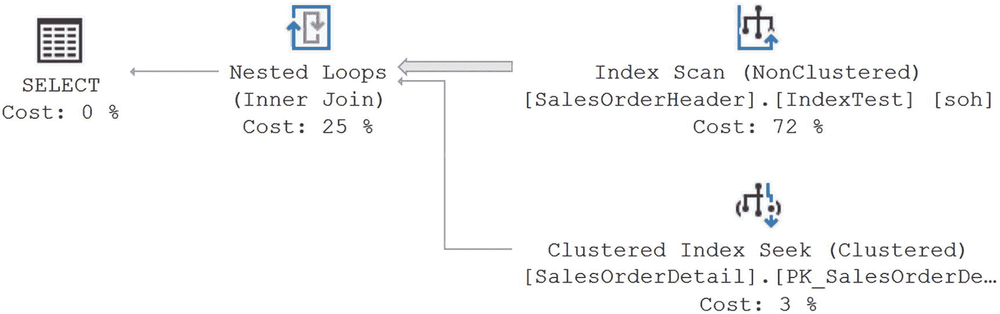
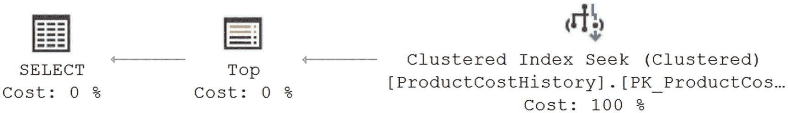
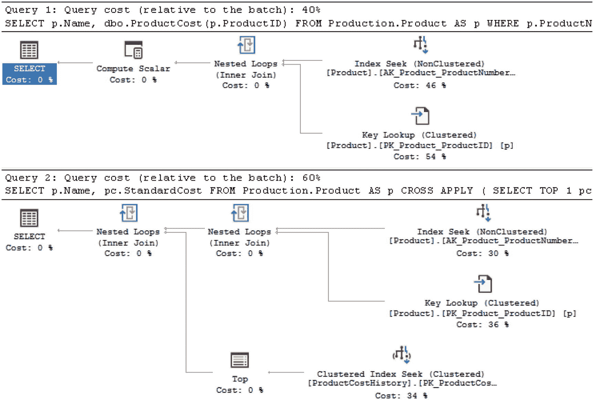

# 19. 查询设计分析

数据库架构可能包含许多增强性能的特性，如索引、统计信息和存储过程。但是，如果你的查询从一开始就写得很糟糕，这些特性都无法保证良好的性能。SQL 查询可能无法有效地使用可用的索引。SQL 查询的结构可能会给查询成本增加可避免的开销。查询可能试图以逐行的方式（或者引用 Jeff Moden 的话，Row By Agonizing Row，缩写为 RBAR，发音为“reebar”）处理数据，而不是以逻辑集合的方式。为了提高数据库应用程序的性能，理解与不同查询编写方式相关的成本非常重要。

在本章中，我将涵盖以下主题：

*   影响性能的查询设计方面
*   查询设计如何有效地使用索引
*   优化器提示对查询性能的作用
*   数据库约束对查询性能的作用

## 查询设计建议

当你需要运行查询时，通常可以使用许多不同的方法来获取相同的数据。在许多情况下，优化器生成相同的计划，而不考虑查询的结构。然而，在某些情况下，查询结构将不允许优化器选择最佳的处理策略。重要的是你要意识到这种情况可能发生，并且如果发生，你能做些什么来避免它。

一般来说，请牢记以下建议以确保最佳性能：

*   操作小型结果集。
*   有效地使用索引。
*   最小化优化器提示的使用。
*   使用域和引用完整性。
*   避免资源密集型查询。
*   减少网络往返次数。
*   降低事务成本。（我将在下一章中介绍最后三点。）

仔细的测试对于在特定数据库环境中识别提供最佳性能的查询形式至关重要。你应该熟悉编写和比较不同的 SQL 查询形式，以便评估在给定环境中提供最佳性能的查询形式。你还需要能够自动化你的测试。


## 对小型结果集进行操作

为提升查询性能，应限制其操作的数据量，包括列和行。对小型结果集进行操作可减少查询消耗的资源量，并提高索引的有效性。为限制数据集的大小，应遵循以下两条规则：

*   限制选择列表中的列数，仅包含实际需要的列。
*   使用高选择性的 `WHERE` 子句来限制返回的行数。

需要注意的是，有时你会被要求向 OLTP 系统返回数万行数据。仅仅因为有人告诉你这是业务需求，并不意味着这些需求就是合理的。人类无法处理数万行的数据。很少有人能处理数千行数据。你要准备好对这些要求提出质疑，并能够说明理由。此外，你经常会听到并必须准备好反驳的一个理由是“以防将来我们需要它”。

### 限制 select_list 中的列数

在 `SELECT` 语句的选择列表中，使用最小化的列集合。不要使用输出结果集中不需要的列。例如，不要使用 `SELECT *` 来返回所有列。`SELECT *` 语句会使覆盖索引失效，因为将所有列都包含在索引中通常是不切实际的。例如，考虑以下查询：

```sql
SELECT Name,
TerritoryID
FROM Sales.SalesTerritory AS st
WHERE st.Name = 'Australia';
```

在 `Name` 列（以及通过聚集键 `ProductID`）上的覆盖索引可以通过索引本身快速服务该查询，而无需访问聚集索引。当你启用扩展事件会话时，会得到以下逻辑读次数和执行时间，以及相应的执行计划（如图 19-1 所示）：


*图 19-1：显示引用少量列带来的好处的执行计划*

```text
Reads: 2
Duration: 920 mcs
```

如果将此查询修改为在选择列表中包含所有列，如下所示，则之前的覆盖索引将失效，因为该查询所需的所有列并未全部包含在该索引中：

```sql
SELECT *
FROM Sales.SalesTerritory AS st
WHERE st.Name = 'Australia';
```

随后，必须访问包含所有列的基础表（或聚集索引），如下所示。逻辑读次数和执行时间均有所增加。

```text
Table 'SalesTerritory'. Scan count 0, logical reads 4
CPU time = 0 ms,   elapsed time = 6.4 ms
```

选择列表中的列越少，改善查询性能的潜力就越大。请记住，我们一直在分析的这个查询只是一个返回单行少量数据的简单查询，它已经使读取次数加倍，执行时间增加了六倍。选择超过严格需要的列也会增加网络上的数据传输，进一步降低性能。图 19-2 显示了执行计划。


*图 19-2：说明引用过多列带来的额外开销的执行计划*

### 使用高选择性的 WHERE 子句

如第 8 章所述，在 `WHERE`、`ON` 和 `HAVING` 子句中引用的列的选择性决定了是否能使用该列上的索引。请求从表中返回大量行可能无法从使用索引中受益，要么是因为根本无法使用索引，要么（在非聚集索引的情况下）是因为查找操作的开销成本。为确保使用索引，`WHERE` 子句中引用的列应具有高选择性。

大多数情况下，最终用户一次只关注有限数量的行。因此，你应该设计数据库应用程序，使其在用户浏览数据时以增量方式请求数据。对于依赖大量数据进行数据分析或报告的应用程序，可以考虑使用 Analysis Services 或 PowerPivot 等数据分析解决方案。如果分析围绕聚合进行并涉及大量数据，请利用列存储索引。记住，返回巨大的结果集代价高昂，而且这些数据不太可能被全部使用。唯一的常见例外是与数据科学家合作时，他们经常需要检索给定数据集中的所有数据作为其操作的第一步。仅在这种情况下，你可能需要寻找其他方法来提高性能，例如使用辅助服务器、升级硬件或其他机制。但是，要与他们合作以确保数据只移动一次，而不是重复移动。

## 有效使用索引

在数据库表上建立有效的索引对于提高性能至关重要。然而，同样重要的是确保查询设计得当，以有效使用这些索引。以下是一些应遵循的查询设计规则，以改进索引的使用：

*   避免非 sargable 的搜索条件。
*   避免在 `WHERE` 子句的列上使用算术运算符。
*   避免在 `WHERE` 子句的列上使用函数。

我将在以下各节中详细介绍每条规则。

### 避免非 Sargable 搜索条件

查询中的 *sargable* 谓词是指可以使用索引的谓词。这个词是 “Search ARGument ABLE” 的缩写。优化器从索引中获益的能力取决于搜索条件的选择性，而这又取决于在 `WHERE`、`ON` 和 `HAVING` 子句中引用的列的选择性，这些都依赖于索引上的统计信息。在 `WHERE` 子句列上使用的搜索谓词决定了是否可以对该列执行索引操作。


### 注意

索引及其他函数在过滤子句中的使用主要围绕着`WHERE`、`ON`和`HAVING`。为了便于阅读（和编写），在许多本应包含`ON`和`HAVING`的情况下，我将仅使用`WHERE`。除非另有说明，请自行在脑海中包含它们。

表 19-1 中列出的可搜索条件通常允许优化器使用`WHERE`子句中引用列的索引。这些可搜索条件通常允许 SQL Server 在索引中定位到一行并检索该行（或者在搜索条件保持为真的情况下检索相邻范围的行）。

表 19-1
常见可搜索与不可搜索的搜索条件

| 类型 | 搜索条件 |
| --- | --- |
| 可搜索 | 包含条件 `=`、`>`、`>=`、`<`、`<=`、`BETWEEN` 以及一些 `LIKE` 条件，例如 `LIKE '<literal>%'` |
| 不可搜索 | 排除条件 `<>`、`!=`、`!>`、`!<`、`NOT EXISTS`、`NOT IN` 和 `NOT LIKE`、`OR`，以及一些 `LIKE` 条件，例如 `LIKE '%<literal>'` |

另一方面，表 19-1 中列出的*不可搜索*条件通常会阻止优化器使用`WHERE`子句中引用列的索引。排除性搜索条件通常不允许 SQL Server 执行可搜索条件所支持的`Index Seek`操作。例如，`!=`条件需要扫描所有行来识别匹配行。

尝试为这些不可搜索条件实现变通方法以提高性能。在某些情况下，可以重写查询以避免不可搜索条件。例如，在某些情况下，可以用两个（或多个）`UNION ALL`查询替换一个`OR`条件，使多个寻道操作优于单次扫描。你还可以考虑用`BETWEEN`条件替换`IN`/`OR`搜索条件，如下一节所述。关键在于尝试不同的机制，看看在特定情况下哪一种更有效。SQL Server 中的方法没有绝对糟糕或完美的。每种方法都有其适用的场景和时机。在尝试提高性能时要灵活并进行实验。

### BETWEEN 与 IN/OR 对比

考虑以下使用`IN`搜索条件的查询：

```sql
SELECT sod.*
FROM Sales.SalesOrderDetail AS sod
WHERE sod.SalesOrderID IN ( 51825, 51826, 51827, 51828 );
```

编写相同查询的另一种方式是使用`OR`命令。

```sql
SELECT sod.*
FROM Sales.SalesOrderDetail AS sod
WHERE sod.SalesOrderID = 51825
OR sod.SalesOrderID = 51826
OR sod.SalesOrderID = 51827
OR sod.SalesOrderID = 51828;
```

你可以用`BETWEEN`子句替换此查询中的任一搜索条件，如下所示：

```sql
SELECT sod.*
FROM Sales.SalesOrderDetail AS sod
WHERE sod.SalesOrderID BETWEEN 51825
AND     51828;
```

这三个查询返回相同的结果。表面上看，三个查询的执行计划是相同的，如图 19-3 所示。

图 19-3
使用`BETWEEN`子句的简单`SELECT`语句的执行计划

然而，仔细观察执行计划会揭示它们在数据检索机制上的差异，如图 19-4 所示。

图 19-4
`BETWEEN`条件（左）与`IN`条件（右）的执行计划详情

如图 19-4 所示，SQL Server 将包含四个值的`IN`条件解析为四个`OR`条件。因此，为了检索四个`IN`和`OR`条件的行，聚簇索引（`PKSalesTerritoryTerritoryld`）被访问了四次（`Scan count 4`），如下列相应的`STATISTICS IO`输出所示。另一方面，`BETWEEN`条件被解析为一对`>=`和`<=`条件，如图 19-4 所示。SQL Server 只访问聚簇索引一次（`Scan count 1`），从第一个匹配行开始直到匹配条件为假，如下列相应的`STATISTICS IO`和`QUERY TIME`输出所示。

*   使用`IN`条件时：

```sql
Table  'SalesOrderDetail'.  Scan count 4,  logical reads 18
CPU time = 0 ms,    elapsed time = 140 ms.
```

*   使用`BETWEEN`条件时：

```sql
Table  'SalesOrderDetail'.  Scan count 1,  logical reads 6
CPU time = 0 ms,    elapsed time = 72 ms.
```

用`BETWEEN`替换搜索条件`IN`，将此查询的逻辑读取次数从 18 减少到 6。如上所示，尽管三个查询都使用了`OrderID`上的聚簇索引寻道，但优化器使用`BETWEEN`子句比使用`IN`子句更快地定位到行范围。当你比较`BETWEEN`条件与`OR`子句时，也会发生同样的情况。因此，如果在`IN`/`OR`和`BETWEEN`搜索条件之间有选择，请始终选择`BETWEEN`条件，因为它通常比`IN`/`OR`条件高效得多。事实上，你应该更进一步，使用`>=`和`<=`的组合代替`BETWEEN`子句，因为这样可以让优化器少做一点工作。

同样值得注意的是，这个查询违反了早先关于仅返回有限列集而非使用`SELECT *`的建议。如果你查看`BETWEEN`操作的属性，它也已通过简单参数化更改为参数化查询。这可能导致计划重用，如第 18 章所讨论。

并非每个使用排除性搜索条件的`WHERE`子句都会阻止优化器使用搜索条件中引用列的索引。在许多情况下，SQL Server 优化器在将排除性搜索条件转换为可搜索条件方面做得非常出色。为了理解这一点，考虑以下两个搜索条件，我将在后续章节中讨论：

*   `LIKE`条件
*   `!<`条件与`>=`条件的对比


### LIKE 条件

在使用 `LIKE` 搜索条件时，尽可能在 `WHERE` 子句中使用一个或多个前导字符。在 `LIKE` 子句中使用前导字符，可使 `优化器` 将 `LIKE` 条件转换为对索引友好的搜索条件。`LIKE` 条件中的前导字符越多，`优化器` 就越能确定有效的索引。请注意，在 `LIKE` 条件中使用通配符作为首字符会*阻止* `优化器` 在索引上执行 `查找`（或窄范围扫描）；它转而依赖于扫描整张表。

要理解 SQL Server `优化器` 的这个能力，请看下面这个在 `LIKE` 条件中使用了前导字符的 `SELECT` 语句：

```sql
SELECT c.CurrencyCode
FROM Sales.Currency AS c
WHERE c.Name LIKE 'Ice%';
```

SQL Server `优化器` 会自动进行此转换，如图 19-5 所示。



*图 19-5. 执行计划显示带有尾部 % 符号的 LIKE 子句自动转换为可索引的搜索条件*

如你所见，`优化器` 自动将 `LIKE` 条件转换为等效的一对 `>=` 和 `<` 条件。因此，你可以重写这个 `SELECT` 语句，用可索引的搜索条件替换 `LIKE` 条件，如下所示：

```sql
SELECT c.CurrencyCode
FROM Sales.Currency AS c
WHERE c.Name >= N'Ice'
AND c.Name < N'IcF';
```

请注意，在这两种情况下，逻辑读取次数、带 `LIKE` 条件的查询执行时间以及手动转换的可搜索条件查询的执行时间都是相同的。因此，如果在 `LIKE` 子句中包含前导字符，SQL Server `优化器` 会优化搜索条件，从而允许使用该列上的索引。

### !< 条件与 >= 条件

尽管 `!<` 和 `>=` 搜索条件检索的结果集相同，但它们内部执行的操作可能不同。`>=` 比较运算符允许 `优化器` 使用搜索参数中引用的列上的索引，因为该运算符的 `=` 部分允许 `优化器` 查找索引中的一个起点，并从那里访问所有后续的索引行。另一方面，`!<` 运算符没有 `=` 元素，需要访问每一行的列值。

真的是这样吗？如第 15 章所述，SQL Server `优化器` 在执行查询前会执行基于语法的优化，以提高性能。这使得 SQL Server 能够通过将 `!<` 运算符转换为 `>=` 来处理其性能问题，如下面两个 `SELECT` 语句的执行计划图 19-6 所示：


*图 19-6. 执行计划显示不可索引的 !< 运算符自动转换为可索引的 >= 运算符*

```sql
SELECT *
FROM Purchasing.PurchaseOrderHeader AS poh
WHERE poh.PurchaseOrderID >= 2975;

SELECT *
FROM Purchasing.PurchaseOrderHeader AS poh
WHERE poh.PurchaseOrderID !< 2975;
```

如你所见，`优化器` 通常为你提供了灵活性，让你可以用偏好的 T-SQL 语法编写查询，而无需牺牲性能。

尽管 SQL Server `优化器` 在许多情况下可以自动优化查询语法以提高性能，但你不应依赖它来这样做。养成一开始就编写高效查询的习惯是良好的实践。

### 避免在 WHERE 子句列上使用算术运算符

在 `WHERE` 子句的列上使用算术运算符会阻止 `优化器` 使用该列上的统计信息或索引。例如，考虑以下 `SELECT` 语句：

```sql
SELECT *
FROM Purchasing.PurchaseOrderHeader AS poh
WHERE poh.PurchaseOrderID * 2 = 3400;
```

乘法运算符 `*` 被应用在了 `WHERE` 子句的列上。你可以通过重写 `SELECT` 语句来避免在此列上使用它，如下所示：

```sql
SELECT *
FROM Purchasing.PurchaseOrderHeader AS poh
WHERE poh.PurchaseOrderID = 3400 / 2;
```

该表在 `PurchaseOrderID` 列上有一个聚集索引。如第 4 章所述，对此索引执行 `索引查找` 操作非常适合此查询，因为它只返回一行。尽管两个查询返回相同的结果集，但第一个查询在 `PurchaseOrderID` 列上使用乘法运算符会阻止 `优化器` 使用该列上的索引，如图 19-7 所示。



*图 19-7. 执行计划显示 WHERE 子句列上算术运算符的不利影响*

以下是相应的性能指标：

- 在 `PurchaseOrderID` 列上使用 `*` 运算符时：
    读取次数: 11
    持续时间: 210mcs
- 在 `PurchaseOrderID` 列上不使用运算符时：
    读取次数: 2
    持续时间: 105mcs

因此，为了有效使用索引并提高查询性能，当表达式预期与索引配合使用时，应避免在 `WHERE` 子句或 `JOIN` 条件中的列上使用算术运算符。

值得注意的是，图 19-7 中显示的查询都足够简单，符合参数化条件，如查询中的 `@1` 和 `@2` 所示，它们代替了提供的值。

### 注意

对于小型结果集，尽管 `索引查找` 通常比表扫描（或完整的聚集索引扫描）是更好的数据检索策略，但对于小表（所有数据行都适合一页的表），表扫描的成本可能更低。我在第 8 章中有更详细的解释。

### 避免在 WHERE 子句列上使用函数

与算术运算符类似，在 `WHERE` 子句列上使用函数也会损害查询性能——并且出于同样的原因。尽量避免在 `WHERE` 子句列上使用函数，如下两个示例所示：

- `SUBSTRING` 与 `LIKE`
- 日期部分比较
- 自定义标量用户定义函数

#### SUBSTRING 与 LIKE

在下面的 `SELECT` 语句中，使用 `SUBSTRING` 函数会阻止使用 `ShipPostalCode` 列上的索引：

```sql
SELECT d.Name
FROM HumanResources.Department AS d
WHERE SUBSTRING(d.Name,
                1,
                1) = 'F';
```

图 19-8 说明了这一点。



*图 19-8. 执行计划显示在 WHERE 子句列上使用 SUBSTRING 函数的不利影响*

如你所见，使用 `SUBSTRING` 函数阻止了 `优化器` 使用 `[Name]` 列上的索引。列上的这个函数迫使 `优化器` 使用聚集索引扫描。如果没有 `DepartmentID` 列上的聚集索引，则会执行表扫描。

你可以重新设计这个 `SELECT` 语句，以避免在列上使用函数，如下所示：

```sql
SELECT d.Name
FROM HumanResources.Department AS d
WHERE d.Name LIKE 'F%';
```

此查询允许 `优化器` 选择 `[Name]` 列上的索引，如图 19-9 所示。


*图 19-9. 执行计划显示不在 WHERE 子句列上使用 SUBSTRING 函数的好处*


#### 日期部分比较

SQL Server 可以将日期和时间数据存储为独立的字段，或者存储为一个包含两者的组合字段 `DATETIME`。尽管你可能需要将日期和时间数据保存在一个字段中，但有时你只需要日期部分，这通常意味着你必须应用转换函数从 `DATETIME` 数据类型中提取日期部分。这样做会阻止优化器选择该列上的索引，如下例所示。

首先，需要为其中一个表的 `DATETIME` 列创建一个良好的索引。使用 `Sales.SalesOrderHeader` 并创建以下索引：

```sql
IF EXISTS (   SELECT *
              FROM sys.indexes
              WHERE object_id = OBJECT_ID(N'[Sales].[SalesOrderHeader]')
                AND name = N'IndexTest')
    DROP INDEX IndexTest ON Sales.SalesOrderHeader;
GO
CREATE INDEX IndexTest ON Sales.SalesOrderHeader (OrderDate);
```

要从 `Sales.SalesOrderHeader` 中检索 `OrderDate` 在 2008 年 4 月的所有行，你可以执行以下 `SELECT` 语句：

```sql
SELECT soh.SalesOrderID,
       soh.OrderDate
FROM   Sales.SalesOrderHeader AS soh
       JOIN Sales.SalesOrderDetail AS sod
           ON soh.SalesOrderID = sod.SalesOrderID
WHERE  DATEPART(yy, soh.OrderDate) = 2008
       AND DATEPART(mm, soh.OrderDate) = 4;
```

在列 `OrderDate` 上使用 `DATEPART` 函数会阻止优化器正确使用该列上的索引 `IndexTest`，转而执行索引扫描，如图 19-10 所示。



图 19-10

显示在 WHERE 子句列上使用 DATEPART 函数带来的不利影响的执行计划

性能指标如下：

```text
Reads: 73
Duration: 2.5ms
```

日期部分的比较可以在不将函数应用于 `DATETIME` 列的情况下完成。

```sql
SELECT  soh.SalesOrderID,
        soh.OrderDate
FROM    Sales.SalesOrderHeader AS soh
        JOIN    Sales.SalesOrderDetail AS sod
            ON soh.SalesOrderID = sod.SalesOrderID
WHERE   soh.OrderDate >= '2008-04-01'
        AND soh.OrderDate < '2008-05-01';
```

这允许优化器正确引用在 `DATETIME` 列上创建的索引 `IndexTest`，如图 19-11 所示。


图 19-11

显示在 WHERE 子句列上不使用 CONVERT 函数带来的好处的执行计划

性能指标如下：

```text
Reads: 2
Duration: 104mcs
```

因此，为了让优化器能够考虑 `WHERE` 子句中引用的列上的索引，务必避免在该索引列上使用函数。这提高了索引的有效性，从而可以提升查询性能。不过，在此实例中值得注意的是，性能提升很小，因为仍然对 `SalesOrderDetail` 表执行了扫描。

请确保删除之前创建的索引。

```sql
DROP INDEX Sales.SalesOrderHeader.IndexTest;
```

#### 自定义标量 UDF

标量函数是代码复用的一种有吸引力的方式，特别是当你只需要单个值时。然而，虽然你可以将它们用于数据检索，但这并不是它们的强项。事实上，根据所讨论的 UDF 以及为满足其结果集所需的数据操作量，你可能会看到一些显著的性能问题。为了实际观察这一点，让我们从一个检索产品成本的标量函数开始。

```sql
CREATE OR ALTER FUNCTION dbo.ProductCost (@ProductID INT)
RETURNS MONEY
AS
BEGIN
    DECLARE @Cost MONEY
    SELECT TOP 1
        @Cost = pch.StandardCost
    FROM Production.ProductCostHistory AS pch
    WHERE pch.ProductID = @ProductID
    ORDER BY pch.StartDate DESC;
    IF @Cost IS NULL
        SET @Cost = 0
    RETURN @Cost
END
```

调用该函数只需在查询中使用它即可。

```sql
SELECT p.Name,
       dbo.ProductCost(p.ProductID)
FROM   Production.Product AS p
WHERE  p.ProductNumber LIKE 'HL%';
```

该查询的平均性能约为 413 微秒和 16 次逻辑读取。对于这样一个结果集很小的简单查询，这可能还可以。图 19-12 显示了它的执行计划。


图 19-12

包含标量 UDF 的执行计划

通过使用索引 `AK_Product_ProductNumber` 的 `Seek` 操作来检索数据。由于该索引不是覆盖索引，因此使用 `Key Lookup` 操作来检索必要的额外数据 `p.Name`。然后，`Compute Scalar` 操作符就是那个标量 UDF。我们可以通过查看“定义值”对话框中 `Compute Scalar` 操作符的属性来验证这一点，如图 19-13 所示。


图 19-13

显示标量 UDF 工作的 Compute Scalar 操作符属性

问题在于，你无法看到函数内部的数据访问。该信息是隐藏的。你可以使用估计的执行计划来捕获它，或者查询查询存储以查看像这个 UDF 这样通常无法立即看到的对象的执行计划：

```sql
SELECT CAST(qsp.query_plan AS XML)
FROM   sys.query_store_query AS qsq
       JOIN sys.query_store_plan AS qsp
           ON qsp.query_id = qsq.query_id
WHERE  qsq.object_id = OBJECT_ID('dbo.ProductCost');
```

得到的执行计划如图 19-14 所示。



图 19-14

标量函数的执行计划

虽然你看不到正在执行的工作，但正如执行计划所示，它实际上做了更多的工作。如果我们重写这个查询，消除函数的使用，性能也会发生变化：

```sql
SELECT p.Name,
       pc.StandardCost
FROM   Production.Product AS p
       CROSS APPLY
       (   SELECT TOP 1
                  pch.StandardCost
           FROM   Production.ProductCostHistory AS pch
           WHERE  pch.ProductID = p.ProductID
           ORDER BY pch.StartDate DESC) AS pc
WHERE  p.ProductNumber LIKE 'HL%';
```

进行此更改后，性能略有提升，从 413 微秒提升到约 295 微秒，逻辑读取次数从 16 次减少到 14 次。虽然执行计划更加复杂，如图 19-15 所示，但整体性能得到了改善。



图 19-15

包含标量函数的执行计划与不包含标量函数的执行计划

虽然优化器建议包含标量函数的计划的估计成本低于不包含的计划，但实际性能指标几乎相反。这是因为标量函数的成本被固定为每行的固定成本，并未考虑支持它的过程的复杂性，在本例中即访问一个表。这最终导致包含计算标量的查询不仅更慢，而且资源消耗更大。


