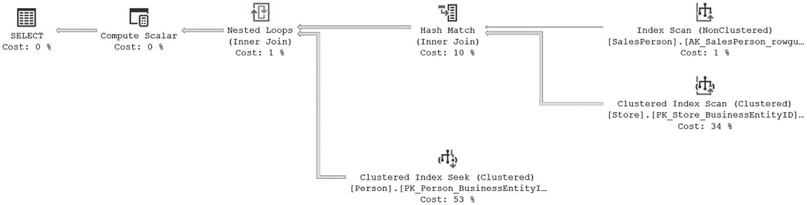
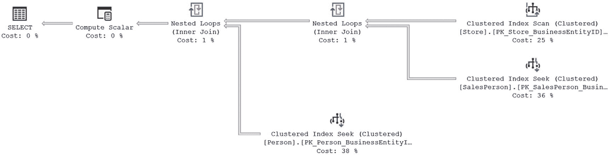
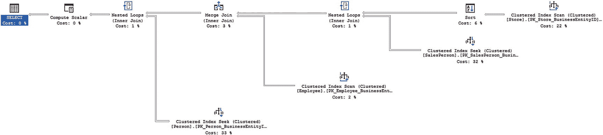
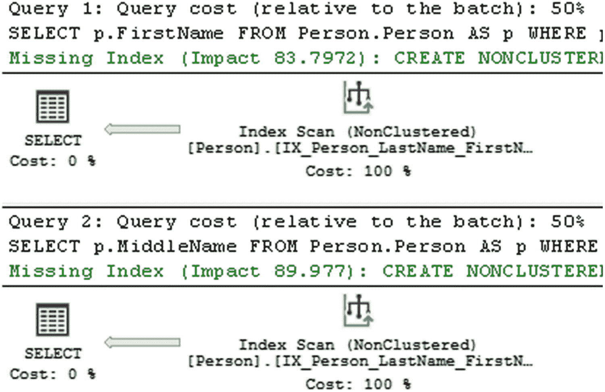
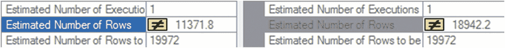
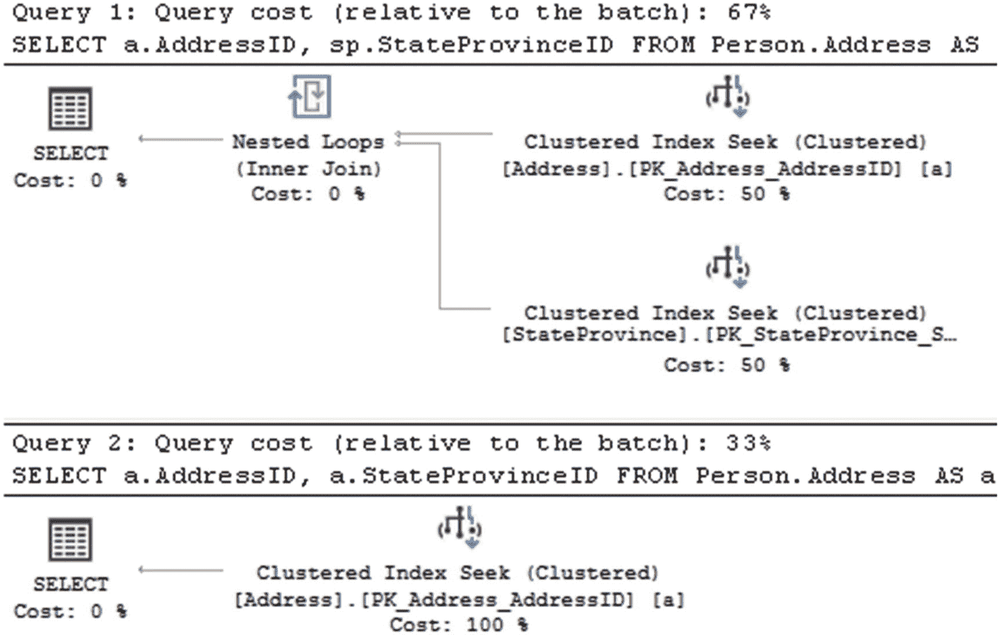

# 最小化优化器提示

SQL Server 的基于成本的优化器会根据当前的表/索引结构和统计信息，动态确定查询的处理策略。可以使用优化器提示来覆盖这种动态行为，通过指示优化器使用某种特定的处理策略，从而将部分决策权从优化器手中夺走。这使得优化器的行为变为静态，不允许其随着表/索引结构或统计信息的变化而动态更新处理策略。

由于通常很难比优化器更聪明，因此通常的建议是避免使用优化器提示。某些提示可能极其有益（例如 `OPTIMIZE FOR`），但其他一些提示只在非常特定的情况下才有效。一般来说，让优化器根据数据分布统计信息、索引和其他因素来确定一个经济高效的处理策略是有益的。强迫优化器（使用提示）采用特定的处理策略，往往弊大于利，如下列提示的示例所示：

- `JOIN` 提示
- `INDEX` 提示

## JOIN 提示

如第 6 章所述，优化器会根据表/索引结构和数据，动态地在两个数据集之间确定一个经济高效的 `JOIN` 策略。表 19-2 总结了 SQL Server 2017 支持的 `JOIN` 类型，以供快速参考。

表 19-2: SQL Server 2017 支持的 JOIN 类型

| JOIN 类型 | 连接列上的索引 | 连接表的通常大小 | 预排序的 JOIN 子句 |
| --- | --- | --- | --- |
| 嵌套循环 | 内表必须有索引<br>外表最好有索引 | 小 | 可选 |
| 合并 | 两表都必须有索引<br>最佳条件：两表都有聚集索引或覆盖索引 | 大 | 是 |
| 哈希 | 内表*没有*索引<br>最佳条件：内表大，外表小 | 任意 | 否 |
| 自适应 | 根据查询返回的数据，使用哈希或循环 | 可变，但通常非常大，因为它目前仅适用于列存储索引 | 取决于连接类型 |

SQL Server 2017 引入了新的连接类型：自适应连接。它实际上只是对嵌套循环或哈希连接的动态确定，但这种自适应处理方法有效地形成了一种新的连接类型，这就是我在此列出它的原因。

> **注意：** 外表通常是两个连接表中较小的一个。

你可以通过使用表 19-3 中的 `JOIN` 提示来指示 SQL Server 使用特定的 `JOIN` 类型。

表 19-3: JOIN 提示

| JOIN 类型 | JOIN 提示 |
| --- | --- |
| 嵌套循环 | `LOOP` |
| 合并 | `MERGE` |
| 哈希 | `HASH` |
| | `REMOTE` |

自适应连接没有对应的提示。有一个 `REMOTE` 连接的提示。当连接中的某个表位于当前数据库的远程服务器上时，可以使用此提示。它允许你根据输入大小，指定连接中的哪一方应执行工作。

要了解使用 `JOIN` 提示如何影响性能，请考虑以下 `SELECT` 语句：

```sql
SELECT s.Name AS StoreName,
p.LastName + ', ' + p.FirstName
FROM Sales.Store AS s
JOIN Sales.SalesPerson AS sp
ON s.SalesPersonID = sp.BusinessEntityID
JOIN HumanResources.Employee AS e
ON sp.BusinessEntityID = e.BusinessEntityID
JOIN Person.Person AS p
ON e.BusinessEntityID = p.BusinessEntityID;
```

图 19-16 显示了执行计划。



*图 19-16: 显示优化器所做选择的执行计划*

如你所见，SQL Server 动态决定使用 `LOOP JOIN` 来添加来自 `Person.Person` 表的数据，并使用 `HASH JOIN` 来连接 `Sales.Salesperson` 和 `Sales.Store` 表。正如第 6 章所演示的，对于影响小结果集的简单查询，`LOOP JOIN` 通常比 `HASH JOIN` 或 `MERGE JOIN` 提供更好的性能。由于来自 `Sales.Salesperson` 表的行数相对较少，你可能会觉得可以强制使用 `LOOP` 连接，如下所示：

```sql
SELECT s.Name AS StoreName,
p.LastName + ',   ' + p.FirstName
FROM Sales.Store AS s
JOIN Sales.SalesPerson AS sp
ON s.SalesPersonID = sp.BusinessEntityID
JOIN HumanResources.Employee AS e
ON sp.BusinessEntityID = e.BusinessEntityID
JOIN Person.Person AS p
ON e.BusinessEntityID = p.BusinessEntityID
OPTION (LOOP JOIN);
```

运行此查询时，执行计划会发生变化，如图 19-17 所示。



*图 19-17: 使用 JOIN 查询提示所做的更改*

以下是每个查询相应的性能输出：

- 无 `JOIN` 提示：

```
读取次数: 2364
持续时间: 84ms
```

- 使用 `JOIN` 提示：

```
读取次数: 3740
持续时间: 97ms
```

你可以看到，带有 `JOIN` 提示的查询比没有提示的查询运行时间更长。它还增加了读取次数。你可以让情况变得更糟。除了告诉查询中使用的所有提示都为 `LOOP` 连接外，还可以仅针对你感兴趣的那一个连接，如下所示：

```sql
SELECT s.Name AS StoreName,
p.LastName + ',   ' + p.FirstName
FROM Sales.Store AS s
INNER LOOP JOIN Sales.SalesPerson AS sp
ON s.SalesPersonID = sp.BusinessEntityID
JOIN HumanResources.Employee AS e
ON sp.BusinessEntityID = e.BusinessEntityID
JOIN Person.Person AS p
ON e.BusinessEntityID = p.BusinessEntityID;
```

运行此查询会产生如图 19-18 所示的执行计划。



*图 19-18: 使用 LOOP 连接提示带来的更多变化*

如你所见，查询计划中现在引用了四个表。在之前的执行过程中实际上都引用了四个表，但优化器能够通过优化的简化过程（在第 8 章中提到）从查询中消除一个表。现在，提示强迫优化器做出了与原本可能不同的选择，并从过程中移除了简化。读取次数下降了，尽管执行时间比上一个查询略有改善。

```
读取次数: 3749
持续时间: 86ms
```

`JOIN` 提示强制优化器忽略其自身的优化策略，转而使用查询指定的策略。`JOIN` 提示可能损害查询性能，原因如下：

- 提示阻止了自动参数化。
- 优化器无法动态决定表的连接顺序。

因此，不使用 `JOIN` 提示，而是让优化器动态确定经济高效的处理策略是明智的。当然也有例外，但这些例外必须通过彻底的测试来验证。


### 索引提示

如前所述，在`WHERE`子句的列上使用算术运算符会阻止优化器选择该列上的索引。为了提升性能，您可以重写查询，避免在`WHERE`子句中使用算术运算符，如对应示例所示。或者，您甚至可能想到使用`INDEX`提示（一种优化器提示）来强制优化器使用该列上的索引。然而，大多数情况下，最好避免使用`INDEX`提示，让优化器动态地运行。

要理解`INDEX`提示对查询性能的影响，请考虑“避免在 WHERE 子句列上使用算术运算符”一节中的示例。`PurchaseOrderID`列上的乘法运算符阻止了优化器选择该列上的索引。您可以使用`INDEX`提示来强制优化器使用`OrderID`列上的索引，如下所示：

```sql
SELECT *
FROM Purchasing.PurchaseOrderHeader AS poh WITH (INDEX(PK_PurchaseOrderHeader_PurchaseOrderID))
WHERE poh.PurchaseOrderID * 2 = 3400;
```

请注意使用`INDEX`提示与不使用`INDEX`提示时的相对成本比较，如图 19-18 所示。同时，请注意以下性能指标中显示的逻辑读次数差异：

*   无提示（在`WHERE`子句列上使用算术运算符）：

    ```text
    Reads: 11
    Duration: 210mcs
    ```

*   无提示（不在`WHERE`子句列上使用算术运算符）：

    ```text
    Reads: 2
    Duration: 105mcs
    ```

*   `INDEX`提示：

    ```text
    Reads: 44
    Duration: 380mcs
    ```

从执行计划的相对成本和逻辑读次数可以明显看出，使用`INDEX`提示的查询实际上损害了查询性能。尽管它允许优化器使用`PurchaseOrderID`列上的索引，但它没有允许优化器确定合适的索引访问机制。因此，优化器使用了索引扫描来访问仅仅一行。相比之下，避免在`WHERE`子句列上使用算术运算符且不使用`INDEX`提示，不仅允许优化器使用`PurchaseOrderID`列上的索引，还允许其确定合适的索引访问机制：`INDEX SEEK`。

因此，一般来说，应让优化器为查询选择最佳的索引策略，而不要使用`INDEX`提示来覆盖优化器的行为。此外，不使用`INDEX`提示允许优化器根据数据随时间的变化动态地决定最佳索引策略。图 19-19 显示了指定索引提示与不指定索引提示之间的区别。


*图 19-19：使用和不使用不同 INDEX 提示的查询成本*

## 使用域完整性和引用完整性

域完整性和引用完整性有助于定义和强制列的有效值，维护数据库的完整性。这是通过列/表约束来实现的。

由于数据访问通常是查询执行中最耗时的操作之一，避免冗余数据访问有助于优化器减少查询执行时间。域完整性和引用完整性帮助 SQL Server 优化器在不实际访问数据的情况下分析有效的数据值，从而减少查询时间。

为了理解这是如何发生的，请考虑以下示例：
*   `NOT NULL`约束
*   声明性引用完整性

### NOT NULL 约束

`NOT NULL`列约束用于实现域完整性，它定义了某个特定列不能输入`NULL`值。SQL Server 在运行时自动强制执行此规则，以维护该列的域完整性。此外，定义`NOT NULL`列约束有助于优化器在查询中对该列使用`ISNULL`函数时生成高效的处理策略。

要理解`NOT NULL`列约束的性能优势，请考虑以下示例。这两个查询旨在返回所有不等于`'B'`的值。这两个查询针对大小相似的列运行，每个查询都需要进行表扫描来返回数据：

```sql
SELECT p.FirstName
FROM Person.Person AS p
WHERE p.FirstName = 'C';
SELECT p.MiddleName
FROM Person.Person AS p
WHERE p.MiddleName = 'C';
```

这两个查询使用了相似的执行计划，如图 19-20 所示。


*图 19-20：因缺少索引而导致的表扫描*

差异主要是由估计要返回的行数引起的。虽然两个查询都针对同一个索引并对其进行扫描，但每个查询仍然有不同的谓词和估计行数，如图 19-21 所示。


*图 19-21：因 WHERE 子句不同而导致的不同估计行数*

由于`Person.MiddleName`列可以包含`NULL`，返回的数据是不完整的。这是因为，根据定义，虽然`NULL`值满足不以任何方式等于`'B'`的必要条件，但您不能以这种方式返回`NULL`值。需要添加一个`OR`子句。这意味着需要像这样修改第二个查询：

```sql
SELECT p.FirstName
FROM Person.Person AS p
WHERE p.FirstName = 'C';
SELECT p.MiddleName
FROM Person.Person AS p
WHERE p.MiddleName = 'C'
OR p.MiddleName IS NULL;
```

另外，如图 19-19 执行计划中缺失索引语句所示，这两个查询都可以从在其表上创建索引中受益。创建如下测试索引应能满足要求：

```sql
CREATE INDEX TestIndex1 ON Person.Person (MiddleName);
CREATE INDEX TestIndex2 ON Person.Person (FirstName);
```

当重新执行查询时，图 19-22 显示了两个`SELECT`语句的结果执行计划。


*图 19-22：使用 IS NULL 选项的效果*

如图 19-22 所示，优化器能够利用`Person.FirstName`列上的索引`TestIndex2`来获得`Index Seek`操作。不幸的是，处理`NULL`列的需求则大不相同。索引`TestIndex1`的使用方式不同。取而代之的是，为查询中定义的三个条件中的每一个创建了三个常量。然后通过`Concatenation`操作将它们连接在一起，进行排序和合并，然后通过`Nested Loop`操作符三次寻求索引以得到结果集。尽管从执行计划中的估计成本来看，这似乎是成本较低的查询（42% 对 58%），但性能指标却讲述了不同的故事。

```text
Reads: 43
Duration: 143ms
```
对比
```text
Reads: 68
Duration: 168ms
```

务必删除已创建的测试索引。

```sql
DROP INDEX TestIndex1 ON Person.Person;
DROP INDEX TestIndex2 ON Person.Person;
```


### NULL 值与数据库设计

尽可能避免在数据库中使用 `NULL` 值。然而，当数据未知且无法使用默认值时，`NULL` 又会回到设计中。我认为 `NULL` 是不可避免的，但应尽可能将其最小化。

当不得不处理 `NULL` 值时，请记住可以使用过滤索引来从索引中移除 `NULL` 值，从而提升该索引的性能。这在第 7 章中有详细说明。稀疏列提供了另一个帮助处理 `NULL` 值的选项。稀疏列主要旨在更高效地存储 `NULL` 值以减少空间占用——但会牺牲性能。此选项专门针对商务智能数据库，而非 OLTP 数据库，因为在事实表中存在大量 `NULL` 值是常见的设计。

### 声明式引用完整性

声明式引用完整性用于定义父表和子表之间的引用完整性。它确保子表中的记录仅在父表中存在对应记录时才存在。此规则的唯一例外是，子表可以包含一个 `NULL` 值作为链接子表行与父表行的标识符。对于子表中该标识符的所有其他值，父表中必须存在对应的值。在 SQL Server 中，DRI 是通过父表上的 `PRIMARY KEY` 约束和子表上的 `FOREIGN KEY` 约束来实现的。

在两个表之间建立了 DRI，并且子表的外键列被设置为 `NOT NULL` 后，SQL Server 优化器就能确信子表中的每条记录在父表中都有对应记录。有时这有助于优化器提升性能，因为不需要访问父表来验证子记录对应的父记录是否存在。

为了理解实现声明式引用完整性带来的性能优势，让我们看一个例子。首先，使用以下脚本消除两个表 `Person.Address` 和 `Person.StateProvince` 之间的引用完整性：

```sql
IF EXISTS (   SELECT *
FROM sys.foreign_keys
WHERE object_id = OBJECT_ID(N'[Person].[FK_Address_StateProvince_StateProvinceID]')
AND parent_object_id = OBJECT_ID(N'[Person].[Address]'))
ALTER TABLE Person.Address
DROP CONSTRAINT FK_Address_StateProvince_StateProvinceID;
```

考虑以下 `SELECT` 语句：

```sql
SELECT a.AddressID,
sp.StateProvinceID
FROM Person.Address AS a
JOIN Person.StateProvince AS sp
ON a.StateProvinceID = sp.StateProvinceID
WHERE a.AddressID = 27234;
```

请注意，此 `SELECT` 语句从父表（`Person.StateProvince`）中获取 `StateProvinceID` 列的值。如果数据的性质要求子表（`Person.StateProvince`）中的每个产品（由 `StateProvinceID` 标识）在父表（`Person.Address`）中都包含对应的产品，那么你可以将前面的 `SELECT` 语句重写如下，改为引用 `Address` 表来获取 `StateProvinceID` 列：

```sql
SELECT a.AddressID,
a.StateProvinceID
FROM Person.Address AS a
JOIN Person.StateProvince AS sp
ON a.StateProvinceID = sp.StateProvinceID
WHERE a.AddressID = 27234;
```

两个 `SELECT` 语句应该返回相同的结果集。在移除外键约束后，优化器为两个 `SELECT` 语句生成了相同的执行计划，如图 19-23 所示。


图 19-23
两个表之间未定义 DRI 时的执行计划

为了理解声明式引用完整性如何影响查询性能，请替换之前删除的 `FOREIGN KEY` 约束。

```sql
ALTER TABLE Person.Address WITH CHECK
ADD CONSTRAINT FK_Address_StateProvince_StateProvinceID
FOREIGN KEY
(
StateProvinceID
)
REFERENCES Person.StateProvince
(
StateProvinceID
);
```

### 注意

现在两个表之间已存在引用完整性。

图 19-24 显示了两个 `SELECT` 语句的结果执行计划。



图 19-24
显示在两个表之间定义 DRI 带来好处的执行计划

如你所见，第二个 `SELECT` 语句的执行计划得到了高度优化：没有访问 `Person.StateProvince` 表。在声明式引用完整性就位（且 `Address.StateProvinceID` 被设置为 `NOT NULL`）的情况下，优化器可以确信子表中的每条记录在父表中都包含对应记录。因此，第二个 `SELECT` 语句中父表和子表之间的 `JOIN` 子句是多余的，因为没有从父表请求其他数据。

你可能已经知道域完整性和引用完整性是好事，但你可以看到它们不仅确保数据完整性，还能提升性能。如上所示，域完整性和引用完整性为优化器生成具有成本效益的执行计划并提升性能提供了更多选择。

为了获得 DRI 的性能优势，如前所述，子表中的外键列应设置为 `NOT NULL`。否则，子表中可能存在一些行（其外键列值为 `NULL`），这些行在父表中没有对应表示。这不会阻止优化器在之前的查询中访问主表（`Prod`）。默认情况下——即如果未为列指定 `NOT NULL` 属性——该列可以包含 `NULL` 值。考虑到 `NOT NULL` 属性的好处以及本节解释的其他益处，如果 `NULL` 对于某列不是有效值，请始终将其属性标记为 `NOT NULL`。

你还必须确保在构建外键约束时使用了 `WITH CHECK` 选项。如果使用了 `NOCHECK` 选项，这些约束会被优化器视为不可信约束，你将无法实现它们可能带来的性能优势。

## 总结

正如本章所讨论的，为了提升数据库应用程序的性能，确保 SQL 查询设计得当以受益于索引、存储过程、数据库约束等性能增强技术至关重要。确保查询不会妨碍索引的使用。在许多情况下，无论查询结构如何，优化器都有能力生成具有成本效益的执行计划，但从一开始就正确设计查询仍然是一个好习惯。即使你为单个查询设计了高性能，数据库应用程序的整体性能也可能不尽如人意。不仅提升单个查询的性能很重要，确保它们不耗尽系统上的可用资源也同样重要。下一章将介绍如何减少查询中的资源使用。


