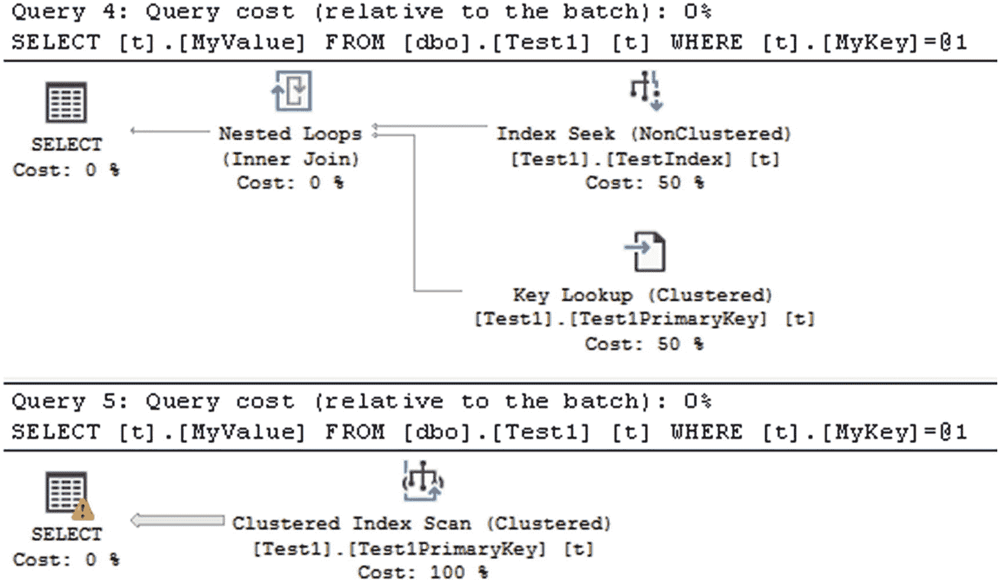
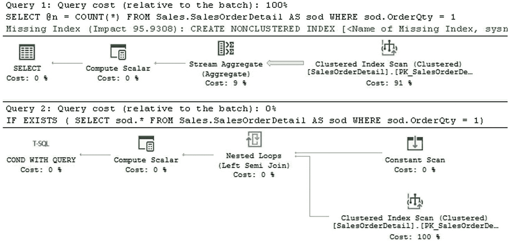
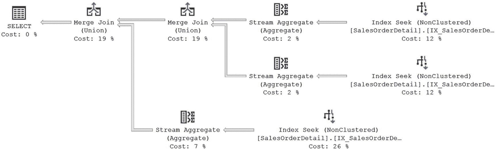
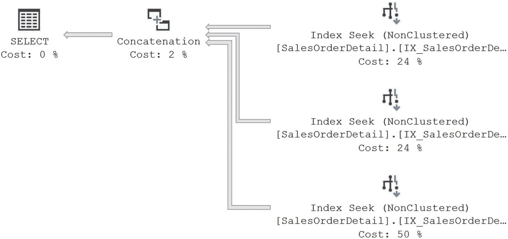
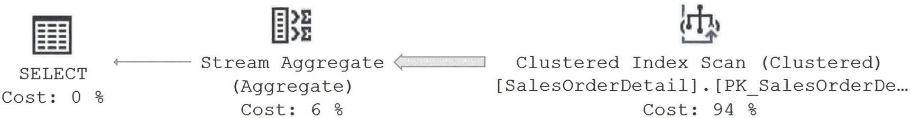
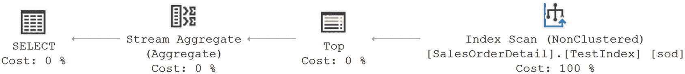
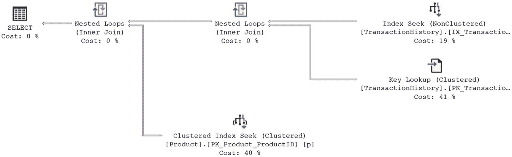
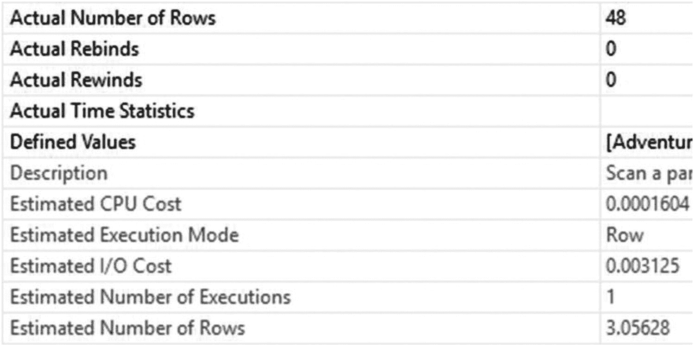
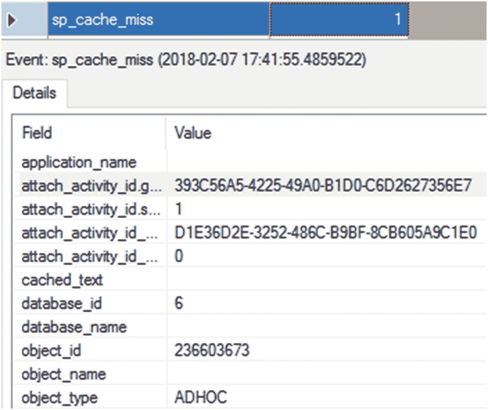

# 20. 减少查询资源使用

在上一章中，你专注于以充分利用索引和统计信息的方式编写查询。在本章中，你将确保以不会不当消耗资源的方式编写查询。编写查询有避免使用内存、CPU 和 I/O 的方法，也有使用这些资源超出实际所需的方法。我将介绍一系列机制，以确保由你控制的查询能最优地使用资源。

本章涵盖以下主题：

*   资源消耗较少的查询设计
*   有效利用过程缓存的查询设计
*   减少网络开销的查询设计
*   降低查询事务成本的技术

## 避免资源密集型查询

许多数据库功能可以通过多种查询技术来实现。你应该采用的方法是使用对资源友好且基于集合的查询技术。以下是几种可用于减少查询资源占用的技术：

*   避免数据类型转换。
*   使用 `EXISTS` 而非 `COUNT(*)` 来验证数据是否存在。
*   使用 `UNION ALL` 而非 `UNION`。
*   为聚合和排序操作使用索引。
*   在批处理查询中谨慎使用局部变量。
*   命名存储过程时要注意。

我将在接下来的章节中更详细地介绍这些要点。

### 避免数据类型转换

SQL Server 在某些情况下（由联机丛书中提供的大型数据转换表定义）允许将不同但兼容数据类型的值/常量与列的数据进行比较。SQL Server 会自动将数据从一种数据类型转换为另一种数据类型。这个过程称为*隐式数据类型转换*。尽管有用，但隐式转换会给查询优化器增加开销。为了提高性能，请使用与被比较列的数据类型相同的值/常量。

为了理解隐式数据类型转换如何影响性能，请考虑以下示例：

```sql
IF EXISTS (   SELECT *
              FROM sys.objects
              WHERE object_id = OBJECT_ID(N'dbo.Test1'))
    DROP TABLE dbo.Test1;
CREATE TABLE dbo.Test1 (Id INT IDENTITY(1, 1),
                        MyKey VARCHAR(50),
                        MyValue VARCHAR(50));
CREATE UNIQUE CLUSTERED INDEX Test1PrimaryKey ON dbo.Test1 (Id ASC);
CREATE UNIQUE NONCLUSTERED INDEX TestIndex ON dbo.Test1 (MyKey);
GO
SELECT TOP 10000
       IDENTITY(INT, 1, 1) AS n
INTO   #Tally
FROM   master.dbo.syscolumns AS scl,
       master.dbo.syscolumns AS sc2;
INSERT INTO dbo.Test1 (MyKey,
                       MyValue)
SELECT TOP 10000
       'UniqueKey' + CAST(n AS VARCHAR),
       'Description'
FROM   #Tally;
DROP TABLE #Tally;
SELECT t.MyValue
FROM   dbo.Test1 AS t
WHERE  t.MyKey = 'UniqueKey333';
SELECT t.MyValue
FROM   dbo.Test1 AS t
WHERE  t.MyKey = N'UniqueKey333';
```

在创建表 `Test1`、为其创建两个索引并插入一些数据后，定义了两个查询。两个查询返回相同的结果集。如你所见，除了与 `MyKey` 列相等的变量的数据类型不同外，这两个查询是相同的。由于该列是 `VARCHAR`，第一个查询不需要隐式数据类型转换。第二个查询使用了与 `MyKey` 列不同的数据类型，需要进行隐式数据类型转换，从而增加了查询性能的开销。图 20-1 显示了这两个查询的执行计划。



图 20-1
有和没有隐式数据类型转换的查询计划

隐式数据类型转换的复杂性取决于比较中涉及的数据类型的优先级。SQL Server 的数据类型优先级规则指定了哪种数据类型会转换为另一种。通常，优先级较低的数据类型会转换为优先级较高的数据类型。例如，`TINYINT` 数据类型的优先级低于 `INT` 数据类型。有关 SQL Server 中数据类型优先级的完整列表，请参阅 MSDN 文章“数据类型优先级”( `http://bit.ly/1cN7AYc` )。关于哪种数据类型可以隐式转换为哪种数据类型的更多信息，请参阅 MSDN 文章“数据类型转换”( `http://bit.ly/1j7kIJf` )。

注意 `SELECT` 运算符上的警告图标。它让你知道这个查询中有可疑之处。在本例中，是存在数据类型转换操作。优化器让你知道这可能会负面影响其查找和使用索引来辅助查询性能的能力。这也可能是一个误报。如果在任何谓词中都不使用的列上存在转换，那么发生隐式甚至显式转换真的无关紧要。

要查看具体的过程，请查看 `Clustered Index Scan` 运算符的属性和 `Predicate` 值。我的列出如下：

```sql
CONVERT_IMPLICIT(nvarchar(50),[AdventureWorks2017].[dbo].[Test1].[MyKey] as [t].[MyKey],0)=[@1]
```

平均持续时间从约 110 微秒增加到 1,400 微秒，逻辑读取从 4 次增加到 56 次。

当 SQL Server 比较具有某种数据类型的列值和具有不同数据类型的变量（或常量）时，变量（或常量）的数据类型总是被转换为列的数据类型。这样做是因为列值的访问是基于变量（或常量）的隐式转换值进行的。因此，在这种情况下，隐式转换总是应用于变量（或常量）。

如你所见，隐式数据类型转换既因糟糕的执行计划，也因增加的 CPU 转换成本，给查询性能增加了开销。因此，为了提高性能，请始终对两个表达式使用相同的数据类型。

### 使用 EXISTS 而非 COUNT(*) 来验证数据是否存在

一个常见的数据库需求是验证一组数据是否存在。通常你会看到使用一批 SQL 查询来实现这一点，如下所示：

```sql
DECLARE @n INT;
SELECT @n = COUNT(*)
FROM   Sales.SalesOrderDetail AS sod
WHERE  sod.OrderQty = 1;
IF @n > 0
    PRINT 'Record Exists';
```

使用 `COUNT(*)` 来验证数据存在是高度资源密集型的，因为 `COUNT(*)` 必须扫描表中的所有行。`EXISTS` 只需扫描并在匹配 `EXISTS` 条件的第一条记录处停止。为了提高性能，请使用 `EXISTS` 代替 `COUNT(*)` 方法。

```sql
IF EXISTS (   SELECT sod.*
              FROM   Sales.SalesOrderDetail AS sod
              WHERE  sod.OrderQty = 1)
    PRINT 'Record Exists';
```

`EXISTS` 技术相对于 `COUNT(*)` 技术的性能优势可以通过查询性能指标以及图 20-2 中的执行计划来比较，从运行这些查询的输出中可以看出。



图 20-2
COUNT 与 EXISTS 的区别

```text
COUNT 持续时间: 8.9ms
读取: 1248
EXISTS 持续时间: 1.7ms
读取: 17
```

如你所见，`EXISTS` 技术仅使用了 17 次逻辑读取，而 `COUNT(*)` 技术使用了 1,246 次，执行时间从 8.9 毫秒减少到 1.7 毫秒。因此，要确定数据是否存在，请使用 `EXISTS` 技术。


### 使用 UNION ALL 代替 UNION

你可以使用 `UNION` 子句来连接多个 `SELECT` 语句的结果集，如下所示，如图 20-3：



图 20-3

使用 `UNION` 子句的查询的执行计划

```
SELECT sod.ProductID,
sod.SalesOrderID
FROM Sales.SalesOrderDetail AS sod
WHERE sod.ProductID = 934
UNION
SELECT sod.ProductID,
sod.SalesOrderID
FROM Sales.SalesOrderDetail AS sod
WHERE sod.ProductID = 932
UNION
SELECT sod.ProductID,
sod.SalesOrderID
FROM Sales.SalesOrderDetail AS sod
WHERE sod.ProductID = 708;
```

`UNION` 子句处理来自三个 `SELECT` 语句的结果集，会从最终结果集中移除重复项，相当于对每个查询有效地执行了 `DISTINCT`，并使用 `Stream Aggregate` 进行聚合。如果参与 `UNION` 子句的 `SELECT` 语句的结果集彼此互斥，或者你允许最终结果集中包含重复行，那么请使用 `UNION ALL` 而不是 `UNION`。这样可以避免检测和移除重复项的开销，从而提高性能，如图 20-4 所示。



图 20-4

使用 `UNION ALL` 的查询的执行计划

如你所见，在第一种情况下（使用 `UNION`），优化器对记录进行聚合以消除重复项，同时使用 `MERGE` 来组合三个 `SELECT` 语句的结果集。由于结果集彼此互斥，你可以使用 `UNION ALL` 代替 `UNION` 子句。使用 `UNION ALL` 子句避免了检测重复项和连接数据的开销，从而提高了性能。

查询性能指标也说明了类似的情况，`UNION` 查询耗时 125ms，而 `UNION ALL` 查询耗时 95ms。有趣的是，逻辑读次数相同，都是 20。在这种情况下，使得性能产生差异的原因是，一个查询需要额外的处理，而另一个查询则不需要。

### 为聚合和排序条件使用索引

通常，像 `MIN` 和 `MAX` 这样的聚合函数会受益于对应列上的索引。正如前面章节所展示的，它们从列存储索引中获益更多。然而，即使是标准索引也能辅助某些聚合查询。如果这些列上没有任何类型的索引，优化器就必须扫描基表（或行存储聚集索引），检索所有行，并对包含所有行的分组执行流聚合以找出 `MIN`/`MAX` 值，如下例所示（参见图 20-5）：



图 20-5

扫描整个表并过滤到单行

```
SELECT  MIN(sod.UnitPrice)
FROM    Sales.SalesOrderDetail AS sod;
```

使用 `MIN` 聚合函数的 `SELECT` 语句的性能指标如下：

```
Duration: 15.8ms
Reads: 1248
```

该查询仅为了检索包含 `UnitPrice` 列最小值的行，就执行了超过 1,200 次逻辑读。你可以在图 20-5 的执行计划中看到这一点。一个巨大的数据行从 `Clustered Index Scan` 操作中出来，却仅被 `Stream Aggregate` 操作过滤到单行。如果你在 `UnitPrice` 列上创建索引，那么索引的叶子页将预先对 `UnitPrice` 值进行排序。

```
CREATE INDEX TestIndex ON Sales.SalesOrderDetail (UnitPrice ASC);
```

在 `UnitPrice` 列上的索引显著提高了 `MIN` 聚合函数的性能。优化器可以通过寻址到索引中最顶部的行来检索最小的 `UnitPrice` 值。这减少了查询的逻辑读次数，如相应的指标和执行计划所示（参见图 20-6）。



图 20-6

索引极大地提高了性能

```
Duration: 97 mcs
Reads: 3
```

类似地，在 `ORDER BY` 子句引用的列上创建索引有助于优化器快速组织结果集，因为列值在索引中已经预先排序。`GROUP BY` 子句的内部实现也会首先对列值进行排序，因为排序后的列值允许相邻的匹配值快速分组。因此，与 `ORDER BY` 子句类似，`GROUP BY` 子句也受益于 `GROUP BY` 子句中引用的列值的预先排序。

需要重申的是，对于大多数聚合查询，列存储索引很可能比常规的行存储索引带来更好的性能。然而，在某些情况下，列存储索引可能是资源浪费，因此了解可能存在的选项是好的，这取决于你的查询和结构。


### 在批处理查询中谨慎使用局部变量

通常，多个查询会作为批处理一起提交，以避免多次网络往返。在查询批处理中使用局部变量在各个独立查询之间传递值是一种常见做法。然而，在批处理查询的 `WHERE` 子句中使用局部变量，并非在所有情况下都能让优化器生成高效的执行计划。

要理解在批处理查询的 `WHERE` 子句中使用局部变量如何影响性能，请考虑以下批处理查询：

```sql
DECLARE @Id INT = 67260;
SELECT  p.Name,
        p.ProductNumber,
        th.ReferenceOrderID
FROM    Production.Product AS p
JOIN    Production.TransactionHistory AS th
        ON th.ProductID = p.ProductID
WHERE   th.ReferenceOrderID = @Id;
```

图 20-7 展示了这个 `SELECT` 语句的执行计划。


**图 20-7**
显示批处理查询中局部变量影响的执行计划

如您所见，执行了 `Index Seek` 操作来访问 `Production.TransactionHistory` 主键中的行。通过循环联接，需要对聚集索引进行 `Key Lookup`。最后，通过另一个循环联接，针对 `Product` 表的 `Clustered Index Seek` 将结果添加到结果集中。如果 `SELECT` 语句在不使用局部变量的情况下执行，即将局部变量值替换为适当的常量值，如下列查询所示，优化器会做出不同的选择：

```sql
SELECT  p.Name,
        p.ProductNumber,
        th.ReferenceOrderID
FROM    Production.Product AS p
JOIN    Production.TransactionHistory AS th
        ON th.ProductID = p.ProductID
WHERE   th.ReferenceOrderID = 67260;
```

图 20-8 展示了结果。


**图 20-8**
未使用局部变量时的查询执行计划

您会得到一个完全不同的执行计划。其中部分操作是相似的。您有相同的 `Index Seek` 和 `Key Lookup` 运算符，但它们的数据是通过 `Clustered Index Scan` 和 `Merge Join` 进行联接的。在考虑性能时，快速比较计划会变得困难，因此让我们查看性能指标以了解是否存在差异。首先，这是使用局部变量的初始查询的信息：

```
Duration: 696ms
Reads: 242
```

然后是第二个查询，没有使用局部变量：

```
Duration: 817ms
Reads: 197
```

使用局部变量的计划执行速度稍快一些，696ms 对比 817ms，但读取次数却多了不少，242 对比 197。是什么导致了计划之间的差异以及性能上的不同？这都归结于一个事实：除了在语句级重新编译的情况下，操作符无法获知局部变量的具体值。因此，无法基于统计信息中值的具体数量来估计行数，而是根据密度图进行计算估计。

`TransactionHistory` 表中有 113,443 行。密度值为 2.694111E-05。将它们相乘，我们得到值 3.05628。现在，让我们看一下第一个执行计划（即图 20-8 中的计划）的估计行数。

估计行数，在图 20-9 底部，是 3.05628。这与计算结果完全相同。但请注意，图 20-9 顶部的实际行数是 48。这变得很重要。如果我们查看第二个计划（图 20-8 中的计划）中同一运算符的相同属性，我们会看到估计行数和实际行数相同，都是 48。在这种情况下，优化器认为返回 48 行数据太多，无法通过针对 `Product` 表的 `Index Seek` 实现良好性能。因此，它选择使用有序扫描（您可以通过 `Index Scan` 运算符的属性验证）然后进行合并联接。


**图 20-9**
估计行数与实际行数对比

事实上，第一个计划更快；然而，它确实导致了更高的 I/O 输出。这就是我们需要谨慎的地方。在这种情况下，性能稍好一些，但如果系统处于负载之下，尤其是在 I/O 压力下，那么第二个计划可能会运行得更快，对资源的争用更少，因为它的总读取次数更少。谨慎之处在于识别在特定情况下哪个计划更好。

为避免这种潜在的性能问题，请使用以下方法。不要在批处理中将局部变量用作此类查询的过滤条件。局部变量与参数值不同，如第 17 章所示。为批处理创建一个存储过程，并按如下方式执行：

```sql
CREATE OR ALTER PROCEDURE ProductDetails (@id INT)
AS
SELECT p.Name,
       p.ProductNumber,
       th.ReferenceOrderID
FROM Production.Product AS p
JOIN Production.TransactionHistory AS th
  ON th.ProductID = p.ProductID
WHERE th.ReferenceOrderID = @id;
GO
EXEC ProductDetails @id = 1;
```

这种方法可能适得其反。使用传递给参数的值的过程称为 `parameter sniffing`。参数探测会自动发生在所有存储过程和参数化查询中。根据统计信息的准确性和传递给参数的值，使用特定值可能会得到一个糟糕的计划，而使用采样值（当您使用局部变量时会发生）可能会得到一个好的计划。测试是在任何特定情况下确定哪种方法效果更好的唯一途径。然而，在大多数情况下，拥有准确值比采样值更好。有关参数探测的更多详细信息，请参见第 17 章。

作为一般准则，最好避免硬编码值。如果值必须更改，您可能需要在大量代码中进行更改。如果您确实需要在查询中编写值，局部变量可以让您在批处理顶部的单个位置控制它们，从而使代码管理更容易。然而，正如我们刚才看到的，当用于数据检索时，局部变量会影响计划选择。在这种情况下，参数值是更可取的。您甚至可以设置参数值并为其提供默认值。这些值仍将作为常规参数被探测。


### 谨慎命名存储过程

存储过程的名称确实很重要。你不应该用 `sp_` 前缀来命名你的过程。开发者经常在他们的存储过程前加上 `sp_` 前缀，以便轻松识别这些存储过程。然而，SQL Server 会假定任何带有此前缀的存储过程很可能是一个系统存储过程，其位置在 `master` 数据库中。当提交一个带有 `sp_` 前缀的存储过程执行时，SQL Server 会按以下顺序在以下位置查找该存储过程：

*   在 master 数据库中
*   在当前数据库中，基于提供的任何限定符（数据库名或所有者）
*   如果未指定架构，则在当前数据库中使用 `dbo` 作为架构

因此，尽管带有 `sp_` 前缀的用户创建的存储过程存在于当前数据库中，`master` 数据库仍会被首先检查。即使存储过程已用数据库名限定，这种情况也会发生。

要理解为存储过程名称添加 `sp_` 前缀的影响，请考虑以下存储过程：

```
IF EXISTS ( SELECT  *
FROM    sys.objects
WHERE   object_id = OBJECT_ID(N'[dbo].[sp_Dont]')
AND type IN (N'P', N'PC') )
DROP PROCEDURE  [dbo].[sp_Dont]
GO
CREATE PROC [sp_Dont]
AS
PRINT 'Done!'
GO
--Add plan of sp_Dont to procedure cache
EXEC AdventureWorks2017.dbo.[sp_Dont] ;
GO
--Use the above cached plan of sp_Dont
EXEC AdventureWorks2012.dbo.[sp_Dont] ;
GO
```

存储过程的第一次执行会将其执行计划添加到过程缓存中。随后对该存储过程的执行会复用过程缓存中现有的计划，除非需要重新编译该计划（存储过程重新编译的原因在第 10 章解释）。因此，如图 20-10 所示的存储过程 `sp_Dont` 的第二次执行应该会在过程缓存中找到一个计划。这由相应扩展事件输出中的 `SP:CacheHit` 事件表示。


图 20-10：显示 `sp_` 前缀对存储过程名称影响的扩展事件输出

请注意，在 SQL Server 尝试在过程缓存中定位存储过程的计划之前，会触发一个 `SP:CacheMiss` 事件。`SP:CacheMiss` 事件是由 SQL Server 在 master 数据库中查找存储过程引起的，即使该存储过程的执行已正确地用用户数据库名限定。

当你用一个现有系统存储过程的名称创建存储过程时，`sp_` 前缀的这个特性会变得更加有趣。

```
CREATE OR ALTER PROC sp_addmessage @param1 NVARCHAR(25)
AS
PRINT  '@param1 =  '  + @param1 ;
GO
EXEC AdventureWorks2017.dbo.[sp_addmessage]   'AdventureWorks';
```

如图 20-11 所示，执行这个用户定义的存储过程会导致执行来自 `master` 数据库的系统存储过程 `sp_addmessage`。


图 20-11：显示 `sp_` 前缀对存储过程名称影响的存储过程执行结果

不幸的是，无法执行这个用户定义的存储过程。现在你可以明白为什么不应该用 `sp_` 前缀来命名用户定义的存储过程了。请使用其他命名约定。从纯粹的性能角度来看，这是一个微不足道的改进。但是，如果你处理量大且响应时间至关重要，那么避免使用 `sp_` 命名标准是你多争取到的一个有利的小细节。

## 减少网络往返次数

数据库应用程序通常执行多个查询来实现一个数据库操作。除了优化单个查询的性能外，优化批处理的性能也很重要。为了减少多次网络往返的开销，请考虑以下技术：

*   一起执行多个查询。
*   使用 `SET NOCOUNT`。

让我们更深入地看看这些技术。

### 一起执行多个查询

最好将一组查询一起作为批处理或存储过程提交。除了减少数据库应用程序和服务器之间的网络往返次数外，存储过程还提供多种性能和管理优势，如第 16 章所述。这意味着应用程序中的代码需要能够处理多个结果集。这也意味着你的 T-SQL 代码可能需要处理 XML 数据或其他大型数据集，而不是单行插入或更新。

### 使用 SET NOCOUNT

在执行批处理或存储过程时，你还需要考虑另一个因素。在批处理或存储过程中的每个查询执行后，服务器都会报告受影响的行数。

```
( row(s) affected)
```

此信息返回给数据库应用程序，并增加了网络开销。使用 T-SQL 语句 `SET NOCOUNT` 来避免此开销。

```
SET NOCOUNT ON  SET NOCOUNT OFF
```

请注意，与某些 `SET` 语句不同，`SET NOCOUNT` 语句不会导致存储过程出现任何重新编译问题，如第 18 章所述。

## 降低事务成本

SQL Server 中的每个操作查询都是作为*原子*操作执行的，以便数据库表的状态从一个*一致*状态转换到另一个状态。SQL Server 自动执行此操作，且无法禁用。如果从一个一致状态到另一个一致状态的转换需要多个数据库查询，则应使用显式定义的数据库事务来维护跨多个查询的原子性。每个原子操作的新旧状态都保存在事务日志（磁盘上）中，以确保*持久性*，这保证了原子操作一旦成功完成其结果就不会丢失。原子操作在执行期间通过数据库锁与其他数据库操作*隔离*。

基于事务的特性，以下是降低事务成本的两大建议：

*   减少日志记录开销。
*   减少锁开销。


### 减少日志开销

一个数据库查询可能由多个数据操作查询组成。如果为每个查询单独维持原子性，则会在事务日志上执行大量磁盘写入。由于磁盘活动比内存或 CPU 活动慢得多，过度的磁盘活动会增加数据库功能的执行时间。例如，考虑以下批处理查询：

```
--创建测试表
IF (SELECT  OBJECT_ID('dbo.Test1')
) IS NOT NULL
DROP TABLE dbo.Test1;
GO
CREATE TABLE dbo.Test1 (C1 TINYINT);
GO
--插入 10000 行
DECLARE @Count INT = 1;
WHILE @Count <= 10000
BEGIN
INSERT  INTO dbo.Test1
(C1)
VALUES  (@Count % 256);
SET @Count = @Count + 1;
END
```

由于 `INSERT` 语句的每次执行本身都是原子的，SQL Server 将为 `INSERT` 语句的每次执行写入事务日志。

减少日志磁盘写入次数的一个简单方法是将操作查询包含在显式事务中。

```
DECLARE @Count INT = 1;
DBCC SQLPERF(LOGSPACE);
BEGIN TRANSACTION
WHILE @Count <= 10000
BEGIN
INSERT  INTO dbo.Test1
(C1)
VALUES  (@Count % 256) ;
SET @Count = @Count + 1 ;
END
COMMIT
DBCC SQLPERF(LOGSPACE);
```

定义的事务范围（在 `BEGIN TRANSACTION` 和 `COMMIT` 命令对之间）将原子性的范围扩展到事务内包含的多个 `INSERT` 语句。这减少了日志磁盘写入次数，并提升了数据库功能的性能。要验证此理论，请在每个 `WHILE` 循环前后运行以下 T-SQL 命令：

```
DBCC SQLPERF(LOGSPACE);
```

这将向您显示日志空间使用百分比。在我的数据库上运行第一组插入时，日志使用率从 3.2% 上升到 3.3%。运行第二组插入时，日志增长了约 6%。

最佳方法是处理数据集而非单独的行。`WHILE` 循环本身可能是一项成本高昂的操作，就像游标一样（关于游标的更多详情见第 23 章）。因此，运行一个避免 `WHILE` 循环而改用基于集合的方法的查询效果更佳。

```
SELECT TOP 10000
IDENTITY(INT, 1, 1) AS n
INTO #Tally
FROM master.dbo.syscolumns AS scl,
master.dbo.syscolumns AS sc2;
DBCC SQLPERF(LOGSPACE);
BEGIN TRANSACTION
INSERT INTO dbo.Test1 (C1)
SELECT TOP 1000
(n % 256)
FROM #Tally AS t
COMMIT
```

在运行此查询前后使用 `DBCC SQLPERF()` 函数进行测试，显示日志内已用空间的增长不到 0.01%，并且它运行耗时 41 毫秒，而 `WHILE` 循环则超过 2 秒。

然而，需要注意的一个问题是，在一个事务中包含过多数据操作查询会增加事务的持续时间。在此期间，所有其他试图访问事务中引用的资源的查询都会被阻塞。由于长事务，回滚持续时间和恢复期间的恢复时间也会增加。

### 减少锁开销

默认情况下，所有四种 SQL 语句（`SELECT`、`INSERT`、`UPDATE` 和 `DELETE`）都使用数据库锁将其工作与其他 SQL 语句的工作隔离。这种锁管理会给查询增加性能开销。通过请求更少的锁，可以提高查询的性能。进而，其他查询的性能也会得到改善，因为它们等待获取自身锁的时间更短。

默认情况下，SQL Server 可以提供行级锁。对于处理大量行的查询，为所有单独的行请求行锁会给锁管理过程增加显著的开销。您可以通过降低锁粒度（例如页级或表级）来减少此锁开销。SQL Server 会动态执行锁升级，同时考虑锁开销。因此，通常无需手动升级锁级别。但如果需要，您可以使用如下锁提示以编程方式控制查询的并发性：

```
SELECT * FROM  WITH(PAGLOCK)  --使用页级锁
```

类似地，默认情况下，SQL Server 除了为 `INSERT`、`UPDATE` 和 `DELETE` 语句使用锁外，也为 `SELECT` 语句使用锁。这允许 `SELECT` 语句读取未被修改的数据。在某些情况下，数据可能相当静态，并不会经历太多修改。在此类情况下，您可以通过以下方式之一减少 `SELECT` 语句的锁开销：

*   将数据库标记为 `READONLY`（只读）。

```
ALTER DATABASE  SET READ_ONLY
```

这允许用户从数据库检索数据，但阻止他们修改数据。此设置立即生效。如果偶尔需要修改数据库，则可暂时将其转换为 `READWRITE`（读写）模式。

*   使用快照隔离级别之一。

    SQL Server 提供了一种机制，在更新发生时将数据版本放入 tempdb，从而显著减少读取操作的锁开销和阻塞。您可以使用 `ALTER` 语句更改数据库的隔离级别。

```
ALTER DATABASE  SET READ_WRITE

ALTER DATABASE  SET READONLY
```

*   阻止 `SELECT` 语句请求任何锁。

```
ALTER DATABASE AdventureWorks2017 SET READ_COMMITTED_SNAPSHOT ON;
```

```
SELECT * FROM  WITH(NOLOCK)
```

这可以防止 `SELECT` 语句请求任何锁，并且仅适用于 `SELECT` 语句。虽然 `NOLOCK` 提示不能直接在操作查询（`INSERT`、`UPDATE` 和 `DELETE`）中引用的表上使用，但可以用于操作查询的数据检索部分，如下所示：

```
DELETE Sales.SalesOrderDetail
FROM Sales.SalesOrderDetail AS sod WITH (NOLOCK)
JOIN Production.Product AS p WITH (NOLOCK)
ON sod.ProductID = p.ProductID
AND p.ProductID = 0;
```

需要知道的是，这会导致脏读，可能引起重复行或丢失行，因此被认为是控制锁的最后手段。事实上，这被认为是相当危险的，并会导致不正确的结果。最佳方法是将数据库标记为只读或使用快照隔离级别之一。

这是一个很大的主题，还有很多内容可以讨论。我将在下一章讨论不同类型的锁请求以及如何管理锁开销。如果您对本节中的数据库进行了任何建议的更改，我建议从备份中恢复。

## 总结

正如本章所讨论的，为了提高数据库应用程序的性能，确保 SQL 查询设计得当以受益于索引、存储过程、数据库约束等性能增强技术至关重要。确保查询对资源友好，并且不会妨碍索引的使用。在许多情况下，优化器有能力生成成本效益高的执行计划，无论查询结构如何，但首先正确设计查询仍然是良好的实践。即使您为单个查询设计了高性能，数据库应用程序的整体性能也可能不尽如人意。不仅提高单个查询的性能很重要，还要确保它们与其他查询良好协作，不会引起严重的阻塞问题也很关键。在下一章中，您将了解数据库应用程序的不同阻塞方面。


