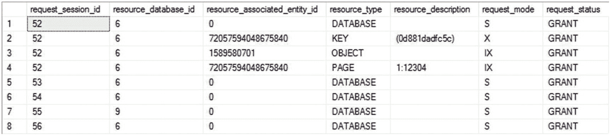

# 更新（U）锁模式

更新（U）锁模式可能被认为类似于共享（S）锁，但它还包含在同一查询中修改数据的目标。与（S）锁不同，（U）锁表明数据是为修改而读取。由于数据是为修改而读取的，SQL Server 不允许同时对数据持有一个以上的（U）锁。此规则有助于维护数据完整性。请注意，并发的（S）锁在数据上是允许的。（U）锁与 `UPDATE` 语句相关联，而 `UPDATE` 语句的操作实际上涉及两个中间步骤：首先读取要修改的数据，然后修改数据。

在这两个中间步骤中使用了不同的锁模式以最大化并发性。在读取数据时，第一步不是获取排他锁，而是获取数据上的（U）锁。在第二步中，（U）锁被转换为用于修改的排他（X）锁。如果不需要修改，则释放（U）锁；换句话说，它不会一直持有到事务结束。考虑以下脚本，它将导致阻塞，直到 `UPDATE` 语句完成：

```sql
UPDATE Sales.Currency
SET Name = 'Euro'
WHERE CurrencyCode = 'EUR';
```

要理解 `UPDATE` 语句中间步骤的锁行为，你需要在查询运行时从 `sys.dm_tran_locks` 获取数据。你可以按照下面概述的步骤，在 `UPDATE` 语句的每一步之后获取锁状态。你需要打开三个连接，我将它们称为连接 1、连接 2 和连接 3。这将需要在 Management Studio 中打开三个不同的查询窗口。你将按照我指定的顺序在列出的连接中运行查询，以到达一个阻塞情况。这样做的目的是观察这些阻塞的发生过程。表 21-1 显示了在不同的 T-SQL 查询窗口中的不同连接，以及需要在其中运行的查询顺序。

**表 21-1**

演示 UPDATE 阻塞的脚本顺序

| 脚本顺序 | T-SQL 窗口 1 (连接 1) | T-SQL 窗口 2 (连接 2) | T-SQL 窗口 3 (连接 3) |
| :--- | :--- | :--- | :--- |
| **1** | `BEGIN TRANSACTION LockTran2`<br>`--Retain an (S) lock on the resource`<br>`SELECT *`<br>`FROM Sales.Currency AS c WITH (REPEATABLEREAD)`<br>`WHERE c.CurrencyCode = 'EUR' ;`<br>`--Allow DMVs to be executed before second step of`<br>`-- UPDATE statement is executed by transaction LockTran1`<br>`WAITFOR DELAY '00:00:10';`<br>`COMMIT` | | |
| **2** | | `BEGIN TRANSACTION LockTran1`<br>`UPDATE Sales.Currency`<br>`SET Name = 'Euro'`<br>`WHERE CurrencyCode = 'EUR';`<br>`-- NOTE: We're not committing yet` | |
| **3** | | | `SELECT dtl.request_session_id,`<br>`dtl.resource_database_id,`<br>`dtl.resource_associated_entity_id,`<br>`dtl.resource_type,`<br>`dtl.resource_description,`<br>`dtl.request_mode,`<br>`dtl.request_status`<br>`FROM sys.dm_tran_locks AS dtl`<br>`ORDER BY dtl.request_session_id;` |
| **4) 等待 10 秒** | | | |
| **5** | | | `SELECT dtl.request_session_id,`<br>`dtl.resource_database_id,`<br>`dtl.resource_associated_entity_id,`<br>`dtl.resource_type,`<br>`dtl.resource_description,`<br>`dtl.request_mode,`<br>`dtl.request_status`<br>`FROM sys.dm_tran_locks AS dtl`<br>`ORDER BY dtl.request_session_id;` |
| **6** | | `COMMIT` | |

连接 1 中运行的 `REPEATABLEREAD` 锁定提示允许 `SELECT` 语句保留资源上的（S）锁。连接 3 中 `sys.dm_tran_locks` 的输出将提供 `UPDATE` 语句第一步之后的锁状态，因为 `UPDATE` 语句向排他（X）锁的转换被 `SELECT` 语句阻塞了。接下来，让我们看看当你逐步执行 `UPDATE` 语句的各个步骤时，`sys.dm_tran_locks` 提供的锁状态。

图 21-3 显示了 `UPDATE` 语句第一步之后的锁状态（如前所述，从在第三个连接，即连接 3 上执行的 `sys.dm_tran_locks` 的输出中获得）。


**图 21-3**

`sys.dm_tran_locks` 的输出，显示 UPDATE 语句的锁转换状态

> **注意**
>
> 这些行的顺序并不那么重要。我按 `session_id` 排序是为了将每个查询的锁分组在一起。

*   图 21-4 显示了 `UPDATE` 语句第二步之后的锁状态。



**图 21-4**

`sys.dm_tran_locks` 的输出，显示 UPDATE 语句持有的最终锁状态

从 `UPDATE` 语句第一步之后的 `sys.dm_tran_locks` 输出中，你可以注意到以下几点：

*   数据行上授予了 SPID 一个（U）锁。
*   请求了数据行上向（X）锁的转换。

从 `UPDATE` 语句第二步之后的 `sys.dm_tran_locks` 输出中，你可以看到 `UPDATE` 语句仅在数据行上持有一个（X）锁。本质上，数据行上的（U）锁被转换为（X）锁。

这一点很重要，通过不在第一步获取排他锁，`UPDATE` 语句在此期间允许其他事务使用 `SELECT` 语句读取数据。这是可能的，因为（U）锁和（S）锁彼此兼容。这提高了数据库的并发性。

> **注意**
>
> 我将在本章后面讨论不同锁模式之间的锁兼容性。

你可能好奇为什么在 `UPDATE` 语句的第一步使用（U）锁而不是（S）锁。要理解在 `UPDATE` 语句的第一步使用（S）锁而不是（U）锁的缺点，让我们将 `UPDATE` 语句分解为两个步骤。

1.  使用（S）锁而不是（U）锁读取要修改的数据。
2.  通过获取（X）锁来修改数据。

考虑以下代码：

```sql
BEGIN TRAN
--1.Read data to be modified using (S)lock instead of (U)lock.
--    Retain the (S)lock using REPEATABLEREAD locking hint, since
--    the original (U)lock is retained until the conversion to
--    (X)lock.
SELECT  *
FROM    Sales.Currency AS c WITH (REPEATABLEREAD)
WHERE   c.CurrencyCode = 'EUR' ;
--Allow another equivalent update action to start concurrently
WAITFOR DELAY '00:00:10' ;
--2. Modify the data by acquiring (X)lock
UPDATE  Sales.Currency WITH (XLOCK)
SET     Name = 'EURO'
WHERE   CurrencyCode = 'EUR' ;
COMMIT
```

如果这个事务从两个连接同时执行，那么，在延迟之后，它会导致死锁，如下所示：

```
Msg 1205, Level 13, State 51, Line 13
Transaction (Process ID 58) was deadlocked on lock resources with another process and has been chosen as the deadlock victim. Rerun the transaction.
```

两个事务都使用（S）锁读取要修改的数据，然后请求（X）锁进行修改。当第一个事务尝试转换为（X）锁时，它被第二个事务持有的（S）锁阻塞。同样，当第二个事务尝试从（S）锁转换为（X）锁时，它被第一个事务持有的（S）锁阻塞，而第一个事务又反过来被第二个事务阻塞。这导致了循环阻塞——因此，发生了死锁。

> **注意**
>
> 死锁将在第 22 章更详细地介绍。

为了避免这种典型的死锁，`UPDATE` 语句在其第一个中间步骤中使用（U）锁而不是（S）锁。与（S）锁不同，（U）锁不允许同时对同一资源持有另一个（U）锁。这迫使第二个并发的 `UPDATE` 语句等待，直到第一个 `UPDATE` 语句完成。


### 排他模式

排他模式为数据操作查询（如 `INSERT`、`UPDATE` 和 `DELETE`）提供对数据库资源的独占修改权限。它阻止其他并发事务访问正在修改的资源。`INSERT` 和 `DELETE` 语句都在其执行之初就获取（X）锁。如前所述，`UPDATE` 语句在读取要修改的数据后转换为（X）锁。授予事务的（X）锁将一直保持到事务结束。

（X）锁有两个作用。

*   它阻止其他事务访问正在修改的资源，这样它们看到的值是修改前或修改后的值，而不是一个正在被修改的值。
*   它允许修改资源的事务在需要时安全地回滚到修改前的原始值，因为此时不允许其他事务同时修改该资源。

### 意向共享、意向排他和共享意向排他模式

意向共享、意向排他和共享意向排他锁表明查询意图在较低的锁级别获取相应的（S）或（X）锁。例如，考虑对 `Sales.Currency` 表执行以下事务：

```
BEGIN TRAN
DELETE  Sales.Currency
WHERE   CurrencyCode = 'ALL';
SELECT  tl.request_session_id,
        tl.resource_database_id,
        tl.resource_associated_entity_id,
        tl.resource_type,
        tl.resource_description,
        tl.request_mode,
        tl.request_status
FROM    sys.dm_tran_locks tl;
ROLLBACK TRAN
```

图 21-5 显示了 `sys.dm_tran_locks` 的输出结果。


图 21-5

`sys.dm_tran_locks` 的输出，显示了在较高级别授予的意向锁

表级的（IX）锁（`PAGE`）表明 `DELETE` 语句意图在页、行或键级别获取（X）锁。类似地，页级的（IX）锁（`PAGE`）表明查询意图在该页中的某一行上获取（X）锁。较高层级的（IX）锁可以防止另一个事务在表或包含该行的页上获取不兼容的锁。

事务在较高层级标记意向锁——（IS）或（IX）——同时持有较低层级的锁，可以防止其他事务在较高层级获取不兼容的锁。如果不使用意向锁，那么尝试在较高层级获取锁的事务将必须扫描较低层级以检测较低层级锁的存在。虽然较高层级的意向锁表明了较低层级锁的存在，但在较高层级获取锁的开销得到了优化。授予事务的意向锁将保持到事务结束。

一次只能在给定资源上放置一个（SIX）锁。这可以防止其他事务进行更新。在（SIX）锁生效期间，其他事务可以在较低级别的资源上放置（IS）锁。

此外，在某个层级请求（或获取）的锁与打算在较低层级拥有的锁之间可能存在组合。例如，可能存在（SIU）和（UIX）锁组合，表示已在相应层级获取（S）或（U）锁，并且打算在较低层级获取（U）或（X）锁。

### 架构修改和架构稳定模式

架构修改和架构稳定锁由依赖于表结构的 SQL 语句在表上获取。处理表结构的 DDL 语句会在表上获取（Sch-M）锁，并阻止其他事务访问该表。（Sch-S）锁是为依赖于架构但不修改架构的数据库活动获取的，例如查询编译。它可以防止在表上获取（Sch-M）锁，但允许在表上授予其他锁。

由于在生产数据库上，架构修改并不常见，（Sch-M）锁通常不会成为阻塞问题。而且因为（Sch-S）锁除了（Sch-M）锁外不会阻塞其他锁，所以并发性通常也不会受到（Sch-S）锁的影响。

### 批量更新模式

批量更新锁模式是批量加载操作独有的。这些操作包括旧式的 `bcp`（批量复制）、`BULK INSERT` 语句，以及使用 `BULK` 选项从 `OPENROWSET` 进行的插入。作为一种加速这些过程的机制，你可以提供 `TABLOCK` 提示或在表上设置相关选项以使其在批量加载时锁定。（BUN）锁模式的关键在于，它允许多个针对正在被锁定的表的批量操作，但在批量进程运行期间阻止其他操作。

### 键范围模式

键范围模式仅在隔离级别设置为可序列化时适用（你将在后面的“隔离级别”小节中了解更多关于事务隔离级别的内容）。键范围锁应用于一系列或某个范围的键值，这些值在事务打开期间会被重复使用。在可序列化事务期间锁定一个范围，可以确保其他行不会插入到该范围内，从而可能改变事务内的结果集。该范围可以使用其他锁模式进行锁定，这使得它更像是一种组合锁模式，而不是一种独特独立的锁模式。要使键范围锁模式生效，必须使用索引来定义范围内的值。

### 锁兼容性

SQL Server 通过阻止其他事务以不兼容的方式访问同一资源来为事务提供隔离。然而，如果一个事务尝试对同一资源执行兼容的任务，那么为了提高并发性，它不会被第一个事务阻塞。SQL Server 通过防止事务获取其他事务所持资源的不兼容锁来实现这种选择性阻塞。例如，一个事务在资源上获取的（S）锁允许其他事务在同一资源上获取（S）锁。然而，一个事务在资源上获取的（Sch-M）锁会阻止其他事务在该资源上获取任何锁。


## 隔离级别

前一节介绍的锁模式有助于事务保护其数据一致性免受其他并发事务的影响。事务获得的数据保护或隔离程度不仅取决于锁模式，还取决于事务的隔离级别。此级别会影响锁模式的行为。例如，默认情况下，(S) 锁在读取数据后会立即释放，而不会一直持有到事务结束。这种行为可能不适用于某些应用程序功能。在这种情况下，您可以配置事务的隔离级别以实现所需的隔离程度。

SQL Server 实现了六种隔离级别，其中四种由 ISO 定义：

*   未提交读
*   已提交读
*   可重复读
*   可序列化

另外两种隔离级别提供了行版本控制，这是一种在数据操作查询中创建行版本的机制。这个额外的行版本允许读取查询访问数据而无需获取锁。这两个额外的隔离级别如下：

*   快照已提交读（实际上是已提交读隔离的一部分）
*   快照

上述四种 ISO 隔离级别按隔离程度递增的顺序列出。您可以使用 `SET TRANSACTION ISOLATION LEVEL` 语句在连接级别配置它们，或者使用锁提示在查询级别配置。连接级别的隔离级别配置会一直有效，直到使用 `SET` 语句重新配置隔离级别或连接关闭。所有隔离级别将在以下章节中解释。

### 未提交读

未提交读是四种隔离级别中最低的一种，它允许 `SELECT` 语句在不请求 (S) 锁的情况下读取数据。由于 `SELECT` 语句不请求 (S) 锁，因此它既不会被 (X) 锁阻塞，也不会阻塞 (X) 锁。它允许 `SELECT` 语句在数据被修改时读取数据。这种数据读取被称为*脏读*。

假设您有一个应用程序，其中数据修改量极少，并且您的应用程序对其发出的用于读取数据的 `SELECT` 语句的准确性要求不高。在这种情况下，您可以使用未提交读隔离级别来避免其他数据修改活动阻塞 `SELECT` 语句。

您可以使用以下 `SET` 语句将数据库连接的隔离级别配置为未提交读隔离级别：

```
SET TRANSACTION ISOLATION LEVEL READ UNCOMMITTED
```

您也可以使用 `NOLOCK` 锁提示在查询基础上实现这种隔离程度。

```
SELECT  *
FROM    Production.Product AS p WITH (NOLOCK);
```

锁提示的效果仅对该查询适用，不会更改连接的隔离级别。

未提交读隔离级别避免了由 `SELECT` 语句引起的阻塞，但如果事务依赖于 `SELECT` 语句读取数据的准确性，或者事务无法承受另一个事务并发更改数据，则不应使用它。

理解脏读的含义非常重要。很多人认为这意味着当字段的值从 `Tusa` 更新为 `Tulsa` 时，查询仍然可以在提交之前读取到旧值，甚至是更新后的值。虽然这确实是真的，但可能会发生更严重的数据问题。由于读取数据时不放置锁，索引可能会被拆分。这可能导致返回给查询的数据行多出或缺失。需要明确的是，在任何同时发生数据操作和数据读取的环境中使用未提交读，都可能导致不可预期的行为。此隔离级别主要针对侧重于报告和商业智能的系统，而非在线事务处理系统。由于使用了未提交的数据，您可能会看到完全不正确的数据。这一点无论怎样强调都不为过。

### 已提交读

已提交读隔离级别防止了未提交读隔离级别引起的脏读。这意味着在此隔离级别下，`SELECT` 语句会请求 (S) 锁。这是 SQL Server 的默认隔离级别。如果需要，您可以使用以下 `SET` 语句将连接的隔离级别更改为已提交读：

```
SET TRANSACTION ISOLATION LEVEL READ COMMITTED
```

已提交读隔离级别适用于大多数情况，但由于 `SELECT` 语句获取的 (S) 锁不会一直持有到事务结束，因此可能导致不可重复读或幻读问题，如后续章节所述。

`READ_COMMITTED_SNAPSHOT` 数据库选项可以改变已提交读隔离级别的行为。当此选项设置为 `ON` 时，数据操作事务使用行版本控制。这会给 tempdb 带来额外负担，因为在事务未提交期间，被更改行的先前版本存储在那里。这允许其他事务访问数据进行读取，而无需在数据上放置锁，从而提高了系统中所有查询的速度和效率，同时避免了使用 `NOLOCK` 或 `READ UNCOMMITTED` 时因页面拆分导致的问题。在 Azure SQL 数据库中，默认设置为 `READ_COMMITTED_SNAPSHOT`。

接下来，修改 AdventureWorks2017 数据库以启用 `READ_COMMITTED_SNAPSHOT`。

```
ALTER DATABASE AdventureWorks2017 SET READ_COMMITTED_SNAPSHOT ON;
```

现在设想一个业务场景。第一个连接和事务将从 `Production.Product` 表中提取数据，获取特定项目的颜色。

```
BEGIN TRANSACTION;
SELECT  p.Color
FROM    Production.Product AS p
WHERE   p.ProductID = 711;
```

建立第二个连接和新事务，该事务将修改同一项目的颜色。

```
BEGIN TRANSACTION ;
UPDATE  Production.Product
SET     Color = 'Coyote'
WHERE   ProductID = 711;
SELECT  p.Color
FROM    Production.Product AS p
WHERE   p.ProductID = 711;
```

在更新颜色后运行 `SELECT` 语句，您可以看到颜色已被更新。但如果您切换回第一个连接并重新运行原始的 `SELECT` 语句（不要再次运行 `BEGIN TRAN` 语句），您会看到颜色仍然是 `Blue`。切换回第二个连接并完成事务。

```
COMMIT TRANSACTION;
```

再次切换到第一个事务，提交该事务，然后重新运行原始的 `SELECT` 语句。您将看到该项目的颜色已更新为 `Coyote`。在继续之前，您可以重置 AdventureWorks2017 上的隔离级别。

```
ALTER DATABASE AdventureWorks2017 SET READ_COMMITTED_SNAPSHOT OFF;
```

### 注意

如果 tempdb 已满，使用行版本控制的数据修改将继续成功，但读取操作可能会失败，因为版本化的行将不可用。如果您在数据库中启用任何类型的行版本控制隔离，您必须格外注意在 tempdb 中保留可用空间。

## 可重复读

“可重复读”隔离级别允许 `SELECT` 语句将其（共享）锁保持到事务结束，从而防止其他事务在此期间修改数据。数据库功能可能会基于事务内 `SELECT` 语句读取的数据，在事务内部做出逻辑决策。如果决策的结果依赖于 `SELECT` 语句读取的数据，那么你应考虑防止其他并发事务修改该数据。例如，考虑以下两个事务：

*   标准化 `ProductID = 1` 的价格：对于 `ProductID = 1`，如果 `Price > 10`，则将价格降低 `10`。

*   应用折扣：对于 `Price > 10` 的产品，应用 `40%` 的折扣。

现在考虑以下测试表：

```sql
DROP TABLE IF EXISTS dbo.MyProduct;
GO
CREATE TABLE dbo.MyProduct (ProductID INT,
Price MONEY);
INSERT INTO dbo.MyProduct
VALUES (1, 15.0);
```

你可以这样编写这两个事务：

```sql
DECLARE @Price INT ;
BEGIN TRAN NormailizePrice
SELECT  @Price = mp.Price
FROM    dbo.MyProduct AS mp
WHERE   mp.ProductID = 1 ;
/*Allow transaction 2 to execute*/
WAITFOR DELAY '00:00:10' ;
IF @Price > 10
UPDATE  dbo.MyProduct
SET     Price = Price - 10
WHERE   ProductID = 1 ;
COMMIT
--Transaction 2 from Connection 2
BEGIN TRAN ApplyDiscount
UPDATE  dbo.MyProduct
SET     Price = Price * 0.6 --Discount = 40%
WHERE   Price > 10 ;
COMMIT
```

表面上看，前面的事务似乎没问题，是的，它们在单用户环境中确实能正常工作。但在多用户环境中，多个事务可以并发执行，你这里就有问题了！

为了弄清楚问题，让我们按以下顺序从不同连接执行这两个事务：

1.  先启动事务 1。

2.  在事务 1 启动后的十秒内启动事务 2。

正如你可能已经猜到的，事务结束后，产品（`ProductID = 1`）的新价格将是 `-1.0`。哎呀——看起来你马上就要破产了！

问题发生的原因是，事务 1 已读完数据并即将基于其做出决策时，事务 2 被允许修改数据。事务 1 需要比默认隔离级别（读已提交）所提供的更高的隔离级别。

作为解决方案，你希望防止事务 2 在事务 1 正在处理数据时修改数据。换句话说，为事务 1 提供稍后在事务中再次读取数据而不被他人修改的能力。这个功能称为 *可重复读*。考虑到上下文，解决方案的实现可能已经很明显了。重新创建示例表后，你可以这样写：

```sql
SET TRANSACTION ISOLATION LEVEL REPEATABLE READ ;
GO
--Transaction 1 from Connection 1
DECLARE @Price INT ;
BEGIN TRAN NormalizePrice
SELECT  @Price = Price
FROM    dbo.MyProduct AS mp
WHERE   mp.ProductID = 1 ;
/*Allow transaction 2 to execute*/
WAITFOR DELAY  '00:00:10' ;
IF @Price > 10
UPDATE  dbo.MyProduct
SET     Price = Price - 10
WHERE   ProductID = 1 ;
COMMIT
GO
SET TRANSACTION ISOLATION LEVEL READ COMMITTED --Back to default
GO
```

将事务 1 的隔离级别提高到可重复读，将防止事务 2 在事务 1 执行期间修改数据。因此，你将不会出现产品价格不一致的情况。由于目的是直到事务结束才释放 `SELECT` 语句获取的（共享）锁，因此将隔离级别设置为可重复读的效果也可以通过使用锁提示在查询级别实现。

```sql
DECLARE @Price INT ;
BEGIN TRAN NormalizePrice
SELECT  @Price = Price
FROM    dbo.MyProduct AS mp WITH (REPEATABLEREAD)
WHERE   mp.ProductID = 1 ;
/*Allow transaction 2 to execute*/
WAITFOR DELAY  '00:00:10'
IF @Price > 10
UPDATE  dbo.MyProduct
SET     Price = Price - 10
WHERE   ProductID = 1 ;
COMMIT
```

这个解决方案避免了 `MyProduct.Price` 的数据不一致，但它为此场景引入了另一个问题。观察事务 2 的结果，你会发现它可能导致死锁。因此，尽管前面的解决方案防止了数据不一致，但它并不是一个完整的解决方案。仔细观察可重复读隔离级别对事务的影响，你会发现它引入了之前解释过的、通过 `UPDATE` 语句内部实现所避免的典型死锁问题。`SELECT` 语句获取并保留了（共享）锁，而不是（更新）锁，即使它打算在事务后期修改数据。（共享）锁允许事务 2 获取（更新）锁，但它阻止了（更新）锁向（排他）锁的转换。事务 1 后期尝试获取数据上的（更新）锁导致了循环阻塞，从而造成死锁。

为了防止死锁并仍然避免数据损坏，你可以采用与 `UPDATE` 语句内部实现所采用的等效策略。因此，事务 1 可以通过执行 `SELECT` 语句时使用 `UPDLOCK` 锁提示来请求（更新）锁，而不是请求（共享）锁。

```sql
DECLARE @Price INT ;
BEGIN TRAN NormalizePrice
SELECT  @Price = Price
FROM    dbo.MyProduct AS mp WITH (UPDLOCK)
WHERE   mp.ProductID = 1 ;
/*Allow transaction 2 to execute*/
WAITFOR DELAY  '00:00:10'
IF @Price > 10
UPDATE  dbo.MyProduct
SET     Price = Price - 10
WHERE   ProductID = 1 ;
COMMIT
```

这个解决方案既防止了数据不一致，也消除了死锁的可能性。如果将隔离级别提高到可重复读没有引入典型的死锁问题，那么它本可以完成任务。由于保留（共享）锁直到事务结束有可能发生死锁，因此通常更倾向于获取（更新）锁，而不是持有（共享）锁，如上所述。


