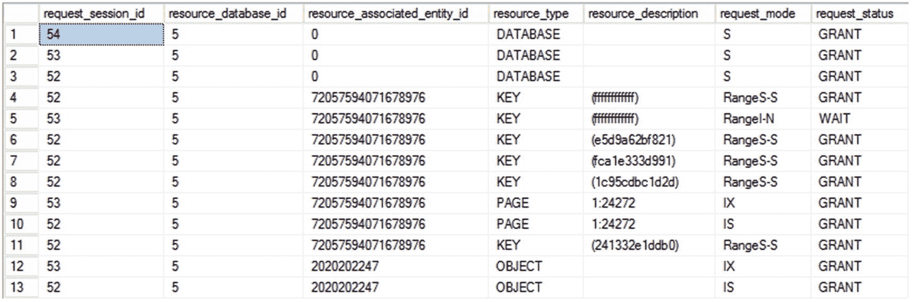

# 可序列化

可序列化（Serializable）是六个隔离级别中最高的。与仅对要访问的行获取锁不同，可序列化隔离级别会对数据集中请求顺序的当前行和下一行获取范围锁。例如，在可序列化隔离级别下执行的 `SELECT` 语句会对要访问的行及其顺序中的下一行获取一个 (RangeS-S) 锁。这可以防止其他事务在第一个事务操作的数据集中添加行，并保护第一个事务在其事务范围内不会在其数据集中发现新行。在事务内的数据集中发现新行也称为*幻读*。

要理解可序列化隔离级别的必要性，让我们考虑一个例子。假设公司中的一个组（`GroupID = 10`）有一笔 100 美元的基金，需要在该组员工中作为奖金分配。奖金支付后的基金余额应为 0 美元。考虑以下测试表：

```sql
DROP TABLE IF EXISTS dbo.MyEmployees;
GO
CREATE TABLE dbo.MyEmployees (EmployeeID INT,
GroupID INT,
Salary MONEY);
CREATE CLUSTERED INDEX i1 ON dbo.MyEmployees (GroupID);
--Employee 1 in group 10
INSERT INTO dbo.MyEmployees
VALUES (1, 10, 1000),
--Employee 2 in group 10
(2, 10, 1000),
--Employees 3 & 4 in different groups
(3, 20, 1000),
(4, 9, 1000);
```

所述的业务功能可以实现如下：

```sql
DECLARE @Fund MONEY = 100,
@Bonus MONEY,
@NumberOfEmployees INT;
BEGIN TRAN PayBonus
SELECT  @NumberOfEmployees = COUNT(*)
FROM    dbo.MyEmployees
WHERE   GroupID = 10;
/*Allow transaction 2 to execute*/
WAITFOR DELAY  '00:00:10';
IF @NumberOfEmployees > 0
BEGIN
SET @Bonus = @Fund / @NumberOfEmployees;
UPDATE  dbo.MyEmployees
SET     Salary = Salary + @Bonus
WHERE   GroupID = 10;
PRINT 'Fund balance =
' + CAST((@Fund - (@@ROWCOUNT * @Bonus)) AS VARCHAR(6)) + '   $';
END
COMMIT
```

您会看到返回的基金余额值为 0 美元，因为更新成功完成。`PayBonus` 事务在单用户环境中运行良好。然而，在多用户环境中，存在问题。

考虑另一个事务，该事务添加一个新员工到 `GroupID = 10`，如下所示，并且从第二个连接并发执行（在 `PayBonus` 事务开始后立即执行）：

```sql
BEGIN TRAN NewEmployee
INSERT  INTO MyEmployees
VALUES  (5, 10, 1000);
COMMIT
```

`PayBonus` 事务后的基金余额将是 -50 美元！尽管新员工可能喜欢这样，但小组基金将出现赤字。这导致了数据逻辑状态的不一致。

为了防止这种数据不一致，应阻止在操作下的组（或数据集）中添加新员工。在讨论的五个隔离级别中，只有快照隔离可以提供类似的功能，因为事务不仅需要受到现有数据的保护，还需要防止新数据进入数据集。可序列化隔离级别可以通过在受影响的行以及由 `GroupID` 列上的 `MyEmployees` 索引确定的顺序中的下一行上获取范围锁来提供这种隔离。因此，通过将事务隔离级别设置为可序列化，可以防止 `PayBonus` 事务的数据不一致。

请记住首先重新创建表。

```sql
SET TRANSACTION ISOLATION LEVEL SERIALIZABLE;
GO
DECLARE @Fund MONEY = 100,
@Bonus MONEY,
@NumberOfEmployees INT;
BEGIN TRAN PayBonus
SELECT  @NumberOfEmployees = COUNT(*)
FROM    dbo.MyEmployees
WHERE   GroupID = 10;
/*Allow transaction 2 to execute*/
WAITFOR DELAY  '00:00:10';
IF @NumberOfEmployees > 0
BEGIN
SET @Bonus = @Fund / @NumberOfEmployees;
UPDATE  dbo.MyEmployees
SET     Salary = Salary + @Bonus
WHERE   GroupID = 10;
PRINT 'Fund balance =
' + CAST((@Fund - (@@ROWCOUNT * @Bonus)) AS VARCHAR(6)) + '   $';
END
COMMIT
GO
--Back to default
SET TRANSACTION ISOLATION LEVEL READ COMMITTED ;
GO
```

可序列化隔离级别的效果也可以在查询级别通过在 `SELECT` 语句上使用 `HOLDLOCK` 锁定提示来实现，如下所示：

```sql
DECLARE @Fund MONEY = 100,
@Bonus MONEY,
@NumberOfEmployees INT ;
BEGIN TRAN PayBonus
SELECT  @NumberOfEmployees = COUNT(*)
FROM    dbo.MyEmployees WITH (HOLDLOCK)
WHERE   GroupID = 10 ;
/*Allow transaction 2 to execute*/
WAITFOR DELAY  '00:00:10' ;
IF @NumberOfEmployees > 0
BEGIN
SET @Bonus = @Fund / @NumberOfEmployees
UPDATE  dbo.MyEmployees
SET     Salary = Salary + @Bonus
WHERE   GroupID = 10 ;
PRINT 'Fund balance =
' + CAST((@Fund - (@@ROWCOUNT * @Bonus)) AS VARCHAR(6)) + '   $' ;
END
COMMIT
```

您可以通过在 `PayBonus` 事务执行时从另一个连接查询 `sys.dm_tran_locks` 来观察该事务获取的范围锁，如图 21-6 所示。


图 21-6

sys.dm_tran_locks 的输出显示授予序列化事务的范围锁

`sys.dm_tran_locks` 的输出显示，在三个索引行上获取了共享范围 (RangeS-S) 锁：`GroupID = 10` 中的第一个员工、`GroupID = 10` 中的第二个员工以及 `GroupID = 20` 中的第三个员工。这些范围锁阻止了任何新员工进入 `GroupID = 10`。

刚刚显示的范围锁引入了一些有趣的副作用。

*   在此期间，无法添加 `GroupID` 在 10 到 20 之间的新员工。例如，尝试添加 `GroupID` 为 15 的新员工将被 `PayBonus` 事务阻止。

```sql
    BEGIN TRAN NewEmployee
    INSERT  INTO dbo.MyEmployees
    VALUES  (6, 15, 1000);
    COMMIT
```

*   如果 `PayBonus` 事务的数据集最终是按索引排序的现有数据中的最后一组，那么在数据集最后一行之后所需的范围锁将获取在表中最后可能的数据值上。

要理解此行为，请删除 `GroupID > 10` 的员工，以使 `GroupID = 10` 数据集成为聚簇索引（或表）中的最后一组数据。

```sql
DELETE  dbo.MyEmployees
WHERE   GroupID > 10;
```

再次运行更新后的奖金和 `NewEmployee` 事务。图 21-7 显示了 `PayBonus` 事务的 `sys.dm_tran_locks` 的输出结果。



图 21-7

sys.dm_tran_locks 的输出显示授予序列化事务的扩展范围锁

如图 21-7 所示，聚簇索引中最后一行（`KEY = ffffffffffff`）上的范围锁将阻止添加所有 `GroupID` 大于或等于 10 的员工。您知道锁在最后一行上，不是因为它在 `sys.dm_tran_locks` 的输出中以可见的方式显示，而是因为您之前已经清除了直到该行的所有内容。例如，尝试添加 `GroupID = 999` 的新员工将被 `PayBonus` 事务阻止。

```sql
BEGIN TRAN NewEmployee
INSERT  INTO dbo.MyEmployees
VALUES  (7, 999, 1000);
COMMIT
```


