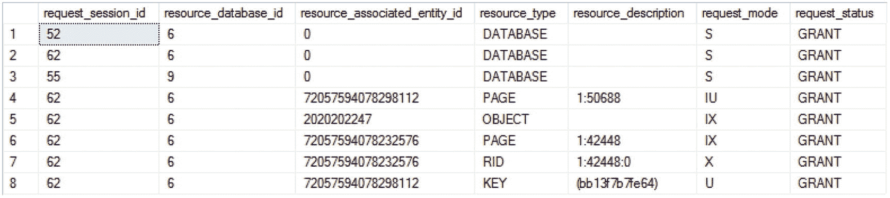
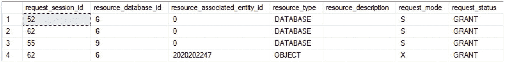
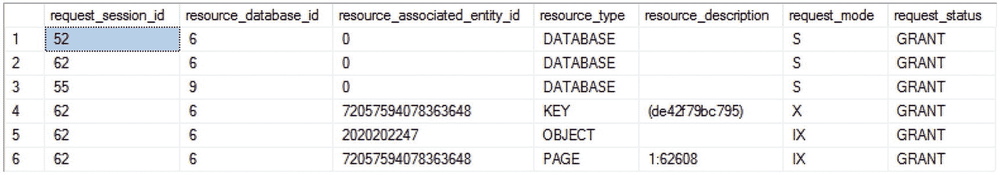
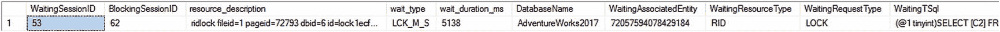
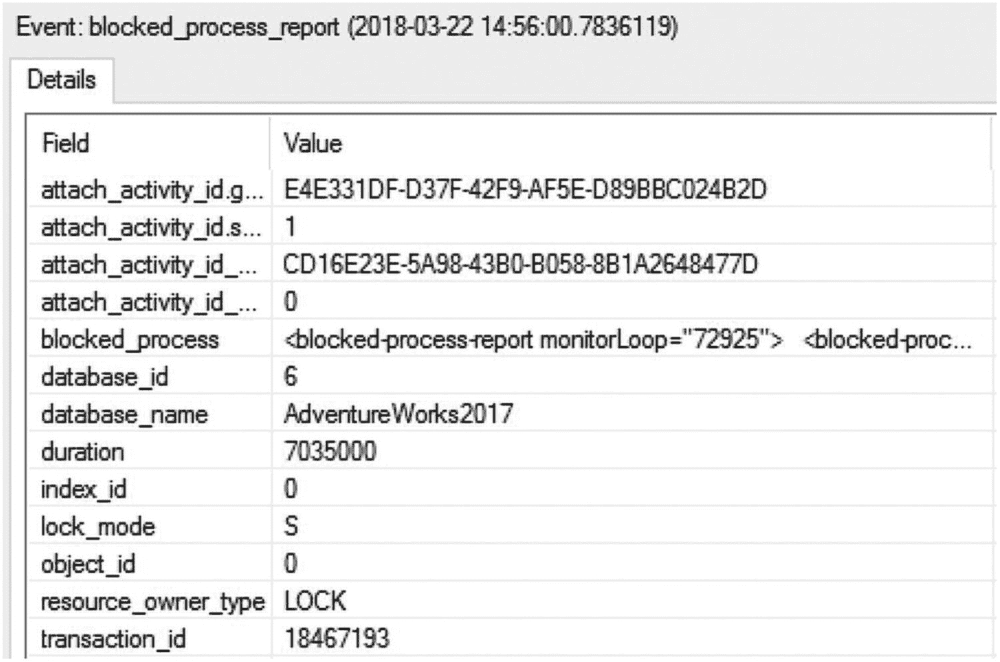
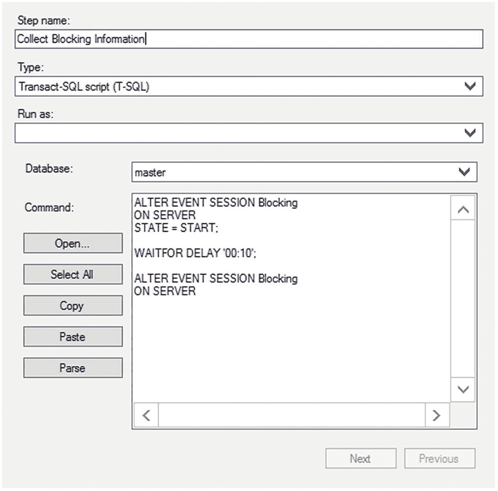

# 猜猜如果表的 `GroupID` 列上没有索引会发生什么？

（换句话说，如果 `WHERE` 子句中的列没有索引）？在你思考的同时，我会在另一个列上重新创建带聚集索引的表。

```sql
DROP TABLE IF EXISTS dbo.MyEmployees;
GO
CREATE TABLE dbo.MyEmployees (EmployeeID INT,
GroupID INT,
Salary MONEY);
CREATE CLUSTERED INDEX i1 ON dbo.MyEmployees (EmployeeID);
--Employee 1 in group 10
INSERT INTO dbo.MyEmployees
VALUES (1, 10, 1000),
--Employee 2 in group 10
(2, 10, 1000),
--Employees 3 & 4 in different groups
(3, 20, 1000),
(4, 9, 1000);
```

现在重新运行更新后的奖金查询和新员工查询。图 21-8 显示了`PayBonus`事务的`sys.dm_tran_locks`输出结果。


图 21-8

`sys.dm_tran_locks`的输出，显示了在`WHERE`子句列上无索引时授予可序列化事务的范围锁

再次说明，如图 21-8 所示，新聚集索引中最后一行可能的行（`KEY = ffffffffffff`）上的范围锁，将阻止任何新行添加到表中。我将在本章后面的“索引对可序列化隔离级别影响”一节中讨论这种广泛锁定背后的原因。

正如你所见，可序列化隔离级别不仅像可重复读隔离级别一样持有共享锁直到事务结束，还通过持有范围锁来防止任何新行出现在数据集中。因为这种增加的阻塞会损害数据库并发性，所以你应该避免使用可序列化隔离级别。如果你必须使用可序列化，那么请确保拥有良好的索引和查询来优化性能，以最小化事务的大小和持续时间。

## 快照

快照隔离是自 SQL Server 2005 以来可用的第二种基于行版本控制的隔离级别。与已提交读快照隔离不同，快照隔离需要在事务开始时显式调用 `SET TRANSACTION ISOLATION LEVEL`。它还需要在数据库上设置隔离级别。快照隔离旨在成为比已提交读快照隔离更严格的隔离级别。快照隔离将尝试对其打算修改的数据放置排他锁。如果该数据上已有锁，快照事务将失败。它提供事务级读一致性，这使得它比已提交读快照更适合财务类型的系统。

## 索引对锁定的影响

索引影响表上的锁定行为。在没有索引的表上，锁的粒度是 `RID`、`PAG`（包含 `RID` 的页面）和 `TAB`。向表添加索引会影响要锁定的资源。例如，考虑以下没有索引的测试表：

```sql
DROP TABLE IF EXISTS dbo.Test1;
GO
CREATE TABLE dbo.Test1 (C1 INT,
C2 DATETIME);
INSERT INTO dbo.Test1
VALUES (1, GETDATE());
```

接下来，观察该表上事务的锁定行为：

```sql
BEGIN TRAN LockBehavior
UPDATE  dbo.Test1 WITH (REPEATABLEREAD)  --Hold all acquired locks
SET     C2 = GETDATE()
WHERE   C1 = 1 ;
--Observe lock behavior from another connection
WAITFOR DELAY  '00:00:10' ;
COMMIT
```

图 21-9 显示了适用于测试表的`sys.dm_tran_locks`输出。


图 21-9

`sys.dm_tran_locks`的输出，显示了无索引表上授予的锁

事务获取了以下锁：

*   表上的 (IX) 锁
*   包含数据行的页面上的 (IX) 锁
*   表中数据行上的 (X) 锁

当 `resource_type` 是对象时，`sys.dm_tran_locks` 中的 `resource_associated_entity_id` 列值指示锁所放置对象的 `objectid`。你可以从 `sys.object` 系统表中获取锁所放置的具体对象名称，如下所示：

```sql
SELECT OBJECT_NAME();
```

索引对表锁定行为的影响随 `WHERE` 子句列上索引的类型而异。这种差异源于非聚集索引和聚集索引的叶级页与表的数据页具有不同的关系。让我们探讨一下这些索引对表锁定行为的影响。

### 非聚集索引的影响

因为非聚集索引的叶级页与表的数据页是分开的，所以与非聚集索引关联的资源也受到保护以防止损坏。SQL Server 会自动确保这一点。要查看实际效果，请在测试表上创建一个非聚集索引。

```sql
CREATE NONCLUSTERED INDEX iTest ON dbo.Test1(C1);
```

再次运行 `LockBehavior` 事务并从另一个连接查询 `sys.dm_tran_locks`，你会得到如图 21-10 所示的结果。



图 21-10

`sys.dm_tran_locks`的输出，显示了非聚集索引对锁定行为的影响

事务获取了以下锁：

*   包含非聚集索引行的页面上的 (IU) 锁
*   索引页中非聚集索引行上的 (U) 锁
*   表上的 (IX) 锁
*   包含数据行的页面上的 (IX) 锁
*   数据页中数据行上的 (X) 锁

请注意，只有行级和页级锁直接与非聚集索引关联。非聚集索引的下一个更高的锁粒度级别是对应表上的表级锁。

因此，非聚集索引会给表带来额外的锁定开销。你可以通过在 `ALTER INDEX` 中使用 `ALLOW_ROW_LOCKS` 和 `ALLOW_PAGE_LOCKS` 选项来避免索引上的锁定开销。不过要明白，这是一种权衡，可能会涉及性能损失，并且需要仔细测试以确保它不会对你的系统产生负面影响。

```sql
ALTER INDEX iTest ON dbo.Test1
SET (ALLOW_ROW_LOCKS = OFF ,ALLOW_PAGE_LOCKS= OFF);
BEGIN TRAN LockBehavior
UPDATE  dbo.Test1 WITH (REPEATABLEREAD)  --Hold all acquired locks
SET     C2 = GETDATE()
WHERE   C1 = 1;
--Observe lock behavior using sys.dm_tran_locks
--from another connection
WAITFOR DELAY  '00:00:10';
COMMIT
ALTER INDEX iTest ON dbo.Test1
SET (ALLOW_ROW_LOCKS = ON ,ALLOW_PAGE_LOCKS= ON);
```

你可以在使用索引时使用这些选项来启用/禁用索引上的 `KEY` 锁和 `PAG` 锁。仅禁用 `KEY` 锁会导致索引上的最低锁粒度为 `PAG` 锁。在索引上配置的锁粒度设置将一直有效，直到重新配置为止。


### 注意

修改锁设置这样的操作，应是在尝试过许多其他选项之后的最后手段。这可能会导致显著的锁开销，严重影响系统性能。

图 21-11 展示了从另一个连接执行 `sys.dm_tran_locks` 的输出结果。



**图 21-11**

`sys.dm_tran_locks` 的输出，展示了 `sp_index` 选项对锁粒度的影响

事务在测试表上获得的唯一锁是一个表级别的排他锁（X）。

从新的锁行为可以看出，禁用 `KEY` 锁会将锁粒度升级到表级别。这将阻塞对该表或其索引的所有并发访问；因此，它会严重损害数据库并发性。但是，如果非聚集索引在阻塞场景中成为争用点，那么禁用索引上的 `PAG` 锁（只允许索引上的 `KEY` 锁）可能是有益的。

### 注意

使用此选项可能会产生严重的副作用。应仅作为最后手段使用。

### 聚集索引的影响

对于聚集索引，索引的叶级页与表的数据页是相同的，因此聚集索引可以用来避免非聚集索引引入的锁定额外页（叶级页）和行的开销。为了理解与聚集索引相关的锁开销，请将前面的非聚集索引转换为聚集索引。

```sql
CREATE CLUSTERED INDEX iTest ON dbo.Test1(C1) WITH DROP_EXISTING;
```

如果再次运行锁定脚本，并在不同的连接中查询 `sys.dm_tran_locks`，你应该会看到 `LockBehavior` 事务在 `iTest` 上的结果输出，如图 21-12 所示。



**图 21-12**

`sys.dm_tran_locks` 的输出，展示了聚集索引对锁行为的影响

事务获取了以下锁：

*   表上的意向排他锁（IX）
*   包含聚集索引行的页上的意向排他锁（IX）
*   表或聚集索引中的聚集索引行上的排他锁（X）

聚集索引行和叶级页上的锁实际上也是数据行和数据页上的锁，因为数据页和叶级页是相同的。因此，与非聚集索引相比，聚集索引减少了表上的锁开销。

聚集索引减少锁开销是使用聚集索引优于堆表的另一个好处。

### 索引对可序列化隔离级别影响

索引在确定可序列化隔离级别引起的阻塞程度方面起着重要作用。在 `WHERE` 子句列（导致数据集被锁定的列）上存在索引，允许 SQL Server 确定要锁定行的顺序。例如，考虑在可序列化隔离级别一节中使用的例子。`SELECT` 语句使用对 `GroupID` 列的过滤器来形成其数据集，如下所示：

```sql
DECLARE @NumberOfEmployees INT;
SELECT  @NumberOfEmployees = COUNT(*)
FROM    dbo.MyEmployees WITH (HOLDLOCK)
WHERE   GroupID = 10;
```

`GroupID` 列上存在聚集索引，允许 SQL Server 在要访问的行和正确顺序的下一行上获取（RangeS-S）锁。

如果移除 `GroupID` 列上的索引，则 SQL Server 无法确定应在其上获取范围锁的行，因为不再保证行的顺序。因此，`SELECT` 语句在表级别获取（IS）锁，而不是在行级别获取更低粒度的锁，如图 21-13 所示。


**图 21-13**

`sys.dm_tran_locks` 的输出，展示了在 `WHERE` 子句列上没有索引时 `SELECT` 语句被授予的锁

如果在过滤列上没有索引，你会显著增加可序列化隔离级别引起的阻塞程度。这是在 `WHERE` 子句列上创建索引的另一个好理由。

## 捕获阻塞信息

尽管阻塞对于将事务与其他并发事务隔离是必要的，但有时它可能上升到过高的水平，对数据库并发性产生不利影响。在最简单的阻塞场景中，一个会话在资源上获得的锁会阻塞另一个请求该资源上不兼容锁的会话。为了提高并发性，分析阻塞原因并采取适当的解决方案非常重要。

在阻塞场景中，你需要以下信息来清楚地了解阻塞的原因：

*   阻塞和被阻塞会话的连接信息：你可以从 `sys.dm_os_waiting_tasks` 动态管理视图获取此信息。
*   阻塞和被阻塞会话的锁信息：你可以从 `sys.dm_tran_locks` DMO 获取此信息。
*   阻塞和被阻塞会话最后执行的 SQL 语句：你可以使用 `sys.dm_exec_requests` DMV 结合 `sys.dm_exec_sql_text` 和 `sys.dm_exec_queryplan` 或扩展事件来获取此信息。

你也可以通过运行活动监视器从 SQL Server Management Studio 获取以下信息。进程页面提供了所有 SPID 的连接信息。这显示了被阻塞的 SPID、阻塞它们的进程以及任何阻塞链的头部，并详细说明了进程已运行多长时间、其 SPID 及其他信息。可以使用扩展事件配合阻塞报告来收集大量相同的信息。对于锁的即时检查，请使用 DMO；对于扩展监控和历史跟踪，你会需要使用扩展事件。你可以在“扩展事件和 blocked_process_report 事件”一节中找到更多相关内容。

为了为收集阻塞信息的过程提供更强大的功能和灵活性，SQL Server 管理员可以使用 SQL 脚本来提供此处列出的相关信息。


### 使用 SQL 捕获阻塞信息

要获取关于被阻塞进程和阻塞进程的足够信息，你可以调动多个动态管理视图。此查询将根据那些正在等待的进程，显示识别被阻塞进程所必需的信息。你可以轻松地添加筛选条件，例如仅访问阻塞超过特定时长或仅在特定数据库内的进程，等等。

```
SELECT  dtl.request_session_id AS WaitingSessionID,
der.blocking_session_id AS BlockingSessionID,
dowt.resource_description,
der.wait_type,
dowt.wait_duration_ms,
DB_NAME(dtl.resource_database_id) AS DatabaseName,
dtl.resource_associated_entity_id AS WaitingAssociatedEntity,
dtl.resource_type AS WaitingResourceType,
dtl.request_type AS WaitingRequestType,
dest.[text] AS WaitingTSql,
dtlbl.request_type BlockingRequestType,
destbl.[text] AS BlockingTsql
FROM    sys.dm_tran_locks AS dtl
JOIN    sys.dm_os_waiting_tasks AS dowt
ON dtl.lock_owner_address = dowt.resource_address
JOIN    sys.dm_exec_requests AS der
ON der.session_id = dtl.request_session_id
CROSS APPLY sys.dm_exec_sql_text(der.sql_handle) AS dest
LEFT JOIN sys.dm_exec_requests derbl
ON derbl.session_id = dowt.blocking_session_id
OUTER APPLY sys.dm_exec_sql_text(derbl.sql_handle) AS destbl
LEFT JOIN sys.dm_tran_locks AS dtlbl
ON derbl.session_id = dtlbl.request_session_id;
```

要理解如何分析阻塞场景以及阻塞脚本提供的相关信息，请考虑以下示例。首先，创建一个测试表。

```
DROP TABLE IF EXISTS dbo.BlockTest;
GO
CREATE TABLE dbo.BlockTest (C1 INT,
C2 INT,
C3 DATETIME);
INSERT INTO dbo.BlockTest
VALUES (11, 12, GETDATE()),
(21, 22, GETDATE());
```

现在打开三个连接，并发运行以下两个查询。运行后，在第三个连接中使用阻塞脚本。在一个连接中执行以下代码：

```
BEGIN TRAN User1
UPDATE  dbo.BlockTest
SET     C3 = GETDATE();
```

接下来，在 `User1` 事务执行期间，执行此代码：

```
BEGIN TRAN User2
SELECT  C2
FROM    dbo.BlockTest
WHERE   C1 = 11;
COMMIT
```

这就创建了一个简单的阻塞场景，其中 `User1` 事务阻塞了 `User2` 事务。

阻塞脚本的输出提供了立即有助于开始解决阻塞问题的信息。首先，你可以识别具体的会话信息，包括阻塞会话和等待会话的会话 ID。你可以立即获取等待资源的描述、等待类型以及进程已等待的时长（以毫秒为单位）。正是这个值允许你提供筛选条件以消除属于正常处理一部分的短期阻塞。

提供了数据库名称，因为阻塞可能发生在系统中的任何地方，而不仅仅是在 AdventureWorks2017 中。你需要在它发生的地方识别它。为等待进程检索了基本锁定信息中的资源和类型。

会显示阻塞请求类型，并且如果可用，会同时显示等待的 T-SQL 和阻塞的 T-SQL。一旦你获得了发生阻塞的对象，并拥有 T-SQL（以便你能确切理解进程是如何阻塞或被阻塞的），这便是消除或减少阻塞量的关键部分。所有这些信息都可以从一个简单的查询中获得。图 21-14 显示了先前被阻塞进程的示例输出。


图 21-14 阻塞脚本的输出

务必返回到连接 1 并提交或回滚事务。

### 扩展事件与 `blocked_process_report` 事件

扩展事件提供了一个名为 `blocked_process_report` 的事件。此事件基于你提供给系统配置的“被阻塞进程阈值”来工作。此脚本将阈值设置为五秒：

```
EXEC sp_configure 'show advanced option', '1';
RECONFIGURE;
EXEC sp_configure
'blocked process threshold',
5;
RECONFIGURE;
```

在大多数系统中，这通常是一个非常低的值。如果你有既定的性能服务级别协议 (SLA)，你可以将其用作阈值。设置该值后，你可以配置警报，以便在任何进程被阻塞的时间超过你设定的值时，发送电子邮件、推文或即时消息。它也充当扩展事件的触发器。`blocked process threshold` 的默认值为零，意味着它实际上永远不会触发。如果你打算使用扩展事件来跟踪被阻塞的进程，你将需要调整此默认值。

要设置一个捕获 `blocked_process_report` 的会话，首先打开扩展事件会话属性窗口。（虽然在生产环境中你应该使用脚本来设置此事件，但我将展示如何使用 GUI。）为会话提供一个名称，然后导航到“事件”页面。在“事件库”文本框中键入 `block`，这将找到 `blocked_process_report` 事件。通过单击右箭头选择该事件。你应该会看到类似于图 21-15 的内容。


图 21-15 在扩展事件窗口中选择的“被阻塞进程报告”事件

所有事件字段都已为你预选。如果你仍然运行着上一节中创建阻塞的查询，你现在只需单击“运行”按钮即可捕获事件。否则，请返回到我们在上一节中用于生成被阻塞进程报告的查询，并在两个不同的连接中运行它们。在超过被阻塞进程阈值后，你会看到事件触发……并且会持续触发。如果你配置成那样并且让连接保持运行，它将每五秒触发一次。实时数据流中的输出如图 21-16 所示。


图 21-16 `blocked_process_report` 事件的输出

有些信息不言自明；要深入了解细节，你需要查看 `blocked_process` 字段中生成的 XML。

```
BEGIN TRAN User2
SELECT  C2
FROM    dbo.BlockTest
WHERE   C1 = 11;
COMMIT   

BEGIN TRAN User1
UPDATE  dbo.BlockTest
SET     C3 = GETDATE();   
```

如果你浏览此 XML，这些元素就很清晰。`<blocked-process>` 显示有关被阻塞进程的信息，包括熟悉的信息，例如会话 ID（此处标记为老式的 SPID）、数据库 ID 等。你可以在 `<inputbuf>` 元素中看到查询。诸如 `lockMode` 之类的详细信息可在 `<process>` 元素中获得。请注意，XML 并不包括一些你可以轻松地从 T-SQL 查询中获取的其他信息，例如被阻塞和等待进程的查询字符串。但是，有了可用的 SPID，如果缓存中可用，你可以从中获取它们，或者你可以将“被阻塞进程报告”与其他事件（如 `rpc_starting`）结合使用以显示查询信息。然而，这样做会增加在数据库中长期使用那些事件的开销。如果你知道存在阻塞问题，这可以作为短期监控项目的一部分，以捕获必要的阻塞信息。


## 阻塞解决方案

在分析完阻塞的原因后，下一步是确定任何可能的解决方案。以下是你可以用来实现这一目标的一些技术：

*   优化由阻塞和被阻塞的 SPID 执行的查询。
*   降低隔离级别。
*   对争用数据进行分区。
*   在争用数据上使用覆盖索引。

### 注意

避免阻塞的详细建议列表将在本章后面的“减少阻塞的建议”部分出现。

为了理解这些解决技术，让我们将它们依次应用到前面的阻塞场景中。

#### 优化查询

优化由阻塞和被阻塞进程执行的查询有助于减少阻塞持续时间。在阻塞场景中，参与阻塞的进程执行的查询如下：

*   阻塞进程：

```
BEGIN TRAN User1
UPDATE  dbo.BlockTest
SET     C3 = GETDATE();
```

*   被阻塞进程：

```
BEGIN TRAN User2
SELECT  C2
FROM    dbo.BlockTest
WHERE   C1 = 11;
COMMIT
```

请注意，除了第一个查询缺少 `COMMIT` 外，在没有 `WHERE` 子句的情况下运行 `UPDATE` 肯定是有潜在问题的，并且性能不会好。随着数据规模的增长，情况会变得更糟。然而，这只是一个用于演示目的的测试。

接下来，让我们分析由阻塞和被阻塞的 SPID 执行的各个 SQL 语句，以优化它们的性能。

*   阻塞 SPID 的 `UPDATE` 语句在没有 `WHERE` 子句的情况下访问数据。这使得该查询在大表上本质上是成本高昂的。如果可能，请使用适当的 `WHERE` 子句将 `UPDATE` 语句的操作拆分为多个批次。记住尝试使用基于集合的操作，例如 `TOP` 语句来限制行数。如果批次的各个 `UPDATE` 语句在单独的事务中执行，那么在一个事务内持有资源锁的数量会更少，持续时间也更短。这也有助于减少或避免锁升级。

*   被阻塞的 SPID 执行的 `SELECT` 语句在 `C1` 列上有一个 `WHERE` 子句。从测试表的索引结构可以看出，该列上没有索引。为了优化 `SELECT` 语句，你可以在 `C1` 列上创建一个聚集索引。

```
CREATE CLUSTERED INDEX i1 ON dbo.BlockTest(C1);
```

### 注意

由于 `example` 表适合放在一个页面内，添加聚集索引对查询性能不会有太大影响。然而，随着表中行数的增加，索引的有益效果将变得更加明显。

优化查询减少了进程持有锁的持续时间。查询优化减少了阻塞的影响，但它并不能完全阻止阻塞。但是，只要优化后的查询在可接受的性能限制内执行，少量的阻塞可以忽略不计。

#### 降低隔离级别

另一种解决阻塞的方法是尽可能使用更低的隔离级别。`User2` 事务的 `SELECT` 语句在请求数据行的共享 (S) 锁时被阻塞。可以利用 `SNAPSHOT` 隔离级别（已提交读快照）来减轻此事务的隔离级别，这样 `SELECT` 语句就不会请求 (S) 锁。可以使用 `SET` 语句为连接配置已提交读快照隔离级别。

```
SET TRANSACTION ISOLATION LEVEL SNAPSHOT;
GO
BEGIN TRAN User2
SELECT  C2
FROM    dbo.BlockTest
WHERE   C1 = 11;
COMMIT
GO
--恢复为默认设置
SET TRANSACTION ISOLATION LEVEL READ COMMITTED;
GO
```

此示例展示了降低隔离级别的效用。使用此 `SNAPSHOT` 隔离级别远优于使用任何可能导致脏读的方法，因为脏读可能导致数据不正确或丢失、多余的行。

### 对争用数据进行分区

在处理大数据集或可以离散存储的数据时，可以对数据应用表分区。分区数据是水平拆分的，即按某些值拆分（例如，按月拆分销售数据）。这允许事务在各个分区上并发执行，而不会相互阻塞。这些独立的分区在查询、更新和插入时被视为单个单元；只有存储和访问由 SQL Server 分隔。应注意，分区仅在 SQL Server 的开发者版和企业版中可用。

在前面的阻塞场景中，可以按日期分离数据。如果你关心性能，这需要设置多个文件组（或者如果担心管理问题，只需将所有内容放在 `PRIMARY` 上），并根据定义的规则拆分数据。一旦 `UPDATE` 语句有了 `WHERE` 子句，那么它与原始的 `SELECT` 语句就能够在两个独立的分区上并发执行。这要求 `WHERE` 子句仅在分区键列上进行筛选。一旦你混合了其他条件，你不太可能从分区消除中受益，这意味着性能可能会更差，而不是更好。

### 注意

如果操作得当，分区可以提高大数据集的性能和并发性。但是，分区几乎完全是一种数据管理解决方案，而不是性能调整选项。

### 使用覆盖索引

在阻塞场景中，你应该分析阻塞或被阻塞进程的查询是否可以通过覆盖索引完全满足。如果其中一个进程的查询可以通过覆盖索引满足，那么它将阻止该进程在争用资源上请求锁。此外，如果另一个进程不需要在覆盖索引上加锁（以维护数据完整性），那么两个进程将能够并发执行而不会相互阻塞。

例如，在前面的阻塞场景中，被阻塞进程的 `SELECT` 语句可以通过在 `C1` 和 `C2` 列上的覆盖索引完全满足。

```
CREATE NONCLUSTERED INDEX iAvoidBlocking ON dbo.BlockTest(C1,  C2) ;
```

阻塞进程的事务无需在覆盖索引上获取锁，因为它只访问表的 `C3` 列。覆盖索引将允许 `SELECT` 语句获取 `C1` 和 `C2` 列的值，而无需访问基表。因此，被阻塞进程的 `SELECT` 语句可以在覆盖索引行上获取共享 (S) 锁，而不会被阻塞进程在数据行上获取的排他 (X) 阻塞。这允许两个事务并发执行，没有任何阻塞。

将覆盖索引视为一种“复制”部分表数据的机制，其中一致性由 SQL Server 自动维护。如果此覆盖索引主要是只读的，它可以让某些事务从“复制”数据中得到服务，而基表（和其他索引）可以继续为其他事务服务。这种方法的权衡之处在于需要额外的存储空间，以及在数据修改时可能存在额外的开销。


## 减少阻塞的建议

对于数据库应用而言，单用户性能和随多用户扩展的能力都很重要。在多用户环境中，确保数据库操作不会长时间持有数据库资源至关重要。这使得数据库能够支持大量操作（或数据库用户）并发执行，而不会出现严重的性能下降。以下是一份用于减少/避免数据库阻塞的技巧列表：

*   保持事务简短。
    *   在事务中执行最少量的步骤/逻辑。
    *   不要在事务中执行代价高昂的外部活动，例如发送确认电子邮件或执行由最终用户驱动的操作。
    *   优化查询。
    *   根据需要创建索引，以确保系统中查询的最佳性能。
    *   避免在频繁更新的列上创建聚集索引。更新聚集索引键列需要对聚集索引和所有非聚集索引加锁（因为它们的行定位器包含聚集索引键）。
    *   考虑使用覆盖索引来服务于被阻塞的 `SELECT` 语句。

*   使用查询超时或资源调控器来控制失控的查询。有关资源调控器的更多信息，请参阅在线丛书：[`http://bit.ly/1jiPhfS`](http://bit.ly/1jiPhfS)。
    *   避免因错误处理例程或应用程序逻辑不佳而失去对事务范围的控制。
    *   使用 `SET XACT_ABORT ON` 来避免在事务内部出现错误条件时事务保持打开状态。
    *   在执行包含事务的 SQL 批处理或存储过程后，从客户端错误处理程序 (`TRY/CATCH`) 执行以下 SQL 语句。
        ```
        IF @@TRANCOUNT > 0 ROLLBACK
        ```

*   使用所需的最低隔离级别。
    *   考虑使用行版本控制（`SNAPSHOT` 隔离级别之一）来帮助减少争用。

## 自动检测和收集阻塞信息

除了使用扩展事件捕获信息外，您还可以使用 SQL Server 代理自动化检测阻塞条件和收集相关信息的过程。SQL Server 提供了表 21-2 中所示的性能监视器计数器来跟踪等待时间量。

**表 21-2**

**性能监视器计数器**

| **对象** | **计数器** | **实例** | **描述** |
| --- | --- | --- | --- |
| `SQLServer:Locks` (对于 SOL Server 命名实例 `MSSOL$<InstanceName>:Locks`) | `Average Wait Time(ms)` | `_Total` | 每个导致等待的锁的平均等待时间 |
|   | `Lock Wait Time (ms)` | `_Total` | 上一秒中锁的总等待时间 |

您可以创建 SQL Server 警报和作业的组合来自动化以下过程：

1.  使用 `Average Wait Time (ms)` 计数器确定平均等待时间何时超过可接受的阻塞量。根据您的偏好，您也可以使用 `Lock Wait Time (ms)` 计数器。
2.  一旦确定了最小等待时间，就设置 `Blocked Process Threshold`。当平均等待时间超过限制时，通过电子邮件通知 SQL Server DBA 阻塞情况。
3.  使用阻塞脚本或依赖于阻塞进程报告的跟踪，在一段时间内自动收集阻塞信息。

要设置阻塞进程报告自动运行，首先创建名为“阻塞分析”的 SQL Server 作业，以便稍后创建的 SQL Server 警报可以使用它。您可以通过以下步骤在 SQL Server Management Studio 中创建此 SQL Server 作业来收集阻塞信息：



**图 21-17**

输入运行阻塞脚本的命令

1.  使用 `blocked_process_report` 事件生成一个扩展事件脚本（如第 6 章详述）。
2.  运行该脚本以在服务器上创建会话，但暂时不要启动它。
3.  在 Management Studio 中，通过选择 *<ServerName>* ➤ SQL Server 代理 ➤ 作业来展开服务器。最后，右键单击并选择新建作业。
4.  在新建作业对话框的“常规”页上，输入作业名称和其他详细信息。
5.  在“步骤”页上，单击“新建”，并输入通过 T-SQL 启动和停止会话的命令，如图 21-17 所示。

您可以使用以下命令执行此操作：

```
ALTER EVENT SESSION Blocking
ON SERVER
STATE = START;
WAITFOR DELAY '00:10';
ALTER EVENT SESSION Blocking
ON SERVER
STATE = STOP;
```

会话的输出取决于您在创建目标时如何定义目标。

1.  单击“确定”返回到新建作业对话框。
2.  单击“确定”以创建 SQL Server 作业。将创建处于启用和可运行状态的 SQL Server 作业，以使用跟踪脚本收集十分钟的阻塞信息。

您可以创建 SQL Server 警报来自动化以下任务：

*   通过电子邮件、短信或寻呼机通知 DBA。
*   执行“阻塞分析”作业以收集十分钟的阻塞信息。

您可以通过以下步骤在 SQL Server 企业管理器中创建 SQL Server 警报：


**图 21-18**

输入警报名称和其他详细信息

1.  在 Management Studio 中，仍然在对象资源管理器的 SQL 代理区域中，右键单击“警报”并选择“新建警报”。
2.  在新警报属性对话框的“常规”页上，输入警报名称和其他详细信息，如图 21-18 所示。您需要为其捕获实例信息的特定对象是 `Locks`（图 21-18 中的 `MSSQL$GF2008:Locks`）。我选择了 `500ms` 作为希望查询超过该值时知晓的严格 SLA 示例。
3.  在“响应”页上，定义您认为合适的响应，例如通知操作员。
4.  单击“确定”返回到新警报的属性对话框。
5.  在“响应”页上，输入图 21-19 所示的其余信息。


**图 21-19**

输入警报触发时要执行的操作

6.  选择“阻塞分析”作业以自动收集阻塞信息。
7.  输入完所有信息后，单击“确定”以创建 SQL Server 警报。将创建处于启用状态的 SQL Server 警报以执行预定任务。
8.  确保 SQL Server 代理正在运行。

SQL Server 警报和作业共同实现了阻塞检测和信息收集过程的自动化。这种自动收集阻塞信息的方式将确保在系统进入大规模阻塞状态时，能够获得足够数量的阻塞信息。


## 摘要

尽管阻塞是不可避免的，并且实际上对维护事务间的隔离性至关重要，但它有时会对数据库并发性产生不利影响。在多用户数据库应用中，你必须将并发事务之间的阻塞降至最低。

SQL Server 提供了不同的技术来避免/减少阻塞，数据库应用应利用这些技术，以实现随着数据库用户数量增加而线性扩展的能力。当应用程序面临高度阻塞时，你可以使用各种工具收集相关的阻塞信息，以理解阻塞的根本原因。下一步就是使用适当的技术来避免或减少阻塞。

阻塞不仅会损害并发性，而且在进程之间甚至单个进程内发生相互阻塞的情况下，还可能导致数据库请求被突然终止。我们将在下一章中介绍这一被称为 `死锁` 的事件。

