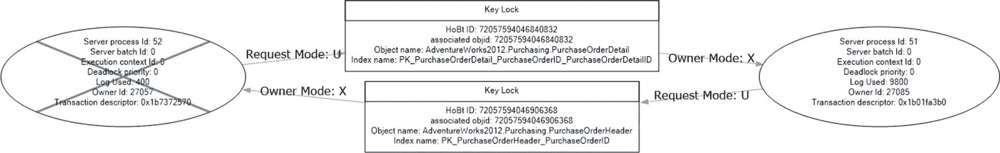
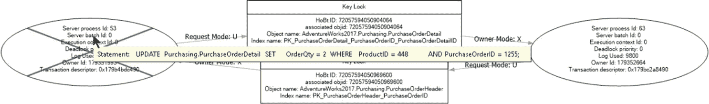
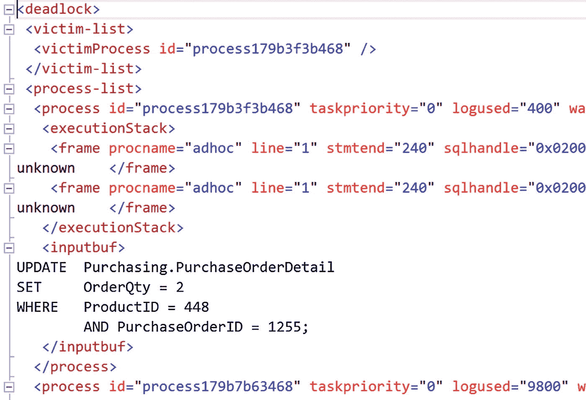

# 22. 死锁的原因与解决方案

在上一章中，我讨论了阻塞的工作原理。阻塞是性能不佳的主要原因之一。阻塞可能导致一种被称为 `死锁` 的特殊情况，这意味着死锁本质上是一个性能问题。当两个或多个事务之间发生死锁时，SQL Server 允许一个事务完成，并终止另一个事务，回滚该事务。然后，SQL Server 会向相应的应用程序返回一个错误，通知用户他已被选为死锁的牺牲品。这使得应用程序只有两个选择：重新提交事务，或向最终用户致歉。为了成功完成事务并避免道歉，理解死锁的成因以及处理死锁的方法至关重要。

在本章中，我将涵盖以下主题：

*   死锁基础
*   用于捕获死锁的错误处理
*   分析死锁原因的方法
*   解决死锁的技术

## 死锁基础

一个 `死锁` 是一种特殊的阻塞场景，其中两个进程相互阻塞。每个进程在持有自己资源的同时，试图访问被另一个进程锁定的资源。这将导致一种被称为 `致命拥抱` 的阻塞场景，如图 22-1 所示。


图 22-1：一个死锁场景

当两个进程试图在相同资源上升级其锁定机制时，死锁也经常发生。在这种情况下，两个进程都对一个资源（如一个 `RID`）持有共享锁，并且每个进程都试图将锁从共享锁升级为排他锁；然而，在对方释放其共享锁之前，双方都无法完成升级。这同样会导致其中一个进程被选为死锁牺牲品。

最后，单个进程在并行操作期间也可能发生死锁。在并行操作期间，一个线程可能持有一个资源 A 的锁，同时在等待另一个资源 B；与此同时，另一个线程可能持有资源 B 的锁，同时在等待资源 A。这与涉及多个进程的情况一样，都属于死锁场景，只不过这里涉及的是单个进程内的多个线程。这是一个罕见事件，但有可能发生，并且通常被认为是一个 bug，可能已在某个累积更新中被修复。

死锁是一种特别讨厌的阻塞类型，因为即使给予无限时间，死锁也无法自行解决。死锁需要一个外部进程来打破循环阻塞。

SQL Server 有一个死锁检测例程，称为 `锁监视器`，它会定期检查 SQL Server 中是否存在死锁。一旦检测到死锁情况，SQL Server 会选择参与死锁的会话之一作为 `牺牲品` 来打破循环阻塞。牺牲品通常是估算回滚成本最低的进程，因为这意味着该进程对 SQL Server 来说最容易回滚。此操作涉及撤销牺牲品会话持有的所有资源。SQL Server 通过回滚被选为牺牲品的会话的未提交事务来实现这一点。

死锁是一个性能问题，并且像任何性能问题一样，需要处理。与其他性能问题一样，存在一个普遍的痛苦阈值。偶尔发生的罕见死锁并不值得惊慌。然而，频繁且持续发生的死锁绝对是问题。正如你可能遇到一个查询在极少数情况下运行稍长，而不需要大量调优关注一样，你也可能遇到同样不需要你重点关注的死锁情况。请确保你处理的是系统中最为痛苦的部分。

### 选择死锁牺牲品

SQL Server 通过评估参与会话的事务回滚成本来决定哪个会话成为死锁牺牲品，并选择估算成本最低的那个。你可以通过将会话连接的死锁优先级设置为 `LOW`，来对该会话被选为牺牲品施加一些控制。

```
SET DEADLOCK_PRIORITY LOW;
```

这会引导 SQL Server 在发生死锁时选择此特定会话作为牺牲品。你可以通过执行以下 `SET` 语句将会话连接的死锁优先级重置为其正常值：

```
SET DEADLOCK_PRIORITY NORMAL;
```

`SET` 语句也允许将会话标记为 `HIGH` 死锁优先级。这不会阻止给定会话上发生死锁，但会降低给定会话被选为牺牲品的可能性。你甚至可以将优先级级别设置为一个数字值，从 -10（最低优先级）到 10（最高优先级）。

### 注意

设置死锁优先级不应随意应用。你可能会意外地在某个报表上设置优先级，导致关键任务进程被选为牺牲品。此设置需要仔细测试。

在平局的情况下，会选择其中一个进程作为牺牲品并回滚，就像它的成本最低一样。有些进程对被选为死锁牺牲品是“免疫”的。这些进程在死锁图中被标记出来，并且永远不会被选为死锁牺牲品。我所见过最常见的例子是当进程已经处于回滚状态时。


### 使用错误处理捕获死锁

当 SQL Server 将某个会话选为受害者时，它会引发一个带有错误号的错误。你可以在 T-SQL 中使用 `TRY/CATCH` 结构来处理该错误。SQL Server 通过自动回滚受害者会话的事务来确保数据库的一致性。此回滚操作确保会话返回到其事务开始前相同的状态。在错误处理器中确定是死锁情况后，可以在将错误返回给应用程序之前，尝试在 T-SQL 中重启事务若干次。

以下 T-SQL 语句展示了一种处理死锁错误的方法示例：

```sql
DECLARE @retry AS TINYINT = 1,
    @retrymax AS TINYINT = 2,
    @retrycount AS TINYINT = 0;
WHILE @retry = 1 AND @retrycount <= @retrymax
BEGIN
    SET @retry = 0;
    BEGIN TRY
        UPDATE HumanResources.Employee
        SET LoginID = '54321'
        WHERE BusinessEntityID = 100;
    END TRY
    BEGIN CATCH
        IF (ERROR_NUMBER() = 1205)
        BEGIN
            SET @retrycount = @retrycount + 1;
            SET @retry = 1;
        END
    END CATCH
END
```

`TRY/CATCH` 方法使你能够捕获错误。然后，你可以使用 `ERROR_NUMBER()` 函数检查错误号，以确定是否发生了死锁。一旦确认是死锁，就有可能尝试重启事务设定的次数——本例中是两次。使用错误捕获将帮助你的应用程序处理间歇性或偶发的死锁，但最佳方法是分析死锁原因并在可能的情况下解决它。

## 死锁分析

有时，你可以通过分析原因来防止死锁发生。你需要以下信息来完成此分析：

*   参与死锁的会话
*   死锁涉及的资源
*   会话执行的查询

### 收集死锁信息

你有四种收集死锁信息的方法：

*   使用扩展事件。
*   设置跟踪标志 1222。
*   设置跟踪标志 1204。
*   使用跟踪事件。

跟踪标志用于自定义某些 SQL Server 行为，例如在本例中生成死锁信息。但是，它们是一种较旧的捕获此信息的方式。在 SQL Server 中，自 2008 年起的每个实例上，都有一个名为 `system_health` 的扩展事件会话。此会话自动运行，并且它默认收集的事件之一就是死锁图。这是在不以任何方式修改服务器的情况下立即获取死锁信息的最简单方法。`system_health` 会话也是你从 Azure SQL Database 获取死锁信息的方式。

`system_health` 会话默认写入磁盘。文件的大小和数量是有限的，因此根据系统上的活动情况，如果你调查的死锁发生在过去某个时间，你可能会发现死锁信息已丢失。如果你需要收集更长时间的信息并确保捕获尽可能多的事件，扩展事件提供了几种收集死锁信息的方法。这可能是你可以应用于服务器收集死锁信息的最佳方法。你可以使用以下选项：

*   `lock_deadlock`：显示关于死锁事件的基本信息。
*   `lock_deadlock_chain`：捕获死锁中每个参与者的信息。
*   `xml:deadlock_report`：显示一个包含死锁原因的 XML 死锁图。

死锁图生成 XML 输出。扩展事件捕获死锁事件后，你可以在 SSMS 中查看死锁图，既可以使用事件查看器，也可以通过打开 XML 文件（如果你将事件结果输出到那里）。虽然所有三个事件显示的信息类似，但对于基本的死锁信息，最容易理解的是 `xml:deadlock_report`。在专门监控死锁的情况下，特别是当你试图处理某个特定死锁时，我还建议同时捕获 `lock_deadlock_chain`，以便在你需要时拥有有关涉及死锁的各个会话的更详细信息。对于大多数情况，死锁图应该能提供你需要的信息。

要直接从 `system_health` 会话中检索死锁图，你可以像这样查询输出：

```sql
DECLARE @path NVARCHAR(260)
--to retrieve the local path of system_health files
SELECT @path = dosdlc.path
FROM sys.dm_os_server_diagnostics_log_configurations AS dosdlc;
SELECT @path = @path + N'system_health_*';
WITH fxd
AS (SELECT CAST(fx.event_data AS XML) AS Event_Data
    FROM sys.fn_xe_file_target_read_file(@path,
                                         NULL,
                                         NULL,
                                         NULL) AS fx )
SELECT dl.deadlockgraph
FROM
(   SELECT dl.query('.') AS deadlockgraph
    FROM fxd
    CROSS APPLY event_data.nodes('(/event/data/value/deadlock)') AS d(dl) ) AS dl;
```

你可以在管理工作室中打开死锁图。你可以搜索 XML，但从 XML 生成的死锁图几乎可以像死锁的执行计划一样工作，如图 22-2 所示。



图 22-2 在分析器中显示的死锁图

我将在本章后面的“分析死锁”部分向你展示如何使用它。

生成死锁信息的两个跟踪标志可以单独使用，也可以一起使用以生成不同的信息集。通常人们更倾向于运行其中一个，因为它们会向 SQL Server 的错误日志中写入大量信息。跟踪标志将收集到的信息写入发生死锁事件的服务器上的日志文件中。跟踪标志 1222 提供有关死锁的最详细信息。


## 用于死锁信息的追踪标志

追踪标志 1204 提供死锁信息，有助于分析死锁原因。它按参与死锁的每个节点对信息进行排序。追踪标志 1222 提供详细的死锁信息，但其信息分类方式不同。追踪标志 1222 按资源和进程对信息进行分类，并提供更多信息。这两组数据将在“分析死锁”一节中讨论。

`DBCC TRACEON`语句用于开启（或启用）追踪标志。追踪标志将保持启用状态，直到使用`DBCC TRACEOFF`语句将其禁用。如果服务器重启，此追踪标志将被清除。您可以使用`DBCC TRACESTATUS`语句确定追踪标志的状态。同时设置这两个死锁追踪标志如下所示：

```
DBCC TRACEON (1222, -1);
DBCC TRACEON (1204, -1);
```

为确保追踪标志始终设置，可以按照以下步骤，在 SQL Server 配置管理器中将它们设为 SQL Server 启动的一部分：


图 22-3：显示“启动参数”选项卡的 SQL Server 实例属性对话框

1.  打开 SQL Server 实例的属性对话框。
2.  切换到属性对话框的“启动参数”选项卡，如图 22-3 所示。
3.  在“指定启动参数”文本框中键入`-T1222`，然后单击“添加”以添加追踪标志 1222。
4.  单击“确定”按钮关闭所有对话框。

在您重启 SQL Server 实例后，这些追踪标志设置将生效。

对于大多数系统，使用`system_health`会话是一种更简单、更高效的机制。它默认安装并启用。您无需执行任何操作即可使其运行。`system_health`会话不会向服务器错误日志添加冗余信息，使其更干净、更易于处理。追踪标志仍然可用，较旧的系统可能会发现它们是必需的。然而，更新的系统根本不需要它们。

### 分析死锁

为了分析死锁的原因，让我们考虑一个简单的例子。我将使用`system_health`会话来显示死锁信息。

在一个连接中，执行此脚本：

```
BEGIN TRAN
UPDATE Purchasing.PurchaseOrderHeader
SET Freight = Freight * 0.9 -- 运费 10%折扣
WHERE PurchaseOrderID = 1255;
```

在第二个连接中，执行此脚本：

```
BEGIN TRANSACTION
UPDATE Purchasing.PurchaseOrderDetail
SET OrderQty = 4
WHERE ProductID = 448
AND PurchaseOrderID = 1255;
```

这些脚本中的每一个都打开一个事务并操作数据，但既不提交也不回滚事务。切换回第一个事务并运行此附加查询：

```
UPDATE  Purchasing.PurchaseOrderDetail
SET     OrderQty = 2
WHERE   ProductID = 448
AND PurchaseOrderID = 1255;
```

不幸的是，可能几秒钟后，第一个连接会遇到死锁。

```
Msg 1205, Level 13, State 51, Line 1
事务(进程 ID 52)在锁资源上与另一个进程发生了死锁，并被选作死锁牺牲品。请重新运行该事务。
```

知道问题出在哪里吗？

让我们通过检查通过跟踪事件收集的死锁图来分析死锁。事件资源管理器窗口中有一个单独的选项卡用于`xml:deadlock_report`事件。打开该选项卡将显示死锁图（参见图 22-4）。


图 22-4：在 Profiler 工具中显示的死锁图

从图 22-4 中显示的死锁图来看，很明显有两个进程参与：左边是会话 53，右边是会话 63。被大*X*划掉的会话 53（在死锁图屏幕上为蓝色）被选为死锁牺牲品。涉及两个不同的键。顶部的键由会话 53 拥有，如指向会话对象的箭头所示，名为`所有者模式`，并标记为`X`（排他）。会话 63 正试图请求相同的键进行更新。另一个键由会话 63 拥有，会话 53 请求更新，由`U`指示。您可以看到死锁所涉对象的确切 HoBt ID、对象 ID、对象名称和索引名称。对于像这样的经典、简单的死锁，您拥有所需的大部分信息。最后一部分是每个进程中运行的查询。如果您将鼠标悬停在每个会话上，这些查询是可用的，如图 22-5 所示。



图 22-5：死锁牺牲品的 T-SQL 语句

死锁每一方的 T-SQL 语句都可以通过这种方式读取，以便您可以准确地关注信息所在的位置。

这种死锁的可视化表示可以完成工作。但是，您可能需要深入研究底层 XML 以检查死锁的某些细节，例如所涉及进程的隔离级别。如果您直接从扩展事件值打开该 XML 文件，您可以找到比图形化死锁图中为您显示的简单集合多得多的信息。看一下图 22-6。



图 22-6：定义死锁图的 XML 信息

如果您浏览这个文件，您可以看到死锁图中显示的一些信息，但您也会看到更多内容。例如，此死锁的一部分实际上涉及我未编写或未作为示例一部分执行的代码。表上有一个名为`uPurchaseOrderDetail`的触发器。您还可以看到我用来生成死锁的代码。所有这些信息都可以帮助您准确识别导致死锁的代码片段。您还会获得诸如`sqlhandle`之类的信息，然后您可以将其与 DMO 结合使用，从缓存或查询存储中提取语句和执行计划。由于计划是在查询运行之前创建的，因此即使对于被选为死锁牺牲品的查询，它也将对您可用。

值得花一些时间更详细地探索此 XML。表 22-1 显示了扩展事件中的一些元素及其代表的信息。

表 22-1：XML 死锁图数据


