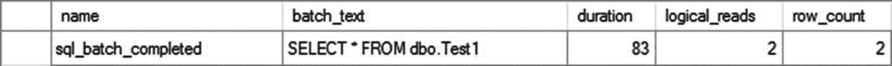
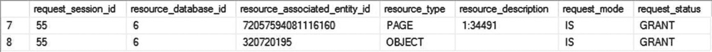
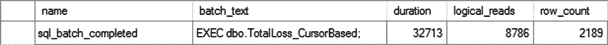

# 游标并发模型类型详解

## 乐观并发模型

乐观并发模型提供以下优点：

*   *低锁开销*：与只读模型类似，乐观并发模型在获取行后不会在游标行上持有（S）锁。为了进一步提高并发性，也可以使用`NOLOCK`锁定提示，就像在只读并发模型中一样。但是，请注意`NOLOCK`绝对可能导致数据不正确或行缺失、多余，因此使用它需要仔细规划。通过游标修改基础行需要如操作查询所要求的对该行的独占权利。

*   *高并发性*：由于仅在基础上的行使用共享锁，游标不会阻止其他用户访问基础表。但是，通过游标对基础行的修改会在修改期间阻止其他用户访问该行。

以下示例详细说明了乐观并发模型的成本开销：

*   *行版本控制*：由于乐观并发模型允许游标可更新，因此会产生额外成本以确保在通过游标应用修改之前，首先将当前的基础行（使用基于版本或基于值的并发控制）与最初获取的游标行进行比较。这可以防止通过游标的修改意外覆盖在获取游标行后由另一用户所做的修改。

*   *无 ROWVERSION 列的并发控制*：如前所述，基础表中的`ROWVERSION`列允许游标执行高效的基于版本的并发控制。如果基础表不包含`ROWVERSION`列，游标将采用基于值的并发控制，这需要将行的当前值与读入游标时的值进行匹配。这增加了并发控制的成本。两种形式的并发控制都会在`tempdb`中产生额外开销。

## 滚动锁并发模型

滚动锁并发模型的主要优点如下：

*   *简单的并发控制*：通过锁定游标中最后获取行所对应的基础行，游标确保该基础行不能被另一用户修改。这消除了乐观锁的版本控制开销。此外，由于该行不能被另一用户修改，应用程序也免于检查行不匹配错误。

滚动锁并发模型会产生以下成本开销：

*   *最高的锁开销*：滚动锁并发模型引入了悲观锁的特性。对最后获取的游标行持有（U）锁，直到获取另一个游标行或关闭游标。

*   *最低的并发性*：由于在基础上的行持有（U）锁，所有其他请求对该基础上行的（U）或（X）锁的用户都将被阻塞。这会严重损害并发性。因此，除非绝对必要，请避免使用此游标并发模型。

## 游标类型的成本比较

本章前面“游标基础”部分提到的四种基本游标类型每种都会在服务器上产生不同的成本开销。选择不正确的游标类型会损害数据库性能。除了四种基本游标类型外，还提供了一种快速前向游标（前向游标的一种变体）以增强性能。这些游标类型的成本开销将在以下部分中解释。

### 前向游标

前向游标的成本优点如下：

*   *比静态和键集驱动游标更低的游标打开成本*：由于在打开游标时，游标行不是从基础表中检索的，也没有复制到`tempdb`数据库中，因此前向 T-SQL 游标打开速度快。类似地，具有乐观/滚动锁并发的前向服务器端 API 游标也打开得快，因为它们在打开游标时不检索行。

*   *更低的滚动开销*：由于只能在此游标类型上执行`FETCH NEXT`，因此支持不同滚动操作所需的开销更少。

*   *对 tempdb 数据库的影响比静态和键集驱动游标更小*：由于前向 T-SQL 游标不会将行从基础表复制到`tempdb`数据库，因此不会对该数据库产生额外压力。

前向游标类型有以下缺点：

*   *较低的并发性*：每次获取游标行时，对应的行会根据游标并发模型（如前面并发讨论中所述）使用锁定请求进行访问。它可能阻止其他用户访问该资源。

*   *不支持向后滚动*：需要双向滚动的应用程序不能使用此游标类型。但如果应用程序设计得当，不使用向后滚动也并非难事。

### 快速前向游标

快速前向游标是最快且开销最小的游标类型。这种前向且只读的游标经过了专门的性能优化。因此，您应该始终优先选择它，而不是其他 SQL Server 游标类型。

此外，数据访问层在客户端提供了快速前向游标。该类型的游标使用所谓的*默认结果集*，使游标开销几乎消失。

> **注意**
>
> 默认结果集将在本章后面的“默认结果集”部分进行解释。

#### 静态游标

静态游标的成本优点如下：

*   *比其他游标类型更低的提取成本*：由于在打开游标时从基础行在`tempdb`数据库中创建了快照，游标行的提取是针对快照进行的，而不是针对基础行。这避免了否则提取游标行所需的锁开销。

*   *不会阻塞基础行*：由于快照是在`tempdb`数据库中创建的，因此其他尝试访问基础行的用户不会被阻塞。

另一方面，静态游标有以下成本开销：

*   *比其他游标类型更高的打开成本*：静态游标的游标打开操作比其他游标类型慢，因为在打开游标时必须从基础表中检索结果集的所有行，并且必须在`tempdb`数据库中创建快照。

*   *对 tempdb 的影响比其他游标类型更大*：在`tempdb`数据库中创建、填充和清理快照可能会对服务器资源产生显著影响。


#### 键集驱动游标

键集驱动游标具有以下成本优势：

*   *打开成本低于静态游标*：由于仅在`tempdb`数据库中创建键集，而非完整的快照，因此键集驱动游标的打开速度比静态游标更快。SQL Server 会异步填充大型键集驱动游标的键集，这缩短了从游标打开到获取第一行游标行之间的时间。

*   *对 tempdb 的影响小于静态游标*：由于键集驱动游标更小，它在`tempdb`中占用的空间更少。

键集驱动游标的成本开销如下：

*   *打开成本高于只进游标和动态游标*：在`tempdb`数据库中填充键集使得键集驱动游标的打开操作比只进游标（除了前面提到的例外情况）和动态游标的成本更高。

*   *获取成本高于其他游标类型*：对于每次游标行获取，必须先访问键集中的键，然后才能访问用户数据库中对应的基础行。每次游标行获取都需要访问`tempdb`和用户数据库，这使得获取操作的成本高于其他游标类型。

*   *对 tempdb 的影响大于只进游标和动态游标*：在`tempdb`中创建、填充和清理键集会影响服务器资源。

*   *锁开销和阻塞高于静态游标*：由于从游标获取行时是从基础表中检索行，因此在行获取操作期间会对基础行获取一个(S)锁（除非使用了`NOLOCK`锁提示）。

#### 动态游标

动态游标具有以下成本优势：

*   *打开成本低于静态游标和键集驱动游标*：由于游标直接在基础行上打开，无需将任何内容复制到`tempdb`数据库，因此动态游标的打开速度比静态游标和键集驱动游标更快。

*   *对 tempdb 的影响小于静态游标和键集驱动游标*：由于没有内容被复制到`tempdb`，动态游标对`tempdb`造成的压力远小于其他游标类型。

动态游标具有以下成本开销：

*   *锁开销和阻塞高于静态游标*：动态游标中的每次游标行获取都会重新查询游标的`SELECT`语句中涉及的基础表。动态获取通常开销较大，因为可能需要重新执行原始的查询条件。

关于不同游标及其优缺点的总结，请参见表 23-1。

表 23-1

游标比较

| `游标类型` | `优点` | `缺点` |
| --- | --- | --- |
| 只进 | 成本较低，滚动开销较低，对`tempdb`影响较小 | 并发性较低，不能向后滚动 |
| 快速只进 | 最快的游标，成本最低，影响最小 | 不能向后滚动，没有并发性 |
| 静态 | 获取成本较低，没有阻塞，支持向前和向后滚动 | 打开成本较高，对`tempdb`影响较大，没有并发性 |
| 键集驱动 | 打开成本较低，对`tempdb`影响较小，支持向前和向后滚动，具有并发性 | 打开成本较高，获取成本最高，对`tempdb`影响最大，锁成本较高 |
| 动态 | 打开成本较低，对`tempdb`影响较小，支持向前和向后滚动，具有并发性 | 锁成本最高 |

### 默认结果集

数据访问层（`ADO`、`OLEDB`和`ODBC`）的默认游标类型是只进且只读的。数据访问层创建的默认游标类型不是真正的游标，而是从服务器到客户端的数据流，通常被称为*默认结果集*或*快速只进游标*（由数据访问层创建）。在[ADO.NET](http://ado.net)中，`DataReader`控件具有只进和只读属性，它可以被视为[ADO.NET](http://ado.net)环境中的默认结果集。SQL Server 在以下情况下使用此类结果集处理：

*   应用程序使用数据访问层（`ADO`、`OLEDB`、`ODBC`）并将所有游标特性保留为默认设置，这请求的是只进且只读的游标。

*   应用程序执行的是`SELECT`语句，而不是执行`DECLARE CURSOR`语句。

### 注意

由于 SQL Server 设计用于处理数据集，而不是逐条遍历记录，因此默认结果集始终比任何其他类型的游标更快。

从客户端发送到 SQL Server 的唯一请求是与默认游标关联的 SQL 语句。SQL Server 执行查询，将结果集的行组织到网络数据包中（尽可能填满数据包），然后将数据包发送到客户端。这些网络数据包被缓存在客户端的网络缓冲区中。SQL Server 将尽可能多的结果集行发送到客户端，只要客户端网络缓冲区能够缓存。随着客户端应用程序逐行请求数据，客户端计算机上的数据访问层从客户端网络缓冲区中提取行并将其传输到客户端应用程序。

以下部分概述了默认结果集的优点和缺点。

#### 优点

默认结果集通常是从 SQL Server 返回行的最佳且最高效的方式，原因如下：

*   *客户端与 SQL Server 之间的网络往返次数最少*：由于 SQL Server 返回的结果集缓存在客户端网络缓冲区中，因此客户端不必通过网络发出请求来获取各个行。SQL Server 将尽可能多的行放入网络缓冲区，并发送到客户端网络缓冲区能够缓存的最大数据量。

*   *服务器开销最小*：由于 SQL Server 不需要在服务器上存储数据，这减少了服务器资源的使用。

#### 多个活动结果集

SQL Server 2005 引入了多个活动结果集的概念，即单个连接在任何给定时刻可以运行多个批处理。在早期版本中，在提交下一个请求之前，必须处理或关闭单个结果集。MARS 允许通过同一个连接同时提交多个请求。MARS 在 SQL Server 上始终启用。除非连接显式调用它，否则连接不会启用它。事务必须在客户端级别处理，并且必须显式声明、提交或回滚。使用 MARS 时，如果某个语句上的事务未提交且连接关闭，则属于该单个连接的所有其他事务都将回滚。MARS 通过应用程序连接属性启用。


### 缺点

尽管默认结果集有其优势，但也存在一些缺点。使用默认结果集要获得最佳性能，需要满足一些特定条件：

*   *它不支持所有属性和方法*：诸如 `AbsolutePosition`、`Bookmark` 和 `RecordCount` 等属性，以及 `Clone`、`MoveLast`、`MovePrevious` 和 `Resync` 等方法均不受支持。

*   *可能持有对基础资源的锁*：SQL Server 会将尽可能多的结果集行发送到客户端网络缓冲区能够缓存的范围内。如果结果集的大小很大，客户端网络缓冲区可能无法接收所有行。此时，SQL Server 将会持有基础表下一页的锁，该页尚未发送到客户端。

为了演示这些概念，请看下面的测试表：

```sql
USE AdventureWorks2017;
GO
DROP TABLE IF EXISTS dbo.Test1;
GO
CREATE TABLE dbo.Test1 (C1 INT,
C2 CHAR(996));
CREATE CLUSTERED INDEX Test1Index ON dbo.Test1 (C1);
INSERT INTO dbo.Test1
VALUES (1, '1'),
(2, '2');
GO
```

现在看这个 PowerShell 脚本，它使用 ADO 与 OLEDB 以及数据库 API 游标（`ADODB.Recordset` 对象）的默认游标类型来访问测试表的行，如下所示：

```powershell
$AdoConn = New-Object -comobject ADODB.Connection
$AdoRecordset = New-Object -comobject ADODB.Recordset
##将数据源更改为你的服务器
$AdoConn.Open("Provider= SQLOLEDB; Data Source=DOJO\RANDORI; Initial Catalog=AdventureWorks2017; Integrated Security=SSPI")
$AdoRecordset.Open("SELECT * FROM dbo.Test1", $AdoConn)
do {
$C1 = $AdoRecordset.Fields.Item("C1").Value
$C2 = $AdoRecordset.Fields.Item("C2").Value
Write-Output "C1 = $C1 and C2 = $C2"
$AdoRecordset.MoveNext()
} until     ($AdoRecordset.EOF -eq $True)
$AdoRecordset.Close()
$AdoConn.Close()
```

这并非通常从 PowerShell 访问数据库的方式，但它确实展示了客户端游标如何操作。请注意，该表有两行，每行大小等于 1,000 字节（= `INT` 的 4 字节 + `CHAR(996)` 的 996 字节），不考虑内部开销。因此，`SELECT` 语句返回的完整结果集大小约为 2,000 字节（= 2 × 1,000 字节）。

在执行游标打开语句（`$AdoRecordset.Open()`）时，运行代码的客户端机器上会创建一个默认结果集。默认结果集保存的行数等于客户端网络缓冲区能够缓存的行数。

由于结果集的大小足够小，可以被客户端网络缓冲区缓存，因此所有游标行在游标打开语句执行期间就已缓存在客户端机器上，而无需在 `dbo.Test1` 表上保留任何锁。你可以使用 `sys.dm_tran_locks` 动态管理视图来验证连接的锁状态。在整个游标操作期间，客户端向 SQL Server 发出的唯一请求就是与游标关联的 `SELECT` 语句，如扩展事件输出图 23-1 所示。



图 23-1

分析器跟踪输出，显示默认结果集发出的数据库请求

为了了解大型结果集对默认结果集处理的影响，让我们向测试表添加更多行。

```sql
SELECT TOP 100000
IDENTITY(INT, 1, 1) AS n
INTO #Tally
FROM master.dbo.syscolumns AS scl,
master.dbo.syscolumns AS sc2;
INSERT INTO dbo.Test1 (C1,
C2)
SELECT n,
n
FROM #Tally AS t;
GO
```

此示例生成的附加行大大增加了结果集的大小。取决于客户端网络缓冲区的大小，只能缓存部分结果集。在执行 `$AdoRecordset.Open` 语句时，客户端机器上的默认结果集将获得部分结果集，而 SQL Server 则在网络的另一端等待发送剩余的行。

在我的机器上，在此期间，从 `sys.dm_tran_locks` 的输出获得的锁如图 23-2 所示，这些锁持有在基础 `Test1` 表上。



图 23-2

`sys.dm_tran_locks` 输出，显示在处理大型结果集时默认结果集持有的锁

表上的 (IS) 锁将阻止其他用户尝试获取 (X) 锁。为最大限度地减少阻塞问题，请遵循以下建议：

*   立即处理默认结果集的所有行。

*   保持结果集较小。如示例所示，如果结果集的大小较小，则默认结果集将能够在游标打开操作本身期间读取所有行。

## 游标开销

在应用程序中实现以游标为中心的功能时，你有两种选择。你可以使用 T-SQL 游标或数据库 API 游标。由于 T-SQL 游标和数据库 API 游标的内部实现不同，这些游标在 SQL Server 上产生的负载也不同。这些游标对数据库的影响还取决于游标的不同特性，例如位置、并发性和类型。你可以使用扩展事件来分析 T-SQL 和数据库 API 游标产生的负载。当然，用于监控查询的标准事件会很有用。在 *游标* 类别下还有许多事件。其中最有用的事件包括：

*   `cursor_open`

*   `cursor_close`

*   `cursor_execute`

*   `cursor_prepare`

其他事件也很有用，但你只在尝试对特定问题进行故障排除时才需要它们。甚至这些游标的优化选项也是不同的。让我们逐一分析这些游标的开销。


### 使用 T-SQL 游标分析开销

使用 T-SQL 语句实现的 T-SQL 游标总是在 SQL Server 上执行，因为它们需要 SQL Server 引擎来处理其 T-SQL 语句。你可以结合先前解释的游标特性来减少这些游标的开销。如前所述，最轻量级的 T-SQL 游标不是使用默认设置创建的，而是通过调整设置以得到仅向前、只读游标。即便如此，用于实现游标操作的 T-SQL 语句仍需由 SQL Server 处理。游标的全部负载都由 SQL Server 支持，客户端机器不提供任何协助。假设一个应用程序需求导致必须支持以下任务列表：

*   识别所有已报废的产品（来自 `Production.WorkOrder` 表）。
*   对于每个报废的产品，确定损失的金额，其中每个产品的损失金额等于库存单位乘以产品的单价。
*   计算总损失。
*   根据总损失，确定业务状态。

第二点中的 `FOR EACH` 短语表明，这些应用程序任务可以由一个游标来满足。然而，在 SQL Server 中使用 `FOR`、`WHILE`、游标或任何其他此类处理方式可能是危险的。尽管这种方法很有吸引力，但它不是基于集合的，也不应该是你处理此类请求的方式。不过，让我们看看使用游标是如何工作的。你可以使用 T-SQL 游标如下实现这个应用程序需求：

```sql
CREATE OR ALTER PROC dbo.TotalLoss_CursorBased
AS --使用默认设置（即快速仅向前）声明一个 T-SQL 游标以检索已废弃的产品
DECLARE ScrappedProducts CURSOR FOR
SELECT p.ProductID,
wo.ScrappedQty,
p.ListPrice
FROM Production.WorkOrder AS wo
JOIN Production.ScrapReason AS sr
ON wo.ScrapReasonID = sr.ScrapReasonID
JOIN Production.Product AS p
ON wo.ProductID = p.ProductID;
--打开游标，一次处理一个产品
OPEN ScrappedProducts;
DECLARE @MoneyLostPerProduct MONEY = 0,
@TotalLoss MONEY = 0;
--通过一次处理一个产品来计算每个产品的损失金额
DECLARE @ProductId INT,
@UnitsScrapped SMALLINT,
@ListPrice MONEY;
FETCH NEXT FROM ScrappedProducts
INTO @ProductId,
@UnitsScrapped,
@ListPrice;
WHILE @@FETCH_STATUS = 0
BEGIN
SET @MoneyLostPerProduct = @UnitsScrapped * @ListPrice; --计算总损失
SET @TotalLoss = @TotalLoss + @MoneyLostPerProduct;
FETCH NEXT FROM ScrappedProducts
INTO @ProductId,
@UnitsScrapped,
@ListPrice;
END
--确定状态
IF (@TotalLoss > 5000)
SELECT 'We are bankrupt!' AS Status;
ELSE
SELECT 'We are safe!' AS Status;
--关闭游标并释放分配给游标的所有资源
CLOSE ScrappedProducts;
DEALLOCATE ScrappedProducts;
GO
```

可以按如下方式执行存储过程，但你应该执行两次以利用计划缓存（图 23-3）：

*图 23-3：扩展事件输出，显示了使用 T-SQL 游标进行数据处理的部分总成本*

```sql
EXEC dbo.TotalLoss_CursorBased;
```

该存储过程执行的逻辑读总数为 8,786（由图 23-3 中的 `sql_batch_completed` 事件指示）。那么，这个数字是高还是低？考虑到 `Production.Products` 表只有 6,196 页，而 `Production.WorkOrder` 表只有 926 页，这肯定不算低。你可以通过查询动态管理视图 `sys.dm_db_index_physical_stats` 来确定分配给这些表的页数。

```sql
SELECT  SUM(page_count)
FROM    sys.dm_db_index_physical_stats(DB_ID(N'AdventureWorks2017'),
OBJECT_ID('Production.WorkOrder'),
DEFAULT, DEFAULT, DEFAULT);
```

### 注意

`sys.dm_db_index_physical_stats` DMV 在第 13 章有详细解释。

在大多数情况下，你可以通过使用 SQL 查询重写功能来避免游标操作，专注于基于集合的数据访问方法。例如，你可以使用 SQL 查询（代替游标操作）重写前面的存储过程，如下所示：

```sql
CREATE OR ALTER PROC dbo.TotalLoss
AS
SELECT CASE --根据以下计算确定状态
WHEN SUM(MoneyLostPerProduct) > 5000 THEN
'We are bankrupt!'
ELSE
'We are safe!'
END AS Status
FROM
( --计算所有已废弃产品的总损失金额
SELECT SUM(wo.ScrappedQty * p.ListPrice) AS MoneyLostPerProduct
FROM Production.WorkOrder AS wo
JOIN Production.ScrapReason AS sr
ON wo.ScrapReasonID = sr.ScrapReasonID
JOIN Production.Product AS p
ON wo.ProductID = p.ProductID
GROUP BY p.ProductID) AS DiscardedProducts;
GO
```

在这个存储过程中，使用了 SQL Server 的聚合函数来计算每个产品的损失金额和总损失。`CASE` 语句用于根据产生的总损失确定业务状态。可以按如下方式执行该存储过程；但同样，你应该执行两次，以便看到计划缓存的结果：

```sql
EXEC dbo.TotalLoss;
```

图 23-4 显示了相应的扩展事件输出。

*图 23-4：扩展事件输出，显示了使用等效 SELECT 语句进行数据处理的总成本*

在图 23-4 中，你可以看到存储过程的第二次执行（重用了现有计划）总共使用了 547 次逻辑读。然而，你可以看到一个比读取次数更重要的结果：持续时间从 32.7 毫秒下降到了 10.3 毫秒。使用 SQL 查询代替游标操作使执行速度提高了三倍。

因此，为了获得更好的性能，几乎总是建议你在 SQL 查询中使用基于集合的操作，而不是 T-SQL 游标。


## 游标使用建议

游标的不当使用可能会引入额外的网络往返次数和服务器资源负载，从而降低应用程序性能。为了降低游标开销，请尽量遵循以下建议：

*   优先使用基于集合的 SQL 语句而非 T-SQL 游标，因为 SQL Server 是为处理数据集而设计的。

*   使用开销最低的游标。
    *   使用 SQL Server 游标时，请使用`FAST FORWARD`游标类型。
    *   使用由 ADO、OLEDB 或 ODBC 实现的 API 游标时，请使用默认游标类型，通常称为`默认结果集`。
    *   使用`ADO.NET`时，请使用`DataReader`对象。

*   最小化对服务器资源的影响。
    *   对于 API 游标，使用客户端游标。
    *   不要通过游标对底层表执行操作。
    *   尽早释放游标。这有助于释放资源，尤其是在 tempdb 中。
    *   重新设计游标的`SELECT`语句（或应用程序），以返回最小的行集和列集。
    *   通过将游标逻辑重写为基于集合的语句来完全避免使用 T-SQL 游标，这通常比游标更高效。
    *   对于动态游标，使用`ROWVERSION`列，以利用高效、基于版本的并发控制，而不是依赖基于值的技术。

*   最小化对 tempdb 的影响。
    *   避免使用静态游标和键集驱动游标，以减少 tempdb 中的资源争用。
    *   静态游标和键集游标会给 tempdb 带来额外负载，因此如果必须使用它们，请考虑这一点，或者如果您的 tempdb 压力较大，请避免使用它们。

*   最小化阻塞。
    *   使用默认结果集、仅向前游标或静态游标。
    *   尽快处理所有游标行。
    *   避免使用滚动锁或悲观锁。

*   使用 API 游标时最小化网络往返次数。
    *   使用 ADO 的`CacheSize`属性在一次往返中获取多行数据。
    *   使用客户端游标。
    *   使用断开连接的记录集。

## 总结

正如您在本章中所学，游标是 SQL Server 返回的结果集的自然扩展，使调用应用程序能够一次处理一行数据。游标会增加应用程序性能的开销，并影响服务器资源。

您应该始终寻找避免使用游标的方法。在几乎所有情况下，基于集合的解决方案都更有效。但是，如果必须使用游标操作，那么请选择游标位置、并发性、类型和缓存大小特性的最佳组合，以最小化游标的开销。

在下一章中，我们将探讨内存中表、本机编译过程以及内存优化对象的其他方面所引入的特殊功能。

