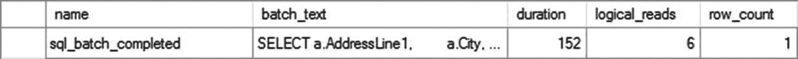

# 24. 内存优化 OLTP 表与过程

在线事务处理（OLTP）系统的一个主要需求是从系统中获取尽可能高的速度。考虑到这一点，微软引入了内存 OLTP 增强功能。这些功能在后续版本中得到了改进，并添加到 Azure SQL Database 中。内存优化技术包括内存中表和本机编译存储过程。这套功能专为高端、事务密集型、专注于 OLTP 的系统而设计。在 SQL Server 2014 中，您只能在 SQL Server 的企业版中使用内存 OLTP 功能。自 SQL Server 2016 起，所有版本都支持此增强功能。内存优化技术是查询调优工具箱中的另一个工具，但它是一个高度专业化的工具，仅适用于某些应用程序。采用此技术时需谨慎。话虽如此，在拥有足够内存的合适系统上，内存中表和本机存储过程能带来极快的速度。

本章将涵盖以下主题：

*   内存中表工作原理的基础知识
*   通过本机编译存储过程提高性能
*   本机编译过程和内存 OLTP 表的优缺点
*   何时使用内存 OLTP 表的建议

## 内存 OLTP 基础

归根结底，您可以对查询进行调优，使其运行得非常快。但是，无论您让它们运行得多快，在某种程度上，您都受到现代计算机内部的一些架构问题以及 SQL Server 行为基本原理的限制。通常，硬件的头号瓶颈是存储系统。无论您仍在使用旋转盘片还是已转向某种 SSD 或类似技术，磁盘仍然是系统中最慢的部分。这意味着对于读取或写入操作，您必须等待。但是内存速度快，并且在 64 位操作系统上，它可以非常充足。因此，如果您有可以完全移入内存的表，就可以显著提高速度。这就是内存 OLTP 表的核心理念之一：将数据访问（包括读取和写入）移至内存中，而非磁盘上。

然而，微软所做的不仅仅是简单地将表移入内存。它认识到，虽然磁盘速度慢，但系统减慢速度的另一个方面是数据如何通过事务系统进行访问和管理。因此，微软在这方面也进行了一系列更改。主要的一个是取消了事务的悲观处理方法。现有产品强制所有事务在允许数据更改刷新到磁盘之前写入事务日志。这在事务处理中造成了瓶颈。因此，微软采取了一种乐观的方法，认为大多数情况下事务会成功完成，而不是对事务能否成功完成持悲观态度。此外，微软对数据进行了版本化处理，而不是让一个事务在下一个事务可以访问或更新数据之前必须完成更新的阻塞情况。这消除了系统中的一个主要争用点，消除了锁，并且由于所有这些都在内存中，因此速度更快。

微软随后又将这一切推进了一步。它将乐观方法扩展到内存锁存器管理，而不是采用防止多个进程访问页面进行写入的悲观内存锁存器方法。现在，通过版本控制，内存中表基于一个“最终”一致性的模型运行，该模型具有冲突解决过程，该过程将回滚事务，但绝不会让一个事务阻塞另一个事务。这有可能导致一些数据丢失，但它使数据访问层内的一切都变得快速。

数据确实会被写入磁盘以在重新启动或类似情况下持久化。但是，除了在服务器启动（或数据库联机）时之外，没有任何数据从磁盘读取。然后，内存中表的所有数据都被加载到内存中，并且不会再针对磁盘读取任何这些数据。但是，如果您处理的是临时数据，甚至可以通过将数据定义为根本不持久化到磁盘来绕过此功能，从而减少启动时间。

最后，正如您在本书其他部分所看到的，查询调优的一个主要部分是弄清楚如何与查询优化器协作以获得良好的执行计划，然后多次重用该计划。这也可能是一个密集且缓慢的过程。SQL Server 2014 引入了本机编译存储过程的概念。这些实际上是 T-SQL 代码编译成 DLL，并成为 SQL Server 操作系统的一部分。这个编译过程成本高昂，不应仅用于任何旧查询。主要思想是花费时间和精力将过程编译为本机代码，然后以显著提升的速度使用该过程数百万次。


所有这些技术结合在一起，创造出新的功能性，你可以单独使用它们，也可以结合现有的表结构和标准`T-SQL`一起使用。事实上，你可以像操作普通`SQL Server`表一样来操作内存中表，并仍然能获得一些性能提升。但是，你不能在任何地方都随意这样做。要利用内存中 OLTP 表和存储过程，有一些相当具体的要求。

## 系统要求

在你考虑内存优化表是否可行之前，你必须满足几个标准要求。

-   现代 64 位处理器
-   为打算放入内存的数据准备两倍的可用磁盘存储空间
-   大量内存

显然，对于大多数系统来说，关键在于大量的内存。你需要有足够的内存来保证操作系统和`SQL Server`正常运行。然后，你还需要内存来满足系统所有非内存优化需求，包括数据缓存。最后，你还需要在此基础之上，为你的内存优化表分配内存。如果你的系统规模不算相当大（至少需要 64GB 内存），我甚至不建议你考虑这个选项。较小的系统根本无法在内存中提供足够的存储空间，使得付出的时间和精力值得。

仅在`SQL Server 2014`中，你必须运行`SQL Server`的企业版。当然，你也可以在`SQL Server 2014`中使用开发者版，但不能在其上运行生产负载。对于比`SQL Server 2014`更新的版本，根据微软发布的版本不同，存在内存限制。

## 基本设置

除了硬件要求之外，你还必须对数据库进行额外操作才能启用内存中表。我将从一个新数据库开始演示。

```sql
CREATE DATABASE InMemoryTest
ON PRIMARY (NAME = N'InMemoryTest_Data',
FILENAME = N'D:\Data\InMemoryTest_Data.mdf',
SIZE = 5GB)
LOG ON (NAME = N'InMemoryTest_Log',
FILENAME = N'L:\Log\InMemoryTest_Log.ldf');
```

为了使内存中表保持持久性，它们必须同时写入磁盘和内存，因为内存会随断电而消失。持久性（关系数据集的`ACID`属性之一）意味着一旦事务提交，它就会保持已提交状态。你可以拥有持久化的内存中表，也可以拥有非持久化表。对于非持久化表，你可能拥有已提交的事务，但仍然可能丢失该数据，这与`SQL Server`中标准表的工作方式不同。非持久化数据最广为人知的用途包括会话状态或时间敏感的信息，例如电子购物车。总之，内存中存储与你标准关系表中的通常存储方式不同。因此，必须创建独立的文件组和文件。为此，你可以像下面这样修改数据库：

```sql
ALTER DATABASE InMemoryTest
ADD FILEGROUP InMemoryTest_InMemoryData
CONTAINS MEMORY_OPTIMIZED_DATA;
ALTER DATABASE InMemoryTest
ADD FILE (NAME = 'InMemoryTest_InMemoryData',
FILENAME = 'D:\Data\InMemoryTest_InMemoryData.ndf')
TO FILEGROUP InMemoryTest_InMemoryData;
```

我本可以简单地修改你一直在试验的`AdventureWorks2017`数据库，但内存优化表的另一个考虑是，一旦创建了特殊的文件组就无法移除。你只能删除整个数据库。这就是为什么我只用一个单独的数据库做实验，这样更安全。这也是你在考虑如何以及在何处实施内存技术时需要谨慎的原因之一。你根本无法在你的生产服务器上尝试它，因为那会永久性地改变它们。

对于使用内存中 OLTP 的数据库，其可用功能存在一些限制。

-   `DBCC CHECKDB`：你可以运行一致性检查，但将跳过内存优化表。如果你尝试运行`DBCC CHECKTABLE`，则会得到错误。
-   `AUTO_CLOSE`：不支持此功能。
-   `DATABASE SNAPSHOT`：不支持此功能。
-   `ATTACH_REBUILD_LOG`：也不支持此功能。
-   数据库镜像：你无法镜像包含`MEMORY_OPTIMIZED_DATA`文件组的数据库。但是，可用性组提供了无缝体验，而故障转移群集支持内存中表（但这会影响恢复时间）。

一旦这些修改完成，你就可以开始在系统中创建内存中表了。


### 创建表

数据库设置完成后，你就可以按照前面的描述，创建内存优化的表了。实际的语法非常简单。我将尽可能复制 `AdventureWorks2017` 数据库中的 `Person.Address` 表。

```sql
USE InMemoryTest;
GO
CREATE TABLE dbo.Address
(AddressID INT IDENTITY(1, 1) NOT NULL PRIMARY KEY NONCLUSTERED HASH
WITH (BUCKET_COUNT = 50000),
AddressLine1 NVARCHAR(60) NOT NULL,
AddressLine2 NVARCHAR(60) NULL,
City NVARCHAR(30) NOT NULL,
StateProvinceID INT NOT NULL,
PostalCode NVARCHAR(15) NOT NULL,
--SpatialLocation geography NULL,
--rowguid uniqueidentifier ROWGUIDCOL  NOT NULL CONSTRAINT DF_Address_rowguid  DEFAULT (newid()),
ModifiedDate DATETIME NOT NULL
CONSTRAINT DF_Address_ModifiedDate
DEFAULT (GETDATE()))
WITH (MEMORY_OPTIMIZED = ON, DURABILITY = SCHEMA_AND_DATA);
```

这条语句在系统内存中创建了一个持久化的表，使用你定义的磁盘空间来保留数据的持久副本，确保在断电情况下不会丢失数据。它有一个像常规 SQL Server 表一样的 `IDENTITY` 值作为主键（但是，在此版本的 SQL Server 中，要使用 `IDENTITY` 而不是 `SEQUENCE`，你就无法将定义设置为除 `(1,1)` 以外的任何值）。你会注意到索引定义不是聚集的，而是 `NONCLUSTERED HASH`。我将在下一节讨论索引和 `BUCKET_COUNT` 等问题。你还会注意到我不得不注释掉两列：`SpatialLocation` 和 `rowguid`。这些列使用的数据类型在内存优化表中不可用。最后，`WITH` 子句通过定义 `MEMORY_OPTIMIZED=ON`，让 SQL Server 知道将此表放置在何处。通过修改 `WITH` 子句使用 `DURABILITY=SCHEMA_ONLY`，你可以创建一个更快的表。这允许数据丢失，但由于没有任何内容写入磁盘，使得表速度更快。

#### 限制条件

有许多不支持的数据类型可能会阻止你利用内存优化表的优势。

* `XML`
* `ROWVERSION`
* `SQL_VARIANT`
* `HIERARCHYID`
* `DATETIMEOFFSET`
* `GEOGRAPHY/GEOMETRY`
* 用户定义的数据类型

除了数据类型，你还会遇到其他限制。我将在“内存索引”一节中讨论索引要求。从 SQL Server 2016 开始，增加了对外键、检查约束和唯一约束的支持。

#### 查询与数据加载

在内存中创建表后，你可以像访问常规表一样访问它。如果我现在对它运行一个查询，它不会返回任何行，但功能是正常的。

```sql
SELECT a.AddressID
FROM dbo.Address AS a
WHERE a.AddressID = 42;
```

所以，为了在数据库中试验一些实际数据，请继续将 `AdventureWorks2017` 数据库中 `Person.Address` 表存储的信息加载到这个新数据库中存储在内存中的新表中。

```sql
CREATE TABLE dbo.AddressStaging (AddressLine1 NVARCHAR(60) NOT NULL,
AddressLine2 NVARCHAR(60) NULL,
City NVARCHAR(30) NOT NULL,
StateProvinceID INT NOT NULL,
PostalCode NVARCHAR(15) NOT NULL);
INSERT dbo.AddressStaging (AddressLine1,
AddressLine2,
City,
StateProvinceID,
PostalCode)
SELECT a.AddressLine1,
a.AddressLine2,
a.City,
a.StateProvinceID,
a.PostalCode
FROM AdventureWorks2017.Person.Address AS a;
INSERT dbo.Address (AddressLine1,
AddressLine2,
City,
StateProvinceID,
PostalCode)
SELECT a.AddressLine1,
a.AddressLine2,
a.City,
a.StateProvinceID,
a.PostalCode
FROM dbo.AddressStaging AS a;
DROP TABLE dbo.AddressStaging;
```

你不能在跨数据库查询中结合使用内存优化表，所以我不得不将大约 19,000 行数据加载到一个临时表，然后再加载到内存优化表中。这并非性能示例的一部分，但值得注意的是，在我的系统上，将数据插入标准表花了将近 850 毫秒，而将相同数据加载到内存优化表中只用了 2 毫秒。

但是，数据就位后，我可以重新运行查询并实际看到结果，如图 [24-1 所示。


**图 24-1** 内存优化表的首次查询结果

诚然，这并不那么令人兴奋。所以，为了有一些有意义的数据可操作，我将创建另外几个表，以便你可以看到更多的查询行为展示。

```sql
CREATE TABLE dbo.StateProvince (StateProvinceID INT IDENTITY(1, 1) NOT NULL PRIMARY KEY NONCLUSTERED HASH
WITH (BUCKET_COUNT = 10000),
StateProvinceCode NCHAR(3) COLLATE Latin1_General_100_BIN2 NOT NULL,
CountryRegionCode NVARCHAR(3) NOT NULL,
Name VARCHAR(50) NOT NULL,
TerritoryID INT NOT NULL,
ModifiedDate DATETIME NOT NULL
CONSTRAINT DF_StateProvince_ModifiedDate
DEFAULT (GETDATE()))
WITH (MEMORY_OPTIMIZED = ON);
CREATE TABLE dbo.CountryRegion (CountryRegionCode NVARCHAR(3) NOT NULL,
Name VARCHAR(50) NOT NULL,
ModifiedDate DATETIME NOT NULL
CONSTRAINT DF_CountryRegion_ModifiedDate
DEFAULT (GETDATE()),
CONSTRAINT PK_CountryRegion_CountryRegionCode
PRIMARY KEY CLUSTERED
(
CountryRegionCode ASC
));
```

这是一个额外的内存优化表和一个标准表。我也会将数据加载到这些表中，以便你可以进行更有趣的查询。

```sql
SELECT sp.StateProvinceCode,
sp.CountryRegionCode,
sp.Name,
sp.TerritoryID
INTO dbo.StateProvinceStaging
FROM AdventureWorks2017.Person.StateProvince AS sp;
INSERT dbo.StateProvince (StateProvinceCode,
CountryRegionCode,
Name,
TerritoryID)
SELECT StateProvinceCode,
CountryRegionCode,
Name,
TerritoryID
FROM dbo.StateProvinceStaging;
DROP TABLE dbo.StateProvinceStaging;
INSERT dbo.CountryRegion (CountryRegionCode,
Name)
SELECT cr.CountryRegionCode,
cr.Name
FROM AdventureWorks2017.Person.CountryRegion AS cr;
```

数据加载完成后，以下查询返回单行结果，其执行计划如图 24-2 所示：


**图 24-2** 同时显示内存优化表和标准表的执行计划

```sql
SELECT a.AddressLine1,
a.City,
a.PostalCode,
sp.Name AS StateProvinceName,
cr.Name AS CountryName
FROM dbo.Address AS a
JOIN dbo.StateProvince AS sp
ON sp.StateProvinceID = a.StateProvinceID
JOIN dbo.CountryRegion AS cr
ON cr.CountryRegionCode = sp.CountryRegionCode
WHERE a.AddressID = 42;
```

如你所见，即使使用内存优化表，也完全有可能获得正常的执行计划。运算符甚至都是相同的。在这个例子中，你有三种不同的索引查找操作。其中两个是针对你创建内存优化表时定义的非聚集哈希索引，另一个是针对标准表的标准聚集索引查找。你可能还会注意到，此计划上的估计成本总和达到了 101%。在处理内存优化表时，你偶尔会看到这种异常，因为优化器为它们计算的成本与常规表截然不同。

主要的性能提升来自于没有锁和闩锁，允许在进行大规模插入和更新的同时进行查询。但是，查询本身运行得也更快。之前的查询产生了如图 24-3 所示的执行时间和读取次数。


**图 24-3** 内存优化表的查询指标

在 `AdventureWorks2017` 数据库上运行类似的查询，结果如图 24-4 所示。



**图 24-4** 常规表的查询指标


