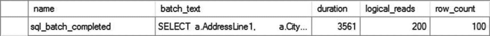
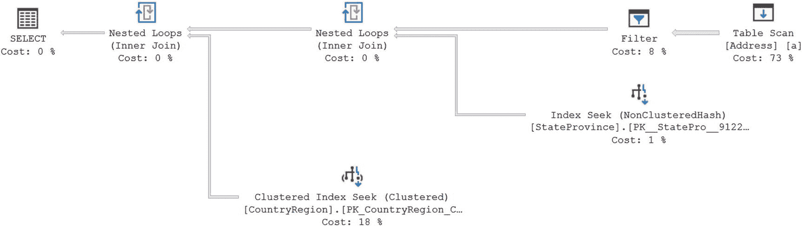
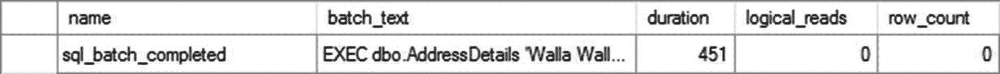
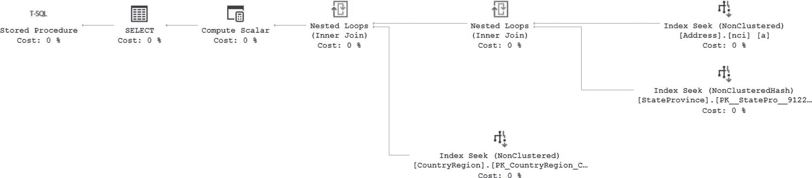
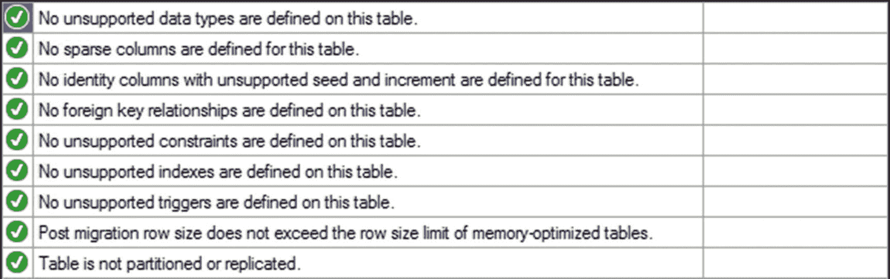
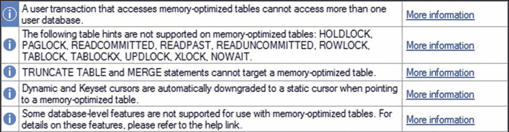
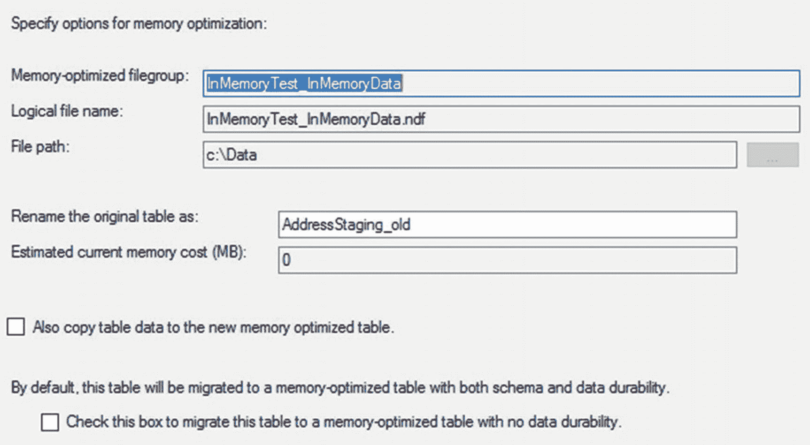
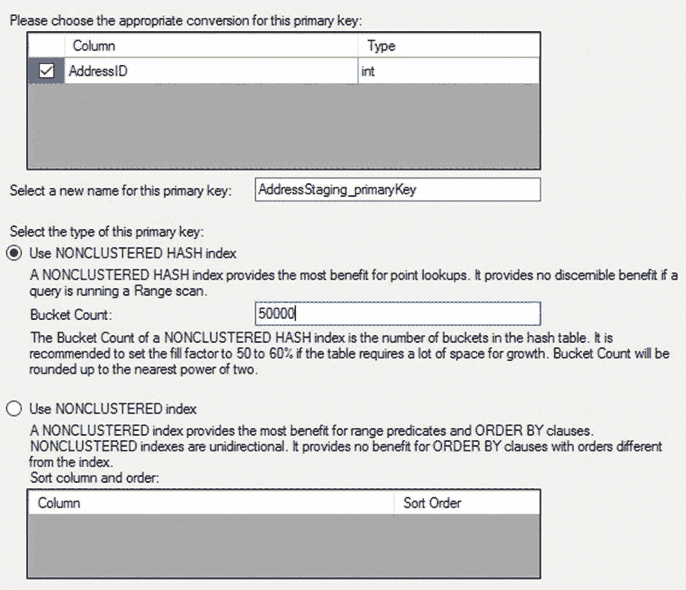
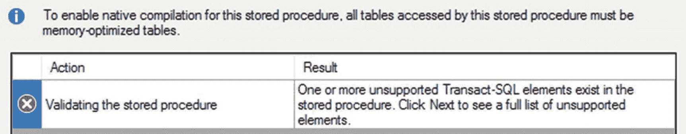
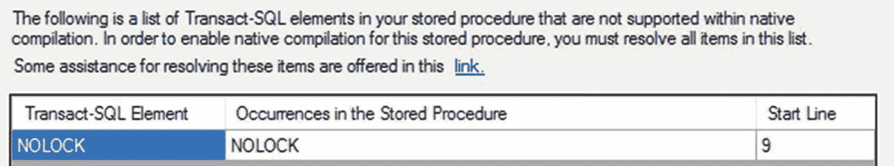

# 内存表与索引

虽然很明显，使用内存表的执行时间要好得多，但尚不清楚的是读取操作是如何处理的。但是，由于我谈论的是从内存存储中读取，而不是内存中的页面或磁盘上的页面，而是哈希索引，因此在衡量性能方面情况完全不同。您不会使用与之前完全相同的度量标准，而是将依赖于执行时间。在这种情况下，读取是对系统活动的一种度量，因此您可以预期，较高的值意味着更多的数据访问，而较低的值意味着更少的数据访问。

在表就位并证明了插入和选择的性能都有所提高之后，让我们来谈谈您可以与内存表一起使用的索引，以及它们与标准索引有何不同。

### 内存索引

一个内存表一次最多可以创建八个索引。但是，每个内存优化表必须至少有一个索引。由主键定义的索引也算数。持久表必须有一个主键。您可以创建三种索引类型：之前使用的非聚集哈希索引、非聚集索引和列存储索引。这些索引与标准表创建的索引类型不同。首先，它们以内存表相同的方式在内存中维护。其次，关于索引持久性的规则与内存表相同。内存索引也没有固定的页面大小，因此它们不会受到碎片化的影响。让我们更详细地讨论每种索引类型。

#### 哈希索引

哈希索引并不是仅仅存储在内存中的平衡树索引。相反，哈希索引使用预定义的哈希桶（或表）和键的哈希值来提供检索表数据的机制。SQL Server 有一个哈希函数，对于提供的输入，该函数始终会产生一个恒定的哈希值。这意味着对于给定的键值，您将始终具有相同的哈希值。您可以在哈希桶中存储哈希值的多个副本。拥有哈希值来检索点查找（单行）使得操作效率极高，也就是说，只要您没有遇到大量的哈希冲突。哈希冲突是指多个值存储在同一个位置。

这意味着正确使用哈希索引的关键是在各个桶中实现正确的值分布。您可以通过定义索引的桶数来实现这一点。对于我创建的第一个表 `dbo.Address`，我将桶数设置为 50,000。当前表中有 19,000 行。因此，通过 50,000 的桶数，我确保有足够的存储空间来容纳现有的值集，并提供了充足的未来增长余量。您需要设置桶数，使其足够大但不过大。如果桶数太小，您将在一个桶中存储大量数据，严重影响系统高效检索数据的能力。简而言之，最好让您的桶足够大。如果您查看图 24-5，您可以看到以不同方式展示这一点。


图 24-5

大量桶与少量桶中的哈希值

第一组桶具有所谓的*浅分布*，即少量哈希值分布在大量桶中。这是一个更优的存储计划。如您所见，一些桶可能是空的，但查找速度很快，因为每个桶只包含一个值。第二组桶显示了较小的桶数，或称为*深分布*。这意味着在给定桶中有更多的哈希值，需要在桶内进行扫描以识别单个哈希值。

Microsoft 关于桶数的建议是介于表行数的一到两倍之间。但是，由于您不能更改内存表，因此您还需要考虑预计的增长。如果您认为您的内存表在未来三到六个月内可能会增长到原来的三倍，您可能希望扩大桶数。桶数过大时您会遇到的唯一问题是扫描需要更长时间，因此您将分配更多内存。但是，如果您的查询很可能导致扫描，那么您真的不应该使用非聚集哈希索引。相反，应该转而使用非聚集索引。目前的建议是，在设置桶数时，不超过您可能处理的唯一值数量的十倍。

您还需要担心每个哈希值可以返回多少个值。唯一索引和主键是使用哈希索引的首要候选，因为它们始终是唯一的。Microsoft 的建议是，如果平均而言，对于任何一个哈希值，您会看到超过五个值，那么您应该放弃非聚集哈希索引，转而使用非聚集索引。这是因为哈希桶只是充当指向存储在该桶中的第一行的指针。然后，如果桶中存储了重复或额外的值，第一行指向第二行，每一行依次指向下一行。这可能会将点查找转变为扫描操作，从而严重影响性能。这就是为什么具有少量重复（少于五个）或唯一值时，哈希索引效果最佳。

要查看哈希表中索引的分布情况，您可以使用 `sys.dm_db_xtp_hash_index_stats`。

```sql
SELECT i.name AS [index name],
hs.total_bucket_count,
hs.empty_bucket_count,
hs.avg_chain_length,
hs.max_chain_length
FROM sys.dm_db_xtp_hash_index_stats AS hs
JOIN sys.indexes AS i
ON hs.object_id = i.object_id
AND hs.index_id = i.index_id
WHERE OBJECT_NAME(hs.object_id) = 'Address';
```

图 24-6 显示了此查询的结果。


图 24-6

查询 `sys.dm_db_xtp_hash_index_stats` 的结果

由此，您可以看到关于哈希索引创建和维护方式的一些有趣事实。您会注意到总桶数不是我设置的值 50,000。桶数被向上舍入到最接近的 2 的幂，在本例中是 65,536。有 48,652 个空桶。平均链长度，因为这是一个唯一索引，值为 1，因为值是唯一的。存在一些链值，因为当行被修改或更新时，在一切解决之前会有数据版本存储。


### 非聚集索引

非聚集索引基本上就像常规索引一样，但它们与数据一起存储在内存中，以辅助数据检索。它们也有指向数据存储位置的指针，类似于非聚集索引在堆表上的行为。内存中非聚集索引与标准非聚集索引的一个有趣区别是，SQL Server 无法从内存中索引以相反顺序检索数据。其他行为似乎与标准索引大致相同。

要查看非聚集索引的实际效果，让我们看这个查询：

```sql
SELECT  a.AddressLine1,
        a.City,
        a.PostalCode,
        sp.Name AS StateProvinceName,
        cr.Name AS CountryName
FROM    dbo.Address AS a
JOIN    dbo.StateProvince AS sp
        ON sp.StateProvinceID = a.StateProvinceID
JOIN    dbo.CountryRegion AS cr
        ON cr.CountryRegionCode = sp.CountryRegionCode
WHERE   a.City = 'Walla Walla';
```

目前的性能如图 24-7 所示。



图 24-7
没有索引时的查询指标

图 24-8 显示了执行计划。



图 24-8
导致表扫描的执行计划

虽然内存中的表扫描肯定比磁盘上表的相同扫描要快，但这仍然不是一个好的情况。另外，考虑到优化器认为需要满足 `Merge Join` 而产生的 `Filter` 操作和 `Sort` 操作的额外工作，这是一个有问题的查询。因此，你应该给表添加索引以加速它。

但是，你不能直接在 `dbo.Address` 表上运行 `CREATE INDEX`。相反，你有两个选择：重新创建表或修改表。你需要测试你的系统以确定哪种方法效果更好。用于向内存中表添加索引的 `ALTER TABLE` 命令可能成本很高。如果你想删除表并重新创建它，表创建脚本现在看起来像这样：

```sql
CREATE TABLE dbo.Address (
    AddressID INT IDENTITY(1, 1) NOT NULL PRIMARY KEY NONCLUSTERED HASH
        WITH (BUCKET_COUNT = 50000),
    AddressLine1 NVARCHAR(60) NOT NULL,
    AddressLine2 NVARCHAR(60) NULL,
    City NVARCHAR(30) NOT NULL,
    StateProvinceID INT NOT NULL,
    PostalCode NVARCHAR(15) NOT NULL,
    ModifiedDate DATETIME NOT NULL
        CONSTRAINT DF_Address_ModifiedDate
        DEFAULT (GETDATE()),
    INDEX nci NONCLUSTERED (City))
    WITH (MEMORY_OPTIMIZED = ON);
```

使用 `ALTER TABLE` 命令创建相同的索引如下所示：

```sql
ALTER TABLE dbo.Address ADD INDEX nci (City);
```

将数据重新加载到新创建的表中后，你可以再次尝试查询。这次在我的系统上运行时间为 800 微秒，比之前的 3.7 毫秒快得多。读取次数保持不变。图 24-9 显示了执行计划。


图 24-9
利用非聚集索引改进的执行计划

如你所见，非聚集索引被使用而不是表扫描来提高性能，就像你在标准表上的索引所期望的那样。然而，与标准表不同，虽然这个查询拉取了不属于非聚集索引的列，但不需要键查找来从内存中的表检索数据，因为每个索引直接指向内存中所需数据的存储位置。这又是相对于标准表行为的一个微小但重要的改进。

##### 列存储索引

关于向内存中的表添加列存储索引，其实没有太多可说的。由于列存储索引在包含 100,000 行或更多行的表上效果最佳，因此你需要相当多的内存来支持它们在内存中表上的实现。你被限制为聚集列存储索引。你也不能将筛选的列存储索引应用于内存中的表。除了这些限制之外，创建内存中的列存储索引与我们已经见过的索引相同：

```sql
ALTER TABLE dbo.Address ADD INDEX ccs CLUSTERED COLUMNSTORE;
```

### 统计信息维护

在索引创建方式上，内存中的表与标准表相比存在许多根本差异。索引维护（即索引碎片整理）不是你必须考虑的事情。然而，你确实需要担心内存中表的统计信息。内存中的索引会维护需要更新的统计信息。你还需要有关内存中索引的信息，例如它们是使用扫描还是查找进行访问的。虽然跟踪所有这些的需求是相同的，但实现的机制却不同。

实际上，你无法查看哈希索引上的统计信息。你可以对索引运行 `DBCC SHOW_STATISTICS`，但输出看起来像图 24-10。


图 24-10
内存中索引统计信息的空输出

这意味着无法查看内存中索引的统计信息。你可以检查任何非聚集索引的统计信息。无论你是否能看到这些统计信息，随着数据的变化，它们仍然会过时。在 SQL Server 2016 及更高版本中，内存中的表和索引的统计信息是自动维护的。规则与基于磁盘的统计信息相同。SQL Server 2014 没有自动统计信息维护，因此你必须使用手动方法。

你可以使用 `sp_updatestats`。该过程的当前版本完全了解内存中索引及其差异。你也可以使用 `UPDATE STATISTICS`，但在 SQL Server 2014 中，你必须将 `FULLSCAN` 或 `RESAMPLE` 与 `NORECOMPUTE` 一起使用，如下所示：

```sql
UPDATE STATISTICS dbo.Address WITH FULLSCAN, NORECOMPUTE;
```

如果你不使用此语法，似乎表明你试图更改内存中表上的统计信息，而你无法做到这一点。你会看到一个相当明确的错误。

```sql
Msg 41346, Level 16, State 2, Line 1
CREATE and UPDATE STATISTICS for memory optimized tables requires the WITH FULLSCAN or RESAMPLE and the NORECOMPUTE options. The WHERE clause is not supported.
```

定义采样为 `FULLSCAN` 或 `RESAMPLE`，然后使用 `NORECOMPUTE` 让其知道你没有试图打开自动更新，统计信息就会得到更新。

在 SQL Server 2016 及更高版本中，你可以像控制其他统计信息一样控制采样方法。

## 原生编译存储过程

仅仅将表加载到内存中并通过乐观方法大幅减少锁争用，就能带来显著的性能提升。为了让速度真正快起来，你还可以实现一项新特性：将存储过程编译成在 SQL Server 可执行文件内部运行的 DLL。这确实能让性能“尖叫”起来。语法很简单。下面展示如何拿之前的查询来编译它：

```
CREATE PROC dbo.AddressDetails @City NVARCHAR(30)
WITH NATIVE_COMPILATION,
SCHEMABINDING,
EXECUTE AS OWNER
AS
BEGIN ATOMIC WITH (TRANSACTION ISOLATION LEVEL = SNAPSHOT, LANGUAGE = N'us_english')
SELECT a.AddressLine1,
a.City,
a.PostalCode,
sp.Name AS StateProvinceName,
cr.Name AS CountryName
FROM dbo.Address AS a
JOIN dbo.StateProvince AS sp
ON sp.StateProvinceID = a.StateProvinceID
JOIN dbo.CountryRegion AS cr
ON cr.CountryRegionCode = sp.CountryRegionCode
WHERE a.City = @City;
END
```

不幸的是，如果你尝试运行当前定义的此查询定义，你会收到以下错误：

```
Msg 10775, Level 16, State 1, Procedure AddressDetails, Line 7 [Batch Start Line 5013]
Object 'dbo.CountryRegion' is not a memory optimized table or a natively compiled inline table-valued function and cannot be accessed from a natively compiled module.
```

虽然你可以查询内存中表和标准表的混合体，但你只能基于内存中表创建原生编译的存储过程。我将使用前面展示的相同方法将 `dbo.CountryRegion` 表加载到内存中，然后再次运行脚本。这次它将成功编译。如果你随后像之前一样使用 `@City = 'Walla Walla'` 执行查询，执行时间在 SSMS 中甚至不会显示。你必须通过 Extended Events 捕获事件，如图 24-11 所示。



图 24-11 显示原生编译过程执行时间的 Extended Events

那里的执行时间单位不是毫秒，而是微秒。因此，查询执行时间从原生的 3.7ms 下降到内存中的 800 微秒，最后降到 451 微秒。这是一个相当可观的性能提升。

但是，存在限制。如前所述，你只能引用内存中表。分配给过程的参数值不能接受 `NULL` 值。如果你选择将参数设置为 `NOT NULL`，则还必须提供一个初始值。否则，所有参数都是必需的。你必须对底层表强制实施架构绑定。最后，你需要让过程存在于一个 `ATOMIC BLOCK` 中。原子块要求事务中的所有语句都成功，否则事务中的所有语句都将被回滚。

关于原生编译过程，还有另外几个有趣的要点。你只能检索估计的执行计划，而不是实际计划。如果你在 SSMS 中打开实际计划然后执行查询，则不会出现任何内容。但是，如果你请求估计的计划，则可以检索到一个。图 24-12 展示了之前创建的该过程的估计计划。



图 24-12 原生编译过程的估计执行计划

你会注意到它看起来很大程度上像一个常规的执行计划，但在幕后有很多不同。如果你点击 `SELECT` 运算符，它没有那么多属性。将前面展示的编译存储过程的属性与图 24-13 中早先运行的常规查询的属性进行比较。


图 24-13 两个不同执行计划中的 SELECT 运算符属性

你期望看到的许多信息都消失了，因为原生编译过程的操作方式与其他查询不同。使用执行计划来确定这些查询的行为在这里与在标准查询中一样有价值，但内部机制将会不同。

## 建议

虽然内存中表和原生编译过程可以显著提升 SQL Server 内的性能，但你仍然需要评估它们的使用是否适合你的情况。对这些对象行为的限制意味着它们并非在所有情况下都有用。此外，由于对硬件和 SQL Server 企业版安装的需求，许多人将无法实现这些新对象及其行为。要确定你的工作负载是否适合使用这些新对象，你可以做几件事。

### 基线

你应该已经计划通过使用性能监视器、动态管理对象、Extended Events 以及你掌握的所有其他工具来收集各种度量指标，从而建立系统的性能基线。一旦有了基线，你就可以判断你的工作负载是否可能受益于减少的锁和内存中表带来的速度提升。

### 正确的工作负载

这项技术被称为内存 OLTP 表是有原因的。如果你处理的系统主要是读取为主、仅具有夜间或间歇性负载、或其在线事务处理工作负载水平非常低，那么内存中表和原生编译过程不太可能对你有重大益处。如果你处理系统中存在大量延迟，内存中表可能是一个好的解决方案。微软概述了其他几种可能有益的工作负载，你可以考虑使用内存中表和原生编译过程；请参阅在线文档（`http://bit.ly/1r6dmKY`）。


## 内存优化顾问

为了快速轻松地判断一个表是否适合迁移到内存存储，微软在 SSMS 中提供了一个工具。如果你在对象资源管理器中导航到特定的表，可以右键单击该表并从上下文菜单中选择**内存优化顾问**。这将打开一个向导。如果我选择之前手动迁移的`Person.Address`表，初始检查会找出所有在内存表中不受支持的列。这将使向导停止，并且没有其他可用选项。输出结果如图 24-14 所示。


**图 24-14** 表内存优化顾问显示所有不支持的数据类型

这意味着该表，按当前结构，不适合迁移到内存存储。为了让你能清晰地看一遍该工具的操作流程，我将在之前创建的`InMemoryTest`数据库中创建一个该表的干净副本，如下所示：

```sql
USE InMemoryTest;
GO
CREATE TABLE dbo.AddressStaging
(
AddressID INT NOT NULL
IDENTITY(1, 1)
PRIMARY KEY,
AddressLine1 NVARCHAR(60) NOT NULL,
AddressLine2 NVARCHAR(60) NULL,
City NVARCHAR(30) NOT NULL,
StateProvinceID INT NOT NULL,
PostalCode NVARCHAR(15) NOT NULL
);
```

现在，运行**内存优化顾问**在第一步得到了完全不同的结果，如图 24-15 所示。


**图 24-15** 内存优化顾问的首次检查成功

向导的下一步显示了一组相当标准的警告，关于使用内存表将在你的 T-SQL 中引起的差异，以及指向有关这些限制的进一步阅读的链接。这是一个有用的提醒，如果你选择将此表迁移到内存存储，可能需要处理你的代码。你可以在图 24-16 中看到这一点。


**图 24-16** 数据迁移警告

你可以在此处停止，并点击**报告**按钮生成针对你的表运行的检查报告。或者，你可以使用向导实际将表移入内存。从警告页面点击**下一步**将打开一个选项页面，你可以在其中确定表将如何迁移到内存。你可以选择旧表的命名方式。它假设你会为内存表保留相同的表名。还有其他几个选项可用，如图 24-17 所示。


**图 24-17** 设置将标准表迁移到内存的选项

点击**下一步**，你可以决定如何为表创建主键。你可以为其提供一个名称。然后你必须选择是使用非聚集哈希还是非聚集索引。如果你选择非聚集哈希，则必须提供桶数。图 24-18 展示了我如何配置密钥，其方式与我之前使用 T-SQL 配置的方式非常相似。


**图 24-18** 选择新内存表主键的配置

点击**下一步**将显示你所做选择的摘要，并在屏幕底部启用一个按钮以立即迁移表。它将迁移表，按照指示重命名旧表，如果你选择了该选项，它还将迁移数据。成功迁移的输出如图 24-19 所示。


**图 24-19** 使用向导成功迁移内存表

然后，**内存优化顾问**可以识别哪些表在物理上可以移入内存，并可以为你完成这项工作。但是，它并不具备判断哪些表应该被移入内存的智慧。你仍然需要自己仔细考虑这一点。

## 本地编译顾问

功能上与**内存优化顾问**类似，**本地编译顾问**可以针对现有的存储过程运行，以确定它是否可以本地编译。然而，它的功能比之前的向导简单得多。为了展示其实际操作，我将创建两个不同的过程，如下所示：

```sql
CREATE OR ALTER PROCEDURE dbo.FailWizard (@City NVARCHAR(30))
AS
SELECT a.AddressLine1,
a.City,
a.PostalCode,
sp.Name AS StateProvinceName,
cr.Name AS CountryName
FROM dbo.Address AS a
JOIN dbo.StateProvince AS sp
ON sp.StateProvinceID = a.StateProvinceID
JOIN dbo.CountryRegion AS cr WITH (NOLOCK)
ON cr.CountryRegionCode = sp.CountryRegionCode
WHERE a.City = @City;
GO
CREATE OR ALTER PROCEDURE dbo.PassWizard (@City NVARCHAR(30))
AS
SELECT a.AddressLine1,
a.City,
a.PostalCode,
sp.Name AS StateProvinceName,
cr.Name AS CountryName
FROM dbo.Address AS a
JOIN dbo.StateProvince AS sp
ON sp.StateProvinceID = a.StateProvinceID
JOIN dbo.CountryRegion AS cr
ON cr.CountryRegionCode = sp.CountryRegionCode
WHERE a.City = @City;
GO
```

第一个过程包含一个`NOLOCK`提示，该提示无法在内存表上运行。第二个过程只是本章一直在使用的那个过程的重复。执行创建这两个过程的脚本后，我可以通过右键单击存储过程`dbo.FailWizard`并从上下文菜单中选择**本地编译顾问**来访问它。在通过向导起始屏幕后，第一步识别出过程中的问题，如图 24-20 所示。


**图 24-20** 本地编译顾问已识别出不适当的 T-SQL 语法

请特别注意图 24-20 顶部的注释。它指出所有表都必须是内存优化表才能本地编译该过程。但是，该检查并不是**本地编译顾问**检查的一部分。

按照提示点击**下一步**，然后你可以看到向导识别出的问题，如图 24-21 所示。


**图 24-21** 本地编译顾问识别出代码中的问题

向导显示了有问题的 T-SQL，并显示了该 T-SQL 发生的行号。这就是该向导提供的全部信息。如果我对另一个过程`dbo.WizardPass`运行相同的检查，它只会报告没有任何不恰当的 T-SQL 语句。没有额外的操作来为我编译过程。要使过程编译，需要添加本章前面定义的额外功能。除了这个语法检查之外，本地编译存储过程没有其他帮助。


