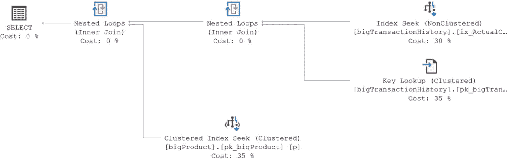
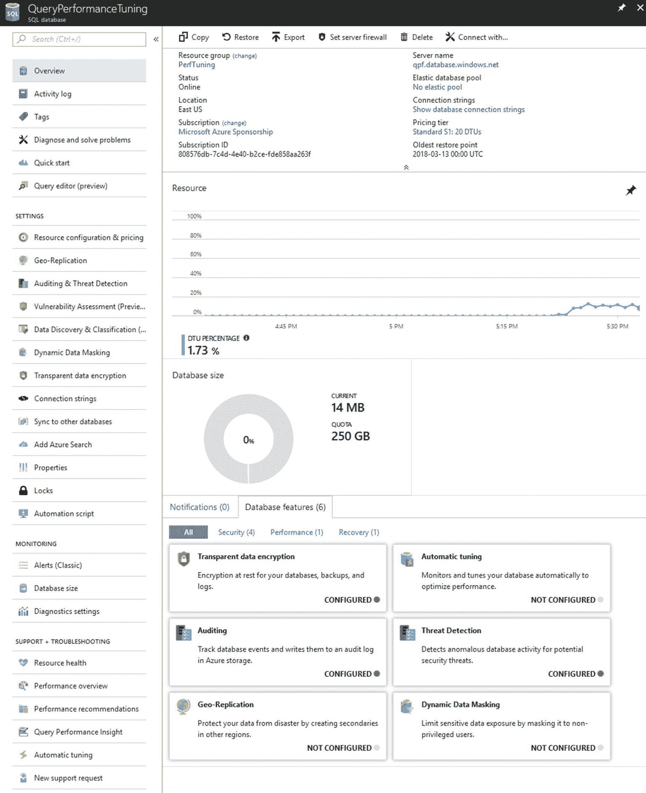

# 调优建议

首先，我们来看看 SQL Server 如何识别调优建议。由于此过程完全依赖于 `查询存储`，因此只能在已启用 `查询存储` 的数据库上启用它（参见第 11 章）。启用 `查询存储` 后，无论是 SQL Server 2017 还是 Azure SQL 数据库，都将自动开始监控性能回退的计划。一旦启用了 `查询存储`，您无需再启用其他任何功能。

微软没有精确定义一个计划性能“回退”到何种程度才会被标记为回退。因此，我们不想碰运气。我们将使用 Adam Machanic 的脚本（`make_big_adventure.sql`）在 `AdventureWorks` 数据库中创建一些非常大的表。该脚本可从 [`http://bit.ly/2mNBIhg`](http://bit.ly/2mNBIhg) 下载。我们在第 9 章处理列存储索引时也用过这个脚本。如果您仍在使用同一个数据库，请删除那些表并重新创建。这将为我们提供一个非常大的数据集，我们可以从中创建一个查询，该查询会根据传入的数据值表现出两种不同的行为。要查看一个性能回退的计划，让我们看下面的脚本：

```sql
CREATE INDEX ix_ActualCost ON dbo.bigTransactionHistory (ActualCost);
GO
--用于实验的简单查询
CREATE OR ALTER PROCEDURE dbo.ProductByCost (@ActualCost MONEY)
AS
SELECT bth.ActualCost
FROM dbo.bigTransactionHistory AS bth
JOIN dbo.bigProduct AS p
ON p.ProductID = bth.ProductID
WHERE bth.ActualCost = @ActualCost;
GO
--确保查询存储已开启并拥有干净的数据集
ALTER DATABASE AdventureWorks2017 SET QUERY_STORE = ON;
ALTER DATABASE AdventureWorks2017 SET QUERY_STORE CLEAR;
GO
```

这段代码在 `dbo.bigTransactionHistory` 表上创建了一个索引。它还创建了一个简单的存储过程供我们测试。最后，该脚本确保 `查询存储` 设置为 `ON` 并且清除了所有数据。所有这些准备就绪后，我们可以如下运行我们的测试脚本：

```sql
--建立查询性能的历史记录
EXEC dbo.ProductByCost @ActualCost = 8.2205;
GO 30
--从缓存中移除计划
DECLARE @PlanHandle VARBINARY(64);
SELECT  @PlanHandle = deps.plan_handle
FROM    sys.dm_exec_procedure_stats AS deps
WHERE   deps.object_id = OBJECT_ID('dbo.ProductByCost');
IF @PlanHandle IS NOT NULL
BEGIN
DBCC FREEPROCCACHE(@PlanHandle);
END
GO
--执行一个将产生不同计划的查询
EXEC dbo.ProductByCost @ActualCost = 0.0;
GO
--建立一段新的性能不佳的历史记录
EXEC dbo.ProductByCost @ActualCost = 8.2205;
GO 15
```

这需要一段时间才能执行完成。一旦完成，我们的数据库中应该会有一条调优建议。参考前面的代码清单，我们通过至少执行查询 30 次来建立特定的查询行为。当使用值 `8.2205` 时，查询本身只返回单行数据。所使用的计划如图 25-1 所示。



*图 25-1：返回小数据集时查询的初始执行计划*

尽管图 25-1 所示的计划可能有一些调优机会（特别是包含了 `键查找` 操作），但对于小数据集来说它运行良好。多次运行查询会在 `查询存储` 中建立起历史记录。接下来，我们将计划从缓存中移除，当我们使用值 `0.0` 时会生成一个新计划，如图 25-2 所示。


*图 25-2：用于更大数据集的执行计划*

在该计划生成之后，我们再多次执行该存储过程（`15` 次似乎有效），以便清楚地表明我们看到的不是一个简单的异常，而是一个真正的计划回退正在进行。这将产生一条调优建议。

我们可以通过查看名为 `sys.dm_db_tuning_recommendations` 的新 DMV 来验证这组查询是否导致了调优建议。以下是一个返回有限结果集的示例查询：

```sql
SELECT ddtr.type,
ddtr.reason,
ddtr.last_refresh,
ddtr.state,
ddtr.score,
ddtr.details
FROM sys.dm_db_tuning_recommendations AS ddtr;
```

从 `sys.dm_db_tuning_recommendations` 可以获取更多信息，但让我们基于之前的计划回退，逐步分析当前看到的内容。您可以在图 25-3 中看到此查询的结果。


*图 25-3：来自 sys.dm_db_tuning_recommendations DMV 的第一条调优建议*

这里提供的信息既直观又有些令人困惑。首先，`TYPE` 值很容易理解。这里的建议是我们需要对此查询使用 `FORCE_LAST_GOOD_PLAN`。目前，在发布时这是唯一可用的选项，但随着实现更多自动调优机制，这将会改变。`reason` 值是事情变得有趣的地方。在本例中，需要恢复到之前计划的解释如下：

```
平均查询 CPU 时间从 0.12 毫秒变为 2180.37 毫秒
```

每次执行查询，我们的 CPU 时间从不到 `1 毫秒` 变成了超过 `2.2 秒`。这是一个很容易识别的问题。`last_refresh` 值告诉我们建议中任何数据最后一次更改的时间。我们得到的状态值是一个小型 JSON 文档，由两个字段组成：`currentValue` 和 `reason`。以下是上一个结果集中的文档：

```
{"currentValue":"Active","reason":"AutomaticTuningOptionNotEnabled"}
```

它显示此建议处于 `Active` 状态，但尚未实施，因为我们尚未启用自动调优。`状态` 字段有多种可能的值。我们将在下一节“启用自动调优”中介绍它们以及 `reason` 字段的值。分数是一个估计的影响值，范围在 `0` 到 `100` 之间。值越高，表示建议过程的影响越大。最后，您会看到 `details`，这是另一个包含更多信息的 JSON 文档，如下所示：

```
{"planForceDetails":{"queryId":2,"regressedPlanId":4,"regressedPlanExecutionCount":15,"regressedPlanErrorCount":0,"regressedPlanCpuTimeAverage":2.180373266666667e+006,"regressedPlanCpuTimeStddev":1.680328201712986e+006,"recommendedPlanId":2,"recommendedPlanExecutionCount":30,"recommendedPlanErrorCount":0,"recommendedPlanCpuTimeAverage":1.176333333333333e+002,"recommendedPlanCpuTimeStddev":6.079253426385694e+001},"implementationDetails":{"method":"TSql","script":"exec sp_query_store_force_plan @query_id = 2, @plan_id = 2"}}
```

这些信息在一个数据块中显得很多，所以让我们更直接地将其分解到一个表格中：


| `planForceDetails` |   |   |
| --- | --- | --- |
|   | `queryID` | 2：来自查询存储的 `query_id` 值 |
|   | `regressedPlanID` | 4：问题计划来自查询存储的 `plan_id` 值 |
|   | `regressedPlanExecutionCount` | 15：该回归计划被执行的次数 |
|   | `regressedPlanErrorCount` | 0：当有值时，表示执行期间发生的错误数 |
|   | `regressedPlanCpuTimeAverage` | 2.18037326666667e+006：该计划的平均 CPU 时间 |
|   | `regressedPlanCpuTimeStddev` | 1.60328201712986e+006：该值的标准差 |
|   | `recommendedPlanID` | 2：调优建议所提议的 `plan_id` |
|   | `recommendedPlanExecutionCount` | 30：该推荐计划被执行的次数 |
|   | `recommendedPlanErrorCount` | 0：当有值时，表示执行期间发生的错误数 |
|   | `recommendedPlanCpuTimeAverage` | 1.176333333333333e+002：该计划的平均 CPU 时间 |
|   | `recommendedPlanCpuTimeStddev` | 6.079253426385694e+001：该值的标准差 |
| `implementationDetails` |   |   |
|   | Method | `TSql`：值将始终为 T-SQL |
|   | `script` | `exec sp_query_store_force_plan @query_id = 2, @plan_id = 2` |

这代表了调优建议的完整细节。无需启用任何自动调优，你就可以查看关于计划回归的建议以及提出这些建议背后的全部细节。你甚至可以得到脚本，如果你愿意，无需启用自动计划纠正，就能执行建议的修复。

有了这些信息，你就可以编写一个更复杂的查询，检索所有能使你全面调查这些建议的信息，包括查看执行计划。你需要做的就是直接查询 JSON 数据，然后像这个脚本一样，将其与从查询存储获得的其他信息连接起来：

```sql
WITH DbTuneRec
AS (SELECT ddtr.reason,
ddtr.score,
pfd.query_id,
pfd.regressedPlanId,
pfd.recommendedPlanId,
JSON_VALUE(ddtr.state,
'$.currentValue') AS CurrentState,
JSON_VALUE(ddtr.state,
'$.reason') AS CurrentStateReason,
JSON_VALUE(ddtr.details,
'$.implementationDetails.script') AS ImplementationScript
FROM sys.dm_db_tuning_recommendations AS ddtr
CROSS APPLY
OPENJSON(ddtr.details,
'$.planForceDetails')
WITH (query_id INT '$.queryId',
regressedPlanId INT '$.regressedPlanId',
recommendedPlanId INT '$.recommendedPlanId') AS pfd)
SELECT qsq.query_id,
dtr.reason,
dtr.score,
dtr.CurrentState,
dtr.CurrentStateReason,
qsqt.query_sql_text,
CAST(rp.query_plan AS XML) AS RegressedPlan,
CAST(sp.query_plan AS XML) AS SuggestedPlan,
dtr.ImplementationScript
FROM DbTuneRec AS dtr
JOIN sys.query_store_plan AS rp
ON rp.query_id = dtr.query_id
AND rp.plan_id = dtr.regressedPlanId
JOIN sys.query_store_plan AS sp
ON sp.query_id = dtr.query_id
AND sp.plan_id = dtr.recommendedPlanId
JOIN sys.query_store_query AS qsq
ON qsq.query_id = rp.query_id
JOIN sys.query_store_query_text AS qsqt
ON qsqt.query_text_id = qsq.query_text_id;
```

在观察到调优建议是如何得出之后，接下来的步骤是调查它们、实施它们，然后观察它们随时间的行为表现；或者，你可以启用自动调优，这样就不必全程监督这个过程。

你确实需要知道 `sys.dm_db_tuning_recommendations` 中的信息不会持久保存。如果数据库或服务器因任何原因离线，这些信息就会丢失。如果你发现自己需要定期使用这些信息，应该计划将其定期导出到一个更永久的地方。

## 启用自动调优

启用自动调优的流程完全取决于你是在 Azure SQL Database 中工作，还是在 SQL Server 2017 中工作。由于自动调优依赖于查询存储，因此开启它也是一个需要逐个数据库进行的任务。Azure 提供了两种方法：使用 Azure 门户或使用 T-SQL 命令。SQL Server 2017 只支持 T-SQL。我们将从 Azure 门户开始。

### 注意

Azure 门户会频繁更新。本书中的屏幕截图可能已过时，当你自己操作时，可能会看到不同的图形界面。

## Azure 门户

我假设你已经拥有一个 Azure 账户，并且知道如何创建 Azure SQL 数据库以及如何导航到它。我们将从一个数据库的主界面开始。你可以在左侧看到所有各种标准设置。页面顶部将显示数据库的常规设置。页面中心将显示性能指标。最后，在页面的右下角是数据库的功能选项。你可以在图 25-4 中看到所有这些。



*图 25-4：Azure 门户上的数据库界面*

我们将聚焦于屏幕右下角的细节部分，并点击自动调优功能。这将打开一个新界面，其中包含 Azure 内自动调优的设置，如图 25-5 所示。


*图 25-5：Azure SQL 数据库的自动调优功能*

要在此数据库中启用自动调优，我们将 FORCE PLAN 的设置从 INHERIT（默认为 OFF）更改为 ON。然后，你必须点击页面顶部的“应用”按钮。此过程完成后，你的选项应与图 25-6 中我的设置相似。


*图 25-6：自动调优选项变更为 FORCE PLAN 为 ON*

你可以为服务器更改这些设置，然后每个数据库可以自动继承它们。开启或关闭这些设置不会重置连接，也不会以任何方式使数据库离线。其他选项将在本章后面题为“Azure SQL 数据库自动索引管理”的部分中讨论。

完成此设置后，Azure SQL 数据库将开始在查询发生回归时强制使用最后一个良好计划，正如你在前面“调优建议”部分所看到的。和之前一样，你可以查询 DMV 来检索信息。你也可以使用门户查看这些信息。在 SQL 数据库界面的左侧是功能列表。在“支持 + 故障排除”标题下，你会看到“性能建议”。点击它将显示一个类似于图 25-7 的屏幕。


*图 25-7：门户上的性能建议页面*

图 25-7 中显示的信息应该有一部分看起来很熟悉。你已经从我们在前面“调优建议”部分查询的 DMV 中看到了操作、建议和影响。从这里，你可以手动应用建议，或者查看已丢弃的建议。你也可以通过点击“自动化”按钮返回到设置屏幕。所有这些都利用了查询存储，它在所有新数据库中默认是启用的。

这就是在 Azure 中启用自动调优所需的全部步骤。让我们看看如何在 SQL Server 2017 中完成它。


## SQL Server 2017

目前，SQL Server 2017 中没有用于启用自动查询调优的图形界面。相反，你必须使用一条 T-SQL 命令。你也可以在 Azure SQL Database 中使用相同的命令。该命令如下：

```sql
ALTER DATABASE current SET AUTOMATIC_TUNING (FORCE_LAST_GOOD_PLAN = ON);
```

当然，你可以用适当的数据库名替换这里我使用的默认值 `current`。此命令一次只能在一个数据库上运行。如果希望为实例上的所有数据库启用自动调优，必须在创建这些其他数据库之前，在 `model` 数据库中启用它，或者需要为服务器上的每个数据库手动将其打开。

目前 `automatic_tuning` 的唯一选项就是像我们这样做，启用强制使用上一个好的执行计划。你可以使用以下命令禁用此功能：

```sql
ALTER DATABASE current SET AUTOMATIC_TUNING (FORCE_LAST_GOOD_PLAN = OFF);
```

如果你运行此脚本，请记得再次使用 `ON` 运行它，以保持执行计划的自动调优处于开启状态。

## 自动调优实战

启用自动调优后，我们可以重新运行那个生成了性能退化计划的脚本。不过，为了确认自动调优正在运行，让我们使用一个新的系统视图 `sys.database_automatic_tuning_options` 来进行验证。

```sql
SELECT name,
       desired_state,
       desired_state_desc,
       actual_state,
       actual_state_desc,
       reason,
       reason_desc
FROM sys.database_automatic_tuning_options;
```

结果显示 `desired_state` 值为 `1`，且 `desired_state_desc` 值为 `On`。

我在测试时首先清除缓存，如下所示：

```sql
ALTER DATABASE SCOPED CONFIGURATION CLEAR PROCEDURE_CACHE;
GO
EXEC dbo.ProductByCost @ActualCost = 8.2205;
GO 30
-- 将计划从缓存中移除
DECLARE @PlanHandle VARBINARY(64);
SELECT  @PlanHandle = deps.plan_handle
FROM    sys.dm_exec_procedure_stats AS deps
WHERE   deps.object_id = OBJECT_ID('dbo.ProductByCost');
IF @PlanHandle IS NOT NULL
BEGIN
    DBCC FREEPROCCACHE(@PlanHandle);
END
GO
-- 执行一个将导致不同计划的查询
EXEC dbo.ProductByCost @ActualCost = 0.0;
GO
-- 建立新的性能不佳的历史记录
EXEC dbo.ProductByCost @ActualCost = 8.2205;
GO 15
```

现在，当我们使用我之前的示例脚本查询 DMV 时，结果是不同的，如图 25-8 所示。


图 25-8

性能退化的查询已被强制使用

`CurrentState` 值已更改为 `Verifying`。它将像之前一样，在多次执行期间衡量性能。如果性能下降，它将取消强制该计划。此外，如果出现超时或执行中止等错误，该计划也将被取消强制。在此事件中，你还会看到 `sys.dm_db_tuning_recommendations` 中的 `error_prone` 列的值变为 `Yes`。

如果你重启服务器，`sys.dm_db_tuning_recommendations` 中的信息将被删除。同样，所有已被强制执行的计划也将被删除。一旦查询再次出现性能退化，假设查询存储历史记录存在，任何计划强制都将自动重新启用。如果这是个问题，你始终可以手动强制该计划。

如果一个查询被强制使用计划，然后性能下降，它将被取消强制，如前所述。如果该查询再次出现性能退化，计划强制将被移除，并且该查询将被标记为——至少在服务器重启（信息被移除）之前——不会再次被强制。

我们也可以通过查看查询存储报告来查看强制的计划。图 25-9 显示了自动调优导致计划强制的结果。


图 25-9

“具有强制计划的查询”报告显示了自动调优的结果

这些报告不会告诉你计划被强制的原因。不过，如果需要，你始终可以前往 DMV 获取该信息。

## Azure SQL Database 自动索引管理

自动索引管理直指 Azure SQL Database 作为平台即服务（PaaS）定位的核心概念。大量的功能，如打补丁、备份、损坏测试，以及高可用性和许多其他功能，都由微软云为你管理。他们将其知识和系统管理能力用于处理索引问题，这也是顺理成章的。此外，由于 Azure SQL Database 的所有处理都在微软位于 Azure 的服务器场中进行，他们可以在监控你的系统时运用机器学习算法。

请注意，微软不会从你的查询、数据或存储在那里的任何信息中收集私人信息。它只是使用查询指标来衡量行为。重要的是要事先说明这一点，因为关于这些功能的错误信息一直在流传。

在启用索引管理之前，让我们先生成一些糟糕的查询行为。我针对 Azure 中的示例数据库 AdventureWorksLT 使用了两个脚本。当你在 Azure 中配置数据库时，示例数据库是门户中的选项之一，它简单且易于立即实施。这就是我喜欢在示例中使用它的原因。首先，这是一个生成一些存储过程的 T-SQL 脚本：

```sql
CREATE OR ALTER PROCEDURE dbo.CustomerInfo
(@Firstname NVARCHAR(50))
AS
SELECT c.FirstName,
       c.LastName,
       c.Title,
       a.City
FROM SalesLT.Customer AS c
JOIN SalesLT.CustomerAddress AS ca
    ON ca.CustomerID = c.CustomerID
JOIN SalesLT.Address AS a
    ON a.AddressID = ca.AddressID
WHERE c.FirstName = @Firstname;
GO
CREATE OR ALTER PROCEDURE dbo.EmailInfo (@EmailAddress nvarchar(50))
AS
SELECT c.EmailAddress,
       c.Title,
       soh.OrderDate
FROM SalesLT.Customer AS c
JOIN SalesLT.SalesOrderHeader AS soh
    ON soh.CustomerID = c.CustomerID
WHERE c.EmailAddress = @EmailAddress;
GO
CREATE OR ALTER PROCEDURE dbo.SalesInfo (@firstName NVARCHAR(50))
AS
SELECT c.FirstName,
       c.LastName,
       c.Title,
       soh.OrderDate
FROM SalesLT.Customer AS c
JOIN SalesLT.SalesOrderHeader AS soh
    ON soh.CustomerID = c.CustomerID
WHERE c.FirstName = @firstName
GO
CREATE OR ALTER PROCEDURE dbo.OddName (@FirstName NVARCHAR(50))
AS
SELECT c.FirstName
FROM SalesLT.Customer AS c
WHERE c.FirstName BETWEEN 'Brian'
                      AND     @FirstName
GO
```

接下来，这是一个 PowerShell 脚本，用于多次调用这些过程：


