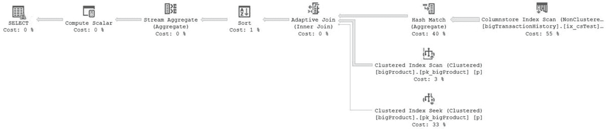
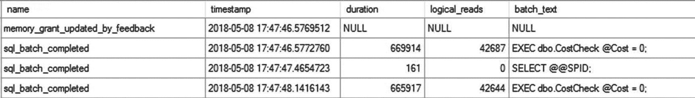
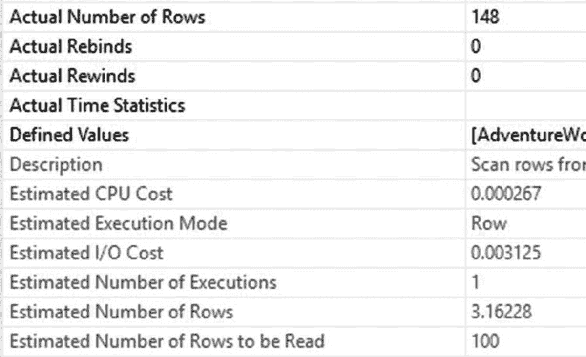
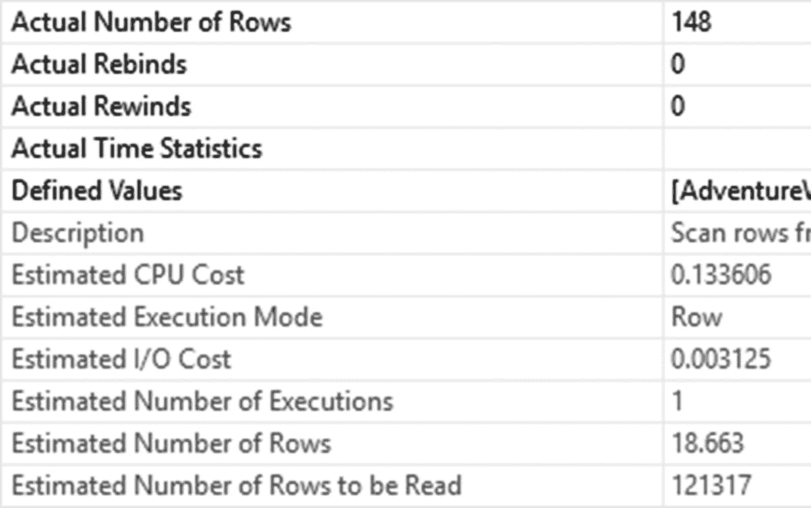

# 生成测试负载

```powershell
$SqlConnection = New-Object System.Data.SqlClient.SqlConnection
$SqlConnection.ConnectionString = 'Server=qpf.database.windows.net;Database=QueryPerformanceTuning;trusted_connection=false;user=UserName;password=YourPassword'
### 加载客户名称
$DatCmd = New-Object System.Data.SqlClient.SqlCommand
$DatCmd.CommandText = "SELECT c.FirstName, c.EmailAddress
FROM SalesLT.Customer AS c;"
$DatCmd.Connection = $SqlConnection
$DatDataSet = New-Object System.Data.DataSet
$SqlAdapter = New-Object System.Data.SqlClient.SqlDataAdapter
$SqlAdapter.SelectCommand = $DatCmd
$SqlAdapter.Fill($DatDataSet)
$Proccmd = New-Object System.Data.SqlClient.SqlCommand
$Proccmd.CommandType = [System.Data.CommandType]'StoredProcedure'
$Proccmd.CommandText = "dbo.CustomerInfo"
$Proccmd.Parameters.Add("@FirstName",[System.Data.SqlDbType]"nvarchar")
$Proccmd.Connection = $SqlConnection
$EmailCmd = New-Object System.Data.SqlClient.SqlCommand
$EmailCmd.CommandType = [System.Data.CommandType]'StoredProcedure'
$EmailCmd.CommandText = "dbo.EmailInfo"
$EmailCmd.Parameters.Add("@EmailAddress",[System.Data.SqlDbType]"nvarchar")
$EmailCmd.Connection = $SqlConnection
$SalesCmd = New-Object System.Data.SqlClient.SqlCommand
$SalesCmd.CommandType = [System.Data.CommandType]'StoredProcedure'
$SalesCmd.CommandText = "dbo.SalesInfo"
$SalesCmd.Parameters.Add("@FirstName",[System.Data.SqlDbType]"nvarchar")
$SalesCmd.Connection = $SqlConnection
$OddCmd = New-Object System.Data.SqlClient.SqlCommand
$OddCmd.CommandType = [System.Data.CommandType]'StoredProcedure'
$OddCmd.CommandText = "dbo.OddName"
$OddCmd.Parameters.Add("@FirstName",[System.Data.SqlDbType]"nvarchar")
$OddCmd.Connection = $SqlConnection
while(1 -ne 0)
{
foreach($row in $DatDataSet.Tables[0])
{
$name = $row[0]
$email = $row[1]
$SqlConnection.Open()
$Proccmd.Parameters["@FirstName"].Value = $name
$Proccmd.ExecuteNonQuery() | Out-Null
$EmailCmd.Parameters["@EmailAddress"].Value = $email
$EmailCmd.ExecuteNonQuery() | Out-Null
$SalesCmd.Parameters["@FirstName"].Value = $name
$SalesCmd.ExecuteNonQuery() | Out-Null
$OddCmd.Parameters["@FirstName"].Value = $name
$OddCmd.ExecuteNonQuery() | Out-Null
$SqlConnection.Close()
}
}
```

这些脚本将使我们能够生成必要的负载以触发自动索引管理功能。PowerShell 脚本必须运行大约 12 到 18 小时，才能在 Azure 中收集到足够数量的数据。但是，您必须首先更改一些要求和设置。

### 启用必要功能

为了使自动索引管理正常工作，您必须在 Azure SQL 数据库上启用查询存储。查询存储在 Azure 中默认是启用的，因此您只需要在将其关闭后重新打开。要确保其已启用，您可以运行以下脚本：

```sql
ALTER DATABASE CURRENT SET QUERY_STORE = ON;
```

启用查询存储后，您现在需要导航到数据库的“概述”屏幕。图 25-2 显示了完整的屏幕。作为提醒，屏幕底部有几个选项，其中一个是“自动调优”，如图 25-10 所示。


图 25-10 Azure SQL 数据库中的数据库功能，包括“自动调优”

“自动调优”是右上角的选项。请记住，Azure 可能会发生变化，因此您的屏幕可能与我的不同。单击“自动调优”按钮将打开图 25-11 所示的屏幕。


图 25-11 在 Azure SQL 数据库中启用“自动调优”

在这种情况下，我启用了所有三个选项，因此我不仅可以获得前面章节描述的通过自动调优获得的最后一个良好计划，而且现在还启用了自动索引管理。

### 验证自动索引管理

启用这些功能后，我们现在可以运行 PowerShell 脚本至少 12 小时。您可以像之前一样，通过查询`sys.dm_db_tuning_recommendations`来验证是否已收到索引。这里我使用一个简单的脚本，仅从 DMV 检索核心信息：

```sql
SELECT ddtr.type,
ddtr.reason,
ddtr.last_refresh,
ddtr.state,
ddtr.score,
ddtr.details
FROM sys.dm_db_tuning_recommendations AS ddtr;
```

在我的 Azure SQL 数据库上，结果如图 25-12 所示。


图 25-12 Azure SQL 数据库中的自动调优结果

如您所见，我的系统上发生了多个调优事件。第一个是我们在此示例中感兴趣的`CreateIndex`类型。您也可以查看 Azure 门户以获取自动调优的行为。在门户屏幕的左侧底部附近，您应该会看到一个名为“性能建议”的“支持 + 疑难解答”选项。选择该选项将打开一个类似于图 25-13 的窗口。


图 25-13 性能建议和调优历史记录

由于我们已启用所有自动调优，因此当前没有建议。自动调优已经生效。但是，我们仍然可以深入研究并收集更多信息。单击`CREATE INDEX`选项以打开一个新窗口。当自动调优尚未验证时，窗口将默认在“估计影响”视图中打开，如图 25-14 所示。


图 25-14 建议索引的估计影响视图

在我的例子中，索引已经创建，并且正在验证索引是否正确支持查询。您可以很好地了解该建议，并且它应该看起来很熟悉，因为其中包含的信息与前面自动计划调优中包含的信息类似。不同之处在于细节，我们这里有一个建议的索引、索引类型、架构、表、索引列以及任何包含列，而不是一个建议的计划。

您可以通过查看屏幕顶部的按钮来控制这些自动更改。您可以通过单击“还原”来手动删除更改。您可以查看用于生成更改的脚本，还可以查看收集的查询指标。

我的系统默认在“验证报告”上打开，如图 25-15 所示。


图 25-15 自动索引管理期间的验证操作

从这份报告中您可以看到，新索引已经到位，但它当前正处于评估期。目前尚不清楚评估期具体持续多久，但可以安全地假设这可能是另外 12 到 18 小时的系统负载期，在此期间将测量索引带来的任何负面影响，并用于决定是否保留该索引。评估进行的确切时间并非公开信息，因此我此处的估计也可能发生变化。


作为演示行为的一部分，我在验证期间停止了对数据库的查询。这意味着系统测量的任何查询都不太可能从新索引中获得任何收益。因此，两天后，索引被回退，意味着它从系统中被移除。我们可以在调优历史记录中看到这一点，如图 25-16 所示。


*图 25-16 负载变化后索引已被移除*

然而，假设负载保持不变，该索引将被验证为对所调用的查询有性能提升。

## 自适应查询处理

调优查询是本书的目的，所以谈论那些能让你不必调优那么多查询的机制似乎有些违反直觉，但理解 SQL Server 将在哪些地方自动帮助你是值得的。自适应查询处理概述的新机制从根本上是为了在查询执行时改变查询行为。这有助于处理与错误估计的行数和内存分配相关的一些基本问题。目前有三种类型的自适应查询处理，我们将在本章中演示所有三种：
- 批处理模式内存授予反馈
- 批处理模式自适应连接
- 交错执行

我们已经在第 9 章介绍了自适应连接。我们将按顺序处理自适应查询处理的另外两种机制，从批处理模式内存授予反馈开始。

### 批处理模式内存授予反馈

截至本文撰写时，批处理模式仅受涉及列存储索引（聚集或非聚集）的查询支持。批处理模式本身值得简要解释。在执行计划中的行模式执行期间，每对操作符必须协商它们之间传输的每一行。如果有十行，就有十次协商。如果有一千万行，就有一千万次协商。正如你所能想象的，这变得相当昂贵。因此，在批处理操作中，不是一次处理一行，而是分批进行处理，通常每批最多分布到 900 行，但这有很多变化。这意味着，移动一千万行不再需要一千万次协商，而只需要这么多：

一千万行 / ~ 每批 900 行 = 约 11,111 批次

从一千万次协商减少到大约 11,000 次是一个巨大的改进。此外，因为处理时间被释放出来，并且因为更好的行估计成为可能，你可以在查询执行中获得不同的行为。

我们将探讨的第一个行为是批处理模式内存授予反馈。在这种情况下，当一个查询以批处理模式执行时，会计算该查询是否获得了过剩或不足的内存。内存不足尤其是一个问题，因为它导致必须分配和使用磁盘来管理过剩，这被称为 `spill`。拥有更好的内存分配可以提高性能。让我们探索一个例子。

首先，为了使其工作，请确保你仍然在 `bigTransactionHistory` 表上有一个列存储索引，并且数据库的兼容性模式设置为 140。

在我们开始之前，我们还可以通过使用 Extended Events 来捕获与内存授予反馈过程直接相关的事件，从而确保我们可以观察到行为。以下是一个执行此操作的脚本：

```sql
CREATE EVENT SESSION MemoryGrant
ON SERVER
ADD EVENT sqlserver.memory_grant_feedback_loop_disabled
(WHERE (sqlserver.database_name = N'AdventureWorks2017')),
ADD EVENT sqlserver.memory_grant_updated_by_feedback
(WHERE (sqlserver.database_name = N'AdventureWorks2017')),
ADD EVENT sqlserver.sql_batch_completed
(WHERE (sqlserver.database_name = N'AdventureWorks2017'))
WITH (TRACK_CAUSALITY = ON);
```

第一个事件 `memory_grant_feedback_loop_disabled` 在相关查询受参数值影响过大时发生。与其让内存授予剧烈波动，查询引擎会禁用某些计划的反馈。当某个计划发生这种情况时，此事件将在执行期间触发。第二个事件 `memory_grant_updated_by_feedback` 在处理反馈时发生。让我们看看它的实际效果。

这里有一个过程，包含一个从 `bigTransactionHistory` 表聚合一些信息的查询：

```sql
CREATE OR ALTER PROCEDURE dbo.CostCheck (@Cost MONEY)
AS
SELECT p.Name,
AVG(th.Quantity),
AVG(th.ActualCost)
FROM dbo.bigTransactionHistory AS th
JOIN dbo.bigProduct AS p
ON p.ProductID = th.ProductID
WHERE th.ActualCost = @Cost
GROUP BY p.Name;
GO
```

如果我们执行此查询，传入值 0，并捕获实际执行计划，它看起来如图 25-17 所示。


*图 25-17 SELECT 运算符上带有警告的执行计划*

这个查询应该立即吸引你眼球的是 `SELECT` 运算符上的警告。我们可以打开“属性”窗口以查看计划的所有警告。请注意，工具提示只显示第一个警告，如图 25-18 所示。


*图 25-18 执行计划中的过度内存授予警告*


此处的定义相当清晰。根据列存储索引中存储数据的统计信息，SQL Server 假定处理此查询的数据需要 85,624KB 内存。实际使用的内存为 4,056KB。两者相差超过 81,000KB。如果此类查询频繁运行且存在如此大的差异，我们将面临严重的内存压力，而获益甚微。我们还可以通过**扩展事件**来查看反馈过程的实际运作情况。图 25-19 显示了作为执行查询的一部分而触发的 `memory_grant_updated_by_feedback` 事件。


图 25-19: `memory_grant_updated_by_feedback` 事件的扩展事件属性

您可以在图 25-19 中看到一些重要信息。`activity_id` 值显示此事件在扩展事件会话中发生于其他事件之前，因为 `seq` 值为 1。如果您正在运行代码，您会发现您的 `sql_batch_completed` 的 `seq` 值为 2。这意味着内存授予调整发生在查询完成执行之前，尽管您仍然会在执行计划中看到警告。这些调整是针对该查询的后续执行的。实际上，让我们再次执行该查询，并查看扩展事件中的查询执行结果，如图 25-20 所示。



图 25-20: 显示内存授予反馈仅发生一次的扩展事件

另一个值得注意的有趣之处是，如果您再次捕获执行计划，如图 25-21 所示，您将不再看到警告。


图 25-21: 相同的执行计划，但没有警告

如果我们继续使用这些参数值运行此存储过程，您不会看到任何其他变化。但是，如果我们按如下方式修改参数值：

```
EXEC dbo.CostCheck @Cost = 15.035;
```

我们将根本看不到任何变化。这是因为虽然结果集差异很大（1 行对比 9000 行），但内存需求并不像第一次执行第一个查询时那样差异巨大。但是，如果我们清除内存缓存，然后使用这些值执行存储过程，您将再次看到 `memory_grant_updated_by_feedback` 事件被触发。

如果您遇到因更改内存授予而导致的一定程度的系统颠簸问题，可以使用 `DATABASE SCOPED CONFIGURATION` 在数据库级别禁用它，如下所示：

```
ALTER DATABASE SCOPED CONFIGURATION SET DISABLE_BATCH_MODE_MEMORY_GRANT_FEEDBACK = ON;
```

要重新启用它，只需使用相同命令将其设置为 `OFF`。还有一个查询提示，可用于禁用单个查询的内存反馈。只需将 `DISABLE_BATCH_MODE_MEMORY_GRANT_FEEDBACK` 添加到查询提示的 `USE` 部分即可。

### 交错执行

虽然我仍然建议避免使用多语句表值函数，但您可能会发现自己不得不处理它们。在 SQL Server 2017 之前，使这些函数运行更快的唯一真正选择是重写代码以完全不使用它们。然而，SQL Server 2017 现在为这些对象提供了**交错执行**功能。其工作原理是，优化器会识别到它正在处理其中一个多语句函数。它会暂停优化过程。处理表值函数的那部分计划将会执行，并返回准确的行数。然后，这些行数将在后续的优化过程中被使用。如果您有多个多语句函数，您将获得多次执行，直到所有此类对象都返回了更准确的行数。

为了实际观察这一过程，我想创建以下多语句函数：

```
CREATE OR ALTER FUNCTION dbo.SalesInfo ()
RETURNS @return_variable TABLE (SalesOrderID INT,
OrderDate DATETIME,
SalesPersonID INT,
PurchaseOrderNumber dbo.OrderNumber,
AccountNumber dbo.AccountNumber,
ShippingCity NVARCHAR(30))
AS
BEGIN;
INSERT INTO @return_variable (SalesOrderID,
OrderDate,
SalesPersonID,
PurchaseOrderNumber,
AccountNumber,
ShippingCity)
SELECT soh.SalesOrderID,
soh.OrderDate,
soh.SalesPersonID,
soh.PurchaseOrderNumber,
soh.AccountNumber,
a.City
FROM Sales.SalesOrderHeader AS soh
JOIN Person.Address AS a
ON soh.ShipToAddressID = a.AddressID;
RETURN;
END;
GO
CREATE OR ALTER FUNCTION dbo.SalesDetails ()
RETURNS @return_variable TABLE (SalesOrderID INT,
SalesOrderDetailID INT,
OrderQty SMALLINT,
UnitPrice MONEY)
AS
BEGIN;
INSERT INTO @return_variable (SalesOrderID,
SalesOrderDetailID,
OrderQty,
UnitPrice)
SELECT sod.SalesOrderID,
sod.SalesOrderDetailID,
sod.OrderQty,
sod.UnitPrice
FROM Sales.SalesOrderDetail AS sod;
RETURN;
END;
GO
CREATE OR ALTER FUNCTION dbo.CombinedSalesInfo ()
RETURNS @return_variable TABLE (SalesPersonID INT,
ShippingCity NVARCHAR(30),
OrderDate DATETIME,
PurchaseOrderNumber dbo.OrderNumber,
AccountNumber dbo.AccountNumber,
OrderQty SMALLINT,
UnitPrice MONEY)
AS
BEGIN;
INSERT INTO @return_variable (SalesPersonID,
ShippingCity,
OrderDate,
PurchaseOrderNumber,
AccountNumber,
OrderQty,
UnitPrice)
SELECT si.SalesPersonID,
si.ShippingCity,
si.OrderDate,
si.PurchaseOrderNumber,
si.AccountNumber,
sd.OrderQty,
sd.UnitPrice
FROM dbo.SalesInfo() AS si
JOIN dbo.SalesDetails() AS sd
ON si.SalesOrderID = sd.SalesOrderID;
RETURN;
END;
GO
```

这些正是我在处理多语句函数时经常看到的那种反模式（或代码异味）。一个函数调用另一个函数，后者又与第三个函数连接，依此类推。因为优化器对这些函数会采取两种处理方式之一（取决于所使用的基数估算引擎版本），所以您实际上没有太多选择。在 SQL Server 2014 之前，优化器假定这些对象只有一行。SQL Server 2014 及更高版本采用了不同的假定，即 100 行。因此，如果兼容级别设置为 140 或更高，您将看到 100 行的假定，除非启用了交错执行。

我们可以针对这些函数运行一个查询。但是，首先我们希望在禁用交错执行的情况下运行它。然后我们将重新启用它，清除缓存，并再次执行查询，如下所示：


```
ALTER DATABASE SCOPED CONFIGURATION SET DISABLE_INTERLEAVED_EXECUTION_TVF = ON;
GO
SELECT csi.OrderDate,
csi.PurchaseOrderNumber,
csi.AccountNumber,
csi.OrderQty,
csi.UnitPrice,
sp.SalesQuota
FROM dbo.CombinedSalesInfo() AS csi
JOIN Sales.SalesPerson AS sp
ON csi.SalesPersonID = sp.BusinessEntityID
WHERE csi.SalesPersonID = 277
AND csi.ShippingCity = 'Odessa';
GO
ALTER DATABASE SCOPED CONFIGURATION SET DISABLE_INTERLEAVED_EXECUTION_TVF = OFF;
GO
ALTER DATABASE SCOPED CONFIGURATION CLEAR PROCEDURE_CACHE;
GO
SELECT csi.OrderDate,
csi.PurchaseOrderNumber,
csi.AccountNumber,
csi.OrderQty,
csi.UnitPrice,
sp.SalesQuota
FROM dbo.CombinedSalesInfo() AS csi
JOIN Sales.SalesPerson AS sp
ON csi.SalesPersonID = sp.BusinessEntityID
WHERE csi.SalesPersonID = 277
AND csi.ShippingCity = 'Odessa';
GO
```

得到的执行计划是不同的，但差异很细微，如图 25-22 所示。


图 25-22：两个执行计划，一个启用了交错执行

观察这些计划，实际上很难看出差异，因为所有的运算符都是一样的。然而，差异在于估计的成本值。在第一个计划顶部，表值函数的估计成本为 1%，表明与`聚集索引查找`和`表扫描`操作相比，它的开销几乎可以忽略不计。但在第二个计划中，`聚集索引查找`（预计返回一行）的成本突然只占总量的估计值 1%，其余的成本则合理地重新分配给了其他操作。正是这些行数估计上的差异，在某些情况下可能导致性能提升。然而，让我们通过数值来看一下实际情况。

`序列`运算符强制按顺序执行附加到它的每个子树。在此例中，首先执行的是表值函数。它为两个计划底部的`表扫描`运算符提供数据。图 25-23 显示了顶部计划（即以旧方式执行的计划）的属性。



图 25-23：旧式计划的属性

在图 25-23 截取的图像底部，你可以看到该运算符预计读取的行数为 100。其中，预期匹配的行数为 3.16228。实际的行数在顶部，为 148。这种差异是导致多语句函数执行时间如此之差的主要原因。

现在，让我们看看以交错方式执行的函数的相同属性，如图 25-24 所示。



图 25-24：交错执行的属性

因为这是针对相同结果集的相同查询，所以返回的实际行数是相同的。但是，请看`预计读取行数`的值。不再是硬编码的 100（无论涉及什么数据），现在变成了 121317。这是一个更准确的估计。它导致预计返回 18.663 行。这仍然不是实际值 148，但它正朝着更准确的估计迈进。

由于这些计划相似，执行时间和读取次数出现很大差异的可能性不大。不过，我们还是从扩展事件中获取度量值吧。平均而言，非交错执行耗时 1.48 秒，读取次数为 341,000 次。交错执行平均耗时 1.45 秒，读取次数为 340,000 次。有微小的改进。

现在，我们实际上可以显著提高性能，同时仍然使用多语句函数。与其将函数连接在一起，如果我们像这样重写代码：

```
CREATE OR ALTER FUNCTION dbo.AllSalesInfo (@SalesPersonID INT,
@ShippingCity VARCHAR(50))
RETURNS @return_variable TABLE (SalesPersonID INT,
ShippingCity NVARCHAR(30),
OrderDate DATETIME,
PurchaseOrderNumber dbo.OrderNumber,
AccountNumber dbo.AccountNumber,
OrderQty SMALLINT,
UnitPrice MONEY)
AS
BEGIN;
INSERT INTO @return_variable (SalesPersonID,
ShippingCity,
OrderDate,
PurchaseOrderNumber,
AccountNumber,
OrderQty,
UnitPrice)
SELECT soh.SalesPersonID,
a.City,
soh.OrderDate,
soh.PurchaseOrderNumber,
soh.AccountNumber,
sod.OrderQty,
sod.UnitPrice
FROM Sales.SalesOrderHeader AS soh
JOIN Person.Address AS a
ON a.AddressID = soh.ShipToAddressID
JOIN Sales.SalesOrderDetail AS sod
ON sod.SalesOrderID = soh.SalesOrderID
WHERE soh.SalesPersonID = @SalesPersonID
AND a.City = @ShippingCity;
RETURN;
END;
GO
```

我们不使用`WHERE`子句来执行最终查询，而是像这样执行它：

```
SELECT asi.OrderDate,
asi.PurchaseOrderNumber,
asi.AccountNumber,
asi.OrderQty,
asi.UnitPrice,
sp.SalesQuota
FROM dbo.AllSalesInfo(277,'Odessa') AS asi
JOIN Sales.SalesPerson AS sp
ON asi.SalesPersonID = sp.BusinessEntityID;
```

通过将参数传递给函数，我们允许交错执行有可供参考的测量值。这种方式返回的数据完全相同，但性能下降到了 65 毫秒，读取次数仅为 1,135 次。对于多语句函数来说，这相当惊人。然而，即使以非交错函数方式运行，执行时间也下降到 69 毫秒，读取次数为 1,428 次。虽然我们讨论的是不需要代码或结构更改的改进，但这些改进是非常微小的。

由于交错执行，可能会出现另一个问题，特别是如果你像我在第二个查询中那样传递值。它将根据手头的值创建一个计划。这实际上类似于参数嗅探。它使用这些硬编码值直接创建执行计划，利用这些值与统计信息进行比对来估计行数。如果你的统计信息变化很大，你可能会遇到类似于我们在第 15 章中讨论的性能问题。

你也可以使用查询提示来禁用交错执行。只需通过提示向查询提供`DISABLE_INTERLEAVED_EXECUTION_TVF`，它就会仅对正在执行的查询禁用该功能。

## 总结

随着 SQL Server 2017 中调优建议的增加，以及 Azure SQL Database 中索引自动化的引入，你在 SQL Server 自动化方面获得了更多帮助。你仍然需要利用本书其他部分学到的知识来理解这些建议何时有帮助，何时仅仅是为你自己的选择提供线索。不过，事情变得更加简单，因为通过自适应查询处理，SQL Server 可以自动进行调整，而你完全无需做任何工作。请记住，所有这些都有帮助，但没有一个是完整的解决方案。这只意味着你的工具箱里有了更多的工具来帮助处理性能不佳的查询。

下一章将讨论你可以用来通过分布式重放自动化查询测试的方法。


