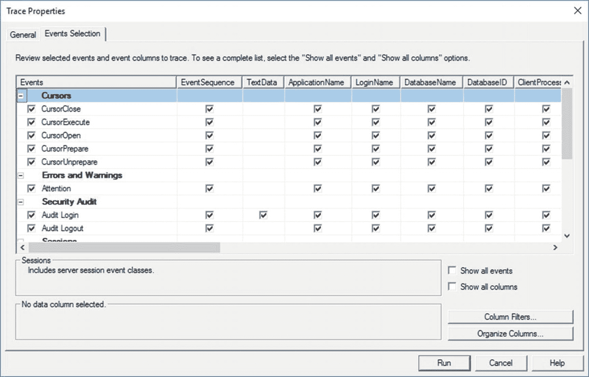

# 26. 数据库性能测试

掌握如何识别性能问题并知晓修复方法，这是一项极好的技能。然而，问题在于你需要能够证明你所做的改进是真正的提升。虽然你可以在调整查询或添加索引前后捕获性能指标，但确保你看到的是可衡量改进的最佳方法，是将你所做的更改付诸实践。测试不仅仅是简单地运行几次查询，然后怀着侥幸心理将其投入生产系统。你需要一种系统化的方法，以现实的方式使用针对你的系统运行的全套查询来验证性能改进。SQL Server 自 2012 版本起，通过其 **Distributed Replay** 工具提供了这样一种机制。

**Distributed Replay** 与 SQL Profiler 生成的信息以及它创建的跟踪事件协同工作。跟踪事件捕获信息的方式与 Extended Events 工具略有相似，但跟踪事件是一种较旧（且功能较弱）的系统中捕获事件的机制。在 SQL Server 2012 发布之前，你可以使用 SQL Server 的 Profiler 工具通过服务器端跟踪重放捕获的事件。这可行，但该过程极其有限。例如，该工具只能在单台机器上运行，并且它处理重放机制的方式——一个以串行方式运行的单线程过程——与实际情况不同。Microsoft 已经为 SQL Server 添加了从多台机器以并行方式运行的能力。在 Microsoft 提供一种通过 Extended Events 输出使用 **Distributed Replay** 的机制之前，你仍然需要使用跟踪事件来进行性能测试的这一环节。

**Distributed Replay** 并非一个被广泛采用的工具。大多数人完全跳过了实现可重复测试的想法。其他人可能会选择一些提供更多功能的第三方工具。我强烈建议你进行某种形式的测试，以确保你的调整工作对你的系统产生了可以准确衡量的积极影响。

本章涵盖以下主题：

*   数据库测试的概念
*   如何创建服务器端跟踪
*   使用 **Distributed Replay** 进行数据库测试

## 概述

数据库性能和负载测试的一般方法相当简单。你需要捕获生产系统在正常负载下的调用，然后能够在测试系统上反复重放该负载。这使你能够直接测量由代码或结构更改引起的性能变化。不幸的是，在现实世界实现这一点并不像听起来那么简单。

首先，你不能简单地捕获查询的记录。相反，你首先必须确保可以在测试系统上将生产数据库还原到某个时间点。具体来说，你需要能够恢复到你开始在系统上录制事务的确切点，因为如果你恢复到任何其他时间点，你可能会有不同的数据甚至不同的结构。这将导致重放机制生成错误而不是有用的信息。这意味着，首先，你必须有一个处于完整恢复模式的数据库，以便你可以进行定期的完整备份和日志备份，从而在测试开始时恢复到特定的时间点。

一旦你建立了恢复到适当时间的能力，你将需要配置你的查询捕获机制——在本例中，是由 Profiler 生成的服务器端跟踪定义。重放机制将精确定义你需要捕获哪些事件。你需要设置捕获过程，使其对系统的影响尽可能小。

接下来，你将必须处理跟踪捕获的大量数据。根据你的系统规模大小，你可能在短时间内有大量的事务。所有这些数据都必须存储和管理，并且会有很多文件。

你可以在单台机器上设置此过程；然而，为了真正看到好处，你会希望设置多台机器来支持 **Distributed Replay** 工具的重放功能。这意味着作为测试过程的一部分，你需要有这些机器可供使用。不幸的是，除了 Enterprise 版之外的所有版本，你只能有一个客户端，因此在设置测试环境时请考虑到这一点。

此外，你不能忽视这样一个事实：最好的数据、数据库和代码是来自你的生产系统。然而，根据你对本地和国际法律合规性的需求，你可能必须选择一种完全不同的机制来记录你的服务器端跟踪。你不希望危及组织内管理的数据的隐私和保护。如果是这种情况，你可能必须从用于其他类型自动化测试的 QA 服务器或预生产服务器捕获你的负载。这些可能是难以克服的问题。

当你把所有这些不同的部分都准备就绪后，就可以开始测试了。当然，这引出了一个新的问题：你到底在用数据库测试做什么？

### 可重复的过程

如第 1 章所述，性能调优你的系统是一个迭代过程，你可能需要经历多次才能使性能达到并保持在你需要的水平。由于业务会随时间变化，你的数据分布、应用程序、数据结构以及所有支持的代码也会随之变化。鉴于所有这些，你能为测试做的最重要的事情之一就是创建一个可以反复运行的过程。

你需要创建一个可重复测试过程的主要原因是，你不能总是确定本书前面章节中概述的方法在每种情况下都有效。这无疑意味着你需要能够验证你所做的更改是否带来了性能的积极改进。如果没有，你需要能够移除你所做的任何更改，进行一组新的更改，然后重复测试，迭代地重复这个过程。你可能会发现你需要重复整个调优周期，直到你达到这一轮的目标。

由于这个过程的迭代性质，你绝对需要专注于尽可能多地将其自动化。这正是 **Distributed Replay** 工具发挥作用的地方。

##### 分布式重放

分布式重放工具由三个架构组件组成。

-   `Distributed Replay Controller`：此服务管理分布式重放系统的进程。
-   `Distributed Replay Administrator`：这是一个允许您控制分布式重放控制器和分布式重放过程的界面。
-   `Distributed Replay Client`：这是一个在一个或多个机器（最多 16 台）上运行的界面，用于向数据库服务器发出所有调用。

您可以将所有三个组件安装在一台机器上；然而，理想的方法是将控制器放在一台机器上，然后将一个或多个客户端机器与控制器完全分离，以便每台机器只处理针对测试机器的部分事务。仅出于说明目的，我将所有组件运行在一个实例上。

首先将 `Distributed Replay Controller` 服务安装到一台机器上。分布式重放工具本身没有用户界面。相反，您将使用 XML 配置文件来控制分布式重放架构的不同部分。您可以将分布式重放用于各种任务，例如基本查询重放、服务器端游标或预准备服务器语句。由于我主要介绍查询调优，我将重点关注查询和预准备服务器语句（也称为*参数化查询*）。这定义了一组必须捕获的特定事件。我将在下一节介绍如何做到这一点。

一旦信息被捕获到跟踪文件中，您就需要使用 `Distributed Replay Controller` 通过预处理事件运行该文件。这将基本的跟踪数据修改为一种不同的格式，以便可以分发到各个 `Distributed Replay Client` 机器。然后您可以启动重放过程。重新格式化的数据被发送到客户端，客户端随后将创建查询以在目标服务器上运行。您可以从客户端机器捕获另一个跟踪输出，以确切查看它们进行了哪些调用，以及这些调用的 I/O 和 CPU。您可能还会在目标服务器上设置标准监控，以查看您生成的负载如何影响该服务器。

当您准备在服务器上运行系统时，可以选择两种类型的重放之一：同步模式或压力模式。在同步模式下，您将获得与原始重放完全相同的副本，尽管您可以影响系统上的空闲时间量。这对于精确的性能调优很有用，因为它有助于您了解系统的工作方式，尤其是在对结构、索引或 T-SQL 代码进行更改时。压力模式不以任何特定顺序运行，但在单个连接内除外，查询将在该连接内按正确顺序流式传输。在这种情况下，调用会以客户端机器尽可能快的速度发出——以任何顺序——只要服务器能接收它们。简而言之，它执行压力测试。这对于测试数据库设计或硬件安装非常有用。

一个重要的注意事项是，作为一般规则，当您仅对最新版本的跟踪数据使用最新版本的 SQL Server 进行重放时，是最安全的。但是，您可以在 SQL Server 2017 上重放 SQL Server 2005 的数据。此外，分布式重放或跟踪事件不支持 Azure SQL Database，因此您无法将其用于您的 Azure 数据库。

## 使用服务器端跟踪捕获数据

使用跟踪事件捕获数据类似于使用扩展事件捕获查询执行。为了支持分布式重放过程，您需要捕获一些特定事件和这些事件的特定列。如果您想构建自己的跟踪事件，您需要捕获表 26-1 中列出的事件。

表 26-1 要捕获的事件

| 事件 | 列 |
| --- | --- |
| `Prepare SQL` `Exec Prepared SQL` `SQL:BatchStarting` `SQL:BatchCompleted` `RPC:Starting` `RPC:Completed` `RPC Output Parameter` `Audit Login` `Audit Logout` `Existing Connection` `Server-side Cursor` `Server-side prepared SQL` | `Event Class` `EventSequence` `TextData` `Application Name` `LoginName` `DatabaseName` `Database ID` `HostName` `Binary Data` `SPID` `Start Time` `EndTime` `IsSystem` |

设置这些事件有两个选项。首先，您可以使用 T-SQL 来设置服务器端跟踪。其次，您可以使用一个名为 `Profiler` 的外部工具。虽然 `Profiler` 可以直接连接到您的 SQL Server 实例，但我强烈建议不要使用此工具来捕获数据。`Profiler` 最好用作提供捕获模板的方式。您应该使用 T-SQL 来生成实际的服务器端跟踪。

在测试或开发机器上，打开 `Profiler` 并从“模板”列表中选择 `TSQL_Replay`，如图 26-1 所示。

图 26-1 分布式重放跟踪模板

由于您需要一个用于分布式重放的文件，您会希望将跟踪输出保存到文件。无论如何，这是设置服务器端跟踪的最佳方式，因此这很合适。您会希望输出到具有足够空间的位置。根据您的系统必须支持的事务数量，跟踪文件可能会非常大。此外，最好限制文件大小并允许它们滚动覆盖，根据需要创建新文件。您将需要处理更多文件，但操作系统实际上可以更好地处理大量较小文件的写入操作，而不是单个大文件。我发现这是真的，原因有二。首先，使用较小的文件大小，滚动覆盖更快，这意味着如果您需要将前一个文件加载到表中或复制到另一台服务器，该文件已可用于处理。其次，根据我的经验，简单日志文件的写入通常需要更长时间，因为此类文件的大小会变得非常大。我还建议为跟踪过程定义停止时间；这同样有助于确保您不会填满为存储跟踪数据指定的驱动器。

由于这是一个模板，事件和列已为您选择好了。您可以通过单击“事件选择”选项卡来验证事件和列，以确保您获得所需的内容。图 26-2 显示了一些事件和列，所有这些都已为您预定义。

图 26-2 `TSQL_Replay` 模板事件和列

此模板是通用的，因此它包含了完整的事件列表，包括所有游标事件。您可以通过单击框来取消选择事件进行编辑；但是，如果您要删除任何事件，我建议只删除游标事件。

