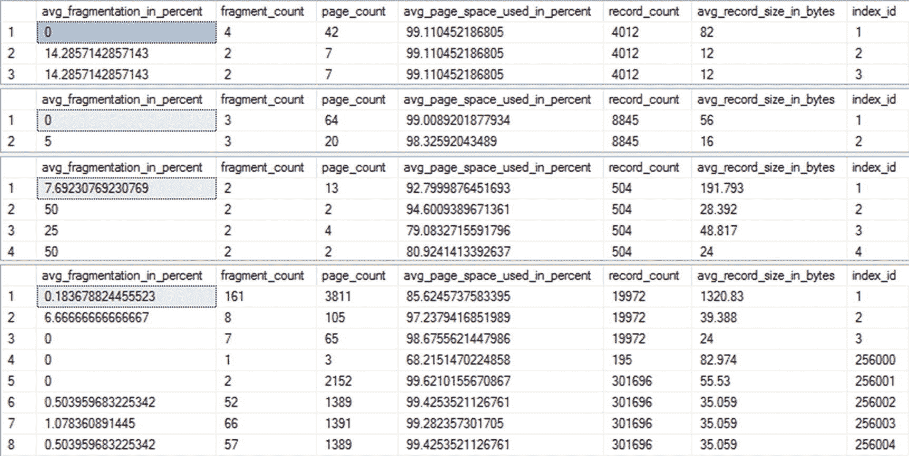
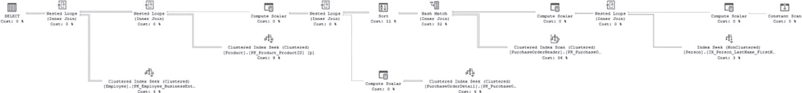
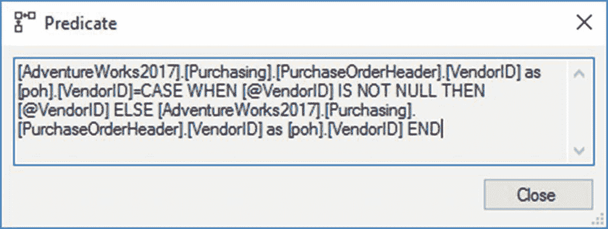
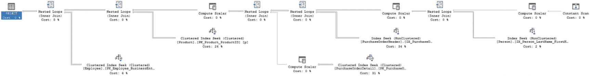
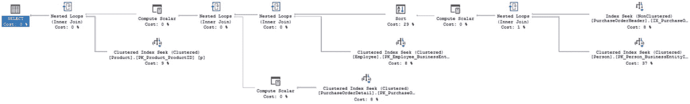
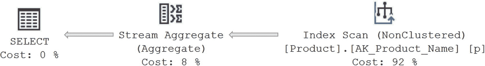
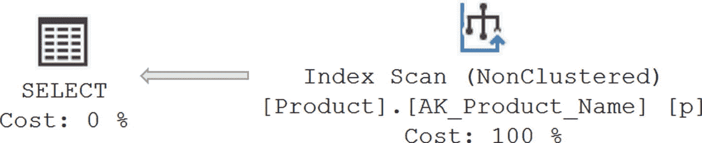

# 分析工作负载

一旦工作负载被捕获到文件中，您就可以通过使用`SSMS`浏览数据或将输出文件的内容导入数据库表来分析工作负载。

`SSMS`提供了以下两种分析文件内容的方法，两者都相对简单：

*   通过右键单击数据列来选择排序顺序或按特定列进行排序：您可能希望从“详细信息”选项卡中选择列，并使用“在表中显示列”命令将它们上移。一旦它们出现，您就可以对该列发出分组和排序命令。

*   重新排列输出为选择性的列和事件列表：您可以通过右键单击表格并从上下文菜单中选择“选择列”来更改通过`SSMS`显示的输出。这使您不仅仅是简单地挑选列；它还允许您将它们组合成新的列。

正如我在本书中所展示的，`SSMS`中的实时数据资源管理器与`扩展事件`结合使用时，可用于进行基本的聚合。例如，如果您想按查询文本或对象`ID`分组，然后获取平均持续时间或执行次数，您是可以做到的。事实上，`SSMS`是进行此类更简单聚合的一种方式。

另一方面，如果您想对工作负载进行深入分析，则必须将跟踪文件的内容导入数据库表。然后您可以创建更复杂的查询。会话的输出将大多数重要数据放入`XML`字段中，因此您需要在加载数据时查询它，如下所示：

```sql
DROP TABLE IF EXISTS dbo.ExEvents;
GO
WITH xEvents
AS (SELECT object_name AS xEventName,
CAST(event_data AS XML) AS xEventData
FROM sys.fn_xe_file_target_read_file('C:\PerfData\QueryPerfTuning2017*.xel',
NULL,
NULL,
NULL) )
SELECT xEventName,
xEventData.value('(/event/data[@name="duration"]/value)[1]',
'bigint') AS Duration,
xEventData.value('(/event/data[@name="physical_reads"]/value)[1]',
'bigint') AS PhysicalReads,
xEventData.value('(/event/data[@name="logical_reads"]/value)[1]',
'bigint') AS LogicalReads,
xEventData.value('(/event/data[@name="cpu_time"]/value)[1]',
'bigint') AS CpuTime,
CASE xEventName
WHEN 'sql_batch_completed' THEN
xEventData.value('(/event/data[@name="batch_text"]/value)[1]',
'varchar(max)')
WHEN 'rpc_completed' THEN
xEventData.value('(/event/data[@name="statement"]/value)[1]',
'varchar(max)')
END AS SQLText,
xEventData.value('(/event/data[@name="query_plan_hash"]/value)[1]',
'binary(8)') AS QueryPlanHash
INTO dbo.ExEvents
FROM xEvents;
```

您需要用您自己的路径和文件名替换`<ExEventsFileName>`。一旦您将内容放入表中，就可以使用`SQL`查询来分析工作负载。例如，要查找最慢的查询，您可以执行此`SQL`查询：

```sql
SELECT  *
FROM    dbo.ExEvents AS ee
ORDER BY ee.Duration DESC;
```

前面的查询将显示单个成本最高的查询，这对于您在本章中运行的测试来说已经足够了。在生产系统上，您可能还想运行类似的查询；但是，更有可能的是，您希望从数据聚合入手，如下例所示：

```sql
SELECT  ee.SQLText,
SUM(Duration) AS SumDuration,
AVG(Duration) AS AvgDuration,
COUNT(Duration) AS CountDuration
FROM    dbo.ExEvents AS ee
GROUP BY ee.SQLText;
```

执行此查询可以让您按您最感兴趣的字段排序——例如，按`CountDuration`排序以获取最常调用的过程，或按`SumDuration`排序以获取累计运行时间最长的过程。您需要一种方法来移除或替换参数及参数值。这对于仅基于过程名称或仅基于不带参数或参数值的查询文本来进行聚合是必要的（因为这些值会不断变化）。
```


另一种机制是直接查询缓存，以查看其中成本最高的查询。这比配置扩展事件（Extended Events）更简单。此外，在大多数情况下，这种方法很可能捕获到大部分有问题的查询。因此，如果你是第一次开始对系统进行查询调优，你可能希望跳过设置扩展事件来识别成本最高的查询。然而，我发现随着时间的推移，当你开始量化系统行为时，你会需要扩展事件所能提供的那种详细数据。

我们在本书中已经探讨过的另一种方法是使用查询存储（Query Store）来收集系统中查询行为的度量指标。它的优势在于设置极其简单，查询方便，不涉及 XML。唯一的缺点是，如果你需要针对单个查询和存储过程调用的细粒度详细性能指标，那么你还是会需要依靠扩展事件来满足对此类数据的需求。

简而言之，在如何整合这些信息方面，你有许多选择和灵活性。对于 SQL Server 2016 和 SQL Server 2017，你甚至可以开始利用 R 或 Python 的数据分析来增强呈现的信息。不过，为了我们的目的，我将坚持使用我概述的第一种方法，即在 SSMS 中使用实时数据（Live Data）。

分析工作负荷的目标是识别出成本最高的查询（或通常意义上的高成本查询）；下一节将介绍如何做到这一点。

## 识别成本最高的查询

如前所述，你可以使用 SSMS 或查询技术，根据不同的标准来识别高成本查询。工作负荷中的查询可以根据 `CPU`、`读取` 或 `写入` 列进行排序，以识别成本最高的查询，如第 3 章所讨论。你也可以使用聚合函数来得出累积成本以及单个成本。在生产系统中，了解累积运行时间最长、CPU 使用率最高或读写次数最多的存储过程，通常比仅仅识别单次执行数值最高的查询更有用。

因为即使在最繁忙的 OLTP 数据库中，总读取次数通常至少是总写入次数的七到八倍，所以按 `读取` 列排序查询通常比按 `写入` 列排序能发现更多有问题的查询（但你应该总是在自己的系统上测试这一点）。同样值得查看那些执行时间最长的查询。如第 5 章所述，你可以使用性能监视器（Performance Monitor）捕获等待状态，并将其与特定查询一起查看，以帮助识别为什么某个查询运行时间过长。你还可以使用扩展事件捕获特定查询的等待情况，并将其添加到你的计算中。每个系统都是不同的。通常，我会首先处理最常调用的存储过程，然后是运行时间最长的，最后是读取次数最多的。当然，性能调优是一个迭代过程，因此你需要定期重新检查每个类别。

为了分析示例工作负荷中性能最差的查询，你需要了解查询在持续时间或读取方面的成本。由于这些值只有在查询执行完成后才能知道，因此你主要关注的是完成的事件。（使用完成事件进行性能分析的原理在第 6 章中有详细解释。）

出于展示目的，在 SSMS 中打开跟踪文件。图 27-1 显示了将几列移动到网格中，然后通过单击持续时间列（单击两次以获得降序而非升序排序）进行排序后捕获的跟踪输出。


图 27-1

显示 SQL 工作负荷的扩展事件会话输出

就持续时间而言，性能最差的查询在 CPU 使用率和读取方面也是最差的之一。该存储过程 `dbo.PurchaseOrderBySalesPersonName` 位于图 27-1 的顶部（你的值可能不同，但此查询很可能是性能最差的查询，或者至少是示例查询中最差的之一）。

一旦你识别出性能最差的查询，下一个优化步骤是确定该查询消耗的资源。

### 确定成本最高查询的基线资源使用情况

在你应用任何优化技术之前，当前性能最差查询的资源使用情况可以被视为一个基线数据。你可能对该查询应用不同的优化技术，并且可以将查询优化后的资源使用情况与基线数据进行比较，以确定给定优化技术的有效性。查询的资源使用情况可以分为两类呈现。

*   整体资源使用情况

*   详细资源使用情况

### 整体资源使用情况

查询的整体资源使用情况提供了性能最差查询所消耗硬件资源的总体数据。你可以将优化后查询的资源使用情况与未优化查询的整体资源使用情况相比较，以确保你所应用性能技术的整体有效性。

你可以从工作负荷跟踪中确定查询的整体资源使用情况。你将使用该存储过程的第一次调用，因为它显示了最差的行为。表 27-2 显示了从图 27-1 的跟踪中得到的该查询的整体使用情况。需要注意一点，表中的持续时间单位是毫秒，而图 27-1 中的值单位是微秒。在处理扩展事件时请记住考虑这一点。

表 27-2

表示查询所用资源数量的数据列

| 数据列 | 值 | 描述 |
| --- | --- | --- |
| `LogicalReads` | 8671 | 查询执行的逻辑读取次数。如果在内存中找不到某个页，则对该页进行逻辑读取需要先从磁盘进行物理读取，将该页提取到内存中。 |
|    `Writes` | 0 | 查询修改的页数。 |
|    `CPU` | 62ms | 查询使用 CPU 的时长。 |
|    `Duration` | 464.1ms | SQL Server 处理此查询所花费的时间，从编译到返回结果集。 |

### 注意

在你的环境中，上述数据列的值可能不同。无论数据列的绝对值是多少，跟踪这些值以便稍后与相应值进行比较是很重要的。


## 详细的资源使用情况

你可以分解查询的总体资源使用情况，以定位查询所访问的不同数据库对象上的瓶颈。这种详细的资源使用情况有助于你确定哪些操作问题最大。理解系统中的等待状态将帮助你确定需要重点关注调优的地方。一个粗略的经验法则是简单地查看持续时间；然而，持续时间会受到许多因素的影响，尤其是阻塞，因此它充其量只是一个不完美的衡量标准。在这种情况下，我将花时间在三个方面：CPU 使用率、读取和持续时间。读取是一个流行的性能衡量指标，但孤立地看待它可能和持续时间一样有问题。这就是为什么我更喜欢捕获多个值，并能够跨查询的迭代进行比较。

正如你在第 6 章中看到的，你可以从查询的`STATISTICS IO`输出中获取该查询访问的各个表上执行的读取次数。你还可以设置`STATISTICS TIME`选项来获取查询的基本执行时间和 CPU 时间，包括其编译时间。你可以通过使用以下`SET`语句重新执行查询来获取此输出（或通过在查询窗口中选择“设置统计信息时间”复选框）：

```
ALTER DATABASE SCOPED CONFIGURATION CLEAR PROCEDURE_CACHE;
DBCC DROPCLEANBUFFERS;
GO
SET STATISTICS TIME ON;
GO
SET STATISTICS IO ON;
GO
EXEC dbo.PurchaseOrderBySalesPersonName @LastName = 'Hill%';
GO
SET STATISTICS TIME OFF;
GO
SET STATISTICS IO OFF;
GO
```

为了模拟图 27-1 所示的首次运行，使用`DBCC DROPCLEANBUFFERS`清除存储在内存中的数据（不要在生产系统上运行），并使用数据库作用域配置命令`CLEAR PROCEDURE_CACHE`将指定数据库的查询从缓存中移除（同样不要在生产系统上运行）。

性能最差的查询的`STATISTICS`输出如下所示：

```
DBCC execution completed. If DBCC printed error messages, contact your system administrator.
SQL Server parse and compile time:
CPU time = 0 ms, elapsed time = 0 ms.
SQL Server Execution Times:
CPU time = 0 ms,  elapsed time = 0 ms.
SQL Server parse and compile time:
CPU time = 0 ms, elapsed time = 0 ms.
SQL Server parse and compile time:
CPU time = 31 ms, elapsed time = 40 ms.
(1496 rows affected)
Table 'Employee'. Scan count 0, logical reads 2992, physical reads 2, read-ahead reads 0, lob logical reads 0, lob physical reads 0, lob read-ahead reads 0.
Table 'Product'. Scan count 0, logical reads 2992, physical reads 4, read-ahead reads 0, lob logical reads 0, lob physical reads 0, lob read-ahead reads 0.
Table 'PurchaseOrderDetail'. Scan count 763, logical reads 1539, physical reads 9, read-ahead reads 0, lob logical reads 0, lob physical reads 0, lob read-ahead reads 0.
Table 'Worktable'. Scan count 0, logical reads 0, physical reads 0, read-ahead reads 0, lob logical reads 0, lob physical reads 0, lob read-ahead reads 0.
Table 'Workfile'. Scan count 0, logical reads 0, physical reads 0, read-ahead reads 0, lob logical reads 0, lob physical reads 0, lob read-ahead reads 0.
Table 'PurchaseOrderHeader'. Scan count 1, logical reads 44, physical reads 1, read-ahead reads 42, lob logical reads 0, lob physical reads 0, lob read-ahead reads 0.
Table 'Person'. Scan count 1, logical reads 4, physical reads 1, read-ahead reads 2, lob logical reads 0, lob physical reads 0, lob read-ahead reads 0.
SQL Server Execution Times:
CPU time = 15 ms,  elapsed time = 93 ms.
SQL Server Execution Times:
CPU time = 46 ms,  elapsed time = 133 ms.
SQL Server parse and compile time:
CPU time = 0 ms, elapsed time = 0 ms.
```

值得一提的一个注意事项是，返回此信息以及数据会带来一些开销，并且会影响一些性能指标，包括查询的持续时间衡量。对我们大多数人来说，在大多数情况下，这不是问题，但有时它会明显导致问题。请注意，通过这种方式捕获信息，你是在做出一种选择。

表 27-3 总结了`STATISTICS IO`的输出。

表 27-3
分解 STATISTICS IO 的输出

| 表 | 逻辑读取 |
| --- | --- |
| `Person.Employee` | 2,992 |
| `Production.Product` | 2,992 |
| `Purchasing.PurchaseOrderDetail` | 1,539 |
| `Purchasing.PurchaseOrderHeader` | 44 |
| `Person.Person` | 4 |

通常，查询中引用的各个表的读取总和将小于查询执行的总读取次数。这是因为必须读取额外的页面来访问内部数据库对象，例如`sysobjects`、`syscolumns`和`sysindexes`。

表 27-4 总结了`STATISTICS TIME`的输出。

表 27-4
分解 STATISTICS TIME 的输出

| 事件 | 持续时间 | CPU |
| --- | --- | --- |
| `编译` | 40 ms | 31 ms |
| `执行` | 93 ms | 15 ms |
| `完成` | 133 ms | 46 ms |

不要将逻辑读取与执行时间孤立地使用。在确定性能不佳的查询时，你需要考虑所有衡量指标。反之，也不要假设执行时间是一个完美的衡量标准。资源争用在执行时间中扮演着重要角色，因此你会看到此衡量指标存在一些变化。同时使用这两个值，但要充分理解，孤立地使用任何一个都可能无法准确反映实际情况。

你还可以为这些详细信息添加额外的指标。正如我在第 2-4 章中概述的，等待统计信息是理解系统上发生情况的重要衡量标准。这对于查询也同样适用。在 SQL Server 2016 及更新版本中，当你捕获实际执行计划时，可以看到超过 1 毫秒的等待信息。该信息位于查询执行计划中 `SELECT` 操作符的属性中。你还可以使用扩展事件来捕获给定查询的等待统计信息，这将显示所有的等待，而不仅仅是那些超过 1 毫秒的等待。这些是用于衡量查询性能的详细指标的有用补充。

一旦确定了性能最差的查询并测量了其资源使用情况，下一步优化步骤就是确定影响查询性能的因素。然而，在此之前，你应该检查是否存在任何查询外部因素可能导致这种性能不佳。

## 分析和优化外部因素

除了查询设计和索引等因素外，外部因素也会影响查询性能。因此，在深入研究查询的执行计划之前，你应该分析并优化可能影响查询性能的主要外部因素。以下是一些外部因素：

*   应用程序使用的连接选项
*   查询所访问的数据库对象的统计信息
*   查询所访问的数据库对象的碎片化程度


## 分析应用程序使用的连接选项

在连接 SQL Server 时，可以设置各种选项（如 `ANSI_NULL` 或 `CONCAT_NULL_YIELDS_NULL`），使其与服务器或数据库的默认值不同。然而，为每个连接更改这些设置可能导致存储过程重新编译，从而引发性能下降。此外，某些选项（如 `ARITHABORT`）在处理索引视图和某些其他特殊索引时必须设置为 `ON`。如果未设置，可能会导致性能低下甚至代码错误。例如，将 `ANSI_WARNINGS` 设置为 `OFF` 会导致优化器在生成执行计划时忽略索引视图和索引计算列。你可以再次查看执行计划的属性以获取此信息。创建执行计划时，ANSI 设置会与其一同存储。因此，如果你查询缓存以查看计划，并通过扩展事件或 SSMS 从查询存储中检索它，你将获得计划编译时的 ANSI 设置。此外，如果调用相同的查询且 ANSI 设置与当前缓存中的不同，则将编译一个新计划（并与另一个计划一起存储在查询存储中）。这些属性位于 `SELECT` 运算符中，如图 27-2 所示。


图 27-2

显示"设置选项"属性的执行计划属性

我建议使用 ANSI 标准设置，即将以下选项设置为 `TRUE`：`ANSI_NULLS`、`ANSI_NULL_DFLT_ON`、`ANSI_PADDING`、`ANSI_WARNINGS`、`CURS0R_CLOSE_ON_COMMIT`、`IMPLICIT_TRANSACTIONS` 和 `QUOTED_IDENTIFIER`。你可以使用单个命令 `SET ANSI_DEFAULTS ON` 将它们全部同时设置为 `TRUE`。查询 `sys.query_context_settings` 也是查看跨工作负载所用设置历史的有用方法。

## 分析统计信息的有效性

查询中引用的数据库对象的统计信息是查询优化器用来决定某些执行计划的关键信息之一。如第 13 章所述，优化器基于查询中引用的对象的统计信息生成查询的执行计划。统计信息所建议的行数是驱动优化器的成本估算过程的主要部分。通过这种方式，它决定了查询的处理策略。如果数据库对象的统计信息不准确，那么优化器可能会为查询生成低效的执行计划。可能会出现几个问题：由于禁用了 `auto_create` 统计信息而导致完全缺乏统计信息；由于未启用自动更新而导致统计信息过时；由于统计信息自然老化而导致统计信息过期；或者由于数据分布或采样大小问题而导致统计信息不准确。

如第 13 章所述，你可以使用 `DBCC SHOW_STATISTICS` 或 `sys.dm_db_stats_properties` 与 `sys.dm_db_stats_histogram` 来检查表及其索引的统计信息。此查询中引用了五个表：`Purchasing.PurchaseOrderHeader`、`Purchasing.PurchaseOrderDetail`、`Person.Employee`、`Person.Person` 和 `Production.Product`。你必须知道查询中使用了哪些索引，才能获取有关它们的统计信息。你可以在查看执行计划时确定这一点。具体来说，你现在可以查看执行计划，以获取优化器在构建执行计划时使用的特定统计信息。就像许多其他有趣的信息一样，这存储在 `SELECT` 运算符中，如图 27-3 所示。


图 27-3

优化器用于为正在探索的查询创建执行计划的统计信息

虽然有五个表，但你可以看到在生成计划时使用了七个统计信息对象。如你所见，`PurchaseOrderDetail` 表中使用了多个对象。你可能会看到来自任何给定表的多个不同的统计信息在使用中。这是轻松识别需要确定其效率的统计信息的好方法。

现在，我将检查 `HumanResources`.`Employee` 表主键上的统计信息，因为它具有最多的读取次数。现在运行以下查询：

```
DBCC SHOW_STATISTICS('HumanResources.Employee', 'PK_Employee_BusinessEntityID');
```

前面的查询完成后，你将看到如图 27-4 所示的输出。


图 27-4

HumanResources.Employee 的 SHOW_STATISTICS 输出

你可以看到索引的选择性非常高，因为密度相当低，如 `All density` 列所示。你可以看到这些统计信息扫描了所有行，并且分布分为 146 个步骤。在此情况下，统计信息不太可能是此查询性能不佳的原因。在可能的情况下，查看实际执行计划并在那里比较估计行数与实际行数可能是个好主意。你还可以检查 `Updated` 列以确定上次更新此组统计信息的时间。如果统计信息更新已超过几天，那么你需要检查统计信息维护计划，并且应该手动更新这些统计信息。这当然取决于你数据库中数据更改的频率。在此情况下，考虑到提供的数据，这些统计信息可能已严重过时（然而，它们并没有，因为这是一个未更新的示例数据库）。


### 分析碎片整理的必要性

如第 14 章所述，表的碎片化会增加执行扫描操作的查询所需访问的页面数量，从而对性能产生不利影响。然而，对于**点查询**而言，碎片通常不是问题。如果你观察到大量的扫描操作，你应该确保查询中涉及的数据库对象没有过度碎片化。

你可以通过查询 `sys.dm_db_index_physical_stats` 来确定性能最差查询所访问的五个表的碎片情况。首先对 `HumanResources.Employee` 表运行查询。

```sql
SELECT s.avg_fragmentation_in_percent,
s.fragment_count,
s.page_count,
s.avg_page_space_used_in_percent,
s.record_count,
s.avg_record_size_in_bytes,
s.index_id
FROM sys.dm_db_index_physical_stats(DB_ID('AdventureWorks2017'),
OBJECT_ID(N'HumanResources.Employee'),
NULL,
NULL,
'Sampled') AS s
WHERE s.record_count > 0
ORDER BY s.index_id;
```

图 27-5 显示了此查询的输出。


图 27-5: `HumanResources.Employee` 表的索引碎片情况

如果你对其余四个表（按顺序 `Purchasing.PurchaseOrderHeader`、`Purchasing.PurchaseOrderDetail`、`Production.Product` 和 `Person.Person`）运行相同的查询，输出将类似图 27-6。



图 27-6: 问题查询中涉及的四个表的索引碎片情况

所有索引的碎片率都非常低，并且它们的空间利用率都非常高。这意味着它们中的任何一个都不太可能对性能产生负面影响。如果你还注意到这里的大多数索引包含的页面都少于 100 个，这使得它们成为非常小的索引，即使它们存在碎片，其影响查询的程度也必定是微乎其微的。事实上，人们常常过于频繁地将碎片问题当作一种借口，试图在没有识别系统中真正问题（通常是查询的内部行为）的情况下改善性能。

值得注意的是，有一个索引拥有 301,696 行数据，而其他索引只有 19,972 行。如果你去查询一下，会发现它是一个 XML 索引，因此差异在于 XML 树。它在当前这些查询中并未使用，所以我们在此忽略它。

一旦你分析了可能影响查询性能的外部因素并解决了其中非最优的部分，你就应该分析内部因素，例如不恰当的索引和查询设计。

## 分析最耗资源查询的内部行为

现在你需要分析优化器为该查询选择的内部处理策略，以确定影响查询性能的内部因素。分析可能影响查询性能的内部因素涉及以下步骤：

*   分析查询执行计划
*   识别执行计划中代价最高的步骤
*   分析处理策略的有效性

### 分析查询执行计划

要查看执行计划，请点击“显示实际执行计划”按钮以启用它，然后运行存储过程。请确保你在非生产系统上执行此类测试，同时尽可能使其与生产环境相似，以便其行为能反映你在生产环境中看到的情况。我们在第 16 章介绍了执行计划。有关阅读执行计划的更多详细信息，请查阅我的书 *SQL Server 执行计划* (Red Gate Publishing, 2018)。图 27-7 显示了性能最差查询的图形化执行计划。



图 27-7: 性能最差查询的实际执行计划

这个计划的图形有些难以阅读。如果你没有结合代码查看，我会分解一些有趣的细节。你可以从该执行计划中观察到以下信息：

*   `SELECT` 属性
    *   `优化级别: Full`
    *   `提前终止原因: 找到足够好的计划`
    *   查询时间统计: 30 毫秒 CPU 时间 和 244 毫秒 已用时间
    *   等待统计: 等待次数 4, 等待时间 214 毫秒, 等待类型 `ASYNC_NETWORK_IO`
*   数据访问
    *   在非聚集索引 `Person.IX_Person_LastName_FirstName_MiddleName` 上进行索引查找
    *   在 `PurchaseOrderHeader.PK_PruchaseOrderHeader_PurchaseOrderID` 上进行聚集索引扫描
    *   在 `PurchaseOrderDetail.PK_PurchaseOrderDetail_PurchaseOrderDetailID` 上进行聚集索引查找
    *   在 `Product.PK_Product_ProductID` 上进行聚集索引查找
    *   在 `Employee.PK_Employee_BusinessEntityID` 上进行聚集索引查找
*   连接策略
    *   在常量扫描和 `Person.Person` 表之间进行嵌套循环连接，其中 `Person.Person` 表作为外表
    *   在上一个连接的输出和 `Purchasing.PurchaseOrderHeader` 之间进行嵌套循环连接，其中 `Purchasing.PurchaseOrderHeader` 表作为外表
    *   在上一个连接的输出和 `Purchasing.PurchaseOrderDetail` 表之间进行嵌套循环连接，该表同样作为外表
    *   在上一个连接的输出和 `Production.Product` 表之间进行嵌套循环连接，其中 `Production.Product` 作为外表
    *   在上一个连接的输出和 `HumanResources.Employee` 表之间进行嵌套循环连接，其中 `HumanResource.Employee` 表作为外表
*   额外处理
    *   常量扫描，为 `@LastName` 变量的 `LIKE` 操作提供占位符
    *   计算标量，定义了 `@LastName` 变量 `LIKE` 操作的结构，显示了范围的上下界以及要检查的值
    *   计算标量，将 `FirstName` 和 `LastName` 列组合成一个新列
    *   计算标量，从 `Purchasing.PurchaseOrderDetail` 表计算 `LineTotal` 列
    *   计算标量，获取计算出的 `LineTotal` 并将其作为永久值存储在结果集中以供进一步处理

通过浏览图形化执行计划属性表中公开的操作符详细信息，可以获得所有这些信息。

### 识别执行计划中代价最高的步骤

一旦你理解了查询的执行计划，下一步就是识别执行计划中被估算为代价最高的步骤。尽管这些代价是估算值，并不能反映现实情况，但它们是你能获得的唯一用于衡量计划功能的数字，因此识别、理解并可能处理代价最高的操作可以带来巨大的性能收益。你可以看到以下两个代价最高的步骤：

*   代价最高步骤 1: 在 `Purchasing.PurchaseOrderHeader` 表上的聚集索引扫描，代价为 36%。
*   代价最高步骤 2: 哈希匹配连接操作，代价为 32%。

接下来的优化步骤是分析这些代价最高的步骤，以确定是否可以通过重新设计查询或索引等技术来优化它们。


### 分析处理策略

虽然优化器已经完成了对计划的优化（这一点你可以通过优化过程因“找到足够好的计划”而提前终止，或者显示`FULL`优化且无提前终止原因得知），但这并不意味着查询和结构中没有调优的空间。你可以按照传统步骤开始对其进行评估。

代价最高的第一步是聚集索引扫描。扫描不一定是个问题。它仅仅表明，对于所需的信息检索，对相关对象（本例中是整个表）进行全表扫描比其他替代方案的开销更小。

代价最高的第二步是查询中的哈希匹配连接操作。这同样不一定是个问题。但是，哈希匹配有时表明存在不良索引、缺失索引，或者查询无法利用现有索引，因此它们通常是一个需要处理的区域。至少，对于 OLTP 系统来说通常是这样。对于大型数据仓库系统，哈希匹配可能是处理此类查询的理想方式。

### 提示

有时你可能会发现无法对处理策略中代价最高的步骤进行任何改进。在这种情况下，请集中精力分析下一个代价最高的步骤以识别问题。如果所有步骤都没有显示出优化的迹象，那么你可能需要考虑更改数据库设计或查询结构。

## 优化代价最高的查询

一旦你诊断出具有高开销步骤的查询，下一个阶段就是实施必要的修正以降低这些步骤的代价。

针对一个问题步骤的纠正措施可能有一个或多个替代解决方案。例如，你是应该创建一个新索引，还是以不同方式构建查询？在这种情况下，你应该根据预期效果和所需工作量来优先考虑解决方案。例如，如果一个窄索引或多或少能完成工作，那么通常应优先选择它，而不是可能导致业务测试的代码更改。修改代码也可能是侵入性更小的方法。你需要根据所处理的业务和应用程序情况来评估每种情况。

按照预期收益的顺序单独应用解决方案，并衡量它们各自对查询性能的影响。最后，你可以应用能带来最大性能提升的解决方案（或多个解决方案）来修正问题步骤。有时，最佳解决方案可能会损害工作负载中的其他查询，这一点可能显而易见。例如，在大量列上创建新索引可能会损害操作查询的性能。然而，由于这并非总是问题，最好通过测试来确定此类优化技术对整个工作负载的影响。如果某个特定解决方案损害了工作负载的整体性能，请选择次优方案，同时密切关注工作负载的整体性能。

### 修改代码

查询中代价最高的操作是对`PurchaseOrderHeader`表的聚集索引扫描。你首先需要了解的是，对于返回的查询和数据，聚集索引扫描是必需的，还是由于代码导致的，或者是因为其他索引或不同的索引结构可能更有效。要开始理解为何会出现聚集索引扫描，你应该查看扫描操作的属性。既然得到了扫描结果，你还需要检查代码以确保其是可搜索的。具体来说，你关注的是`Predicate`属性，如`Figure 27-8`所示。



`图 27-8` 聚集索引扫描的谓词

这是一个计算。`PurchaseOrderTable`表的`VendorID`列上存在一个现有索引，可能对该查询有用，但因为你使用了`COALESCE`语句来过滤值，所以必须扫描整个表才能检索信息。`COALESCE`运算符基本上是一种考虑给定值可能为`NULL`，如果为`NULL`则提供一个替代值（可能是多个替代值）的方法。然而，它是一个函数，在`WHERE`子句、`JOIN`条件或`HAVING`子句中对列使用函数很可能导致扫描，因此你需要移除这个函数。因为这个函数，你不能简单地添加或修改索引，因为最终仍然会得到扫描。你可以尝试用`OR`子句重写查询，像这样：

```
...WHERE   per.LastName LIKE @LastName AND
          poh.VendorID = @VendorID
          OR poh.VendorID = poh.VendorID…
```

但从逻辑上讲，这与`COALESCE`操作并不相同。它只是用`WHERE`子句的一部分替换了另一部分，而不仅仅是使用`OR`结构。因此，你可以像下面这样重写整个存储过程定义：

```
CREATE OR ALTER PROCEDURE dbo.PurchaseOrderBySalesPersonName
@LastName NVARCHAR(50),
@VendorID INT = NULL
AS
IF @VendorID IS NULL
BEGIN
    SELECT poh.PurchaseOrderID,
           poh.OrderDate,
           pod.LineTotal,
           p.Name AS ProductName,
           e.JobTitle,
           per.LastName + ', ' + per.FirstName AS SalesPerson,
           poh.VendorID
    FROM   Purchasing.PurchaseOrderHeader AS poh
           JOIN Purchasing.PurchaseOrderDetail AS pod
             ON poh.PurchaseOrderID = pod.PurchaseOrderID
           JOIN Production.Product AS p
             ON pod.ProductID = p.ProductID
           JOIN HumanResources.Employee AS e
             ON poh.EmployeeID = e.BusinessEntityID
           JOIN Person.Person AS per
             ON e.BusinessEntityID = per.BusinessEntityID
    WHERE  per.LastName LIKE @LastName
    ORDER BY per.LastName,
           per.FirstName;
END
ELSE
BEGIN
    SELECT poh.PurchaseOrderID,
           poh.OrderDate,
           pod.LineTotal,
           p.Name AS ProductName,
           e.JobTitle,
           per.LastName + ', ' + per.FirstName AS SalesPerson,
           poh.VendorID
    FROM   Purchasing.PurchaseOrderHeader AS poh
           JOIN Purchasing.PurchaseOrderDetail AS pod
             ON poh.PurchaseOrderID = pod.PurchaseOrderID
           JOIN Production.Product AS p
             ON pod.ProductID = p.ProductID
           JOIN HumanResources.Employee AS e
             ON poh.EmployeeID = e.BusinessEntityID
           JOIN Person.Person AS per
             ON e.BusinessEntityID = per.BusinessEntityID
    WHERE  per.LastName LIKE @LastName
           AND poh.VendorID = @VendorID
    ORDER BY per.LastName,
           per.FirstName;
END
GO
```

使用`IF`结构将查询一分为二。使用相同的参数集运行后，执行时间从 434 毫秒变为 128 毫秒（在扩展事件中测量），这是一个相当显著的改进。读取次数从 8,671 增加到 9,243。虽然执行时间下降了很多，但读取次数略有增加。执行计划肯定不同了，如`图 27-9`所示。


`图 27-9` 拆分查询后的新执行计划

现在，代价最高的两个运算符不同了。不再有扫描操作，所有的连接操作现在都变成了循环连接。但是，增加了一个新的数据访问操作。你现在看到了一个`键查找`操作，如`第 12 章`所述，因此你还有更多的调优机会。


### 修复键查找操作

既然你已经知道存在一个键查找操作，就需要确定第 12 章中建议的解决方法中有哪些可以应用。首先，你需要了解该操作正在检索哪些列。这意味着要访问 `Key Lookup` 运算符的属性。属性显示了 `VendorID` 和 `OrderDate` 列。这意味着你只需通过非聚簇索引的 `INCLUDE` 部分，将这些列添加到索引的叶级页面中。你可以按如下方式修改该索引：

```sql
CREATE NONCLUSTERED INDEX IX_PurchaseOrderHeader_EmployeeID
ON Purchasing.PurchaseOrderHeader
(
EmployeeID ASC
)
INCLUDE
(
VendorID,
OrderDate
)
WITH DROP_EXISTING;
```

应用此索引会导致执行计划发生变化，并改善了性能。之前的结构和代码耗时 128 毫秒。应用这个新索引后，查询执行时间降至 110 毫秒，读取次数降至 7748。执行计划现在完全不同了，如图 27-10 所示。


**图 27-10** 修改索引后的新执行计划

此时，执行计划中只剩下嵌套循环联接和索引查找。尽管查询中有 `ORDER BY` 语句，但甚至不再有排序操作。这是因为对 `Person` 表的索引查找输出是**有序**的，并且后续操作都保持了这个顺序。简而言之，对于这个查询，你基本上已经处理得很好了，但现在存储过程中有两个查询。

### 调优第二个查询

消除 `COALESCE` 函数使你能够使用现有索引，但这样做实际上为你的查询创建了两条路径。因为之前只使用单个参数，你只探索了第一条路径，而忽略了第二个查询。现在让我们修改测试脚本，看看查询的第二条路径将如何工作。

```sql
EXEC dbo.PurchaseOrderBySalesPersonName @LastName = 'Hill%',
@VendorID = 1496;
```

运行这个查询会产生一个完全不同的执行计划。你可以在图 27-11 中看到其中最有趣的部分。


**图 27-11** 存储过程中另一个查询的执行计划

这个新查询由于查询条件的差异而表现出不同的行为。这里的主要问题是对 `PurchaseOrderHeader` 表的一个聚集索引扫描。尽管在 `VendorID` 上有索引，但你看到的却是一次扫描。同样，你可以查看该运算符的输出包含哪些列。这次，不止两列：`OrderDate`、`EmployeeID`、`PurchaseOrderID`。这些列本身不大，但它们会增加索引的大小。你需要评估索引大小的增加是否值得换取消除索引扫描所带来的性能提升。我打算直接尝试，按如下方式修改索引：

```sql
CREATE NONCLUSTERED INDEX IX_PurchaseOrderHeader_VendorID
ON Purchasing.PurchaseOrderHeader
(
VendorID ASC
)
INCLUDE
(
OrderDate,
EmployeeID,
PurchaseOrderID
)
WITH DROP_EXISTING;
GO
```

在应用索引之前，执行时间约为 4.3 毫秒，读取次数为 273。应用索引后，执行时间降至 2.3 毫秒，读取次数为 263。执行计划现在如图 27-12 所示。


**图 27-12** 修改索引后的第二个执行计划

新的执行计划由索引查找和嵌套循环联接组成。有一个排序运算符（计划中代价第二高的），它按照 `LastName` 和 `FirstName` 对数据进行排序。让检索过程来处理排序可能有助于提高性能，但到目前为止调优已经相当成功，所以我暂时保持原样。

对于拆分后的查询，还应考虑一个额外因素。当优化器处理这样的查询时，两个语句都将针对传入的参数值进行优化。因此，你可能会看到糟糕的执行计划，特别是对于使用 `VendorID` 进行筛选的第二个查询，这是由于**参数嗅探**出了问题。为了避免这种情况，应该进行一次额外的调优工作。

### 创建包装器过程

因为你已经在存储过程中创建了两条路径以适应不同的数据查询机制，所以存在获得糟糕参数嗅探的可能性，因为无论传入什么参数，两条路径都会被编译。解决此问题的一个机制是将你现有的存储过程包装到一个包装器过程中。但首先，你必须为每个查询创建两个新过程，如下所示：

```sql
CREATE OR ALTER PROCEDURE dbo.PurchaseOrderByLastName @LastName NVARCHAR(50)
AS
SELECT poh.PurchaseOrderID,
poh.OrderDate,
pod.LineTotal,
p.Name AS ProductName,
e.JobTitle,
per.LastName + ', ' + per.FirstName AS SalesPerson,
poh.VendorID
FROM Purchasing.PurchaseOrderHeader AS poh
JOIN Purchasing.PurchaseOrderDetail AS pod
ON poh.PurchaseOrderID = pod.PurchaseOrderID
JOIN Production.Product AS p
ON pod.ProductID = p.ProductID
JOIN HumanResources.Employee AS e
ON poh.EmployeeID = e.BusinessEntityID
JOIN Person.Person AS per
ON e.BusinessEntityID = per.BusinessEntityID
WHERE per.LastName LIKE @LastName
ORDER BY per.LastName,
per.FirstName;
GO
```

```sql
CREATE OR ALTER PROCEDURE dbo.PurchaseOrderByLastNameVendor
@LastName NVARCHAR(50),
@VendorID INT
AS
SELECT poh.PurchaseOrderID,
poh.OrderDate,
pod.LineTotal,
p.Name AS ProductName,
e.JobTitle,
per.LastName + ', ' + per.FirstName AS SalesPerson,
poh.VendorID
FROM Purchasing.PurchaseOrderHeader AS poh
JOIN Purchasing.PurchaseOrderDetail AS pod
ON poh.PurchaseOrderID = pod.PurchaseOrderID
JOIN Production.Product AS p
ON pod.ProductID = p.ProductID
JOIN HumanResources.Employee AS e
ON poh.EmployeeID = e.BusinessEntityID
JOIN Person.Person AS per
ON e.BusinessEntityID = per.BusinessEntityID
WHERE per.LastName LIKE @LastName
AND poh.VendorID = @VendorID
ORDER BY per.LastName,
per.FirstName;
GO
```

然后，你必须修改现有的存储过程，使其如下所示：

```sql
CREATE OR ALTER PROCEDURE dbo.PurchaseOrderBySalesPersonName
@LastName NVARCHAR(50),
@VendorID INT = NULL
AS
IF @VendorID IS NULL
BEGIN
EXEC dbo.PurchaseOrderByLastName @LastName;
END
ELSE
BEGIN
EXEC dbo.PurchaseOrderByLastNameVendor @LastName, @VendorID;
END
GO
```

这样，无论选择哪条代码路径，这些查询第一次被调用时，每个过程都将获得自己唯一的执行计划，从而避免了糟糕的参数嗅探。而且，这不会对性能时间产生负面影响。如果我现在运行这两个查询，结果大致相同。这种模式对于少量路径非常有效。如果你有大量的路径，肯定超过 10 条左右，这种模式就会失效，你可能需要寻找动态执行方法。

根据新的查询，将执行时间从 434 毫秒降低到 110 毫秒或 2.3 毫秒，这是一个相当不错的改进，我们在读取次数上也取得了同样大的收益。如果这个查询在一分钟内被调用数百次，那么这种级别的降低确实会非常显著。但是，你应该始终回头评估其对整体数据库工作负载的影响。


## 分析对数据库工作负载的影响

一旦你优化了性能最差的查询，就必须确保它不会损害其他查询的性能；否则，你的工作将是徒劳的。

要分析整体工作负载的最终性能，你需要使用第 15 章概述的技术。为了进行这个小测试，请重新执行完整的工作负载并捕获扩展事件以记录整体性能。

### 提示

为了与原始扩展事件进行正确比较，请确保图形执行计划已关闭。

图 27-13 显示了捕获到的相应扩展事件输出。

图 27-13: 扩展事件输出，显示了优化代价最高的查询对完整工作负载的影响。

有可能，对性能最差的查询进行优化可能会损害工作负载中其他某个查询的性能。然而，只要工作负载的整体性能得到提升，你就可以保留对该查询执行的优化。在本例中，其他查询未受影响。但现在，有一个查询的耗时比其他查询长。它可能也需要优化，整个过程又重新开始。这也是 `Query Store`（查询存储）发挥作用的地方，有了它，你可以轻松查找性能回归或行为变化，成为一个极好的资源。

## 迭代优化阶段

需要记住的一个重要点是，你需要多次迭代优化步骤。在每次迭代中，你可以识别一个或多个性能不佳的查询，并对其进行优化以改进整体工作负载的性能。你必须持续迭代优化步骤，直到达到足够的性能或满足你的服务级别协议（`SLA`）。

除了分析工作负载中资源密集型的查询外，你还必须分析工作负载中的错误条件。例如，如果你尝试向具有唯一约束保护的列的表中插入重复行，`SQL Server` 将拒绝新行并向应用程序报告错误条件。虽然数据未被输入表中，也没有执行有用的工作，但宝贵的资源却被用来确定数据无效并必须被拒绝。

为了识别由数据库请求引起的错误条件，你需要在扩展事件会话中包含以下内容（或者，你可以创建一个新的会话，在 `errors`（错误）或 `warnings`（警告）类别中查找这些事件）：

*   `error_reported`
*   `execution_warning`
*   `hash_warning`
*   `missing_column_statistics`
*   `missing_join_predicate`
*   `sort_warning`
*   `hash_spill_details`

例如，考虑以下 `SQL` 查询：
```
INSERT  INTO Purchasing.PurchaseOrderDetail
(PurchaseOrderID,
DueDate,
OrderQty,
ProductID,
UnitPrice,
ReceivedQty,
RejectedQty,
ModifiedDate
)
VALUES  (1066,
'1/1/2009',
1,
42,
98.6,
5,
4,
'1/1/2009'
) ;
GO
SELECT  p.[Name],
psc.[Name]
FROM    Production.Product AS p,
Production.ProductSubCategory AS psc ;
GO
```
图 27-14 显示了相应的会话输出。

图 27-14: 扩展事件输出，显示了由 `SQL` 工作负载引发的错误。

从图 27-14 的扩展事件输出中，你可以看到我有意生成的两个错误发生了：`error_reported` 和 `missing_join_predicate`。

`error_reported` 错误是由 `INSERT` 语句引起的，该语句试图插入未通过引用完整性检查的数据；具体来说，它试图插入 `Productld = 42`，而 `Production.Product` 表中没有这个值。从 `error_number` 列中，你可以看到错误号是 547。`message` 列显示了错误的完整描述。不过值得注意的是，`error_reported` 可能相当“唠叨”，返回大量数据，但并非所有数据都有用。

第二种错误类型 `missing_join_predicate` 是由 `SELECT` 语句引起的：
```
SELECT p.Name,
c.Name
FROM Production.Product AS p,
Production.ProductSubcategory AS c;
```
如果你仔细查看 `SELECT` 语句，会发现该查询没有在两个表之间指定 `JOIN` 子句。表之间缺少连接谓词通常会导致不准确的结果集和代价高昂的查询计划。这就是所谓的 `Cartesian join`（笛卡尔连接），它会导致 `Cartesian product`（笛卡尔积），其中一个表中的每一行与另一个表中的每一行组合。你必须在 `Errors and Warnings`（错误和警告）部分识别引起此类事件的查询，并实施必要的修复。例如，在上面的 `SELECT` 语句中，你不应该将 `Production.ProductCategory` 表的每一行与 `Production.Product` 表的每一行连接起来——你必须只连接具有匹配 `ProductCategorylD` 的行，如下所示：
```
SELECT p.Name,
c.Name
FROM Production.Product AS p
JOIN Production.ProductSubcategory AS c
ON p.ProductSubcategoryID = c.ProductSubcategoryID;
```
即使在你彻底分析并优化了工作负载之后，也必须记住工作负载优化不是一蹴而就的过程。数据库上的工作负载或数据分布会随时间变化，因此你应该定期检查你的查询是否针对当前情况进行了优化。你也可能会发现数据库本身设计上的缺陷。过度规范化导致的过多连接或不当反规范化导致的过多列，都可能导致查询性能不佳，且没有真正的优化机会。在这种情况下，你将需要考虑重新设计数据库以获得更优化的结构。

## 总结

正如你在本章所学，优化数据库工作负载需要一系列工具、实用程序和命令来分析工作负载中涉及查询的不同方面。你可以使用扩展事件来分析工作负载的大局并识别代价高昂的查询。一旦识别出代价高昂的查询，就可以使用执行计划和各种 `SQL` 命令来排查与这些查询相关的问题。根据在代价高昂的查询中检测到的问题，你可以应用一组或多组优化技术来提高查询性能。对代价高昂查询的优化应能改善工作负载的整体性能；如果情况并非如此，你应该回滚这些更改。

在下一章中，我将把与性能相关的最佳实践进行简明扼要的总结。你将能够把这些信息作为一个快速易读的参考来使用。


# 28. SQL Server 优化清单

如果您已阅读本书前 27 章，那么您就理解了性能优化的主要方面。您也理解这是一项具有挑战性且持续进行的活动。

我希望在本章中做的是提供一个性能监控清单，可以作为现场数据库开发人员和 DBA 的快速参考。其理念类似于*最佳实践*的撕卡概念。本章并未涵盖所有内容，但它将一些能对 SQL Server 系统性能产生快速且显著影响的主要调优活动总结在一个地方。我已将这些清单项目分类为以下几个部分：

*   数据库设计
*   配置设置
*   数据库管理
*   数据库备份
*   查询设计

每个部分都包含若干优化建议和技术。在适当的情况下，每个部分也会交叉引用本书中提供更详细信息的特定章节。

###### 数据库设计

数据库设计是一个广泛的主题，在这本查询调优书籍的一小节中无法给予其应有的重视；尽管如此，我建议您关注以下设计方面，以确保从早期阶段就注意到数据库性能：

*   使用实体完整性约束。
*   维护域和引用完整性约束。
*   采用索引设计最佳实践。
*   避免在存储过程名称中使用 `sp_` 前缀。
*   最小化触发器的使用。
*   将表放入内存存储。
*   使用列存储索引。

### 使用实体完整性约束

*数据完整性*对于确保数据库中的数据质量至关重要。数据完整性的一个基本组成部分是*实体完整性*，它将一行定义为特定表中的唯一实体；也就是说，表中的每一行都必须是唯一可识别的。用作表中唯一行标识符的列或列集必须表示为表的主键。

有时，一个表可能包含一个额外的列（或列集），该列也可以用于唯一标识表中的一行。例如，`Employee` 表可能包含 `EmployeeID` 和 `SocialSecurityNumber` 列。`EmployeeID` 列用作唯一行标识符，可以将其定义为*主键*。同样，`SocialSecurityNumber` 列可以定义为*替代键*。在 SQL Server 中，可以使用唯一约束来定义替代键，唯一约束本质上是主键的“小弟”。实际上，唯一约束和主键约束在后台都使用唯一索引。

值得注意的是，对于使用自然键（例如前面示例中的 `SocialSecurityNumber` 列）还是人工键（例如 `EmployeeID` 列），存在合理的争议。我见过两种设计都取得了成功，但每种方法都有其优点和缺点。与其建议一种优于另一种，我将为您提供使用两者的几个理由以及与每种方法相关的一些成本，从而避免这种宗教式的争论。标识列通常是 `INT` 或 `BIGINT`，这使得它窄小且易于索引，从而提高性能。此外，将主键的值与任何业务知识分离在某些圈子中被认为是好的设计。有时全局唯一标识符 (`GUIDs`) 可能被用作主键。它们工作正常但难以阅读，因此会影响故障排除，并且可能导致更大的索引碎片。键的宽度也可能对性能产生负面影响。人工键的缺点之一是这些数字有时会获得业务含义，这绝不应该发生。另一件需要记住的事情是，您必须为替代键创建唯一约束，以防止在不应存在的情况下创建多行。这增加了您必须存储和维护的信息量。自然键提供了一个清晰、人类可读、具有真正业务含义的主键。它们往往是较宽的字段——有时非常宽——使得它们在索引中效率较低。此外，有时数据可能会发生变化，这会在您的数据库中产生深远的连锁反应，因为您将不得不更新使用该键值的每一个地方，而使用人工键只需更新一处。随着欧盟《通用数据保护条例》（GDPR）等合规性的引入，在担心无需删除数据即可修改数据的能力时，自然键变得更加成问题。

让我重申一下，任何一种方法都可以很好地工作，并且每种方法都提供了大量调优的机会。任何一种方法，只要应用得当并妥善维护，都将保护您数据的完整性。


# 唯一索引与数据完整性约束的性能优势

除了维护数据完整性之外，唯一索引——作为实体完整性约束的主要载体——还有助于优化器生成高效的执行计划。SQL Server 通常可以比搜索非唯一索引更快地搜索唯一索引。这是因为唯一索引中的每一行都是唯一的；一旦找到一行，SQL Server 就不必进一步查找其他匹配行（优化器知道这一事实）。如果一列用于排序（或 `GROUP BY` 或 `DISTINCT`）操作，请考虑在该列上定义唯一约束（使用唯一索引），因为具有唯一约束的列通常比没有唯一约束的列排序更快。此外，唯一约束为优化器的基数估计提供了额外信息。即使是一个“未使用”或“已停用”的索引，由于对基数估计的影响，也可能对优化有益。

为了理解实体完整性或唯一约束带来的性能优势，请看一个示例。假设你想修改 `Production.Product` 表上现有的唯一索引。

```sql
CREATE NONCLUSTERED INDEX AK_Product_Name
ON Production.Product
(
Name ASC
)
WITH (DROP_EXISTING = ON)
ON [PRIMARY];
GO
```

这个非聚集索引不包含 `UNIQUE` 约束。因此，尽管 `[Name]` 列包含唯一值，但非聚集索引中缺少 `UNIQUE` 约束，无法预先将这一信息提供给优化器。现在，让我们考虑 `UNIQUE` 约束（或缺少 `UNIQUE` 约束）对以下 `SELECT` 语句的性能影响：

```sql
SELECT DISTINCT
(p.Name)
FROM Production.Product AS p;
```

图 28-1 显示了此 `SELECT` 语句的执行计划。



图 28-1 在 [Name] 列上没有 UNIQUE 约束的执行计划

从执行计划中可以看到，使用了非聚集 `AK_ProductName` 索引来检索数据，然后在数据上执行 `Stream Aggregate` 操作，以便在 `[Name]` 列上对数据进行分组，从而可以从最终结果集中删除重复的 `[Name]` 值。请注意，如果优化器预先被告知 `[Name]` 列的唯一性，就不需要 `Stream Aggregate` 操作。你可以通过使用 `UNIQUE` 约束定义非聚集索引来实现这一点，如下所示：

```sql
CREATE UNIQUE NONCLUSTERED INDEX [AK_Product_Name]
ON [Production].Product
WITH (
DROP_EXISTING = ON)
ON    [PRIMARY];
GO
```

图 28-2 显示了该 `SELECT` 语句新的执行计划。



图 28-2 在 [Name] 列上有 UNIQUE 约束的执行计划

总的来说，实体完整性约束（即主键和唯一约束）为优化器提供了有关预期结果的有用信息，协助优化器生成高效的执行计划。值得注意的是，`sys.dm_db_index_usage_stats` 不会显示针对定义唯一约束的索引运行的约束检查。

## 维护域和引用完整性约束

数据完整性的另外两个重要组成部分是 **域完整性** 和 **引用完整性**。列的域完整性可以通过限制列的数据类型、定义输入数据的格式以及限制列的可接受值范围来强制实施。引用完整性则通过在表之间定义的外键约束来强制实施。SQL Server 提供以下功能来实现域和引用完整性：数据类型、`FOREIGN KEY` 约束、`CHECK` 约束、`DEFAULT` 定义和 `NOT NULL` 定义。如果应用程序要求将数据列的值限制在某个值范围内，则此业务规则可以在应用程序代码中实现，也可以在数据库架构中实现。使用域约束（如 `CHECK` 约束）在数据库中实现此类业务规则，可以帮助优化器生成高效的执行计划。

为了理解域完整性的性能优势，请看这个示例：

```sql
DROP TABLE IF EXISTS dbo.Test1;
GO
CREATE TABLE dbo.Test1 (
C1 INT,
C2 INT CHECK (C2 BETWEEN 10 AND 20)
) ;
INSERT  INTO dbo.Test1
VALUES  (11, 12);
GO
DROP TABLE IF EXISTS dbo.Test2;
GO
CREATE TABLE dbo.Test2 (C1 INT, C2 INT);
INSERT  INTO dbo.Test2
VALUES  (101, 102);
```

现在执行以下两个 `SELECT` 语句：

```sql
SELECT T1.C1,
T1.C2,
T2.C2
FROM dbo.Test1 AS T1
JOIN dbo.Test2 AS T2
ON T1.C1 = T2.C2
AND T1.C2 = 20;
GO
SELECT T1.C1,
T1.C2,
T2.C2
FROM dbo.Test1 AS T1
JOIN dbo.Test2 AS T2
ON T1.C1 = T2.C2
AND T1.C2 = 30;
```

这两个 `SELECT` 语句看起来相同，除了谓词值（第一个语句中是 `20`，第二个语句中是 `30`）。尽管这两个 `SELECT` 语句形式相同，但由于 `Tl.C2` 列上的 `CHECK` 约束，优化器对它们的处理方式不同，如图 28-3 中的执行计划所示。


图 28-3 谓词值在 CHECK 约束范围内和范围外的执行计划

从执行计划中可以看到，对于第一个查询（`T1.C2` = `20`），优化器访问了两个表的数据。对于第二个查询（`Tl.C2` = `30`），优化器根据列 `Tl.C2` 上的相应 `CHECK` 约束，理解该列不能包含 `10` 到 `20` 范围之外的任何值。因此，优化器甚至不会访问任一表的数据。因此，第二个查询的相对估计成本，以及几乎不做任何事的实际性能测量结果，都是 `0%`。

我已在第 19 章的“声明式引用完整性”一节中详细解释了引用完整性的性能优势。

因此，你不仅应该使用域和引用约束来实现数据完整性，还应该利用它们来协助优化器生成高效的查询计划。确保你的外键约束是使用 `WITH CHECK` 选项创建的，否则优化器会忽略它们。要了解域和引用完整性的其他性能优势，请参考第 19 章的“使用域和引用完整性”一节。


### 采用索引设计的最佳实践

最常见的优化建议之一——也通常是提升良好性能的最大贡献因素之一——是为数据库工作负载实施正确的索引。索引不同于表，表用于存储数据，即使没有深入了解查询也可以设计（只要表能正确表示业务实体）。相反，索引必须通过仔细审查数据库查询来设计。除了常见且显而易见的情况（例如主键和唯一索引）外，请不要陷入在不了解查询的情况下设计索引的陷阱。即使是对于主键和唯一索引，我也建议在开始设计数据库查询时验证这些索引的适用性。考虑到索引对于数据库性能的重要性，在设计索引时必须谨慎。

尽管索引的性能方面在第 8、9、12 和 13 章中有详细解释，但我会在此重申一份简短的建议列表，以便于参考：

*   为索引键选择窄列。
*   确保候选列中数据的选择性非常高（即，该列返回的候选值数量必须很少）。
*   优先选择具有整数数据类型（或整数数据类型的变体）的列。同时，避免在具有字符串数据类型（如 `VARCHAR`）的列上创建索引。
*   在多列索引中，考虑将选择性较高的列列在前面。
*   在索引中使用 `INCLUDE` 列表，作为一种在不更改索引键结构的情况下使索引覆盖该结构的方法。通过将列添加到键中来实现这一点，这使您可以避免昂贵的查找操作。
*   在决定对哪些列建立索引时，要额外关注查询的 `WHERE` 子句、`JOIN` 条件列和 `HAVING` 子句。这些可以作为进入表的入口点，特别是如果某个列上的 `WHERE` 子句条件在高选择性的值或常量上过滤数据。这样的子句可以使该列成为索引的首选候选。
*   在选择索引类型（聚集或非聚集、列存储或行存储）时，请牢记各种索引类型的优缺点。

设计聚集索引时要格外小心，因为表上的每个非聚集索引都依赖于聚集索引。因此，在设计和实施聚集索引时，请遵循以下建议：

*   尽可能保持聚集索引窄。您不希望因为一个宽的聚集索引而加宽所有的非聚集索引。
*   先创建聚集索引，然后再在表上创建非聚集索引。
*   如果需要，使用 `CREATE INDEX` 命令中的 `DROP_EXISTING = {ON|OFF}` 命令，以单步方式重建聚集索引。您不希望重建表上的所有非聚集索引两次：一次是在聚集索引被删除时，另一次是在聚集索引被重新创建时。
*   不要在频繁更新的列上创建聚集索引。如果您这样做，表上的非聚集索引将通过保持与聚集索引键值同步而产生额外负载。

为了跟踪您已创建的索引并确定需要创建的其他索引，您应该利用 SQL Server 2017 和 Azure SQL Database 提供的动态管理视图。通过定期（比如每周一次左右）检查 `sys.dm_db_index_usage_stats` 中的数据，您可以确定哪些索引实际被使用，哪些是冗余的。那些没有为您的查询做出贡献以帮助提高性能的索引，只会消耗系统资源。当表中的数据发生变化时，它们不仅需要更多的磁盘空间，还需要额外的 I/O 来维护索引内的数据。另一方面，查询 `sys.dm_db_missing_indexes_details` 将显示系统认为缺失的潜在索引，甚至会建议 `INCLUDE` 列。您可以访问 DMV `sys.dm_db_missing_indexes_groups_stats` 查看关于可能受益于特定索引组的查询被调用次数的汇总信息。请记住要彻底测试这些建议，不要假设它们一定是正确的。所有这些建议都仅仅是建议。所有这些技巧可以结合起来，为您提供一个长期维护系统中索引的优化方法。

### 避免在存储过程名称中使用 `sp_` 前缀

作为规则，不要对用户存储过程使用 `sp_` 前缀，因为 SQL Server 假定带有 `sp_` 前缀的存储过程是系统存储过程，并且这些过程应该位于 master 数据库中。使用 `sp` 或 `usp` 作为用户存储过程的前缀非常普遍。这既不是一个重大的性能打击，也不是一个主要问题，但为什么要自找麻烦呢？`sp_` 前缀带来的性能影响在第 20 章的“小心命名存储过程”一节中有详细解释。完全去掉前缀是一个不错的选择。您有足够的空间用于描述性的对象名称。没有必要使用那些不能增加查询功能定义的奇怪缩写。

### 最小化触发器的使用

触发器为在数据库内自动化行为提供了一种有吸引力的方法。由于它们在数据被其他进程操作时触发（无论进程如何），触发器可用于确保在数据更改时运行某些功能。正是这种功能使它们变得危险，因为对于正在处理系统的开发人员或 DBA 来说，它们并非立即可见。在设计查询和排查性能问题时，必须考虑到它们。因为它们带有某种隐藏的成本，所以应仔细考虑触发器。在使用触发器之前，请确保解决所提出问题的唯一方法是使用触发器。如果您确实使用了触发器，请在尽可能多的地方记录这一事实，以确保其他开发人员和 DBA 能考虑到触发器的存在。

### 将表放入内存中存储

虽然内存存储机制有大量限制，但其性能收益很高。如果您有一个高容量的 OLTP 系统，并且看到大量 I/O 争用，尤其是在闩锁方面，那么内存存储是一个可行的选择。您可能还想探索将内存存储用于表变量，以帮助增强其性能。如果您的数据不需要持久化，您甚至可以使用 `SCHEMA_ONLY` 持久性选项在内存中创建表。一般方法是将内存对象用于高吞吐量的 OLTP，在这些场景中您可能会遇到并发问题，而不是数据仓库场景中遇到的更大程度的扫描等问题。所有这些方法都会带来显著的性能优势。但请记住，您必须有足够的内存来支持这些选项。这里没有什么魔法。您是通过投入大量的内存（也就是金钱）来增强性能的。


## 使用列存储索引

如果你正在设计和构建数据仓库，使用列存储索引几乎是自然而然的事情。你的大多数查询都可能涉及跨大量数据的聚合，因此列存储索引是天然的性能增强器。不过，别忘了在非聚簇列存储索引中发挥作用，特别是在你经常运行分析型查询的 **OLTP** 系统中。虽然这会带来额外的维护开销，并且会增加数据库的大小，但其带来的益处是巨大的。你可以创建一个由聚簇索引定义的 **行存储表**，该表可以使用列存储索引。你也可以创建一个由其聚簇索引定义的 **列存储表**，该表可以使用行存储索引。通过这两种机制，你可以确保满足最常见的查询类型（分析型与 **OLTP**），同时仍然支持其他类型。

##### 配置设置

以下是一份对数据库性能有重大影响的服务器和数据库配置设置清单：

*   内存配置选项
*   并行度成本阈值
*   最大并行度
*   针对即席工作负载进行优化
*   被阻塞进程阈值
*   数据库文件布局
*   数据库压缩

我将在接下来的章节中更详细地介绍这些设置。

### 内存配置选项

正如第 2 章“**SQL Server 内存管理**”部分所解释的，强烈建议将 `max server memory`（最大服务器内存）设置配置为一个由系统配置确定的非默认值。这些 **SQL Server** 的内存配置在第 2 章的“**内存瓶颈分析**”和“**内存瓶颈解决方案**”部分有详细说明。

### 并行度成本阈值

在具有多个处理器的系统上，查询的并行执行是可能的。并行度的默认值为 **5**。这代表优化器估计查询执行需要五秒的成本。在大多数情况下，我发现这个值明显过低；换句话说，更高的并行度阈值会带来更好的性能。在你的系统上进行测试将帮助你确定合适的值。为这个值提供建议可能有些危险，但我还是要这么做。我会从测试 **35** 这个值开始，然后看看情况如何。更好的方法是使用 **查询存储** 的数据来确定所有查询的平均成本，然后将 `Cost Threshold for Parallelism`（并行度成本阈值）的值设定为高于该平均值两到三个标准差。这样，大约 **95%** 到 **98%** 的查询将不会并行执行，而那些真正需要的查询则会并行执行。最后，记住你运行的是什么类型的系统。**OLTP** 系统更可能从大量使用少量 **CPU** 的查询中受益，而分析系统则更可能从更多使用更多 **CPU** 的查询中受益。

### 最大并行度

当系统有多个可用处理器时，默认情况下，**SQL Server** 会在并行执行期间使用所有处理器。为了更好地控制机器负载，你可能会发现限制并行执行使用的处理器数量是有用的。此外，你可能还需要设置关联性，以便为操作系统以及与 **SQL Server** 一起运行的其他服务保留某些处理器。**OLTP** 系统可能会从完全禁用并行性中受益，尽管这是一个有争议的选择。首先尝试提高并行度成本阈值，因为即使在 **OLTP** 系统中，也有一些查询（尤其是维护作业）会从并行执行中受益。你也可以探索使用资源调控器来控制某些工作负载的可能性。

### 针对即席工作负载进行优化

如果你的系统主要调用是作为即席或动态 **T-SQL** 提交的，而不是通过定义良好的存储过程或参数化查询（例如你可能在某些对象关系映射（**ORM**）软件实现中找到的那种），那么开启 `optimize for ad hoc workloads`（针对即席工作负载进行优化）设置将减少过程缓存的消耗，因为对于初始查询调用，系统会创建计划存根，而不是完整的执行计划。这在第 18 章中有详细说明。

### 被阻塞进程阈值

`blocked process threshold`（被阻塞进程阈值）设置以秒为单位定义，当达到该值时会触发被阻塞进程报告。当查询运行并超过此阈值时，报告会被触发。同时也会触发一个警报，可用于发送电子邮件或短信。需要通过测试单个系统来确定应设置为何值。你可以使用扩展事件中的事件来监视此情况。

### 数据库文件布局

为方便参考，以下是规划数据库文件布局时应考虑的最佳实践：

*   将用户数据库的数据文件和事务日志文件放在不同的 **I/O** 路径上。这允许事务日志磁头顺序前进，而不会被数据文件常用的非顺序 **I/O** 随意移动。
*   将事务日志放在专用磁盘上还能增强数据保护。如果数据库磁盘发生故障，你将能够通过备份事务日志来保存直到故障点的所有已完成事务。在恢复过程中使用这个最后的事务日志备份，你将能够将数据库恢复到故障点。这被称为 **时间点恢复**。
*   避免为事务日志使用 **RAID 5**，因为对于每次写入请求，**RAID 5** 磁盘阵列所产生的磁盘 **I/O** 数量是 **RAID 1** 或 **10** 的两倍。
*   你可以选择 **RAID 5** 用于数据文件，因为即使在繁重的 **OLTP** 系统中，请求数量通常是写入请求数量的七到八倍。此外，对于读取请求，在总磁盘数量相同的情况下，**RAID 5** 的性能与 **RAID 1** 和 **RAID 10** 相似。
*   考虑迁移到更现代的磁盘子系统，如 **SSD** 或 **FusionIO**。
*   为 `tempdb` 创建多个文件。一般规则是文件数量为逻辑处理器核心数的一半或四分之一。现在 `tempdb` 中的所有分配都使用统一区。你还会看到文件现在会自动以相同大小增长。

要详细了解数据库文件布局和 **RAID** 子系统，请参阅第 3 章的“**磁盘瓶颈解决方案**”部分。

### 数据库压缩

自 **2008** 年起，**SQL Server** 企业版和开发版就提供了数据压缩功能。由于更多数据存储在一个页面上，这可以在空间使用和性能方面带来巨大好处。这些好处是以增加系统的 **CPU** 和内存开销为代价的；然而，好处通常远远超过成本。在实施压缩时请考虑到这一点。

###### 数据库管理

供你参考，以下是作为管理数据库服务器过程的一部分，你应该定期执行的与性能相关的数据库管理活动的简短列表：

*   保持统计信息为最新状态。
*   将索引碎片保持在最低水平。
*   避免使用诸如 `AUTOCLOSE`（自动关闭）或 `AUTOSHRINK`（自动收缩）之类的自动数据库功能。

在以下部分中，我将更详细地介绍上述活动。

### 注意

有关 **SQL Server 2017** 管理需求和方法的详细说明，请参阅 **Microsoft SQL Server** 联机丛书文章“**数据库引擎功能和任务**”（ [`http://bit.ly/SIlz8d`](http://bit.ly/SIlz8d) ）。


### 保持统计信息最新

数据库统计信息对性能的影响在第 13 章（以及本书各处）有详细解释；不过，下面这个简短列表可以作为快速参考，助你保持统计信息的最新状态：

*   允许 SQL Server 使用配置参数 `AUTO_CREATE_STATISTICS` 和 `AUTO_UPDATE_STATISTICS` 的默认设置，自动维护表中数据分布的统计信息。

*   作为一种主动措施，你可以根据系统需求和支持情况，按计划以编程方式更新每个数据库对象的统计信息。这种做法能在自动更新统计信息功能未能提供满意结果时，部分保护你的数据库免受统计信息过时的影响。在第 13 章中，我将说明如何设置一个 SQL Server 作业来按计划以编程方式更新统计信息。

*   请记住，你还可以以异步方式更新统计信息。这减少了更新统计信息时的争用；因此，如果你的系统访问量相当稳定，可以使用此方法更频繁地更新统计信息。如果你观察到统计信息更新存在等待，异步方式更可能有所帮助。

### 注意

请确保在索引碎片整理作业完成之前，安排好统计信息更新作业，如本章后面所述。

### 将索引碎片保持在最低限度

以下最佳实践将帮助你将索引碎片保持在最低限度：

*   在非高峰时段定期对数据库进行碎片整理。

*   定期确定索引的碎片级别；然后，根据该碎片情况，要么重建索引，要么通过执行第 14 章中概述的碎片整理查询来整理索引碎片。

*   请记住，非常小的表完全不需要进行碎片整理。

*   在整理非常大的数据库的索引时，可能适用不同的规则。

*   如果你的索引仅用于单次查找操作，那么碎片不会影响性能。

*   在 Azure SQL Database 中，仅在真正需要时才重建索引要重要得多。索引重建会消耗大量 I/O 带宽，并可能导致限流。

同时请记住，索引碎片远没有大多数人想象的那么严重。一些专家甚至认为整理索引碎片是在浪费时间。虽然我仍然认为它有好处，但这取决于具体情况，因此务必仔细监控和衡量你的性能指标，以便能够判断碎片整理是否有益。

### 避免使用 `AUTO_CLOSE` 或 `AUTO_SHRINK` 等数据库函数

`AUTO_CLOSE` 会在最后一个用户连接关闭时，干净地关闭数据库并释放其所有资源。这意味着缓存中的所有数据和查询都会被自动清空。当下一个连接到来时，数据库不仅需要重启，所有数据还必须重新加载到缓存中。此外，存储过程和其他查询也必须重新编译。这对于大多数数据库系统来说是一项极其昂贵的操作。请将 `AUTO_CLOSE` 保留为默认设置 `OFF`。

`AUTO_SHRINK` 会定期缩小数据库的大小。它可以缩小数据文件，在简单恢复模式下，还可以缩小日志文件。在执行此操作时，它可能会阻塞其他进程，严重拖慢你的系统。更常见的情况是，在启用了 `AUTO_SHRINK` 的系统上，文件增长也被设置为自动发生，因此当数据或日志文件需要增长时，你的系统会再次变慢。此外，你会看到物理文件存储在操作系统级别变得碎片化，严重影响性能。请将数据库大小设置为合适的大小，并监控其增长需求。如果你必须自动增长它们，请按物理增量进行，而不是按百分比。

## 数据库备份

数据库备份是一个广泛的话题，在这本查询优化书中无法给予其应有的全面讨论。尽管如此，我建议当涉及到数据库性能时，关注数据库备份过程的以下几个方面：

*   差异备份和事务日志备份的频率

*   备份的分布

*   备份压缩

接下来的章节将更详细地阐述这些建议。

### 差异备份和事务日志备份频率

对于 OLTP 数据库，定期备份数据库是强制性的，以便在发生故障时，数据库可以在另一台服务器上恢复。对于大型数据库，完整的数据库备份通常需要很长时间，因此无法频繁执行完整备份。因此，完整备份在较长的时间间隔进行，在两个连续完整备份之间更频繁地安排差异备份和事务日志备份。通过设置频繁的差异备份和事务日志备份，如果数据库完全故障，可以将数据库恢复到某个时间点。

差异备份可用于减少完整备份的开销，因为它只备份自上次完整备份以来发生更改的数据。由于这可能快得多，因此对生产系统造成的减慢也会更少。每种情况都是独特的，因此你需要找到最适合你的方法。作为一般规则，我建议每周进行一次完整备份，然后每天进行差异备份。在此基础上，你可以确定事务日志备份的需求。

频繁备份事务日志会给服务器增加少量开销，尤其是在高峰时段。

对于大多数企业来说，可接受的数据丢失量（以时间计）通常优先于节省日志磁盘空间或提供理想的数据库性能。因此，在安排事务日志备份时，你必须考虑可接受的数据丢失量，而不是随意将备份计划设置为很短的时间间隔。


### 备份调度分布

当需要备份多个数据库时，必须确保所有完整备份不安排在同一时间，以免同时冲击硬件资源。如果备份过程涉及将数据库备份到中央 SAN 磁盘阵列，那么所有数据库服务器的完整备份必须分布在备份时间窗口内，以免中央备份基础设施同时承受过多备份请求的冲击。同一时间向中央基础设施涌入大量备份请求，会迫使基础设施的组件将大量资源用于管理过多的请求。这种资源的误用会显著增加备份时长，导致完整备份在高峰时段持续进行，从而影响用户请求的性能。

为了最小化完整备份过程对数据库性能的影响，首先需要确定可安排完整备份的非高峰时段，然后将完整备份分布在非高峰时段内，具体步骤如下：

1.  确定必须备份的数据库数量。
2.  根据数据库对业务的重要性进行优先级排序。
3.  确定可以安排完整数据库备份的非高峰时段。
4.  计算两个连续完整备份之间的时间间隔，公式如下：`时间间隔 = (总备份时间窗口) / (完整备份数量)`。
5.  按照数据库优先级顺序安排完整备份，第一个备份从备份窗口的开始时间启动，后续备份按上述公式计算的时间间隔均匀分布。

这种完整备份的均匀分布将确保备份基础设施不会因同时收到过多备份请求而不堪重负，从而减少完整备份对数据库性能的影响。

### 备份压缩

对于相对较大的数据库，备份时长和备份文件大小通常会成为问题。较长的备份时长使得在管理时间窗口内完成备份变得困难，进而开始影响最终用户的体验。备份文件体积庞大使得其空间管理颇具挑战性，并且在通过网络将备份执行到中央备份基础设施时，会增加网络压力。压缩还能加快备份过程，因为需要写入磁盘的数据更少。

优化备份时长、备份文件大小及由此产生的网络压力的推荐方法是使用`备份压缩`。

###### 查询设计

设计数据库查询时，应遵循以下与性能相关的最佳实践列表：

*   使用命令 `SET NOCOUNT ON`。
*   显式定义对象的所有者。
*   避免`不可参数化搜索条件`。
*   避免在`WHERE`子句的列上使用算术运算符和函数。
*   避免使用优化器提示。
*   避免嵌套视图。
*   确保没有隐式数据类型转换。
*   最小化日志记录开销。
*   采用重用执行计划的最佳实践。
*   采用数据库事务的最佳实践。
*   消除或减少数据库游标的开销。
*   使用本机编译的存储过程。
*   利用列存储索引处理分析查询。

我将在后续章节中详细说明每项最佳实践。

### 使用命令 SET NOCOUNT ON

作为规则，始终在存储过程、触发器和其他批处理查询中将 `SET NOCOUNT ON` 作为第一条语句。这可以避免在每次执行 SQL 语句后，因返回受影响的行数而产生的网络开销。`SET NOCOUNT` 命令在第 20 章的“使用 SET NOCOUNT”一节中有详细说明。

### 显式定义对象的所有者

作为一项性能最佳实践，始终使用所有者来限定数据库对象，以避免验证对象所有者所需的运行时成本。显式限定数据库对象所有者的性能优势在第 16 章的“不允许查询中隐式解析对象”一节中有详细说明。

### 避免不可参数化搜索条件

在定义查询中的搜索条件时要保持警惕。如果在 `WHERE` 子句中使用的列上定义的搜索条件阻止了优化器有效地使用该列上的索引，那么即使存在正确的索引，查询的执行成本也会很高。不可参数化搜索条件的性能影响在第 19 章的相应章节中有详细说明。

此外，请注意不要在搜索功能上提供过多的灵活性。如果您定义诸如“检索产品名称以‘caps’结尾的所有产品”这样的应用特性，那么您将得到扫描完整表（或聚集索引）的查询。如您所知，扫描拥有数百万行的表会损害数据库性能。除非使用索引提示，否则您将无法从该列上的索引中获益。然而，使用索引提示会覆盖查询优化器的决策，因此通常也不建议使用索引提示（更多信息请参见第 19 章）。要理解此类业务规则对性能的影响，请考虑以下 `SELECT` 语句：

```sql
SELECT p.*
FROM Production.Product AS p
WHERE p.Name LIKE '%Caps';
```

在图 28-4 中，您可以看到执行计划使用了 `[Name]` 列上的索引，但它必须执行扫描而不是查找。由于字符数据类型（如 `CHAR` 和 `VARCHAR`）列上的索引会根据该列的前导字符对数据值进行排序，在 `LIKE` 条件中使用前导的 `%` 不允许对索引执行查找操作。匹配的行可能分布在整个索引行中，使得该索引对搜索条件无效，从而损害查询性能。


图 28-4：显示由不可参数化的 `LIKE` 子句引起的聚集索引扫描的执行计划。


### 避免在 WHERE 子句列上使用算术表达式

始终尽量避免在 `WHERE` 和 `JOIN` 子句中的列上使用算术运算符和函数。在列上使用运算符和函数会阻止使用这些列上的索引。在 `WHERE` 子句列上使用算术运算符的性能影响在第 18 章的“避免在 WHERE 子句列上使用算术运算符”一节中有详细解释，而使用函数的影响在同一章的“避免在 WHERE 子句列上使用函数”一节中有详细说明。

为了直观理解这一点，请考虑以下查询：

```sql
SELECT  soh.SalesOrderNumber
FROM    Sales.SalesOrderHeader AS soh
WHERE   'SO5' = LEFT(SalesOrderNumber, 3);

SELECT  soh.SalesOrderNumber
FROM    Sales.SalesOrderHeader AS soh
WHERE   SalesOrderNumber LIKE 'SO5%';
```

这些查询基本上实现了相同的逻辑：它们检查 `SalesOrderNumber` 是否等于 `S05`。然而，第一个查询对 `SalesOrderNumber` 列执行了一个函数，而第二个则使用 `LIKE` 子句来检查相同的数据。图 28-5 展示了由此产生的执行计划。


图 28-5：显示了阻止使用索引的函数的执行计划

如图 28-5 所示，第一个查询强制执行了 `索引扫描` 操作，而第二个则能够执行一个高效、干净的 `索引查找`。这些例子清楚地演示了为什么你应该避免在 `WHERE` 子句列上使用函数和运算符。

你在执行计划中看到的警告与 `SalesOrderHeader` 表中计算列发生的隐式转换有关。

### 避免使用优化器提示

作为一条规则，避免使用优化器提示，例如索引提示和连接提示，因为它们会覆盖优化器的决策过程。在大多数情况下，优化器足够智能，能够生成高效的执行计划，并且在没有施加任何优化器提示的情况下工作得最好。关于优化器提示对性能影响的详细理解，请参考第 19 章的“避免使用优化器提示”一节。

### 远离嵌套视图

当一个视图调用另一个视图，而该视图又调用更多视图，如此层层嵌套时，就存在嵌套视图。这可能导致代码混乱，原因有二。首先，视图掩盖了正在执行的操作。其次，查询可能看起来简单，但执行计划和 SQL 引擎随后的操作可能复杂且代价高昂。这是因为优化器没有时间去简化查询，消除它不需要的表和列；相反，优化器会假定所有表和列都是必需的。同样的规则也适用于嵌套用户定义函数。

### 确保没有隐式数据类型转换

当你在查询中创建变量时，请确保这些变量的数据类型与它们将用于比较的列的数据类型相同。尽管 SQL Server 可以并且将会进行转换，例如将 `VARCHAR` 转换为 `DATE`，但这种隐式转换可能会阻止索引的使用。在诸如表连接等情况下，你也必须同样小心，确保一个表的主键数据类型与被连接表的外键数据类型匹配。你偶尔可能会在执行计划中看到一个警告来帮助你发现这个问题，但你不能依赖于此。

### 最小化日志记录开销

SQL Server 在事务日志中维护每个原子操作（或事务）的新旧状态，以确保数据库的一致性和持久性。这可能会给日志磁盘带来巨大压力，常常使日志磁盘成为争用点。因此，为了提高数据库性能，你必须尝试优化事务日志开销。除了本章后面讨论的硬件解决方案之外，你还应采用以下查询设计最佳实践：

*   对于小结果集（少于 20 到 50 行），尽可能选择表变量而不是临时表。记住，如果结果集不小，你可能会遇到严重问题。表变量的性能优势在第 18 章的“使用表变量”一节中有详细解释。
*   将多个操作查询批量打包在一个事务中。使用此选项时必须小心，因为如果在单个事务中影响的行太多，相应的数据库对象将被长时间锁定，从而阻塞所有其他试图访问这些对象的用户。
*   通过使用大容量日志恢复模型来减少某些操作的日志记录量。此规则主要适用于处理大规模数据操作时。当你启用大容量日志恢复模型，并且使用 `UPDATE` 语句的 `WRITE` 子句或删除、创建索引时，你也会使用最小日志记录。

### 采用重用执行计划的最佳实践

优化计划生成成本的最佳实践可大致分为以下两类：

*   有效地缓存执行计划
*   最小化执行计划的重新编译

#### 有效地缓存执行计划

你必须确保查询的执行计划不仅被缓存，而且被频繁重用。通过采用以下最佳实践来实现：

*   避免以非参数化的即席查询方式执行查询。相反，对查询的可变部分进行参数化，并使用存储过程或系统存储过程 `sp_executesql` 提交参数化查询。
*   如果你必须使用大量即席查询，请启用“即席工作负载优化”选项，该选项将在首次调用查询时创建一个计划存根而不是完整的计划。这极大地减少了过程缓存的使用量。
*   在执行相同参数化查询的每个连接中使用相同的环境设置（例如 `ANSI_NULLS`）。这很重要，因为查询的执行计划依赖于连接的环境设置。
*   如前面“明确定义对象的所有者”一节所述，在查询中访问对象时，明确限定对象的所有者。

整个思路是确保缓存中只有你需要的计划，并且你重复使用这些计划，而不是一直编译新的计划。计划缓存的上述方面在第 17 章中有详细解释。

#### 最小化执行计划的重新编译

为了最小化查询不必要的执行计划生成，你必须确保缓存中的计划不会因为你能控制的原因而失效或重新编译。以下推荐的最佳实践可以最小化存储过程计划的重新编译：

*   不要在存储过程中交错使用 DDL 和 DML 语句。你应该将所有 DDL 语句放在存储过程的顶部。
*   在存储过程中，避免使用在存储过程外部创建的临时表。
*   对于小数据集，优先使用表变量而不是临时表。
*   不要在存储过程中更改 `ANSI SET` 选项。
*   如果你确实无法避免重新编译，那么识别导致重新编译的存储过程语句，并通过系统存储过程 `sp_executesql` 执行它。

存储过程重新编译的原因和推荐的解决方案在第 18 章中有详细解释。


### 采用数据库事务最佳实践

你为并发设计查询的效率越高，查询就越能更快地完成而不会相互阻塞。在设计查询中的事务时，请考虑以下建议：

*   尽可能缩短事务的作用域。在事务中，只包含那些为了数据一致性必须一起提交的语句。
*   避免因错误处理例程或应用程序逻辑不佳而导致事务保持打开状态的可能性。可通过以下技术实现：
    *   使用 `SET XACTABORT ON` 确保在事务内发生错误条件时中止或回滚事务。
    *   从客户端代码执行包含事务的存储过程或查询批处理后，务必检查是否有打开的事务，然后使用以下 SQL 语句回滚任何打开的事务：
        ```
        IF @@TRANC0UNT > 0 ROLLBACK
        ```
*   根据应用程序要求，使用能维护数据一致性的最低级别事务隔离。默认隔离级别 Read Committed 所提供的隔离级别在大多数情况下是足够的。如果发生过多的锁，请考虑使用 Read Committed Snapshot 隔离级别。

事务对数据库性能的影响在第 20 章中有详细解释。

### 消除或减少数据库游标的开销

由于 SQL Server 设计为处理数据集，因此使用 DML 语句处理多行通常比使用数据库游标逐行处理行要快得多。如果你发现自己使用了大量游标，请重新检查逻辑，看看是否有办法消除游标。如果必须使用数据库游标，请使用开销最小的数据库游标：`FAST_FORWARD` 游标类型（通常称为 `只进快进游标`）。你也可以在 [ADO.NET](http://inado.net) 中使用等效的 `DataReader` 对象。

数据库游标的性能开销在第 23 章中有详细解释。

### 使用本机编译存储过程

当只访问内存中表时，你还有一个额外的性能增强方法可用，即将存储过程编译成在 SQL Server 可执行文件内运行的 DLL。如第 24 章所示，这对性能有相当显著的影响。只需确保以正确的方式调用过程，通过序数位置而非参数名称传递参数。虽然这感觉像是违反了最佳实践，但它能提高编译后过程的性能。

### 利用查询存储进行分析查询

大多数使用关系数据库存储信息的应用程序都有一定程度的分析查询。无论是包含少量分析查询的 OLTP 系统，还是包含大量分析查询的数据仓库或报告系统，都可以利用列存储索引来支持执行大量聚合和分析的查询。当大多数查询是分析型时，聚集列存储索引是最佳选择，但对于 OLTP 点查找式查询效果不佳。当大多数查询侧重于 OLTP，但其中一些需要进行分析时，非聚集列存储索引可以增加分析功能。在这种情况下，关键在于为工作选择合适的工具。

## 总结

性能优化是一个持续的过程。它需要持续关注影响性能的数据库和查询特征。本章的目标是为你提供一个此类特征的检查清单，以便在数据库应用程序的开发和维护阶段作为快速简便的参考。

## 索引

### A

活动服务器页面 (ASP) 自适应查询处理 交错执行 反模式 聚集索引查找与表扫描 预计行数 执行计划 执行时间 多语句函数 参数嗅探 属性 运行查询 WHERE 子句 机制 内存授予反馈 bigTransactionHistory 表 数据库作用域配置 DISABLE_BATCH_MODE_MEMORY_GRANT_FEEDBACK 执行计划 扩展事件 内存不足 memory_grant_feedback_loop_disabled memory_grant_updated_by_feedback 事件 行模式执行类型 即席工作负载 定义 强制参数化 优化 计划可重用性 现有计划的不可重用性 过程缓存中的现有计划不可重用 sys.dm_exec_cached_plans 输出 准备好的工作负载 简单参数化 自动参数化计划限制 使用模板 ALTER DATABASE 命令 原子性、一致性、隔离性和持久性 (ACID) 自动索引管理 AdventureWorksLT 自动调节 数据库功能 启用结果 预估影响 查看评估期 PaaS 性能建议和调整历史 PowerShell 脚本 查询存储 sys.dm_db_tuning_recommendations T-SQL �脚本 调整历史 验证报告 自动计划修正 启用自动调节 Azure 门户 缓存，测试 CurrentState 值 desired_state 值 强制计划 SQL Server 2017 sys.database_automatic_tuning_options sys.dm_db_tuning_recommendations 查询存储 调整建议 AdventureWorks CPU 时间 dbo.bigTransactionHistory 表 执行计划，数据集 FORCE_LAST_GOOD_PLAN JSON 文档 planForceDetails 查询存储 sys.dm_db_tuning_recommendations

### B

基线创建 Azure SQL 数据库 计数器日志 数据收集器集 数据日志 性能监视器 计划窗格 计数器数量 监视虚拟机和托管计算机 性能监视器图表 首选计数器日志 可重用列表 .htm 文件 Internet 浏览器 性能监视器计数器 SQL Server 采样间隔 保存计数器日志 系统行为分析 数据库服务器日志分析 性能数据 性能监视器工具 阻塞 原子性 dbo.ProductTest 表 显式回滚 INSERT 语句 逻辑工作单元 SET XACT_ABORT ON 一致性 数据访问请求 数据库连接 死锁 致命拥抱 持久性 信息 扩展事件和 blocked_process_report 的原因 SQL 隔离 锁 锁管理器 性能监视器计数器 减少/避免，建议 解决方案 覆盖索引，竞争数据 隔离级别 优化查询 分区，竞争数据 SQL Server 警报 已阻塞进程报告和作业 SQL Server 企业管理器 书签查找


### C

#### 核心概念与约束

- 因果关系跟踪
- CHECK 约束
- 检查点过程
- 客户端游标
- 客户端游标
- 特性
  - 成本效益
  - 成本开销/缺点

#### 索引技术

##### 聚簇索引

聚簇索引（Clustered indexes）是基于 B-tree 结构创建的，它为数据检索提供了快速的访问路径。其数据页（data page）包含实际的数据行。聚簇索引适用于频繁更新的列、堆表（heap tables）以及需要窄的、非聚簇的 B-tree 结构的情况。

创建或重建聚簇索引时，可以使用 `uniqueifier` 来处理非唯一键（wide keys）。`dbo.DatabaseLog` 是一个例子。相关的操作包括 `execution plan` 中的 `heap table` 的 `nested loop operation` 和 `RID lookup` 操作。

##### 非聚簇索引

非聚簇索引（nonclustered）具有独立于数据行的结构，其行定位器（row locator）指向实际的数据行。

##### 列存储索引

列存储索引（Columnstore indexes）适用于数据仓库（data warehousing）场景，能显著提升查询性能。其特点包括：

- 自适应联接（adaptive join）及伴随行为（attendant behavior）
- `Adaptive Threshold Rows` 属性
- 为 `GROUP BY` 查询进行聚合（aggregations）
- 批处理模式（batch mode processing）
- 带来的性能提升（performance enhancements）
- 减少了读取（reads）和执行时间（execution times）

相关命令和对象：
- `ALTER INDEX REORGANIZE` 命令
- `dbo.bigTransationHistory`
- `deltastore`
- `dictionary`
- `make_big_adventure.sql`
- `sys.dm_db_column_store_row_group_physical_stats`
- `tuple mover`

行组（rowgroups）的状态（status）可以通过 `sys.dm_db_column_store_row_group_physical_stats` 查看。建议（recommendations）和限制（restrictions）适用于行存储（rowstore）索引。示例查询（sample query）用于演示 `segment` 和 `segment elimination`。

##### 索引操作与概念

- `公共表表达式 (CTE)`
- 复合索引（Composite index）
- 成本分析（Cost analysis）
  - 客户端游标（client-side cursors）
  - 动态游标（dynamic cursors）
  - 仅向前快速游标（fast-forward-only cursor）
  - 仅向前游标（forward-only cursors）
  - 键集驱动游标（keyset-driven cursors）
  - 乐观并发模型（optimistic concurrency model）
  - 只读并发模型（read-only concurrency model）
  - 滚动锁并发模型（scroll locks concurrency model）
  - 服务器端游标（server-side cursors）
  - 静态游标（static cursors）
- 基于成本的优化（Cost-based optimization）
- 覆盖索引（Covering indexes）定义

##### 包含列与统计信息

在 `HumanResources.Employee` 表上，可以创建包含 `BusinessEntityID` 列的索引。使用 `DBCC SHOWSTATISTICS` 可以查看索引信息。`INCLUDE` 关键字允许将非键列（如 `JobTitle` 和 `HireDate`）添加到索引中，这会增加维护成本（maintenance cost）并影响 `metrics` 和 `execution plan`。

`NationalIDNumber` 列的统计信息（statistics）很重要。`INCLUDE` 操作符用于 `Index Seek` 操作，可以减少 I/O 和执行时间。`Key Lookup` 操作符，例如在 `PostalCode` 数据上的操作。伪聚簇索引（pseudoclustered）建议。`SELECT` 语句的 CPU 性能分析。

#### 性能分析与优化

##### CPU 性能

- 消除过多的编译/重编译（eliminating excessive compiles/recompiles）
- `SQL Compilations/sec`
- `SQL Recompilations/sec`
- `Query Store`

##### Linux 网络分析

- 应用工作负载（application workload）
- `Bytes Total/sec` 计数器
- `% Net Utilization` 计数器
- `Performance Monitor` 计数器

##### 优化应用工作负载

- 处理器分析（processor analysis）
- `batch requests/sec`
- `context switches/sec`
- `Performance Monitor` 计数器
- `% Privileged Time`
- 处理器队列长度（processor queue length）
- `% Processor Time`
- `resolutions`

##### SQL 服务器分析

- `batch requests/sec`
- 数据库并发性（database concurrency）
- `Deadlocks/Sec` 计数器
- 动态管理对象（dynamic management objects）
- 过度的数据扫描（excessive data scans）
- 执行计划重用（execution plan reusability）
- `Full Scans/sec`
- 传入请求（incoming requests）
- `Lock Timeouts/sec`
- `Lock Wait Time (ms)`
- 缺失索引（missing indexes）
- `Performance Monitor` 计数器
- `Total Latch Wait Time`
- 用户连接（user connection）
- `Sys.dm_os_wait_stats`
- `Sys.dm_os_workers` 和 `Sys.dm_os_schedulers`

### 游标

#### 分类与并发性

游标（Cursors）分为客户端游标（client-side cursors）和服务器端游标（server-side cursors）。并发性（concurrency）模型包括乐观（optimistic）、只读（read-only）和滚动锁（scroll locks）。成本分析（cost analysis）参见“成本分析”部分。

#### 数据操作与结果集

数据操作（data manipulation）使用默认结果集（default result set）（参见“默认结果集”）。动态事件（dynamic events）。仅向前（forward-only）和键集驱动（keyset-driven）游标。位置（location）在 `Person.AddressType` 表中。优缺点（positives and negatives）。建议（recommendations）。服务器静态（server static）游标。T-SQL。

### D

#### 数据库管理与性能

###### 数据库管理

- `AUTO_CLOSE`
- `AUTO_SHRINK`
- 最低限度的索引碎片整理（minimum index defragmentation）
- 保持统计信息最新（up-to-date statistics）

##### 数据库 API 与设计

- 数据库 API 游标（Database API cursor）
- 数据库设计（Database design）采用索引设计配置（adopting index-design configurations）
- 设置（settings）
- 域和引用完整性约束（domain and referential integrity constraints）
- 实体完整性约束（entity-integrity constraints）
- 数据完整性（data integrity）
- 自然键（natural key）
- `UNIQUE` 约束
- 内存存储（in-memory storage）
- `sp_` 前缀（sp_prefix）
- 触发器（triggers）
- 使用列存储索引（use of columnstore indexes）

##### 数据库引擎优化顾问

数据库引擎优化顾问（Database Engine Tuning Advisor）功能包括：

- 高级优化选项（advanced Tuning Options）对话框
- `Apply Recommendation` 命令提示符（`dta.exe`）
- 覆盖索引（covering index）描述
- 下拉框（drop-down box）
- 限制（limitations）
- `Limit Tuning Time` 分区（partitioning）
- 计划缓存（plan cache）
- `Query Store`
- 查询调优（query tuning）常规设置（general settings）
- 查询调优初步建议（query tuning initial recommendations）
- 查询调优建议报告（query tuning recommendations reports）
- 服务器和数据库（server and database）
- 简单查询测试（simple query testing）
- 查询（queries）
- 工具（tool）
- 跟踪工作负载（trace workload）
- T-SQL 语句（T-SQL statements）
- `Tuning Options` 选项卡
- 工作负载（workload）

##### 锁与性能测试

- 数据库级锁（Database-level lock）
- 数据库性能测试（Database performance testing）
- 分布式重放（Distributed Replay）架构（architecture）
- 客户端配置（client configuration）
- 执行（execution）
- 预处理（preprocessing）XML 配置文件（XML configuration file）
- 完全恢复模式（Full Recovery mode）
- 负载测试（load testing）
- 重放机制（playback mechanism）
- 查询捕获机制（query capture mechanism）
- 可重复过程（repeatable process）
- 服务器端跟踪（server side trace）
- `@DateTime`
- `Distributed Replay` 事件和列（event and column）
- `profiler`
- `SQL Server 2005–2014` 标准性能测试（standard performance test）
- `TSQL` 文件（file）
- `SQL profiler`
- `SQL server 2012`
- `DATABASEPROPERTYEX` 函数（function）
- 数据库事务单元（Database Transaction Unit (DTU)）
- 数据库工作负载优化（Database workload optimization）

##### 工作负载分析与优化

在 `AdventureWorks2012` 数据库上，使用 `ALTER EVENT SESSION` 命令可以捕获信息。识别成本最高的查询（costliest query identification）需要建立基线（baseline）。详细的资源使用情况（detailed resource use）包括 OLTP 数据库的整体资源使用情况（overall resource use）和 SQL 工作负载（SQL workload）。使用 SSMS/查询技术（technique）来识别性能最差的查询（worst-performing query）。

- `CountDuration` 数据库
- 应用程序设计（application designs）
- 数据库环境（database environments）
- 错误/警告（errors/warnings）
- 扩展事件（Extended Events）
- 外部因素分析（external factors analysis）
- 代码修改（code modification）
- 连接选项（connection options）
- 成本降低（cost reduction）
- 碎片整理（defragmentation）（参见“碎片整理”）
- 执行计划（execution plan）
- 内部行为（internal behavior）
- 查找操作（lookup operation）
- 处理策略（processing strategy）
- 查询执行计划（query execution plan）
- 统计信息有效性（statistics effectiveness）
- 调优（tuning）
- 第二个查询（second query）
- 包装过程（wrapper procedure）
- 深入分析（in-depth analysis）
- `INSERT` 语句
- `Live Data` 资源管理器（explorer）
- 优化效果（optimizing effect）
- 查询优化过程（query optimization process）
- 查询类型（query types）
- `SELECT` 语句
- 服务器资源（server resources）
- `SLA`
- SQL 查询（SQL query）
- `SQL Server` 性能（performance）
- `SumDuration`
- `UPDATE` 语句
- XML 字段数据（XML field data）

##### 数据定义与操作

- 数据定义语言（Data Definition Language (DDL)）
- 数据操作语言（Data Manipulation Language (DML)）
- 数据检索机制（Data retrieval mechanism）
- 数据存储（Data storage）
- `DBCC SHOW_STATISTICS` 命令

##### 死锁与阻塞

死锁（Deadlocks）涉及访问资源（access resources）、物理顺序（physical order）、覆盖索引（covering index）、`SELECT` 语句、致命拥抱（deadly embrace）、错误处理（error handling）、图形信息（graph information）。

- `DBCC TRACEON` 语句
- `DBCC TRACESTATUS` 语句
- 执行计划（execution plan）
- 扩展事件（Extended Events）
- `SQL Server Configuration Manager`
- `system_health` 会话（session）
- 跟踪标志（trace flags）
- 锁争用（lock contention）
- 隔离级别（isolation level）
- 锁定提示（locking hints）
- 行版本控制（row versioning）
- 锁监视器（lock monitor）
- 从非聚簇到聚簇索引（nonclustered to clustered index）
- 并行操作（parallel operations）
- `Purchasing.PurchaseOrderDetail` 表
- 场景（scenario）
- 共享锁（shared lock）
- T-SQL 语句（T-SQL statement）
- 受害者（victim）
- `xml:deadlock_report` 事件（event）
- XML 信息（XML information）

##### 声明式引用完整性与默认结果集

- 声明式引用完整性（Declarative referential integrity (DRI)）
- 默认结果集（Default result set）优点（benefits）
- 客户端网络缓冲区（client-network buffer）
- 条件（conditions）
- 数据访问层（data access layers (ADO, OLEDB, and ODBC)）
- 数据库请求（database requests）
- 缺点（drawbacks）
- `MARS`
- `PowerShell` 脚本（script）
- `sys.dm_tran_locks`
- 测试表（test table）

##### 延迟解析与碎片整理

- 延迟对象解析（Deferred object resolution）
- 执行计划（execution plan）
- 本地临时表（local temporary table）
- 扩展事件（Extended Events）
- 输出（output）
- 模式（schema）
- 存储过程（stored procedure）
- 重编译（recompilation）
- `SELECT` 语句
- `sql_statement_recompile` 事件（event）
- 表创建（table creation）

- 碎片整理（Defragmentation）
- `ALTER INDEX REBUILD` 语句
- 特点（characteristics）
- `DROP_EXISTING` 子句（clause）
- `HumanResources.Employee` 表
- `Purchasing.PurchaseOrderHeader` 表

#### 存储与磁盘性能

##### 直连存储与性能分析

- 直连存储（Direct-attached storage (DAS)）
- 磁盘性能分析（Disk performance analysis）
- 对齐（alignment）
- `Avg. Disk Sec/Read` 和 `Avg. Disk Sec/Write`
- 缓冲区管理器（buffer manager）
- 页面（page）
- 数据文件（data files）
- 配置（configuration）
- 磁盘瓶颈分析（disk bottleneck analysis）
- `Disk Bytes/sec` 计数器（counter）
- 磁盘计数器（disk counters）
- 磁盘传输/秒（disk transfers/sec）
- 监视器（monitors）
- 更快的 I/O 路径（faster I/O path）
- 文件组配置（filegroups configuration）
- I/O 监控工具（I/O monitoring tools）
- 日志文件（log files）
- 监控 Linux I/O（Monitoring Linux I/O）
- 新的磁盘子系统（new disk subsystem）
- 优化应用工作负载（optimizing application workload）
- `PhysicalDisk` 和 `LogicalDisk` 计数器
- RAID 阵列配置（RAID array configurations）
  - RAID 0
  - RAID 1
  - RAID 1+0 (RAID 10)
  - RAID 5
  - RAID 6
- `SAN` 系统（system）
- 固态硬盘（solid-state drives）
- `sys.dm_io_virtual_file_stats` 函数（function）
- `sys.dm_os_wait_stats` 函数（function）
- 系统内存（system memory）
- 表分区（table partition）

##### 分布式重放

- 分布式重放管理器（Distributed replay administrator）
- 分布式重放客户端（Distributed replay client）
- 分布式重放控制器（Distributed replay controller）
- 域完整性（Domain integrity）
- `DReplayClient.config` 文件（file）
- `Dreplay.exe` 命令（command）
- `DReplay.Exe.Preprocess.config` 文件（file）

#### 动态管理

##### 动态管理函数与对象

- 动态管理函数（Dynamic management functions (DMFs)）
- 动态管理对象（Dynamic management objects (DMOs)）
  - `sys.dm_db_xtp_table_memory_stats`
  - `sys.dm_os_memory_brokers`
  - `sys.dm_os_memory_clerks`
  - `sys.dm_os_ring_buffers`
  - `sys.dm_xtp_system_memory_consumers`

##### 动态管理视图

- 动态管理视图（Dynamic management views (DMVs)）


### E

`实体完整性约束` `数据完整性` `自然键` `SQL Server` `流聚合操作` `唯一` `执行计划缓存` `即席工作负载`（`参见` `即席工作负载`）`建议` `避免即席查询` `避免隐式解析` `参数化可变部分` `准备/执行模型` `查询` `sp_executesql` `编码步骤` `存储过程创建` `重用` `sys.dm_exec_cached_plans` `执行计划生成` `老化` `绑定错误` `语句` `查询处理器树` `基于语法的优化` `警告指示器` `基于成本的优化` `执行上下文` `解析树` `查询编译` `查询计划` `关系引擎` `SQL Server 技术` `查询执行` `资源消耗` `存储引擎` `扩展事件会话` `高级页面自动化 GUI` `T-SQL 因果跟踪` `数据存储` `日期和时间` `描述` `事件字段` `操作命令` `配置显示` `事件库 事件页面 过滤器 常规页面 全局字段 实时输出，向导 管理工作室 GUI 监视器 查询完成 query_hash 查询性能 查询存储 建议 对调试事件谨慎 无事件丢失 设置最大文件大小 资源压力 RPC 机制 系统运行状况 模板 T-SQL 批处理 XE 分析器` `区级锁` `外部碎片`

### F

`仅向前只读游标` `筛选索引` `ANSI 设置` `覆盖索引定义` `执行计划` `索引查找` `I/O 和执行时间` `空值性能` `Sales.SalesOrderHeader 表` `简化` `强制参数化` `只向前游标 特性 成本 优点 缺点` `FULLSCAN` `全文索引`

### G

`通用数据保护条例 (GDPR)` `4GB 调优 (4GT)` `全局唯一标识符 (GUIDs)`

### H

`硬件资源瓶颈 识别 内存 解决方案` `哈希索引 桶计数 深度分布 描述 浅度分布 sys.dm_db_xtp_hash_index_stats 唯一索引和主键` `堆或 B 树 (HoBT) 锁`

### I

`隐式数据类型转换` `INDEX 提示` `索引压缩 代码修改 CPU 定义 IX_Comp_Page_Test IX_Test 页级 行级 sys.dm_db_index_physical_stats` `索引视图 AVG 优点 计算 执行计划 逻辑读取 物化视图 OLTP 数据库 PurchaseOrderDetail 表 查询执行 报告系统 限制 SELECT 语句 T-SQL 代码` `索引 BIT 数据类型 列 B 树结构 分支节点 27 行的初始布局 27 行的有序布局 根节点 搜索过程 单列表 聚集索引（参见聚集索引） 列 列数据类型 列顺序 复合索引 执行计划 前缘 查找操作 SELECT 语句 计算列 CREATE INDEX 操作 数据库引擎优化顾问工具 数据操作查询 DELETE 语句 INSERT 语句 测试表 UPDATE 语句 定义 不同列排序 堆表 锁的影响 聚集索引 非聚集索引 resource_type sys.dm_tran_locks 测试表 制造商 MaritalStatus 列 复合索引 DBCC SHOW_STATISTICS 执行计划 FORCESEEK HumanResources.Employee 表 嵌套循环连接和键查找运算符 唯一值 WHERE 子句/连接条件 窄非聚集索引（参见非聚集索引） 在线索引创建 并行索引创建 Production.Product 表 扫描过程 可序列化隔离级别 StandardCost，产品表 WHERE 子句和 JOIN 条件 列` `索引碎片 ALTER INDEX REBUILD 语句 CREATE INDEX 和 DROP_EXISTING 子句 碎片整理技术 内部和外部碎片 PAD_INDEX 设置 sys.dm_db_index_physical_stats ALTER INDEX REORGANIZE 语句 分析数量 自动维护，数据库 分析原因 聚集索引 列存储索引 数据修改和列存储索引 数据修改和行存储索引 碎片整理和分区 磁盘和随机 I/O 操作 区 外部碎片 填充因子 Avg. Page Density (full) avg_page_space_used_in_percent 聚集索引 默认填充因子 INSERT 和 UPDATE 操作 小测试表 事务性表 INSERT 语句 DBCC IND 和 DBCC PAGE dbo.Test1 页拆分 sys.dm_db_index_physical_stats 输出 内部碎片 叶子页 解决方案 DROP_EXISTING 子句 删除和重新创建 SELECT 语句 小表 分析 sys.dm_db_index_physical_stats 聚集索引 详细扫描 混合区 输出 统一区 UPDATE 语句 聚集索引 DBCC IND 输出 page_count 列 页拆分 PageType SELECT 语句 sys.dm_db_index_physical_stats` `索引交叉 覆盖索引 哈希连接 键查找 非聚集索引 OrderDate 列 SalesPersonID 统计信息 I/O 和时间` `索引连接` `索引类型 全文 空间 存储机制 XML` `内存 OLTP 表 列存储索引 正确的工作负载 数据 数据库持久性功能 哈希索引 限制 内存优化顾问（参见内存优化顾问） 内存优化技术 本机编译顾问 本机编译存储过程 dbo.CountryRegion 表 估计计划 执行时间 参数 查询定义 SELECT 运算符 属性 语法 非聚集索引 性能基线 Person.Address 表 编码 执行计划 IDENTITY 值 加载数据 查询指标 查询结果 运行查询 不支持的数据类型 旋转磁盘 统计信息维护 系统要求 事务 T-SQL 代码` `内部碎片` `Internet 信息服务 (IIS)` `互联网小型计算机系统接口 (iSCSI)` `隔离级别 已提交读 未提交读 可重复读 可序列化 快照`

### J

`连接提示 执行计划 LOOP SELECT 语句 SQL Server 2017 类型`

### K

`KEEPFIXED PLAN 选项` `键级锁` `键集驱动游标 特性 成本 优点 成本开销`

### L

`LIKE 搜索条件` `锁兼容性` `锁升级` `锁粒度 数据库 区 HoBT KEY PAG 资源级别 RID TAB` `锁管理器` `锁模式 BU 排他锁 (X) IS, IX, 和 SIX 键-范围资源 Sch-M 和 Sch-S 共享锁 (S) UPDATE 数据完整性 缺点 脚本顺序，T-SQL 查询窗口 sys.dm_tran_locks 事务` `锁监视器` `查找 书签 聚集索引 覆盖索引（参见覆盖索引） 缺点 HumanResources.Employee 表 执行计划 键查找 属性窗口 NationalIDNumber, JobTitle, 和 HireDate 输出列表属性 视图和用户定义函数 索引连接 (PurchaseOrderHeader) 覆盖索引 执行计划 键查找操作 窄索引 OrderDate SELECT 语句 VendorID 和 OrderID WHERE 子句 非聚集索引 SalesOrderDetail 表 LOOP 连接提示`

### M

`映射索引` `内存瓶颈分析` `内存瓶颈解决方案` `内存优化顾问 数据迁移 警告 InMemoryTest 数据库 选项 Person.Address 表 主键 结果 运行 成功迁移 不支持的数据类型` `内存性能分析 DBCC MEMORYSTATUS DMO 性能监视器工具 解决方案 地址碎片 32 位到 64 位处理器 数据压缩 流程图 内存表 内存分配 优化应用程序工作负载 进程地址空间，3GB 系统内存 SQL Server Management Available Bytes 计数器 缓冲区缓存命中率 缓冲池 Checkpoint Pages/sec 计数器 配置 动态内存 Lazy writes/sec 计数器 最大服务器内存 Memory Grants Pending 计数器 内存压力分析 最小服务器内存 操作系统和外部进程 Page Faults/sec Page File %Usage Page Life Expectancy Pages/sec 计数器 私有字节 RECONFIGURE 语句 sp_configure 系统 Target 和 Total Server Memory` `微软开发者网络` `多个活动结果集 (MARS)` `多个优化阶段 配置 成本 DMV 索引变化 非平凡计划 QueryPlanHash 大小和复杂度 T-SQL SELECT 运算符 WHERE 子句`


### N
`窄索引`
`原生编译顾问`
`非聚集索引` `vs` `聚集索引`
`分析型查询`
`避免阻塞`
`覆盖索引`
`信用卡`
`数据检索性能`
`执行计划`
`INCLUDE 操作`
`索引键大小`
`SELECT 语句`
`测试表`
`覆盖索引`
`频繁可更新的列`
`查找`
`维护`
`映射索引`
`行定位器`
`UPDATE 操作`
`宽键`
`不可搜索的查询条件`
`BETWEEN` `vs` `IN/OR`
`!< 条件` `vs` `>= 条件`
`LIKE 条件`
`和可搜索条件`
`非统一内存访问 (NUMA)`
`NOT NULL 约束`

### O
`老派方法`
`联机索引创建`
`联机事务处理 (OLTP)`, `参见` `内存中 OLTP 表`
`乐观并发模型`
`优点`
`开销成本`
`优化器提示`
`INDEX 提示`
`JOIN 提示`
`执行计划`
`LOOP 连接提示`
`SELECT 语句`
`SQL Server 2017`
`类型`

### P
`页级压缩`
`页级锁`
`并行索引创建`
`并行计划优化`
`亲和性设置`
`成本因素`
`成本阈值`
`DML 操作查询`
`MAXDOP 查询提示`
`内存需求`
`CPU 数量`
`OLTP 查询`
`查询执行`
`参数嗅探`
`AddressByCity`
`不良参数识别`
`I/O 和执行计划`
`导师缓解行为`
`老派方法`
`OPTIMIZE FOR 提示`
`运行时值与编译时值`
`SELECT 属性`
`定义`
`局部变量`
`执行计划`
`查询维护`
`重新检查`
`存储过程`
`sys.dm_exec_query_stats 输出值`
`解析树`
`分区消除`
`性能监视器计数器`
`性能调优过程`
`基线性能`
`数据访问层`
`数据库连接`
`数据库设计`
`硬件和软件因素`
`高级数据库迭代过程`
`代价最高的查询`
`用户活动`
`低级数据库优化`
`性能杀手`
`游标`
`过度阻塞和死锁`
`过度碎片化`
`频繁重编译`
`不准确的统计信息`
`不适当的数据库设计`
`索引不足`
`不可重用的执行计划`
`非集合操作`
`参数嗅探`
`查询设计`
`SQL Server` `vs` `价格`
`查询优化`
`根本原因`
`SQL Server 配置`
`物理设计结构 (PDS)`
`计划缓存`
`计划强制`, `查询存储`
`计划指南`
`执行计划`
`索引查找操作`
`OPTIMIZE FOR 查询提示`
`SELECT 操作符属性`
`sp_create_plan_guide_from_handle`
`T-SQL 语句`
`平台即服务 (PaaS)`
`预准备的工作负载`, `计划可重用性`
`准备/执行模型`
`sp_executesql`
`额外输出`
`参数化计划`
`计划敏感性`
`SELECT 语句`
`存储过程`
`扩展事件输出`
`重用`
`准备/执行模型`
`伪聚集索引`

### Q
`查询分析`
`缺失统计信息问题`
`ALTER DATABASE 命令`
`CREATE STATISTICS 语句`
`执行计划`
`图形化计划`
`索引扫描操作符`
`SELECT 语句`
`测试表创建`
`过时的统计信息问题`
`分析实际执行计划`
`数据库`
`DBCC SHOW_STATISTICS 命令`
`估计行数` `vs` `实际行数值`
`执行计划`
`FULLSCAN`
`iFirstIndex`
`inaccurate_cardinality_estimate`
`SELECT 语句`
`表扫描操作符`
`查询编译`
`查询设计`
`查询存储的优势`
`聚合函数，MIN 和 MAX`
`算术表达式`
`编译存储过程`
`COUNT(*) 和 EXISTS`
`数据库`
`游标`
`数据库对象所有者`
`数据库事务`
`隐式转换`
`隐式数据类型转换`
`批处理查询中的局部变量`
`估计行数`
`执行计划`
`索引查找和键查找操作符`
`I/O 输出`
`参数嗅探`
`SELECT 语句`
`TransactionHistory 表`
`WHERE 子句`
`命名存储过程`
`嵌套视图`
`网络往返`
`执行多个查询`
`SET NOCOUNT`
`ORDER BY 子句`
`不可搜索的查询条件`
`优化器提示`
`重用执行计划`
`SET NOCOUNT ON 命令`
`技巧`
`事务成本`
`原子操作`
`锁开销`
`日志记录开销`
`事务日志`
`UNION ALL`
`UNION 子句`
`查询设计建议`
`避免优化器提示` (`参见` `优化器提示`)
`域和引用完整性`
`DRI`
`NOT NULL 约束`
`有效的索引`
`避免算术运算符`
`避免不可搜索的查询条件` (`参见` `不可搜索的查询条件`)
`避免 WHERE 子句列` (`参见` `WHERE 子句列`)
`性能`
`小的结果集`
`有限数量的列`
`WHERE 子句`
`查询执行`
`查询哈希`
`查询优化`
`多个阶段` (`参见` `多个优化阶段`)
`并行计划优化` (`参见` `并行计划优化`)
`简化`
`统计信息` (`参见` `统计信息`)
`步骤`
`平凡计划匹配`
`查询性能指标`
`扩展事件` (`参见` `扩展事件会话`)
`方法`
`sys.dm_exec_query_stats DMO`
`查询计划`
`查询处理器树`
`查询重编译`
`编译过程`
`延迟对象解析` (`参见` `延迟对象解析`)
`执行计划`
`扩展事件实现`
`DDL/DML 语句`
`禁用自动统计信息更新`
`KEEPFIXED PLAN`
`OPTIMIZE FOR 查询提示`
`计划指南` (`参见` `计划指南`)
`SET 选项`
`统计信息更改`
`表变量`
`索引 IX_Test`
`无益的重编译`
`RECOMPILE 子句` (`参见` `RECOMPILE 子句`)
`架构/绑定更改`
`SELECT 语句`
`SET 选项`
`sp_recompile`
`SQL Server 规则`
`sql_statement_recompile 事件`
`语句重编译`
`统计信息更改`
`存储过程`
`查询存储`
`行为`
`控制监视，查询性能`
`计划强制`
`查询信息`
`基本结构`
`参数定义`
`主文件组`
`query_hash 值`
`简单参数化`
`存储过程，执行计划`
`T-SQL 报告`
`AdventureWorks2017 数据库`
`信息详情`
`强制和取消强制计划`
`性能行为和执行计划`
`前 25 个资源消耗者报告`
`T-SQL 运行时数据和等待统计信息`
`安全和报告机制`
`系统视图`
`升级`

### R
`已提交读隔离级别`
`只读并发模型`
`成本效益劣势`
`未提交读隔离级别`
`重编译阈值 (RT)`
`RECOMPILE 子句`
`与 CREATE PROCEDURE 语句一起使用`
`EXECUTE 语句`
`查询提示`
`远程过程调用 (RPC)`
`引用完整性`
`可重复读隔离级别`
`行级压缩`
`行级锁`
`行存储索引`


### S

#### Sargable 可搜索条件

#### 标量函数

#### 滚动锁并发模型 成本效益与开销

#### 语义搜索

#### 可序列化隔离级别

`HOLDLOCK` 锁 `PayBonus` 事务 幻读 `SELECT` 语句 副作用 `sys.dm_tran_locks`

#### 服务器端游标

特性 成本效益 开销/缺点

#### SET 语句

#### 简单参数化

自动参数化计划 定义限制 使用模板

#### 快照隔离

#### 固态硬盘 (SSD)

固态驱动器 (SSD)

#### 空间索引

#### sp_executesql 技术

附加输出 定义与 `EXECUTE` 参数化计划 计划敏感性 `SELECT` 语句

#### SQL 查询性能

实际执行计划与估计执行计划 昂贵查询 多次执行 查询执行计划 查询优化器 读取字段 单次执行 运行缓慢查询 执行计划

##### 活动中的昂贵查询

活动监视器 实际执行计划与估计执行计划

##### 聚簇索引扫描运算符

比较计划 高性价比执行计划 动态管理视图和函数

##### 查找节点

图形化执行计划 识别 索引有效性 索引扫描/seek

##### 实时查询统计

运算符选择 属性 物理操作与逻辑操作 查询优化器 查询窗口 场景

##### SET SHOWPLAN_XML 命令

##### 显示执行计划

XML SQL Server Management Studio 2016 工具提示 工作表 XML 执行计划

##### 扩展事件

连接有效性 自适应哈希 合并 嵌套循环 参数 计划缓存 查询资源成本 客户端统计信息 执行时间 `Extended Events.QueryTimeStats` 和 `WaitStats`

##### STATISTICS IO

查询 线程配置文件 减少数据库阻塞和压力

#### SQL 服务器优化

##### 配置设置

即席工作负载 被阻塞进程阈值 成本阈值 数据库文件布局 数据压缩 最大并行度 内存配置

###### 数据库管理

`AUTO_CLOSE` `AUTO_SHRINK` 最低索引碎片整理 最新统计信息 数据库备份压缩 分发 事务日志频率

###### 数据库设计

（参见 数据库设计）

###### 查询设计

（参见 查询设计）

#### 语句重编译

#### 静态游标

特性 成本效益 开销

#### 统计信息

##### 自动创建统计信息

##### 自动更新统计信息

向后兼容性 基数估计 `AND` 计算 启用与禁用 `Estimated Row Count` 值

###### 查找节点菜单选择

`FULLSCAN` 图形化执行计划 `query_optimizer_estimate_cardinality` 事件

##### `OR` 计算

`stats_collection_id` 值

##### 数据检索策略

定义 密度 DMO 筛选索引 直方图 `iFirstIndex`

##### 维护行为

自动创建统计信息 自动维护 自动更新统计信息 管理设置 手动维护 维护状态 多列索引 非索引列

###### 即席 T-SQL 活动

`ALTER DATABASE` 命令 `AUTO_CREATE_STATISTICS` 过程 成本比较 执行计划 `Index Seek` 操作 查询优化器 `SQL Server.sys.stats` 表 非索引列

`AUTO_CREATE_STATISTICS OFF` `AUTO_CREATE_STATISTICS ON` `auto_stats` 事件 `DATABASEPROPERTYEX` 函数 数据分布 `FROM` 子句 图形化计划 `missing_column_statistics` 查询成本 示例表 `SELECT` 语句 `sys.stats_columns` 系统 `Test1.Test1_C2` 和 `Test2.Test2_C2`

#### 查询分析

（参见 查询分析）

#### 查询优化

`auto_stats` 事件 `Extended Events` 索引列 大型数据修改 非聚簇索引 过时的统计信息 `SELECT` 语句 小型数据修改 系统资源 采样率 小型和大型结果集查询

#### 存储区域网络 (SAN)

#### 存储过程

定义 扩展事件 首次执行 输出 性能效益 复用 `UserOne` 用户

#### 基于语法的优化

`system_health` 扩展事件会话

### T

#### 表级锁

`T-SQL` 游标

### U

#### UNIQUE 约束

### V

#### 虚拟机 (VM)

### W, X, Y, Z

#### WHERE 子句

列 自定义标量 UDF 日期部分比较 `CONVERT` 函数 `DATEPART` 函数 `DATETIME` 列 `SUBSTRING` 与 `LIKE`
