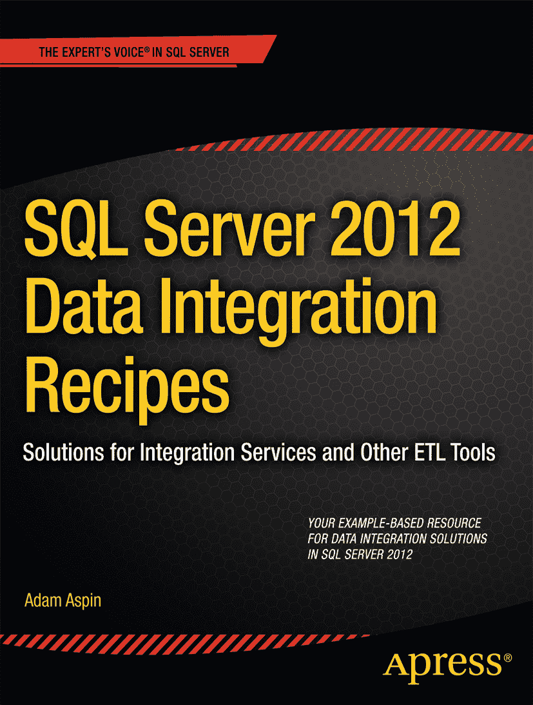

# SQL Server 2012 数据集成方案

作者：Adam Aspin

版权所有 © 2012 Adam Aspin

保留所有权利。未经版权所有者和出版商的书面许可，不得以任何形式或任何方式（包括影印、录制）复制或传播本作品的任何部分，也不得通过任何信息存储或检索系统进行传播。

ISBN-13 (平装): 978-1-4302-4791-3
ISBN-13 (电子): 978-1-4302-4792-0

本书中可能出现商标名称、标识和图像。我们并非在每次使用商标名称、标识或图像时都使用商标符号，而是仅以编辑的方式使用这些名称、标识和图像，旨在为商标所有者带来益处，并无侵犯商标的意图。本书中使用的商品名称、商标、服务标志及类似术语，即使未特别标识，也不应被视为表达意见，判断其是否受专有权保护。

总裁兼出版人：Paul Manning
主编：Jonathan Gennick
技术审校：Ben Eaton, Robin Dewson, Jason Brimhall
编辑委员会：Steve Anglin, Mark Beckner, Ewan Buckingham, Gary Cornell, Morgan Ertel, Jonathan Gennick, Jonathan Hassell, Robert Hutchinson, Michelle Lowman, James Markham, Matthew Moodie, Jeff Olson, Jeffrey Pepper, Douglas Pundick, Ben Renow-Clarke, Dominic Shakeshaft, Gwenan Spearing, Matt Wade, Tom Welsh
协调编辑：Brigid Duffy
文字编辑：Kimberly Burton
排版：SPi Global
索引：SPi Global
封面设计：Anna Ishchenko

本书由 Springer Science+Business Media, LLC. 向全球图书贸易发行，地址：233 Spring Street, 6th Floor, New York, NY 10013。电话：1-800-SPRINGER，传真：(201) 348-4505，电子邮件：`orders-ny@springer-sbm.com`，或访问 `www.springeronline.com`。

有关翻译信息，请发送电子邮件至 `rights@apress.com`，或访问 `www.apress.com`。

Apress 和 friends of ED 的书籍可批量购买用于学术、企业或推广用途。大部分书目也提供电子书版本和许可。更多信息，请参考我们的批量销售-电子书许可网页：`http://www.apress.com/bulk-sales`。

本书信息按“原样”提供，不作任何担保。尽管在本书编写过程中已采取一切预防措施，但作者和 Apress 对因本书所含信息直接或间接造成或据称造成的任何损失或损害，不向任何人或实体承担任何责任。

作者在文中引用的任何源代码或其他补充材料，读者均可访问 `www.apress.com` 获取。有关如何定位您书籍源代码的详细信息，请访问 `www.apress.com/source-code`。

*献给 Georges 和 Colette Mallet 的回忆。*
*他们教会我的生活道理，无人能及——无论之前还是之后，他们向我展示了人可以多么美好。*

## 目录概览

关于作者
关于技术审校
致谢
前言
 第 1 章：从 MS Office 应用程序获取数据
 第 2 章：平面文件数据源
 第 3 章：XML 数据源
 第 4 章：SQL 数据库
 第 5 章：SQL Server 数据源
 第 6 章：其他数据源
 第 7 章：从 SQL Server 导出数据

### 第 8 章：元数据
第 8 章：元数据

### 第 9 章：数据转换
第 9 章：数据转换

### 第 10 章：数据画像
第 10 章：数据画像

### 第 11 章：增量数据管理
第 11 章：增量数据管理

### 第 12 章：变更跟踪与变更数据捕获
第 12 章：变更跟踪与变更数据捕获

### 第 13 章：组织与优化数据加载
第 13 章：组织与优化数据加载

### 第 14 章：ETL 流程加速
第 14 章：ETL 流程加速

### 第 15 章：日志记录与审计
第 15 章：日志记录与审计

### 附录 A：数据类型
附录 A：数据类型

### 附录 B：示例数据库与脚本
附录 B：示例数据库与脚本

### 索引
索引

