# 第 1 章 从 Microsoft Office 获取数据

我怀疑许多工业级的 SQL Server 应用程序，最初都是从一个更小的、基于 Microsoft Office 的想法开始的，然后不断增长和扩展，最终成为一个强大的 SQL Server 应用程序。无论如何，两个 Microsoft Office 程序——Excel 和 Access——是最常用于最终加载到 SQL Server 的数据源。这其中的原因很多，从它们无处不在的特性，到用户可以轻松地将数据输入到 Access 数据库和 Excel 电子表格中。因此，难怪我们开发人员和 DBA 花费大量时间将这些来源的数据加载到 SQL Server 中。

有多种方法可以将数据从 MS Office 来源推送或拉取到 SQL Server 中。这些方法包括：

*   使用 T-SQL（`OPENDATASOURCE` 和 `OPENROWSET`）
*   链接服务器（是的，Access 数据库甚至 Excel 电子表格都可以成为链接服务器）
*   SSIS
*   SQL Server 导入向导
*   用于 Access 的 SQL Server 迁移助手

本章将探讨所有这些技术，并尝试为你提供关于其最佳用法（以及不可避免的限制）的一些指导。

本章使用的所有示例文件都位于 `C:\SQL2012DIRecipes\CH01` 目录中——假设你已经从本书的配套网站下载了示例并按照附录 B 中的描述进行了安装。

## 1-1. 确保连接到 Access 和 Excel

### 问题

你希望能够在 32 位和 64 位环境中导入所有版本的 Excel 和 Access 数据（包括最新的文件格式）。

### 解决方案

你需要安装 Microsoft Access 可连接性引擎 (ACE) 驱动程序。请按照以下步骤操作：

1.  在相应的网页上单击“下载”。这将把可执行文件下载到你选择的目录。

 **注意** ACE 驱动程序可以在 `www.microsoft.com/en-us/download/details.aspx?id=13255` 找到。这个地址可能会随时间变化——但快速的互联网搜索应该能让你很快找到当前的来源。

2.  双击你下载的 `AccessDatabaseEngine.exe` 文件。对于 64 位版本，文件名将是 `AccessDatabaseEngine_x64.exe`。
3.  按照说明进行操作。
4.  在 SSMS 中，展开“服务器对象”  “链接服务器”  “提供程序”。
5.  假设驱动程序安装成功，你应该会看到 `Microsoft.ACE.OLEDB.12.0` 提供程序。
6.  双击该提供程序并勾选“允许进程内”和“动态参数”。

作为步骤 4-6 的替代方案，如果你更喜欢命令行方法，可以运行以下 T-SQL 代码段（位于本书示例的 `C:\SQL2012DIRecipes\CH01\SetACEProperties.Sql` 文件中）：

```sql
EXECUTE master.dbo.sp_MSset_oledb_prop N'Microsoft.ACE.OLEDB.12.0' , N'AllowInProcess' , 1;
GO
EXECUTE master.dbo.sp_MSset_oledb_prop N'Microsoft.ACE.OLEDB.12.0' , N'DynamicParameters' , 1;
GO
```

现在，驱动程序已安装并准备就绪。

### 工作原理

在尝试从 Excel 或 Access 读取数据之前，确保服务器上安装了允许读取这些文件的驱动程序至关重要。目前，SQL Server 安装只会附带“旧的”32 位 Jet 驱动程序，而该驱动程序有严重的限制。主要问题在于它无法读取最新版本的 Access 和 Excel，并且无法在 64 位环境中运行。

使用最新的 ACE 驱动程序通常会让你的工作更轻松，因为最新版本具有旧版本的所有功能，并增加了额外的功能。尽管被称为“AccessDatabaseEngine”，但该驱动程序也可以读取和写入 Excel 文件以及文本文件。

令人困惑的是，在 SSMS 的链接服务器提供程序列表中，“2007 Office System Driver”和“Microsoft Access Engine 2010 可再发行组件包”都被显示为“Microsoft.ACE.OLEDB.12.0”。64 位 SQL Server 应用程序可以通过在 64 位 Windows 上使用 32 位 SQL Server Integration Services (SSIS) 来访问 32 位 Jet 和 2007 Office System 文件。

当前可用的 Office 驱动程序版本列于表 1-1。

表 1-1. MS Office 驱动程序

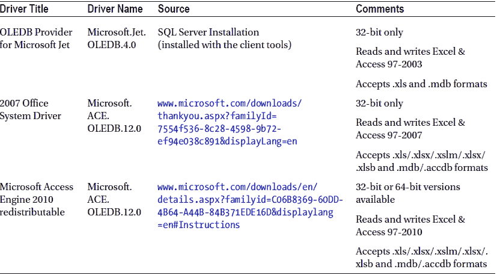

### 提示、技巧和陷阱

*   如果你仍然想使用旧的 32 位 Jet 驱动程序，只要将 Excel 源文件保存为 Excel 97–2003 格式，并且在 32 位环境中工作，你就可以使用它。
*   ACE 驱动程序支持以下系统：Windows 7；Windows Server 2003 R2，32 位 x86；Windows Server 2003 R2，x64 版本；Windows Server 2008 R2；Windows Server 2008 with Service Pack 2；Windows Vista with Service Pack 1；以及 Windows XP with Service Pack 3。
*   在同一台服务器上，你只能安装 64 位版本或 32 位版本的 ACE 驱动程序之一。这意味着如果你安装了 64 位 ACE 驱动程序，就无法在 Business Intelligence development Studio (BIDS) 或 SQL Server Development Tools (SSDT) 中进行开发——因为 BIDS/SSDT 是一个 32 位环境。然而，如果你改为安装 32 位 ACE 驱动程序，那么你就无法运行 64 位包，而必须使用 32 位的替代方案。理想情况下，你应该在安装有 32 位 ACE 驱动程序的 32 位环境中进行开发（或者在 64 位机器上开发，但不要期望能正常运行该包），然后部署到已准备好 64 位驱动程序的 64 位环境中。

## 1-2. 从 Excel 导入数据

### 问题

你希望尽可能快速、简单地从 Excel 电子表格导入数据。

### 解决方案

运行 SQL Server 导入和导出向导，并让它指导你完成导入过程。

以下是需要遵循的步骤：

1.  在 SQL Server Management Studio 中，右键单击一个数据库（最好是你希望导入数据的目标数据库），依次点击“任务”  “导入数据”（参见图 1-1）。

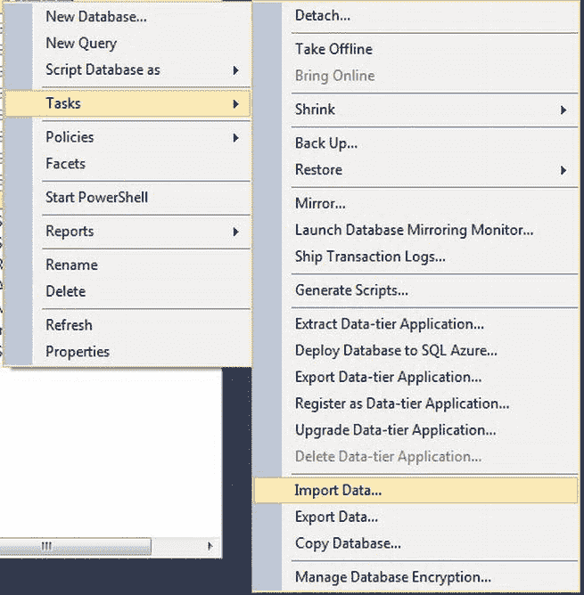

图 1-1.  从 SSMS 启动导入/导出向导

2.  跳过启动画面。“选择数据源”屏幕出现。
3.  选择“Microsoft Excel”作为数据源，并输入或浏览要导入的文件。务必从下拉列表中选择与源文件类型对应的 Excel 版本，并指定你的数据是否包含标题（参见图 1-2）。

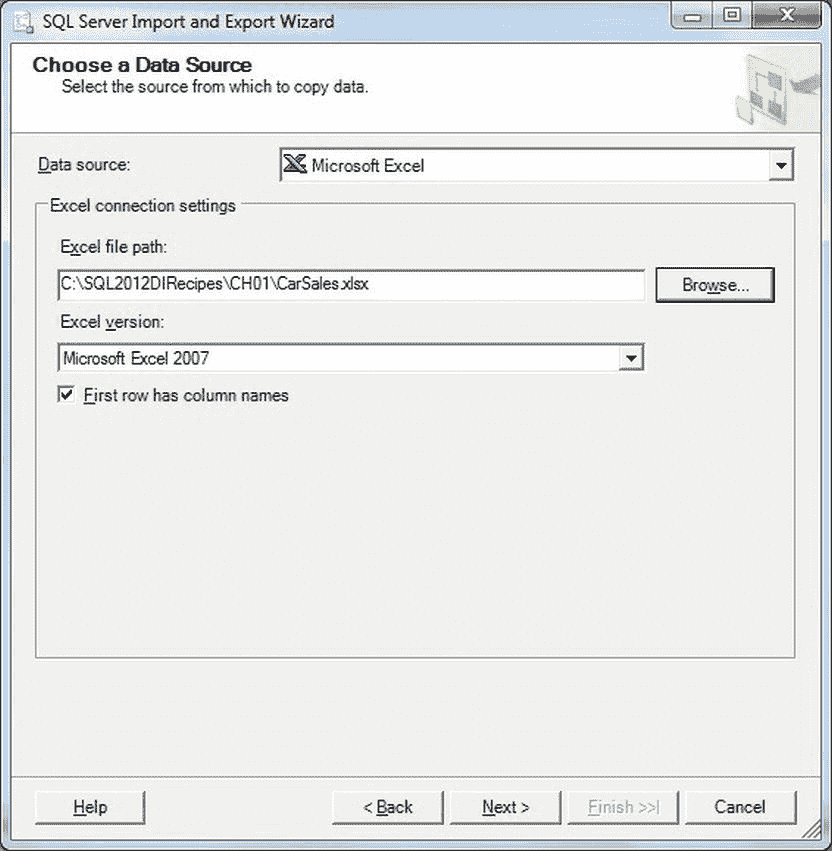

图 1-2.  在导入/导出向导中选择数据源

4.  单击“下一步”。“选择目标”对话框出现（参见图 1-3）。

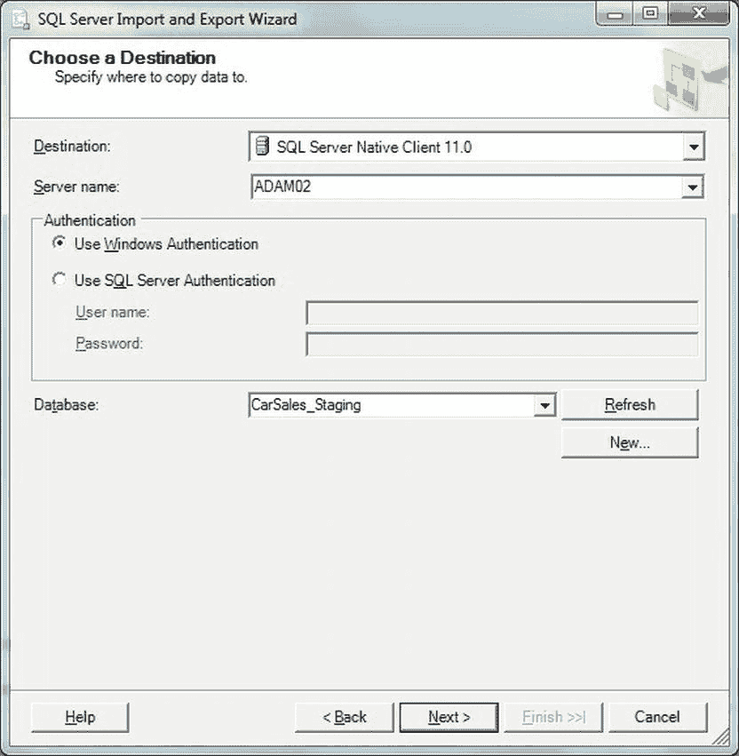

图 1-3.  在导入/导出向导中选择目标

5.  确保目标是“SQL Server Native Client”，服务器名称正确，并且你已选择了正确的目标数据库（本例中是 `CarSales_Staging`）以及你正在使用的身份验证模式（对于 SQL Server 身份验证，需提供相应的用户名和密码）。
6.  单击“下一步”。“指定表复制或查询”对话框出现（参见图 1-4）。

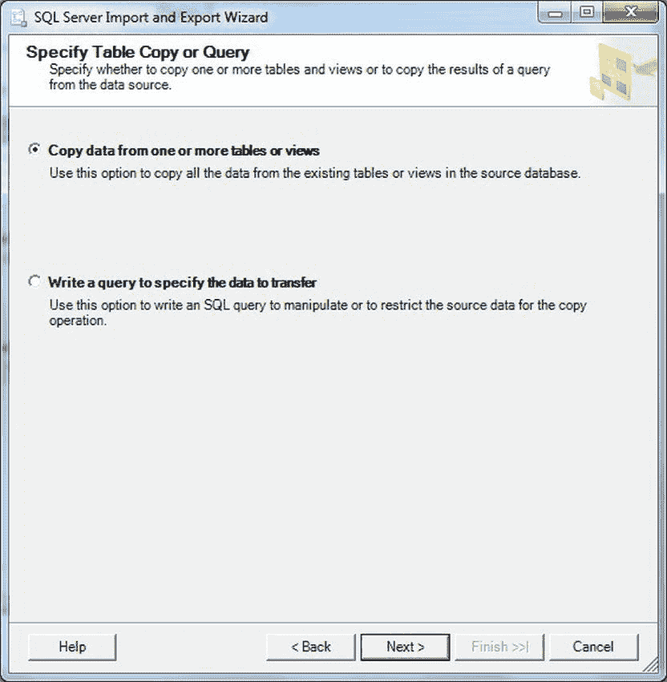

图 1-4.  在导入/导出向导中指定表复制或查询

7.  接受默认选项“从一个或多个表或视图复制数据”。
8.  单击“下一步”。“选择源表或视图”对话框出现（参见图 1-5）。

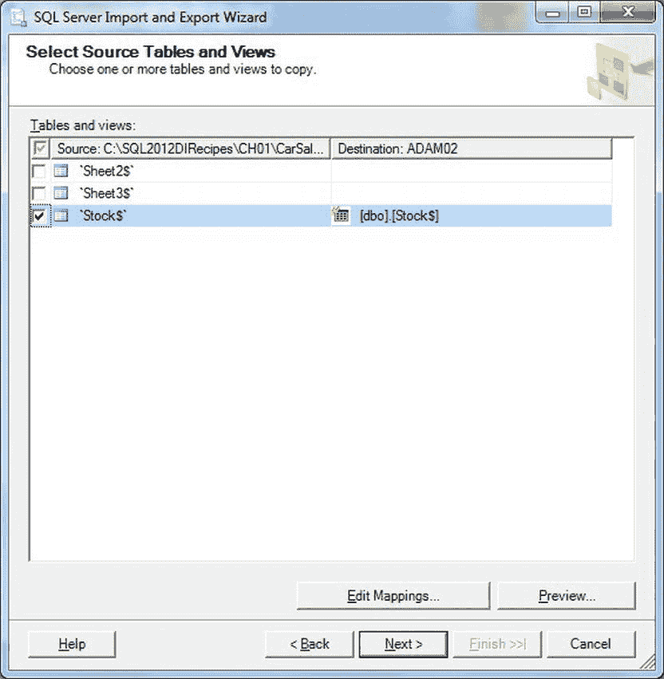


图 1-5. 在导入/导出向导中选择源表

9.  选择要导入的工作表。
10. 单击“下一步”。将显示“保存并运行包”对话框（参见 图 1-6）。

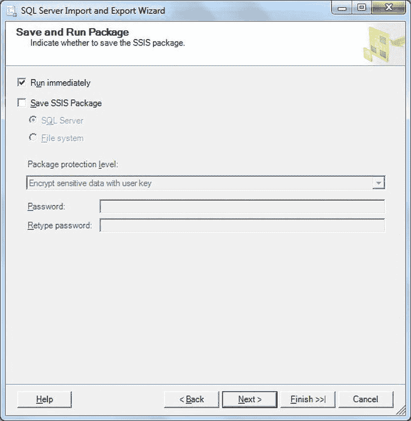

图 1-6. 运行导入/导出向导包

11. 确保选中“立即运行”，且未选中“保存 SSIS 包”。
12. 单击“下一步”。将显示“完成该向导”对话框（参见 图 1-7）。

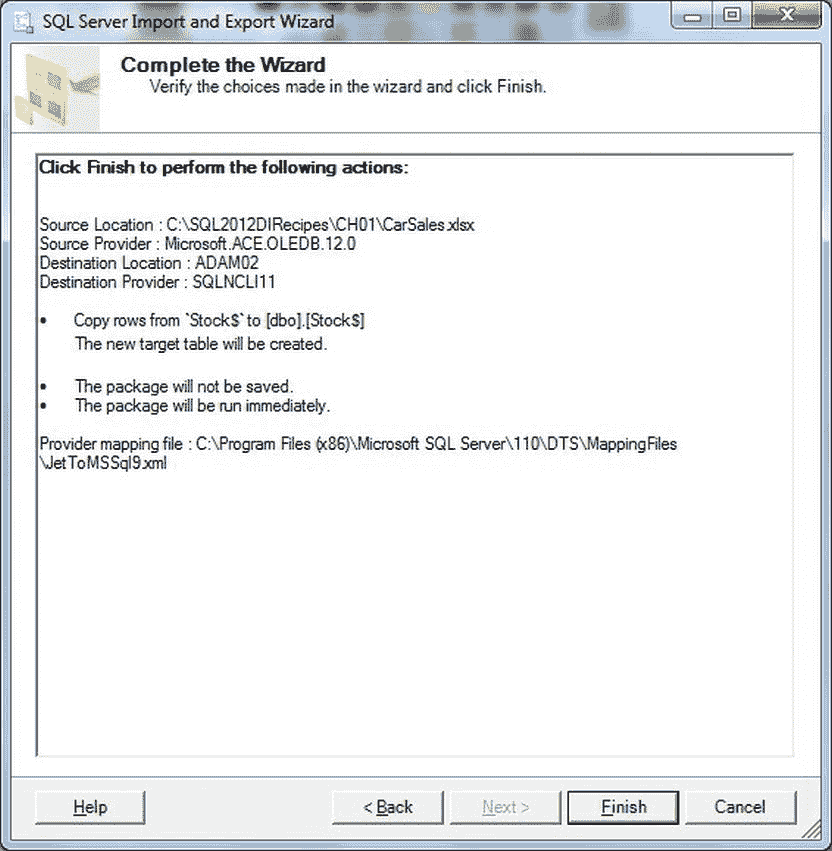

图 1-7. 完成导入/导出向导

13. 单击“完成”。将显示“执行结果”对话框。如果一切顺利，数据已成功加载（参见 图 1-8）。

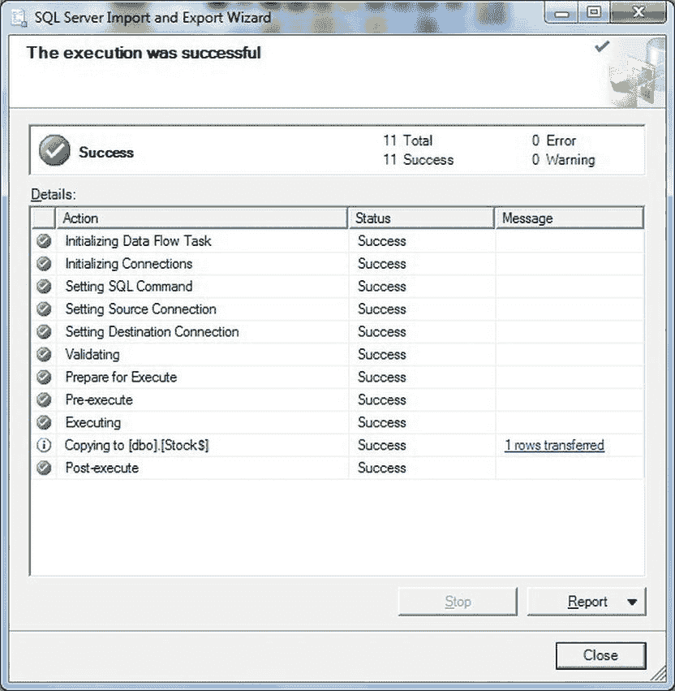

图 1-8. 使用导入/导出向导成功执行

14. 单击“关闭”以结束该过程。

## 工作原理

有时候，你唯一的目的可能就是尽快将大量数据从 Excel 电子表格加载到 SQL Server 表中。我这里所说的“快”，不仅意味着加载时间极短，还指设置加载过程所花费的时间最少，并且作业能顺利完成，无需费力地配置 SSIS 包、定义链接服务器或编写使用 `OPENROWSET` 的 T-SQL 来完成工作。这正是 SQL Server 导入和导出向导（简称 `DtsWizard`）发挥优势的地方。额外的好处是，如果你只是偶尔导入电子表格数据，那么 `DtsWizard` 应用程序提供的逐步指导可能非常有价值。

由于这是本书中第一次解释导入和导出向导，我尽可能解释得完整一些。其优点在于，你会发现这里解释的许多技术同样适用于其他类型的数据源。

在以下情况下，你应该使用 SQL Server 导入和导出向导：

*   当你需要仅将数据从 Excel 电子表格一次性导入 SQL Server 表时。
*   当你不打算定期或频繁执行此操作时。
*   当你很少导入 Excel 数据，不想迷失在 SSIS 和/或很少使用的 SQL 命令的复杂世界中，而只是想快速导入数据时。
*   当你想从同一工作簿中的多个工作表或区域导入数据时。

假设你的 Excel 数据是干净且结构化的（如同数据表一样），那么数据将被成功加载。它可以被传输到在目标数据库中新建的表中（表名与源工作表相同），或者被传输到现有的 SQL Server 表中。你可以在步骤 8 中决定更倾向于这两种方案中的哪一种。

## 提示、技巧和陷阱

*   如果你是在 64 位环境中工作，从 SSMS 运行的导入/导出向导默认是 32 位版本的。要强制运行 64 位版本，请选择“开始”->“所有程序”->“Microsoft SQL Server 2012”->“导入和导出数据（64 位）”。如果需要安装向导的 32 位版本，请在安装过程中选择“客户端工具”或“SQL Server 数据工具 (SSDT)”。
*   如果你计划频繁使用 `DtsWizard.exe`，请将该可执行文件的路径添加到你的系统 PATH 环境变量中——除非它已经被添加。
*   你还可以通过选择“开始”->“运行”，然后输入 `DtsWizard.exe`（通常位于 `C:\Program Files\Microsoft SQL Server\110\DTS\Binn`）来启动 SQL Server 导入和导出向导可执行文件，或者在 Windows 资源管理器窗口（甚至是命令窗口）中双击该可执行文件。

### 1-3. 在加载过程中修改 Excel 数据

**问题**


你需要从一个 Excel 电子表格中导入数据，但在导入过程中需要进行一些基本的修改。这些修改可能包括更改列映射、改变数据类型或选择目标表等操作。

## 解决方案

应用 SQL Server 导入和 Export 向导的一些可用选项。由于我们正在探讨 SQL Server 导入和 Export 向导的各种选项，我将把它们描述为一系列“小技巧”，作为对前一个技巧的扩展。

 `注意` 后续部分中的步骤编号指的是技巧 1-2 中的流程。

### 查询源数据

要筛选源数据，在步骤 6，选择`编写查询以指定要传输的数据`选项。你会看到图 1-9 中的对话框。

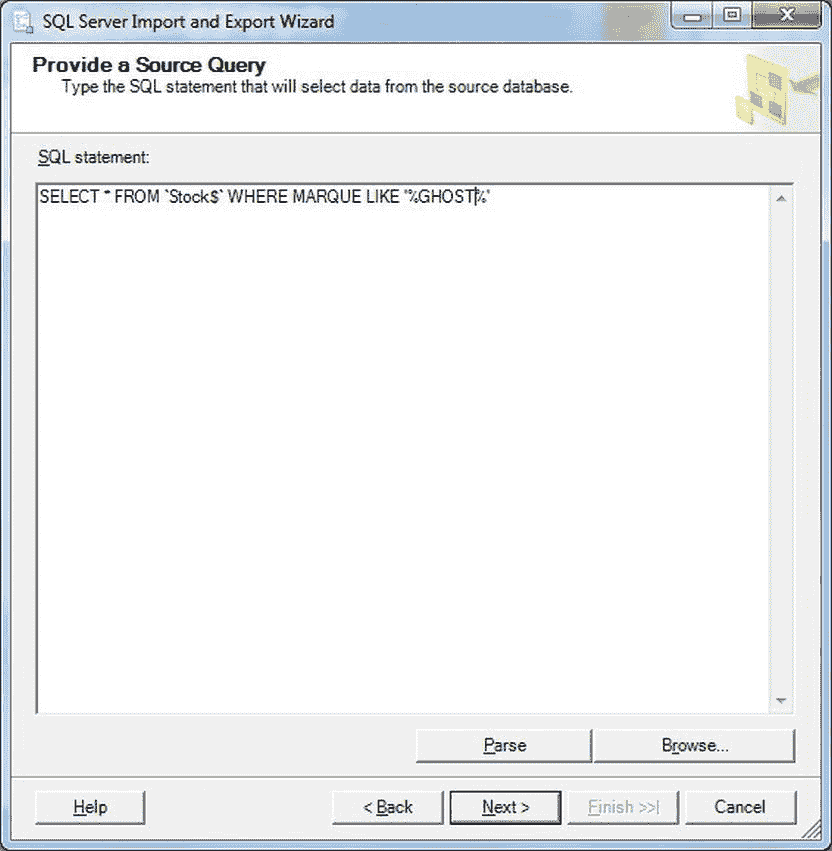

图 1-9. 指定用于选择 Excel 数据的源查询

在这里，你可以输入一个 SQL 查询来选择源数据。如果你有一个保存的 SQL 查询，可以浏览加载它。请注意，你使用的语法与使用`OPENROWSET`时相同，如技巧 1-4 所述。编写查询时，请注意工作表数据源带有`"$"`后缀，但区域则没有。

### 更改目标表名称

在步骤 8，你可以更改目标表的名称，以覆盖默认的工作表或区域名称。

### 替换目标表中的数据

另一个可用的选项是替换目标表中的所有数据。当然，这只会影响已存在的表——如果表不存在，那么无论选择哪个选项，`DTSWiz`都会创建一个表。

为此，在前面的步骤 8，点击`编辑映射`。将出现“列映射”对话框（参见图 1-10）。

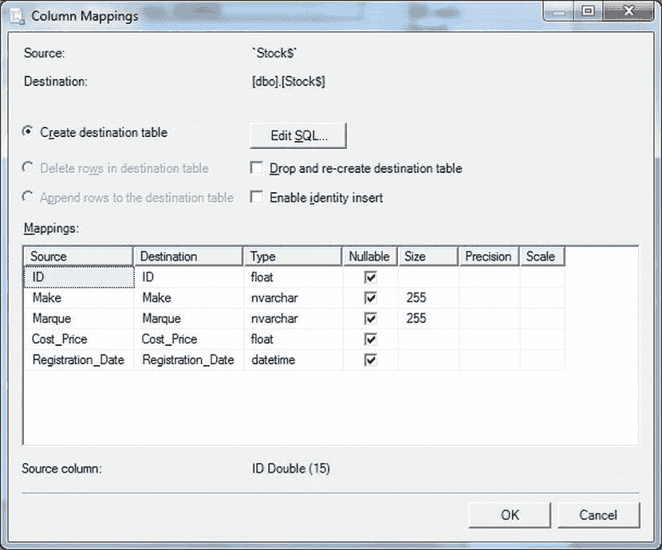

图 1-10. 在导入/导出向导中编辑列映射

选择`删除目标表中的行`会在插入新数据之前截断目标表。此选项仅在文件已存在时才可用。

### 启用标识插入

“列映射”对话框（参见图 1-10）还允许你启用标识插入，并将值插入到 SQL Server 标识列中。只需选中`启用标识插入`复选框。

### 调整列映射

“列映射”对话框还允许你指定哪个源列映射到哪个特定的目标列。只需从弹出列表中选择所需的目标列——或者，如果你不希望导入特定列的数据，则选择`<忽略>`。

### 为新表更改字段类型

你可以在数据类型映射允许的范围内，更改字段类型和长度/大小。更改文本字段的大小可以避免默认的 255 个字符的导入文本字段长度。更改字段类型会在数据加载过程中修改字段类型。

如果你正在创建一个新表，那么新表将使用新定义的字段类型和大小创建。但是请注意，更改数据类型不会更改数据，并且你选择的任何类型或数据长度必须与源数据兼容，否则加载将失败。

### 从导入/导出向导创建 SQL Server Integration Services (SSIS) 包

导入/导出向导一个非常有用的功能是，能够根据你配置导入时设置的参数创建一个功能齐全的`SSIS`包。这或许并不奇怪，因为导入/导出向导本质上是一个`SSIS`包生成器。虽然它生成的包并非完美，但它们是`ETL`创建过程的一个良好且快速的起点。

要生成`SSIS`包，只需在“保存和执行包”对话框（参见步骤 9，图 1-6）中勾选`保存 SSIS 包`框。系统会提示你选择文件位置。点击`完成`时，包即被创建。

## 工作原理

在强调（我希望）`DtsWizard`是一个用于快速、简单数据导入的优秀工具之后，我想通过展示`DtsWizard`在更复杂的导入场景中可以被证明是多么通用的工具，来扩展你的理解。这是因为有广泛的选项和参数可供你微调 Excel 导入。

## 提示、技巧和陷阱

*   如果你使用的是 SQL Server 2005，那么你会在图 1-2 所示的“选择数据源”对话框中发现一些细微差异。
*   在最终对话框（参见图 1-8）的消息列中点击任何消息，对于获取错误信息（如果出现问题）是无价的。

## 1-4. 在临时导入期间指定要加载的 Excel 数据

### 问题

你希望仅通过定义要加载的行或筛选源数据，从 Excel 电子表格中导入特定的数据子集。

### 解决方案

在`SELECT`语句中使用 SQL Server 的`OPENROWSET`命令。这允许你使用标准的`T-SQL`来对源数据进行子集化。例如，你可以运行以下代码片段：

1.  在`CarSales_Staging`数据库中，创建一个名为`LuxuryCars`的目标表，定义如下
    (`C:\SQL2012DIRecipes\CH01\tblLuxuryCars.Sql`):

    ```sql
    CREATE TABLE dbo.LuxuryCars
    (
     InventoryNumber int NULL,
     VehicleType nvarchar(50) NULL
    ) ;
    GO
    ```

2.  启用远程查询，可以通过运行“方面/外围应用配置”工具（或在 SQL Server 2005 中直接运行“外围应用配置”工具），或者运行以下`T-SQL`
    (`C:\SQL2012DIRecipes\CH01\AllowDistributedQueries.Sql`):

    ```sql
    EXECUTE master.dbo.sp_configure 'show advanced options', 1;
    GO
    reconfigure ;
    GO
    EXECUTE master.dbo.sp_configure 'ad hoc distributed queries', 1 ;
    GO
    reconfigure;
    ```

3.  运行以下 SQL 代码段
    (`C:\SQL2012DIRecipes\CH01\OpendatasourceInsertACE.Sql`):

    ```sql
    INSERT INTO CarSales_Staging.dbo.LuxuryCars (InventoryNumber, VehicleType)
    SELECT CAST(ID AS INT) AS InventoryNumber, LEFT(Marque, 50) AS VehicleType
    FROM OPENDATASOURCE(
    'Microsoft.ACE.OLEDB.12.0',
    'Data Source = C:\SQL2012DIRecipes\CH01\CarSales.xls;Extended Properties = Excel 12.0')...Stock$
    WHERE MAKE LIKE '%royce%'
    ORDER BY Marque;
    ```

## 工作原理

有时候，你只需要快速访问 Excel 工作表中的数据。这可能是因为你需要使用 Excel 作为数据源执行快速的`SELECT...INTO`或`INSERT INTO...SELECT`操作。在这种情况下，启动`SSIS`——甚至运行导入向导（参见技巧 1-2）来加载数据，可能显得小题大做。这就是在`SELECT`语句中明智地应用 SQL Server 的`OPENDATASOURCE`和`OPENROWSET`命令可以极其有用的地方。

事实上，正如你将看到的，一旦你知道如何连接到源文件，甚至相当复杂的`T-SQL` `SELECT`语句都可以用于 Excel 源数据。并且，由于你编写的是标准 SQL 命令，它们可以从查询窗口运行，也可以作为存储过程的一部分运行。这在以下情况下特别有用：

*   你想要读取 Excel 工作表的内容，但不想用额外的信息表来 clutter up 你的数据库。
*   数据不常被读取。
*   你知道文件（工作簿）和工作表的名称，并且对数据结构有很好的了解——换句话说，你可以打开文件来读取它。
*   当你想执行临时查询，并使用标准 SQL 命令选择列和筛选数据时。


