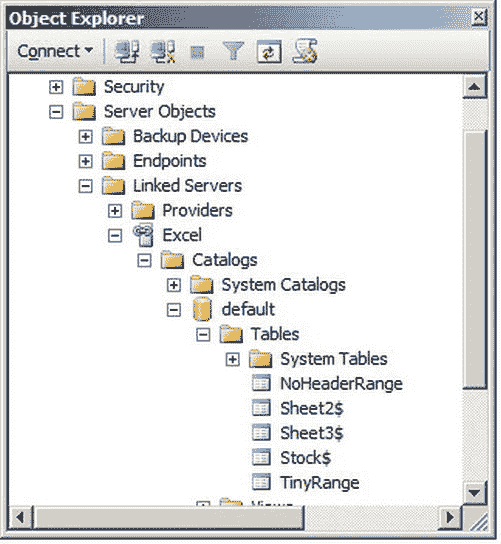

# 从 Excel 导入数据到 SQL Server：基础操作与进阶技巧

## 通用说明与注意事项

在实际应用中，可以使用 Jet 驱动或 ACE 驱动。所描述的技术适用于 Excel 97–2003 (`.xls`) 和 2007–2010 (`.xlsx`) 等格式。此处不包含 `INSERT INTO` 或 `SELECT ... INTO` 的具体代码，但假设在实际场景中你会选择其一。

> **注意**
> 
> 在这种临时场景下，你可能需要以“管理员身份”运行 SQL Server Management Studio (SSMS)。具体操作是：从开始菜单右键单击 SQL Server Management Studio，然后选择“以管理员身份运行”。这是因为运行 SSMS 的用户必须对 SQL Server 启动账户所使用的 TEMP 目录拥有读写权限。

## 使用 OPENROWSET 进行基本查询

### 查询命名范围

假设你有一个命名范围（示例文件中的 `TinyRange`），可以使用如下 T-SQL 返回该范围内的数据：

```sql
SELECT ID, Marque FROM OPENROWSET('Microsoft.Jet.OLEDB.4.0',
   'Excel 8.0;Database = C:\SQL2012DIRecipes\CH01\CarSales.xls', TinyRange);
```

### 处理无表头数据

如果数据范围不包含列头，则需要在 T-SQL 中添加 `HDR = NO` 属性。否则，第一行将被假定为列头。

```sql
SELECT ID, Marque FROM OPENROWSET('Microsoft.Jet.OLEDB.4.0',
   'Excel 8.0;HDR = NO;Database = C:\SQL2012DIRecipes\CH01\CarSales.xls', TinyRange);
```

### 使用单元格范围引用

如果知道要返回数据的 Excel 单元格范围引用，可以使用如下 SQL 片段：

```sql
SELECT ID, Marque FROM OPENROWSET('Microsoft.ACE.OLEDB.12.0',
   'Excel 12.0;Database = C:\SQL2012DIRecipes\CH01\CarSales.xlsx',
 'SELECT * FROM [Stock$A2:B3]');
```

必须同时提供工作表名和范围，因为不假定默认工作表。同样，如果范围不包含列头，请记得添加 `HDR = NO`。

### 高级查询功能

通过 OLEDB 驱动器向 Excel 传递完整的 `SELECT` 语句，可以实现更多功能。

**选择指定列：**

```sql
SELECT ID, Marque FROM OPENROWSET('Microsoft.ACE.OLEDB.12.0',
   'Excel 12.0;Database = C:\SQL2012DIRecipes\CH01\CarSales.xlsx',
 'SELECT ID, Marque FROM [Stock$A1:C3]');
```

**为返回的列指定别名：**

```sql
SELECT InventoryNumber,VehicleType FROM OPENROWSET('Microsoft.ACE.OLEDB.12.0',
   'Excel 12.0;Database = C:\SQL2012DIRecipes\CH01\CarSales.xlsx',
 'SELECT ID AS InventoryNumber, Marque AS VehicleType FROM [Stock$A2:C3]');
```

**对返回的数据进行排序：**

```sql
SELECT ID, Marque FROM OPENROWSET('Microsoft.ACE.OLEDB.12.0',
   'Excel 12.0;Database = C:\SQL2012DIRecipes\CH01\CarSales.xlsx',
 'SELECT ID, Marque FROM [Stock$A2:C3] ORDER BY Marque');
```

**添加 WHERE 子句：**

```sql
SELECT InventoryNumber,VehicleType FROM OPENROWSET('Microsoft.ACE.OLEDB.12.0',
   'Excel 12.0;Database = C:\SQL2012DIRecipes\CH01\CarSales.xlsx',
 'SELECT ID AS InventoryNumber, Marque AS VehicleType
FROM Stock$ WHERE MAKE LIKE ''%royce%'' ORDER BY Marque');
```

> **注意**：要使此类排序生效，需要在提供程序选项中勾选“支持 'Like' 运算符”。同时请注意，如果使用 `LIKE` 运算符，需要重复单引号。

### 为无表头数据添加别名

对于没有数据头的源文件，只需在语法中添加 `HDR = NO;`。在这种情况下，最好使用列别名来提高输出数据的可读性，否则 OLEDB 提供程序只会将列重命名为 F1、F2 等。

```sql
SELECT InventoryNumber,VehicleType FROM OPENROWSET('Microsoft.ACE.OLEDB.12.0',
   'Excel 12.0;HDR = NO;Database = C:\SQL2012DIRecipes\CH01\CarSales.xlsx',
'SELECT F1 AS InventoryNumber, F2 AS VehicleType FROM [Stock$A2:C3] WHERE MAKE LIKE ''%royce%'' ORDER BY Marque');
```

## 扩展属性详解

导入 Excel 数据时，`HDR` 不是唯一需要了解的属性。下表描述了相关选项。理解 `IMEX`（混合数据类型）属性在某些情况下也很有用。

**Jet 和 ACE 扩展属性**

| 属性名 | 描述 | 示例 |
| :--- | :--- | :--- |
| `HDR` | 指定返回的第一行是否包含标题。 | `HDR = NO` |
| `IMEX` | 允许导入单个列中的混合数据类型。 | `IMEX = 1` |

-   **HDR**：该属性仅向驱动程序指示源数据是否包含标题行。由于（至少使用 Jet 和 ACE 驱动程序时）默认假设有标题行，因此在没有标题时将此属性设置为 `NO`，可以避免将第一条记录显示为列名，以及潜在的数据类型不匹配问题。值得注意的是，无需指定 Excel 文件类型（`.xls/.xlsx/.xslm/.xlsx/.xlsb`），因为 ACE 驱动程序会自动识别文件类型。
-   **IMEX**：该属性稍微复杂一些。它不会强制将列中的数据作为文本导入——它强制使用为此 OLEDB 驱动程序在注册表中定义的混合数据类型。由于该注册表项默认为文本，因此它几乎总是强制将数据作为文本导入。它不会将数据转换为文本。根据驱动程序的不同（即在大多数情况下使用 Jet 驱动程序时），不设置 `IMEX = 1` 可能导致加载失败，或在包含文本和数字的列中返回 `NULL` 而不是数值。

## 规划未来使用链接服务器

### 问题描述

你只想从 Excel 电子表格导入数据的一个子集，但预计需要重复执行此操作，并最终将其迁移到链接服务器解决方案。你不想在以后重写所有代码。

### 解决方案

在 `SELECT` 语句中使用 SQL Server 的 `OPENDATASOURCE` 命令。例如（`C:\SQL2012DIRecipes\CH01\OpendatasourceSelect.Sql`）：

```sql
SELECT ID AS InventoryNumber, LEFT(Marque,20) AS VehicleType
INTO RollsRoyce
FROM OPENDATASOURCE(
'Microsoft.ACE.OLEDB.12.0',
'Data Source = C:\SQL2012DIRecipes\CH01\CarSales.xls;Extended Properties = Excel 8.0')...Stock$
WHERE MAKE LIKE '%royce%'
ORDER BY Marque;
```

### 工作原理

`OPENROWSET` 命令适用于临时查询。然而，你可能正在评估数据连接可能性，以期最终使用链接服务器。在这种情况下，你可能更愿意使用 `OPENDATASOURCE` 命令作为通往链接服务器（在下一个配方中描述）的“中间站”。这为你后续将代码中的 `OPENDATASOURCE` 更新为四部分链接服务器引用做好了准备。

不可避免地，这个特定主题（仅从源工作表选择所有数据且仅使用 ACE 驱动程序）有许多变体，以下是其中一些。由于目标是将数据导入 SQL Server，我让你自行选择将此代码包含在 `SELECT..INTO` 或 `INSERT INTO ...SELECT` 子句中。当然，如果你愿意，也可以使用 Jet 驱动程序。如果你使用的是 Excel 2007/2010，必须在 T-SQL 中将扩展属性设置为 Excel 12.0。

**查询整个工作表：**

```sql
SELECT ID, Marque FROM OPENDATASOURCE(
'Microsoft.ACE.OLEDB.12.0',
'Data Source = C:\SQL2012DIRecipes\CH01\CarSales.xlsx;Extended Properties = Excel 12.0')...Stock$;
```

**查询命名范围：**

```sql
SELECT ID, Marque
FROM OPENDATASOURCE(
'Microsoft.ACE.OLEDB.12.0',
'Data Source = C:\SQL2012DIRecipes\CH01\CarSales.xls;Extended Properties = Excel 8.0')... TinyRange;
```


要选择并（如果需要）为 Excel 源数据中的列创建别名，请使用如下所示的 T-SQL。请注意，此操作应用于 T-SQL，而不是直通查询的一部分。

```
SELECT ID AS InventoryNumber, Marque AS VehicleType
FROM OPENDATASOURCE(
'Microsoft.ACE.OLEDB.12.0',
'Data Source = C:\SQL2012DIRecipes\CH01\CarSales.xls;Extended Properties = Excel 8.0')...Stock$;
```

最后，要在返回 Excel 数据时使用 `WHERE` 和 `ORDER BY`，只需像这样扩展 T-SQL：

```
SELECT ID AS InventoryNumber, Marque AS VehicleType
FROM OPENDATASOURCE(
'Microsoft.ACE.OLEDB.12.0',
'Data Source = C:\SQL2012DIRecipes\CH01\CarSales.xls;Extended Properties = Excel 8.0')...Stock$
WHERE MAKE LIKE '%royce%'
ORDER BY Marque;
```

在这种情况下，Excel 文件不能有密码保护。值得注意的是，`OPENDATASOURCE` 仅在为指定提供程序将 `DisallowAdhocAccess` 注册表选项显式设置为 `0`，并且启用了 Ad Hoc Distributed Queries 高级配置选项（如配方 1-3 所述）时才有效。`OPENDATASOURCE` 还要求源数据类似于包含标题行的表，因此请确保任何命名范围都有标题行。

无论使用适用于 Office 2007 还是 Office 2010 的 ACE，都必须将 Excel 版本设置为 `12.0`——而不是下载页面建议的 `14.0`。此外，如果您在连接到 Excel（和 Access）时使用的是 Jet 驱动程序，这些方法在 SQL Server（2005-2012）的 64 位环境中将不起作用，即使 Excel 格式是 97-2003。如果您必须使用在列中存在混合数据类型时会导致问题的驱动程序，那么您可以强制驱动程序扫描更多行（默认为 `8`）——或者扫描整个工作表——来测试混合数据类型。为此，请编辑以下注册表设置：

```
HKEY_LOCAL_MACHINE\Software\Microsoft\Jet\4.0\Engines\Excel\TypeGuessRows
```

将此值设置为 `8` 以外的数字将扫描指定行数。设置为 `0` 则扫描整个工作表。然而，这不可避免地会导致严重的性能损失。

如果您希望更改混合数据类型设置，对于 Office 2010，它位于以下注册表项中：

```
HKEY_LOCAL_MACHINE\Software\Microsoft\Office\14.0\Access Connectivity Engine\Engines\Excel\ImportMixedTypes
```

更改注册表设置通常需要注意：先备份您的注册表，并且要非常小心！

## 提示、技巧和陷阱

*   类似于以下内容的错误消息："Msg 7314, Level 16, State 1, Line 2 链接服务器 '(null)' 的 OLE DB 提供程序 'Microsoft.Jet.OLEDB.4.0' 不包含表 'Sheet1$'。"该表不存在，或者当前用户没有对该文件或文件夹的权限。这也可能意味着您没有指定正确的文件和/或路径。
*   类似于以下内容的错误消息："Msg 7399, Level 16, State 1, Line 4 链接服务器 '(null)' 的 OLE DB 提供程序 'Microsoft.Jet.OLEDB.4.0' 报告了错误。提供程序未提供有关错误的任何信息。Msg 7303, Level 16, State 1, Line 4 无法为链接服务器 '(null)' 初始化 OLE DB 提供程序 'Microsoft.Jet.OLEDB.4.0' 的数据源对象。" 这很可能意味着 Excel 工作簿文件已打开，因此 SQL Server 无法打开它。您只需关闭该 Excel 工作簿即可。或者，可能存在权限问题——您是否以管理员身份运行 SSMS？
*   Excel 文件不能有密码保护。
*   如果您只返回一个 `NULL` 值（列标题为 `F1`），那么您可能没有指定正确的工作表名称。
*   您不能在即席查询中使用 UNC 路径。
*   有关 Jet 所用文件夹的权限，请参见 `http://support.microsoft.com/kb/296711/EN-US`

## 1-6. 自动从 Excel 工作表读取数据

### 问题

您需要能够直接查询或导入 Excel 电子表格中的数据，而无需每次（重新）加载数据。

### 解决方案

将 Excel 电子表格配置为链接服务器。操作方法如下：

1.  使用以下代码片段定义链接服务器 (`C:\SQL2012DIRecipes\CH01\AddExcelLinkedServer.Sql`)：

```
EXECUTE master.dbo.sp_addlinkedserver
@SERVER = 'Excel'
,@SRVPRODUCT = 'ACE 12.0'
,@PROVIDER = 'Microsoft.ACE.OLEDB.12.0'
,@DATASRC = 'C:\SQL2012DIRecipes\CH01\CarSales.xlsx'
,@PROVSTR = 'Excel 12.0';
```

2.  查询源数据，仅在四部分名称中使用链接服务器名称和工作表（或范围）名称，使用如下 T-SQL 片段 (`C:\SQL2012DIRecipes\CH01\SelectEXcelLinkedServer.Sql`)：

```
SELECT ID, Marque
INTO XLLinkedLoad
FROM Excel...Stock$;
```

### 工作原理

在某些情况下，Excel 工作表中的数据被用作准永久性数据源，但您不想导入数据，而是倾向于将其保留在 Excel 中。为此，您可能需要设置一个指向 Excel 电子表格的链接服务器。这种方法的好处在于，用于查询数据的语法是任何链接服务器使用的标准四部分名称法 (`Server.Database.Schema.Table`)，并且所有配置信息都在链接服务器本身定义一次，而不是像 `OPENROWSET` 和 `OPENDATASOURCE` 那样在每次使用查询时都定义。这在以下情况下特别有用：

*   当您需要定期从 Excel 电子表格返回数据时。
*   当您认为电子表格数据足够可信，可以作为应用程序的可靠来源时。

这种方法的风险与您在处理所有电子表格数据时面临的风险相同——由于人为错误将错误数据输入到错误的单元格中，数据常常不连贯、错误或完全错误。因为没有自动化流程可以消除此类错误，所以也没有流程可以缓解此问题。如果 Excel 文件可以被信任为足够准确，那么这种技术可以成为一种让 SQL Server 读取 Excel 数据的好方法，而无需在文件每次修改后都重新加载，因为只需将 Excel 工作簿放入所需目录即可。此外，在处理 Excel 链接服务器时，您可能会发现一些有用的技巧。

在使用链接服务器之前，您可以使用以下系统存储过程测试服务器是否工作：

```
EXECUTE master.dbo.sp_testlinkedserver Excel2
```

如果一切正常，这将返回“命令成功完成”——如果有问题，则返回错误消息。不幸的是，错误消息可能有些晦涩难懂，因此在破译它们时需要耐心。

要更改到 Excel 链接服务器的连接，在大多数情况下，您最好删除旧的链接服务器并重新创建。以下是删除链接服务器的代码：

```
IF EXISTS (SELECT name FROM sys.servers
WHERE server_id != 0 AND name = 'Excel')
EXECUTE master.dbo.sp_dropserver @server = 'Excel';
```

要列出 Excel 链接服务器的可用工作表和命名范围，请使用以下系统存储过程：

```
EXECUTE master.dbo.sp_tables_ex EXCEL;
```

对于更直观地表示通过链接服务器可用的数据范围，您可以使用 SQL Server Management Studio。您只需展开 Server Objects > Linked Servers > (Server Name) > Catalogs > Default > Tables，如图 1-11 所示。



图 1-11. Excel 链接服务器表

要将数据加载到目标表中，您可以使用 `INSERT INTO...SELECT` 和 `SELECT...INTO`——正如您对标准 T-SQL 所预期的那样。


