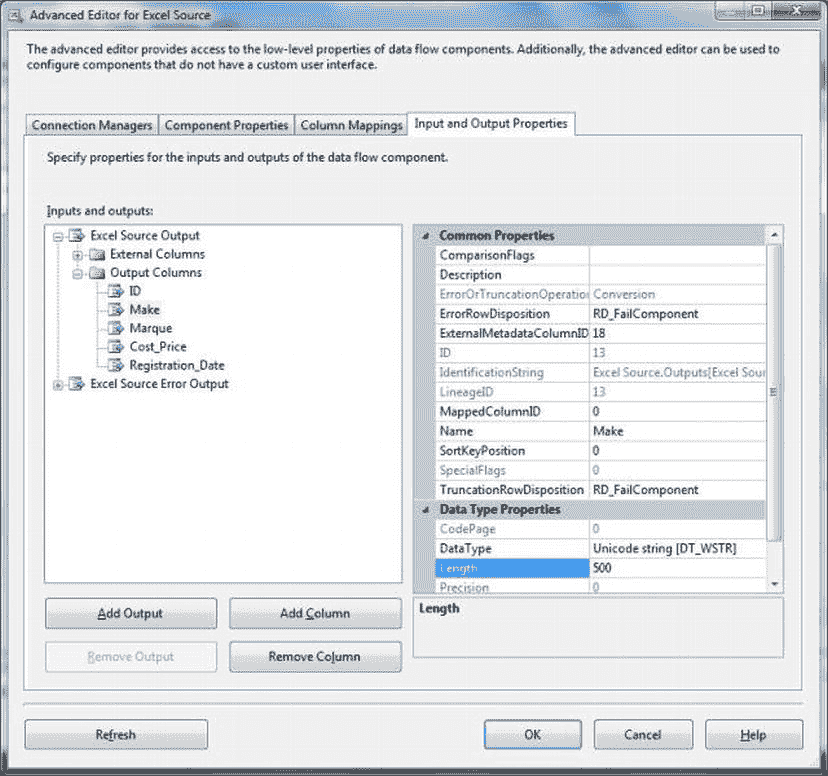
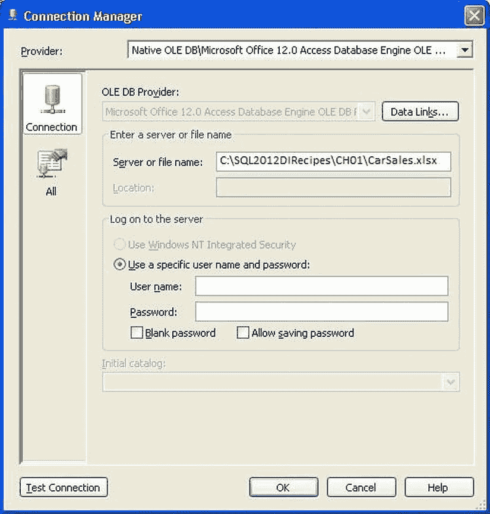
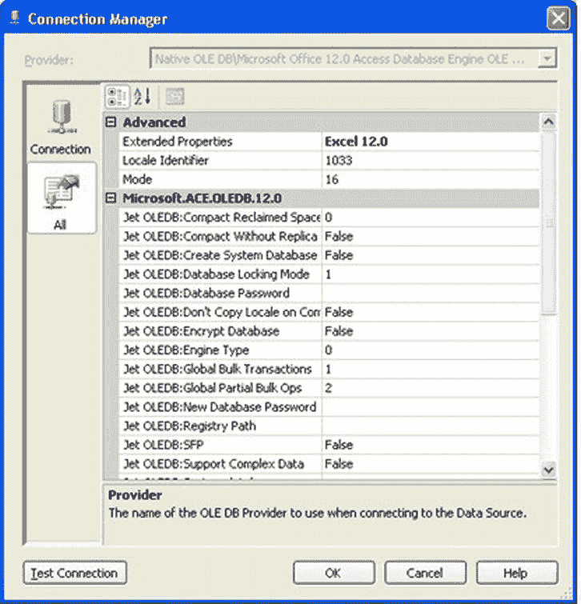
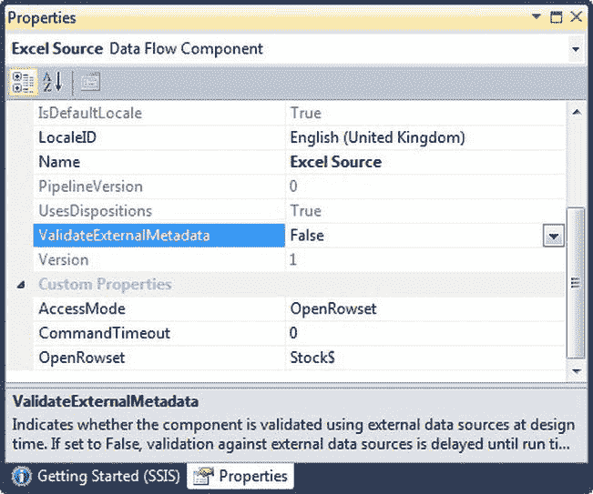

# 1-8. 使用 SSIS 2005 导入 Excel 2007/2010 数据

## 问题

您想要从 Excel 2007 或 2010 工作簿导入 Excel 数据，而 SQL Server 2005 无法原生读取这种格式。

## 解决方案

使用`ACE`驱动程序并调整连接管理器的`扩展属性`以允许它读取更新的格式。

使用 SSIS 2005 导入 Excel 2007 工作表的过程与配方 1-7 中描述的过程非常相似。然而，您需要注意几个需要调整的地方才能使其正常工作。具体如下：


## 1-9. 使用 SSIS 导入 Excel 工作表时处理源数据问题

### 问题

您 Excel 文件中的数据由于截断错误而加载失败，或者由于数据类型错误而无法映射到目标列。

### 解决方案

调整标准的 SSIS Excel 源属性，以处理棘手的源数据问题。以下是一些您可以使用的技术：

1.  在 SSIS 的数据流窗格中，右键单击 Excel 源任务，选择“显示高级编辑器”。
2.  选择“输入和输出参数”选项卡，并展开“输出列”。然后单击您希望更改其列长度的列。如 图 1-19 所示。



图 1-19。修改 Excel 中的数据源类型

3.  选择 `Unicode String [DT_WSTR]` 并输入一个长度（本例中为 `500`）。当然，这些列将是您源数据中的列。
4.  点击“确定”确认。
5.  在数据流窗格中添加一个“数据转换”任务，并将 Excel 源任务连接到它。然后双击“数据转换”任务进行编辑。
6.  选择您在步骤 3 中修改的输出列，并指定输出数据类型为 `String [DT_STR]`，并设置所需的长度。

### 工作原理

当 Excel 工作表结构简单时，您可能不需要对 SSIS 导入包做太多调整。然而，有时您可能需要“强制”SSIS 正确导入源数据。具体来说，您偶尔可能需要指定从 Excel 导入的某一列中数据的长度。这是因为 Excel 单元格可容纳数据量旧有的 255 字符限制已被取消已有一段时间。实际上，SSIS 会检测包含超过此字符数量的单元格（如果它们位于使用 `TypeGuessRows` 注册表设置指定的前“n”行中）。

在某些情况下，您必须调整一些标准设置以便：

*   通过在 Excel 源的“输入和输出”属性中选择 `Unicode Text Stream [DT_NTEXT]` 来指定超过 255 个字符的文本，从而导入超过 255 个字符的文本。
*   指定不同的源数据类型。
*   使用“数据转换”任务将 Excel Unicode 数据转换为非 Unicode 文本数据。

如果您愿意，可以覆盖 Excel 对源数据类型的选择以强制进行数据类型转换。可用的转换显示在 表 1-3 中。

表 1-3。Excel 到 SSIS 数据类型映射

| Excel 数据类型 | SSIS 类型名称 | SSIS 数据类型 |
| --- | --- | --- |
| 日期： | Date | `[DT_DATE]` |
| 短文本： | Unicode String | `[DT_WSTR]` |
| 数字： | Double precision float | `[DTR8]` |
| 长文本： | Unicode Text Stream | `[DT_NTEXT]` |

在本方法的步骤 3 中，为您希望更改的字段从“输入和输出属性”选项卡中选择这些数据类型之一。Excel 数据被读取为 Unicode 格式，无论您如何尝试，都无法指定为其他格式（例如，通过更改源数据类型）。因此，您必须使用 SSIS “数据转换”任务将数据从 Unicode 转换为非 Unicode 字符串。您可以按如下方式操作：

1.  在数据流窗格中添加一个“数据转换”任务，并将 Excel 源任务连接到它。然后双击“数据转换”任务进行编辑。
2.  选择您在步骤 3 中修改的输入列，并指定输出数据类型为 `String [DT_STR]`，并设置所需的长度。
3.  点击“确定”确认。

### 提示、技巧和陷阱

*   您需要通过配置错误输出来处理 Unicode 字符转换错误。至少，将“数据转换”设置为忽略错误。
*   无法选择任何其他源类型，尝试这样做会导致各种错误。
*   由于 Excel 源数据（至少由最终用户生成时）可能充满错误，因此最好包含一些错误处理。第 15 章 中对此有介绍。
*   您不能指定 Unicode 字符串而仅仅更改长度参数；SSIS 会恢复为文本流类型。

## 1-10. 将 Access 数据推入 SQL Server

### 问题

您希望直接从 Access 数据库本身，将其中部分或全部表传输到 SQL Server。

### 解决方案

使用“Access 升迁向导”，您可以按以下步骤从 Access 内部运行它：

1.  在 Access 2007/2010/2013 中，激活“数据库工具”功能区，单击“SQL Server”。（在 Access 2000 或 Access XP 中，单击“工具”  “数据库实用工具”  “升迁向导”）。
2.  单击“使用现有数据库”，然后单击“下一步”。
3.  选择一个您已创建的 ODBC 驱动程序，或者此时如配方 6-12 所述配置一个新的，然后单击“确定”。
4.  选择您希望导入的表，使用“>”按钮将它们添加到“导出到 SQL Server”窗格中，然后单击“下一步”。
5.  取消选中所有要升迁的表属性，并在“向表添加时间戳字段”弹出窗口中选择“不，从不”。然后单击“下一步”。
6.  选择“不，不进行应用程序更改”。单击“下一步”，然后单击“完成”。
7.  关闭升级报告。
8.  如果您现在切换到 SSMS，就可以看到升迁过程的结果——然后就可以开始真正的数据库重构工作了！

### 工作原理

1.  对于使用 Excel 2007 或更高版本的临时查询或链接服务器，您必须首先下载 2007/2010 Office System 驱动程序（即本章开头描述的 ACE 驱动程序）。
2.  在步骤 4 中，使用 OLEDB 数据流源，而不是 Excel 源。
3.  将 `Microsoft.ACE.OLEDB.12` 配置为数据源（提供程序：`Microsoft Office 12.0 Access Database Engine`）。“连接管理器”对话框应类似于 图 1-16。



图 1-16。SSIS 2005 中的 Excel 2007/2010 数据源

4.  在左侧窗格中单击“全部”。为“扩展属性”输入 `Excel 12.0`，如 图 1-17 所示。



图 1-17。在 SSIS 2005 中导入 Excel 2007/2010 的扩展属性

现在您可以运行包并导入电子表格数据。

### 工作原理

您没有使用 SSIS 中的 Excel 数据源，而是选择了 OLEDB 数据源。然后将其配置为使用 ACE 提供程序。

### 提示、技巧和陷阱

*   Excel 2007 不像早期版本那样限制为 65,536 行，因此您可以导入相应更大量的数据。然而，在 BIDS/SSDT 中设计包时，SSIS 验证此数据所花费的时间可能长得令人望而却步——除非您显示 OLEDB 数据流源的属性，然后将 `ValidateExternalMetadata` 设置为 `False`，如 图 1-18 所示。



图 1-18。延迟验证

*   您可以更改 SSIS 用来猜测 Excel 2007 列数据类型的注册表项，使用以下注册表键：

```
HKEY_LOCAL_MACHINE\Software\Microsoft\Office\12.0\Access Connectivity Engine\Engines\Excel\TypeGuessRows.
```

将其设置为 `0` 会强制 SSIS 读取每一列的所有行；否则，您可以将默认值 `8` 更改以在错误猜测数据类型和花费漫长分钟等待 SSIS 完成电子表格解析之间取得平衡。


