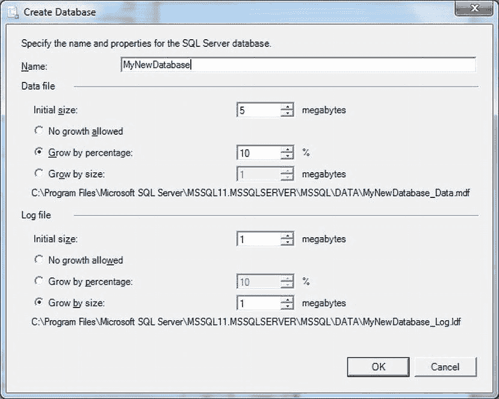

# 导入 Access 数据的注意事项与技巧

## 使用导入向导的技巧

由于使用 SQL Server 导入向导导入 Access 数据的截图与导入 Excel 数据的“配方 1-2”几乎相同，此处不再重复。与导入 Excel 数据类似，您可以指定一系列参数和选项来微调导入过程。总结起来，这些包括：

*   启用标识符插入
*   替换目标表中的数据
*   指定数据类型
*   列映射

不过，这里有一些之前未概述的技术，您可能会觉得有趣：

*   创建新数据库
*   查询源数据

在导入 Access 数据时创建新数据库非常简单，只需在“选择目标”对话框中单击“新建”按钮，然后输入数据库名称即可。如 图 1-20 所示，您可以定义一些数据库属性。



图 1-20。导入 Access 数据时创建新数据库

查询源数据允许您编写 SQL 以从表（或一系列连接的表）中选择数据，并可以使用 `WHERE` 子句筛选源数据（如果您需要的话）。不幸的是，由于导入向导中没有内置查询生成器，您需要完整地编写查询。幸运的是，有一个方便的解决方法：

1.  在第 4 步，选择“编写查询以指定数据传输”。
2.  在源 Access 数据库中，创建一个新的 Access 查询。连接您想要查询的表。添加源列以及任何条件、排序和列别名。
3.  在 Access 2007/2010 的“设计”功能区中，单击“视图/SQL 视图”以显示查询的 SQL。
4.  将 SQL 复制并粘贴到 SQL Server 导入向导的“提供源查询”对话框中。

### 提示、技巧和陷阱

*   “提供源查询”对话框的“解析”按钮会验证您基于 Access 的 SQL。
*   与 Excel 的情况一样，在导入时创建新表，您可以定义列属性。这对于规避默认值（例如所有文本字段的 255 字符规范）很有用。
*   如果您需要指定数据文件名或磁盘位置，最好先手动创建数据库。
*   与升级向导的情况类似，超出 SQL Server 2005 日期数据类型范围的日期可能会导致问题，因此建议在尝试转换之前，使用查询将所有大于上限的日期设置为 9999 年 12 月 31 日，将小于下限的日期设置为 1753 年 1 月 1 日。或者在 SQL Server 2008 及更高版本中使用 `DATETIME2` 数据类型。
*   当源数据中遇到有问题的日期时，另一种旧方法是将 Access 日期数据类型映射到 `VARCHAR(30)` SQL Server 数据类型，然后在 SQL Server 中转换数据。

## 1-12. Access 数据的临时导入

### 问题

您希望使用 T-SQL 导入 Access 数据库。这可能只是偶尔执行。

### 解决方案

使用 `OPENROWSET` 在 T-SQL 中查询 Access 数据库。

以下查询从 Access 数据库的“stock”表中选择所有行（`C:\SQL2012DIRecipes\CH01\AccessACEOpenrowset.Sql`）：

```
SELECT ID, Marque
INTO MyAccessTempTable
FROM OPENROWSET('Microsoft.ACE.OLEDB.12.0',
    'C:\SQL2012DIRecipes\CH01\CarSales.accdb';'admin';'', stock);
```

### 工作原理

这与从 Excel 读取或导入数据非常相似，如“配方 1-4”所述。事实上，它非常相似，以至于针对 Excel 的大多数评论在这里也适用，因此我请您参考该配方以获取完整细节。在这里，我只会提醒您注意一部分要点。

首先，在大多数情况下，最好下载并安装最新的 ACE 驱动程序，因为它可以读取从 Access 97 开始的所有版本。旧的 Jet 驱动程序无法读取 Access 2007/2010，并且 Jet 驱动程序仅作为 32 位版本存在。另请注意以下事项：

*   如果您使用的是 Access 2007/2010/2013，那么首先下载 2007 ACE 驱动程序，如“配方 1-1”所述。
*   必须启用临时查询，如“配方 1-4”所述。

其次，我发现 `OPENROWSET` 最适合以下情况：您不会定期查询数据库，只想从 SQL Server 内部查看数据或执行临时加载，并且您知道要查询的表名。请注意，您向 `OPENROWSET` 命令发送了 表 1-4 中描述的五个参数。

第三点——您可能需要以管理员身份运行 SSMS。

表 1-4。 OPENROWSET 参数

| 参数 | 示例 | 注释 |
| --- | --- | --- |
| 驱动程序 | `'Microsoft.ACE.OLEDB.12.0'` | 可以使用 Jet 驱动程序。 |
| 源路径和数据库 | `'C:\SQL2012DIRecipes\CH01\CarSales.accdb'` | 您需要完整路径。 |
| 用户 | `'admin'` | Access 数据库用户。 |
| 密码 | `''` | 如果没有密码，则使用空字符串。 |
| 表、查询（视图）或传递查询 | stock | 可以是单个 Access 表或保存的查询，或者是 Access SQL 字符串。 |

同样值得注意的是使用分号分隔组成 Access 数据库参数的三个“子元素”，以及使用逗号将驱动程序和源数据与这些参数分开。

最后，您可以通过多种方式优化查询。在以下代码片段中，我不会添加您无疑会使用的 `INSERT INTO ... SELECT` 或 `SELECT ... INTO` 代码。首先，您可以发送一个 Access 传递查询，如下所示：

```
SELECT ID, Marque
FROM OPENROWSET('Microsoft.ACE.OLEDB.12.0',
    'C:\SQL2012DIRecipes\CH01\CarSales.accdb';'admin';'',     'SELECT ID, Marque FROM stock WHERE ID = 5');
```

或者，如果 `WHERE` 子句稍微复杂一些并且涉及引号，您可以尝试这个：

```
SELECT ID, Marque
FROM OPENROWSET('Microsoft.ACE.OLEDB.12.0',
    'C:\SQL2012DIRecipes\CH01\CarSales.accdb';'admin';'',
    'SELECT ID, Marque FROM stock WHERE MAKE LIKE ''Tr%'' ');
```

您还可以通过调整 SQL Server `SELECT` 语句来有选择地返回数据，方式如下：

```
SELECT MAKE, MARQUE as CarType
FROM OPENROWSET('Microsoft.ACE.OLEDB.12.0',
    'C:\SQL2012DIRecipes\CH01\CarSales.accdb';'admin';'', stock)
WHERE ID = 5;
```

当然，`OPENDATASOURCE` 语法同样有效，并且它允许您为列取别名并应用 `WHERE` 子句（这里为了多样性，使用了 Jet 驱动程序）：

```
SELECT MAKE, MARQUE as CarType FROM OPENDATASOURCE(
'Microsoft.Jet.OLEDB.4.0',
'Data Source = C:\SQL2012DIRecipes\CH01\CarSales.mdb;')...stock
WHERE ID = 5;
```

尽管本配方的标题表明此技术适用于偶尔的数据加载，但没有任何因素阻止您将其用作基于 T-SQL 的常规 ETL 过程的一部分。但是，SSIS 提供了更强大的日志记录和错误捕获能力——以及没有 SSMS 可能遇到的权限问题——这就是为什么在许多情况下它更可取。

### 提示、技巧和陷阱

*   请记住，您在这里编写的是 T-SQL，而不是 Access SQL。因此，例如，您不能在旧版本的 SQL Server 中使用 `IIF` 函数，并且必须在 `WHERE` 子句中使用 `%` 而不是 `*`，以及许多其他特定于 Access 的 SQL 技巧！
*   您可以在传递查询的 `LIKE` 子句中使用双引号 (`""`) 代替双单引号 (`''`)。
*   如果 Access 数据库文件受密码保护，那么您需要将密码添加到 `OPENROWSET` 参数中，例如：

```
    SELECT MAKE, MARQUE as CarType
    FROM OPENDATASOURCE(
    'Microsoft.ACE.OLEDB.12.0',
    'Data Source = C:\SQL2012DIRecipes\CH01\CarSales.accdb;User Id = Admin;Password = MyPassword')...stock;
    ```


*   如果 `OPENDATASOURCE` 和 `OPENROWSET` 使用的是 Jet 驱动程序，那么它们在 SQL Server (2005 和 2008) 的 64 位环境中将无法工作。请记住，较高版本的 Access 和/或 64 位环境需要 ACE 驱动程序。因此，连接参数应为 `'Microsoft.ACE.OLEDB.12.0'`。

*   与 Excel 工作表——或在使用 SQL Server 导入向导时与 Access 文件——不同，当使用 `OPENROWSET` 和 `OPENDATASOURCE` 查询时，Access 文件和表可以是打开状态。
*   在尝试从 Access 文件读取数据之前，压缩并修复它们是一个好主意；损坏的数据可能导致问题，最好避免。
*   如果你使用的是 Access 工作组安全（根据定义，在 Access 97–2003 数据库中），你需要添加：`'Jet OLEDB:System database = C:\Windows\System.mdw'`——或者指向工作组安全文件的路径。

