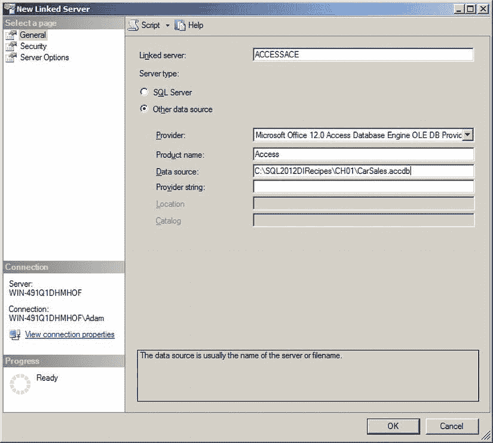
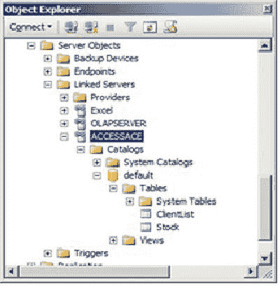
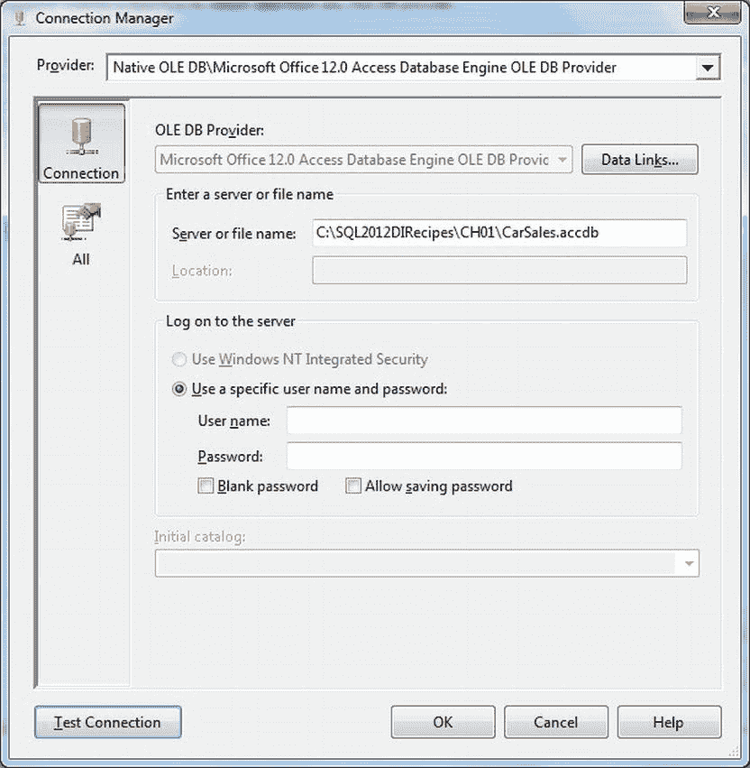
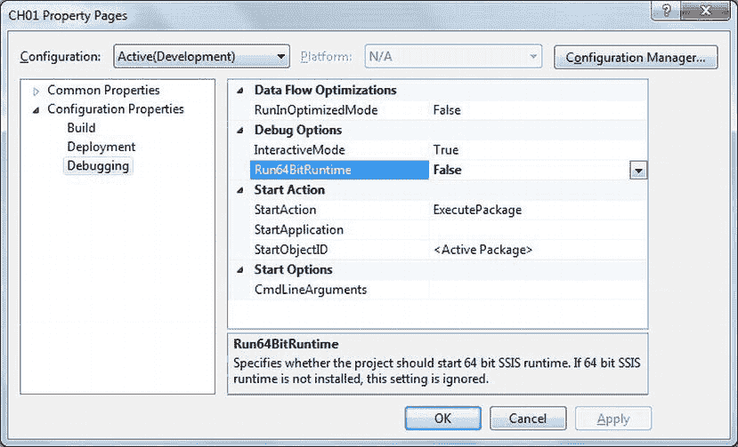
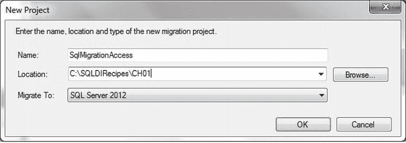
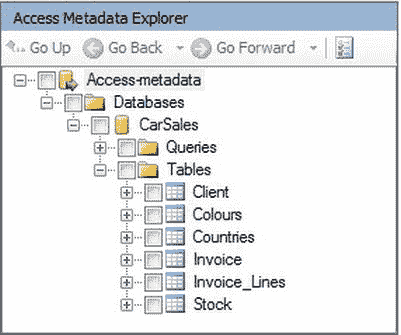
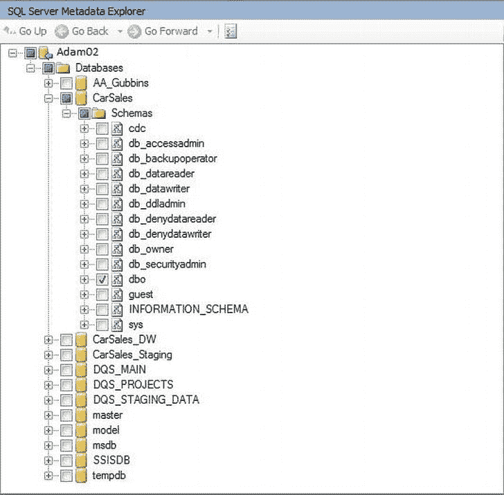
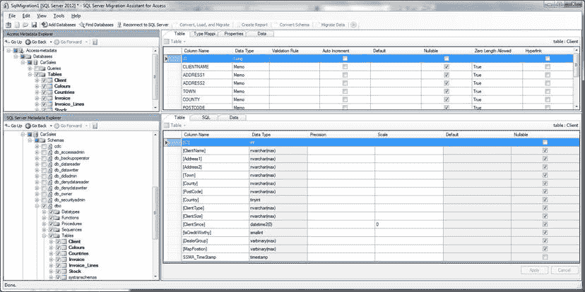

# 1-13. 无需定期导入即可获取 Access 数据

## 问题

你需要定期读取 Access 数据库中的数据，而无需每次都导入数据。

## 解决方案

建立一个指向 Access 的链接服务器。以下是一种方法：

1.  在 SQL Server Management Studio 中，展开“服务器对象”。右键单击“链接服务器”并填写“新建链接服务器”对话框，使用以下参数：

    ```
    链接服务器            AccessACE
    提供程序              Microsoft Office 12.0 Access Database Engine OLEDB Provider
    产品名称              Access
    数据源                C:\SQL2012DIRecipes\CH01\CarSales.accdb
    ```

    该对话框应类似于 图 1-21。

    

    图 1-21. 在 SSMS 中创建 Access 链接服务器

2.  单击“确定”。然后你会在链接服务器列表中看到一个名为 `Access2010` 的链接服务器。当然，你必须在“数据源”字段中输入你自己的 Access 数据文件和路径。
3.  要从链接的 Access 数据库读取数据，请使用以下四部分 T-SQL 语法：

    ```sql
    SELECT ID, Marque from ACCESSACE...Stock WHERE ID IN(1,3) ORDER BY ID;
    ```

## 工作原理

此方法最适合以下情况：

*   当你需要定期查询 Access 数据，但不想将数据加载到 SQL Server 中。
*   当 Access 数据可靠，并且你查询的表中没有数据类型无法正确映射到 SQL Server 数据类型。特别是，超出 SQL 数据范围的日期（尤其是在 SQL Server 2005 中）。

这是标准的 T-SQL，因此列别名和复杂的 `WHERE` 子句——实际上几乎所有 T-SQL——你都可以使用。或者，你可以使用 `OPENQUERY` 语法，如 Excel 部分所述：

```sql
SELECT ID, Marque FROM OPENQUERY(ACCESSACE, 'SELECT * FROM Stock WHERE ID = 1 ORDER BY ID');
```

你可能想做的一件事是查看可用的表和视图。运行以下 T-SQL（其中 `'AccessACE'` 是链接服务器名称）来列出链接服务器中的所有表和查询（视图）：

```sql
EXECUTE master.dbo.sp_tables_ex 'ACCESSACE';
```

或者，如果你在 SSMS 中展开相关的链接服务器对象，你可以显示链接的 Access 数据库中的表，如 图 1-22 所示。



图 1-22. 在 SSMS 中查看 Access 链接服务器

如前面针对 Excel 所述，你可以使用 `SELECT...INTO` 以及 `INSERT INTO...SELECT` 语句来引用链接 Access 服务器中的表。

要链接到 Access 2007/2010/2013 文件，你必须使用 Microsoft Office 12.0 Access Database Engine OLEDB 提供程序。对于 Access 97–2003 数据库，如果必须，你可以使用 Jet 提供程序。如果具有相同名称的链接服务器已存在，则无法添加新的链接服务器。在这种情况下，首先删除现有的链接服务器（右键单击链接服务器名称，从快捷菜单中选择“删除”，然后单击“确定”）。

这里的风险在于，由于链接到的是文件，该对象很容易被移动、重命名或删除；从而使依赖于其数据的任何处理变得无用。如果在任何生产系统中使用此方法，你应该考虑对 Access 文件所在的文件夹应用相关的目录安全。

如果 Access 数据无法转换为 SQL Server 数据类型，则会收到错误。如果你遇到此类问题，请考虑在 Access 中创建使用 IIF 函数为日期（例如）设置高低边界的查询，或为无效数据设置 `N/A` 的函数。然后链接到这些查询，而不是源数据表。


#### 提示、技巧与陷阱
*   在创建链接之前，压缩并修复 Access 文件是一个好习惯——损坏的数据可能会引发问题。
*   你可以使用 T-SQL 极其轻松地创建链接服务器。以下代码片段即可完成此操作 (`C:\SQL2012DIRecipes\CH01\CreateAccessLinkedServer.Sql`):
    ```sql
    EXECUTE master.dbo.sp_addlinkedserver
    @SERVER = 'ACCESSACE'
    ,@SRVPRODUCT = 'ACE 12.0'
    ,@PROVIDER = 'Microsoft.ACE.OLEDB.12.0'
    ,@DATASRC = 'C:\SQL2012DIRecipes\CH01\CarSales.accdb';
    ```
*   如果你已经展开了链接服务器中的表列表（如前所述），你可以像操作 SQL Server 表一样，将这些表拖拽到 SSMS 的查询窗格中。

## 1-14. 在常规 ETL 流程中导入 Access 数据
### 问题
你需要定期将 Access 数据导入 SQL Server，或者将其作为可重复流程的一部分。此外，你还需要在加载过程中转换数据。

### 解决方案
使用 SSIS 导入和转换 Access 数据。可以通过以下方式完成：
1.  如果尚未安装，请安装最新的 ACE 驱动程序。
2.  创建一个新的 SSIS 包。
3.  创建一个名为 `CarSales_OLEDB` 的 OLEDB 目标连接管理器，并将其配置为指向你选择的目标数据库。
4.  向“控制流”窗格添加一个“数据流任务”，然后双击进行编辑。
5.  添加一个 OLEDB 源组件，然后双击进行编辑。
6.  单击“新建”以创建一个新的连接管理器。
7.  单击“新建”以添加一个新的数据连接。
8.  从已安装驱动程序的弹出列表中选择“Microsoft Office 12.0 Access Database Engine OLEDB Provider”。
9.  在“服务器或文件名”字段中输入 Access 文件（.mdb 或 .accdb）的完整路径。
10. 输入用户名和密码（如果有）——或者勾选“空白密码”复选框。对话框应如 图 1-23 所示。

    

    图 1-23. Access 的 SSIS 连接管理器

11. 单击“确定”返回到 OLEDB 源编辑器。
12. 选择“表或视图”作为数据访问模式。
13. 选择要从中导入数据的 Access 表。
14. 单击“确定”返回到“数据流”窗格。
15. 向“数据流”窗格添加一个 OLEDB 目标组件，并将源组件连接到它。双击目标组件进行编辑。
16. 选择你在步骤 2 中创建的名为 `CarSales_OLEDB` 的 OLEDB 连接管理器作为要使用的 OLEDB 连接管理器。
17. 单击“新建”以创建一个新目标表。根据需要更改其名称。
18. 单击对话框左侧的“映射”，确保所有字段都已映射，可以通过将它们从可用源列拖拽到可用目标列，或者右键单击可用源列中的“名称”，然后选择“按名称映射项”。
19. 单击“完成”。

现在，你可以运行导入流程并加载数据了。

### 工作原理
这里我假设你可能正在使用 SSIS 来处理大部分工业级的 ETL 需求。毕竟，开发这个产品正是为了满足此类需求。与其他从 Access 源执行数据导入的方法一样，驱动程序的选择很重要。因此，我只能建议始终使用最新的 ACE 驱动程序，因为它能处理从 '97 版本往上的所有 Access 版本。

ACE 并非唯一的选择，我曾在许多环境中工作，其中 Access 97-2003 是首选的 Access 文件格式，以实现标准化和可移植性。因此，值得学习如何使用 Jet 驱动程序来读取这些文件——即使仅仅是因为它非常简单。

*   本质上，你遵循步骤 1-7，然后选择“Native OLEDB\Microsoft Jet 4.0 OLEDB Provider”。
*   单击“浏览”以选择 Access 源数据库的路径和文件名。
然后继续步骤 10-19。

在 64 位环境中使用 SSIS 和（32 位）Jet 驱动程序时，需要克服几个潜在障碍。如前所述，在 64 位 Windows 操作系统上安装 Integration Services 时，它通常会同时安装 `DTExec.exe` 可执行文件的 32 位和 64 位版本，该文件用于执行 SSIS 包。问题是 SSIS 可能使用了错误的版本——尤其是在使用 BIDS/SSDT 开发和调试 SSIS 包时。这是因为 BIDS/SSDT 是一个 32 位的开发环境，因此如果你的 SSIS 包引用了任何 32 位 DLL 或 32 位驱动程序，那么你必须使用 32 位可执行文件——而 BIDS/SSDT 试图使用 64 位版本。要解决此问题，请执行以下步骤：

1.  单击“项目” > “（你的项目名称）属性”。
2.  从配置属性中选择“调试”。
3.  将 `Run64BitRuntime` 改为 `False`。对话框应类似于 图 1-24。

    

    图 1-24. 在 SSIS 中设置 64 位运行时

一个典型的问题是，一旦我们的包在 64 位服务器上构建、测试和部署后，Access（或 Excel）数据加载在生产环境中失败。此失败伴随着大量错误信息，这些信息并未指明真正的问题所在，即 SSIS（自然）正在运行 64 位的 `DTExec.exe`——它无法使用 32 位的 Jet 驱动程序。

对此有几个典型的解决方案。

1.  将项目中的 Access 数据加载部分分离到一个单独的 SSIS 包中（如果尚未分离）。
2.  从主 SSIS 包调用它，不是使用“执行包任务”，而是使用“执行进程任务”。
3.  在“执行进程任务”中，单击左侧窗格中的“进程”。
4.  单击“可执行文件”并输入（用双引号括起来）32 位 `DTExec` 的路径。
5.  后面跟一个空格，然后是要运行的 SSIS 包的路径。

如果你正在使用具有工作组保护的 Access 97-2003 数据库，并且无法使用未受保护的数据库，那么有几种解决方案。第一种方法如下：

1.  在主方法步骤 10 中定义 Access 连接管理器时，使用工作组登录名/密码作为用户名和密码。
2.  单击对话框左侧的“全部”，然后在 Jet OLEDB:System Database 参数中输入或复制工作组文件的完整路径和文件名。

第二种可能性更像是一种变通方法。你必须将表数据链接、导入或导出到一个新的 Access 数据库，并让 SSIS 指向该数据库。

当然，如果存在现成的目标表，你也可以使用它。同样，你可能更喜欢在配置 OLEDB 目标组件时创建目标连接管理器。在 SQL Server 2012 中，这很可能是一个包级别的连接管理器（具有 .conmgr 扩展名）。

正如你可能看到的，SSIS 使用完整的路径和文件名，后跟用户名来命名源组件。你可能更愿意将其重命名为更易读的名称。如果需要更改源连接管理器的任何方面，只需在下方窗格中双击它，然后编辑连接管理器即可。对于包级别的连接管理器，你必须在解决方案资源管理器窗口的“连接管理器”文件夹中进行编辑。最后，在步骤 10 单击“测试连接”按钮是值得的——哪怕只是为了提前发现连接问题。

#### 提示、技巧与陷阱
*   是的，使用 ACE 驱动程序时，必须复制并粘贴（或更糟的是手动输入）Access 源数据库的路径和文件名，这确实很麻烦。


* 在实际操作中，建议在第 11 步选择 `SQL Command` 作为数据访问模式，并在第 12 步（使用恰当地命名为 `Build Query` 的按钮）输入或构建查询，以仅选择所需的列，过滤掉不需要的记录，为列名设置别名，转换数据类型等。
* 如果你在编写查询来选择源数据，请注意你必须使用 `T-SQL`，而不是 `Access SQL`。
* 如果你需要在数据从源流向目标的过程中进行处理，则第 9 章描述了多种实现此目的的技术。
* `DTExec` 的 32 位版本位于 `C:\Program Files (x86)\Microsoft SQL Server\110\DTS\Binn`（对应于 SQL Server 2012）。将 `110` 替换为 `90` 适用于 SQL Server 2005，替换为 `100` 适用于 SQL Server 2008。
* 从 `SQL Server agent` 调用 32 位可执行文件非常容易；只需在“作业步骤”页面上选中相应复选框，即可在 32 位模式下运行包。

### 1-15. 将复杂的 Access 数据库转换为 SQL Server

**问题**
你有一个复杂的 Access 数据库，无法快速或轻松地导入，并且可能需要进行大量的重新利用和重构。

**解决方案**
使用适用于 Access 的 SQL Server 迁移助手 (`SSMA`)。

1.  安装 `SSMA`（稍后将详细描述）。
2.  从“开始”菜单启动 `SSMA`。
3.  单击“关闭”退出迁移向导。`SSMA` 界面的四个空窗格随即出现。
4.  单击 `File -> New Project`（或工具栏上的相应按钮），输入项目名称，并输入或浏览到一个目录，用于存储项目（以及源和目标对象的所有元数据）。选择目标 `SQL Server` 数据库版本（此操作甚至适用于 `SQL Server Azure`）。对话框如图 1-25 所示。
    
    图 1-25 创建新的 `SSMA` 项目
5.  单击“确定”。
6.  单击 `File -> Add Databases`（或工具栏按钮），然后选择要迁移的 `Access` 数据库。为要添加的每个数据库重复此步骤。数据库将出现在左上窗格 `Access Metadata Explorer` 中。
7.  展开数据库并选择要迁移的表。表结构出现在右上窗格，类似于图 1-26。
    
    图 1-26 `SSMA` 中的源元数据
8.  单击 `File -> Connect to SQL Server`（或工具栏中的按钮），输入要连接的服务器的详细信息，然后单击“确定”。目标服务器上所有可用数据库的列表将出现在左下窗格 `SQL Server Metadata Explorer` 中。
9.  展开目标数据库，并选择目标架构（参见图 1-27）。
    
    图 1-27 `SSMA` 中的目标数据库元数据
10. 在 `Access Metadata Explorer` 窗口中，选择数据库。单击 `Tools -> Convert Schema`（或“转换架构”按钮），让 `SSMA` 创建要转换表的建议架构。建议的架构出现在右下窗格中，并显示输出窗口。屏幕应类似于图 1-28。
    
    图 1-28 `SSMA` 数据转换
11. 在 `Access Metadata Explorer` 窗口中单击任何表名，将显示所选对象的源和目标元数据。注意，对象尚未在 `SQL Server` 中创建。
12. 在 `SQL Server Metadata` 窗口中，选中你希望在 `SQL Server` 中创建的所有表。
13. 在 `SQL Server Metadata` 窗口中，右键单击你已勾选表上方层次结构中的“表”。选择“与数据库同步”，然后如果显示详细信息窗口，单击“确定”。这将在 `SQL Server` 中创建对象。
14. 单击 `Tools -> Migrate Data`（或单击“迁移数据”按钮），将数据从所有源对象传输到目标表中。

**工作原理**
适用于 Access 的 SQL Server 迁移助手 (`SSMA`) 在过去几年中已稳步发展成为一个强大的工具，旨在将 Access 数据库的所有“后端”部分迁移到 `SQL Server`。也就是说，它试图将元数据（表结构）、数据和一些编程代码（但不包括窗体和报表）转换为其在 `SQL Server` 中的对应项。

本方法仅探讨了这个出色的实用程序如何帮助你将数据迁移到 `SQL Server` 并创建必需的附带表定义。`SSMA` 的任何其他用途均超出本书范围。

我并不是说你应该优先选择 `SSMA` 而非 `SSIS` 或其他将数据导入 `SQL Server` 的方法；然而，对于数据迁移，当你专注于必须成功完成的“一次性”单次数据传输时，它具有以下优点：

* 它可以帮助你从一个或多个 `Access` 数据库在 `SQL Server` 中生成详细且定制的数据库结构。
* 它根据 `Access` 数据库，用 `T-SQL` 将你的数据库结构脚本化。
* 它允许你分阶段处理转换项目，在项目演进过程中保存和打开项目，并进行频繁的更改。
* 它有助于实现可靠的转换，并提供详尽的信息和警告消息。
* 它维护来自源和目标数据库的元数据。
* 它可以转换从 97 到 2013 所有格式的 `Access` 数据库——甚至可以并行转换多个数据库格式。

然而，我们必须清楚认识。这不是一个用于定期加载数据的 `ETL` 工具。它期望所有目标表在开始加载前为空，如果目标表包含数据，它会将其截断。

此外，这个实用程序的功能远不止创建表和上传数据。它将 `Access` 查询转换为 `SQL Server` 视图，添加索引和约束等等。然而，由于所有这些都超出了本书的范围，恐怕我不得不留待你自己去探索 `SSMA` 的这些方面。

很容易对 `SSMA` 充满热情，但我必须诚实并承认，即使这道银边也有其乌云。数据迁移速度有些慢。因此，在现实世界中，你可能只会将 `SSMA` 用作元数据定义实用程序，然后使用 `SSIS` 或“数据导入向导”来加载实际数据。

适用于 Access 的 `SSMA` 的系统要求是：

* 至少需要 `Windows XP` 或 `2003`。
* `Microsoft Windows Installer 3.1` 或更高版本。
* `Microsoft .NET Framework 2.0` 或更高版本。
* `ACE OLEDB` 驱动程序。
* 用于迁移到 `SQL Azure` 的 `Microsoft SQL Server Native Client (SNAC)` 版本 10.5 及以上。很多人将其作为 `SQL Server` 安装的一部分安装。否则，你可以通过你喜欢的搜索引擎找到其最新链接，或在 `Microsoft SQL Server` 安装介质上找到 `sqlncli.msi` 文件。
* 能够访问托管目标 `SQL Server` 实例的计算机。
* `1 GB` 内存（最低）。
* 合理的磁盘空间来存储有关源和目标数据库的元数据。

我建议你始终下载并安装最新版本的 `SSMA`，因为它持续发展，并且（目前）最新版本可以打开用早期版本创建的迁移项目。最新版本（5。


