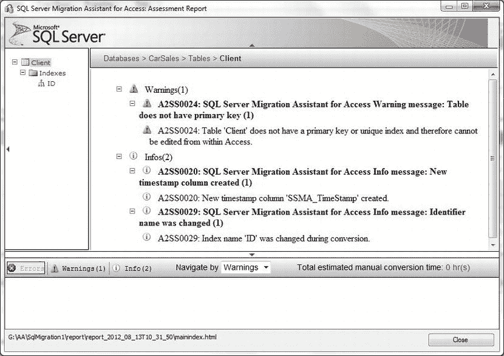
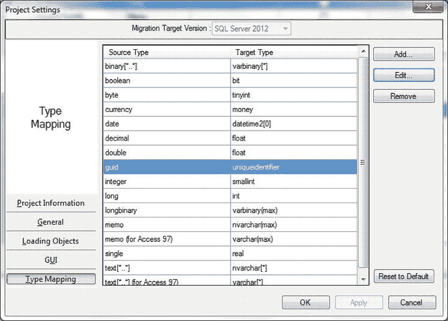
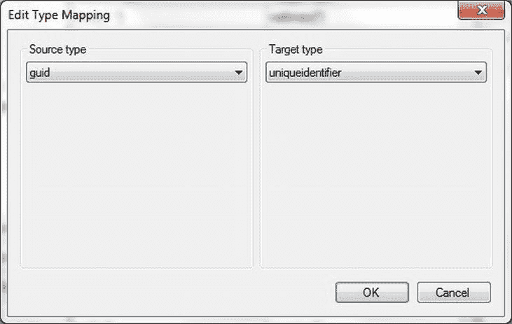
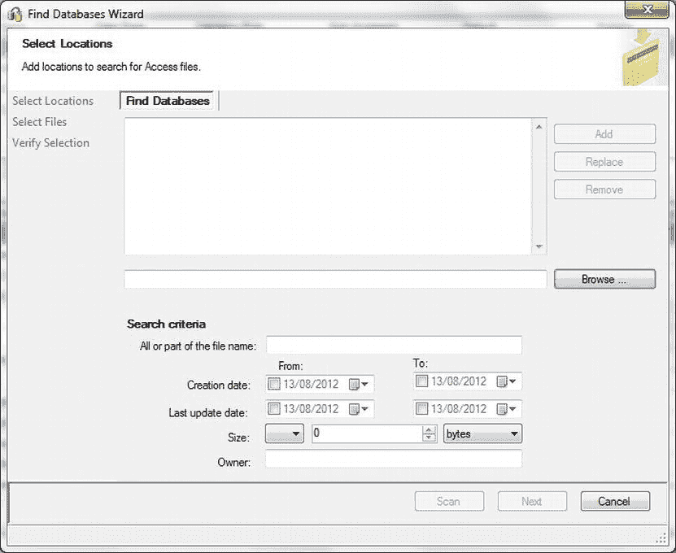

# 1-16. 解决从 Access 升级到 SQL Server 过程中的复杂数据迁移问题

## 问题
你有一个复杂的 Access 数据库转换和数据加载任务，需要大量工作。这个项目可能耗时较长，需要相当大的开发工作量。

## 解决方案
使用 SSMA 的扩展功能来更改数据类型、应用自定义类型映射以及生成自定义脚本——以及其他可能的操作。

由于我们正在研究 SSMA 的一系列选项，因此这不会是一个单一的“配方”——那样太难遵循。我更喜欢将可用选项解释为一系列“迷你配方”，这样你可以查看感兴趣的选项。

### 使用 SSMA 更改数据类型
在 SSMA 中更改数据类型非常简单，只需执行以下操作：
1.  在左侧任一“元数据资源管理器”窗口中，单击你希望更改其元数据的表名。
2.  在表的 SQL Server 元数据中（右下侧），更改数据类型、精度、小数位数、可为空性或默认值。
3.  单击“应用”。
4.  右键单击左侧“SQL Server 元数据资源管理器”窗口中的表名，然后选择“与数据库同步”。
5.  对出现的任何消息框单击“确定”。

### 使用 SSMA 迁移单表数据
以下是如何在 SSMA 中迁移单表数据的步骤：
1.  在左侧任一“元数据资源管理器”窗口中，右键单击要迁移的表。
2.  选择“迁移数据”。

### 使用 SSMA 创建表的报告
SSMA 也可以通过以下方式为 Access 对象创建报告：
1.  在“Access 元数据”窗口中单击对象（或层级级别）。
2.  单击“工具”  “创建报告”（或单击“创建报告”按钮）。将创建并显示报告，如 图 1-29 所示。

图 1-29. SSMA 报告创建

### 使用 SSMA 为项目应用自定义数据类型映射
在 SSMA 中创建自定义数据类型映射也非常容易，操作如下：
1.  单击“工具”  “项目设置”。
2.  在“项目设置”对话框中，单击左下角的“类型映射”。对话框将如 图 1-30 所示。

    
    图 1-30. 源和目标数据类型映射

3.  单击你希望修改的类型映射对。
4.  单击“编辑”。将出现如 图 1-31 所示的对话框。

    
    图 1-31. SSMA 类型映射

5.  选择不同的目标类型，以及（如果需要）任何其他属性。
6.  单击两次“确定”。

### 使用 SSMA 创建目标表的 T-SQL 脚本
如果你需要目标表的 DDL，SSMA 可以为你创建，步骤如下：
1.  单击“创建架构”可生成创建表所需的 T-SQL。要使用此代码，请单击右下角窗格中的“SQL”选项卡。向下滚动到 SQL 代码底部，你会找到表的 `DROP` 和 `CREATE` 脚本。这些可以复制到 SQL Server Management Studio 中，并根据你的需求进行调整。

### 使用 SSMA 查找计算机连接的任何驱动器上的所有 Access 数据库
SSMA 可以遍历计算机连接的所有磁盘，并显示找到的所有 Access 数据库。具体操作如下：
1.  单击“文件”  “查找数据库”，出现“查找数据库”对话框，如 图 1-32 所示。

    
    图 1-32. SSMA 查找数据库向导

2.  浏览到你希望搜索的驱动器和/或目录。单击“添加”。根据你要搜索的路径数量，重复此步骤多次。
3.  添加要搜索的文件名的全部或部分内容（如果需要）。
4.  选择数据范围和文件大小（如果需要）。
5.  单击“扫描”。SSMA 将找到符合你搜索条件的所有 Access 文件。它们将显示在对话框中，你可以通过按住 Control 键单击来选择要添加的文件。
6.  单击“下一步”显示要验证的文件列表，然后单击“完成”将选定的文件添加到“Access 元数据资源管理器”窗格。

