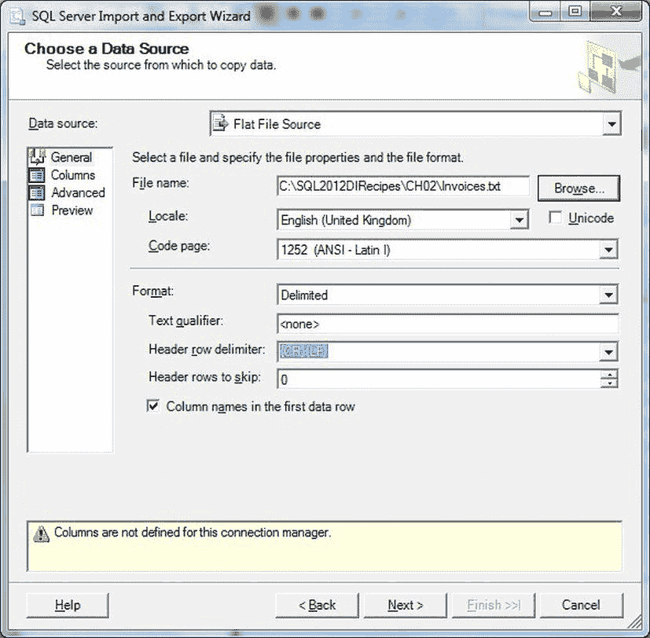
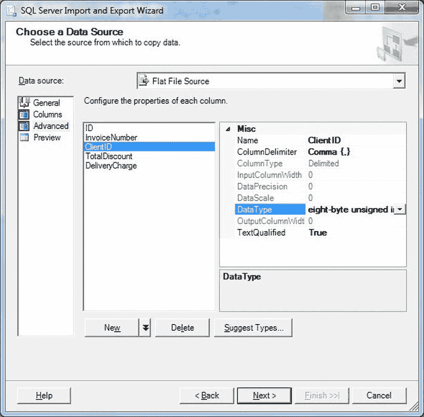
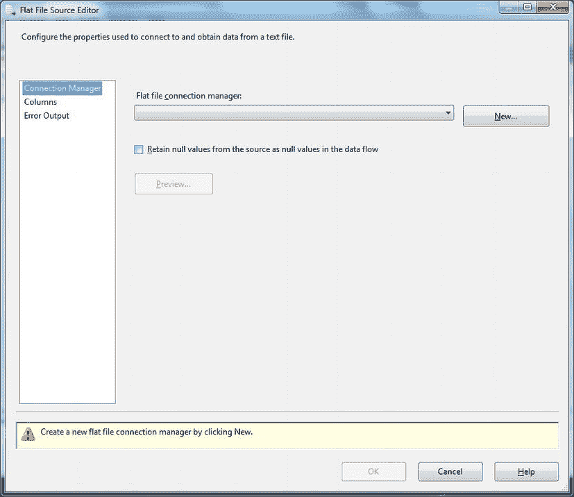
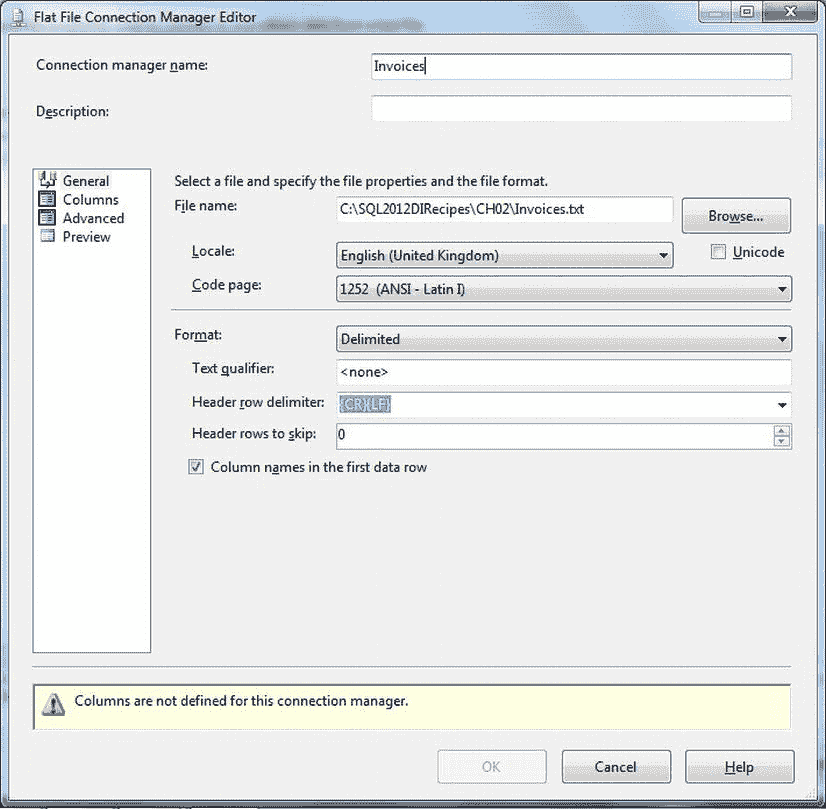
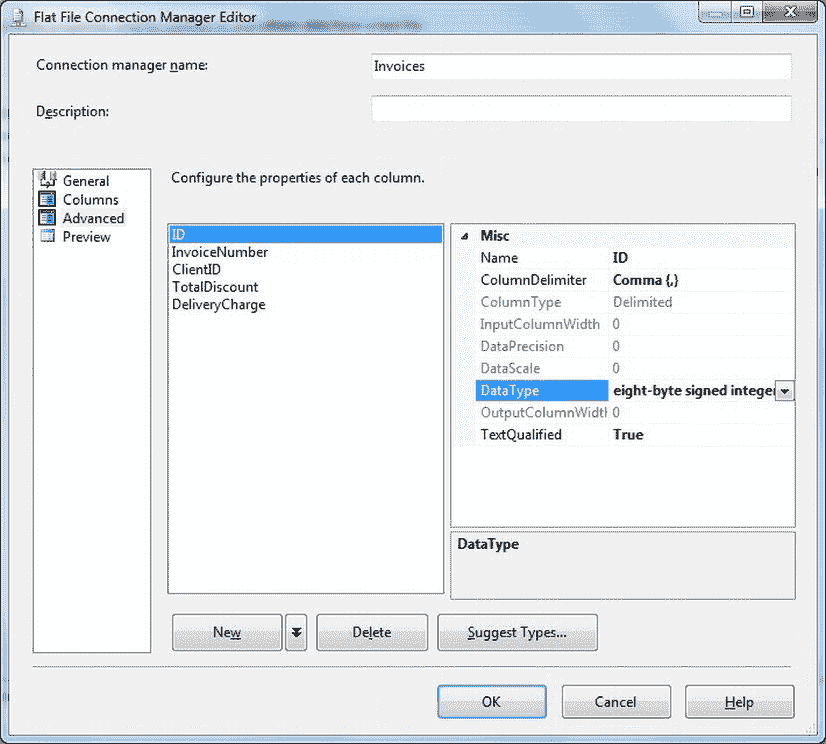
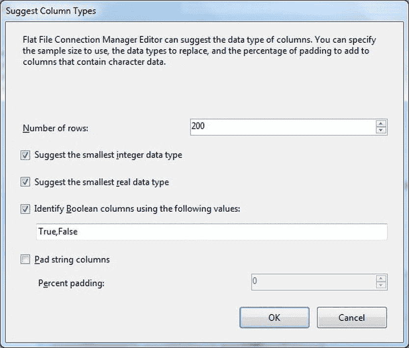

# 第 2 章


## 平面文件数据源

在大多数人都不愿记起的许多年里，`SQL Server` 开发人员或 DBA 面临的最常见的外部数据源是文本文件。


“平面”文件近乎无处不在，其必然结果便是催生了一个规模虽小却随时间不断发展的工具与技术生态系统，以帮助我们将所有文本文件数据源加载到 SQL Server 中。面对如此繁多的解决方案，本章我将重点考察以下几种主要方法：

*   导入/导出向导
*   SSIS
*   `OPENROWSET` 和 `OPENDATASOURCE`
*   `BULK INSERT`
*   链接服务器
*   `BCP`

正如你所料，它们各有优缺点。本章旨在向你介绍每种方法的用途与实用性，并希望能阐明每种方法如何以及何时可以（并且很可能应该）被使用。此外，由于文本文件往往并不像它们本可以那样简单，我将概述一些技巧来处理它们可能带来的一些更棘手的问题。

然而，在深入探讨从文本文件（或平面文件——我交替使用这两个术语）导入数据的具体细节之前，我们需要澄清几个基本概念。首要问题是：你处理的是真正的 CSV 文件吗？这有关系吗？澄清这一点很重要，因为许多被描述为 CSV 文件的文本文件实际上并非如此。

假设你接收的文本文件不包含一个文件中多种不同类型的记录，那么你看到的可能是一个分隔文件，其中数据是“表格化”的，但“列”由特定字符分隔，“行”则由另一个（非打印）字符分隔。根据此类文件的布局方式，它可能被视为 CSV 文件。

关于文本文件何时是 CSV（逗号分隔值）文件，存在大量讨论。得益于几年前的一些出色工作，现在有了一个以 RFC（征求意见稿）形式存在的 CSV 文件规范（详情参见 `http://tools.ietf.org/html/rfc4180`）。我建议将 CSV 视为大多数平面文件所遵循规范的一个子集，即一种使用列分隔符和记录分隔符的分隔数据格式。RFC 规范本质上可归结为以下几点：

*   每条记录独占一行，以换行符（CR/LF）分隔。
*   文件中的最后一条记录可以有也可以没有最终的换行符。
*   文件第一行可以出现一个可选的标题行，其格式与普通记录行相同。此标题包含与文件中字段相对应的名称，并且应包含与文件中其余记录相同数量的字段。
*   在标题和每条记录中，可以有一个或多个由逗号分隔的字段。
*   整个文件中每行应包含相同数量的字段。
*   空格被视为字段的一部分，不应被忽略。
*   记录中的最后一个字段后面不能跟逗号。
*   每个字段可以用双引号括起来，也可以不用。如果字段没有用双引号括起来，那么字段内部就不能出现双引号。
*   包含双引号、逗号和换行符（CR/LF）的字段，应用双引号括起来。
*   如果使用双引号括住字段，那么出现在字段内部的双引号必须通过在其前面添加另一个双引号来进行“转义”。

以上是理论。实践——正如你可能已经发现的——可能完全是另一回事。正如 RFC 所述，“各实现之间存在相当大的差异”。事实上，许多平面文件传输被称为 CSV，但它们其实是 TSV（制表符分隔）、PSV（管道符分隔）——或者确实是任何你能想到的字符分隔。因此，我的观点是，在现实世界的数据传输场景中，对于分隔数据传输而言，最重要的一点是**一致性**。文件是否符合 RFC 规范根本不重要。SQL Server 提供的所有用于平面文件加载的工具几乎都能处理（或经过调整后能处理）一致的分隔文件格式。

因此，本质上，如果你需要的是 CSV、TSV、PSV 或任何其他形式的表格化数据文件，你需要问清楚以下问题：

*   源数据中使用哪个字符作为字段分隔符？
*   如何标识记录的结束？
*   文件中用于转义的前两个字符是否会在字段内部使用？
*   引号的使用是否一致（即，要么每个文件“列”的所有数据都使用引号）——或者完全不用？

一旦你了解了这些信息，你就可以尝试加载文件，并设法处理它可能带来的任何困难。在大多数情况下，如果你收到一个确实符合标准的 CSV 文件，那么你可以认为自己是幸运的。如果你真的足够幸运，可以指定格式。如果是这种情况，那么我刚才列出的四个问题应作为你指定源格式的基本准则。

“经典”的字段分隔符是逗号（CSV 中的“C”）。然而，你可能会经常发现使用制表符、管道符以及许多其他字符——甚至是一小串字符——作为字段分隔符。如果你处理的是来自欧洲大陆（更不用说世界其他地区）的数据，你可能需要使用分号作为分隔符，以便让逗号保留作为小数分隔符。

CSV 规范将记录结束指示符定义为 CR/LF 字符。你也可能发现仅使用回车符（CR）或换行符（LF）。

这正是在实践中可能变得棘手的地方。你可能会发现字段分隔符由反斜杠（`\`）转义，或者整个字段被引号括起来，字段主体中的所有引号都加倍。这通常是平面文件加载中最棘手的一个方面。本章将描述处理此问题的各种技巧。

有时，你可能需要处理包含不止一种记录类型、并且不像“经典” CSV 文件那样简单表格化的文本文件。这些文件不可避免地需要一些自定义处理，将在本章末尾进行探讨。幸运的是，SQL Server 2012 在处理包含不同列（或者如果你愿意这样想，也可以说是多个列分隔符）的文本文件方面取得了长足进步。我们同样会在本章末尾看到这一点。

要跟随本章给出的示例操作，你需要创建示例数据库 `CarSales` 和 `CarSales_Staging`，其描述见附录 B。你还需要从本书的配套网站下载示例文件，并将它们放置在你的 SQL Server 上的 `C:\SQL2012DIRecipes\CH02\` 目录中。我建议你在不同的操作步骤（Recipe）之间，删除并重新创建目标表（如果它们已存在），以确保目标结构是干净的。

## 2-1. 从文本文件导入数据

### 问题

你想尽可能快速、轻松地导入一个平面文件。

### 解决方案

运行导入/导出向导。

面对分隔文本文件或 CSV 文件时，经典的方法是尝试使用导入/导出向导来导入它。由于本向导已在第 1 章介绍过，这里我将更加简明扼要。更详细的描述请参阅操作步骤（Recipe）1-2。

1.  确保目标数据库中已创建正确的表结构。在此示例中，是 `CarSales_Staging` 中的 `dbo.Invoices` 表。详情见附录 B。
2.  在 SSMS 中，右键单击目标数据库（此示例中为 `CarSales_Staging`），选择 **任务**  **导入数据**。如果出现欢迎屏幕，请单击 **下一步**。
3.  选择 **平面文件源** 作为数据源。对话框将切换以提供所有平面文件选项。浏览到你的源文件或输入完整路径和文件名（`C:\SQL2012DIRecipes\CH02\Invoices.Txt`）。
4.  指定列名位于第一行，并且文本限定符为 `<无>`。


将行首分隔符定义为`<CR>` `<LF>`，并选择格式为“带分隔符”。最终应出现一个类似图 2-1 的对话框。

图 2-1. 导入/导出向导中的平面文件源

5.  单击“列”，这将显示可用列的列表。如果需要，您可以在此处更改特定的列分隔符。
6.  单击“高级”。这允许您为每列定义数据类型。您还可以设置长度、精度或小数位数（取决于数据类型）——或者保留默认值，如图 2-2 所示。

图 2-2. 在导入/导出向导中定义数据类型
7.  单击“下一步”。检查目标服务器、数据库和身份验证是否正确。
8.  单击“下一步”。确保已选择所需的目标表。
9.  单击“下一步”。确认已选择“立即运行”。
10. 单击“下一步”，然后单击“完成”，再单击“完成”，最后单击“关闭”。您的数据应被正确导入。

### 工作原理
导入/导出向导获取您的平面文件，并协助您定义其主要特征。然后，您可以在列级别指定更高级的属性。如果需要，您可以让此向导猜测源文件中的元数据特征。

### 提示、技巧和注意事项
*   有关启动导入/导出向导的其他方法，请参阅 `技巧 1-2`。
*   您可以通过单击“建议类型”按钮，让导入/导出向导为数据的每一列建议数据类型。这在 `技巧 2-3` 中有更详细的说明。

## 2-2. 导入带分隔符的文本文件
### 问题
您需要定期导入平面文件，和/或在结构化的 ETL 流程中应用数据转换。

### 解决方案
创建一个 SSIS 包来导入文件。具体操作如下：
1.  创建一个新的 SSIS 项目，或打开现有项目，并添加一个新包。
2.  在“控制流”窗格上添加一个“数据流任务”。通过执行以下任一操作来编辑此任务：
    *   双击。
    *   右键单击并选择“编辑”。
    *   单击“数据流”选项卡。
3.  从工具箱的“数据流源”中添加一个“平面文件源”。双击“平面文件源”进行编辑。您应该会看到如图 2-3 所示的对话框。

图 2-3. SSIS 中的平面文件源编辑器
4.  单击“新建”以指定文件连接，这将打开“文件连接管理器编辑器”。浏览以选择源文件（或者，如果您愿意，也可以直接键入）。在此示例中，它是 `C:\SQL2012DIRecipes\CH02\Invoices.Txt`。指定列名是否在首行，输入文本限定符，并选择行分隔符（或保留默认值）。您最终应得到类似图 2-4 所示的内容。

图 2-4. 在导入/导出向导中定义平面文件的基本参数
5.  单击“高级”。为每个输出列定义数据类型和长度。对话框应如图 2-5 所示。

图 2-5. 在 SSIS 中为平面文件定义数据类型
6.  单击两次“确定”以确认并返回到“数据流”窗格。
7.  从工具箱中将一个“OLE DB 目标”添加到“数据流”窗格，并将文本源的输出（绿色箭头）连接到“OLE DB 目标”。
8.  双击“OLE DB 目标”进行编辑。单击“新建”以添加一个 OLE DB 连接管理器，您将其配置为连接到目标数据库（在此示例中为 `CarSales_Staging`）。或者，您可以选择现有的连接管理器。
9.  选择目标表（在此示例中为 `dbo.Invoice`）。或者，单击“新建”以创建一个新表，该表将自动设计为映射到感知到的源结构。如果您愿意，可以更改 SSIS 建议的目标表名称。单击“确定”确认。
10. 在 OLE DB 连接管理器对话框左侧的列表中，单击“映射”。确保源数据映射到目标列。
11. 单击“确定”。
12. 单击“调试”  “开始调试”以从文本文件导入数据。SSIS 现在将导入您的数据。

### 工作原理
在数据导入的实际应用中，SSIS 可能是您使用最多的工具。尽管如此，如果能够打开源文件查看其内容，或者已经获知其内容的足够信息以了解以下几点，总是有帮助的：
*   它是否包含列标题。
*   每列数据的数据类型和长度是什么。
*   文件是否始终包含相同数量的列分隔符。

但是，如果您没有关于文本文件中数据的核心信息，那么您可以通过预览数据并让 SSIS 猜测数据类型，从 SSIS 中获取源文件的元数据——正如您将在 `技巧 2-3` 中发现的那样。假设您拥有这些信息，SSIS 将帮助您完成导入文本文件的过程。对于不是特别巨大的平面文件，您可以在文本编辑器中打开源文件，并尝试直接推断元数据。

 **注意** 如果您在设置“数据流任务”时未指定任何数据类型，SSIS 会假定每列都是 `VARCHAR(50)`。

将数据类型定义和调整作为 SSIS 的直通处理可能意味着大量的工作。幸运的是，SSIS 有办法在这方面帮助您，您将在 `技巧 2-3` 中看到。有趣的是，实际工作是在“平面文件连接管理器”中完成的，而不是在“数据源任务”中。

如果您遇到困难，首先应该查看的可能是基本的文本文件规范。如果您查看本技巧步骤 5 中所示的“平面文件连接管理器”对话框，您将在“常规”窗格中看到表 2-1 中列出的项目。

表 2-1. 平面文件连接管理器“常规”窗格选项
| 窗格 | 元素 | 说明 |
| --- | --- | --- |
| 常规 | 区域设置 | 允许您为源数据选择区域设置。这在导入和排序日期时间数据类型时使用。 |
| 常规 | 代码页 | 提供源数据文件的代码页。如果您确定要使用正确的代码页，可以从可用的源代码页中选择。 |
| 常规 | Unicode | 指定源文件为 Unicode 格式，这使得指定代码页变得多余。 |
| 常规 | 文本限定符 | 如果源数据将文本数据括在双引号（或单引号）中，您可以在此处输入文本限定符。列分隔符可以在文件（常规）级别全局设置，如果需要，可以为每个单独的列覆盖。 |
| 常规 | 行首分隔符 | 允许您选择行首的分隔符。 |
| 常规 | 要跳过的行首 | 定义在文件开头要跳过的行数（包括行首）。 |
| 常规 | 列名位于第一个数据行 | 允许您指定源文件的第一行数据包含列标题。这些标题随后将被 SSIS 在数据流中使用。 |
| 列 | 重置列 | 将所有列定义重置为 SSIS 标准 (`VARCHAR(50)`)。 |

那么您可能会如何使用这些元素呢？根据我的经验，以下是您最可能需要的那些：
*   `文本限定符`。


## 2-3. 自动确定数据类型

### 问题

您想要推断源平面文件中数据的结构。

### 解决方案

使用平面文件连接管理器中的 SSIS `建议类型` 选项。

我将解释一种简单的方法，用于获取源文本文件中实际数据类型和长度的合理近似值。这同样是使用`平面文件连接管理器编辑器`的高级面板完成的。由于本配方建立在配方 2-2 的基础上，为避免重复，您需要先阅读前一个配方再使用本配方。

1.  遵循配方 2-2 的步骤 1 至 4。
2.  点击 `高级`。
3.  点击 `建议类型`。将出现 `建议列类型` 对话框，如 图 2-6 所示。

    

    图 2-6. 在 SSIS 中自动确定列类型

4.  修改您希望调整的任何选项（例如，对于大文件的准确采样来说，行数可能太少）。点击 `确定`。

您将看到所有数据类型（以及在适当情况下的长度）已在对话框的高级面板中进行了采样和调整（图 2-5）。

### 工作原理

您可能已经注意到，在导入文本文件时，`平面文件`连接管理器假定分隔文本文件中的所有源列都是长度为 50 个字符的字符串。这可能因以下几个原因而限制过强：

*   许多字段不是字符串，因此需要在 SSIS 包中作为数据类型转换的一部分。
*   建议的 50 个字符长度对于许多字符串字段来说不足，可能导致包在运行时出错。
*   即使所有源列都能放入 50 个字符内，这也通常过宽，因为它减少了可放入 SSIS 管道缓冲区中的记录数量，从而减慢了加载过程。

当然，提供源文件的人员通常会解决这个问题，他们会体贴地提供文件内容的完整数据类型描述。然而，也可能存在并非如此的情况，您必须推断、发现或猜测源文件中的字段（或您喜欢的列）类型和长度。这可能是一个痛苦的过程，特别是如果它意味着基于试错的加载和重新加载文本文件的循环，直到您最终为每个源列找到可接受的数据类型。因此，一个更简单的解决方案是让 SSIS 为您猜测数据类型和长度。诚然，您可以打开一些文件查看源数据。但快速浏览很少是准确的分析样本。更重要的是，有些源平面文件非常大，以至于它们要么需要很长时间才能打开，要么会直接导致您喜爱的文本编辑器崩溃。

了解在确定源文件中的数据类型时您的选项会有所帮助，这些选项在 表 2-2 中提供。

表 2-2. 建议列类型选项

| 选项 | 描述 |
| --- | --- |
| 行数 | 要采样的行数。在 SQL Server 2012 中似乎没有上限。在 SSIS 2008 及之前版本中，限制为 1000 条记录。 |
| 建议最小的整数数据类型 | 对于仅包含整数的列，建议能够容纳数据而不溢出的最小整数类型。 |
| 建议最小的实数数据类型 | 对于包含实数（numeric 数据类型）数字的列，建议能够容纳数据而不溢出的最小数值类型。 |
| 使用以下值标识布尔列 | 指示哪些值可以被解释为布尔值 |
| 填充字符串列 / 填充百分比 | 获取最长字符串元素（`[n]varchar`, `[n]char`）的长度，并按您指定的百分比扩展该长度，以预期未来源文件中更长的字符串。 |

假设您知道哪一列需要设置为哪种数据类型，以及为一列或多列设置特定的列分隔符，您可能希望使用 `高级` 面板微调数据类型。表 2-3 描述了可用选项。

表 2-3. 平面文件连接管理器高级面板选项

| 选项 | 描述 |
| --- | --- |
| 名称 | 可以在此处设置或覆盖列名。这是从此在 SSIS 数据流中使用的名称。 |
| 列分隔符 | 为一列或多列指定的列分隔符。您可以从列表中选择，或输入/粘贴源数据中使用的列分隔符。 |
| 数据类型 | 从 SSIS 数据类型列表中选择数据类型。 |
| 输出列宽度 | 输出列的宽度。此值针对单字节字符。 |
| 文本限定符 | 允许您指定此列中的文本是否使用 `常规` 面板中设置的文本限定符进行限定。 |

例如，如果您希望覆盖某列数据类型的当前设置，您可以设置数据类型，如 图 2-5 所示。

如果您的源数据发生变化，您不必从头开始重新执行整个列映射结构，因为 SSIS 允许您添加或删除列以调整包来适应源数据结构的更改。

要添加列，请执行以下操作：

1.  单击要插入列的前一列（或后一列）。
2.  单击 `新建` 按钮右侧的箭头。选择 `在之前插入`（或在之后）。一个新列将被添加到映射结构中。

单击 `新建` 或 `添加列` 会在现有列之后插入一个新列。

删除列同样简单：

1.  选择要删除的列。
2.  点击 `删除`。

`平面文件`连接管理器的`高级`面板还允许您为每列指定该列是否用引号括起来。如果是这种情况，您只需将 `文本限定符` 设置为 `True`；如果没有引号，则设置为 `False`。

指示数据（无论何种类型）被括在引号中。例如，这可能是因为文本数据包含列分隔符（通常是逗号）。这样，此类字符就能被优雅地处理。无论如何，引号会在导入过程中被移除，因此无需在导入后手动删除。

`列名位于第一个数据行中`。指示第一行包含列标题。顾名思义，数据的第一行被视为列名，因此不会被导入。

### 提示、技巧和陷阱

*   SSIS 中 OLEDB 连接的细节在配方 1-7 中解释。
*   您可以使用 SQL Server 2008 中的 .NET 目标。从 SQL Server 2008 R2 及更高版本开始，您对此目标组件拥有 `尽可能使用批量插入` 选项以加速数据加载。
*   要让 SSIS 处理不同数量的列分隔符，请参阅配方 2-16。
*   为现有包调整数据类型会在 `平面文件` 源任务上生成警告三角形。要使警告消失，只需双击此任务并确认您希望 SSIS 重新同步元数据。
*   如果您未使用 SSIS 2012，则最大采样行数为 1000；在某些情况下，这不是代表性样本。如果您遇到问题，最好将数据类型设置得较大（整数用 `I8`，字符字段用较大的长度），然后检查导入数据的表中实际的最大数据长度。这种数据长度分析在 第 8 章 中描述。

```
if (condVar > someVal) {console.log("xxx")}
```


