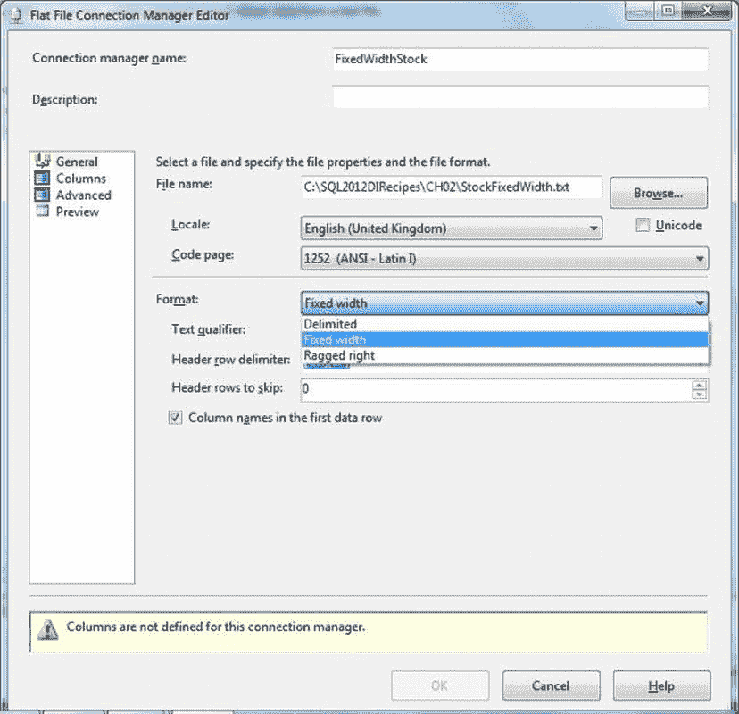
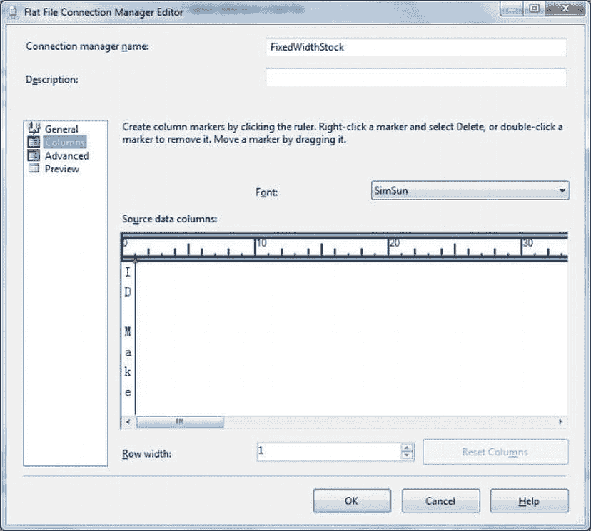
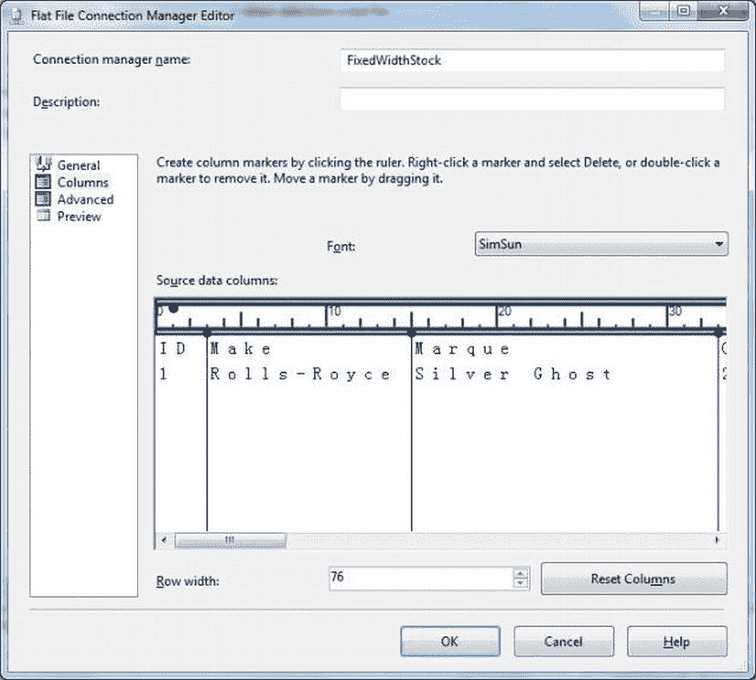

# 2-4. 导入固定宽度文本文件

## 问题

你需要将一个固定宽度的文本文件导入到 SQL Server 中。

## 解决方案

创建一个 SSIS 包，并使用一个配置为接受固定宽度文件的平面文件连接管理器来定义数据流。以下是具体操作步骤。

1.  按照“配方 2-2”中的描述创建一个 SSIS 包，准备好一个平面文件源和一个 OLEDB 目标。
2.  创建一个连接到 `CarSales_Staging` 的 OLEDB 连接管理器，命名为 `CarSales_Staging_OLEDB`。
3.  为平面文件创建一个连接管理器，可以按照前面“配方 2-2”步骤 3 的描述创建，也可以通过右键单击“连接管理器”选项卡并选择“新建平面文件连接”来创建，如图 2-3 所示。
4.  指定连接名称和源文件（`C:\SQL2012DIRecipes\CH02\StockFixedWidth.Txt`）后，指定格式为固定宽度，如图 2-7 所示。

    

    图 2-7. 定义固定宽度数据源

5.  通过单击对话框左侧的“列”来显示“列”窗格。你应该看到类似图 2-8 的内容。

    

    图 2-8. 为固定宽度平面文件设置行宽

6.  输入行宽。如果不知道，可以尝试一个较大的数字！红色的行标记将跳到你输入的位置。你始终可以根据在平面文件连接管理器编辑器的“列”窗格中预览到的数据来微调长度。
7.  左右滚动浏览数据。通过单击标尺添加你需要的任何列分隔符。最终应该得到类似图 2-9 的结果。

    

    图 2-9. 为固定宽度平面文件设置列宽

8.  单击“确定”确认连接管理器设置。现在可以将此连接管理器添加到平面文件源（除非你是在定义平面文件源时创建的它）。
9.  将平面文件源连接到 OLEDB 输出。
10. 配置 OLEDB 输出以使用连接管理器 `CarSales_Staging_OLEDB`。
11. 添加列映射，并选择或创建一个数据表，然后按照“配方 2-2”步骤 7 到 12 的描述运行导入包。

## 工作原理

有时，你可能需要处理需要导入到 SQL Server 的固定宽度文件。这与分隔文件非常相似，只是你需要告诉 SSIS 列的断点在哪里。

你只知道源文件是完全固定宽度的——也就是说，它具有以下特点：

*   所有行的宽度相同。
*   所有列的宽度是固定的（当然，每列的宽度可以不同）。
*   每行末尾没有回车/换行符（CR/LF）。

这与“配方 2-2”中描述的导入分隔文件非常相似。与分隔文件一样，你可以设置以下选项：

*   第一行是否包含列名
*   要跳过的标题行
*   文本限定符
*   列名
*   列的数据类型
*   输出列宽

所有这些都如“配方 2-2”所述进行设置。

 **注意** 有时你可能需要导入一个平面文件，其中所有列都是固定宽度，除了最后一列可以是可变长度**或者**每行以 CR/LF 结尾。这也被称为*右侧参差不齐*（ragged right）文本文件。这使得右侧参差不齐的文件本质上是一个固定宽度的文本文件，但有一个主要的、根本的区别：每行末尾都有一个 CR/LF。在其他所有方面，导入过程与固定宽度源相同。

