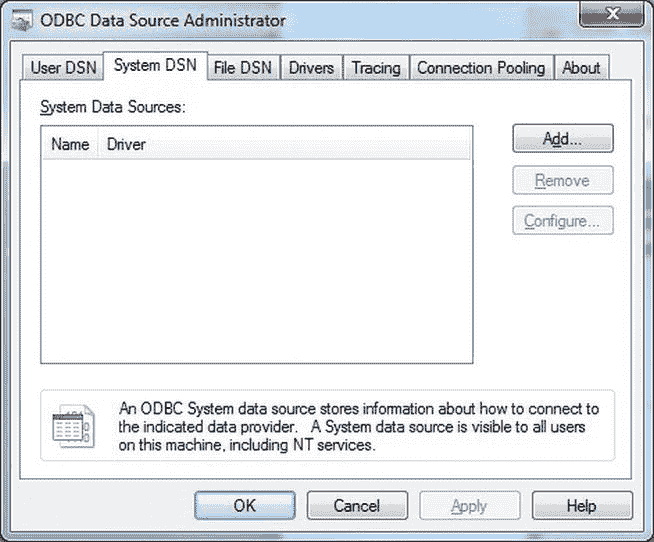
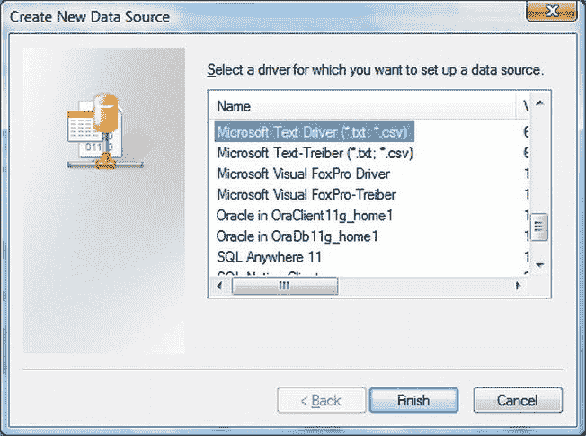

# 2-6. 映射源文件

## 问题

您需要对源文件应用复杂的映射，以正确导入并避免因重复列名或数据类型问题而导致的错误。

## 解决方案

创建一个模式信息文件，并将其放在与源数据文件相同的目录中。

一个简单的模式信息文件，设计用于处理 `C:\SQL2012DIRecipes\CH02\Invoices2.Txt` 示例文件——该文件不幸地没有列名——可能如下所示（`C:\SQL2012DIRecipes\CH02\Schema.ini`）：
```
[Invoices2.txt]
Format = CSVDelimited
CharacterSet = OEM
ColNameHeader = False
Col1 = ID Integer
Col2 = InvoiceNumber Char Width 255
Col3 = ClientID Integer
Col4 = TotalDiscount Currency
Col5 = DeliveryCharge Currency
```

## 工作原理

如果源数据没有标题记录，或者您希望向文本驱动程序提供数据类型信息，那么您可能需要提供一个模式信息文件，以指示 Microsoft 文本驱动程序如何最好地处理源数据结构。模式信息文件是一个文本文件，始终命名为 Schema.ini，并且**始终**保存在文本数据源文件所在的同一目录中。它可以包含多个源文件的模式信息，因为必须给出每个文件名。

模式信息文件可以指定以下内容：
*   文本文件名（因为只有一个可能的 Schema.ini 文件，它可以包含多个源文件的信息，每个文件由方括号中的源文件名标识）
*   文件格式
*   字符集
*   特殊数据类型转换
*   列标题指示符
*   字段名称、宽度和类型

但是，Schema.ini 文件不仅仅用于添加列名。您可以用它来覆盖现有的列名，并在读取源数据时更改数据类型，如下面模式信息文件片段所示。此 `C:\SQL2012DIRecipes\CH02\Schema.Ini` 模式信息文件的片段覆盖了我们在配方 2-5 中使用的文本文件（`C:\SQL2012DIRecipes\CH02\Invoices.Txt`）的数据类型和列名。
```
[Invoices.txt]
Format = CSVDelimited
CharacterSet = OEM
ColNameHeader = True
Col1 = ID Integer
Col2 = BillNumber Char Width 255
Col3 = IDClient Integer
Col4 = TotalDiscount Integer
Col5 = DeliveryCharge Currency
```
这些示例仅展示了模式信息文件部分可能性。表 2-4 提供了更多可用参数的完整描述。

表 2-4. Schema.ini 文件选项

| 说明符 | 注释 |
| --- | --- |
| Format = CSVDelimited | 指示驱动程序正在处理 CSV 文件。 |
| Format = TabDelimited | 指示驱动程序记录采用制表符分隔格式。 |
| Format = Delimited(分隔符) | 允许您指定自定义分隔符。 |
| Format = FixedLength | 指示驱动程序这是一个固定长度的数据文件。 |
| CharacterSet = ANSI | 告知驱动程序文件由 ANSI 字符组成。 |
| CharacterSet = OEM | 告知驱动程序文件由非 ANSI 字符组成。 |
| ColNameHeader = True | 告知驱动程序第一行包含列标题。 |

还有更多选项可用，但根据我的经验，它们很少使用。如果您需要此信息，可以在 `http://msdn.microsoft.com/en-us/library/windows/desktop/ms709353(v=vs.85).aspx` 找到。

在这个例子中，我将模式信息文件命名为 `C:\SQL2012DIRecipes\CH02\Schema.Ini`。`OPENROWSET` 会自动为引用的每个源文件使用模式信息文件中的信息。

与其手工制作模式信息文件，您可以使用 ODBC 管理员创建一个，以节省时间并最大限度地减少出错可能性。这可以在您创建系统 DSN 时同时完成，如下所示：
1.  打开 ODBC 数据源管理员（控制面板 > 管理工具 > 数据源）。单击系统 DSN。对话框类似于 图 2-10。
    
    图 2-10.  使用 ODBC 源管理员创建 Schema.ini 文件
2.  单击添加。选择 Microsoft 文本驱动程序（如 图 2-11 所示）。
    


