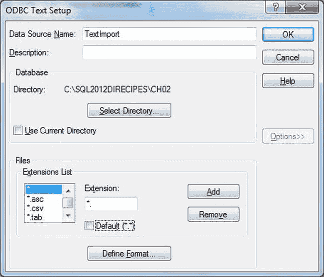

# ODBC 文本驱动程序设置

## 2-6. 配置 ODBC 文本驱动程序

1.  在 ODBC 数据源管理器中，选择“文件 DSN”选项卡，单击“添加”，选择“Microsoft Text Driver (*.txt; *.csv)”。
      
    *图 2-11 选择 Microsoft 文本驱动程序*
2.  单击“完成”，然后在“ODBC Text 设置”对话框中单击“选项”。
3.  输入数据源名称。
4.  取消选中“使用当前目录”。
5.  单击“选择目录”浏览到源文本文件所在的目录。
6.  取消选中“默认”，如果所需文件扩展名不在现有列表中，则选择或输入它。对话框应类似于图 2-12。
      
    *图 2-12 创建 Schema.ini 文件*
7.  单击“定义格式”。然后单击您希望为其创建完整架构信息的每个文件，再单击“猜测”。
8.  单击“确定”。确认任何错误消息。取消退出 ODBC 数据源管理器。

> **注意**
> 在运行 Microsoft 文本驱动程序 32 位版本的 64 位机器上，您必须运行 32 位版本的 `Odbcad32.exe`（位于 `%systemdrive%\Windows\SysWoW64`）才能使此解决方案生效。否则，您将看不到（32 位的）Microsoft 文本驱动程序。

您将找到一个 `Schema.ini` 文件，其中包含所选类型所有文件的基本元素——以及您请求 ODBC 数据源管理器猜测数据结构的所有文件的完整列规范。您现在可以修改此文件以满足您的精确要求。生成的文件非常密集且通常难以阅读。您可能需要考虑编辑它以删除任何不需要的文件规范，并进行一般清理。

#### 提示、技巧与陷阱

- 无论列标题是否存在于第一行，在 `Schema.ini` 文件中都必须将列引用为 `Col1`、`Col2`…`Col’n’` 等形式。
- 我在网上看到过关于 `Schema.ini` 文件中列数限制为 255 的说法。尽管我尚未使用 `OPENROWSET` 导入过如此宽的文件，因此不能说这对我曾是个问题。

