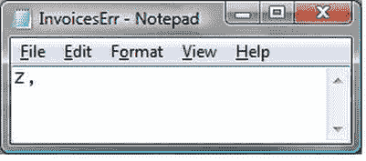

# BULK INSERT 选项

| 选项 | 说明 |
| --- | --- |
| `BATCHSIZE` | 指定在加载失败时，将从源文件加载（提交）或回滚的行数。 |
| `CHECK_CONSTRAINTS` | 导致应用用户定义的检查约束。请注意，`UNIQUE`、`PRIMARY KEY`、`FOREIGN KEY` 或 `NOT NULL` 约束始终强制执行。 |
| `CODEPAGE` | 此选项指定数据文件中数据的代码页。仅当数据包含使用扩展字符的 `char`、`varchar` 或文本时，此选项才有用。 |
| `DATAFILETYPE` | 指定数据文件的类型。 |
| `ERRORFILE` | 给出错误日志文件的路径和名称，错误信息将被记录到该文件中。 |
| `FIELDTERMINATOR` | 指定在使用 `char` 和 `widechar` 源数据文件时，用于结束字段（列）的字符。默认的字段终止符是制表符 (`\t`)。 |
| `FIRE_TRIGGERS` | 指示必须为每个导入行触发触发器。 |
| `FIRSTROW` | 指定导入开始的行号。 |
| `KILOBYTES_PER_BATCH` | 指定每批的千字节数。 |
| `KEEPIDENTITY` | 指示必须使用源数据中 `IDENTITY` 列的值，而不是继续使用目标表的 `IDENTITY` 序列。 |
| `KEEPNULLS` | 保留 `NULLS` —— 而不是加载目标表中指定的任何默认值。 |
| `LASTROW` | 从源文件加载的最后一行。 |
| `MAXERRORS` | 在 `BULK INSERT` 失败之前，加载过程中允许失败的最大行数。默认值为 10。 |
| `ORDER` | 指定源数据的排序顺序。如果定义了此项，则源文件必须事先排好序。 |
| `TABLOCK` | 锁定目标表，通过防止锁升级来加快数据加载速度。 |
| `ROWTERMINATOR` | 定义结束每一行的字符。标准是 `'\n'` —— 即换行符。 |

更实际地说，你如何使用这些选项？接下来的几段将给出一些例子。这并非详尽无遗，而是为你自己的数据加载解决方案提供一些思路。

## 选择记录子集

选择一定数量的记录允许你以较小的块导入源数据。需要这样做的可能原因有几个，包括：
- 你需要调试过程，并且必须在非常大的源文件中“逐步逼近”一个错误。
- 你被要求将批次插入到多个表中。

以下代码片段选择了一个行的子集 (`C:\SQL2012DIRecipes\CH02\BulkInsertSubset.sql`)：
```sql
BULK INSERT dbo.InvoiceBulkLoad
   FROM 'C:\SQL2012DIRecipes\CH02\InvoiceBulkLoad.Txt'
   WITH
       (
           FIELDTERMINATOR = ',',
           ROWTERMINATOR = '\n',
           FIRSTROW = 2,
           LASTROW = 5
       );
```

## 设置批大小和错误处理

设置批大小可确保一旦达到最小错误数，整个加载不会失败。以下代码片段展示了如何执行此操作。它还会创建错误文件 `InvoicesErr` 和 `InvoicesErr.Error.Txt`。前者让你可以看到加载过程中产生的任何错误；后者包含任何错误消息以及行号和偏移量，以帮助你跟踪错误。将 `MAXERRORS` 设置为 0 将导致在数据加载过程中遇到的第一个错误时失败 (`C:\SQL2012DIRecipes\CH02\BulkInsertFailOnError.sql`)。
```sql
BULK INSERT dbo.InvoiceBulkLoad
   FROM 'C:\SQL2012DIRecipes\CH02\InvoiceBulkLoad.Txt'
   WITH
       (
         FIELDTERMINATOR = ',',
         ROWTERMINATOR = '\n',
         FIRSTROW = 2,
         BATCHSIZE = 5,
         MAXERRORS = 0,
         ERRORFILE = 'C:\SQL2012DIRecipes\CH02\InvoicesErr'
       );
```
因此，如果使用以下文本文件（注意最后一行 ID 中的字母字符）：
```
ID,InvoiceNumber,ClientID,TotalDiscount,DeliveryCharge
1,a5,1,500.00,250.00
2,a6,2,50.00,150.00
3,a5,1,500.00,250.00
4,a6,2,50.00,150.00
5,a5,1,500.00,250.00
6,a6,2,50.00,150.00
7,a5,1,500.00,250.00
Z,a6,2,50.00,150.00
```
那么加载将会失败——但前四条记录（表头行计入批大小 5）已成功加载。`InvoicesErr` 文件将如图 2-13 所示。



**图 2-13.** 批量加载错误文件

而 `InvoicesErr.Error.Txt` 文件内容如下：
```
Row 9 File Offset 207 ErrorFile Offset 0 - HRESULT 0x80020005
```
所有这些都有助于你快速定位错误。

## 保留 NULL 值、标识值并触发触发器

以下代码片段将保留源数据中的 `NULL` 值（而不是使用默认值），应用所有约束，触发触发器，并使用源数据中的 `IDENTITY` 值 (`C:\SQL2012DIRecipes\CH02\BulkInsertKeepIdentity.sql`)。
```sql
BULK INSERT dbo.InvoiceBulkLoad
   FROM 'C:\SQL2012DIRecipes\CH02\InvoiceBulkLoad.Txt'
   WITH
       (
         FIELDTERMINATOR = ',',
         ROWTERMINATOR = '\n',
         FIRSTROW = 2,
         KEEPNULLS,
         KEEPIDENTITY,
         FIRE_TRIGGERS,
         CHECK_CONSTRAINTS
       ) ;
```

## 最大化导入速度

如果你希望导入尽可能快地执行，那么你需要确保以下几点：
- 使用最小化日志记录。这将在第 14 章中描述。
- 表上没有索引。
- 表有一个聚集索引，并且 `ORDER` 提示告诉 `BULK INSERT` 源数据中的列是必需的列——并且源数据已经按此键排序。
- 可以锁定该表（即，在运行 `BULK INSERT` 时，该表上没有锁）。
- 数据以单批次导入。
- 不应用触发器和约束。
- 保留 `NULLS` 而不是应用默认值。

以下代码片段使用这些提示来最大化导入速度，并假设目标表的 ID 列上有一个聚集索引 (`C:\SQL2012DIRecipes\CH02\BulkInsertOrderedSource.sql`)。
```sql
BULK INSERT dbo.Invoice
   FROM 'C:\SQL2012DIRecipes\CH02\Invoices.Txt'
   WITH
       (
         FIELDTERMINATOR = ',',
         ROWTERMINATOR = '\n',
         FIRSTROW = 2,
         TABLOCK,
         KEEPNULLS,
         ORDER (ID ASC)
       ) ;
```

## 使用视图进行列映射

虽然使用 `BULK INSERT` 提供的许多选项可以处理确保成功导入所需的许多调整，但它们无法处理列映射。也就是说，对于一个“普通”的 `BULK INSERT`，源文件必须包含与目标表相同数量的列，并且列在源文件和目标表中的顺序必须相同。因此，在我们了解如何使用格式文件处理列映射之前，你可能想考虑一个相当简单的替代方案，它允许你加载文本文件——使用视图作为目标。这种方法可以让你避免使用格式文件映射列。它在以下情况下最有效：
- 源文件中的列数少于目标表中的列数。
- 源列和目标列的顺序不同。
- 目标表中没有 `NOT NULL` 列在源文本文件中没有对应的源数据。
- 你对目标表中的某些列没有插入权限。

你需要一个基于目标表的视图，该视图包含源文件中找到的列。一个示例是将数据加载到与前面示例相同的目标表中，但源文件 (`Invoices2.Txt`) 只有三列数据，如下所示 (`C:\SQL2012DIRecipes\CH02\BulkInsertView.sql` 包含视图和 `BULK INSERT` 命令)：
```sql
CREATE VIEW dbo.vw_Invoice2 AS
SELECT     ID, InvoiceNumber, ClientID
FROM       dbo.Invoice;
GO
```
一旦视图创建完成，就可以像这样用于 `BULK INSERT`：
```sql
BULK INSERT dbo.vw_Invoice2
   FROM 'C:\SQL2012DIRecipes\CH02\Invoices2.Txt'
   WITH
       (
         FIELDTERMINATOR = ',',
         ROWTERMINATOR = '\n',
         FIRSTROW = 2
       );
```


Txt' `WITH` (`FIELDTERMINATOR = ','`, `ROWTERMINATOR = '\n'`);

```
```

你也可以使用视图来更改列顺序。当源文件结构发生变化（无论是否有提示）而你需要快速修复以允许加载数据时，这可能是一个非常有用的技术。不过，用作数据加载目标的视图必须是可更新的。此外，`INSERT` 语句所做的修改不能影响视图 `FROM` 子句中引用的多个基础表。例如，向多表视图执行 `INSERT` 操作时，必须使用仅引用一个基础表列的 `column_list`。还要记住，如果语句中存在与同一视图或任何成员表的自连接，则不允许使用视图。最后，要更新分区视图，用户必须对成员表拥有 `INSERT`、`UPDATE` 和 `DELETE` 权限。更新分区视图还有其他限制，我建议你查阅在线手册 (`BOL`)。

如果需要加载所有字段都用引号括起来的文件，可以使用如下代码处理 (`C:\SQL2012DIRecipes\CH02\BulkInsertQuotedFields.sql`)：

```
BULK INSERT dbo.Invoice
   FROM 'C:\SQL2012DIRecipes\CH02\Invoices.Txt'
   WITH
       (
         FIELDTERMINATOR = '","',
         ROWTERMINATOR = '"\n',
         FIRSTROW = 2
       );
```

此方法要求所有字段都必须加引号。

#### 提示、技巧与陷阱

*   数据类型转换意味着你必须使用格式文件。这些文件在配方 2-11 中描述。
*   源数据文件可以是本地连接的，也可以使用通用命名约定指定。
*   标准的行终止符是 '`\r`' 表示换行符，'`\n`' 表示回车符，或者 '`\r\n`' 表示两者（CR/LF）。
*   源文本文件中使用的字段和行终止符可以是任何可打印字符（控制字符不可打印——空字符、制表符、换行符和回车符除外）——或者最多 10 个可打印字符的字符串，包括前面列出的部分或全部终止符。
*   如果没有聚集索引却指定了 `ORDER` 提示，则该提示将被忽略。
*   数据导入后，你可以（重新）应用索引。如果没有聚集索引，请记住先创建聚集索引，然后再创建非聚集索引。
*   `InvoicesErr` 错误文件特别有用，因为它给出了导致错误的数据。`InvoicesErr.error` 错误文件提供了导致错误的行号。当你希望继续加载而不是重新开始时，这可能极其有用。
*   在重新运行进程之前，务必删除错误文件，否则会出现错误。
*   `BULK INSERTS` 可以并行运行——有关可能的并行加载模式的更多详细信息，请参见配方 13-10。

## 2-11. 为使用 Bulk Insert 或 BCP 的复杂平面文件加载创建格式文件

### 问题

你希望在源表和目标表之间执行列映射以及其他调整，同时仍使用 `BULK INSERT` 来利用其速度优势。

### 解决方案

创建一个格式文件来处理列映射——以及更多功能。我将解释如何操作。

1.  要创建格式文件，请在命令提示符下运行以下命令：

    ```
    bcp CarSales_Staging.dbo.Invoice format nul -c -x -f C:\SQL2012DIRecipes\CH02\Invoicebulkload.Xml -T -SADAM02
    ```

2.  这应该会创建以下 XML 格式文件 (`C:\SQL2012DIRecipes\CH02\Invoicebulkload.Xml`)：

    ```
    <?xml version = "1.0"?>
    <BCPFORMAT xmlns = " http://schemas.microsoft.com/sqlserver/2004/bulkload/format"
               xmlns:xsi = " http://www.w3.org/2001/XMLSchema-instance ">
      <RECORD>
       <FIELD ID = "1" xsi:type = "CharTerm" TERMINATOR = "\t" MAX_LENGTH = "12"/>
       <FIELD ID = "2" xsi:type = "CharTerm" TERMINATOR = "\t" MAX_LENGTH = "50"
              COLLATION = "Latin1_General_CI_AS"/>
       <FIELD ID = "3" xsi:type = "CharTerm" TERMINATOR = "\t" MAX_LENGTH = "12"/>
       <FIELD ID = "4" xsi:type = "CharTerm" TERMINATOR = "\t" MAX_LENGTH = "41"/>
       <FIELD ID = "5" xsi:type = "CharTerm" TERMINATOR = "\r\n" MAX_LENGTH = "41"/>
      </RECORD>
      <ROW>
       <COLUMN SOURCE = "1" NAME = "ID" xsi:type = "SQLINT"/>
       <COLUMN SOURCE = "2" NAME = "InvoiceNumber" xsi:type = "SQLVARYCHAR"/>
       <COLUMN SOURCE = "3" NAME = "ClientID" xsi:type = "SQLINT"/>
       <COLUMN SOURCE = "4" NAME = "TotalDiscount" xsi:type = "SQLNUMERIC" PRECISION = "18"
               SCALE = "2"/>
       <COLUMN SOURCE = "5" NAME = "DeliveryCharge" xsi:type = "SQLNUMERIC" PRECISION = "18"
               SCALE = "2"/>
      </ROW>
    </BCPFORMAT>
    ```

### 工作原理

如果源数据文件有任何复杂性，那么你可能需要应用格式文件。这些文件相对简单直接——尤其是自 SQL Server 2005 引入新的 XML 格式文件以来。鉴于 XML 格式是未来的发展方向，我们将不在此处探讨“旧的”非 XML 版本。它们最好在以下情况下使用：

*   当数据文件的列数与目标表不同时。
*   当数据文件的列顺序与目标表不同时。
*   当数据文件中的数据元素具有不同的列终止符时。
*   当你需要从某些字段中移除引号时。
*   当同一数据文件用作具有不同架构的多个表的源时。
*   当用户对目标表的某些列没有 `INSERT` 权限时。

格式文件是一个 XML 文档，它遵循简单且定义良好的结构——但最棒的是，你无需从头开始创建 XML。你可以使用 BCP 实用程序让 SQL Server 完成大部分工作，然后只需微调结果即可获得你所需的内容。

我意识到 XML 格式文件的结构乍一看可能有点复杂，但它理解和使用起来相对简单。让我们从查看格式文件的结构开始。它分为三个部分：

*   **XML 声明**
*   **RECORD** 元素，描述源数据
*   **ROW** 元素，描述目标表

由于 XML 声明本质上是静态的，让我们来检查文件的另外两个部分。

首先，我们有 `ROW` 元素。它包含 `FIELD` 元素，这些元素可以包含 表 2-7 中提供的以下属性。

表 2-7. BCP XML 格式文件中的字段元素

| 字段元素 | 描述 |
| --- | --- |
| `ID` | 给出源文件中的顺序字段号。 |
| `TYPE` | 任何数据类型。有关可用数据类型，请参见 `http://msdn.microsoft.com/en-us/library/ms187833.aspx`。 |
| `TERMINATOR` | 每个字段的字段终止符。在行的最后一个字段中，指定记录终止符。 |
| `MAX_LENGTH` | 用于指定字段的最大可能长度。如果你生成了格式文件，此值源自目标表对应字段的元数据。 |
| `COLLATION` | 处理字符字段时，可以指定必须使用的排序规则。 |
| `PREFIX_LENGTH` | 用于定义二进制数据表示的前缀长度。如果使用，则必须是 1、2、4 或 8。 |
| `LENGTH` | 固定宽度元素的数据长度。 |

其次，你有描述目标表的 `RECORD` 元素。

#### 提示、技巧与陷阱

*   当然，你可以替换 `Database.Schema.Table` 参数 (`CarSales_Staging.dbo.


## 2-12. 使用格式文件执行批量插入

### 问题

你希望使用一个格式文件（例如你在配方 2-11 中创建的那个）来确保平稳高效的批量加载过程。

### 解决方案

在 `BULK INSERT` 语句中添加 `FORMATFILE` 参数。

以下代码片段展示了如何操作，它使用了与配方 2-10 中相同的源文件和目标表 (`C:\SQL2012DIRecipes\CH02\BulkInsertWithFormatFile.sql`)：

```sql
BULK INSERT CarSales_Staging.dbo.Invoice
   FROM 'C:\SQL2012DIRecipes\CH02\Invoices.Txt'
   WITH
       (
         FIRSTROW = 2,
         FORMATFILE = 'C:\SQL2012DIRecipes\CH02\Invoicebulkload.Xml'
       )
```

### 工作原理

以上述 `BULK INSERT` 过程为例，我们现在可以指定必须使用格式文件来微调数据加载。运行这个 T-SQL 片段将加载源数据文件并应用格式文件中定义的参数和映射关系。

要理解格式文件的强大之处，最好看一些符合日常数据导入需求（需要格式文件）的示例。在所有示例中，我们将采用前面的格式文件并对其进行调整，以展示格式文件的实用性。

首先，如果你的源文件是逗号分隔的（如此处使用的示例），你需要对格式文件进行微小调整：在 `<RECORD>` 部分将 `TERMINATOR = "\t"` 替换为 `TERMINATOR = ","`。幸运的是，使用文本编辑器进行全局替换即可完成。你这样做是在告诉 `BULK INSERT` 字段分隔符是逗号，而不是默认的制表符。

假设源数据的新版本颠倒了最后两列的顺序。以下格式文件将处理这种情况 (`C:\SQL2012DIRecipes\CH02\InvoiceNewColumnOrder.Xml`)：

```xml
<?xml version = "1.0"?>
<BCPFORMAT xmlns= http://schemas.microsoft.com/sqlserver/2004/bulkload/format
           xmlns:xsi = " http://www.w3.org/2001/XMLSchema-instance ">
 <RECORD>
  <FIELD ID = "1" xsi:type = "CharTerm" TERMINATOR = "," MAX_LENGTH = "12"/>
  <FIELD ID = "2" xsi:type = "CharTerm" TERMINATOR = "," MAX_LENGTH = "50"
           COLLATION = "Latin1_General_CI_AS"/>
  <FIELD ID = "3" xsi:type = "CharTerm" TERMINATOR = "," MAX_LENGTH = "12"/>
  <FIELD ID = "4" xsi:type = "CharTerm" TERMINATOR = "," MAX_LENGTH = "41"/>
  <FIELD ID = "5" xsi:type = "CharTerm" TERMINATOR = "\r\n" MAX_LENGTH = "41"/>
 </RECORD>
 <ROW>
  <COLUMN SOURCE = "1" NAME = "ID" xsi:type = "SQLINT"/>
  <COLUMN SOURCE = "2" NAME = "InvoiceNumber" xsi:type = "SQLVARYCHAR"/>
  <COLUMN SOURCE = "3" NAME = "ClientID" xsi:type = "SQLINT"/>
  <COLUMN SOURCE = "5" NAME = "DeliveryCharge" xsi:type = "SQLNUMERIC" PRECISION = "18" SCALE = "2"/>
  <COLUMN SOURCE = "4" NAME = "TotalDiscount" xsi:type = "SQLNUMERIC" PRECISION = "18" SCALE = "2"/>
 </ROW>
</BCPFORMAT>
```

以下格式文件将只加载源文件中的第一个字段，并忽略其他字段。
本质上，这个技术允许你垂直子集化源数据，只加载你感兴趣的列 (`C:\SQL2012DIRecipes\CH02\InvoiceSubset.Xml`)。

```xml
<?xml version = "1.0"?>
<BCPFORMAT xmlns = " http://schemas.microsoft.com/sqlserver/2004/bulkload/format "
           xmlns:xsi = " http://www.w3.org/2001/XMLSchema-instance ">
 <RECORD>
  <FIELD ID = "1" xsi:type = "CharTerm" TERMINATOR = "," MAX_LENGTH = "12"/>
  <FIELD ID = "2" xsi:type = "CharTerm" TERMINATOR = "," MAX_LENGTH = "50"
         COLLATION = "Latin1_General_CI_AS"/>
  <FIELD ID = "3" xsi:type = "CharTerm" TERMINATOR = "," MAX_LENGTH = "12"/>
  <FIELD ID = "4" xsi:type = "CharTerm" TERMINATOR = "," MAX_LENGTH = "41"/>
  <FIELD ID = "5" xsi:type = "CharTerm" TERMINATOR = "\r\n" MAX_LENGTH = "41"/>
 </RECORD>
 <ROW>
  <COLUMN SOURCE = "1" NAME = "ID" xsi:type = "SQLINT"/>
 </ROW>
</BCPFORMAT>
```

即使你只加载源文件中的一个字段，也必须在 `<RECORD />` 部分描述所有源字段。

如果你需要做与上述相反的操作，那么你可以从源文件加载所有（或选定的）字段，而目标表包含更多字段。为此，我们将使用 `Invoices2.txt` 源文件，它只有三个字段。要使用的格式文件如下所示 (`C:\SQL2012DIRecipes\CH02\Invoices2.Xml`)：

```xml
<?xml version = "1.0"?>
<BCPFORMAT xmlns = " http://schemas.microsoft.com/sqlserver/2004/bulkload/format "
           xmlns:xsi = " http://www.w3.org/2001/XMLSchema-instance ">
 <RECORD>
  <FIELD ID = "1" xsi:type = "CharTerm" TERMINATOR = "," MAX_LENGTH = "12"/>
  <FIELD ID = "2" xsi:type = "CharTerm" TERMINATOR = "," MAX_LENGTH = "50"
         COLLATION = "Latin1_General_CI_AS"/>
  <FIELD ID = "3" xsi:type = "CharTerm" TERMINATOR = "\r\n" MAX_LENGTH = "12"/>
 </RECORD>
 <ROW>
  <COLUMN SOURCE = "1" NAME = "ID" xsi:type = "SQLINT"/>
  <COLUMN SOURCE = "2" NAME = "InvoiceNumber" xsi:type = "SQLVARYCHAR"/>
  <COLUMN SOURCE = "3" NAME = "TotalDiscount" xsi:type = "SQLNUMERIC" PRECISION = "18" SCALE = "2"/>
 </ROW>
</BCPFORMAT>
```

值得注意的是，源列字段仍然是顺序编号的，但到目标表列的映射已经改变。由于源文件只包含三列，而目标表有五列，格式文件通过“NAME”属性指示 BCP 使用哪些列并将其映射到目标。当然，你总可以重构目标表，但这为 SQL 纯粹主义者所不取，而且无论如何，如果你现有的目标表包含数亿条（或更多）记录，那么调整格式文件显然是更简单的选择。

由于源文件不包含列标题，`BULK INSERT` 命令看起来像这样 (`C:\SQL2012DIRecipes\CH02\BulkInsertNoColHeaders.Sql`)：

```sql
BULK INSERT dbo.Invoice
   FROM 'C:\SQL2012DIRecipes\CH02\Invoices2.Txt'
   WITH (FORMATFILE = 'C:\SQL2012DIRecipes\CH02\Invoices2.Xml');
```

请注意，你可以将源字段映射到任何现有的目标字段，无论目标表中的字段顺序如何，只要数据类型兼容即可。你无需将字段和行终止符指定为 `BULK INSERT` 参数，因为这些选项已在格式文件中定义。

并非所有源文件对每个字段都使用相同的分隔符。这也可以通过格式文件处理。`C:\SQL2012DIRecipes\CH02\Invoices5` 示例文件对第一个字段分隔符使用逗号；对第二个使用 `@#@`；对第三个使用管道符 (`|`)；对第四个使用制表符。以下显示了处理此问题的格式文件。如果需要，你甚至可以使用多个字符作为字段分隔符 (`C:\SQL2012DIRecipes\CH02\BulkLoadZanySeparators.Xml`)。

```xml
<?xml version = "1.0"?>
<BCPFORMAT xmlns = " http://schemas.microsoft.com/sqlserver/2004/bulkload/format "
           xmlns:xsi = " http://www.w3.org/2001/XMLSchema-instance ">
 <RECORD>
  <FIELD ID = "1" xsi:type = "CharTerm" TERMINATOR = "," MAX_LENGTH = "12"/>
  <FIELD ID = "2" xsi:type = "CharTerm" TERMINATOR = "@#@" MAX_LENGTH = "50"
         COLLATION = "Latin1_General_CI_AS"/>
  <FIELD ID = "3" xsi:type = "CharTerm" TERMINATOR = "|" MAX_LENGTH = "12"/>
  <FIELD ID = "4" xsi:type = "CharTerm" TERMINATOR = "\t" MAX_LENGTH = "41"/>
  <FIELD ID = "5" xsi:type = "CharTerm" TERMINATOR = "\r\n" MAX_LENGTH = "41"/>
 </RECORD>
 <ROW>
  <COLUMN SOURCE = "1" NAME = "ID" xsi:type = "SQLINT"/>
  <COLUMN SOURCE = "2" NAME = "InvoiceNumber" xsi:type = "SQLVARYCHAR"/>
  <COLUMN SOURCE = "3" NAME = "ClientID" xsi:type = "SQLINT"/>
  <COLUMN SOURCE = "4" NAME = "TotalDiscount" xsi:type = "SQLNUMERIC" PRECISION = "18" SCALE = "2"/>
  <COLUMN SOURCE = "5" NAME = "DeliveryCharge" xsi:type = "SQLNUMERIC" PRECISION = "18" SCALE = "2"/>
 </ROW>
</BCPFORMAT>
```

`BULK INSERT` 代码本身无需更改，因为所有分隔符信息都包含在格式文件中。

